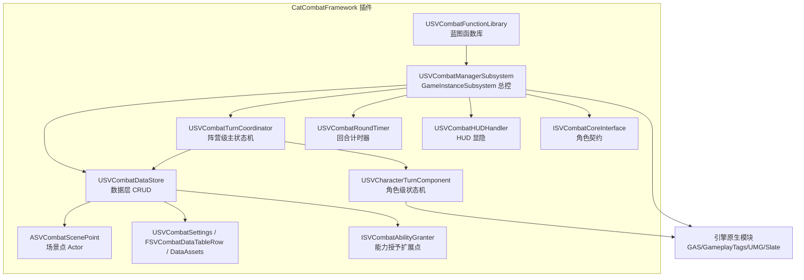

## 产品概述

新建一个名为"战斗框架"的 UE5 插件（模块名/文件夹名：**CatCombatFramework**），将源项目 `E:\SVN\SegameVictory\Source\SegameVictory` 中的回合制战斗框架（`Combat` 目录）移植到目标项目 `e:\UE_Project\UE5GameWork\GameWork\Plugins` 下。

移植采用**方案B（核心骨架 + 抽离外部依赖）**：保留回合制战斗的核心逻辑骨架（战斗管理器子系统、数据层、回合协调器、回合计时器、角色回合组件、配置资产、战斗场景点、蓝图函数库、战斗接口），对源项目专属的角色类、GAS 封装、UI 框架、AI 任务、相机类、结算回调等外部依赖做接口化/抽象化处理，最终产出一个仅依赖 UE 引擎原生模块的**独立可编译插件**。

由于抽离了源项目的强绑定行为（具体角色类、GAS 能力集封装、GameUIFramework、StateTree 敌人任务、剧情回调等），移植后的插件是"框架级"通用能力，具体角色/UI/AI 接线需在新项目中通过扩展点重新接入。

## 核心功能

- **回合制战斗核心状态机**：阵营级主状态机（`ECombatCampPhase`）与角色级状态机（`ECharacterTurnState`）双层调度，支持阵营切换、回合推进、行动收敛、全灭结算。
- **战斗生命周期管理**：`UGameInstanceSubsystem` 驱动的战斗开始/结束/回合推进/结算流程，含数据层 CRUD、回合计时（Ticker）、HUD 显隐联动。
- **战斗角色接口**：`ISVCombatCoreInterface`（死亡/入队/离队/回合开始），作为角色接入框架的统一契约。
- **可配置战斗**：数据表行（`FSVCombatDataTableRow`）+ 角色/相机配置资产（DataAsset）+ 战斗场景点 Actor（含编辑器站位预览与相机生成）。
- **蓝图函数库**：提供开战/结束/查询/行动请求（`RequestAction`）等蓝图可调用入口。
- **行动请求抽象**：统一的 `FActionRequest` 结构，玩家输入与 AI 决策统一产出，经 `RequestAction` 激活 GAS 能力。

## 视觉与表现（框架层保留的可视化能力）

- 战斗场景点 Actor 的编辑器内站位预览（玩家/敌人出生点可视化、相机预览）。
- 战斗 HUD 布局基类（改为继承 `UUserWidget`），提供显示/隐藏动画扩展入口（蓝图覆写）。

## 技术栈选择

- **引擎**：UE 5.8（与目标项目 `GameWork.uproject` 的 `EngineAssociation` 一致）。
- **语言/构建**：C++ + UnrealBuildTool，PCH 使用 `UseExplicitOrSharedPCHs`。
- **核心引擎模块依赖**（最终 Build.cs）：
- `Core`、`CoreUObject`、`Engine`、`InputCore`、`EnhancedInput`
- `GameplayAbilities`、`GameplayTags`、`GameplayTasks`（GAS 与标签）
- `UMG`、`Slate`、`SlateCore`（HUD 用户控件）
- `DeveloperSettings`（`USVCombatSettings`）
- `AIModule`（ACharacter 相关、后续 AI 扩展）
- **不依赖**：CommonUtility、GameUIFramework、GameplayMessageRuntime、StateTree 具体任务等源项目私有模块。

## 实现方案

### 总体策略

将源项目 `Public/Combat` 与 `Private/Combat` 的约 40 个文件整体搬迁到新插件，保持原有目录分层（`Action/ Actor/ AI/ Component/ DataAsset/ Turn/ Widget/`），对所有外部依赖做**最小侵入式抽象**：能保留逻辑原样的尽量保留，仅在类型引用处做接口化替换。新增一个日志分类定义文件与一个"战斗能力授予"扩展接口，用于替代源项目 GAS 能力集封装。

### 关键抽象设计

#### 1. 战斗角色抽象（替代 ASvCharacter / ASVEnemyBase / ASV_SeqCharacter）

- 保留 `ISVCombatCoreInterface`（`UINTERFACE(MinimalAPI, Blueprintable)`）作为战斗角色统一契约。
- 所有源项目强类型角色引用改为 `ACharacter*`，死亡判定通过 `ISVCombatCoreInterface::IsDeath` 接口调用（`SVCombatDataStore::IsTeamAllDead` 已采用此模式，保持）。
- `SVCombatFunctionLibrary::GetMainPlayerCombatCharacter` / `GetMainEnemyCombatCharacter` 返回类型从 `ASvCharacter*` / `ASVEnemyBase*` 改为 `ACharacter*`，通过 `Cast<ACharacter>` + 接口判定。
- 角色生成（`SVCombatDataStore::SpawnTeamCharacters`）改为 `World->SpawnActor<ACharacter>(CharacterClass, ...)`，其中 `CharacterClass` 为 `TSubclassOf<ACharacter>`。

#### 2. GAS 能力授予抽象（替代 USVAbilitySet / USVAbilitySystemComponent / USVGameplayAbility）

- 新增接口 `ISVCombatAbilityGranter`（`UINTERFACE(MinimalAPI)`）：声明 `void GrantCombatAbilities(UAbilitySystemComponent* ASC)`，由具体角色实现，用于生成后授予能力。
- `USVCombatCharacterDataAsset` 的 `TObjectPtr<USVAbilitySet> AbilitySet` 改为 `TSubclassOf<UGameplayAbility>` 数组（`TArray<TSubclassOf<UGameplayAbility>> GrantedAbilities`），并新增可选的能力标签配置，用于 `SVCharacterTurnComponent` 的攻/防标签初始化。
- `SVCombatDataStore::SpawnTeamCharacters` 中，能力授予改为：获取角色 ASC → 若角色实现 `ISVCombatAbilityGranter` 则调用之，否则遍历 DataAsset 的 `GrantedAbilities` 用 `ASC->GiveAbility` 授予。
- `SVCharacterTurnComponent.cpp` 中去掉 `SVGameplayAbility` 依赖，改用原生 `UAbilitySystemComponent` / `UGameplayAbility` 的 `GetCooldownTags`、`GetAssetTags`、`TryActivateAbility`、`CanActivateAbility` 等原生 API。

#### 3. UI 抽象（替代 GameUIFramework / GameplayMessageRuntime）

- `USVCombatHUDLayout` 基类从 `UGameUIHUDLayout` 改为 `UUserWidget`，保留 `PlayShowAnimation` / `PlayHideAnimation` / `PlayLoadAnimation` / `PlayUnloadAnimation` 四个 `BlueprintNativeEvent` 扩展点。
- `USVCombatHUDHandler` 重写 HUD 创建/销毁：
- 创建：`UUserWidget::CreateWidgetInstance`（软加载 `CombatHUDLayoutClass`）后 `AddToViewport`（或加入一个可配置的挂载层），初始 `Collapsed`。
- 销毁：`RemoveFromParent` 并重置软引用。
- 去掉 `UGameplayMessageSubsystem` 监听，改为对外暴露 `ShowHUD()` / `HideHUD()` 公共方法，由外部（蓝图或 C++）直接调用。
- `CombatHUDLayoutClass` 软类类型从 `USVCombatHUDLayout` 保持（现已继承 UUserWidget）。

#### 4. AI 抽象（替代 EnemyAttackTask / ASVEnemyBase / CharacterFunComponent / CombatInterface）

- 在插件内新定义 `FEnemyAttackTagWeight`（含 `FGameplayTag AttackTag` + `int32 Weight`），消除对 `AI/StateTree/Tasks/EnemyAttackTask.h` 的依赖。
- `USVCombatEnemyDecisionBridge::RequestEnemyAction` 入参从 `ASVEnemyBase*` 改为 `ACharacter*`，权重选择逻辑保留；冷却判定通过角色 ASC 的 `HasAnyMatchingGameplayTags`（原生 API）实现，去掉 `CharacterFunComponent` / `CombatInterface` 依赖。敌人"已释放技能池/攻击目标"等状态改由新增的敌人接口（如 `ISVCombatEnemyInterface`，提供 `GetAttackTargetActor`、`GetReleasedAttackTags`）或委托注入，默认空实现。

#### 5. 相机抽象（替代 ACombatCameraActor）

- `USVCombatCameraDataAsset` 的 `TSubclassOf<ACombatCameraActor>` 改为 `TSubclassOf<ACameraActor>`（`CinematicCamera` 模块可选，此处用引擎原生 `ACameraActor`）。
- `ASVCombatScenePoint` 中相机生成改为 `World->SpawnActor<ACameraActor>`，`GetMainCameraActor` 返回 `ACameraActor*`。
- `SVCombatDataStore::PossessMainPlayerCombatCharacter` 中的 `SetViewTargetWithBlend(ScenePoint->GetMainCameraActor())` 改为 `ACameraActor*`。

#### 6. 结算流程扩展点（替代 SVCommonData::SvPlayerController / UStoryComponent）

- `USVCombatManagerSubsystem` 新增动态多播委托 `FOnCombatSettled`（参数：`ECombatResultType Result`），在 `SettleCombat` 结算后广播；删除对 `SVCommonData` / `UStoryComponent` 的直接引用。
- 外部剧情/流程系统通过绑定该委托接入结算后续逻辑（解耦）。

#### 7. 玩家输入桥接（替代 ASvCharacter / UCombatMouseComponent）

- `USVCombatPlayerInputBridge::RequestPlayerAction` 入参改为 `ACharacter*`，保留现有占位实现（返回 false 并打日志），输入决策源由外部注入（新增可绑定委托或接口），迁移期实现。

### 日志分类（独立定义，不依赖 CommonUtility）

- 新增 `Source/CatCombatFramework/Public/CatCombatLog.h`（或在模块公共头内定义）：
- `DECLARE_LOG_CATEGORY_EXTERN(LogCatCombatManager, Log, All)`
- `LogCatCombatDataStore`、`LogCatCombatCoordinator`、`LogCatCombatAI`、`LogCatCombatInput`、`LogCatCombatHUD`
- 对应 `.cpp` 中 `DEFINE_LOG_CATEGORY`。
- 全量替换源文件中的 `#include "LogCommonUtility.h"` 为 `#include "CatCombatLog.h"`，并将 `LogSVCombatManager` 等分类名替换为 `LogCatCombatManager` 等。

## 实现注意事项

- **Include 路径统一**：源文件头文件中 `#include "Combat/..."` 的路径在新插件中保持 `Combat/...` 不变（Public/Combat 结构保留），仅将模块 API 宏 `SEGAMEVICTORY_API` 全量替换为 `CATCOMBATFRAMEWORK_API`。
- **模块 API 宏替换**：所有 `.h` 中 `class SEGAMEVICTORY_API` → `class CATCOMBATFRAMEWORK_API`；`struct SEGAMEVICTORY_API` 同理。
- **生成头**：`#include "X.generated.h"` 保持不变，UHT 自动处理。
- **爆炸半径控制**：不修改目标项目现有 `GameWork` 主模块、`Variant_Combat` 及其他插件；新增插件完全独立。保留源项目原有逻辑与注释，仅在依赖点做抽象替换，避免无关重构。
- **性能**：核心逻辑为回合制（非高频热路径），数据层已用 `TWeakObjectPtr` / `TMap` 缓存；HUD 软加载、场景点配置表缓存保持源项目现有优化（`CachedConfigTable` 弱引用缓存、`CachedASC` 缓存）。
- **日志**：统一走插件内 `LogCatCombat*` 分类，避免日志刷屏（保留源项目 Verbose/Warning/Log 级别语义）。

## 架构设计



## 目录结构

```
e:\UE_Project\UE5GameWork\GameWork\Plugins\CatCombatFramework\
├── CatCombatFramework.uplugin                    # [NEW] 插件描述符，模块名 CatCombatFramework，Type=Runtime
├── Source\CatCombatFramework\
│   ├── CatCombatFramework.Build.cs               # [NEW] 模块构建脚本，声明引擎模块依赖
│   ├── CatCombatFramework.h                      # [NEW] 模块入口头文件
│   ├── CatCombatFramework.cpp                    # [NEW] 模块入口实现（IMPLEMENT_MODULE）
│   ├── Public\
│   │   ├── CatCombatLog.h                        # [NEW] 独立日志分类声明
│   │   └── Combat\
│   │       ├── SVCombatTypes.h                   # [MODIFY] 枚举/结构体/委托，API 宏替换
│   │       ├── SVCombatCoreInterface.h           # [MODIFY] 角色接口，API 宏替换
│   │       ├── SVCombatManagerSubsystem.h        # [MODIFY] 结算委托扩展点，API 宏替换
│   │       ├── SVCombatDataStore.h               # [MODIFY] API 宏替换
│   │       ├── SVCombatRoundTimer.h              # [MODIFY] API 宏替换
│   │       ├── SVCombatHUDHandler.h              # [MODIFY] 去消息监听，暴露 Show/Hide
│   │       ├── SVCombatFunctionLibrary.h         # [MODIFY] 返回类型改 ACharacter*
│   │       ├── SVCombatSettings.h                # [MODIFY] API 宏替换
│   │       ├── SVCombatDataTable.h               # [MODIFY] API 宏替换
│   │       ├── SVAsyncAction_DelayUnscaled.h     # [MODIFY] API 宏替换
│   │       ├── SVCombatAbilityGranter.h          # [NEW] 能力授予接口
│   │       ├── Action\SVCombatPlayerInputBridge.h    # [MODIFY] 入参改 ACharacter*
│   │       ├── Actor\SVCombatScenePoint.h        # [MODIFY] 相机类型改 ACameraActor
│   │       ├── AI\SVCombatEnemyDecisionBridge.h  # [MODIFY] 敌人抽象 + 重定义权重结构
│   │       ├── Component\SVCharacterTurnComponent.h  # [MODIFY] 去 GAS 封装依赖
│   │       ├── DataAsset\SVCombatCameraDataAsset.h   # [MODIFY] 相机类改 ACameraActor
│   │       ├── DataAsset\SVCombatCharacterDataAsset.h # [MODIFY] AbilitySet 改能力数组
│   │       ├── Turn\SVCombatTurnCoordinator.h    # [MODIFY] API 宏替换
│   │       └── Widget\SVCombatHUDLayout.h        # [MODIFY] 基类改 UUserWidget
│   └── Private\
│       ├── CatCombatLog.cpp                      # [NEW] 日志分类定义
│       └── Combat\
│           ├── SVCombatCoreInterface.cpp         # [MODIFY] include 路径/日志替换
│           ├── SVCombatManagerSubsystem.cpp      # [MODIFY] 结算抽离 + 日志替换
│           ├── SVCombatDataStore.cpp             # [MODIFY] 角色生成/能力授予抽象
│           ├── SVCombatRoundTimer.cpp            # [MODIFY] 日志替换
│           ├── SVCombatHUDHandler.cpp            # [MODIFY] HUD 创建/销毁重写
│           ├── SVCombatFunctionLibrary.cpp       # [MODIFY] 类型抽象 + 去 StopPlayerAction 依赖
│           ├── SVAsyncAction_DelayUnscaled.cpp   # [MODIFY] include 路径替换
│           ├── Action\SVCombatPlayerInputBridge.cpp  # [MODIFY] 抽象
│           ├── Actor\SVCombatScenePoint.cpp      # [MODIFY] 相机抽象
│           ├── AI\SVCombatEnemyDecisionBridge.cpp    # [MODIFY] 敌人抽象
│           ├── Component\SVCharacterTurnComponent.cpp # [MODIFY] 原生 ASC
│           ├── DataAsset\SVCombatCameraDataAsset.cpp  # [MODIFY] 基本无逻辑变更
│           ├── DataAsset\SVCombatCharacterDataAsset.cpp # [MODIFY] 基本无逻辑变更
│           ├── Turn\SVCombatTurnCoordinator.cpp  # [MODIFY] 日志替换
│           └── Widget\SVCombatHUDLayout.cpp      # [MODIFY] 基类适配
```

## 关键代码结构（接口级）

```cpp
// 战斗能力授予接口（新增，替代 SVAbilitySet 强依赖）
UINTERFACE(MinimalAPI)
class USVCombatAbilityGranter : public UInterface { GENERATED_BODY() };

class CATCOMBATFRAMEWORK_API ISVCombatAbilityGranter
{
    GENERATED_BODY()
public:
    virtual void GrantCombatAbilities(UAbilitySystemComponent* ASC) = 0;
};

// 敌人决策权重结构（新增，替代 EnemyAttackTask 依赖）
USTRUCT(BlueprintType)
struct FEnemyAttackTagWeight
{
    GENERATED_BODY()
    UPROPERTY(EditAnywhere, BlueprintReadWrite) FGameplayTag AttackTag;
    UPROPERTY(EditAnywhere, BlueprintReadWrite, meta = (ClampMin = "0")) int32 Weight = 1;
};

// 结算扩展委托（新增，替代 UStoryComponent 强依赖）
DECLARE_DYNAMIC_MULTICAST_DELEGATE_OneParam(FOnCombatSettled, ECombatResultType, Result);
```

## Agent Extensions

### Skill

- **plugins-and-modules**
- 用途：确保 `.uplugin` 描述符、`*.Build.cs` 模块依赖与目录结构符合 UE5 插件规范。
- 预期结果：生成正确可被引擎识别的插件描述文件与模块构建配置。
- **gameplay-ability-system**
- 用途：正确使用引擎原生 GAS API（`UAbilitySystemComponent`、`UGameplayAbility`、`GiveAbility`、`TryActivateAbility` 等）替代源项目 `SVAbilitySet`/`SVAbilitySystemComponent` 封装。
- 预期结果：能力授予与激活逻辑使用原生 GAS 接口，编译通过且语义等价。
- **subsystems**
- 用途：确保 `USVCombatManagerSubsystem`（`UGameInstanceSubsystem`）的生命周期（Initialize/Deinitialize/ShouldCreateSubsystem）与持有子对象模式正确。
- 预期结果：战斗管理器子系统符合引擎子系统规范，初始化/反初始化正确。
- **umg-and-slate**
- 用途：正确将 `USVCombatHUDLayout` 改为继承 `UUserWidget`，并用原生 API 实现 HUD 创建/销毁。
- 预期结果：HUD 基类与处理器脱离 GameUIFramework 依赖，可独立编译运行。