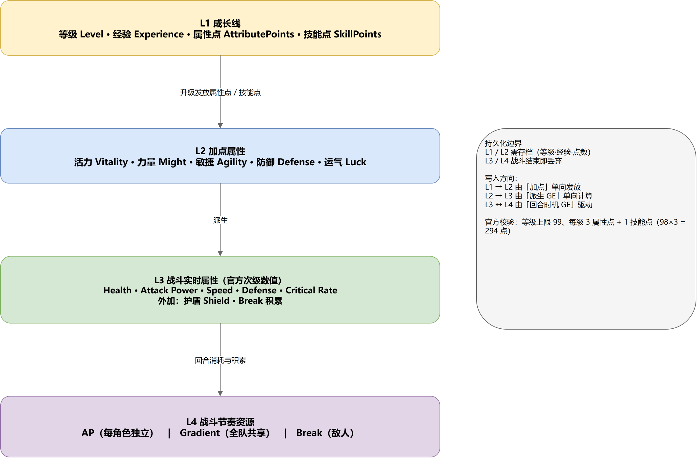
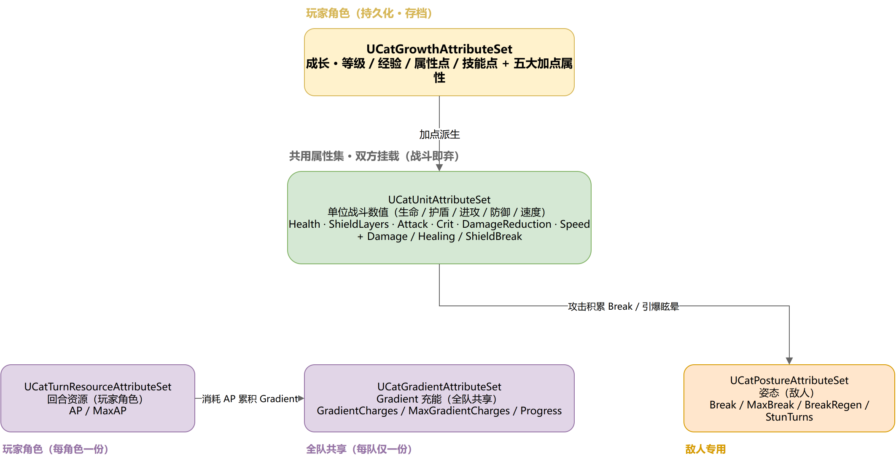
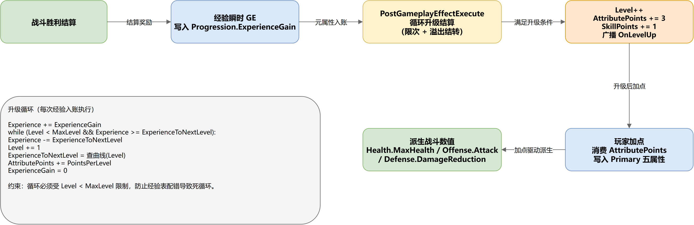

# 《33号远征队》风格属性集分类设计

> 目标：参考《33号远征队》(Clair Obscur: Expedition 33) 的数值模型，为项目设计一套 `UAttributeSet` 分类。
>
> 落地位置：`GameWork/Source/GameWork/AbilitySystem/AttributeSet/`
> 前置条件：`GameWork.Build.cs` 已加入 `GameplayAbilities` / `GameplayTags` / `GameplayTasks`；属性写法沿用项目《04 | AttributeSet》的沉淀，即 `FGameplayAttributeData` + 宏访问器 + 六回调 + 元属性模式。
>
> 更新：2026-09-11

---

## 一、为什么先分类

把生命、攻击、AP、Break 都塞进同一个 `UAttributeSet`，很快会遇到三种冲突。

生命周期不一样。等级和经验要跨战斗留着，AP 每回合重置，受伤量只是一次性的中间值。混在一张表里，存档和重置会互相踩脚。

归属不一样。AP 属于玩家角色，Gradient 属于整支队伍，Break 属于敌人。合并之后只能靠「这个值是不是 0」判断「有没有这个东西」，语义就糊了。

读取者不一样。血条只要生命，行动顺序条只要速度，战轮只要 AP。拆开之后每个系统只依赖自己那一份，边界自然出来。

这份设计不追求把属性列全，先按生命周期和归属划边界，再往里填。

---

## 二、33 的数值模型



*图 1：从成长线到节奏资源的四层数值模型*

| 层 | 内容 | 变化频率 | 持久化 |
|---|---|---|---|
| L1 成长线 | 等级、经验、可分配属性点 | 升级时 | 是 |
| L2 加点属性 | 活力、力量、敏捷、防御、运气 | 加点或换装时 | 是 |
| L3 战斗实时属性 | 生命、护盾、攻击、速度、减伤、暴击 | 每次结算 | 否 |
| L4 战斗节奏资源 | AP（每角色）、Gradient（全队）、Break（敌人） | 每回合或每次出手 | 否 |

官方把面板上的五个次级数值并列：Health、Attack Power、Speed、Defense、Critical Rate。它们由五个加点属性派生，彼此还有少量交叉加成：敏捷顺带给一点防御，防御顺带给一点暴击率，运气顺带给一点速度。这些换算走 GE 或 ExecCalc，属性集只存结果。

资源部分，AP 每角色独立，普攻 +1、每次格挡 +1、技能消耗 3~7 点。Gradient 全队共享，靠消耗 AP 施放技能累积，攒满一段得到 1 个 Gradient Charge。Break 是敌人血条下方的独立条，与护盾不是一套东西。

---

## 三、分类总览

判据只有一条：**挂载对象、阵营、持久化与重置时机，三条全同就合并，任意一条不同就独立。**

| 属性集 | 层 | 职责 | 属性 | 元属性 | 挂载 |
|---|---|---|---|---|---|
| `UCatGrowthAttributeSet` | L1+L2 | 成长 | Level、MaxLevel、Experience、ExperienceToNextLevel、AttributePoints、SkillPoints、Vitality、Might、Agility、Defense、Luck | ExperienceGain | 玩家角色（敌人可选） |
| `UCatUnitAttributeSet` | L3 | 单位战斗数值 | Health、MaxHealth、ShieldLayers、MaxShieldLayers、Attack、CritRate、CritDamage、DamageMultiplier、BreakPower、DamageReduction、ParryEfficiency、DodgeEfficiency、Speed | Damage、Healing、ShieldBreak | 双方 |
| `UCatTurnResourceAttributeSet` | L4 | 回合资源 | AP、MaxAP | 无 | 玩家角色 |
| `UCatGradientAttributeSet` | L4 | 终极资源 | GradientCharges、MaxGradientCharges、GradientProgress | 无 | 每队一份 |
| `UCatPostureAttributeSet` | L4 | 破防姿态 | Break、MaxBreak、BreakRegen、StunTurns | 无 | 敌人 |



*图 2：五个属性集及依赖关系*

### 判据是怎么落到这五个上的

`Growth` 和 `Unit` 都挂在角色身上，但阵营和持久化都不同：前者只给玩家、要存档，后者双方共用、战斗结束即弃。

`TurnResource` 与 `Unit` 的分歧在阵营和重置时机：AP 只属于玩家角色，而且每回合重置一次。把它并进 `Unit`，敌人身上就会多出两个恒为 0 的属性，而「回 AP」这类 GE 还得靠配置约定不发给敌人。

`Posture` 与 `Unit` 的分歧在阵营：Break 只属于敌人。并进去的话，玩家角色身上会挂一条永远为 0 的 Break 条，UI 也没法再用「有没有这个集」来判断要不要画。

`Gradient` 与所有其它集的分歧在挂载对象：它是队伍级的，一队一份。并进任何一个角色集，就会变成「每个队员各有一份」，与官方的共享分段条对不上。

单文件内属性变多带来的阅读成本，靠分组和拆私有函数压住，见 4.2。

---

## 四、逐类设计

### 4.1 成长属性集 `UCatGrowthAttributeSet`（玩家角色）

等级、经验、点数和五个加点属性放在一起。这样「经验发点」和「加点写属性」在同一集内完成，不需要约定两个集的初始化顺序；存档也能整集序列化，战斗属性不在这里，不会把残血存进去。

#### 等级与经验

| 属性 | 说明 |
|---|---|
| `Level` | 当前等级，范围 `[1, MaxLevel]` |
| `MaxLevel` | 等级上限，默认 99 |
| `Experience` | 当前等级内已积累的经验 `[0, 下一级所需)` |
| `ExperienceToNextLevel` | 升到下一级所需经验 |
| `AttributePoints` | 未分配加点，每级发 3 点 |
| `SkillPoints` | 未分配技能点，每级发 1 点 |
| `ExperienceGain` | 元属性，经验入账，结算后清零 |

升级结算在 `PostGameplayEffectExecute` 里分发到 `ResolveExperienceGain()`。经验可能一次跨多级，所以这里是个循环：

```
Experience += ExperienceGain
while (Level < MaxLevel && Experience >= ExperienceToNextLevel):
    Experience -= ExperienceToNextLevel
    Level += 1                                   // PostAttributeChange 里广播 OnLevelUp
    ExperienceToNextLevel = 查曲线(Level)          // 或线性兜底公式
    AttributePoints += PointsPerLevel            // 3
    SkillPoints     += SkillPointsPerLevel       // 1
ExperienceGain = 0                               // 元属性用后即焚
```

有三处容易写错的地方。

循环必须同时受 `Level < MaxLevel` 约束。如果经验表配错了，比如某级的所需经验是 0，只靠 `Experience >= ExperienceToNextLevel` 会死循环。代码里另外加了 128 次迭代上限，命中时打一条 Warning。

经验要结转，不能清零。一次给 500 点、升级只要 100 点，剩下 400 点得留下，否则玩家白打。

`ExperienceToNextLevel` 优先由曲线或 DataTable 驱动。缺表时用「基础值 + 每级增量」的线性公式兜底，不要把一串数字硬编码在代码里。

等级上限 99、每级 3 点属性点，意味着全程 98 次升级共 294 点，与官方数值一致。

#### 加点属性

| 属性 | 说明 | Clamp | 默认 |
|---|---|---|---|
| `Vitality` | 活力，派生最大生命 | `>= 0` | 10 |
| `Might` | 力量，派生攻击力 | `>= 0` | 10 |
| `Agility` | 敏捷，派生速度与行动顺序 | `>= 0` | 10 |
| `Defense` | 防御，派生减伤率 | `>= 0` | 10 |
| `Luck` | 运气，派生暴击率等收益 | `>= 0` | 10 |

`AttributePoints` 由玩家在加点界面消费，写回本集内的这五个属性；`SkillPoints` 用于解锁和升级技能。

这里特意没有让派生减伤率也叫 `Defense`。加点属性 `Defense` 和结算用的减伤率是两层概念，同名会让伤害公式读错来源，所以后者叫 `DamageReduction`。

整集随存档保留，战斗实时属性不在其中。

### 4.2 单位战斗数值集 `UCatUnitAttributeSet`（玩家 + 敌人）

一个单位在战斗中的全部次级数值。官方并列的那五个（Health、Attack Power、Speed、Defense、Critical Rate）在这里被完整覆盖，伤害结算的输出端和承伤端也在同一个集里，读属性不用跨集跳。

单文件属性多，所以内部按五个分组组织，回调只做分发，实际规则进各自的私有函数。

| 分组 | 属性与 Clamp | 处理函数 |
|---|---|---|
| 生命 | `Health` `[0, MaxHealth]`，`MaxHealth` `>= 1` | `ClampVital()` |
| 护盾 | `ShieldLayers` `[0, MaxShieldLayers]`，`MaxShieldLayers` `>= 0` | `ClampVital()` |
| 进攻 | `Attack` `>= 0`，`CritRate` `[0,1]`，`CritDamage` `>= 1`，`DamageMultiplier` `>= 0`，`BreakPower` `>= 0` | `ClampOffense()` |
| 防御 | `DamageReduction` `[0,1]`，`ParryEfficiency` `>= 0`，`DodgeEfficiency` `>= 0` | `ClampDefense()` |
| 行动 | `Speed` `>= 0` | `ClampDefense()` |
| 元属性 | `Damage`、`Healing`、`ShieldBreak`，结算后清零 | `ResolveDamage()`、`ResolveHealing()`、`ResolveShieldBreak()` |

默认值：`Health` 与 `MaxHealth` 各 100，`Attack` 10，`CritRate` 0.05，`CritDamage` 1.5，`DamageMultiplier` / `BreakPower` / `ParryEfficiency` / `DodgeEfficiency` 各 1.0，`Speed` 100，其余为 0。

#### 生命的元属性模式

GE 不直接写 `Health`，而是往 `Damage` 和 `Healing` 写中间量，由属性集换算成生命值后立刻清零元属性。这样 `Health` 的写入者只有属性集自己。好处不止是数据流单向：`PostGameplayEffectExecute` 拿得到完整的 `FGameplayEffectModCallbackData`，知道谁打的、打了多少，多个伤害来源同时结算也不会互相覆盖。

#### 护盾用的是层数，不是血池

护盾是血条上的盾牌图标，按层计。有盾的目标完全免疫伤害，而且只有瞄准射击（Aim Shot）能削掉它，普通攻击和技能打不动。Gradient Attack 里的「Tremor」这类技能则可以一次性移除全部护盾。护盾和 Break 是两套独立系统，别混在一起。

免伤判定不放在属性集里。属性集只提供 `ShieldLayers` 这个状态，伤害结算时读它：如果层数大于 0 且来源不是瞄准射击，伤害归零。规则集中在一处，不用每个技能各写一遍。

#### 几个 Clamp 上的约定

乘算类的默认值必须是乘法单位元。`CritDamage` 给 1.5（官方基础游戏固定 +50% 伤害，不随属性成长，留成属性是为了让 Pictos 能改它），`DamageMultiplier`、`ParryEfficiency`、`DodgeEfficiency` 给 1.0。给 0 的话，不配任何加成的角色就会算出错误数值。

`CritRate` 和 `DamageReduction` 的上限锁在 1。暴击率超过 100% 没有意义；减伤超过 100% 会让伤害变成负数，等于治疗敌人。

`MaxHealth` 和 `MaxShieldLayers` 只保下限，不设上限，否则「加生命上限」这类玩法会失效。

#### 关于 Speed 的一处已知分歧

Speed 由敏捷主、运气次派生，具体换算走派生 GE。它影响每回合的出手次数，这点没有争议。是否有影响行动顺序，资料里有两种说法：一份官方指南称顺序由队伍排列决定，速度只决定出手次数；玩家实测的说法是排列只决定第一轮，速度会影响后续轮次的行动频率，甚至能连续行动。

项目暂时按「速度参与行动顺序计算」处理，因为 `USVCombatTurnCoordinator` 排 Timeline 时需要读它。如果实机验证后确认无关，把读取点去掉就行，属性本身不受影响。

#### 官方数值与本设计的对应关系

官方面板上的 Defense 是一个数值型 rating（99 点防御约合 +547 防御值和 +18% 暴击率），再由公式换算成减伤比例。本设计直接暴露最终的减伤率 `[0,1]`，rating 到比例的换算交给 ExecCalc，语义等价但更贴近结算端。

`DamageMultiplier`、`BreakPower`、`ParryEfficiency`、`DodgeEfficiency` 在官方 UI 里没有对应项，是本项目的实现层系数。前两个分别承接 Mark（单次受伤 +50%）和 Berserk（每层 +5% 伤害，最多 12 层）这类状态。

格挡和闪避的判定窗口（约 100~150ms 和约 400ms）属于操作层参数，不进属性集。属性集只表达收益，窗口时长由技能和动画配置。

#### 回调职责与委托

| 回调 | 做什么 |
|---|---|
| `PreAttributeChange` / `PreAttributeBaseChange` | 共用 `ClampAttribute()`，分发到 `ClampVital()`、`ClampOffense()`、`ClampDefense()` |
| `PostGameplayEffectExecute` | 只做分发，转给三个 `Resolve*()` |
| `PostAttributeChange` | 上限被压低时修正当前值；派生 `bOutOfHealth`；广播生命、倒地、护盾层数、破盾、速度 |

委托有五个：`OnHealthChanged`、`OnOutOfHealth`、`OnShieldLayersChanged`、`OnShieldBroken`、`OnSpeedChanged`。

倒地标记、护盾层数和速度广播都放在 `PostAttributeChange` 里，而不是 `PostGameplayEffectExecute`。这条回调覆盖所有写入路径，包括 GE 结算、直接调 `SetNumericAttributeBase`、叠层变化，不会漏掉任何一种。

### 4.3 回合资源属性集 `UCatTurnResourceAttributeSet`（玩家角色）

| 属性 | 说明 | Clamp | 默认 |
|---|---|---|---|
| `AP` | 当前行动点 | `[0, MaxAP]` | 0 |
| `MaxAP` | 行动点上限，也就是点格数 | `>= 0` | 5 |

AP 每角色独立，显示在角色头像下方。收支大致是：

| 来源 | AP |
|---|---|
| 普通攻击 | +1 |
| 每次成功格挡 | 每次被挡下的命中 +1 |
| 部分 Pictos 或 Lumina（Dodger、Perilous Parry 等） | +1 |
| 道具 Energy Tint | 给单个盟友 +3 或更多 |
| 技能 | −3 ~ −7 |
| 瞄准射击 | 每次 −1 |

设计意图是把防守表现变成进攻资源。格挡得越多，能用的技能越多。它独立成集的原因不是属性多，而是「每回合重置」和「仅玩家」这两条边界。

### 4.4 Gradient 属性集 `UCatGradientAttributeSet`（每队一份）

| 属性 | 说明 | Clamp | 默认 |
|---|---|---|---|
| `GradientCharges` | 已攒满的 Gradient 充能数（GC） | `[0, MaxGradientCharges]` | 0 |
| `MaxGradientCharges` | 充能上限 | `>= 0` | 3 |
| `GradientProgress` | 当前正在积攒那一段的进度 | `[0, 1]` | 0 |

挂载约定是硬性的：**每队只有一份**，挂在队伍共享的 ASC 上（队伍或队长 Actor），不要挂到单个角色。官方把它做成队伍头像框下方的共享分段条，一队一池。

运行方式：消耗 AP 施放技能累积进度，攒满一段得到 1 GC；Gradient Attack 按 1GC / 2GC / 3GC 计价，Gradient Counter 也吃这一池。用 Gradient Attack 不会结束回合，相当于一回合出两次手。因为进攻终极技和保命反击共用同一个池，花在哪边是团队决策。

官方没有给出 GC 上限，这里按最高消耗 3GC 取默认 3，可配。

### 4.5 姿态属性集 `UCatPostureAttributeSet`（敌人专用）

| 属性 | 说明 | Clamp | 默认 |
|---|---|---|---|
| `Break` | 已积累的 Break 值 | `[0, MaxBreak]` | 0 |
| `MaxBreak` | Break 上限 | `>= 1` | 100 |
| `BreakRegen` | 每回合自然回复量 | `>= 0` | 0 |
| `StunTurns` | 引爆后眩晕的剩余回合 | `>= 0` | 0 |

这个系统分两段。敌人每次受到伤害都会填充血条下方的黄色 Break 条，这一步不需要特定条件。但打满还不够，必须用带「Can Break」标记的技能命中，才真正进入 Broken 状态，施加 Stun，部分敌人还会暴露弱点。

所以属性集只负责第一段：把 `Break` 顶到 `MaxBreak` 时置 `bBreakReady` 并广播 `OnBreakReady`。第二段的引爆由带标记的技能写 `StunTurns`。这套两段式跟官方一致，也让姿态特化技能有了独立于面板伤害的价值。

因为 Broken 的效果是 Stun，行动相关的处理可以直接复用项目已有的 `State.Stunned` 状态标签。

官方没有给出 Break 条的具体数值，`MaxBreak = 100` 是本项目自定的基准。来源里只提到一处量化线索：Monoco 的 Ramasseur Bonk 在 Agile Mask 下能一次填充 20%。

---

## 五、挂载组合

阵营差异靠挂载组合实现，而不是在同一张表里用 0 值区分。

| 挂载 | Growth | Unit | TurnResource | Gradient | Posture |
|---|---|---|---|---|---|
| 玩家角色 | ✓ | ✓ | ✓ | 由队伍共享 | — |
| 普通敌人 | — | ✓ | — | — | ✓ |
| 精英 / Boss | 可选，仅用于强度缩放 | ✓ | — | — | ✓ |
| 队伍共享 ASC | — | — | — | ✓ | — |

这张表本身就是规格，没有哪个单位会挂着用不到的属性。敌人如果挂 `Growth`，只用来按等级缩放数值，不显示经验也不发点数。

---

## 六、成长线



*图 3：战斗结算 → 经验入账 → 升级 → 加点 → 派生战斗数值*

一次完整的流转是：战斗结算时用瞬时 GE 往 `Growth.ExperienceGain` 写经验；`ResolveExperienceGain()` 结算升级，`Level` 递增并广播 `OnLevelUp`，同时发出属性点和技能点；玩家在加点界面把点数投进 `Growth` 内的五个属性；加点值配合装备，通过 GE 派生出 `Unit` 里的最大生命、攻击、速度、减伤等。

升级不直接改战斗数值，是因为加点得给玩家选择权。如果升级自动加满生命，五个属性就成了摆设。成长线只发资源，战斗数值只读成长结果，中间隔一层玩家决策。

---

## 七、六回调职责

沿用项目《04 | AttributeSet》的分工，没有引入新模式。

| 回调 | 何时触发 | 放什么 | 不放什么 |
|---|---|---|---|
| `PreGameplayEffectExecute` | GE 执行前，可否决 | 免疫、无敌 | 数值 Clamp |
| `PostGameplayEffectExecute` | GE 执行后，只读 | 元属性换算、死亡与升级判定 | 其它业务 |
| `PreAttributeBaseChange` | BaseValue 写入前，const | Clamp，与下面共用规则 | 触发游戏事件 |
| `PostAttributeBaseChange` | BaseValue 写入后，const | 派生重算 | 业务结算 |
| `PreAttributeChange` | CurrentValue 写入前 | Clamp，与上面共用同一规则 | 需要 GE 上下文的判断 |
| `PostAttributeChange` | CurrentValue 写入后 | 连带修正、倒地与复活复位、升级广播 | 依赖来源信息的判断 |

一句话：Pre 层负责改得对，Post 层负责看得见。越靠后的回调触发越频繁，能拿到的上下文也越少。

五个属性集都继承 `UCatAttributeSetBase`（`AbilitySystem/AttributeSet/CatAttributeSetBase.h`），基类做两件事。一是把 `PreAttributeChange` 和 `PreAttributeBaseChange` 收敛成一次虚函数调用，子类只实现一个 `ClampAttribute`，Base 层和 Current 层不会漂移。二是提供 `ClampCurrentValueToMax()`，处理上限被压低时把当前值 Override 到新上限，`Health` 对 `MaxHealth`、`AP` 对 `MaxAP` 都能复用。

子类因此只需要写属性定义、Clamp 规则和结算回调。

---

## 八、与 GE 和回合时机的配合

项目的 GAS 插件已经做过回合制和多时间轴改造（`GAS_MOD_05~13`），属性集只是数据层，什么时候变全靠 GE 挂时机。

| 需求 | GE 的 `Timing` | 对应属性 |
|---|---|---|
| AP 每回合回复、Break 自然衰减 | `TimeAxis.Round.Start` | `TurnResource.AP`、`Posture.Break` |
| 持续 Buff 递减 | `TimeAxis.Round.End` | `Unit.DamageMultiplier`，以及 Berserk 这类状态 |
| 护盾层数，不按回合衰减，只被瞄准射击削减 | 不挂时机，由 Aim Shot 命中时写 `ShieldBreak` | `Unit.ShieldLayers` |
| 格挡成功回 1 点 AP | `TimeAxis.Action.Defense` | `TurnResource.AP` |
| 攻击命中积累 Break | `TimeAxis.Action.Attack` | `Posture.Break` |
| 技能消耗 AP 时推进 Gradient | `TimeAxis.Action`，任意出手 | `Gradient.GradientProgress`、`GradientCharges` |
| 经验入账 | `Instant` 瞬时 GE | `Growth.ExperienceGain` |

推进统一走 `FAbilityTimerManager::TickTimeline(ASC, Timing, Delta)`。属性集不关心时间，它只接受 GE 写进来的值。

---

## 九、持久化与初始化

只有 `Growth` 需要随存档保留，走 SaveGame 或 PlayerState，而且能整集序列化，不必逐属性挑选。`Unit`、`TurnResource`、`Gradient`、`Posture` 都是战斗实时状态，战斗结束就丢，残血不会被写进存档。

初始化用构造函数写默认值，另外预留了 `FAttributeSetInitter` 和 CurveTable 的按等级初始化接口，方便后续接 `USVCombatCharacterDataAsset`。

挂载顺序是先 `Growth` 再 `Unit`，因为 `Unit` 里的数值由加点派生。`Growth` 内部的「等级 → 发点 → 加点」全在同一集内，不涉及跨集顺序。

---

## 十、设计取舍

### 元属性解决了什么

直接让 GE 改 `Health` 有个不容易发现的问题：多个伤害来源同时结算时，分不清谁打的、打了多少。元属性把需求值和落点值分开，GE 只写 `Damage`，属性集统一换算。`Health` 的写入者唯一，上下文又完整，避免了「几个技能各改一半、最后数值对不上」这类问题。

### 为什么 Break 归敌人、AP 归玩家

它们的时间语义不一样。AP 是决策资源，回合内可以反复消费，决定了这回合能做几件事；Break 是姿态进度，跨回合累积，只增不减直到被引爆。把这两种语义塞进同一张表，重置逻辑会互相干扰，回合开始重置 AP 时很容易顺手把敌人的 Break 也清了。

### 边界

本设计不含元素抗性和 Pictos / Lumina 派生属性。元素系统在官方是真实存在的（七种元素，四种亲和），但属于后续扩展，可以单开一个属性集，不影响现有五类。

格挡和闪避的判定窗口参数不在这里，归技能配置。

护盾和生命虽然在同一个集里，仍然不互相下沉伤害。护盾归零后是否继续扣血，由攻击方的 GE 序列决定，属性集不替玩法做决定。

---

## 十一、落地清单

| 文件 | 类 | 说明 |
|---|---|---|
| `AbilitySystem/AttributeSet/CatAttributeSetBase.h/.cpp` | `UCatAttributeSetBase` | 公共基类，收敛 Pre 层并提供 `ClampCurrentValueToMax` |
| `AbilitySystem/AttributeSet/CatGrowthAttributeSet.h/.cpp` | `UCatGrowthAttributeSet` | 等级、经验、点数与五个加点属性，含升级结算 |
| `AbilitySystem/AttributeSet/CatUnitAttributeSet.h/.cpp` | `UCatUnitAttributeSet` | 生命、护盾、进攻、防御、速度，五个分组，回调按组拆分 |
| `AbilitySystem/AttributeSet/CatTurnResourceAttributeSet.h/.cpp` | `UCatTurnResourceAttributeSet` | AP 与上限 |
| `AbilitySystem/AttributeSet/CatGradientAttributeSet.h/.cpp` | `UCatGradientAttributeSet` | Gradient 充能，每队一份 |
| `AbilitySystem/AttributeSet/CatPostureAttributeSet.h/.cpp` | `UCatPostureAttributeSet` | Break 与眩晕，敌人专用 |

所有类都遵循同一套写法：`FGameplayAttributeData` 存值，`ATTRIBUTE_ACCESSORS_BASIC` 生成访问器，数值约束统一走基类的 `ClampAttribute`。

项目暂时不做多人，所以没有写复制相关的代码。将来要联网时，给需要同步的属性补上 `ReplicatedUsing`、`OnRep_*` 和 `GetLifetimeReplicatedProps` 即可，属性定义和回调结构不用动。

---

## 十二、待验证与后续扩展

### 官方存在但暂未覆盖

元素亲和是真实系统，七种元素（冰、光、暗、地、火、雷、物理）各有弱点、抗性、无效、吸收四种状态，数值分别对应受伤 +50%、−50%、归零和回血。需要时单开 `UCatElementResistanceAttributeSet`。

状态效果官方有 15 项，包括 Freeze、Stun、Mark、Berserk、Exhausted、Burn、Barbapapa 等。这些不建议做成属性，用 `State.*` 标签加 GE 承载更合适。比如 Exhausted 的效果是「无法从任何来源获得 AP」，用标签封锁获取即可，不必去改 AP 上限。

### 需要实机或补资料确认

- Speed 是否影响行动顺序。目前两种说法并存，已按「参与顺序计算」实现。
- Break 条的具体数值。官方只给出过「Ramasseur Bonk 在 Agile Mask 下填充 20%」这一处线索，`MaxBreak = 100` 是自定基准。
- 玩家是否会被 Break。现有资料只讨论「Break Enemies」，本设计按仅敌人处理。
- 运气是否影响状态效果的施加概率。只有单一来源提过，Game8 的状态效果页完全没提，所以没有写进代码。若确认成立，可以在 `Unit` 集加一个 `StatusChance`。
- Gradient 的 GC 上限，当前按最高消耗 3GC 取默认 3。
- AP 上限，当前自定 5，技能单次消耗在 3~7 之间。

### 其它

- 敌人是否也挂 `Growth`，目前按可选处理，仅用于精英强度缩放。
- 加点没有硬上限。官方单属性的软上限在 15~200 之间浮动，等级上限 99。需要时在 `UCatGrowthAttributeSet::ClampPrimary` 里加。
- 角色专属机制（Overcharge、Foretell、Perfection、Stain、Rank、Mask、Charges）不进通用属性集，由各角色的 Ability 和状态标签承载。
