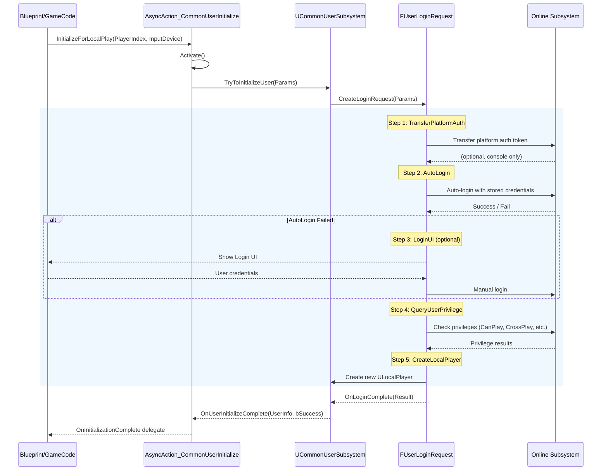
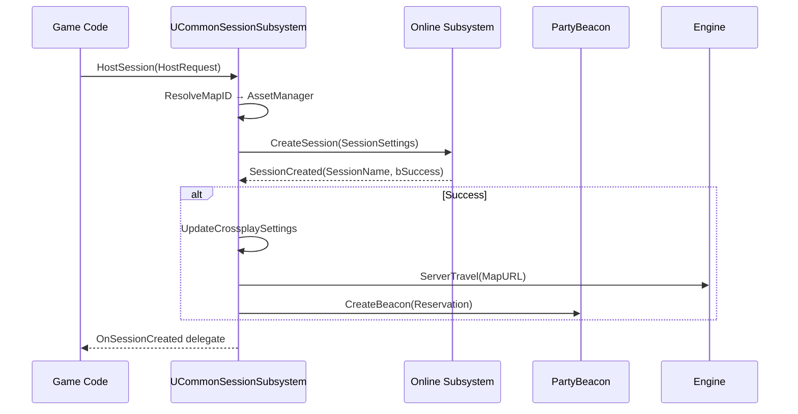
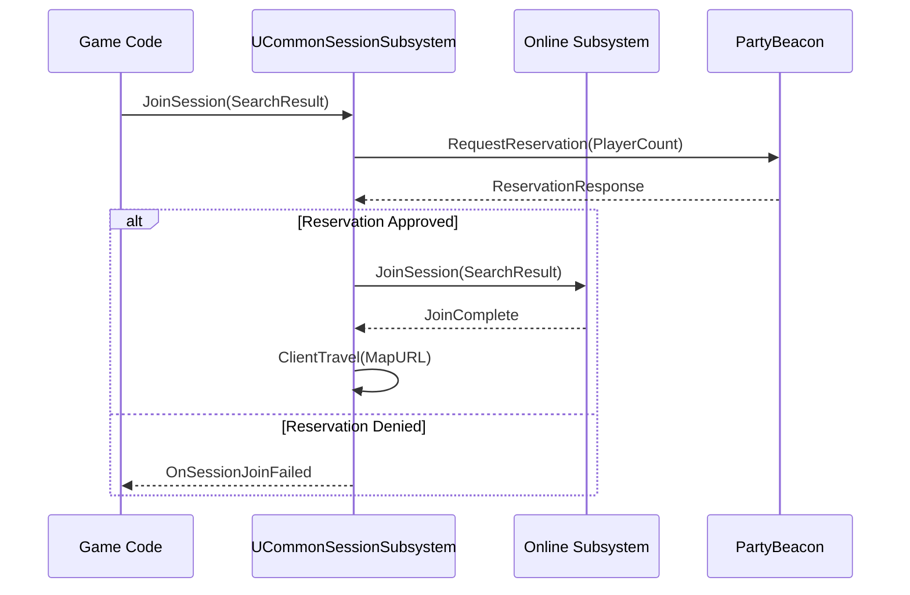
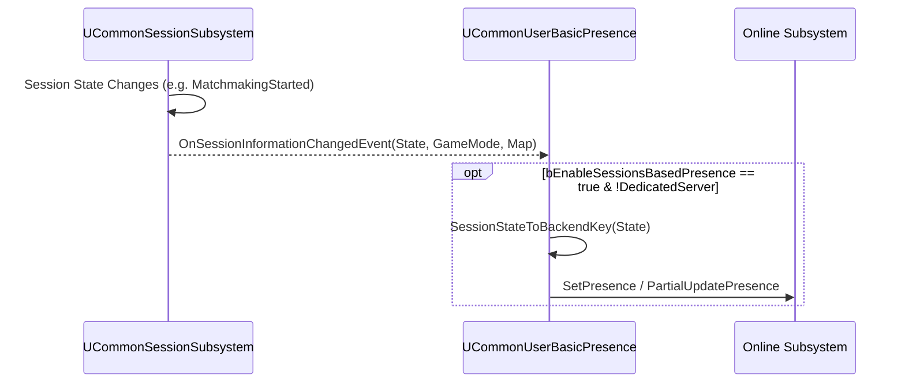

# 数据流图

> **NW: Architecture > CommonUser > Data Flow**

---

## 用户登录流程

## 字段与决策点

| 步骤 | 枚举值 | 关键决策 |
|------|--------|---------|
| 1. TransferPlatformAuth | `TransferPlatformAuth` | 仅在 Console 平台执行，PC 跳过 |
| 2. AutoLogin | `AutoLogin` | 失败时进入 LoginUI（如果允许） |
| 3. LoginUI | `LoginUI` | 仅当 `bCanShowLoginUI = true` |
| 4. QueryPrivileges | `QueryPrivileges` | 检查 `RequestedPrivilege` 指定权限 |
| 5. CreateLocalPlayer | `CreateLocalPlayer` | 仅在 `bCanCreateNewLocalPlayer = true` 时 |
| 6. Complete | `Complete` | 终止状态 |

## 会话创建流程

## 会话加入流程（Reservation）

## Presence 更新流程

## 关键异步操作列表

| 操作 | 入口 | 完成回调 | 耗时特征 |
|------|------|---------|---------|
| 用户初始化 | `TryToInitializeUser` | `OnUserInitializeComplete` | 50ms~10s+ (取决于平台) |
| 创建会话 | `HostSession` | `OnCreateSessionCompleteEvent` | 100ms~2s |
| 搜索会话 | `FindSessions` | `OnFindSessionsCompleteEvent` | 500ms~10s |
| 加入会话 | `JoinSession` | `OnJoinSessionCompleteEvent` | 500ms~5s |
| Presence更新 | `OnNotifySessionInformationChanged` | 无（fire-and-forget） | <50ms |
