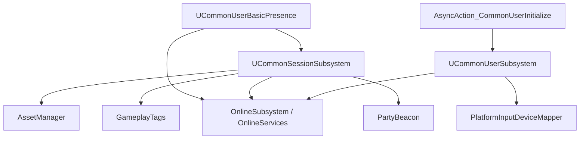

# 架构概览

> **NW: Architecture > CommonUser > Overview**

---

## 系统分层

```
┌─────────────────────────────────────────────────────┐
│                 Blueprint / Game Code                │
├─────────────────────────────────────────────────────┤
│  AsyncAction_CommonUserInitialize (BP节点)           │
│  UCommonSessionSubsystem    (会话管理)                │
│  UCommonUserBasicPresence   (在线状态)                │
├─────────────────────────────────────────────────────┤
│           UCommonUserSubsystem (用户核心)             │
│  ┌─────────────────────────────────────────────┐     │
│  │  FUserLoginRequest (登录状态机)               │     │
│  │  UCommonUserInfo (每用户数据)                  │     │
│  └─────────────────────────────────────────────┘     │
├─────────────────────────────────────────────────────┤
│  OSS Abstraction Layer                               │
│  ┌──────────────────┐  ┌──────────────────────┐     │
│  │  OnlineSubsystem  │  │  OnlineServices (v2) │     │
│  │  (Legacy v1)      │  │                      │     │
│  └──────────────────┘  └──────────────────────┘     │
├─────────────────────────────────────────────────────┤
│  Platform Layer (Input <-> User Mapping)             │
└─────────────────────────────────────────────────────┘
```

## 核心组件

### UCommonUserSubsystem
- **类型**: `UGameInstanceSubsystem`
- **职责**: 用户登录/登出、权限验证、本地玩家创建、跨平台用户映射
- **关键状态**: `ECommonUserLoginFlowStep` 枚举定义五步登录流程

### UCommonSessionSubsystem
- **类型**: `UGameInstanceSubsystem`
- **职责**: Host/Find/Join 在线会话，处理 `PartyBeacon` 预留、跨平台搜索
- **关键功能**: 快速 PlayTogether、Reservation-based Join

### UCommonUserBasicPresence
- **类型**: `UGameInstanceSubsystem`
- **职责**: 监听会话状态变化，自动更新平台 Presence（InGame/Matchmaking/OutOfGame）
- **依赖**: `UCommonSessionSubsystem`

### UAsyncAction_CommonUserInitialize
- **类型**: `UBlueprintAsyncActionBase`
- **职责**: 将 C++ 初始化流程暴露为蓝图异步动作节点
- **两种模式**: `InitializeForLocalPlay` / `LoginForOnlinePlay`

## 依赖图



## 关键数据结构

| 类型 | 作用 |
|------|------|
| `FCommonUserInitializeParams` | 用户初始化参数（权限、设备、允许访客等） |
| `FCommonSession_HostSessionRequest` | 在线创建会话请求（主资产ID，模式，地图等） |
| `FCommonSession_SearchSessionRequest` | 跨平台/特定会话搜索请求 |
| `ECommonUserPrivilege` | 用户权限枚举（CanPlay, CanPlayOnline, CanCommunicateOnline 等） |
| `ECommonUserOnlineContext` | 在线上下文枚举（默认/在线/本地） |
| `ECommonSessionInformationState` | 会话信息状态（OutOfGame, Matchmaking, InGame） |

---

## 设计原则

1. **子系统分层** — 所有管理器均为 `GameInstanceSubsystem`，自动管理生命周期
2. **异步委托** — 所有长时间操作通过 `FOnComplete` 委托返回结果，不阻塞主线程
3. **编译期抽象** — 通过 `COMMONUSER_OSSV1` 宏在 OSSv1/v2 间切换，避免运行时分支开销
4. **平台无关** — 使用 `FPlatformUserId`/`FInputDeviceId` 抽象层，统一 PC 和 Console 输入模型
