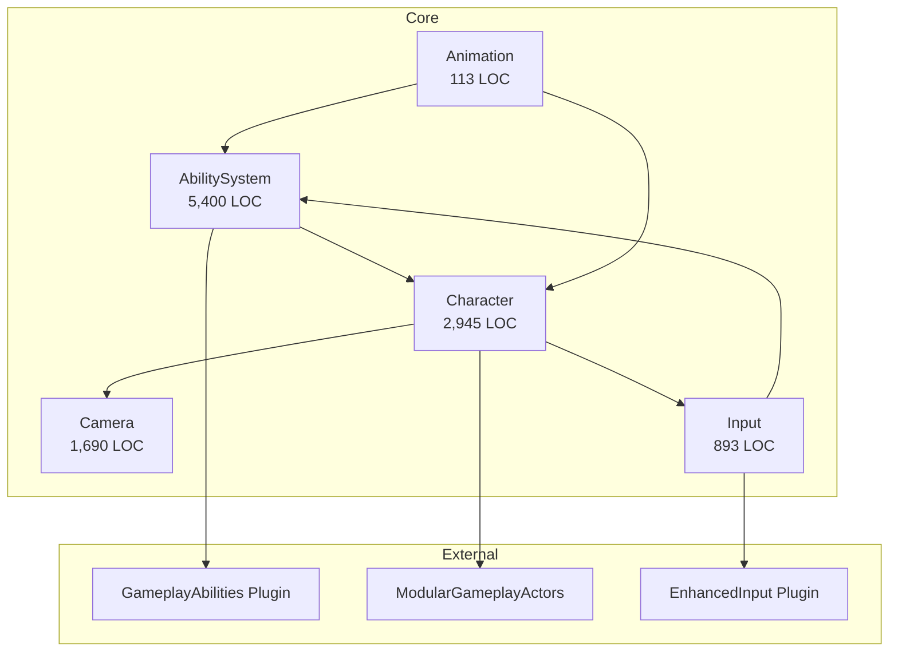

# Dependency Map — Core

## 模块间依赖

## 依赖矩阵

|  | AbilitySystem | Character | Camera | Input | Animation |
|--|:---:|:---:|:---:|:---:|:---:|
| **AbilitySystem** | - | ❌ | ❌ | ❌ | ❌ |
| **Character** | ✅ | - | ❌ | ❌ | ❌ |
| **Camera** | ❌ | ✅ | - | ❌ | ❌ |
| **Input** | ✅ | ✅ | ❌ | - | ❌ |
| **Animation** | ✅ | ✅ | ❌ | ❌ | - |

## 耦合度分析

| 模块 | 内部依赖 | 外部依赖 | 评级 |
|------|---------|---------|------|
| AbilitySystem | 0 | GameplayAbilities, GameplayTags | 🟢 内聚独立 |
| Character | 1 (AbilitySystem) | ModularGA, GameFeatures | 🟡 中度 |
| Camera | 1 (Character) | Engine/Camera | 🟢 轻量 |
| Input | 2 | EnhancedInput, Settings | 🟡 中度 |
| Animation | 2 | Character, AbilitySystem | 🟢 轻量薄层 |
