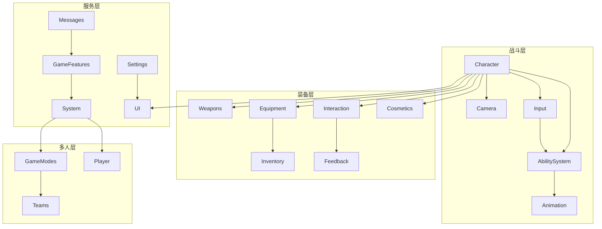

# Core — 核心游戏代码

> 生成日期：2026-07-31 | 模式：Full | 模块数：23 | 总文件数：~482 | 总代码行：~41,000

## 概述

核心游戏代码层（Core）是 Lyra 游戏逻辑的中枢，位于 `LyraStarterGame/Source/` 下，包含 LyraGame（23 个子模块）和 LyraEditor 两大子系统。覆盖从战斗、角色、武器、UI 到多人网络、编辑器工具的完整游戏开发流程。

## 模块

### 战斗与操作层

| 模块 | 代码量 | 复杂度 | 文档 |
|------|--------|--------|------|
| **AbilitySystem** | 5,400 行 | High | [详情](Modules/AbilitySystem.md) |
| **Character** | 2,945 行 | High | [详情](Modules/Character.md) |
| **Camera** | 1,690 行 | Medium | [详情](Modules/Camera.md) |
| **Input** | 893 行 | Medium | [详情](Modules/Input.md) |
| **Animation** | 113 行 | Low | [详情](Modules/Animation.md) |

### 装备与交互层

| 模块 | 代码量 | 复杂度 | 文档 |
|------|--------|--------|------|
| **Weapons** | 2,289 行 | High | [详情](Modules/Weapons.md) |
| **Equipment** | 1,195 行 | Medium | [详情](Modules/Equipment.md) |
| **Inventory** | 1,049 行 | Medium | [详情](Modules/Inventory.md) |
| **Interaction** | 1,107 行 | Medium | [详情](Modules/Interaction.md) |
| **Feedback** | 1,927 行 | Medium | [详情](Modules/Feedback.md) |
| **Cosmetics** | 1,329 行 | Medium | [详情](Modules/Cosmetics.md) |

### UI 与基础层

| 模块 | 代码量 | 复杂度 | 文档 |
|------|--------|--------|------|
| **UI** | 3,280 行 | High | [详情](Modules/UI.md) |
| **LyraGameRoot** | 233 行 | Low | [详情](Modules/LyraGameRoot.md) |

### 系统服务层

| 模块 | 代码量 | 复杂度 | 文档 |
|------|--------|--------|------|
| **Settings** | 3,500 行 | High | [详情](Modules/Settings.md) |
| **System** | 2,300 行 | Medium | [详情](Modules/System.md) |
| **GameFeatures** | 1,838 行 | High | [详情](Modules/GameFeatures.md) |
| **Messages** | 475 行 | Medium | [详情](Modules/Messages.md) |

### 多人网络层

| 模块 | 代码量 | 复杂度 | 文档 |
|------|--------|--------|------|
| **GameModes** | 2,484 行 | High | [详情](Modules/GameModes.md) |
| **Player** | 2,813 行 | High | [详情](Modules/Player.md) |
| **Teams** | 1,836 行 | Medium | [详情](Modules/Teams.md) |

### 工具与辅助层

| 模块 | 代码量 | 复杂度 | 文档 |
|------|--------|--------|------|
| **Performance** | 804 行 | High | [详情](Modules/Performance.md) |
| **LyraEditor** | 2,625 行 | Medium | [详情](Modules/LyraEditor.md) |
| **MiscModules** | 2,501 行 | Low-Med | [详情](Modules/MiscModules.md) |

## 架构

## 快速导航

- [系统总览](Architecture/System%20Overview.md)
- [依赖关系图](Architecture/Dependency%20Map.md)
- [健康度评估](Health/Health%20Summary.md)
- [代码审查](Health/Code%20Review.md)

## 相关目录

- ← [Infrastructure（基础框架层）](../Infrastructure/Index.md) — Core 所依赖的底座
- → [Systems（系统功能层）](../Systems/Index.md) — 可选的系统级插件
- → [GameFeatures（游戏玩法）](../GameFeatures/Index.md) — GameFeature 玩法插件
