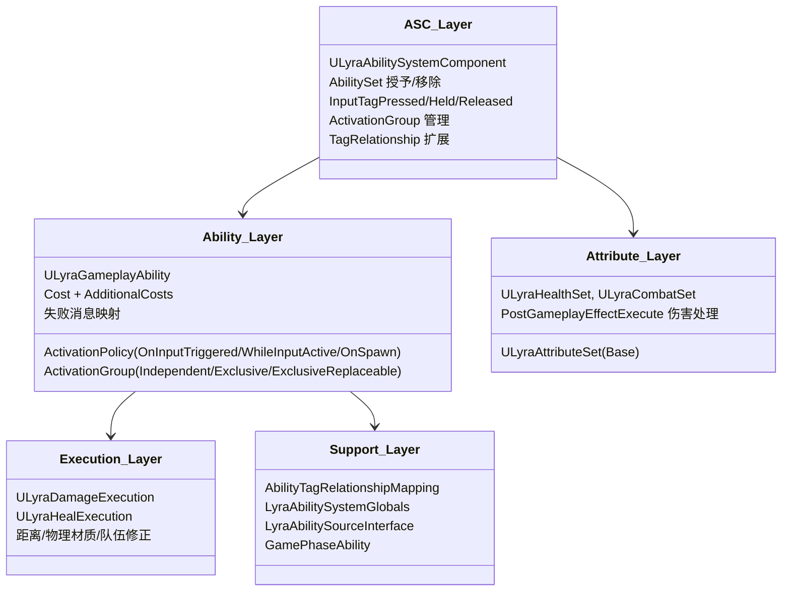

## Architecture <!-- c2d:s1 -->

AbilitySystem 是 Lyra 技能框架的核心模块，围绕 Epic 的 Gameplay Ability System (GAS) 构建。主要包含以下层次：



### 能力激活流程

```
1. Input → LyraHeroComponent → ASC.AbilityInputTagPressed(Tag)
2. ASC 缓存 InputPressedSpecHandles 和 InputHeldSpecHandles
3. 每帧 ProcessAbilityInput():
   - OnInputTriggered 策略: 未激活着排队，已激活着事件注入
   - WhileInputActive 策略: 未激活着排队
4. TryActivateAbility():
   - CanActivateAbility() 检查标签需求(TagRelationshipMapping扩展)、
     ActivationGroup 冲突、Cost
   - ActivateAbility() 执行
5. 激活组管理: Exclusive 替换同组旧能力
6. Cost: GE Cost + AdditionalCosts
7. EndAbility() 清理 CameraMode，移除激活组
```

## API Reference <!-- c2d:s2 -->

### ULyraAbilitySystemComponent

核心 ASC 类。关键 API：
- `AbilityInputTagPressed/Held/Released(FGameplayTag)` — 输入驱动
- `ProcessAbilityInput(float, bool)` — 每帧处理
- `GetAbilitySystemComponentFromActor(Actor)` — 静态查找
- `AbilityActivationGroups` — 激活组管理

### AbilitySet

数据驱动的能力授予：
- `GrantedGameplayAbilities` — 授权列表
- `GrantedGameplayEffects` — GE 列表  
- `GrantedAttributes` — 属性集列表
- `InputTags` — 对应输入标签

### ULyraGameplayAbility

能力基类：
- `ActivationPolicy`: OnInputTriggered/WhileInputActive/OnSpawn
- `ActivationGroup`: Independent/Exclusive/ExclusiveReplaceable
- `AbilityCost`: GE Cost
- `AdditionalCosts`: 额外开销（可选仅命中时应用）
- `FailureTagToUserFacingMessages`: 失败消息映射

### 属性集

- `ULyraHealthSet`: Health, MaxHealth, Damage, Healing, Shield
- `ULyraCombatSet`: BaseDamage, BaseHeal

## Key Files <!-- c2d:s6 -->

| 文件 | 重要性 |
|------|--------|
| `LyraAbilitySystemComponent.h/.cpp` | ASC 核心实现 |
| `LyraGameplayAbility.h/.cpp` | 能力基类 |
| `LyraAbilitySet.h/.cpp` | 能力授予数据资产 |
| `LyraAttributeSet.h/.cpp` | 属性集基类 |
| `LyraHealthSet.h/.cpp` | 生命值系统 |
| `LyraDamageExecution.h/.cpp` | 伤害计算管道 |
