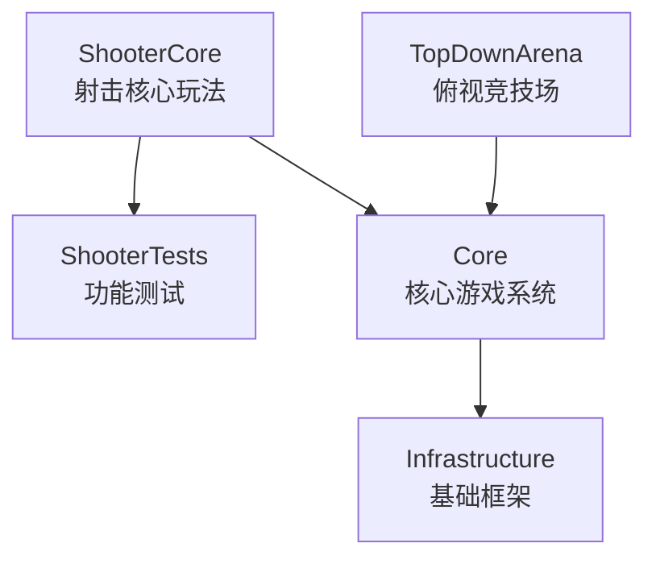

# GameFeatures — 游戏玩法

> 生成日期：2026-07-31 | 模式：Full | 模块数：3 | 总文件数：~53 | 总代码行：~3,444

## 概述

GameFeatures 层包含实际的可插拔玩法插件，利用 Unreal Engine 的 GameFeatureAction 系统实现玩法的热加载和热卸载。

## 模块

| GameFeature | 代码量 | 复杂度 | 文档 |
|-------------|--------|--------|------|
| **ShooterCore** | 2,884 行 | High | [详情](Modules/ShooterCore.md) |
| **ShooterTests** | 410 行 | Medium | [详情](Modules/ShooterTests.md) |
| **TopDownArena** | 150 行 | Low-Medium | [详情](Modules/TopDownArena.md) |

## 架构

## 设计模式

- **GameFeatureAction 插件化**：通过 `UGameFeatureAction` 注入输入、UI、WorldAction
- **消息驱动解耦**：GameplayMessageRouter 连接子系统
- **DataAsset 配置**：玩法参数通过数据资产驱动

## 相关目录

- ← [Core（核心游戏代码）](../Core/Index.md) — 依赖的核心系统
- ← [Infrastructure（基础框架层）](../Infrastructure/Index.md) — 底层框架
- ← [Systems（系统功能层）](../Systems/Index.md) — GameplayMessageRouter 等系统服务
