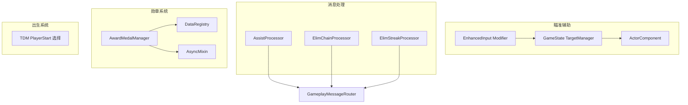

# ShooterCore

> 插件路径：`LyraStarterGame/Plugins/GameFeatures/ShooterCore/Source/`

## 架构

射击游戏核心 GameFeature 插件，四个子系统协同工作：

## 子系统

### 1. 瞄准辅助（~55% 代码量）

| 组件 | 职责 |
|------|------|
| EnhancedInput Modifier | 截获原始输入，应用瞄准矫正偏移 |
| GameState TargetManager | 管理可瞄准目标，双缓冲缓存 |
| ActorComponent | 三种碰撞形状屏幕投影、异步可见性追踪 |
| 力学模型 | Pull（吸引到目标）+ Slow（减速微调）双重力学 |

### 2. 消息处理器

通过 GameplayMessageRouter 追踪战斗事件：

| 处理器 | 职责 |
|--------|------|
| AssistProcessor | 追踪助攻次数和助攻链 |
| ElimChainProcessor | 连续击杀链（Killing Spree） |
| ElimStreakProcessor | 单局击杀累计 |

### 3. 勋章系统

- `DataRegistry` 异步加载勋章定义
- `FAsyncMixin` 管理加载生命周期
- 按 `SequenceID` 保序排队显示
- 防止勋章 UI 闪烁和顺序错乱

### 4. TDM 出生点

- 选择离敌人最远的未占用 PlayerStart
- 避免出生即死的体验问题

## 关键类

| 类 | 职责 |
|----|------|
| `ULyraAimAssistModifier` | EnhancedInput 修改器入口 |
| `ULyraAimAssistTargetManager` | GameState 级别的目标管理 |
| `ULyraAimAssistComponent` | 挂载到 Actor，执行瞄准调整 |
| `UAssistProcessor` | 助攻消息处理 |
| `UElimChainProcessor` | 连杀消息处理 |
| `UElimStreakProcessor` | 击杀累计处理 |
| `UAwardMedalManager` | 勋章生命周期管理 |

## 设计模式

- **GameFeatureAction 驱动**：通过 `UGameFeatureAction` 注入 InputConfig、Widget、WorldAction
- **消息驱动架构**：GameplayMessageRouter 解耦子系统间通信
- **DataRegistry + AsyncMixin**：异步数据加载和保序显示

## 依赖

- Core: AbilitySystem, Weapons, Equipment, Input, UI
- Infrastructure: AsyncMixin, UIExtension
- Systems: GameplayMessageRouter
- EnhancedInput, DataRegistry

## 相关文档

- [Core/AbilitySystem](../Core/Modules/AbilitySystem.md) — GAS 技能系统
- [Systems/GameplayMessageRouter](../Systems/Modules/GameplayMessageRouter.md) — 消息路由
- [ShooterTests](ShooterTests.md) — 测试插件
