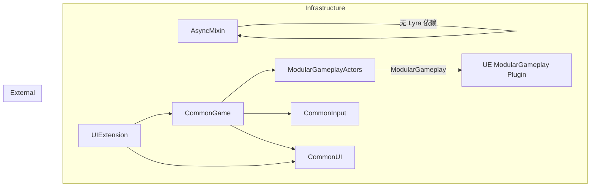

# Dependency Map — Infrastructure

## 模块间依赖

## 依赖矩阵

|  | AsyncMixin | ModularGA | CommonGame | UIExtension |
|--|-----------|-----------|------------|-------------|
| **AsyncMixin** | - | ❌ | ❌ | ❌ |
| **ModularGA** | ❌ | - | ❌ | ❌ |
| **CommonGame** | ❌ | ✅ | - | ❌ |
| **UIExtension** | ❌ | ❌ | ✅ | - |

✅ = 目标模块依赖于源模块

## UE 引擎依赖

| 模块 | Core | Engine | Slate/UMG | CommonUI | CommonInput | GameplayTags | ModularGameplay | AIModule |
|------|------|--------|-----------|----------|-------------|---------------|-----------------|----------|
| AsyncMixin | ✅ | ✅ | ❌ | ❌ | ❌ | ❌ | ❌ | ❌ |
| ModularGA | ✅ | ✅ | ❌ | ❌ | ❌ | ❌ | ✅ | ✅ |
| CommonGame | ✅ | ✅ | ✅ | ✅ | ✅ | ✅ | ✅ | ❌ |
| UIExtension | ✅ | ✅ | ✅ | ✅ | ❌ | ✅ | ❌ | ❌ |

## 耦合度分析

| 模块 | 耦合类型 | 评级 |
|------|---------|------|
| AsyncMixin | 零 Lyra 依赖 — 可独立提取 | 🟢 松耦合 |
| ModularGA | 仅依赖 UE 引擎 — 高度独立 | 🟢 松耦合 |
| CommonGame | 依赖 3 个内部插件 + 5 个 UE 模块 | 🟡 中等耦合 |
| UIExtension | 依赖 CommonGame + CommonUI | 🟡 中等耦合 |
