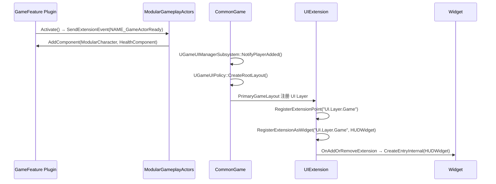

# System Overview — Infrastructure

## 架构概述

Lyra 的基础框架层（Infrastructure）由 4 个插件组成，形成了从底层工具到上层框架组件的清晰分层架构。

### 分层结构

```
┌─────────────────────────────────────────────┐
│  UIExtension (940 LOC)                       │  ← 应用扩展层
│  GameplayTag 驱动的 UI 扩展点系统              │
├─────────────────────────────────────────────┤
│  CommonGame (3,138 LOC)                      │  ← 框架桥接层
│  UE 标准 → Lyra 特定桥接                     │
│  UI 管理、玩家生命周期、异步 UI 操作            │
├─────────────────────────────────────────────┤
│  ModularGameplayActors (572 LOC)             │  ← 适配层
│  GameFeature 组件注入适配器                    │
├─────────────────────────────────────────────┤
│  AsyncMixin (976 LOC)                        │  ← 底层工具
│  顺序异步资产加载混合类                        │
└─────────────────────────────────────────────┘
```

### 数据流



### 核心设计决策

1. **标签而非字符串**: 使用 `FGameplayTag` 进行 UI 路由，而非硬编码字符串，支持层级命名空间和 PartialMatch。
2. **WorldSubsystem 生命周期**: UI 管理器和扩展系统绑定到 World 生命周期，自动创建/销毁。
3. **模板方法开放扩展**: CommonGame 类提供大量 `virtual` 钩子，Lyra 特定子类通过覆盖实现定制。
4. **零负担混合类**: AsyncMixin 不影响未使用它时不产生内存开销。

---

## 相关文档

- [依赖关系图](Dependency%20Map.md)
- [健康度评估](../Health/Health%20Summary.md)
- [代码审查](../Health/Code%20Review.md)
