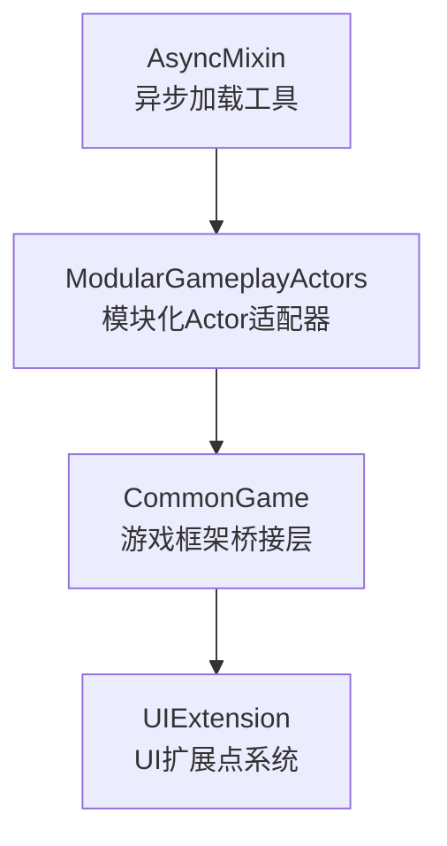

# Infrastructure — 基础框架层

> 生成日期：2026-07-31 | 模式：Full | 模块数：4 | 总文件数：57 | 总代码行：~5,626

## 概述

基础框架层（Infrastructure）是 Lyra 游戏框架的底层支撑，包含 4 个核心插件，为上层游戏代码提供 UI 扩展、游戏框架桥接、模块化 Actor 和异步加载能力。

## 模块

| 模块 | 代码量 | 复杂度 | 文档 |
|------|--------|--------|------|
| **AsyncMixin** | 976 行 | Medium | [Modular 详情](Modules/AsyncMixin.md) |
| **ModularGameplayActors** | 572 行 | Low | [Modular 详情](Modules/ModularGameplayActors.md) |
| **CommonGame** | 3,138 行 | Medium | [Modular 详情](Modules/CommonGame.md) |
| **UIExtension** | 940 行 | Medium | [Modular 详情](Modules/UIExtension.md) |

## 架构

## 快速导航

- [系统总览](Architecture/System%20Overview.md)
- [依赖关系图](Architecture/Dependency%20Map.md)
- [健康度评估](Health/Health%20Summary.md)
- [代码审查](Health/Code%20Review.md)

## 相关目录

- → [Core（核心游戏代码）](../Core/Index.md) — Infrastructure 的主要消费者
- → [Systems（系统功能层）](../Systems/Index.md)
- → [CommonUser（用户认证层）](../CommonUser/index.md)
