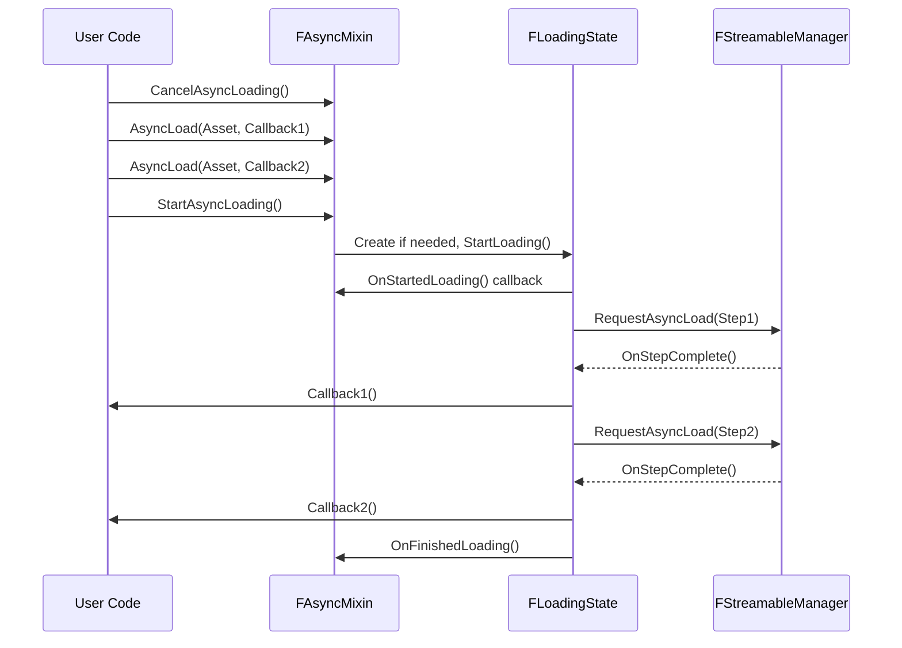

## Architecture <!-- c2d:s1 -->

AsyncMixin 解决的核心问题：**在 UObject 派生类中管理有序的、顺序执行的异步资产加载，同时自动保证生命周期安全**。

### 设计决策

1. **零内存 mix-in**: `FAsyncMixin` 自身不持有任何数据成员。所有状态存储在静态 `TMap<FAsyncMixin*, TSharedRef<FLoadingState>>` 中。继承 `FAsyncMixin` 的类在未排队异步工作时不产生任何运行时内存开销。

2. **FLoadingState（内部类）**: 真正的执行引擎。首次使用时通过 `GetLoadingState()` 创建，加载完成后通过延迟的 tick 销毁。维护一个有序的 `TArray<TUniquePtr<FAsyncStep>>` 步骤列表和 `CurrentAsyncStep` 索引。

3. **FAsyncStep（内部类）**: 封装单个异步操作，可基于：
   - `TSharedPtr<FStreamableHandle>`（资产加载）
   - `TSharedPtr<FAsyncCondition>`（自定义轮询条件）
   - 无后备（纯回调"事件"）



### 安全机制

- **自动启动**: 如果用户忘记调用 `StartAsyncLoading()`，一帧延迟的 ticker 会在下一帧自动启动。
- **析构函数安全**: 当 `FAsyncMixin` 被销毁时，`Loading.Remove(this)` 会释放 `TSharedRef<FLoadingState>`，其析构函数会取消所有挂起的步骤和 ticker。这使 lambda 中的 `[this]` 捕获是安全的。
- **FAsyncScope**: 一个公开的薄子类，通过 `using` 声明将所有 `protected` 方法暴露为 `public`，允许非继承（独立）使用。

---

## API Reference <!-- c2d:s2 -->

### FAsyncMixin（mix-in 基类）

**生命周期钩子**（virtual，在子类中覆盖）：
```cpp
virtual void OnStartedLoading();   // StartAsyncLoading() 后调用
virtual void OnFinishedLoading();  // 所有步骤完成后调用
```

**排队方法**（均为 `protected`）：

| 方法 | 描述 |
|------|------|
| `AsyncLoad(TSoftClassPtr<T>, Callback)` | 加载软类指针，3 个重载 |
| `AsyncLoad(TSoftObjectPtr<T>, Callback)` | 加载软对象指针，3 个重载 |
| `AsyncLoad(FSoftObjectPath, Callback)` | 加载软对象路径 |
| `AsyncCondition(TUniqueFunction<bool()>, Callback)` | 注册轮询条件，条件为 true 时步骤完成 |
| `AsyncEvent(Callback)` | 注册纯回调"事件"步骤（无加载） |

**控制方法**：
- `StartAsyncLoading()` — 启动顺序执行
- `CancelAsyncLoading()` — 取消所有挂起的加载
- `IsAsyncLoadingInProgress()` — 检查是否有加载进行中

### FAsyncScope

```cpp
// 非继承用法
FAsyncScope Scope;
Scope.AsyncLoad(SomeAsset, []() { /* ... */ });
Scope.StartAsyncLoading();
```

---

## Design Patterns <!-- c2d:s3 -->

1. **Mixin/Traits**: 多重继承模式 — 类可以同时继承 `UObject`（或其他 UE 基类）和 `FAsyncMixin`。

2. **RAII**: `FLoadingState` 通过 `TSharedRef` 管理生命周期，确保正确清理。

3. **静态注册表**: `TMap<FAsyncMixin*, TSharedRef<FLoadingState>>` 将混合状态与该实例分离，实现零内存特征。

4. **顺序执行管道**: 步骤按顺序执行，前一步完成才执行后一步。

5. **自吊销**: `FAsyncScope` 支持堆栈或成员变量的作用域用法。

---

## Dependencies <!-- c2d:s4 -->

| 依赖 | 用途 |
|------|------|
| Core | 基础引擎类型 |
| CoreUObject | UObject 反射系统 |
| Engine | FStreamableManager, FTSTicker |

无其他 Lyra 插件依赖 — AsyncMixin 是独立的底层工具。

---

## Complexity Assessment <!-- c2d:s5 -->

**评级: Medium**

尽管只有 3 个文件（~976 行），AsyncMixin 被评 Medium 因为：
- **生命周期复杂性**: 静态映射 + `TSharedRef` + ticker 的组合涉及精细的内存管理
- **并发语义**: `[this]` 捕获在异步回调中，依赖析构函数正确取消来保证安全
- **诊断难度**: 调试加载失败需要理解 FAsyncStep 和 FLoadingState 的内部状态
- **代码质量**: Epic 风格的实现，但模板头文件中的步骤管理逻辑需要仔细阅读

---

## Key Files <!-- c2d:s6 -->

| 文件 | 重要性 |
|------|--------|
| `Public/AsyncMixin.h` | 完整 API 头文件，包含 FAsyncMixin、FLoadingState、FAsyncStep、FAsyncScope 的全部定义 |
| `Private/AsyncMixin.cpp` | 实现文件，包含 FLoadingState 的 tick 执行引擎、步骤管理器、FAsyncMixin 的公共方法 |
| `Private/AsyncMixinModule.cpp` | 模块入口，纯样板代码 |
