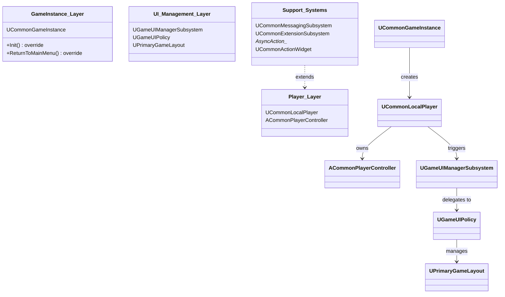

## Architecture <!-- c2d:s1 -->

CommonGame 是 Lyra 游戏框架的**中间桥接层**，位于 Unreal Engine 标准游戏框架类和 Lyra 特定的游戏子类之间。它提供了一套"有主见的默认行为"，使游戏特定的子类只需覆盖关键逻辑即可。

### 三层架构



### 核心类职责

| 层 | 类 | 职责 |
|----|-----|------|
| GameInstance | `UCommonGameInstance` | 重写 `Init()` 和 `ReturnToMainMenu()`，提供通用游戏实例行为模板 |
| Player | `UCommonLocalPlayer` | 管理本地玩家生命周期，提供 `GetUIManager()` 便捷方法 |
| Player | `ACommonPlayerController` | 通用玩家控制器，处理输入和UI交互的默认行为 |
| UI | `UGameUIManagerSubsystem` | WorldSubsystem，作为 UI 管理的中枢，与 UIPolicy 协作 |
| UI | `UGameUIPolicy` | 定义 UI 策略（如何创建、布局和管理 UI） |
| UI | `UPrimaryGameLayout` | 主游戏布局基类，定义 Layer/Tag 系统用于组织 UI |
| Support | `UCommonMessagingSubsystem` | 消息/对话框子系统，提供 `ShowConfirmation` 等 API |
| Support | `AsyncAction_*` | 3 个异步 Action：CreateWidgetAsync, PushContentToLayer, ShowConfirmation |
| Support | `UCommonActionWidget` | 通用输入动作显示 Widget 基类 |
| Support | `UCommonKeybindWidget` | 通用按键绑定显示 Widget |

### 设计关键点

- **Template Method 模式**: 大量虚函数允许 Lyra 游戏特定子类覆盖行为。
- **UIPolicy 可插拔**: `UGameUIPolicy` 作为抽象策略，允许不同游戏模式有不同的 UI 布局策略。
- **Layer/Tag 系统**: `UPrimaryGameLayout` 使用 GameplayTag 来标识和管理不同的 UI 层，支持通过标签查找和操作特定层。

---

## API Reference <!-- c2d:s2 -->

### UCommonGameInstance

```cpp
// 关键可覆盖方法
virtual void Init() override;                    // 初始化钩子
virtual void ReturnToMainMenu() override;        // 返回主菜单钩子
virtual void OnStart() override;                 // 游戏开始钩子
```

### UCommonLocalPlayer

```cpp
// 便捷方法
UGameUIManagerSubsystem* GetUIManager() const;   // 获取 UI 管理器
FDelegateHandle CallAndRegister_OnPlayerControllerSet(...); // 注册玩家控制器设置回调
```

### UGameUIManagerSubsystem (WorldSubsystem)

```cpp
static UGameUIManagerSubsystem* Get(const UObject* WorldContext); // 静态获取
virtual UGameUIPolicy* GetCurrentUIPolicy() const;
void NotifyPlayerAdded(UCommonLocalPlayer* LocalPlayer);
void NotifyPlayerRemoved(UCommonLocalPlayer* LocalPlayer);
void NotifyPlayerDestroyed(UCommonLocalPlayer* LocalPlayer);
```

### UGameUIPolicy

```cpp
virtual void NotifyPlayerAdded(UCommonLocalPlayer* LocalPlayer);
virtual void NotifyPlayerRemoved(UCommonLocalPlayer* LocalPlayer);
virtual void NotifyPlayerDestroyed(UCommonLocalPlayer* LocalPlayer);
virtual TSubclassOf<UPrimaryGameLayout> GetLayoutWidgetClass(UCommonLocalPlayer* LocalPlayer) const;
UFUNCTION(BlueprintCallable) UPrimaryGameLayout* GetRootLayout(const UCommonLocalPlayer* LocalPlayer) const;
```

### UPrimaryGameLayout

```cpp
virtual void RegisterLayer(FGameplayTag LayerTag, UCommonActivatableWidgetContainerBase* LayerWidget);
virtual UCommonActivatableWidgetContainerBase* GetLayerWidget(FGameplayTag LayerTag) const;
// Layer/Tag 系统 - 通过 GameplayTag 查找和管理 UI 层
```

---

## Design Patterns <!-- c2d:s3 -->

1. **Template Method**: `UCommonGameInstance::Init()`, `ReturnToMainMenu()` 等提供模板框架，子类覆盖特定步骤。

2. **Observer/事件驱动**: 大量使用多播委托通知玩家状态变化（PlayerAdded, PlayerRemoved, PlayerDestroyed）。

3. **Strategy**: `UGameUIPolicy` 作为可插拔策略，不同游戏模式使用不同的 UIPolicy 实现。

4. **Factory Method**: `GetLayoutWidgetClass()` 和 Dialog Descriptor 模式创建不同类型的 UI。

5. **Mediator**: `UGameUIManagerSubsystem` 充当中介者，协调 Player、UIPolicy、Layout 之间的交互。

6. **Async Action**: 3 个 `UAsyncAction` 子类（CreateWidgetAsync, PushContentToLayer, ShowConfirmation）封装异步UI操作。

7. **Subsystem 自动创建/销毁**: 使用 `ShouldCreateSubsystem()` 控制子系统条件性创建。

---

## Dependencies <!-- c2d:s4 -->

| 依赖 | 类型 | 用途 |
|------|------|------|
| Core, CoreUObject | UE 标准 | 基础类型、反射系统 |
| InputCore | UE 标准 | 输入处理 |
| Engine | UE 标准 | 引擎基础类（GameInstance, LocalPlayer, PlayerController） |
| Slate, SlateCore | UE 标准 | Slate UI 系统 |
| UMG | UE 标准 | UMG Widget 框架 |
| CommonInput | Lyra 内部 | 通用输入抽象（跨平台输入处理） |
| CommonUI | Lyra 内部 | 通用 UI 框架（ActivatableWidget, ActionRouter） |
| CommonUser | Lyra 内部 | 用户/登录管理（Batch 0 已完成） |
| GameplayTags | Lyra 内部 | GameplayTag 路由系统 |
| ModularGameplayActors | Lyra 内部 | 模块化 Gameplay Actor 支持 |

---

## Complexity Assessment <!-- c2d:s5 -->

**评级: Medium**

- **代码量**: 3138 行，29 文件 — 中等规模
- **类数量**: 13 个主要类
- **抽象深度**: 中等 — 三层架构清晰，继承链适中
- **设计复杂性**: 模板方法 + 观察者 + 策略，组合使用但未过度复杂
- **运行时复杂度**: 主要通过委托和子系统管理，性能开销可控
- **维护风险**: 模板方法设计意味着子类继承链断裂风险 — 但对 Lyra 特定用途可接受

---

## Key Files <!-- c2d:s6 -->

| 文件 | 重要性 |
|------|--------|
| `CommonGameInstance.h/.cpp` | GameInstance 层入口，理解游戏初始化流程的起点 |
| `GameUIManagerSubsystem.h/.cpp` | UI 管理中枢，协调所有 UI 子系统 |
| `GameUIPolicy.h/.cpp` | UI 策略基类，定义 UI 创建和管理策略 |
| `PrimaryGameLayout.h/.cpp` | 主布局基类，Layer/Tag 系统的核心 |
| `AsyncAction_CreateWidgetAsync.h/.cpp` | 异步 Widget 创建 Action，展示异步 UI 模式 |
| `CommonLocalPlayer.h/.cpp` | 本地玩家扩展，连接 Player 和 UI 系统 |
