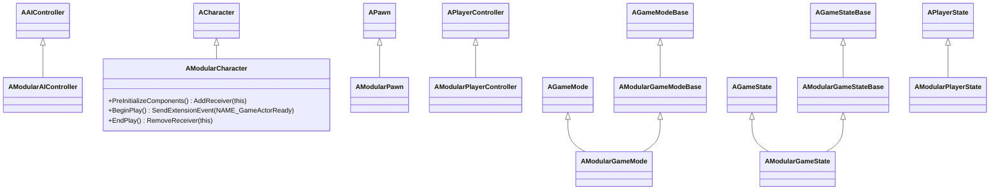

## Architecture <!-- c2d:s1 -->

ModularGameplayActors 是一个**薄适配层**，位于标准 UE 游戏框架类和 GameFeature 插件系统之间。其唯一目的：让标准 Actor 类型成为 `UGameFrameworkComponentManager` 扩展系统的"接收者"，从而 GameFeature 插件可以在运行时动态注入组件。

### 核心问题

默认情况下，UE 的 `AGameMode`、`APlayerController`、`APawn`、`ACharacter`、`AGameState`、`APlayerState` 和 `AAIController` 不参与模块化组件扩展生命周期。没有这些 Modular 子类，GameFeature 插件无法在功能激活时安全地向游戏框架 Actor 注入游戏组件（血量、背包、技能系统等）。

### 统一的三步生命周期

每个 Modular* 类遵循相同模式：

生命周期三步：
1. **PreInitializeComponents** → `AddGameFrameworkComponentReceiver(this)` — 注册为组件接收者
2. **BeginPlay**（或 PlayerController 的 `ReceivedPlayer`）→ `SendGameFrameworkComponentExtensionEvent(NAME_GameActorReady)` — 通知 GameFeature 可以添加组件
3. **EndPlay** → `RemoveGameFrameworkComponentReceiver(this)` — 清理

---

## API Reference <!-- c2d:s2 -->

所有 Modular* 类都是其 UE 基类的直接子类，**不添加任何新的公共 API**。它们仅重写生命周期方法来实现组件接收者注册。

| 类 | 基类 | 覆盖的方法 |
|----|------|-----------|
| `AModularAIController` | `AAIController` | PreInitializeComponents, BeginPlay, EndPlay |
| `AModularCharacter` | `ACharacter` | PreInitializeComponents, BeginPlay, EndPlay |
| `AModularPawn` | `APawn` | PreInitializeComponents, BeginPlay, EndPlay |
| `AModularPlayerController` | `APlayerController` | PreInitializeComponents, ReceivedPlayer, EndPlay, PlayerTick |
| `AModularGameModeBase` | `AGameModeBase` | 构造（使用 ObjectInitializer） |
| `AModularGameMode` | `AGameMode` (via AModularGameModeBase) | 继承 |
| `AModularGameStateBase` | `AGameStateBase` | PreInitializeComponents |
| `AModularGameState` | `AGameState` (via AModularGameStateBase) | 继承 |
| `AModularPlayerState` | `APlayerState` | PreInitializeComponents, BeginPlay, EndPlay |

---

## Design Patterns <!-- c2d:s3 -->

1. **适配器/Shim 模式**: 不添加新功能，仅适配现有类以兼容 GameFeature 框架。

2. **统一生命周期模式**: 所有类遵循相同的 register-notify-cleanup 三步模式，保证一致性。

3. **继承链开放**: `ModularGameModeBase → ModularGameMode` 和 `ModularGameStateBase → ModularGameState` 保留了两层继承，允许选择基类。

4. **事件驱动扩展**: 使用 `NAME_GameActorReady` 事件信号触发组件注入。

---

## Dependencies <!-- c2d:s4 -->

| 依赖 | 用途 |
|------|------|
| Core, CoreUObject, Engine | UE 标准基础 |
| ModularGameplay | UGameFrameworkComponentManager — 核心依赖 |
| AIModule | AAIController 基类支持 |

---

## Complexity Assessment <!-- c2d:s5 -->

**评级: Low**

- **代码量**: 572 行，18 文件 — 每个类平均仅 ~40 行
- **设计简单性**: 高度重复的模式，每个类本质相同
- **无运行时决策**: 所有行为在编译时确定
- **维护成本**: 极低 — 新增游戏框架类只需添加新的 Modular* 子类

---

## Key Files <!-- c2d:s6 -->

| 文件 | 重要性 |
|------|--------|
| `ModularCharacter.h/.cpp` | 最常用的子类之一，展示标准模式 |
| `ModularPlayerController.h/.cpp` | 生命流程略有不同（ReceivedPlayer vs BeginPlay），PlayerTick 重载 |
| `ModularGameMode.h/.cpp` | 双层继承示例（via ModularGameModeBase） |
| `ModularGameplayActorsModule.cpp` | 模块入口 |
