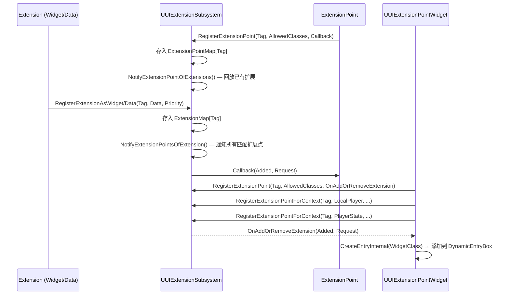

## Architecture <!-- c2d:s1 -->

UIExtension 实现 **Extension Point / Extension 双向注册模式**，基于 GameplayTag 实现 UI 组件的松耦合组合。

### 两层架构

**核心层** — `UUIExtensionSubsystem`（WorldSubsystem）充当中央注册表：
- `ExtensionPointMap`：FGameplayTag → TArray<TSharedPtr<FUIExtensionPoint>>
- `ExtensionMap`：FGameplayTag → TArray<TSharedPtr<FUIExtension>>

**Widget 层** — `UUIExtensionPointWidget`（继承自 `UDynamicEntryBoxBase`）将扩展点暴露给 UMG 设计师。



### GameplayTag 匹配策略

- **ExactMatch**: 扩展点只在精确标签匹配
- **PartialMatch**: 扩展点向上遍历父标签链，匹配更具体的扩展（如 `"A.B"` 可匹配 `"A.B.C"`）

### 上下文匹配

扩展和扩展点可携带可选的 `UObject*` 上下文。匹配要求两者同为 null 或完全相等。`UUIExtensionPointWidget` 自动注册三个上下文（通用、LocalPlayer、PlayerState）。

---

## API Reference <!-- c2d:s2 -->

### UUIExtensionSubsystem（WorldSubsystem）

**获取**：`GetWorld()->GetSubsystem<UUIExtensionSubsystem>()`

**扩展点注册（C++）**：
```cpp
FUIExtensionPointHandle RegisterExtensionPoint(
    FGameplayTag Tag, EUIExtensionPointMatch MatchType,
    TArray<UClass*> AllowedDataClasses,
    FExtendExtensionPointDelegate Callback);
```

**扩展注册（C++）**：
```cpp
FUIExtensionHandle RegisterExtensionAsWidget(
    FGameplayTag Tag, TSubclassOf<UUserWidget> WidgetClass, int32 Priority = 0);

FUIExtensionHandle RegisterExtensionAsData(
    FGameplayTag Tag, UObject* ContextObject, UObject* Data, int32 Priority = 0);
```

**反注册**：
```cpp
void UnregisterExtension(FUIExtensionHandle Handle);
void UnregisterExtensionPoint(FUIExtensionPointHandle Handle);
```

### UUIExtensionPointWidget（UMG Widget）

| 属性 | 类型 | 描述 |
|------|------|------|
| `ExtensionPointTag` | `FGameplayTag` | 标识此 Widget 为扩展点 |
| `ExtensionPointTagMatch` | `EUIExtensionPointMatch` | ExactMatch 或 PartialMatch |
| `DataClasses` | `TArray<UClass*>` | 接受的额外数据类型 |
| `GetWidgetClassForData` | 委托 | 将 Data 映射到 Widget 类 |
| `ConfigureWidgetForData` | 委托 | 用 Data 配置已创建的 Widget |

---

## Design Patterns <!-- c2d:s3 -->

1. **Extension Point / Plugin**: 经典推-订阅变体 — 扩展点（订阅者）声明标签 + 数据契约，扩展（发布者）声明标签 + 提供数据。Subsystem 充当中介。

2. **Observer**: `FExtendExtensionPointDelegate` 回调作为观察者，实时响应扩展的到达/离开。

3. **基于标签的调度**: 使用 `FGameplayTag` 而非字符串作为路由键，支持层级命名空间和 PartialMatch。

4. **上下文范围**: 通过 `UObject*` 相等性匹配实现玩家/游戏上下文特定的 UI 布局。

5. **桥接模式**: `K2_*` 方法桥接原生 C++ 委托与蓝图动态委托。

---

## Dependencies <!-- c2d:s4 -->

| 依赖 | 用途 |
|------|------|
| Core, CoreUObject, Engine | UE 标准基础 |
| SlateCore, Slate, UMG | UI 系统 |
| CommonUI | `UCommonLocalPlayer` PlayerState 绑定 |
| CommonGame | 声明依赖，无直接使用（间接关联） |
| GameplayTags | FGameplayTag 路由核心 |

---

## Complexity Assessment <!-- c2d:s5 -->

**评级: Medium**

- **代码量**: 940 行，7 文件 — 规模适中
- **双向通知**: 扩展点注册时需回放已有扩展，扩展注册时需通知已有扩展点 — 增加认知负担
- **标签层级遍历**: PartialMatch 需要遍历父标签链，是算法最复杂的部分
- **GC 集成**: `AddReferencedObjects` 正确管理 UObject 引用防止回收
- **多上下文 Widget 注册**: `UUIExtensionPointWidget` 注册 3 个扩展点句柄，有各自的声明周期管理
- **无持久化**: 纯内存系统，无保存/加载逻辑

---

## Key Files <!-- c2d:s6 -->

| 文件 | 重要性 |
|------|--------|
| `Public/UIExtensionSystem.h` | 核心头文件 — 定义所有数据结构（Extension, ExtensionPoint, Handle, Request）、枚举和子系统类 |
| `Private/UIExtensionSystem.cpp` | 核心实现 — 注册/反注册、双向通知引擎、标签层级遍历、上下文匹配、GC 引用追踪 |
| `Public/Widgets/UIExtensionPointWidget.h` | Widget 层头文件 — 面向设计师的扩展点 Widget 声明 |
| `Private/Widgets/UIExtensionPointWidget.cpp` | Widget 层实现 — Widget 重建、三上下文注册、PlayerState 绑定、创建/销毁 Widget 条目 |
