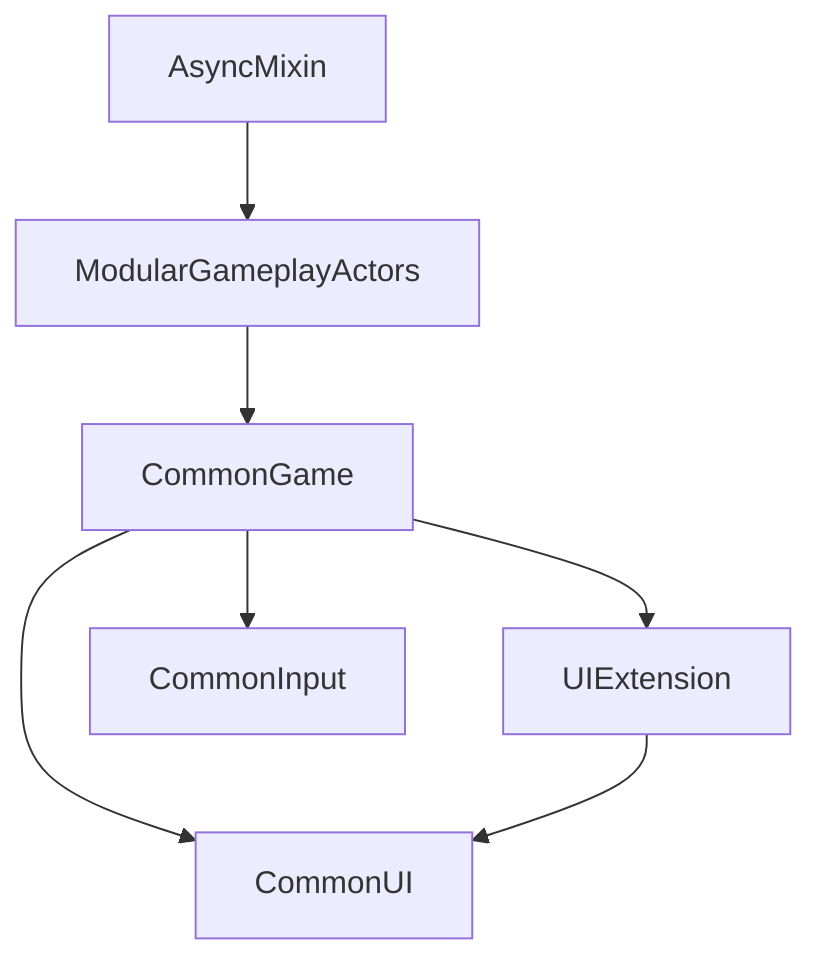

# Infrastructure Batch Synthesis

## Architecture Narrative <!-- c2d:x1 -->

Lyra 的基础框架层（Infrastructure）由 4 个插件组成，为上层的游戏代码提供了三个核心能力：

1. **UI 扩展系统**（UIExtension）：基于 GameplayTag 的松耦合 UI 组合框架
2. **游戏框架桥接**（CommonGame）：UE 标准游戏框架与 Lyra 的中间适配层
3. **模块化 Actor**（ModularGameplayActors）：GameFeature 组件注入的最小适配器
4. **异步加载**（AsyncMixin）：安全的顺序异步资产加载工具

这四个模块从底层到上层形成了清晰的依赖链：AsyncMixin(独立) → ModularGameplayActors → CommonGame → UIExtension。

## Architecture Type <!-- c2d:x2 -->

分层架构（Layered Architecture），底层工具 → 适配层 → 框架层 → 应用扩展层。

## System-Wide Patterns <!-- c2d:x3 -->

- **Subsystem 模式**：使用 UE5 的 WorldSubsystem 管理全局服务
- **GameplayTag 路由**：标签驱动的事件和数据分发
- **Delegates 事件驱动**：多播委托实现松耦合通信
- **Template Method**：虚函数钩子允许上层定制行为
- **Adapter/Shim**：薄适配层桥接不同抽象层次

## Dependency Graph <!-- c2d:x4 -->

## Module Summary <!-- c2d:x5 -->

| 模块 | LOC | 复杂度 | 依赖数 | 描述 |
|------|-----|--------|--------|------|
| AsyncMixin | 976 | Medium | 3 (UE only) | 零占用的顺序异步加载混合类 |
| ModularGameplayActors | 572 | Low | 5 | GameFeature 组件接收者适配器 |
| CommonGame | 3138 | Medium | 12 | 游戏框架桥接层 |
| UIExtension | 940 | Medium | 9 | GameplayTag 驱动的 UI 扩展系统 |

**总计: 5626 行，57 文件**
