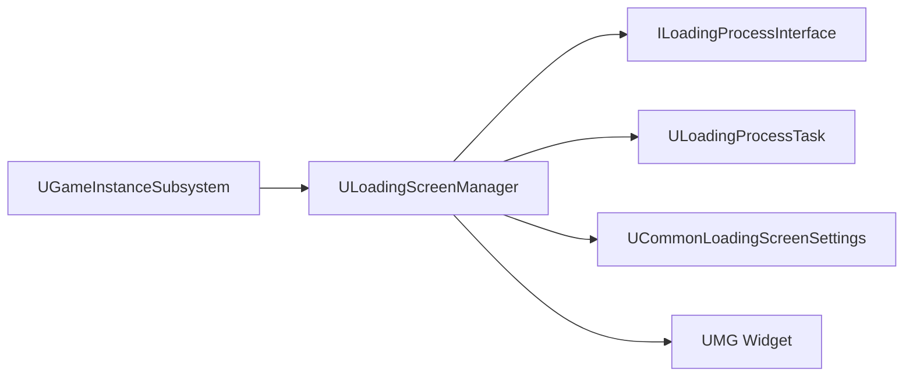

# CommonLoadingScreen

> 插件路径：`LyraStarterGame/Plugins/CommonLoadingScreen/Source/`

## 架构

GameInstanceSubsystem + FTickableGameObject 实现。监控地图加载、PlayerController 就绪和 `ILoadingProcessInterface` 实现者状态来决定是否显示/隐藏 UMG LoadingScreen Widget。

## 关键类

| 类 | 职责 |
|----|------|
| `ULoadingScreenManager` | 核心管理器，Tick 驱动，监控加载状态变化 |
| `ILoadingProcessInterface` | 可被任意 UObject 实现，声明自身为加载进程 |
| `ULoadingProcessTask` | 对 `ILoadingProcessInterface` 实现的便捷包装 |
| `UCommonLoadingScreenSettings` | DeveloperSettings，配置加载屏行为 |

## 行为

- 阻止所有 Slate 输入以防误操作
- 调整 `FShaderPipelineCache` 批处理模式加速加载
- 禁用世界渲染以节省性能
- CVar 控制的持续时间为纹理流送提供缓冲

## 依赖

- CommonGame（基础 UI 策略）
- UMG / Slate
- DeveloperSettings

## 相关文档

- [CommonStartupLoadingScreen](CommonStartupLoadingScreen.md) — 引擎启动阶段的预 Loading 屏
- [Core/UI](../Core/Modules/UI.md) — Lyra 的 UI/HUD 系统
