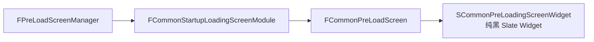

# CommonStartupLoadingScreen

> 插件路径：`LyraStarterGame/Plugins/CommonStartupLoadingScreen/Source/`

## 架构

纯黑 PreLoadScreen Widget，在引擎初始化阶段（主 LoadingScreen 接管前）通过 `FPreLoadScreenManager` 注册。跳过 Dedicated Server。



## 关键类

| 类 | 职责 |
|----|------|
| `FCommonStartupLoadingScreenModule` | IModuleInterface 实现，注册/注销 PreLoadScreen |
| `FCommonPreLoadScreen` | FPreLoadScreenBase 子类，控制 Widget 生命周期 |
| `SCommonPreLoadingScreenWidget` | 纯黑 Slate Widget，引擎早期渲染 |

## 执行时机

```
引擎启动 → FPreLoadScreenManager 接管 → CommonStartupLoadingScreen 显示 → 主关卡开始加载 → 切换至 CommonLoadingScreen → 游戏就绪
```

## 依赖

- PreLoadScreenManager（引擎层）
- SlateCore

## 相关文档

- [CommonLoadingScreen](CommonLoadingScreen.md) — 游戏加载阶段的主 Loading 屏
