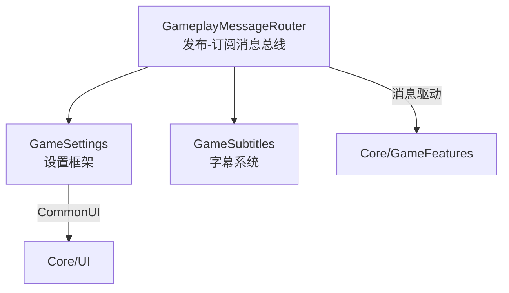

# Systems — 系统功能层

> 生成日期：2026-07-31 | 模式：Full | 模块数：3 | 总文件数：~98 | 总代码行：~6,964

## 概述

系统功能层（Systems）提供可复用、独立于具体游戏玩法的通用系统插件，位于 `LyraStarterGame/Plugins/` 下。

## 模块

| 模块 | 代码量 | 复杂度 | 文档 |
|------|--------|--------|------|
| **GameSettings** | 5,273 行 | High | [详情](Modules/GameSettings.md) |
| **GameSubtitles** | 734 行 | Medium | [详情](Modules/GameSubtitles.md) |
| **GameplayMessageRouter** | 957 行 | Medium | [详情](Modules/GameplayMessageRouter.md) |

## 架构

## 快速导航

- [基础设施层](../Infrastructure/Index.md) — ← 基础依赖
- [核心游戏代码](../Core/Index.md) — → 模块消费者
- [游戏玩法](../GameFeatures/Index.md) — → GameFeature 消费者
