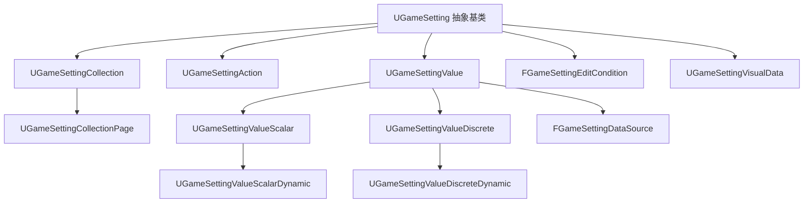

# GameSettings

> 插件路径：`LyraStarterGame/Plugins/GameSettings/Source/`

## 架构

完善的游戏设置框架，五层分层：

```
Model Layer: UGameSetting (抽象基类)
   ├─ UGameSettingCollection → UGameSettingCollectionPage (导航条目)
   ├─ UGameSettingAction (执行动作)
   └─ UGameSettingValue
        ├─ UGameSettingValueScalar → UGameSettingValueScalarDynamic
        └─ UGameSettingValueDiscrete → UGameSettingValueDiscreteDynamic

DataSource Layer: FGameSettingDataSource
   └─ 双向绑定 UProperty / UFunction

EditCondition Layer: FGameSettingEditCondition
   └─ 声明式可见性/可编辑性控制 (平台检测, 主玩家验证)

UI Layer: UGameSettingVisualData (DataAsset)
   └─ Setting → Entry Widget 映射, CommonUI ListView
```

### 架构图



## 关键类

| 类 | 职责 |
|----|------|
| `UGameSetting` | 抽象基类: DevName, DisplayName, Tags, 级联 Apply/Refresh |
| `UGameSettingCollection` | 设置容器, 递归子设置遍历 |
| `UGameSettingCollectionPage` | 可选择导航页, NavigationText |
| `UGameSettingAction` | 命名执行动作 (GameplayTag 驱动) |
| `UGameSettingValueScalarDynamic` | 动态标量值, DataSource 双向绑定, Range/Step |
| `UGameSettingValueDiscreteDynamic` | 离散选项, 动态增删 |
| `FGameSettingDataSource` | 抽象数据源 (Property / Function 路径) |
| `FGameSettingEditCondition` | 条件编辑 (平台 Trait, 主玩家状态) |

## 设计模式

- **UObject 继承树**: Setting 家族统一 Apply/Initialize 接口
- **DataSource 抽象**: 解耦 UProperty 读取/写入路径
- **DataAsset 配置**: VisualData 映射 Setting 到 Entry Widget
- **CommonUI 集成**: ActivatableWidget + ListView 导航

## 依赖

CommonUI, PropertyPathHelpers, GameplayTags, AssetManager, Slate/UMG

## 相关文档

- [Core/Settings（Lyra 本地设置实现）](../Core/Modules/Settings.md)
- [Core/UI（设置 UI 集成层）](../Core/Modules/UI.md)
