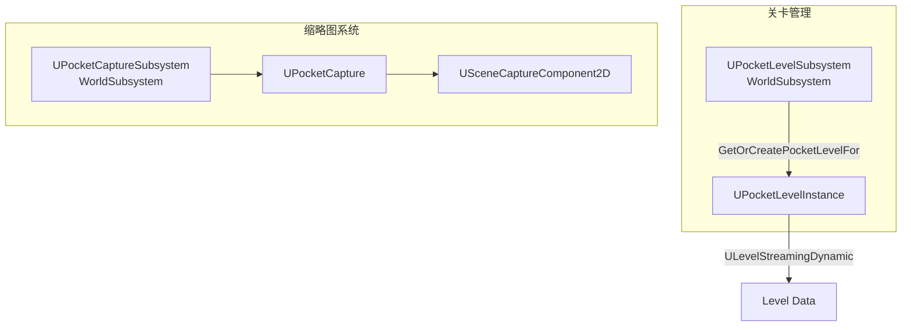

# PocketWorlds

> 插件路径：`LyraStarterGame/Plugins/PocketWorlds/Source/`

## 架构

双子系统（WorldSubsystem）插件，提供独立的迷你世界管理和缩略图渲染能力。

## 子系统

### UPocketLevelSubsystem

`WorldSubsystem`，管理程序化生成的小型关卡实例：

- `GetOrCreatePocketLevelFor(LocalPlayer, PocketLevel)` → `UPocketLevelInstance`
- 垂直偏移避免同类型多实例重叠
- `ULevelStreamingDynamic` 加载
- 已加载 Actor 自动标记 `bClientOnlyVisible` + `bExchangedRoles`

### UPocketCaptureSubsystem

`WorldSubsystem`，管理缩略图场景捕获池：

- `UPocketCapture` 管理单个捕获会话
- 3 通道渲染输出：
  | 通道 | 格式 | 用途 |
  |------|------|------|
  | Diffuse | RGBA8 | 漫反射颜色 |
  | AlphaMask | R8 | 透明度蒙版 |
  | Effects | R8 | 特效通道 |
- `USceneCaptureComponent2D` + `PRM_UseShowOnlyList`
- `FTSTicker` 驱动的纹理流送管理

## 关键类

| 类 | 职责 |
|----|------|
| `UPocketLevelSubsystem` | 口袋关卡生命周期管理 |
| `UPocketLevelInstance` | 单个口袋关卡的运行时实例 |
| `UPocketCaptureSubsystem` | 缩略图捕获池管理 |
| `UPocketCapture` | 单个捕获会话管理 |

## 依赖

- Engine（LevelStreaming, SceneCapture）
- EnhancedInput（相机控制）

## 相关文档

- [Core/System](../Core/Modules/System.md) — Lyra 系统层
- [LyraExampleContent](LyraExampleContent.md) — 示例内容（纯资产，无源码）
