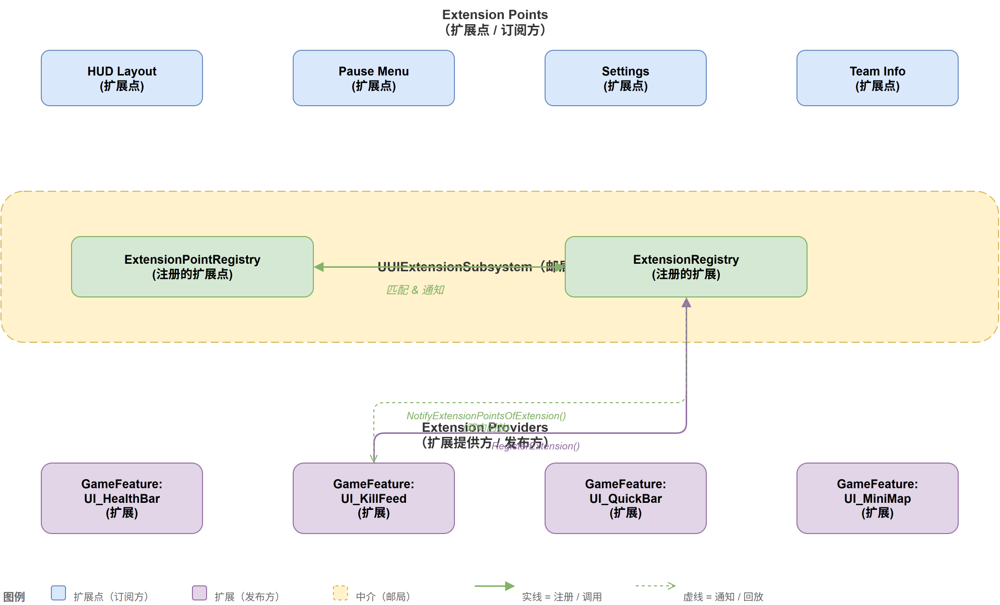
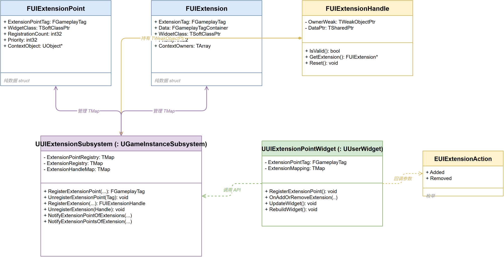
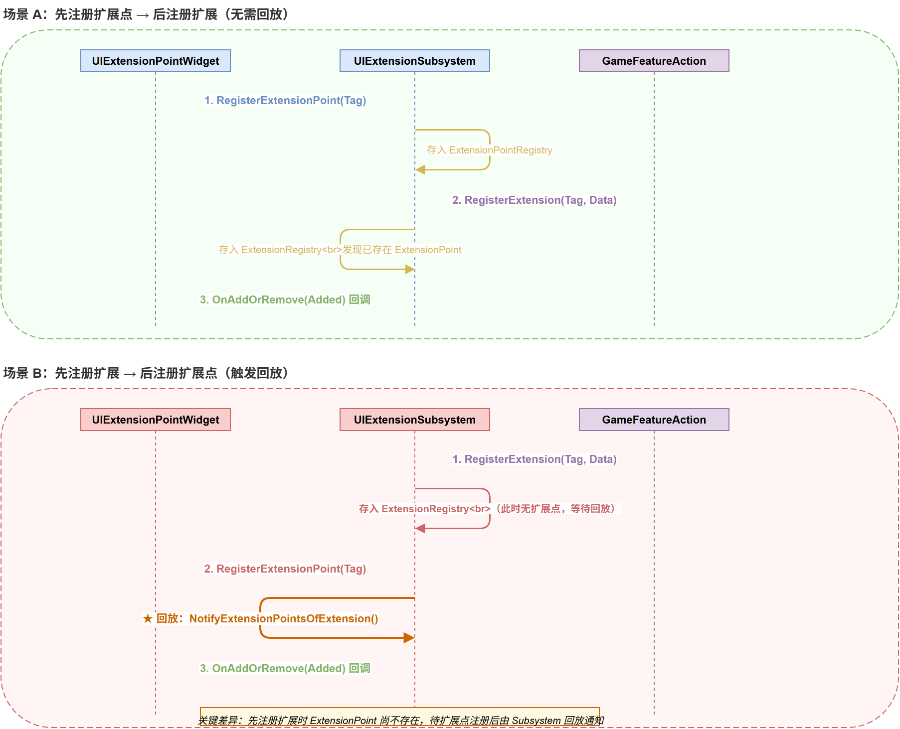
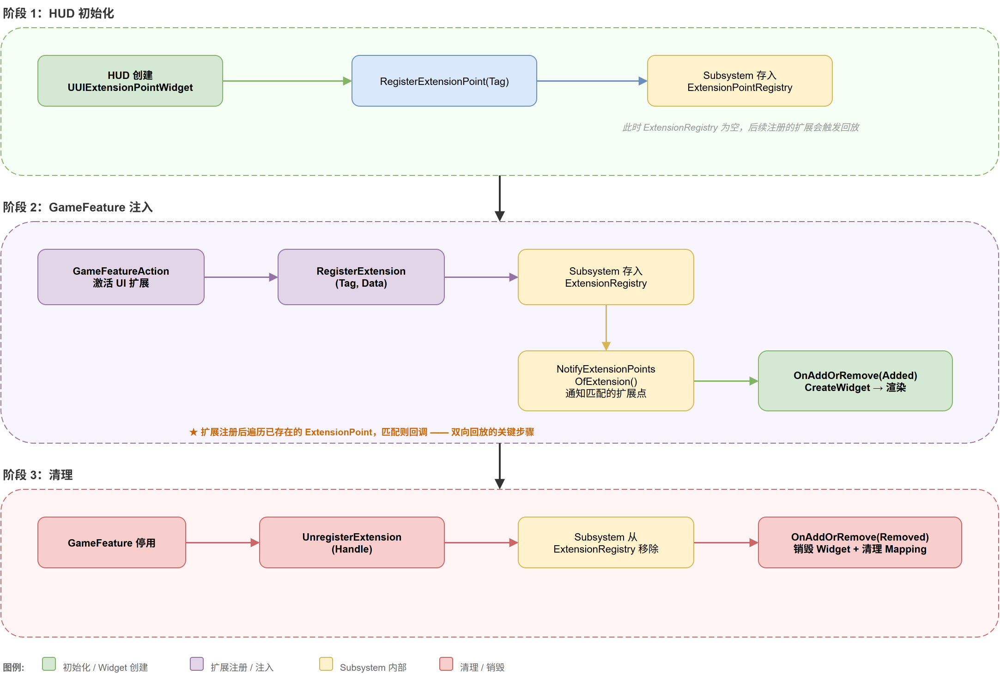

# 《LyraUI 深度解析》— UIExtension：GameplayTag 驱动的 UI 扩展框架

## 1. 引言

如果你正在做一款大型多人游戏，HUD 上要显示的东西很多：血条、弹药、小地图、计分板、任务追踪、队伍信息……更要命的是，不同玩法模式下需要显示的 UI 组合完全不一样——竞技模式不需要任务面板，合作模式又得多加一个队伍状态栏。

传统的做法很简单：在 C++ 或蓝图里直接硬编码引用 Widget 类，按需创建、添加到父容器。小项目这么做完全没问题——UI 就那么几个页面，一次性写好就完了。

但 Lyra 不是"小项目"。它的整个玩法架构建立在 **GameFeature 插件动态装配** 之上：一个 GameFeature 插件激活，不仅注入 Gameplay 逻辑，还得把配套的 UI 一起挂上去；插件停用时，UI 必须干净利落地消失。如果让 HUD 的 C++ 代码去直接引用某个插件里的 Widget 类——这耦合就炸了。

> "HUD 不应该知道 ShooterCore 插件里有个叫 `W_ShooterHUD` 的 Widget——它只需要知道**这个位置**有人来填东西就够了。"

这就是 UIExtension 要解决的核心问题。它用一个非常轻量的机制（不到 1000 行代码，7 个文件）实现了 UI 层的**发布/订阅解耦**：提供 UI 的插件只管"我要挂到某某 Tag 上"，消费 UI 的布局只管"我这个位置接受某某 Tag 的东西"。双方通过一个名为 `UUIExtensionSubsystem` 的 WorldSubsystem 做中介，互不感知。

**目标读者**：有 UE C++ 基础、想深入理解 Lyra UI 架构的开发者。

**前置知识**：
- 了解 GameplayTag 的基本用法（本文假设你已知道 `RequestDirectParent()` 和 Tag Hierarchy）
- 理解 WorldSubsystem / GameInstanceSubsystem 的生命周期差异
- 对 CommonUI（DynamicEntryBox）有基本认知

我们会从核心概念入手，逐步深入到源码细节，追问设计决策背后的权衡。

---

## 2. 核心概念

UIExtension 的世界里只有两个角色——你可以把它们想象成"信"和"信箱"：

**扩展（Extension）**：一封"信"。它说："我是一封信，要投递到 `UI.Layer.Game.HUD` 这个地址。"信的"内容"可以是一个 Widget 蓝图的类引用，也可以是一个普通 UObject 数据。

**扩展点（Extension Point）**：一个"信箱"。它说："我挂在 `UI.Layer.Game` 这个位置，收所有寄往这个地址（及其子地址）的信。"信箱上还贴了"契约"——只收特定类型的信（比如只收 `UUserWidget` 子类的）。

两者都注册到 `UUIExtensionSubsystem` 这个 WorldSubsystem 里——它就是一个中央邮局。来了新信？遍历所有信箱，匹配的就投递。新装了信箱？遍历所有积压的信件，匹配的就投递。信的寄出和信箱的安装，**先后顺序无关紧要**。



*图1：UIExtensionSystem 整体架构 — 发布/订阅解耦模型*

还有一个关键结构：**Handle**。`FUIExtensionHandle` 和 `FUIExtensionPointHandle` 是两个轻量级的 RAII 包装——持有它等于持有注册关系，销毁时自动反注册。你不需要记着"什么时候该调用 Unregister"，把 Handle 的生命周期管好就行。



*图2：UIExtensionSystem 核心类关系 UML 类图*

---

## 3. 源码精读

这一节我们按"数据契约 → 双向回放 → 匹配遍历 → 句柄设计 → GC 集成 → Widget 实战"的递进顺序，逐一拆解核心实现。

### 3.1 数据契约：DoesExtensionPassContract

信箱不是什么都收的。挂在信箱上的"契约"写明了：我只收这些类型的东西。这个检查发生在每次匹配时，是整个系统类型安全的最后一道防线。

```cpp
// 文件：UIExtensionSystem.cpp:35-59
bool FUIExtensionPoint::DoesExtensionPassContract(const FUIExtension* Extension) const
{
    if (UObject* DataPtr = Extension->Data)
    {
        // 契约一：上下文必须一致（都是 null，或指向同一个对象）
        const bool bMatchesContext =
            (ContextObject.IsExplicitlyNull() && Extension->ContextObject.IsExplicitlyNull()) ||
            ContextObject == Extension->ContextObject;

        if (bMatchesContext)
        {
            // 数据本身可能是 UClass（Widget 蓝图类型），也可能是一个实例
            const UClass* DataClass = DataPtr->IsA(UClass::StaticClass())
                ? Cast<UClass>(DataPtr) : DataPtr->GetClass();

            // 契约二：数据类型必须在白名单内
            for (const UClass* AllowedDataClass : AllowedDataClasses)
            {
                if (DataClass->IsChildOf(AllowedDataClass) ||
                    DataClass->ImplementsInterface(AllowedDataClass))
                {
                    return true;  // 通过契约
                }
            }
        }
    }
    return false;  // 契约不通过，这封信不收
}
```

**这段代码论证了什么？** 契约验证分两个维度：一是**上下文匹配**（同样的 Tag 在不同上下文产生不同匹配），二是**类型匹配**（用 `IsChildOf` 和 `ImplementsInterface` 做运行时类型检查）。注意 `IsExplicitlyNull()` 的用法——不是简单的 `== nullptr`，而是区分了"故意设为 null（全局匹配）"和"未初始化"两种状态。

### 3.2 双向回放：新来到的一方触发匹配

这是整个系统最精妙的设计。规则就一句话：**任意一方注册时，遍历另一方的 Map，找到匹配就回调。**

```cpp
// 文件：UIExtensionSystem.cpp:102-136
// ——注册扩展点（信箱）时——
FUIExtensionPointHandle UUIExtensionSubsystem::RegisterExtensionPointForContext(...)
{
    // 参数校验：Tag 无效、回调未绑定、AllowedDataClasses 为空，都拒绝
    if (!ExtensionPointTag.IsValid()) { ... return FUIExtensionPointHandle(); }

    FExtensionPointList& List = ExtensionPointMap.FindOrAdd(ExtensionPointTag);
    TSharedPtr<FUIExtensionPoint>& Entry = List.Add_GetRef(MakeShared<FUIExtensionPoint>());
    Entry->ExtensionPointTag = ExtensionPointTag;
    Entry->ContextObject = ContextObject;
    Entry->ExtensionPointTagMatchType = ExtensionPointTagMatchType;
    Entry->AllowedDataClasses = AllowedDataClasses;
    Entry->Callback = MoveTemp(ExtensionCallback);

    // ★ 关键：注册后立即回放已有扩展
    NotifyExtensionPointOfExtensions(Entry);

    return FUIExtensionPointHandle(this, Entry);
}

// ——注册扩展（信件）时——
FUIExtensionHandle UUIExtensionSubsystem::RegisterExtensionAsData(...)
{
    // 参数校验...
    FExtensionList& List = ExtensionMap.FindOrAdd(ExtensionPointTag);
    TSharedPtr<FUIExtension>& Entry = List.Add_GetRef(MakeShared<FUIExtension>());
    Entry->ExtensionPointTag = ExtensionPointTag;
    Entry->ContextObject = ContextObject;
    Entry->Data = Data;
    Entry->Priority = Priority;

    // ★ 关键：注册后立即通知已存在的扩展点
    NotifyExtensionPointsOfExtension(EUIExtensionAction::Added, Entry);

    return FUIExtensionHandle(this, Entry);
}
```

**这段代码论证了什么？** 整个系统的时序解耦只靠最后那一行调用：`NotifyExtensionPointOfExtensions`（回放已有扩展）和 `NotifyExtensionPointsOfExtension`（通知已有扩展点）。先到达的一方写入 Map 后遍历对方——发现对面是空的，就在原地等待。后到达的一方写入后遍历对方——找到匹配，回调触发。谁先谁后，最终结果完全一致。

> 这个过程很像去餐厅吃饭：你先到了，服务员说"还没准备好"，让你坐着等；后厨准备好了，服务员一样一样端上来。而如果后厨先准备好，你一到就立刻上菜。关键在于**服务员（Subsystem）在中间协调**，而不是你和后厨直接对接。



*图3：UIExtension 双向回放机制时序图 — 两种注册顺序，结果完全一致*

### 3.3 父链遍历匹配：NotifyExtensionPointsOfExtension

接下来是最关键的匹配逻辑。当一封"信"到达邮局时，怎么找到所有该投递的信箱？

```cpp
// 文件：UIExtensionSystem.cpp:210-235
void UUIExtensionSubsystem::NotifyExtensionPointsOfExtension(
    EUIExtensionAction Action, TSharedPtr<FUIExtension>& Extension)
{
    bool bOnInitialTag = true;
    // ★ 从扩展的 Tag 出发，沿父链向上爬
    for (FGameplayTag Tag = Extension->ExtensionPointTag;
         Tag.IsValid();
         Tag = Tag.RequestDirectParent())
    {
        if (const FExtensionPointList* ListPtr = ExtensionPointMap.Find(Tag))
        {
            FExtensionPointList ExtensionPointArray(*ListPtr);  // 拷贝一份防止回调中修改

            for (const TSharedPtr<FUIExtensionPoint>& ExtensionPoint : ExtensionPointArray)
            {
                // 初始 Tag（自身）总是匹配；父级 Tag 需要扩展点声明 PartialMatch
                if (bOnInitialTag ||
                    (ExtensionPoint->ExtensionPointTagMatchType ==
                     EUIExtensionPointMatch::PartialMatch))
                {
                    if (ExtensionPoint->DoesExtensionPassContract(Extension.Get()))
                    {
                        FUIExtensionRequest Request = CreateExtensionRequest(Extension);
                        ExtensionPoint->Callback.ExecuteIfBound(Action, Request);
                    }
                }
            }
        }
        bOnInitialTag = false;
    }
}
```

**这段代码论证了什么？** 这里有三个设计细节值得注意。

**第一，父链方向。** 假设扩展的 Tag 是 `UI.Layer.Game.HUD`，父链是 `HUD → Game → Layer → UI`。遍历时从 `HUD` 开始往上爬——这意味着扩展点如果精准注册在 `UI.Layer.Game.HUD`（ExactMatch），它会在第一轮 `bOnInitialTag=true` 时被命中；但如果扩展点注册在 `UI.Layer.Game`（PartialMatch），它会在第二轮父链到达 `Game` 时被命中。**父链是"扩展往上看"的方向——扩展在叶子节点，向上寻找愿意收它的扩展点。**

**第二，`bOnInitialTag` 的作用。** 这个布尔值确保：自己 Tag 那层，无论扩展点声明的是 ExactMatch 还是 PartialMatch，统统匹配（"自己当然匹配自己"）；到了父 Tag 那层，只有声明 PartialMatch 的才收（"愿意收子节点来信"的那些信箱）。

**第三，拷贝防御。** 第 218 行做了一个 `FExtensionPointList ExtensionPointArray(*ListPtr)` 的拷贝。注释说得很清楚：防止回调过程中扩展点列表被修改（比如回调里调了 `UnregisterExtensionPoint`），导致迭代器失效。这是发布/订阅模式常见的防御性拷贝写法。

### 3.4 句柄设计：RAII 的双重引用

Handle 的设计非常精巧——一个结构体同时持有两样东西：

```cpp
// 文件：UIExtensionSystem.h:79-106, 118-149
struct FUIExtensionHandle
{
    // ★ 私有构造，只能由 UUIExtensionSubsystem（friend）创建
    FUIExtensionHandle(UUIExtensionSubsystem* InExtensionSource,
                       const TSharedPtr<FUIExtension>& InDataPtr)
        : ExtensionSource(InExtensionSource), DataPtr(InDataPtr) {}

private:
    TWeakObjectPtr<UUIExtensionSubsystem> ExtensionSource;  // 弱引用：不阻止 Subsystem 销毁
    TSharedPtr<FUIExtension> DataPtr;                        // 强引用：共享扩展数据的所有权

    friend UUIExtensionSubsystem;  // 唯一能创建 Handle 的类
};
```

> ### 思考：为什么 Handle 要同时持有 WeakPtr 和 SharedPtr？

如果只用 `TSharedPtr<FUIExtension>`，Handle 拷贝/传递时 Extensions 永远不会被释放，哪怕 Subsystem 已经销毁了——这是内存泄漏。

如果只用 `TWeakObjectPtr<UUIExtensionSubsystem>`，Handle 无法持有 Extensions 的所有权，Subsystem 销毁后 Extensions 就没了，但外部代码还拿着 Handle 以为数据还在。

**两者组合的语义是**：`DataPtr`（SharedPtr）确保 Extensions 数据的生命周期与持有它的 Handle 一样长；`ExtensionSource`（WeakPtr）不阻止 Subsystem 销毁，但在 Unregister 时用来安全地访问 Subsystem 执行反注册操作。

```cpp
// 文件：UIExtensionSystem.cpp:25-31
void FUIExtensionHandle::Unregister()
{
    if (UUIExtensionSubsystem* ExtensionSourcePtr = ExtensionSource.Get())
    {
        ExtensionSourcePtr->UnregisterExtension(*this);
    }
    // Subsystem 已经没了？那也没必要反注册了——反正数据跟着没了
}
```

这个双重引用模式在很多引擎级中间件里都能看到——**共享所有权给了 Handle，生命周期控制权给了 Subsystem**，各司其职。

### 3.5 GC 集成：手动上报引用

UE 的 GC 系统靠 `UPROPERTY()` 标记来追踪 UObject 引用。但 UIExtensionSubsystem 的核心数据是这样的：

```cpp
TMap<FGameplayTag, TArray<TSharedPtr<FUIExtension>>> ExtensionMap;
TMap<FGameplayTag, TArray<TSharedPtr<FUIExtensionPoint>>> ExtensionPointMap;
```

**问题来了**：`TMap` 嵌套 `TArray<TSharedPtr<>>` 这种组合，`UPROPERTY` 不支持——GC 根本扫不到这些容器里的 UObject 引用。

**后果**：PIE 停止 → GC 运行 → 这些"看不见"的 Widget Blueprint Class 引用被回收 → 重新 PIE → UI 创建失败。

**解法**：重写 `AddReferencedObjects`，手动上报：

```cpp
// 文件：UIExtensionSystem.cpp:63-85
void UUIExtensionSubsystem::AddReferencedObjects(
    UObject* InThis, FReferenceCollector& Collector)
{
    Super::AddReferencedObjects(InThis, Collector);

    if (UUIExtensionSubsystem* This = Cast<UUIExtensionSubsystem>(InThis))
    {
        // 报告 ExtensionPointMap 中的 UClass 引用
        for (auto& [Tag, Points] : This->ExtensionPointMap)
        {
            for (auto& Point : Points)
            {
                Collector.AddReferencedObjects(Point->AllowedDataClasses);
            }
        }
        // 报告 ExtensionMap 中的 UObject 数据引用
        for (auto& [Tag, Extensions] : This->ExtensionMap)
        {
            for (auto& Extension : Extensions)
            {
                Collector.AddReferencedObject(Extension->Data);
            }
        }
    }
}
```

> ### 思考：为什么不直接用 UPROPERTY 兼容的容器？

把 `TSharedPtr<FUIExtension>` 改成 `UObject` 子类当然可以——但会带来不必要的 GC 开销。FUIExtension 只是一个轻量的数据描述结构，不需要反射、不需要序列化、不需要蓝图暴露。用 `TSharedPtr` 配合手动 GC 上报，是在"类型简单性"和"GC 安全性"之间的一个务实权衡。

### 3.6 Widget 层：UUIExtensionPointWidget 实战

以上都是纯数据层的设计。最终面向设计师的，是拖到 UMG Canvas 上就能用的 `UUIExtensionPointWidget`。它继承自 CommonUI 的 `UDynamicEntryBoxBase`——本质上是一个能动态添加/移除子 Widget 的容器。

它在 `RebuildWidget()` 时完成三件事：

```cpp
// 文件：UIExtensionPointWidget.cpp:31-68
TSharedRef<SWidget> UUIExtensionPointWidget::RebuildWidget()
{
    if (!IsDesignTime() && ExtensionPointTag.IsValid())
    {
        ResetExtensionPoint();
        RegisterExtensionPoint();  // ① 注册两个上下文：全局 + LocalPlayer

        // ② 异步等待 PlayerState 就绪，再注册第三个上下文
        GetOwningLocalPlayer<UCommonLocalPlayer>()
            ->CallAndRegister_OnPlayerStateSet(
                FDelegate::CreateUObject(this,
                    &UUIExtensionPointWidget::RegisterExtensionPointForPlayerState));
    }

    if (IsDesignTime())
    {
        // ③ 设计时：显示占位文本，方便设计师在 UMG 编辑器里看到这个"槽位"
        return SNew(SOverlay) + SOverlay::Slot()
            [SNew(STextBlock).Text(FText::Format(
                LOCTEXT("DesignTime", "Extension Point\n{0}"),
                FText::FromName(ExtensionPointTag.GetTagName())))];
    }
    return Super::RebuildWidget();
}
```

三次注册都绑定了同一个回调 `OnAddOrRemoveExtension`：

```cpp
// 文件：UIExtensionPointWidget.cpp:117-155
void UUIExtensionPointWidget::OnAddOrRemoveExtension(
    EUIExtensionAction Action, const FUIExtensionRequest& Request)
{
    if (Action == EUIExtensionAction::Added)
    {
        TSubclassOf<UUserWidget> WidgetClass(Cast<UClass>(Request.Data));
        if (WidgetClass)
        {
            // 数据本身就是 Widget 类 → 直接创建
            UUserWidget* Widget = CreateEntryInternal(WidgetClass);
            ExtensionMapping.Add(Request.ExtensionHandle, Widget);
        }
        else if (DataClasses.Num() > 0)
        {
            // 数据是其他类型 → 通过委托获取 Widget 类
            if (GetWidgetClassForData.IsBound())
            {
                WidgetClass = GetWidgetClassForData.Execute(Data);
                if (UUserWidget* Widget = CreateEntryInternal(WidgetClass))
                {
                    ExtensionMapping.Add(Request.ExtensionHandle, Widget);
                    ConfigureWidgetForData.ExecuteIfBound(Widget, Data);
                }
            }
        }
    }
    else  // Removed
    {
        if (UUserWidget* Extension = ExtensionMapping.FindRef(Request.ExtensionHandle))
        {
            RemoveEntryInternal(Extension);
            ExtensionMapping.Remove(Request.ExtensionHandle);
        }
    }
}
```

**这段代码论证了什么？** Widget 层用了一个巧妙的"模板方法"模式：C++ 负责创建/销毁 Widget 的框架逻辑，蓝图通过 `GetWidgetClassForData` 和 `ConfigureWidgetForData` 两个委托处理"这个数据该用哪个 Widget 展示"和"怎么把数据塞给这个 Widget"。**分界线很清楚——框架层管生命周期，业务层管映射关系。**

注意 `ExtensionMapping` 这个 `TMap<FUIExtensionHandle, UUserWidget*>`——它按 Handle 精确记录每个扩展对应哪个 Widget。这样当扩展被移除（`Action == Removed`）时，能精准找到并销毁对应的 Widget，而不是销毁整个容器重来。

---

### 3.7 实战：Lyra 中 UIExtension 的完整数据流

把前面分析的所有组件串起来，Lyra 中一次典型的 UI 装配流程分为三个阶段：



*图4：UIExtension 完整数据流 — HUD 初始化 → GameFeature 注入 → 清理*

---

## 4. 设计思考

### 4.1 为什么用 WorldSubsystem 而不是 GameInstanceSubsystem？

这是最常见的问题。答案可以总结为一句话：**系统里注册的所有对象都是 World 作用域的，Subsystem 应该和它们同生共死。**

具体来说：

- **关卡无缝切换**：`UGameInstance` 跨关卡持久存在，但 `UWorld`、`LocalPlayer`、`PlayerState` 全部重建。WorldSubsystem 随旧世界一起销毁，新世界白手起家，不需要任何手动清理。如果换成 GameInstanceSubsystem，旧世界的 Widget 引用全部变成悬空指针，必须自己维护一套注销/重注册逻辑。

- **PIE 多窗口**：每个 PIE 实例有独立 World，WorldSubsystem 天然隔离；GameInstanceSubsystem 会把所有窗口的扩展混在一起。

- **Dedicated Server**：DS 没有 UI，WorldSubsystem 即使创建也不会产生有意义的注册。

| 维度 | WorldSubsystem（实际采用） | 如果用 GameInstanceSubsystem |
|------|---------------------------|---------------------------|
| 关卡切换 | 自动清零，无需手动清理 | 需手动注销所有旧 UI，重注册新 UI |
| PIE 多窗口 | 天然隔离，互不影响 | 所有窗口混在一起 |
| DS 场景 | 自然排除 | 需额外 `IsNetMode` 判断 |

### 4.2 为什么 Tag 匹配要做"父链遍历"？

你可能会想：为什么不直接用 `FGameplayTag::MatchesTag()` 或者 `HasTag()`？

因为 GameplayTag 的 `MatchesTag` 是判断"我是不是某个 Tag 的子节点"——这需要知道哪个是父、哪个是子。但在我们的场景里，扩展和扩展点双方都可能注册在父节点或子节点上，关系是双向的。

**父链遍历的本质**：把双向匹配问题转化为单向遍历——从扩展的 Tag 出发，沿父链一步步向上爬，每爬一步检查该层是否有注册的扩展点。这个算法的复杂度是 O(父链深度)，而 GameplayTag 的 `RequestDirectParent()` 是 O(1) 的——非常轻量。

### 4.3 为什么 PartialMatch 和 ExactMatch 是扩展点的属性？

这是一个微妙的设计选择。匹配策略（ExactMatch / PartialMatch）放在了扩展点侧，而不是扩展侧。

| 策略放在... | 语义 | 问题 |
|------------|------|------|
| 扩展侧 | "我这封信愿意送到哪些地址" | 每个提供方都要操心匹配策略，容易配错 |
| **扩展点侧**（实际） | "我这个信箱收哪些地址的邮件" | 消费方（UI 布局）是架构的控制者，它来定义规则 |

**谁控制 UI 的最终形态？** 是 HUDLayout（布局），不是 GameFeature 插件。布局设计了"这里有一个槽位，收 `UI.Layer.Game` 子树下的所有东西"——这个"子树下的所有东西"的策略，自然应该由布局方定义。GameFeature 插件只管"我把内容投递到 `UI.Layer.Game.HUD`"，它不关心也不应该关心收件方的匹配策略。

### 4.4 为什么不做排序？

你可能会注意到：`FUIExtension` 有 `Priority` 字段，但在通知回调时并没有做排序。

这是因为**排序的时机不对**。Subsystem 的职责是"匹配通知"，不是"决定展示顺序"。排序是消费方（扩展点的回调）根据 `FUIExtensionRequest` 里的 `Priority` 自己决定的事。把排序逻辑留在消费方，比放在 Subsystem 里更灵活——不同扩展点可能有不同的排序需求。

### 4.5 这个设计模式有没有历史渊源？

"发布/订阅 + 双向回放"不是凭空发明的。如果你接触过 Java 的 OSGi 框架，会发现 UIExtension 和它的 Service Registry 非常相似：服务提供方注册 Service，消费方通过 ServiceTracker 监听，新来的任何一方都能"回看"已注册的另一方——和我们的 `NotifyExtensionPointOfExtensions` / `NotifyExtensionPointsOfExtension` 如出一辙。

在 UE 自身的基因里也能找到线索：Delegate 系统（多播委托）是"一对多通知"，但它缺少"回放已有状态"的能力——如果你在委托广播之后才绑定，之前的事件你就错过了。UIExtension 在 Delegate 的基础上多加了一层 Registry：**不是"事件发生时通知"，而是"注册时立即回放"**。

从设计演进角度看，这背后的驱动力很纯粹：**GameFeature 的动态加载打破了"先初始化 UI 框架，再加载玩法内容"的单向顺序**。当加载顺序不再可控时，你只有两个选择——要么强制排序（增加耦合），要么设计成顺序无关。UIExtension 选择了后者，而"双向回放"就是实现顺序无关的核心机制。这个选择看似只多了一行 `NotifyExtensionPointOfExtensions` 调用，但却是整个架构张力的释放点。

---

## 附录：注意事项与边界

### A.1 PartialMatch 的代价

父链遍历在一次匹配中可能多次调用 `RequestDirectParent()`，Tags 层级很深时理论上有微小开销。但 GameplayTag 的父链查询是 O(1) 的，Lyra 目前的 Tag 层级最多 3-4 层——可以忽略。

### A.2 批量移除的性能

当前没有做批量反注册的优化：如果一次性移除大量扩展，每个扩展都会触发一次完整的遍历和回调。Lyra 目前的使用规模（几十个扩展）远没到这个量级，但如果你自己的项目可能有上百个动态扩展，可以考虑加一个批量接口。

### A.3 PlayerState 上下文的绑定时机

`UUIExtensionPointWidget` 绑定 PlayerState 依赖 `OwningPlayer → LocalPlayer → PlayerController → PlayerState` 这条链。如果 Widget 在没有 PlayerController 时创建（比如编辑器预览），PlayerState 上下文就是 null，只有全局扩展会被匹配。

### A.4 设计时的占位文本

注意 `RebuildWidget()` 里的 `IsDesignTime()` 分支——设计时它不注册任何东西，而是显示一个 `"Extension Point\nUI.Layer.Game"` 的占位文本。这让设计师在 UMG 编辑器里能直观看到哪里有个扩展点槽位。

---

## 7. 总结

UIExtension 用不到 1000 行代码，解决了一个实际工程问题：**在 GameFeature 动态加载的架构下，UI 组件怎么发现彼此并组合起来。**

核心设计可以浓缩为三个要点：

1. **Tag 做路由，Subsystem 做中介**。提供方和消费方互不感知，通过 GameplayTag 和 Subsystem 解耦。父链遍历 + PartialMatch/ExactMatch 策略为 Tag 层级结构赋予了语义。

2. **双向回放消除时序依赖**。先注册扩展点还是先注册扩展，结果完全一致——Subsystem 在中间做回放协调。这让 GameFeature 插件的加载顺序不再影响 UI 的正确装配。

3. **Handle RAII + 契约验证 + 手动 GC**。三层防护确保系统在动态注册/注销过程中的类型安全、内存安全和生命周期安全。

如果要在自己的项目里借鉴这个模式：GameplayTag 的层级设计要有规划（PartialMatch 依赖它）、扩展优先级的使用要有规范、尽早建立 PlayerState 上下文的绑定链。

回头再看那个"信/信箱/邮局"的比喻——UIExtension 本质上就是一个没有邮递员的邮局：信和信箱各自登记，Subsystem 只在对方到达时做一次"回放匹配"，然后退到幕后。双方通过 Tag 寻址，通过 Contract 校验，通过 Handle 管理生命周期。理解了这套"发布/订阅 + 双向回放"的模式，Lyra 的整个 UI 拼图也就清晰了。

---

**相关文档**:
- UI Layer 系统：PrimaryGameLayout 的 `PushWidgetToLayerStack` 机制
- GameFeatureAction_AddWidget：GameFeature 插件的 UI 注入入口
- CommonGame：提供 `CommonLocalPlayer::CallAndRegister_OnPlayerStateSet`

**下一篇预告**：深入 Lyra 的 UI Layer 系统——`PrimaryGameLayout` 如何实现多层级 UI 交叠、`PushWidgetToLayerStack` 的工作原理，以及 GameFeature 停用时 UI 层级如何安全回退。
