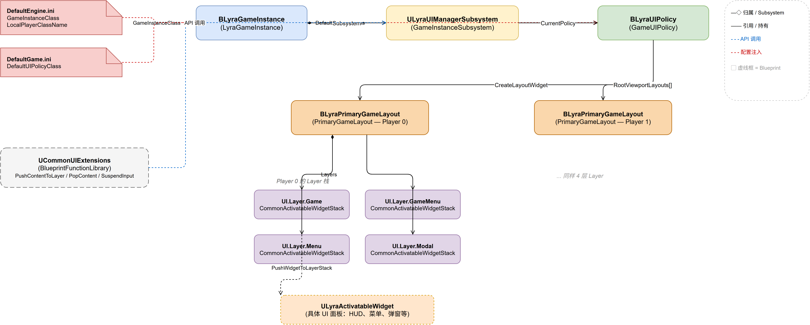
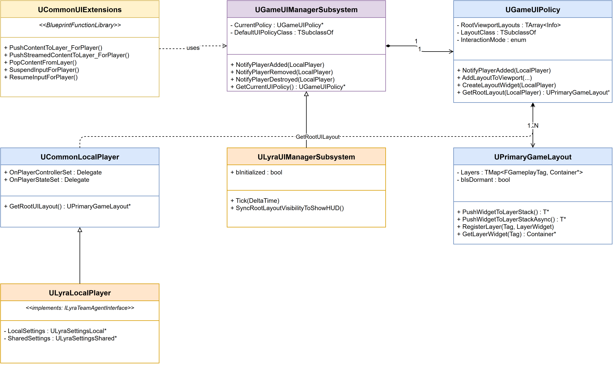
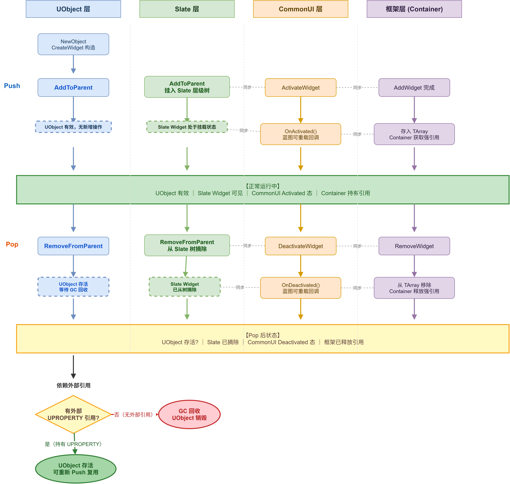
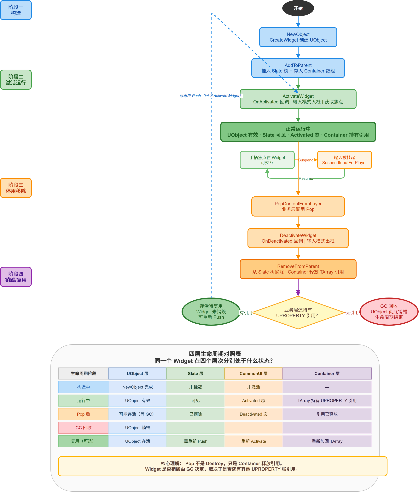

# 《LyraUI框架》- 深入理解 Lyra 的 UI 架构

---

## 一、引言

在 UE5 的游戏 UI 开发中，你大概率用过 `CreateWidget` + `AddToViewport` 的方式——简单直接，只管创建然后往屏幕上扔。但当你开始构建一个真正有规模的游戏项目时，问题就来了：菜单和游戏界面的输入切换谁来管？HUD 控件怎么和暂停菜单共存？分屏多人模式下每个玩家的 UI 怎么隔离？

如果你打开 Lyra 工程想看看官方是怎么处理这些问题的，大概率会被两个东西劝退：一个是 UI 相关代码散落在 CommonGame 插件和 LyraGame 项目两个地方，层次有点多；另一个是文件虽然不多但命名看起来都差不多——Manager、Policy、Layout、Extension，它们之间的关系不好理清。

这篇文章就围绕 Lyra 的 UI 框架，把它的设计脉络从头到尾捋一遍。读完你应该能画出完整的架构图，知道每个文件在系统中的位置；真正理解关键代码路径的实现；以及，看明白 Epic 在这套框架里做的架构取舍——哪些地方设计得很漂亮，哪些地方其实就是为了解耦而解耦。

如果你完全没接触过 Lyra 或 CommonUI，建议先粗略浏览一下 Lyra 的工程结构再回来读。

---

## 二、核心概念

在深入源码之前，先建立几个关键概念的认知。这套框架的核心只有四个角色：

| 概念 | 一句话定义 | UE 类型 |
|------|-----------|---------|
| **UIManager** | 挂载在 GameInstance 下的子系统，持有并调度 UIPolicy | `UGameInstanceSubsystem` |
| **UIPolicy** | 管理"每个玩家 → PrimaryGameLayout"的映射关系，负责 Layout 的创建和视口添加 | `UObject`（限定 Outer 为 UIManager） |
| **PrimaryGameLayout** | 每个玩家的 UI 根节点，通过 GameplayTag 管理多层 Widget 堆栈 | `UCommonUserWidget` |
| **UIExtensions** | 蓝图可直接调用的便捷 API，封装了 Manager → Policy → Layout 的查找链 | `UBlueprintFunctionLibrary` |

它们之间的所有权关系非常清晰：

```
GameInstance
  └─ UIManagerSubsystem  (1:1)
       └─ UIPolicy        (1:1)
            └─ PrimaryGameLayout[]  (1:N，每个玩家一个)
                 └─ Layer[UI.Layer.Game]        (GameplayTag → WidgetContainer)
                 └─ Layer[UI.Layer.GameMenu]    (暂停菜单等)
                 └─ Layer[UI.Layer.Menu]        (主菜单等)
                 └─ Layer[UI.Layer.Modal]       (模态弹窗)
```

这里的 **Layer** 是关键设计。它不是一个简单的 Widget 容器——每个 Layer 实际上是一个 `UCommonActivatableWidgetContainerBase`，它会管理自己内部 Widget 的激活/停用状态和过渡动画。当你往某个 Layer 推入一个 Widget 时，Container 会自动处理焦点切换和输入悬停（Suspend/Resume）。

### 2.1 架构全景图



### 2.2 类继承关系



---

## 三、源码分析

按照"玩家加入游戏 → UI 系统就位 → Widget 推入 Layer → Lyra 定制的 Tick 同步"这条链路，逐步解读关键实现。

### 3.1 入口：GameInstance 触发 UI 创建

整个 UI 框架的起点在 `AddLocalPlayer`。当引擎创建好 LocalPlayer 后，GameInstance 需要通知 UI 系统为此玩家准备 Layout：

```cpp
// CommonGameInstance.cpp
int32 UCommonGameInstance::AddLocalPlayer(ULocalPlayer* NewPlayer, FPlatformUserId UserId)
{
    int32 ReturnVal = Super::AddLocalPlayer(NewPlayer, UserId);
    if (ReturnVal != INDEX_NONE)
    {
        // 设置首个加入玩家为 PrimaryPlayer
        if (!PrimaryPlayer.IsValid())
            PrimaryPlayer = NewPlayer;

        // 通知 UI 管理器：有玩家加入，请准备 Layout
        GetSubsystem<UGameUIManagerSubsystem>()
            ->NotifyPlayerAdded(Cast<UCommonLocalPlayer>(NewPlayer));
    }
    return ReturnVal;
}
```

这段代码的逻辑很直白：先走父类的标准 AddLocalPlayer 流程，成功后把第一个加入的玩家标记为主玩家，然后通知 UI 管理器。注意这里用的是 `GetSubsystem<T>()`——UE5 的 Subsystem 机制，直接从 GameInstance 上按类型索引。

`RemoveLocalPlayer` 也对应地调用 `NotifyPlayerDestroyed`，保证对称性。

### 3.2 UCommonLocalPlayer：玩家与 UI 的桥梁

在深入 Manager/Policy 之前，有必要先看清 `UCommonLocalPlayer` 在整个 UI 框架中的关键角色。它是 **玩家系统与 UI 框架之间的粘合层**，所有 UI 操作都通过它来定位"这是哪个玩家"。

`UCommonLocalPlayer` 继承自引擎基类 `ULocalPlayer`，在 CommonGame 插件中定义。它本身不包含任何游戏逻辑——它的职责纯粹是提供三个事件钩子和一个 UI 导航方法。

#### 三个生命周期委托

```cpp
// CommonLocalPlayer.h
DECLARE_MULTICAST_DELEGATE_TwoParams(FPlayerControllerSetDelegate,
    UCommonLocalPlayer* LocalPlayer, APlayerController* PlayerController);
FPlayerControllerSetDelegate OnPlayerControllerSet;

DECLARE_MULTICAST_DELEGATE_TwoParams(FPlayerStateSetDelegate,
    UCommonLocalPlayer* LocalPlayer, APlayerState* PlayerState);
FPlayerStateSetDelegate OnPlayerStateSet;

DECLARE_MULTICAST_DELEGATE_TwoParams(FPlayerPawnSetDelegate,
    UCommonLocalPlayer* LocalPlayer, APawn* Pawn);
FPlayerPawnSetDelegate OnPlayerPawnSet;
```

这三个委托覆盖了玩家生命周期中最重要的三个节点：

| 委托 | 触发时机 | UI 框架如何使用 |
|------|---------|---------------|
| `OnPlayerControllerSet` | PlayerController 就绪（登录完成） | **核心**：Policy 监听此委托，Controller 就绪后将 Layout 添加到视口。这是 UI 显示的真正起点 |
| `OnPlayerStateSet` | PlayerState 同步完成 | UI 可用于显示玩家 ID、队伍颜色等状态信息 |
| `OnPlayerPawnSet` | Pawn 生成/切换 | UI 可用于切换角色相关的 HUD 元素 |

触发链路由 `UCommonPlayerController` 驱动：

```cpp
// CommonPlayerController.cpp — 关键路径
void ACommonPlayerController::ReceivedPlayer()
{
    Super::ReceivedPlayer();
    if (UCommonLocalPlayer* LP = Cast<UCommonLocalPlayer>(Player))
        LP->OnPlayerControllerSet.Broadcast(LP, this);  // ← 触发 UI 创建
}

void ACommonPlayerController::SetPawn(APawn* InPawn)
{
    Super::SetPawn(InPawn);
    if (UCommonLocalPlayer* LP = Cast<UCommonLocalPlayer>(Player))
        LP->OnPlayerPawnSet.Broadcast(LP, InPawn);
}
```

这就是 3.4 节 Policy 监听 `OnPlayerControllerSet` 的原因——当 Controller 就绪时，Policy 才真正把 Layout 挂到屏幕上。

#### GetRootUILayout：从玩家直达 UI 根节点

```cpp
UPrimaryGameLayout* UCommonLocalPlayer::GetRootUILayout() const
{
    // 通过 UIManager → Policy → 查找该玩家的 Layout
}
```

这是 UI 框架中最常用的"入口方法"。任何拥有 `LocalPlayer` 指针的地方，都可以通过 `GetRootUILayout()` 直接拿到该玩家的 `PrimaryGameLayout`，然后往对应的 Layer 推入 Widget。

#### 配置装配：LyraLocalPlayer 的集成

Lyra 通过 `DefaultEngine.ini` 将 `ULyraLocalPlayer` 设为项目的 LocalPlayer 类：

```ini
[/Script/Engine.Engine]
LocalPlayerClassName=/Script/LyraGame.LyraLocalPlayer
```

`ULyraLocalPlayer` 继承 `UCommonLocalPlayer`，额外增加了设置管理（`LyraSettingsLocal`/`LyraSettingsShared`）和队伍接口（`ILyraTeamAgentInterface`）。但 UI 框架只在 `UCommonLocalPlayer` 的层级上工作——它不关心子类做了什么，只依赖三个委托和 `GetRootUILayout()`。

**小结**：`UCommonLocalPlayer` 是 UI 框架的"类型锚点"。Manager 和 Policy 的所有接口都接受 `UCommonLocalPlayer*` 参数，而不是工程基类的 `ULocalPlayer*`。这使得框架可以在不引入项目特定类型的前提下，获得委托通知和 Layout 导航能力。

### 3.3 分发：UIManager 的 NotifyPlayerAdded

Manager 收到通知后的处理极其简短：

```cpp
// GameUIManagerSubsystem.cpp
void UGameUIManagerSubsystem::NotifyPlayerAdded(UCommonLocalPlayer* LocalPlayer)
{
    if (ensure(LocalPlayer) && CurrentPolicy)
    {
        CurrentPolicy->NotifyPlayerAdded(LocalPlayer);
    }
}
```

就是一句转发。那为什么还要保留这个 Manager？为什么不直接从 GameInstance 调用 Policy？下一章设计思考部分会展开——先记住这里的职责纯粹是"持有 Policy 并透明转发"。

还有一件事：Manager 是一个 **Abstract** 类，同时在它的 `ShouldCreateSubsystem` 中有这样的逻辑：

```cpp
// GameUIManagerSubsystem.cpp
bool UGameUIManagerSubsystem::ShouldCreateSubsystem(UObject* Outer) const
{
    if (!CastChecked<UGameInstance>(Outer)->IsDedicatedServerInstance())
    {
        TArray<UClass*> ChildClasses;
        GetDerivedClasses(GetClass(), ChildClasses, false);
        // 只有当没有子类时才创建自己
        return ChildClasses.Num() == 0;
    }
    return false;
}
```

这意味着：如果 LyraGame 定义了 `ULyraUIManagerSubsystem`（继承自它），那 CommonGame 里的这个抽象 Manager 就不会被创建——只有子类实例生效。而且 DS 上直接返回 false，不创建任何 UI 子系统。

### 3.4 创建 Layout：GameUIPolicy 的核心职责

Policy 是真正干活的地方。`NotifyPlayerAdded` 的逻辑分两条路径：

```cpp
// GameUIPolicy.cpp
void UGameUIPolicy::NotifyPlayerAdded(UCommonLocalPlayer* LocalPlayer)
{
    // 注册回调：当 LocalPlayer 的 Controller 就绪时，重新添加 Layout
    LocalPlayer->OnPlayerControllerSet.AddWeakLambda(this,
        [this](UCommonLocalPlayer* LocalPlayer, APlayerController* PlayerController)
        {
            NotifyPlayerRemoved(LocalPlayer);
            if (FRootViewportLayoutInfo* LayoutInfo = RootViewportLayouts.FindByKey(LocalPlayer))
            {
                AddLayoutToViewport(LocalPlayer, LayoutInfo->RootLayout);
                LayoutInfo->bAddedToViewport = true;
            }
            else
            {
                CreateLayoutWidget(LocalPlayer);
            }
        });

    // 如果已经有 LayoutInfo，直接添加到视口；否则创建
    if (FRootViewportLayoutInfo* LayoutInfo = RootViewportLayouts.FindByKey(LocalPlayer))
    {
        AddLayoutToViewport(LocalPlayer, LayoutInfo->RootLayout);
        LayoutInfo->bAddedToViewport = true;
    }
    else
    {
        CreateLayoutWidget(LocalPlayer);
    }
}
```

这里有几个细节：

1. **Lambda 注册的回调**：这个回调绑定了 `OnPlayerControllerSet` 事件。为什么需要这个？因为在某些时机（比如 Seamless Travel），PlayerController 可能会被替换。当新 Controller 就位时，需要把旧 Layout 从视口移除，再将当前 Layout 重新加到视口上（或者创建新的）。这样保证了 Layout 始终跟随正确的 PlayerContext。

2. **两条路径的 Fallback**：如果 `RootViewportLayouts` 里已经有这个玩家的记录（之前创建过但被移除了），直接 `AddLayoutToViewport`；否则走 `CreateLayoutWidget` 新建一个。这解决了玩家"加入-移除-重新加入"的场景。

`CreateLayoutWidget` 本身清晰简明：

```cpp
// GameUIPolicy.cpp
void UGameUIPolicy::CreateLayoutWidget(UCommonLocalPlayer* LocalPlayer)
{
    if (APlayerController* PlayerController = LocalPlayer->GetPlayerController(GetWorld()))
    {
        TSubclassOf<UPrimaryGameLayout> LayoutWidgetClass = GetLayoutWidgetClass(LocalPlayer);
        if (ensure(LayoutWidgetClass && !LayoutWidgetClass->HasAnyClassFlags(CLASS_Abstract)))
        {
            UPrimaryGameLayout* NewLayoutObject = CreateWidget<UPrimaryGameLayout>(
                PlayerController, LayoutWidgetClass);
            RootViewportLayouts.Emplace(LocalPlayer, NewLayoutObject, true);
            AddLayoutToViewport(LocalPlayer, NewLayoutObject);
        }
    }
}
```

`LayoutWidgetClass` 来自蓝图配置（在 B_LyraUIPolicy 蓝图上设置），最终指向的是 `B_LyraPrimaryGameLayout`。Policy 本身也是一个 Blueprintable 类，意味着团队可以在蓝图中配置 Layout 类型而不必写 C++。

`AddLayoutToViewport` 负责将 Layout Widget 挂载到屏幕上，ZOrder 为 1000，确保在普通 HUD 之上：

```cpp
// GameUIPolicy.cpp
void UGameUIPolicy::AddLayoutToViewport(UCommonLocalPlayer* LocalPlayer,
    UPrimaryGameLayout* Layout)
{
    Layout->SetPlayerContext(FLocalPlayerContext(LocalPlayer));
    Layout->AddToPlayerScreen(1000);
    OnRootLayoutAddedToViewport(LocalPlayer, Layout);
}
```

### 3.5 Layer 系统：PrimaryGameLayout 的多层堆栈

`PrimaryGameLayout` 是每个玩家的 UI 根节点，它通过 `TMap<FGameplayTag, UCommonActivatableWidgetContainerBase*>` 管理多个 Layer：

```cpp
// PrimaryGameLayout.h
class UPrimaryGameLayout : public UCommonUserWidget
{
    // 注册一个 Layer
    void RegisterLayer(FGameplayTag LayerTag,
        UCommonActivatableWidgetContainerBase* LayerWidget);

    // 通过 Tag 获取 Layer
    UCommonActivatableWidgetContainerBase* GetLayerWidget(FGameplayTag LayerName);

private:
    TMap<FGameplayTag, TObjectPtr<UCommonActivatableWidgetContainerBase>> Layers;
};
```

在蓝图中，设计师可以在 PrimaryGameLayout 的子类里放置多个 `CommonActivatableWidgetStack`（或其他 Container 类型），并给每个绑定一个 `UI.Layer.X` Tag。运行时，`RegisterLayer` 把 Tag 和 Container 关联起来：

```cpp
// PrimaryGameLayout.cpp
void UPrimaryGameLayout::RegisterLayer(FGameplayTag LayerTag,
    UCommonActivatableWidgetContainerBase* LayerWidget)
{
    if (!IsDesignTime())
    {
        // 监听层级切换事件，自动挂起/恢复输入
        LayerWidget->OnTransitioningChanged.AddUObject(
            this, &UPrimaryGameLayout::OnWidgetStackTransitioning);
        // 过渡时长设为 0，保证手柄焦点立即切换
        LayerWidget->SetTransitionDuration(0.0);
        Layers.Add(LayerTag, LayerWidget);
    }
}
```

Push 一个 Widget 到指定 Layer 的代码非常紧凑——Container 自己负责所有 Widget 生命周期管理：

```cpp
// PrimaryGameLayout.h (template)
template <typename ActivatableWidgetT = UCommonActivatableWidget>
ActivatableWidgetT* PushWidgetToLayerStack(FGameplayTag LayerName,
    UClass* ActivatableWidgetClass,
    TFunctionRef<void(ActivatableWidgetT&)> InitInstanceFunc)
{
    if (UCommonActivatableWidgetContainerBase* Layer = GetLayerWidget(LayerName))
    {
        return Layer->AddWidget<ActivatableWidgetT>(
            ActivatableWidgetClass, InitInstanceFunc);
    }
    return nullptr;
}
```

### 3.6 便捷 API：CommonUIExtensions 的封装

`CommonUIExtensions` 提供了一套蓝图可调用的静态函数。以 `PushContentToLayer_ForPlayer` 为例，它做的事情就是把"查找 Manager → 查找 Policy → 查找 Layout → PushWidget"这条长链封装起来：

```cpp
// CommonUIExtensions.cpp
UCommonActivatableWidget* UCommonUIExtensions::PushContentToLayer_ForPlayer(
    const ULocalPlayer* LocalPlayer, FGameplayTag LayerName,
    TSubclassOf<UCommonActivatableWidget> WidgetClass)
{
    if (UGameUIManagerSubsystem* UIManager =
        LocalPlayer->GetGameInstance()->GetSubsystem<UGameUIManagerSubsystem>())
    {
        if (UGameUIPolicy* Policy = UIManager->GetCurrentUIPolicy())
        {
            if (UPrimaryGameLayout* RootLayout =
                Policy->GetRootLayout(CastChecked<UCommonLocalPlayer>(LocalPlayer)))
            {
                return RootLayout->PushWidgetToLayerStack(LayerName, WidgetClass);
            }
        }
    }
    return nullptr;
}
```

三层 if 嵌套看起来啰嗦，但它忠实地反映了架构：Manager → Policy → Layout → Layer。每一层都可能为 null（比如在网络初始化阶段 Manager 可能还没准备好），所以逐层判空是必要的。

同时也提供了异步版 `PushStreamedContentToLayer_ForPlayer`，使用 `RequestAsyncLoad` 先加载 Widget 资源再推入，加载期间自动暂停输入。

Pop 侧的入口同样在 `CommonUIExtensions` 中，调用链是对称的——同样的三层查找，最终走到 `PrimaryGameLayout`：

```cpp
// CommonUIExtensions.cpp
void UCommonUIExtensions::PopContentFromLayer(UCommonActivatableWidget* ActivatableWidget)
{
    if (!ActivatableWidget)
    {
        return;  // 防御：Widget 可能已被 GC 回收
    }

    if (const ULocalPlayer* LocalPlayer = ActivatableWidget->GetOwningLocalPlayer())
    {
        if (const UGameUIManagerSubsystem* UIManager =
            LocalPlayer->GetGameInstance()->GetSubsystem<UGameUIManagerSubsystem>())
        {
            if (const UGameUIPolicy* Policy = UIManager->GetCurrentUIPolicy())
            {
                if (UPrimaryGameLayout* RootLayout =
                    Policy->GetRootLayout(CastChecked<UCommonLocalPlayer>(LocalPlayer)))
                {
                    RootLayout->FindAndRemoveWidgetFromLayer(ActivatableWidget);
                }
            }
        }
    }
}
```

`FindAndRemoveWidgetFromLayer` 遍历所有 Layer，逐一调用 `RemoveWidget`——因为调用方不指定 Layer Tag，框架自己去找到 Widget 所在的 Layer 并移除（详见 3.9.4 节的完整 Pop 链路分析）。

Push 和 Pop 的入口对比：

| | Push（压入） | Pop（弹出） |
|---|-------------|------------|
| **方法** | `PushContentToLayer_ForPlayer` | `PopContentFromLayer` |
| **参数** | LocalPlayer + LayerTag + WidgetClass | 要弹出的 Widget 实例指针 |
| **查找链** | Manager → Policy → Layout | Widget → OwningLocalPlayer → Manager → Policy → Layout |
| **核心调用** | `PushWidgetToLayerStack` | `FindAndRemoveWidgetFromLayer` |
| **返回** | 新创建的 Widget 指针 | void |

不对称之处在于参数——Push 时需要指定目标 Layer Tag（`UI.Layer.Game` / `UI.Layer.Menu` 等），而 Pop 时不需要。原因是 Pop 传入的是 Widget 实例本身，`FindAndRemoveWidgetFromLayer` 内部会遍历所有 Layer 查找该实例，找到后就地移除。

### 3.7 Lyra 定制：Tick 同步 HUD 可见性

`ULyraUIManagerSubsystem` 只做了一件事：在 Tick 中将 RootLayout 的可见性和 HUD 的 `bShowHUD` 同步：

```cpp
// LyraUIManagerSubsystem.cpp
void ULyraUIManagerSubsystem::SyncRootLayoutVisibilityToShowHUD()
{
    if (const UGameUIPolicy* Policy = GetCurrentUIPolicy())
    {
        for (const ULocalPlayer* LocalPlayer :
            GetGameInstance()->GetLocalPlayers())
        {
            bool bShouldShowUI = true;
            if (const APlayerController* PC =
                LocalPlayer->GetPlayerController(GetWorld()))
            {
                const AHUD* HUD = PC->GetHUD();
                if (HUD && !HUD->bShowHUD)
                    bShouldShowUI = false;
            }
            if (UPrimaryGameLayout* RootLayout =
                Policy->GetRootLayout(CastChecked<UCommonLocalPlayer>(LocalPlayer)))
            {
                const ESlateVisibility DesiredVisibility = bShouldShowUI
                    ? ESlateVisibility::SelfHitTestInvisible
                    : ESlateVisibility::Collapsed;
                if (DesiredVisibility != RootLayout->GetVisibility())
                    RootLayout->SetVisibility(DesiredVisibility);
            }
        }
    }
}
```

这个设计解决了什么痛点？HUD 的 `bShowHUD` 是引擎层面的标准机制，但 Lyra 的 UI 不通过传统 HUD 绘制——它是直接挂在 Viewport 上的 UmG Widget。`bShowHUD = false` 时（如过场动画），传统 HUD 会自动隐藏，但 UMG Widget 不会。所以 Lyra 用这个 Tick 同步来"模拟"传统 HUD 的可见性行为。

### 3.8 输入模式控制：LyraActivatableWidget

#### 问题背景

UE 原生的 `APlayerController::SetInputMode` 决定输入流向（Game Only / UI Only / Game And UI）。在复杂 UI 层级（嵌套弹窗、异步加载、多人分屏）下，手动维护输入模式极易出错。Lyra 的方案是：**让每个 Widget 声明自己期望的输入模式，框架自动维护输入模式栈。**

#### 四种输入模式

`ULyraActivatableWidget` 定义了 `ELyraWidgetInputMode` 枚举：

| 枚举值 | 含义 | 对应原生模式 | 典型用途 |
|--------|------|-------------|---------|
| `Default` | 不改变当前输入模式 | — | 绝大多数 HUD 子元素（准星、弹药数） |
| `GameAndMenu` | 游戏和 UI 输入同时生效 | `FInputModeGameAndUI` | HUD 主布局 |
| `Game` | 仅游戏输入 | `FInputModeGameOnly` | 过场动画覆盖层、纯显示层 |
| `Menu` | 仅 UI 输入，完全吞噬游戏输入 | `FInputModeUIOnly` | 暂停菜单、设置面板、主菜单 |

#### 核心机制：GetDesiredInputConfig

覆盖自 `UCommonActivatableWidget` 的虚函数，根据 `InputConfig` 枚举返回 `FUIInputConfig`：

- `GameAndMenu` → `FUIInputConfig(ECommonInputMode::All, GameMouseCaptureMode)` — 鼠标锁定策略由第二个 `UPROPERTY` 控制
- `Game` → `FUIInputConfig(ECommonInputMode::Game, GameMouseCaptureMode)`
- `Menu` → `FUIInputConfig(ECommonInputMode::Menu, EMouseCaptureMode::NoCapture)` — 菜单下鼠标 **固定不锁定**，允许移出窗口
- `Default` → `TOptional<FUIInputConfig>()` — 返回空值，表示"不参与输入决策"

关键点：**Menu 模式下鼠标捕获强制为 `NoCapture`**，与 Game/GameAndMenu 的逻辑不同——菜单场景需要玩家能自由移动鼠标。

#### 自动驱动：栈式输入管理

设计者不需要手动调 `SetInputMode`。当 Widget 通过 `PushWidgetToLayerStack` 压入 Layer 时：

1. CommonUI 框架调用 `ActivateWidget()` → 内部读取 `GetDesiredInputConfig()`
2. 若返回值非空，通过 `PlayerController->SetInputMode()` 应用
3. Widget 出栈时，`DeactivateWidget()` 自动恢复到上一个 Widget 的输入配置

输入模式形成一个 **Widget 激活栈**，始终和顶层 Widget 保持一致。

#### 过渡期输入保护

Widget 切换期间（如从主菜单切到设置面板），两个 Widget 短暂共存会导致输入冲突。`PrimaryGameLayout` 通过 `SuspendInputForPlayer` / `ResumeInputForPlayer` 机制保护：

```cpp
// PrimaryGameLayout::OnWidgetStackTransitioning
if (bIsTransitioning)
    SuspendInputForPlayer(GetOwningLocalPlayer(), TEXT("GlobalStackTransion"));
else
    ResumeInputForPlayer(GetOwningLocalPlayer(), SuspendTokens.Pop());
```

`SuspendInputTokens` 用 `TArray<FName>` 栈管理，支持嵌套挂起——异步加载 UI 期间也使用同一套机制。

#### 编辑器编译期校验

`ValidateCompiledWidgetTree` 在**蓝图编译时**检查子类是否实现了 `BP_GetDesiredFocusTarget`。未实现则输出 Warning：手柄操作下无法确定焦点落点。这是防御性设计——在保存时就暴露问题，而非到测试阶段才发现。

#### 设计师控制面板

```cpp
UPROPERTY(EditDefaultsOnly, Category = Input)
ELyraWidgetInputMode InputConfig = Default;     // 核心行为

UPROPERTY(EditDefaultsOnly, Category = Input)
EMouseCaptureMode GameMouseCaptureMode = CapturePermanently;  // 鼠标锁定策略
```

两个 `UPROPERTY` 暴露给蓝图，设计师按需配置，无需触碰 C++。

#### 实际使用对照

| Widget | InputConfig | 理由 |
|--------|------------|------|
| HUD 主布局 | `GameAndMenu` | 需同时响应按键 + UI 交互 |
| 暂停菜单 | `Menu` | 打开后游戏输入完全阻塞 |
| 准星/弹药显示 | `Default` | 父节点已是 GameAndMenu，子元素不重复决策 |
| 过场动画覆盖层 | `Game` | 纯显示，不响应 UI 交互 |

**设计总结**：声明式而非命令式——每个 Widget 声明"我要什么输入模式"，栈式容器自动维护，过渡期有保护，编辑器阶段有校验。

---

### 3.9 UI Widget 生命周期

前面分析了 Widget 如何 Push 进 Layer、如何通过 Pop 移除。但一个完整的 UI Widget 生命周期不止 Push/Pop 两个动作——它还涉及 UObject 的构造和 GC、CommonUI 的激活/停用回调、Slate 的挂载/摘除，以及输入模式的入栈/出栈。

这三套生命周期交织在一起：**框架层**负责"什么时候创建/移除"（Container 管理），**CommonUI 层**负责"激活/停用时干什么"（输入模式切换），**UObject/GC 层**负责"对象什么时候真正消亡"。把它们拆开来看，才能理清每个节点的责任归属。

#### 3.9.1 三套生命周期的叠加关系



图中"正常运行中"和"Pop 后状态"之间的四个箭头是**同步发生**的——当调用 `PopContentFromLayer` 时，框架一次性完成 DeactivateWidget、RemoveFromParent、从 TArray 移除三步操作。但 GC 回收不在 Pop 的调用瞬间发生，它取决于 Widget 是否还有其他 UObject 强引用。

#### 3.9.2 Push 阶段：完整的构造链路

从业务代码调用 `PushContentToLayer_ForPlayer` 到 Widget 在屏幕上可见，框架走过下面这条链路：

```
PushContentToLayer_ForPlayer(LocalPlayer, LayerTag, WidgetClass)
  │
  └─ UIManager → UIPolicy → PrimaryGameLayout      // 三层查找
       │
       └─ PushWidgetToLayerStack(LayerTag, WidgetClass)
            │
            └─ GetLayerWidget(LayerTag)             // Tag → Container
                 │
                 └─ Container::AddWidget(Class, InitFunc)
                      │
                      ├─ 1. CreateWidget<T>()       // NewObject, UObject 构造
                      ├─ 2. AddToParent()           // 挂入 Slate 层级树
                      ├─ 3. 存入内部 TArray          // Container 获取 UPROPERTY 强引用
                      └─ 4. ActivateWidget()        // CommonUI 激活回调
                           │
                           ├─ OnActivated()         // 蓝图可重载
                           ├─ GetDesiredInputConfig()  // 输入模式入栈
                           └─ BP_GetDesiredFocusTarget()  // 手柄焦点
```

对应源码（完整调用链已在 3.4~3.6 节展开）：

```cpp
// CommonUIExtensions.cpp — 入口封装
UCommonActivatableWidget* UCommonUIExtensions::PushContentToLayer_ForPlayer(
    const ULocalPlayer* LocalPlayer, FGameplayTag LayerName,
    TSubclassOf<UCommonActivatableWidget> WidgetClass)
{
    // ... 三层判空 ...
    return RootLayout->PushWidgetToLayerStack(LayerName, WidgetClass);
}

// PrimaryGameLayout.h — 模板方法
template <typename ActivatableWidgetT>
ActivatableWidgetT* PushWidgetToLayerStack(FGameplayTag LayerName,
    UClass* ActivatableWidgetClass,
    TFunctionRef<void(ActivatableWidgetT&)> InitInstanceFunc)
{
    if (UCommonActivatableWidgetContainerBase* Layer = GetLayerWidget(LayerName))
    {
        return Layer->AddWidget<ActivatableWidgetT>(
            ActivatableWidgetClass, InitInstanceFunc);
    }
    return nullptr;
}
```

Push 完成后，Widget 的引用状态：

| 引用来源 | 类型 | 生命周期 |
|---------|------|---------|
| Container 内部 `TArray` | `UPROPERTY` 强引用 | 直到 Pop 或 Container 销毁 |
| 调用方保存的返回值 | 取决于是否 `UPROPERTY` | 裸指针随函数退出失效，UPROPERTY 则持续持有 |

#### 3.9.3 输入模式随激活/停用自动切换

这是 CommonUI 框架的核心价值之一。`ActivateWidget()` 内部会读取 `GetDesiredInputConfig()` 的返回值（已在 3.8 节详细分析），形成输入模式栈：

```
Widget A (GameAndMenu) 入栈 → SetInputMode(GameAndUI)
  │
  Widget B (Menu) 入栈       → SetInputMode(UIOnly)
  │                             游戏输入被 B 完全吞噬
  │
  Widget B (Menu) 出栈       → 恢复上一层输入模式
  │                             SetInputMode(GameAndUI)
  │
  Widget A (GameAndMenu) 出栈 → 无上层 Widget，恢复默认
```

这个栈由 CommonUI 内部维护，业务代码完全不需要手动管理 `SetInputMode`。过渡期间（一个 Widget 正在 Deactivate 而另一个正在 Activate），`PrimaryGameLayout` 通过 `SuspendInputForPlayer` / `ResumeInputForPlayer` 机制保护，避免输入冲突。

#### 3.9.4 Pop 阶段：完整的移除链路

```
PopContentFromLayer(ActivatableWidget)
  │
  └─ UIManager → UIPolicy → PrimaryGameLayout      // 同样的三层查找
       │
       └─ FindAndRemoveWidgetFromLayer(Widget)
            │
            └─ for each Layer:
                 Layer->RemoveWidget(*Widget)
                      │
                      ├─ 1. DeactivateWidget()     // OnDeactivated 回调
                      ├─ 2. RemoveFromParent()     // Slate 树摘除，画面不可见
                      └─ 3. 从内部 TArray 移除     // Container 释放强引用
```

对应源码：

```cpp
// CommonUIExtensions.cpp
void UCommonUIExtensions::PopContentFromLayer(UCommonActivatableWidget* ActivatableWidget)
{
    if (!ActivatableWidget) { return; }  // 安全降级：Widget 可能已被 GC

    if (const ULocalPlayer* LocalPlayer = ActivatableWidget->GetOwningLocalPlayer())
    {
        // ... 三层查找 ...
        RootLayout->FindAndRemoveWidgetFromLayer(ActivatableWidget);
    }
}

// PrimaryGameLayout.cpp
void UPrimaryGameLayout::FindAndRemoveWidgetFromLayer(
    UCommonActivatableWidget* ActivatableWidget)
{
    for (const auto& LayerKVP : Layers)
    {
        LayerKVP.Value->RemoveWidget(*ActivatableWidget);
    }
}
```

`PopContentFromLayer` 第一行 `if (!ActivatableWidget) return;` 是防御性设计——GC 可能在业务代码调用 Pop 之前已经回收了 Widget，此时直接安全返回。

#### 3.9.5 关键问题：Pop 后是否销毁？

**答案：取决于调用方是否依然持有 UObject 强引用。**

Container 在 Pop 时释放了自己的 `UPROPERTY` 强引用，但**它不会主动调用 `MarkPendingKill` 或 `ConditionalBeginDestroy`**。Widget 的存亡最终由 UE 的 GC 机制决定：

| 场景 | 调用方行为 | Pop 后 Widget 状态 | GC 行为 |
|------|-----------|-------------------|---------|
| **A: 用完即弃（最常见）** | 不保存返回值，或只保存为裸指针 | Container 释放后无任何 `UPROPERTY` 引用 | 下次 GC 回收，**实际销毁** |
| **B: 缓存复用** | 调用方把返回值存入 `UPROPERTY()` 成员 | 调用方持有强引用，不会被 GC | **不销毁**，可再次 Push 复用 |
| **C: 局部变量持有** | Push 后存在函数局部变量指针 | 函数退出后裸指针失效 | 同场景 A，GC 回收 |

**实际工程中，绝大多数情况是场景 A**——业务代码 Push 一个面板，用户关闭时调用 Pop，那块引用丢失，下一次 GC 触发时就回收了。这种设计避免了手动管理内存的复杂性，同时为场景 B（Widget 缓存复用）保留了可能——只要调用方用一个 `UPROPERTY` 成员保留下 Widget 指针，Pop 后 Widget 依然存活，可以再次 Push 而不必重新构造和初始化。

#### 3.9.6 完整生命周期状态图

把三套生命周期合并成一张状态图，覆盖从构造到 GC 销毁的全部阶段：



四个阶段的关键状态：

| 阶段 | UObject | Slate | CommonUI | 框架引用 |
|------|---------|-------|----------|---------|
| **构造中** | 已 NewObject | 未挂载 | 未激活 | — |
| **运行中** | 有效 | 可见 | Activated | Container TArray |
| **Pop 后、GC 前** | 可能有效 | 已摘除 | Deactivated | 已释放 |
| **已销毁** | GC 回收 | — | — | — |

其中"Pop 后、GC 前"是一个灰色地带——Widget 已经从 Slate 树上摘除、输入模式已出栈、`OnDeactivated` 已调用，但 UObject 尚未被 GC 回收。如果此时有代码持有裸指针并错误地认为 Widget"还活着"而操作它，不会崩溃（UObject 仍然有效），但行为会出现偏差（Widget 不可见、输入不响应）。所以规范的做法是 Pop 后将业务侧的 Widget 指针置空，避免误用。

---

## 四、设计思考

### 思考 1：为什么用 Subsystem 而不是直接在 GameInstance 中管理 UI？

技术上完全可以在 `CommonGameInstance` 里挂一个 `UPROPERTY` 持有 UIPolicy，然后在 `AddLocalPlayer` 里直接操作。那为什么要引入 `UGameInstanceSubsystem` 这一层？

两点考虑：

**职责分离**。GameInstance 本身已经承载了太多东西——Session 管理、Level 切换、网络初始化。把 UI 管理的完整生命周期（Initialize/Deinitialize/Tick）挪到 Subsystem 里，GameInstance 只需要在最关键的时机（AddLocalPlayer）说一句"该你了"，其余细节不关心。

**可替换性**。Subsystem 可以通过 `ShouldCreateSubsystem` 的反射机制实现"如果有子类就不要创建我"的优先级策略（前面源码分析里已经看到）。这意味着 CommonGame 提供了一个默认空的抽象 Manager，LyraGame 继承并添加 Tick 逻辑——两边的代码都不需要修改，只需要存在继承关系就自动选中正确的子类。如果把这段逻辑写在 GameInstance 里，要么用虚函数重载（侵入性更高），要么用大量 if-else 判断子类。

### 思考 2：为什么需要 UIPolicy 这一层？不能直接在 Manager 里创建 Layout 吗？

Manager 的职责是"什么时候"创建（生命周期管理），Policy 的职责是"怎么创建"（策略定制）。

看 Policy 的成员函数列表就能感受到：`CreateLayoutWidget`、`AddLayoutToViewport`、`RemoveLayoutFromViewport`、`OnRootLayoutReleased`——这些都是需要被项目定制的行为。如果把 Manager 和 Policy 合在一起，定制意味着要继承整个大 Manager 类，改动面太大。

更关键的，Policy 支持三种多人模式（`ELocalMultiplayerInteractionMode`）：`PrimaryOnly`、`SingleToggle`、`Simultaneous`。这个切换逻辑（比如 `RequestPrimaryControl`）完全属于"UI 策略"的范畴，和 Manager 的生命周期管理职责是不同的维度。

另外 Policy 被标记为 `Blueprintable`、`Within = GameUIManagerSubsystem`，意味着它可以在蓝图中被配置（选择 Layout Widget Class、多人模式等），而无需写 C++。

### 思考 3：为什么拆成 CommonGame 和 LyraGame 两层？

打开 Lyra 的文件结构，UI 框架的代码横跨两个模块：

| 模块 | 文件 | 职责 |
|------|------|------|
| CommonGame | `GameUIManagerSubsystem`、`GameUIPolicy`、`PrimaryGameLayout`、`CommonUIExtensions` 等 | 可跨项目复用的通用框架 |
| LyraGame | `LyraUIManagerSubsystem`、`LyraActivatableWidget` | Lyra 项目特有的定制逻辑 |

这就是 Epic 推荐的"库-应用"分层模式。CommonGame 提供的是一个完整的 UI 框架**协议**：你怎么告诉框架"玩家加入了"、框架怎么还你一个 Layout、你通过什么 API 往 Layout 里推 Widget。LyraGame 只需要做两件事：继承关键类加自己的逻辑，然后通过配置文件"缝合"起来。

缝合的方式极其简单——三行配置：

```ini
; DefaultEngine.ini — 告诉引擎：用 LyraGameInstance 做 GameInstance
[/Script/EngineSettings.GameMapsSettings]
GameInstanceClass=/Game/B_LyraGameInstance.B_LyraGameInstance_C

; DefaultEngine.ini — 告诉引擎：用 LyraLocalPlayer 做 LocalPlayer
[/Script/Engine.Engine]
LocalPlayerClassName=/Script/LyraGame.LyraLocalPlayer

; DefaultGame.ini — 告诉 UIManager：用 B_LyraUIPolicy 做策略
[/Script/LyraGame.LyraUIManagerSubsystem]
DefaultUIPolicyClass=/Game/UI/B_LyraUIPolicy.B_LyraUIPolicy_C
```

如果下一个项目也用这套框架，只需要继承 CommonGame 的类，换上自己的配置，不用修改 CommonGame 一行代码。

### 思考 4：Layer 为什么用 GameplayTag 标识？

`PrimaryGameLayout` 里的 Layer 不是用枚举或字符串标识的——用的是 `FGameplayTag`。

这个选择很务实。用枚举的话，Layer 的数量必须在 C++ 编译期确定，每加一个新 Layer（比如加一个"教程层"）就得改代码。用 GameplayTag，设计师在蓝图中任意添加新的 Container Widget，给它赋一个 Tag 就行，完全不需要动 C++。Tag 还天然带层级语义（`UI.Layer.Game` 在 `UI.Layer` 之下），在编辑器里自动归类显示。

### 思考 5：为什么 PushWidgetToLayerStack 用 template？

```cpp
template <typename ActivatableWidgetT = UCommonActivatableWidget>
ActivatableWidgetT* PushWidgetToLayerStack(FGameplayTag LayerName,
    UClass* ActivatableWidgetClass, TFunctionRef<void(ActivatableWidgetT&)> InitInstanceFunc)
```

核心原因：**类型安全的派生类访问**。`AddWidget` 返回的是 `UCommonActivatableWidget*`，但调用方通常创建的是子类（比如 `LyraSettingScreen`），需要一个具体类型的指针来调用子类特有的初始化逻辑。用 template，编译期就推导出正确的类型，省掉了每次手动 Cast。`InitInstanceFunc` 的回调也在同一套模板参数下工作，保证了"创建什么类型，回调就拿什么类型"。

---

## 五、总结

Lyra 的 UI 框架本质上是一套**"管理层分离 + 配置缝合"**的设计。

四条关键认知：

1. **三层管理结构**：Manager（生命周期）→ Policy（策略）→ Layout（布局）。每一层只做自己分内的事，不跨界。

2. **Layer 是核心抽象**：UI 不是平铺的，而是按 GameplayTag 分层的。每层内部由 `CommonActivatableWidgetStack` 自动管理 Widget 的激活/停用和输入切换。

3. **CommonGame 定义协议，LyraGame 定制行为**：框架层提供 Subsystem 子类化、配置驱动的缝合点；项目层只需继承 + 配置，不修改框架代码。

4. **所有 API 最终都通向 PushWidgetToLayerStack**：无论是 `CommonUIExtensions` 的静态方法，还是 `PrimaryGameLayout` 的异步版本，底层都是 `GetLayerWidget → AddWidget`，没有第二条路径。

理解这套框架，死记硬背没用——反过来说，如果你能闭眼画出"玩家加入时谁通知谁、Widget 显示时谁找谁、配置在哪个 INI 里把谁和谁绑在一起"这三张图，那就说明真懂了。

---

*本文基于 LyraStarterGame (UE5.5) 源码分析。相关文件索引见 [UIFramework-FileIndex.md](./UIFramework-FileIndex.md)。*
