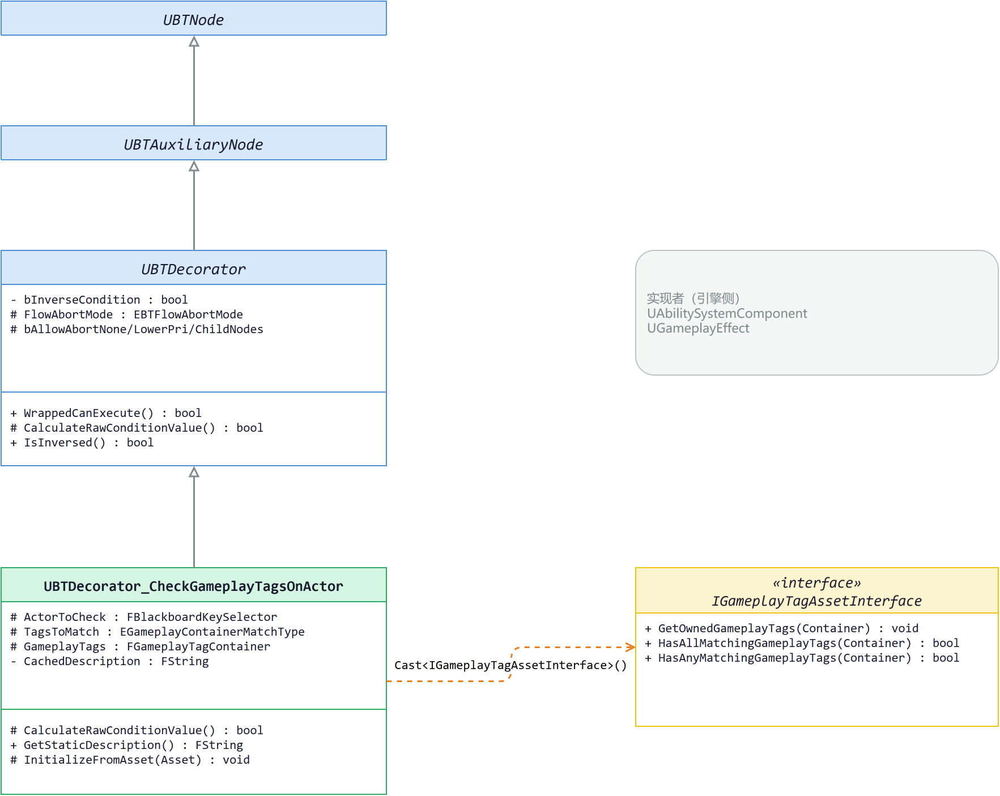
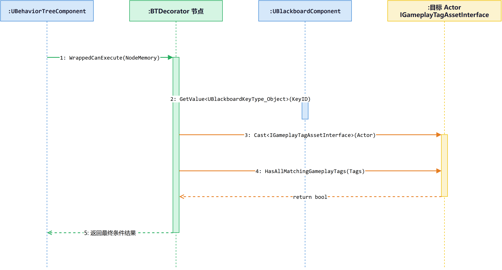

# BTDecorator_CheckGameplayTagsOnActor：行为树里的"Tag 哨兵"

> **难度**: 🟢 入门 → 🔴 源码  
> **字数**: ~4800  
> **源码路径**: `Engine/Source/Runtime/AIModule/Private/BehaviorTree/Decorators/BTDecorator_CheckGameplayTagsOnActor.cpp`

---

## 一、问题引入：AI 决策树里的"门卫"

你在做一个 MMO 副本，AI Boss 的行为树大概长这样：

```text
Selector
├── Sequence [检查玩家血量低且没有"霸体"Tag]
│   ├── Decorator: 检查距离 ≤ 5m
│   └── Task: 释放终结技
├── Sequence [检查自身没有"眩晕"Tag]
│   ├── Decorator: 检查玩家在面前
│   └── Task: 普通挥砍
└── Task: 巡逻
```

注意那些挂在子分支上的 **Decorator**。它们不做事，只做一件事：**放行或拦截**。比如第二个分支挂着的"自身没有眩晕 Tag 才进"——这就是我们今天要拆解的 `BTDecorator_CheckGameplayTagsOnActor`：一个**检查黑板中某个 Actor 是否拥有/缺少指定 GameplayTags** 的条件型装饰器。

UE5 自带了近 20 个 Behavior Tree Decorator（位于 `Engine/Source/Runtime/AIModule/Private/BehaviorTree/Decorators/`），`CheckGameplayTagsOnActor` 是其中最贴近 GAS（Gameplay Ability System）体系的一个。它把行为树（`AIModule`）和标签系统（`GameplayTags`）通过 `IGameplayTagAssetInterface` 这个**纯接口**缝起来，让 BT 能"问"任何实现了该接口的对象："你身上有没有这个 Tag？"

读完这篇文章，你会拿到三样东西：

1. **完整执行链路**：从 BT tick 到 `CalculateRawConditionValue` 返回 bool，每一步在源码哪里。
2. **三个属性的语义**：`ActorToCheck`、`TagsToMatch`、`GameplayTags` 在引擎里怎么用、什么坑要躲。
3. **设计取舍**：为什么这个节点默认禁用 Abort Observer？为什么 Cast 到接口而不是 ASC？这些都是理解 UE AI 模块"接口优先"哲学的钥匙。

> 📍 **阅读导航**
> 🟢 入门（第二节）→ 🔵 进阶（第三节）→ 🔴 源码（第四节）→ 设计思考（第五节）
> 建议按序阅读，各层独立可读。只想"会用"看第二、三节即可；想"懂为什么"再看第四、五节。

---

## 二、🟢 入门：这个"门卫"是谁

### 2.1 三个前置概念

在读源码之前，先把三个名词装进脑子里。

| 概念 | 一句话定义 | 在本文的作用 |
|------|----------|------------|
| **Behavior Tree Decorator** | 挂在 BT 节点边上的"门卫"，只返回 bool 决定子节点能不能执行 | 本文主角的基类 |
| **GameplayTag** | 形如 `Status.Debuff.Stun` 的层次化标签字符串，自动按父级展开匹配 | 节点检查的目标 |
| **Blackboard** | BT 共享的"键值对黑板"，存当前关切的 Actor、Target 等运行时数据 | 节点从哪里取 Actor |

### 2.2 这个节点干什么

打开行为树编辑器，从右键菜单 **New Decorator → Gameplay Tag Condition** 就能添加一个。它的面板长这样（描述来自 `BuildDescription`，见后文 §四.4）：

```text
Gameplay Tag Condition
Has any tags in set: {GameplayTagSet}
```

含义很直白：**当黑板里某个 Actor 拥有列出的 Tag 时，允许子分支执行**。

节点有三个可配置属性（来自头文件 L29-37）：

```cpp
UPROPERTY(EditAnywhere, Category=GameplayTagCheck)
struct FBlackboardKeySelector ActorToCheck;   // 要检查的 Actor 在黑板哪个键里

UPROPERTY(EditAnywhere, Category=GameplayTagCheck)
EGameplayContainerMatchType TagsToMatch;      // 全匹配 (All) 还是任一匹配 (Any)

UPROPERTY(EditAnywhere, Category=GameplayTagCheck)
FGameplayTagContainer GameplayTags;           // 待匹配的 Tag 列表
```

默认值（构造函数 L18-19）会把 `ActorToCheck` 指向 `FBlackboard::KeySelf`，也就是"AI 自身"。所以最常见的配置就是"我身上有没有某个 Tag"。

> **最小可用示例**：把 `TagsToMatch` 设成 `Any`，`GameplayTags` 里塞一个 `Status.Stun`，再把基类属性的 `Inverse Condition` 勾上——就得到"我没眩晕时才执行"的门卫。

### 2.3 它站在哪一层

这个节点继承链是这样的：

```text
UBTNode (abstract)
└── UBTAuxiliaryNode (abstract)
    └── UBTDecorator (abstract)
        └── UBTDecorator_CheckGameplayTagsOnActor   ← 本文主角
```

它要"问"的目标对象必须实现：

```text
«interface» IGameplayTagAssetInterface (GameplayTags 模块)
├── GetOwnedGameplayTags(Container) : void
├── HasAllMatchingGameplayTags(Container) : bool
└── HasAnyMatchingGameplayTags(Container) : bool
```


*图：装饰器的继承链与外部依赖*

这个图里要记住两个关键点：**继承链**让节点复用基类的反转与中止机制；**对接口的依赖**让节点跨模块解耦（不直接依赖 GAS 插件）。

---

## 三、🔵 进阶：它如何运转

### 3.1 执行时序

行为树每帧 tick 到这个装饰器时，引擎走的是一条链。先看完整的时序图：


*图：`WrappedCanExecute` 调用链*

把图翻译成文字版（精简到主干）：

1. `UBehaviorTreeComponent` 准备执行子节点，调用装饰器的 `WrappedCanExecute(NodeMemory)`（基类 `UBTDecorator.cpp` L46-50）。
2. `WrappedCanExecute` 调用子类的 `CalculateRawConditionValue(OwnerComp, NodeMemory)`，得到"原始"bool。
3. 基类用 `IsInversed() != RawValue` 异或出最终结果——**反转由基类统一处理**，子类只关心"正向条件"。
4. 我们这个节点在 `CalculateRawConditionValue` 里：取 `BlackboardComp → GetValue<Object>(KeyID)` 得到 Actor → `Cast<IGameplayTagAssetInterface>` → 根据 `TagsToMatch` 调 `HasAll` 或 `HasAny` → 返回 bool。

> 这一层你只需要知道：**基类负责"框架动作"（包装、节点实例化、反转、Abort），子类只实现"原始条件"。**

### 3.2 两种匹配模式

`TagsToMatch` 的枚举只有两个值（`GameplayTagContainer.h` L24-31）：

```cpp
enum class EGameplayContainerMatchType : uint8 {
    Any,    // GameplayTags 里任一 Tag 在 Actor 上就 true
    All     // GameplayTags 里所有 Tag 都在 Actor 上才 true
};
```

注意 `EGameplayContainerMatchType` 还在 `GameplayTagContainer.h` 里定义，**不在 GAS 插件中**——也就是说这个枚举是引擎核心 GameplayTags 模块的一部分，不是 Ability 专属。

### 3.3 为什么默认禁用 Abort Observer

打开节点详情面板，会发现 **Abort Observer** 的 None/Lower Priority/Self/Both 四项全灰，无法勾选。这不是 Bug，是构造函数里写死的（L21-24）：

```cpp
// For now, don't allow users to select any "Abort Observers", because it's currently not supported.
bAllowAbortNone = false;
bAllowAbortLowerPri = false;
bAllowAbortChildNodes = false;
```

Abort Observer 的含义是"条件变化时主动通知 BT 重评估"。但这个装饰器**没有 Tick**，也不知道"Tag 什么时候变了"——它只在被调用时**被动查**。所以即便允许用户配 Abort，也不会有任何触发源。干脆禁用，免得编辑器里看到能勾但选了不生效的灰色 bug。

对比一下，`BTDecorator_Blackboard` 通过黑板键变化回调（`OnBlackboardKeyValueChange`）来调用 `ConditionalFlowAbort`，`BTDecorator_Cooldown` 则靠自己的 Tick 到点触发。它们都有一个"事件源"——黑板值变化或定时器。而本文这个节点既没有 Tick，也没有订阅任何 Tag 变化事件（`IGameplayTagAssetInterface` 压根没暴露变化事件接口），自然做不了 Observer。

### 3.4 描述缓存机制

编辑器里把鼠标悬在节点上，会显示一条类似 `Has all tags in set: (Status.Buff.X, ...)` 的描述。这个文本不是每次重算的——是 `CachedDescription` 字段缓存下来的。

刷新时机有两个：

- `InitializeFromAsset`（绑定到 BehaviorTree 资产时）
- `PostEditChangeProperty`（你在面板里改任意属性时）

两个函数最后都会调用 `BuildDescription()`，把 `GameplayTags.ToMatchingText(TagsToMatch, IsInversed()).ToString()` 写进 `CachedDescription`。`GetStaticDescription` 渲染时只返回 `Super::GetStaticDescription() + ": " + CachedDescription`。

> **为什么这样设计**：BT 编辑器每帧会调用 `GetStaticDescription` 来画节点。直接 `ToMatchingText` 会触发 Tag 容器格式化（带本地化）。缓存一次，每帧读字符串，O(1)。

---

## 四、🔴 源码：逐行解读

这一层我把每个函数拆开看，所有行号都来自 UE 5.8 源码（相对 `Engine/Source/Runtime/AIModule/`）。

### 4.1 构造函数：默认值与契约

```cpp
UBTDecorator_CheckGameplayTagsOnActor::UBTDecorator_CheckGameplayTagsOnActor(...)
    : Super(ObjectInitializer)
{
    NodeName = "Gameplay Tag Condition";          // L13：编辑器里显示的名字
    ActorToCheck.AddObjectFilter(this, GET_MEMBER_NAME_CHECKED(...),
                                  AActor::StaticClass());  // L16
    ActorToCheck.SelectedKeyName = FBlackboard::KeySelf;    // L19：默认看自己
    bAllowAbortNone = false;                       // L22-24：见 §3.3
    bAllowAbortLowerPri = false;
    bAllowAbortChildNodes = false;
}
```

`AddObjectFilter` 把 `ActorToCheck` 限制为只接受 `AActor` 类型的黑板键——编辑器下拉里只会出现 Object 类型且 class 是 AActor 的键。`FBlackboard::KeySelf` 是约定俗成的"指向 AI 自身"的特殊键名，由行为树组件在执行时自动写入（指向 AI 控制器/Pawn）。

### 4.2 核心：CalculateRawConditionValue

```cpp
bool UBTDecorator_CheckGameplayTagsOnActor::CalculateRawConditionValue(
        UBehaviorTreeComponent& OwnerComp, uint8* NodeMemory) const
{
    const UBlackboardComponent* BlackboardComp = OwnerComp.GetBlackboardComponent();
    if (BlackboardComp == NULL) return false;       // L29-33

    IGameplayTagAssetInterface* GameplayTagAssetInterface =
        Cast<IGameplayTagAssetInterface>(
            BlackboardComp->GetValue<UBlackboardKeyType_Object>(
                ActorToCheck.GetSelectedKeyID()));   // L35
    if (GameplayTagAssetInterface == NULL) return false;  // L36-39

    switch (TagsToMatch)
    {
        case EGameplayContainerMatchType::All:
            return GameplayTagAssetInterface->HasAllMatchingGameplayTags(GameplayTags);
        case EGameplayContainerMatchType::Any:
            return GameplayTagAssetInterface->HasAnyMatchingGameplayTags(GameplayTags);
        default:
            UE_LOGF(LogBehaviorTree, Warning, "Invalid value for TagsToMatch ...");
            return false;
    }
}
```

逐行说几个易错点：

1. **两次早返回都是 `false`**：黑板组件为空、Actor 没实现接口——都直接 false。这意味着如果配错了"指向一个普通 AActor"，装饰器会**静默失败**（不报错，只是永远 false）。运行时排查时这是个坑。
2. **`Cast<IGameplayTagAssetInterface>`** 而不是 `Cast<UAbilitySystemComponent>`：见 §五.1。
3. **`UE_LOGF` 警告 default 分支**：枚举只有 `Any` 和 `All`，default 触发意味着数据被损坏（不可能通过编辑器产生），用日志留痕而不是 `check()` 硬断言，保证非 Debug 构建不崩。
4. **接口调用背后还有一层**：接口的默认实现（`GameplayTagAssetInterface.cpp` L21-35）会调 `GetOwnedGameplayTags` 拿 Tag 容器，再交给 `FGameplayTagContainer::HasAll/HasAny`，后者会做**父级 Tag 自动展开**（查 `Status.Debuff.Stun` 时，`Status.Debuff` 也算中）。这是 GameplayTags 系统的标准语义，不展开讲。

### 4.3 描述缓存：编辑器侧的几个钩子

编辑器里看节点描述，是这一组函数协作出来的：

```cpp
#if WITH_EDITOR
void UBTDecorator_CheckGameplayTagsOnActor::BuildDescription()    // L69-72
{
    CachedDescription = GameplayTags.ToMatchingText(
        TagsToMatch, IsInversed()).ToString();
}

void UBTDecorator_CheckGameplayTagsOnActor::PostEditChangeProperty(
        FPropertyChangedEvent& PropertyChangedEvent)              // L74-83
{
    Super::PostEditChangeProperty(PropertyChangedEvent);
    if (PropertyChangedEvent.Property == NULL) return;
    BuildDescription();
}

FString UBTDecorator_CheckGameplayTagsOnActor::GetErrorMessage() const  // L85-92
{
    if (GetBlackboardAsset() == nullptr)
        return UE::BehaviorTree::Messages::BlackboardNotSet.ToString();
    return Super::GetErrorMessage();
}
#endif
```

三件事：

- `BuildDescription` 是真正的格式化逻辑：把 `TagsToMatch`（All/Any）和 `IsInversed`（基类的反转标志）一起传给 `ToMatchingText`，由后者查表输出"Has all tags in set" / "Does not have any tags in set" 这四种本地化文本。
- `PostEditChangeProperty` 是 UE 编辑器通用钩子——任何 UPROPERTY 在面板里被改都会触发。`Property == NULL` 是删除属性等特殊情况，直接返回。
- `GetErrorMessage` 在 BehaviorTree **没有绑定 Blackboard 资产**时返回错误信息。这是编辑器唯一的运行时校验，因为 `ActorToCheck.GetSelectedKeyID()` 需要从 Blackboard 资产里解析键名（见 §4.5）。

### 4.4 描述渲染：GetStaticDescription

```cpp
FString UBTDecorator_CheckGameplayTagsOnActor::GetStaticDescription() const  // L62-65
{
    return FString::Printf(TEXT("%s: %s"),
                           *Super::GetStaticDescription(),
                           *CachedDescription);
}
```

`Super::GetStaticDescription()`（`BTDecorator.cpp` L122-145）会拼一段 `( aborts lower priority )` 之类的前缀。所以最终节点显示是：

```text
( aborts self ) Gameplay Tag Condition: Has any tags in set: {GameplayTagSet}
```

### 4.5 资产绑定：InitializeFromAsset

```cpp
void UBTDecorator_CheckGameplayTagsOnActor::InitializeFromAsset(UBehaviorTree& Asset)  // L96-112
{
    Super::InitializeFromAsset(Asset);
    if (const UBlackboardData* BBAsset = GetBlackboardAsset())
    {
        ActorToCheck.ResolveSelectedKey(*BBAsset);
    }
    else
    {
        ActorToCheck.InvalidateResolvedKey();
    }
#if WITH_EDITOR
    BuildDescription();
#endif
}
```

`ResolveSelectedKey` 把 `ActorToCheck.SelectedKeyName`（字符串）解析成键 ID（运行时索引）；找不到时报错提示。**这是性能关键**：BT 运行时每帧 tick 都要取这个 Actor，每次都字符串查表会拖慢行为树。`InitializeFromAsset` 在加载 BT 资产时一次性把字符串 ID 转成整型缓存到 `FBlackboardKeySelector` 里，运行时直接拿 ID 用。

另外注意 `GetBlackboardAsset()` 是基类的工具方法——如果行为树没绑 Blackboard，键 ID 解析不出来，运行时 `GetValue` 会拿到空，装饰器永远 false。这跟 §4.3 的 `GetErrorMessage` 是配套的：编辑器里就提示，运行时静默 fail。

---

## 五、设计思考：为什么这样设计

### 思考 1：为什么 Cast 到接口而不是 ASC？

节点 `Cast<IGameplayTagAssetInterface>(Actor)`——这个 Cast 不是 Cast 到 `UAbilitySystemComponent`，而是到 `IGameplayTagAssetInterface`。区别在哪？

- `UAbilitySystemComponent` 在 **GameplayAbilities 插件**（`Engine/Plugins/Runtime/GameplayAbilities/...`）里。
- `IGameplayTagAssetInterface` 在 **GameplayTags 模块**（`Engine/Source/Runtime/GameplayTags/`），是引擎核心运行时模块。

看 `AIModule.Build.cs` L14-19，AIModule 的依赖是 `CoreUObject / Engine / GameplayTags / GameplayTasks / NavigationSystem / RHI`——**没有** `GameplayAbilities`。也就是说，行为树模块**根本不依赖 GAS 插件**。

这就是 Cast 到接口的真正意义：**模块边界解耦**。

```text
AIModule ──depends on──▶ GameplayTags (core)
                       └─NOT depends on──▶ GameplayAbilities (plugin)
```

代价是什么？在引擎代码里，`AActor` 本身**并不实现**这个接口，主要实现者来自 GAS 插件：

- `UAbilitySystemComponent`（`AbilitySystemComponent.h` L109）
- `UGameplayEffect`（`GameplayEffect.h` L2104）

也就是说在纯引擎核心项目里，如果没有 GAS，几乎没有现成的实现者可用。设计师要么让 Character 自己实现该接口，要么通过 GAS 走 ASC——两条路都绕开了让 AIModule 直接依赖 GAS。这也解释了为什么节点对黑板键做了 `AActor` 类型过滤（构造函数 L16），却仍然在运行时对 Actor Cast 接口：**它把"有没有 Tag"这个问题交给对象自己去回答，而非假设对象一定是 ASC**。

> **跨模块启示**：这是 UE 模块化的经典手法。**行为树不需要知道 GAS 存在，就能"问"一个 GAS Actor 身上的 Tag**。GAS 哪天换实现，只要新的实现还实现了 `IGameplayTagAssetInterface`，行为树代码一行不用改。

### 思考 2：为什么构造函数禁用所有 Abort Observer？

源码注释直接写了：`For now, don't allow users to select any "Abort Observers", because it's currently not supported.`

"Currently not supported" 这个措辞耐人寻味——它**承认这是技术债**，不是设计上的"我们不需要"。从 Abort Observer 的机制反推：

`UBTDecorator::ConditionalFlowAbort`（基类 `BTDecorator.cpp` L88-120）会在条件结果变化时调用 `RequestBranchDeactivation/Activation`，让 BT 重新评估。这是**事件驱动**的重评估：基类已经实现了回调接口，问题是"谁来调用 `ConditionalFlowAbort`"？

- `BTDecorator_Blackboard`：绑了黑板键变化回调（`OnBlackboardKeyValueChange`），变化时调用 `ConditionalFlowAbort`。
- `BTDecorator_Cooldown`：自己 Tick，到时间就调。
- `UBTDecorator_CheckGameplayTagsOnActor`：**没人调**。它既没 Tick，也不订阅 `IGameplayTagAssetInterface` 上的 Tag 变化事件（这个接口根本没暴露变化事件接口）。

要让这个节点支持 Abort Observer，需要在接口实现者里加"Tag 变化委托"+ 在装饰器里订阅——这要改 GameplayTags / GameplayAbilities 模块的接口，跨模块改动。所以注释里说"currently"，言下之意"等以后有空或者有需求再补"。

> **从生产视角看**：这个节点现在的设计取舍是**功能范围 vs 改动成本**。它保证"每次被问都能给出正确 bool"，但不承担"主动通知"。这种"纯查询型"装饰器适合**每帧自然重评估**的场景（比如 Selector 顶层的顺序重试）；不适合"Tag 一加就要立刻打断当前分支"的实时响应场景——后者得用 GAS 的 ASC + 自定义 Service 配 GameplayEvent。

### 思考 3：为什么条件反转放在基类？

节点本身没有写"是否反转"的逻辑。`bInverseCondition` 是基类的字段，`WrappedCanExecute` 在基类里实现异或（`BTDecorator.cpp` L46-50）：

```cpp
return NodeOb ? (IsInversed() != NodeOb->CalculateRawConditionValue(...)) : false;
```

为什么要这样分层？一句话：**所有条件型 Decorator 都有"反转"需求**。`BTDecorator_Blackboard`、`BTDecorator_Cooldown`、`BTDecorator_Distance`……任何一个条件都可能需要"否命题"。

把反转抽到基类的好处：

1. 子类只实现**正向**语义（"敌人可见"），不写"敌人不可见"——后者勾一下基类属性就有。
2. 反转的语义在基类是**一致的**（永远是 `IsInversed() != RawValue`），子类不会写出五花八门的"自己反转"。
3. 子类可以更专注于"原始条件"的计算，基类操心"反转、节点实例化、Abort 触发"。

这是一个**关注点分离**的小教科书例子。

### 思考 4：为什么描述要缓存？

`GetStaticDescription` 在编辑器里被频繁调用（节点面板、缩略图、撤销/重做预览……）。`ToMatchingText` 内部要走本地化表（`LOCTEXT` 宏）+ Tag 容器格式化，**不便宜**。

缓存三要素：

1. **缓存字段 `CachedDescription`**：`UPROPERTY()` 标记，会被序列化进资产，编辑器下次打开资产直接读。
2. **失效触发 `PostEditChangeProperty`**：任何 `UPROPERTY` 改了，缓存就重建。
3. **运行时无开销**：`WITH_EDITOR` 包住，运行时构建（Shipping）连 `BuildDescription` 都没有，缓存字段也只是占个空字符串。

注意 `BuildDescription` 还要传 `IsInversed()`——**反转标志变了缓存也要重建**。`bInverseCondition` 改了同样会触发 `PostEditChangeProperty`，所以这条链路是安全的。

### 思考 5：局限性与坑

最后照例要"坦诚标注局限性"：

| 场景 | 行为 | 应对 |
|------|------|------|
| 黑板 Actor 没实现 `IGameplayTagAssetInterface` | 静默返回 false，**不报错** | 在编辑器里把鼠标悬在黑板键上确认 class；如果配的是 Character 基类，自己手动 override `GetOwnedGameplayTags` |
| Tag 运行时变化 | 不响应——除非父级 Selector 每帧重试 | 想"Tag 加了立刻中断"，用 GAS 的 GameplayEvent + 自定义 Service |
| 多个 Actor 都要检查 | 每个 Actor 一个装饰器节点 | BT 不支持单节点遍历数组；要么写自定义 Decorator（参考 `BTDecorator_BlueprintBase`），要么外层用 Service 维护 Tag 状态 |
| `EGameplayContainerMatchType` 没有"None"或"Exact"等更细粒度模式 | 只能 All/Any | 用 `FGameplayTagQuery`（在 GameplayTagContainer.h）做复杂查询，那是另一套 API |

---

## 六、总结

`UBTDecorator_CheckGameplayTagsOnActor` 是个不到 120 行的小节点，但它把 UE 的几个模块缝在一起——**AIModule 的条件检查**通过**GameplayTags 的接口抽象**去**询问任何实现接口的对象**。要点回顾：

1. **接口优先**：Cast 到 `IGameplayTagAssetInterface` 让 AIModule 不依赖 GAS 插件，这是 UE 模块化的经典手法。
2. **基类承担框架**：反转、Abort、节点实例化都在 `UBTDecorator` 统一处理；子类只写 `CalculateRawConditionValue` 这一段"原始条件"。
3. **缓存而非重算**：编辑器描述通过 `CachedDescription` + `PostEditChangeProperty` 失效机制，避开了每帧调本地化的开销。
4. **功能取舍**：纯查询语义让它无法响应 Tag 变化——这是"功能范围 vs 改动成本"的取舍，不是 Bug。
5. **静默 fail 要警惕**：Actor 不实现接口 / 黑板资产没绑，运行时都只返回 false 不报错，定位问题靠 `GetErrorMessage` 编辑器提示。

下一篇预告：继续拆 `AIModule/Private/BehaviorTree/Decorators/` 下的其他节点，对比 `BTDecorator_Cooldown`（有 Tick、能 Abort）和本文主角（纯查询、不能 Abort）的设计差异——同一个基类下的两种装饰器哲学。