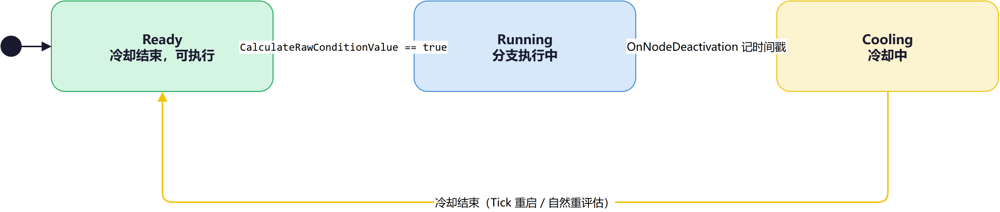
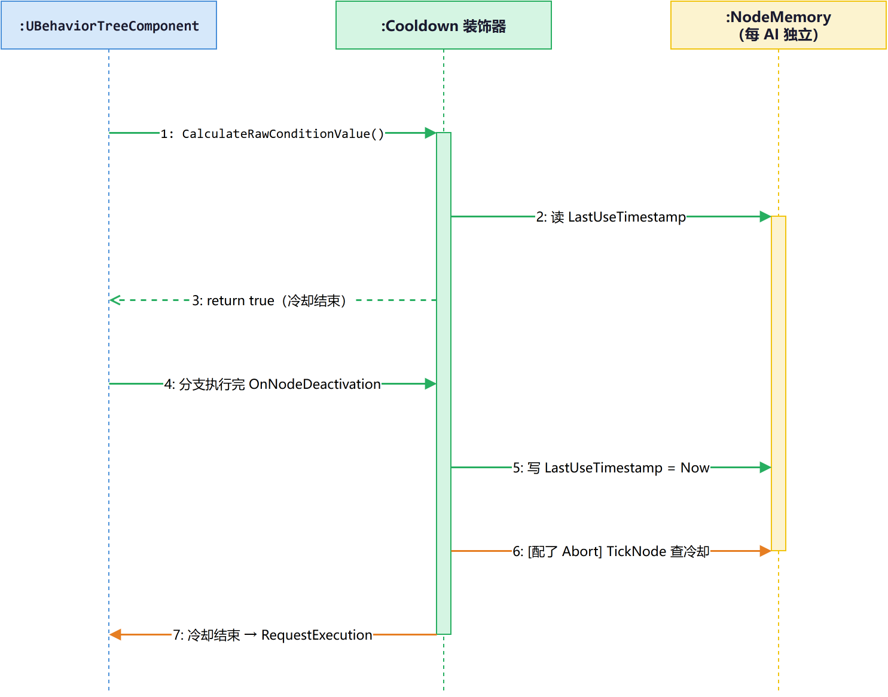

# BTDecorator_Cooldown：有状态的"计时门卫"

> **难度**: 🟢 入门 → 🔴 源码  
> **字数**: ~4800  
> **源码路径**: `Engine/Source/Runtime/AIModule/Private/BehaviorTree/Decorators/BTDecorator_Cooldown.cpp`  
> **上一篇**: [BTDecorator_CheckGameplayTagsOnActor](./BTDecorator_CheckGameplayTagsOnActor深度分析.md)

---

## 一、问题引入：技能 CD 怎么在 BT 里表达

上一篇拆了 `BTDecorator_CheckGameplayTagsOnActor`——一个**纯查询、无状态**的门卫：每次被问都现场查 Tag，返回 bool，不记任何东西。

这次拆 `BTDecorator_Cooldown`——它的兄弟节点，**有状态、计时**。

还是那个 MMO Boss：

```text
Selector
├── Sequence [旋风斩]
│   ├── Decorator: Cooldown 5s
│   └── Task: 旋风斩
├── Sequence [普通挥砍]
│   └── Task: 普通挥砍
└── Task: 巡逻
```

Boss 放完旋风斩后，**冷却 5 秒内**不能再进旋风斩分支。5 秒后解锁，可以再进。

跟上一篇的 Tag 检查看起来都是"门卫"，但设计完全不同：

| 维度 | CheckGameplayTagsOnActor（上一篇） | Cooldown（本篇） |
|------|------------------------------------|-----------------|
| 有没有状态？ | 没有（每次现场查） | 有（每个 AI 记住"上次用时间"） |
| 有没有 Tick？ | 没有 | 有（条件性） |
| 能不能 Abort？ | 不能（所有都禁） | 能 Lower Priority |
| 谁在"按需 Tick"？ | — | PostLoad 动态决定 |

读完这篇文章，你会拿到三样东西：

1. **有状态装饰器的实例内存机制**：BT 资产共享，多 AI 的状态怎么存在哪。
2. **按需 Tick 的精妙设计**：`bNotifyTick = (FlowAbortMode != None)` 在 `PostLoad` 里动态调整。
3. **与上一篇的对照视角**：同一个基类下的两种装饰器哲学——"纯查询" vs "有状态"。

> 📍 **阅读导航**
> 🟢 入门（第二节）→ 🔵 进阶（第三节）→ 🔴 源码（第四节）→ 设计思考（第五节）
> 建议按序阅读。想对照上一篇看的话，第五节是核心——那里我把两篇文章的设计取舍并排放在一起比较。

---

## 二、🟢 入门：这个"计时门卫"是谁

### 2.1 一个前置概念：BT 的实例内存

上一篇提到，BT 节点默认**不实例化**，所有 AI 共享同一份节点对象。那每个 AI 自己的状态怎么办？

答案是 **NodeMemory（节点内存）**——引擎在每个 AI 上给每个 BT 节点**独立分配一块内存**，节点对象通过指针访问。节点对象的字段是共享的"模板配置"，NodeMemory 里才是"运行时私有数据"。

`UBTDecorator` 头文件 L30-33 注释说得很直白：

> Template nodes are shared across all behavior tree components using the same tree asset and must store their runtime properties in provided NodeMemory block (allocation size determined by `GetInstanceMemorySize()`)

冷却门卫就是个典型例子——每个 AI 必须记住自己的"上次使用时间戳"，所以它**重写了三个内存相关函数**：`GetInstanceMemorySize`（声明要多大）、`InitializeMemory`（初始化）、`CleanupMemory`（清理）。这在上一篇里完全不存在，因为 Tag 检查是无状态的。

### 2.2 这个节点干什么

打开 BT 编辑器，右键 **New Decorator → Cooldown**。它只有一个可配置属性：

```cpp
UPROPERTY(Category=Decorator, EditAnywhere)
FValueOrBBKey_Float CoolDownTime;   // 默认 5.0f
```

`FValueOrBBKey_Float` 是 UE5 引入的"值或黑板键"包装——设计师既可以直接填一个固定 float，也可以选一个黑板键（让每个 AI 不同 AI 用不同的冷却时长）。`GetValue(OwnerComp)` 内部：键名非空就从黑板读，否则返回 `DefaultValue`。

它的行为很简单：

- **进入分支前**：检查当前时间是否已经过了冷却期。如果还在冷却期，返回 `false`，门不开。
- **离开分支时**：把当前时间戳记下来，作为冷却起点。
- **冷却期内**：再次尝试进入会失败。

编辑器描述（L52-57）：

```text
Cooldown: lock for 5.0s after execution and return Failed
```

### 2.3 它站在哪一层

跟上一篇不同——它**不继承** `BTDecorator_BlackboardBase`，而是直接继承 `UBTDecorator`：

```text
UBTNode (abstract)
└── UBTAuxiliaryNode (abstract)
    └── UBTDecorator (abstract)
        └── UBTDecorator_Cooldown   ← 本文主角
```

它**没绑黑板键作为核心依赖**（虽然 `CoolDownTime` 可以绑定，但装饰器本身不依赖黑板）。状态全部存在 NodeMemory。

---

## 三、🔵 进阶：它如何运转

### 3.1 三个状态的循环

整个生命周期可以压缩成三个状态——一张状态机图说清楚：


*图：冷却装饰器的三状态循环*

流转故事：门卫一开始在 Ready（条件 true 可执行）→ BT 进来执行子节点，进入 Running → 子节点完成离开分支（`OnNodeDeactivation`），记下时间戳，**锁定**进入 Cooling → 冷却时间一到，再次进入 Ready。整个生命周期是**三状态自循环**。

> 这一层你只需要记住：**冷却计时器锁存的是"上次用时间"，每次进入分支前比对"现在距上次是否够冷却时长"。**

### 3.2 完整生命周期时序

把状态机展开成时序，加上"按需 Tick"那条分支：


*图：Cooldown 的运行时调用链（绿色为无条件流程，橙色为仅配 Abort 时执行的流程）*

解读这张图：

- **消息 1-3**（绿色）：首次评估条件，读 NodeMemory 时间戳（初值是 `-inf`/Lowest），比较 `Now - CD >= Lowest` 成立，返回 true。
- **消息 4-5**（绿色）：分支执行完，BT 调 `OnNodeDeactivation` 钩子，把 `Now` 写进 NodeMemory 的 `LastUseTimestamp`。
- **消息 6-7**（橙色）：**仅在配了 Lower Priority Abort 时**才发生——TickNode 每帧检查"冷却是否结束"，结束则 `RequestExecution(this)` 主动请求 BT 重新评估本分支。

注意橙色消息在没配 Abort 时**完全不会发生**——这就是下面 §四.1 要讲的"按需 Tick"。

### 3.3 为什么默认禁用 Abort Child Nodes

构造函数 L14-15 写得很直白：

```cpp
// aborting child nodes doesn't makes sense, cooldown starts after leaving this branch
bAllowAbortChildNodes = false;
```

`Abort Child Nodes` 语义：子节点**正在执行**时，条件一变就中止子节点。但 Cooldown 的冷却起点是 `OnNodeDeactivation`（**离开分支**时才记时间戳），子节点执行中**根本没开始冷却**——条件不可能从 true 变 false，所以"中止子节点"毫无意义。

与之对比，`Abort Lower Priority` 就有意义了：本分支执行完进入冷却时，AI 在执行别的低优先级分支。冷却一结束，希望**打断**那个低优先级分支、回头执行本分支。

所以 Cooldown 默认允许 Lower Priority，禁用 Child。这是按语义精确裁剪的。

### 3.4 PostLoad 里的按需 Tick

`PostLoad`（cpp L18-22）只有两行，但信息密度很高：

```cpp
void UBTDecorator_Cooldown::PostLoad() {
    Super::PostLoad();
    bNotifyTick = (FlowAbortMode != EBTFlowAbortMode::None);
}
```

含义：**Tick 不总是开**——只有配了 Abort（Lower Priority 或 Both）才开 Tick。

为什么不总是开？因为 Tick 的唯一目的就是检测"冷却结束 → 主动 RequestExecution"。如果没配 Abort，冷却结束后不需要主动通知 BT——下次父级 Selector 自然重试时，`CalculateRawConditionValue` 会返回 true，自动进门。

> **按需 Tick 是 UE 的"能省则省"哲学**：条件检查每帧都要执行的代价不小，**只在真正需要时才开 Tick**。上一篇的 CheckGameplayTagsOnActor 干脆没 Tick（不需要），本篇的 Cooldown 按需 Tick（看配置决定）。

---

## 四、🔴 源码：逐行解读

### 4.1 构造函数 + INIT 宏

```cpp
UBTDecorator_Cooldown::UBTDecorator_Cooldown(...) : Super(ObjectInitializer) {
    NodeName = "Cooldown";                  // L10
    INIT_DECORATOR_NODE_NOTIFY_FLAGS();     // L11
    CoolDownTime = 5.0f;                    // L12
    bAllowAbortChildNodes = false;          // L15
}
```

`INIT_DECORATOR_NODE_NOTIFY_FLAGS()`（`BTDecorator.h` L143-152）是 UE 装饰器的一个"魔法宏"：

```cpp
#define INIT_DECORATOR_NODE_NOTIFY_FLAGS() \
    InitNotifyFlags(&TickNode, &OnBecomeRelevant, ..., \
                    &OnNodeDeactivation, ...)
```

它用模板元编程（`std::is_same_v`）检测**本类是否 override 了某个 notify 虚函数**，自动把对应的 `bNotifyTick` / `bNotifyDeactivation` 等标志位置位。这样引擎才知道运行时要不要调 `TickNode` / `OnNodeDeactivation`。

本文 Cooldown override 了 `TickNode` 和 `OnNodeDeactivation`，所以宏执行后 `bNotifyTick = true`、`bNotifyDeactivation = true`。上一篇的 CheckGameplayTagsOnActor **没调这个宏**（它一个 notify 函数都没 override），所以所有 notify 标志都是默认的 `false`。

### 4.2 条件判定

```cpp
bool UBTDecorator_Cooldown::CalculateRawConditionValue(
        UBehaviorTreeComponent& OwnerComp, uint8* NodeMemory) const  // L24-29
{
    FBTCooldownDecoratorMemory* DecoratorMemory =
        CastInstanceNodeMemory<FBTCooldownDecoratorMemory>(NodeMemory);
    const double RecalcTime = (OwnerComp.GetWorld()->GetTimeSeconds()
                              - CoolDownTime.GetValue(OwnerComp));
    return RecalcTime >= DecoratorMemory->LastUseTimestamp;
}
```

解读：

- `CastInstanceNodeMemory<T>(NodeMemory)`：把 `uint8*` 强转成结构体指针。注意这里是 `uint8* NodeMemory`——传入的是每个 AI 独立的实例内存块。
- `RecalcTime = Now - CoolDownTime`：计算"如果现在用一次，新的 LastUseTimestamp 应该是多少"。
- `RecalcTime >= LastUseTimestamp`：等价于"`Now >= LastUseTimestamp + CoolDownTime`"——冷却是否结束。

> 这个不等式的精髓：左侧 `RecalcTime` 把"现在"和"冷却时长"折算成一个**目标时间戳**；右侧 `LastUseTimestamp` 是上次的实际时间戳。如果"目标已经超过上次"，说明冷却时间已过。

### 4.3 冷却起点：OnNodeDeactivation

```cpp
void UBTDecorator_Cooldown::OnNodeDeactivation(
        FBehaviorTreeSearchData& SearchData, EBTNodeResult::Type NodeResult)  // L31-36
{
    FBTCooldownDecoratorMemory* DecoratorMemory =
        GetNodeMemory<FBTCooldownDecoratorMemory>(SearchData);
    DecoratorMemory->LastUseTimestamp = SearchData.OwnerComp.GetWorld()->GetTimeSeconds();
    DecoratorMemory->bRequestedRestart = false;
}
```

三个要点：

1. **触发时机**：`OnNodeDeactivation`——分支**离开**时触发，不管 Task 是成功还是失败（参数 `NodeResult` 没被用到）。这就是为什么冷却从"释放完"开始计时，而不是"开始释放"。
2. **写时间戳**：`LastUseTimestamp = Now`——记下"这次释放完成的瞬间"。
3. **重置重启请求标志**：`bRequestedRestart = false`——为下次 Tick 重启做准备。

注意这里用的是 `GetNodeMemory<T>(SearchData)` 而不是 `CastInstanceNodeMemory<T>(NodeMemory)`——`GetNodeMemory` 接受 `FBehaviorTreeSearchData&`（包含搜索上下文），从 BT 组件里查找当前实例的内存块；`CastInstanceNodeMemory` 接受裸 `uint8*`（条件判定时拿到的指针）强转。语义相似，参数场景不同。

### 4.4 按需 Tick：TickNode

```cpp
void UBTDecorator_Cooldown::TickNode(
        UBehaviorTreeComponent& OwnerComp, uint8* NodeMemory, float DeltaSeconds)  // L38-50
{
    FBTCooldownDecoratorMemory* DecoratorMemory =
        CastInstanceNodeMemory<FBTCooldownDecoratorMemory>(NodeMemory);
    if (!DecoratorMemory->bRequestedRestart) {
        const double RecalcTime = (OwnerComp.GetWorld()->GetTimeSeconds()
                                  - CoolDownTime.GetValue(OwnerComp));
        if (RecalcTime >= DecoratorMemory->LastUseTimestamp) {
            DecoratorMemory->bRequestedRestart = true;
            OwnerComp.RequestExecution(this);
        }
    }
}
```

逐行：

- **外层 `if (!bRequestedRestart)`**：防重复请求。`RequestExecution` 是"边沿触发"——只在冷却**第一次**结束时发一次。之后条件持续为 true（直到下次 `OnNodeDeactivation` 重置时间戳），但不发重复请求。
- **`RequestExecution(this)`**：请求 BT 重新评估当前节点。配合 `FlowAbortMode = Lower Priority`，会让 BT 打断当前正在执行的低优先级分支，回到这个 Cooldown 装饰器下的子分支。
- **重置在哪？** 在 `OnNodeDeactivation` 里（§4.3 末尾）——下次分支离开时 `bRequestedRestart = false`，Tick 又能重新触发。

> **电平 vs 边沿**：`bRequestedRestart` 这个一位字段是经典**边沿触发**实现。如果没有它，每帧 Tick 都会重复调 `RequestExecution`，白白消耗 BT 调度开销。

### 4.5 内存三件套

冷却装饰器是**有状态**的，所以三件套齐全：

```cpp
uint16 UBTDecorator_Cooldown::GetInstanceMemorySize() const {  // L74-77
    return sizeof(FBTCooldownDecoratorMemory);
}

void UBTDecorator_Cooldown::InitializeMemory(
        UBehaviorTreeComponent& OwnerComp, uint8* NodeMemory,
        EBTMemoryInit::Type InitType) const  // L79-88
{
    FBTCooldownDecoratorMemory* DecoratorMemory =
        InitializeNodeMemory<FBTCooldownDecoratorMemory>(NodeMemory, InitType);
    if (InitType == EBTMemoryInit::Initialize) {
        DecoratorMemory->LastUseTimestamp = TNumericLimits<double>::Lowest();
    }
    DecoratorMemory->bRequestedRestart = false;
}

void UBTDecorator_Cooldown::CleanupMemory(...) const {  // L90-93
    CleanupNodeMemory<FBTCooldownDecoratorMemory>(NodeMemory, CleanupType);
}
```

三个函数对应**内存生命周期的三个阶段**：

| 函数 | 调用时机 | 责任 |
|------|---------|------|
| `GetInstanceMemorySize` | 引擎计算每个节点需要分配多大内存 | 告诉引擎"我这个节点要 `sizeof(FBTCooldownDecoratorMemory)` 字节" |
| `InitializeMemory` | 内存刚分配完（每个新 AI 实例、每次重启分支） | 把 `LastUseTimestamp` 初始化为 `-inf`（最早时间），让首次 `CalculateRawConditionValue` 一定返回 true |
| `CleanupMemory` | AI 实例销毁或分支被丢弃 | 清结构体，让 GC 知道这块内存不再用 |

> 上一篇的 CheckGameplayTagsOnActor **这三件套一个都没 override**——因为它没状态。`GetInstanceMemorySize` 在 `UBTNode` 基类默认返回 0。

`TNumericLimits<double>::Lowest()` 这个初值是关键：保证首次比较 `RecalcTime >= LastUseTimestamp` 一定为 true（任何"现在"都比 `-inf` 大）。

### 4.6 描述与调试

```cpp
FString UBTDecorator_Cooldown::GetStaticDescription() const {  // L52-57
    return FString::Printf(TEXT("%s: lock for %s s after execution and return %s"),
        *Super::GetStaticDescription(),
        *CoolDownTime.ToString(),
        *UBehaviorTreeTypes::DescribeNodeResult(EBTNodeResult::Failed));
}

void UBTDecorator_Cooldown::DescribeRuntimeValues(...) const {  // L59-72
    FBTCooldownDecoratorMemory* DecoratorMemory =
        CastInstanceNodeMemory<FBTCooldownDecoratorMemory>(NodeMemory);
    const double TimePassed = OwnerComp.GetWorld()->GetTimeSeconds()
                             - DecoratorMemory->LastUseTimestamp;

    if (TimePassed < CoolDownTime.GetValue(OwnerComp)) {
        Values.Add(FString::Printf(TEXT("%s in %ss"),
            (FlowAbortMode == EBTFlowAbortMode::None) ? TEXT("unlock") : TEXT("restart"),
            *FString::SanitizeFloat(CoolDownTime.GetValue(OwnerComp) - TimePassed)));
    }
}
```

两个函数用途不同：

- `GetStaticDescription`：编辑器**静态**描述（不动 NodeMemory），把 `CoolDownTime` 通过 `ToString()` 拼出来——`ToString()` 内部走 `ToStringInternal`（`ValueOrBBKey.h` L102-113）：键名非空就返回键名，否则把默认值格式化成字符串。
- `DescribeRuntimeValues`：BT 调试器**运行时**显示——"还有 X 秒 unlock"（无 Abort）或"还有 X 秒 restart"（有 Abort）。这是行为树调试视图里"还在冷却中"时显示的那个倒计时。

---

## 五、设计思考：与 CheckGameplayTagsOnActor 对照

上一篇和这篇共享同一个基类 `UBTDecorator`，但走的是两条完全不同的路。下面把设计取舍并排摆出来。

### 思考 1：有状态 vs 无状态——为什么 Cooldown 需要 NodeMemory？

CheckGameplayTagsOnActor 是**无状态查询**——每次都现场查 Tag，节点对象里**不能存**任何运行时数据（因为节点对象是模板共享的）。

Cooldown 是**有状态计时**——每个 AI 必须记住"上次用时间戳"。如果存在节点对象字段里，会出现：

- AI A 放了旋风斩 → 节点对象 `LastUseTimestamp` 被改成 A 的时间
- AI B 接着评估冷却 → 看到的不是自己的时间，而是 A 的

这显然不对。所以 Cooldown 重写了**内存三件套**（§4.5），每个 AI 在 BT 组件里**独立分配** `sizeof(FBTCooldownDecoratorMemory)` 字节作为私有内存。

> 两条铁律：`UBTDecorator.h` L30-33 注释明确写了——节点对象是模板，运行时数据必须放 NodeMemory。"有状态"和"无状态"装饰器的本质区别，就在这一点上。

### 思考 2：按需 Tick——PostLoad 的动态调整

`bNotifyTick = (FlowAbortMode != None)` 是 UE AI 的一个**教科书级性能技巧**。

Tick 的目的只有一个：检测"冷却结束 → RequestExecution 重启分支"。但 Tick 是**每帧**执行的：

- **配 Lower Priority Abort**：需要主动打断低优先级分支，所以 Tick 必须开。
- **没配 Abort（默认 None）**：冷却结束后不需要主动通知，父级 Selector 自然重试时 `CalculateRawConditionValue` 自然返回 true。Tick 完全是浪费。

`PostLoad`（BT 资产加载完时调）根据用户的 `FlowAbortMode` 配置动态决定开不开 Tick。这是个**懒人哲学**——只在真正需要时花 Tick 开销。

对比上一篇：CheckGameplayTagsOnActor 干脆**没 Tick**（也没 override `TickNode`），因为它的条件检查不需要任何事件驱动，BT 父级调度器每次来问都现查现算，按需足够了。

### 思考 3：为什么默认禁用 AbortChild，启用 AbortLowerPri？

`bAllowAbortChildNodes = false`（构造函数 L15）和基类默认 `bAllowAbortLowerPri = true`（`BTDecorator.cpp` L14），不是随便选的，是按语义裁剪。

冷却起点在 `OnNodeDeactivation`——**离开分支**才记时间戳。子节点**正在执行**时，时间戳根本还没写，冷却条件不可能变 false（因为 `LastUseTimestamp` 还是上一轮的，`RecalcTime >= LastUseTimestamp` 持续为 true）。所以"Abort Child"没有触发条件，禁用是合理的。

但**Lower Priority** 就有意义了：本分支执行完进入冷却，AI 此时在跑别的低优先级分支（比如巡逻）。冷却一结束，希望**打断**巡逻回来再放一次旋风斩——这正是 Lower Priority 的语义。

> 上一篇文章的 CheckGameplayTagsOnActor 是**所有 Abort 模式都禁用**——因为它没有"冷却起点"的概念，Tag 检查无状态；Abort 对它毫无意义。

### 思考 4：FValueOrBBKey_Float——"值或黑板键"数据绑定

`CoolDownTime` 不是裸 `float`，而是 `FValueOrBBKey_Float`。这个类型有俩数据：

- `FName Key`：黑板键名（可空）
- `float DefaultValue`：默认值

`GetValue(OwnerComp)`（`ValueOrBBKey.h` L50-71 实现）：

```cpp
if (!Name.IsNone()) {
    if (从黑板读到该键的 float 值) return 读到的值;
}
return DefaultValue;
```

设计师在面板里看到的"5.0s"可以是：固定 5.0、绑定到 `LastBounceCoolDownTime` 黑板键（不同 AI 不同时长）。

> 这是 UE5 引入的**统一数据绑定模型**——同一份字段既能装常量也能装黑板变量。上一篇的 CheckGameplayTagsOnActor 用的是更老的 `FBlackboardKeySelector`（必须绑键），而本篇用新模型，是 UE5 演进的方向。

### 思考 5：INIT_DECORATOR_NODE_NOTIFY_FLAGS 宏的妙处

这个宏（`BTDecorator.h` L143-152）用 `std::is_same_v<decltype(&UBTDecorator::TickNode), TickNode>` 这种**模板元编程**检查：本类的 `TickNode` 函数指针是否还等于基类的（如果是，说明没 override；否则说明 override 了）。

根据结果设置 `bNotifyTick / bNotifyDeactivation / ...` 标志位。这样引擎在调度时就知道"本节点要不要 Tick / 要不要通知激活"。

上一篇没调这个宏（所有 notify 函数都没 override），本篇调了，因为 override 了 `TickNode` 和 `OnNodeDeactivation`。**这个宏把"override 状态"翻译成"标志位"**，是 BT 调度器高效派发的前提。

### 思考 6：局限

| 场景 | 行为 | 应对 |
|------|------|------|
| `GetWorld()` 返回 null | `RecalcTime` 计算会崩 | BT 必须挂在 valid world 里——这通常是必然的 |
| 游戏暂停（Pause） | `GetTimeSeconds()` 冻结，冷却计时暂停 | 冷却用"世界时间"，暂停时不流逝。想用真实时间（暂停也计时）换 `GetRealTimeSeconds()` |
| 多 AI 共享 BT 资产 | 各 AI 时间戳独立（NodeMemory） | 这是 BT 的设计目标，正确 |
| 冷却中途 `CoolDownTime` 改了 | 用 `GetValue(OwnerComp)` 现读现算 | 改动立即生效，无需重置 |
| 冷却结束后被 `RequestExecution` 重启，但 parent composite 不允许 | `RequestExecution` 是请求，不是强制 | 上层可能忽略；属于 BT 调度语义 |

---

## 六、总结

`UBTDecorator_Cooldown` 跟上一篇的 `CheckGameplayTagsOnActor` 共享同一个基类，却走了一条几乎相反的设计路线。要点回顾：

1. **有状态 → NodeMemory**：每个 AI 独立分配 `FBTCooldownDecoratorMemory`（含 `LastUseTimestamp` + `bRequestedRestart`）。这是 BT "模板共享、运行时私有"模型的典型应用。
2. **按需 Tick → PostLoad 动态设置 `bNotifyTick`**：配了 Lower Priority Abort 才 Tick，否则不 Tick，省掉每帧调度开销。
3. **冷却起点在 `OnNodeDeactivation`**：离开分支才记时间戳，而不是进入分支。"边沿触发"地用 `bRequestedRestart` 防重复 `RequestExecution`。
4. **Abort 按语义裁剪**：默认启用 Lower Priority，禁用 Child Nodes——前者"打断别人回来"，后者"中断正在执行的自己"在本节点没意义。
5. **FValueOrBBKey_Float** 是 UE5 引入的"值或黑板键"统一模型，让一个字段既能装常量也能装黑板变量——比上一篇的 `FBlackboardKeySelector` 更灵活。

下一篇预告：下一站 `BTDecorator_Blackboard`——最常见的"门卫"：黑板值是否等于某个值。它走的又是另一种路线：**绑黑板键 + 黑板观察者回调（`OnBlackboardKeyValueChange`）**，不靠 Tick，靠**黑板值变化的回调**主动通知 BT 重评估。这是 BT 的第三种装饰器哲学。