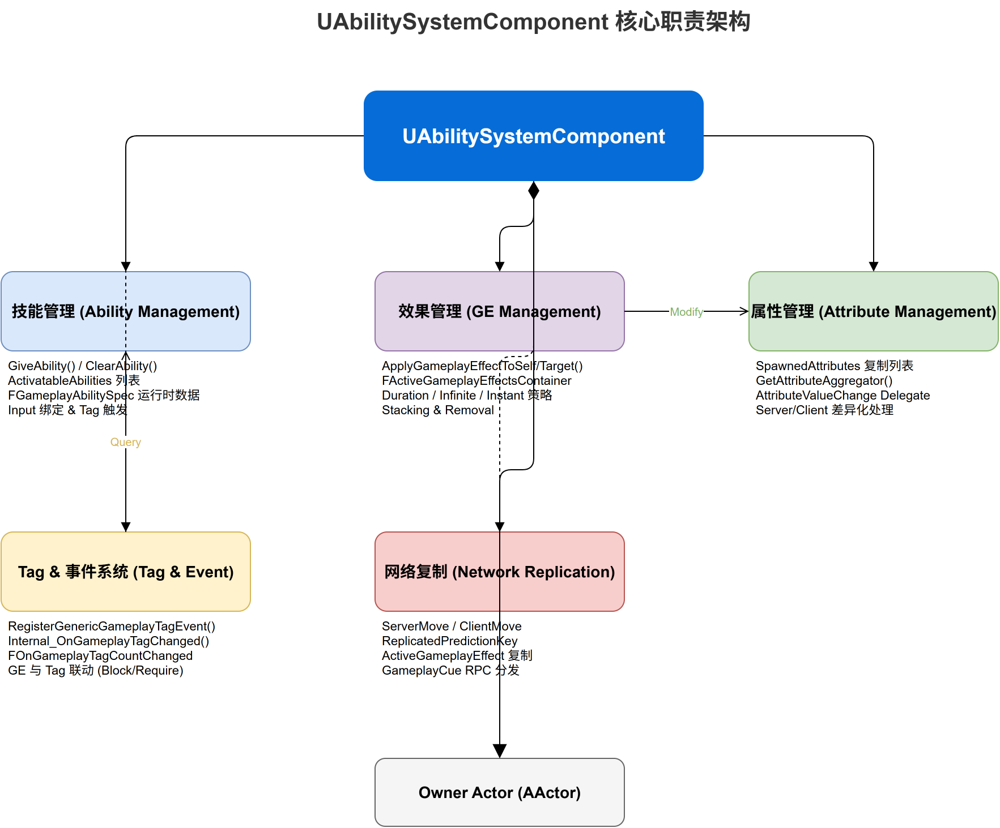

# 深入浅出UE5 GAS（一）：AbilitySystemComponent —— GAS的心脏

## 系列目录

1. **（本文）AbilitySystemComponent —— GAS的心脏**
2. [AttributeSet —— 数值系统的基石](../02-AttributeSet/02-AttributeSet文章.md)
3. [GameplayEffect（上）—— 从定义到应用](../03-GameplayEffect/03-GameplayEffect文章-上.md)
4. [GameplayEffect（下）—— Modifier、Stacking与Periodic](../03-GameplayEffect/03-GameplayEffect文章-下.md)
5. [ExecutionCalculation —— 自定义伤害公式](../04-ExecutionCalculation/04-ExecutionCalculation文章.md)
6. [GameplayAbility —— 技能的诞生与消亡](../05-GameplayAbility/05-GameplayAbility文章.md)
7. [AbilityTask —— 异步编程的艺术](../06-AbilityTask/06-AbilityTask文章.md)
8. [TargetData —— 索敌与数据传递](../07-TargetData/07-TargetData文章.md)
9. [GameplayCue —— 技能反馈的表现层](../08-GameplayCue/08-GameplayCue文章.md)
10. [网络同步 —— 复制、预测与回滚](../09-Network/09-Network文章.md)
11. [GE Components —— UE 5.3 模块化新范式](../10-GEComponents/10-GEComponents文章.md)
12. [实战全景 —— 调试、陷阱与工程化模式](../11-Practice/11-Practice文章.md)

> 📎 [补遗篇 —— FGameplayAbilitySpec 详解](../12-Others/12-Others文章.md)

---

## 写在前面

> **目标读者**：有 UE5 使用经验、能阅读 C++ 源码的游戏开发者。
> **前置知识**：UObject 系统、Actor/Component 架构、GameplayTag 基本概念。

如果你打开 UE5 的 GameplayAbilities 插件目录，第一眼会注意到什么？是一个超过 1600 行的 `AbilitySystemComponent.h`。放眼整个插件，没有任何其他类拥有如此庞大的声明文件。

这不是巧合。

在 GAS 的设计中，`UAbilitySystemComponent`（简称 ASC）扮演的角色，你几乎找不到一个更好的比喻：**它就是这个系统的"心脏"**。它的职责包括了 Ability 的授予与激活、GameplayEffect 的应用与管理、Attribute 的持有与计算、GameplayTag 事件的监听与分发、网络复制与预测……几乎 GAS 的每一个子系统，都需要通过 ASC 来协调。

这篇文章，我们就来仔细解剖这颗"心脏"，看看它是怎么跳动的。

---

## 一、问题的提出：为什么需要 ASC？

在动手分析源码之前，我们先问自己一个问题：**为什么 GAS 需要一个"超级组件"来统筹一切？**

想象一个没有 ASC 的替代方案：我们把所有与技能、Buff、属性相关的逻辑分散在 Actor 的各个组件中——一个组件管理技能列表，一个管理属性值，一个管理 Buff 效果条，还要各自处理网络复制……结果就是，你很快会陷入组件间通信混乱、同步顺序不确定、生命周期管理一团糟的困境。

**问题的本质是：GAS 的各个子系统之间有极强的耦合性。** 应用一个 GameplayEffect 可能会同时触发属性变化、产生 GameplayCue、激活或取消某些 Ability——这些操作需要一个"中央调度器"来统一管理顺序和同步。

ASC 正是这个调度器。源码注释中这样描述它：

```cpp
/**
 * The core component of the Gameplay Abilities System.
 * 
 * It manages:
 *  - Abilities (giving, activation, cooldowns)
 *  - GameplayEffects (application, stacking, removal)
 *  - Attributes (aggregation, replication)
 *  - GameplayTags & Events
 *  - Prediction & Network synchronization
 */
UCLASS(ClassGroup=(Custom), meta=(BlueprintSpawnableComponent))
class GAMEPLAYABILITIES_API UAbilitySystemComponent : public UGameplayTasksComponent
```

注意它的父类：`UGameplayTasksComponent`。这意味着 ASC 天然就是 Gameplay Task 系统的一部分——它可以直接使用 `UGameplayTask` 来驱动异步逻辑。这为 Ability 的异步激活和 AbilityTask 的工作提供了基础。

---

## 二、ASC 的体系结构：一张图理清关系

在深入源码之前，先建立一张思维导图：



```
UAbilitySystemComponent
├── Ability 管理
│   ├── FGameplayAbilitySpecContainer ActivatableAbilities  ← 所有授予的Ability
│   ├── GiveAbility() / ClearAbility()
│   ├── TryActivateAbility() / CancelAbility()
│   └── FGameplayAbilitySpec (每个Ability实例的运行时描述)
│
├── GameplayEffect 管理
│   ├── FActiveGameplayEffectsContainer ActiveGameplayEffects ← 所有活跃的GE
│   ├── ApplyGameplayEffectSpecToSelf()
│   ├── RemoveActiveGameplayEffect()
│   └── FActiveGameplayEffect (每个活跃GE的运行时数据)
│
├── Attribute 管理
│   ├── TArray<UAttributeSet*> SpawnedAttributes  ← 持有的AttributeSet
│   ├── SetNumericAttributeBase() / GetNumericAttribute()
│   └── GetOrCreateAttributeSubobject()
│
├── Tag & 事件系统
│   ├── FGameplayTagCountContainer GameplayTagCountContainer
│   ├── AddLooseGameplayTag() / RemoveLooseGameplayTag()
│   ├── GenericGameplayEventCallbacks  ← 通用事件回调
│   └── GameplayEventTagCallbacks      ← Tag事件回调
│
├── 网络同步
│   ├── ReplicationMode (Full / Mixed / Minimal)
│   ├── ServerTryActivateAbility()
│   ├── AbilityTargetData replication
│   └── bIsNetDirty → ForceReplication
│
└── 预测系统
    ├── FPredictionKey (ScopedPredictionWindow)
    ├── ReplicatedPredictionKeyMap
    └── Client/Server prediction key matching
```

这个结构清晰展示了 ASC 的五大核心职责。下面我们逐一深入。

---

## 三、源码深潜：Ability 的授予与激活

### 3.1 FGameplayAbilitySpec —— 能力的"身份证"

每个被授予给 ASC 的 Ability，都不会直接持有 `UGameplayAbility*` 指针，而是通过一个中间层 `FGameplayAbilitySpec` 来管理：

```cpp
USTRUCT(BlueprintType)
struct GAMEPLAYABILITIES_API FGameplayAbilitySpec : public FFastArraySerializerItem
{
    GENERATED_USTRUCT_BODY()

    /** Handle for outside sources to refer to this spec by */
    UPROPERTY()
    FGameplayAbilitySpecHandle Handle;        // ← 外部引用用的句柄

    /** Ability of the spec (Always the CDO. This should be const but too many things modify it currently) */
    UPROPERTY()
    TObjectPtr<UGameplayAbility> Ability;     // ← 指向Ability的CDO！不是实例

    /** Level of Ability */
    UPROPERTY()
    int32 Level;                              // ← 技能等级

    /** InputID, if bound */
    UPROPERTY()
    int32 InputID;                            // ← 输入绑定ID

    /** Object this ability was created from/instanced from. ... */
    UPROPERTY()
    TObjectPtr<UObject> SourceObject;         // ← 来源对象（如武器、装备）

    /** Active state of this ability */
    UPROPERTY()
    uint8 ActiveCount;                        // ← 活跃计数（允许多实例时为instance数）

    /** Count of currently running ability tasks */
    UPROPERTY(NotReplicated)
    int32 ActiveTasks;                        // ← 活跃Task计数（不复制）

    // ... 还有更复杂的实例化管理和移除标记等
};
```

**关键洞察1：Ability 的 CDO 与实例分离**

`FGameplayAbilitySpec::Ability` 指向的是 Ability 的 **CDO（Class Default Object）**，而不是运行时的实例对象。那真正的实例在哪里？看看 `FGameplayAbilitySpec` 中的实例管理：

```cpp
/** Instance of the ability (if instanced per execution or instanced per actor) */
TArray<TObjectPtr<UGameplayAbility>> AbilityInstances;
```

实例化的方式由 `UGameplayAbility::InstancingPolicy` 决定，这个我们在 GA 篇详细分析。这里你需要知道的关键点是：**Spec 是数据的持有者，Ability 是逻辑的持有者，二者通过 Spec 来耦合。**

### 3.2 GiveAbility 和 TryActivateAbility

授予 Ability 的核心函数：

```cpp
FGameplayAbilitySpecHandle UAbilitySystemComponent::GiveAbility(const FGameplayAbilitySpec& Spec);
```

这个方法将一个新的 `FGameplayAbilitySpec` 添加到 `ActivatableAbilities` 数组中。注意这个数组使用了 `FFastArraySerializer` 机制——UE 的快速数组序列化，可以高效地同步 Ability 的授予/移除到客户端。在第 1200 行附近可以看到：

```cpp
UPROPERTY(ReplicatedUsing=OnRep_ActivateAbilities, BlueprintReadOnly, Category = "Abilities")
FGameplayAbilitySpecContainer ActivatableAbilities;
```

激活流程则是这样的调用链：

```
TryActivateAbility(Handle) 
  → InternalTryActivateAbility(Handle)
    → 检查：是否已激活？是否被阻止（BlockAbilitiesWithTag）？
    → Spec.Ability->CanActivateAbility()    ← 检查Cost、Cooldown、Tags
    → Spec.Ability->ActivateAbility()       ← 进入实际激活逻辑
    → Spec.ActiveCount++
    → 触发OnGiveAbility委托
```

值得注意的源码细节：

```cpp
bool UAbilitySystemComponent::TryActivateAbility(FGameplayAbilitySpecHandle AbilityToActivate, bool bAllowRemoteActivation)
{
    // ...
    FGameplayAbilitySpec* Spec = FindAbilitySpecFromHandle(AbilityToActivate);
    if (!Spec) return false;
    
    // 先检查全局阻止Tag
    if (AbilitySystemComponent->AreAbilityTagsBlocked(Spec->Ability->AbilityTags))
        return false;
    
    // 然后调用InternalTryActivateAbility
    return InternalTryActivateAbility(AbilityToActivate, FPredictionKey(), nullptr, nullptr, bAllowRemoteActivation);
}
```

这段代码虽然简洁，但揭示了 GAS 的一个重要设计：**Tag Based 的阻塞机制。** 不必显式地判断"是否被眩晕"、"是否被沉默"——只需要通过 Tag 查询即可。这种设计让系统扩展性极强。

### 3.3 Ability 的取消

取消一个 Ability 的逻辑比激活更复杂，因为涉及到清理 Task、调用 EndAbility、处理 GE 清理等：

```cpp
void UAbilitySystemComponent::CancelAbility(UGameplayAbility* Ability);
void UAbilitySystemComponent::CancelAbilityHandle(const FGameplayAbilitySpecHandle& Handle);
void UAbilitySystemComponent::CancelAbilities(const FGameplayTagContainer* WithTags, const FGameplayTagContainer* WithoutTags, UGameplayAbility* Ignore);
```

第三个函数特别重要——你可以一次性取消所有匹配特定 Tag 的 Ability，这在实现沉默、眩晕等控制效果时非常方便。

---

## 四、源码深潜：GameplayEffect 的管理

### 4.1 FActiveGameplayEffectsContainer —— 隐形的引擎

ASC 对 GE 的管理并不直接在 ASC 类内部实现，而是委托给一个独立的内部类 `FActiveGameplayEffectsContainer`：

```cpp
// 在 AbilitiySystemComponent.h 的 protected 区域
FActiveGameplayEffectsContainer ActiveGameplayEffects;
```

为什么要把这么重要的逻辑抽成一个内部类？

**答案：职责分离。** ASC 已经够庞大了，把 GE 的存储、计算、移除逻辑放进一个独立的容器类，可以让代码结构更加清晰。`FActiveGameplayEffectsContainer` 内部维护了：

- `TArray<FActiveGameplayEffect>` —— 所有活跃的 GE
- GameplayEffect 的聚集器（Aggregator）管理
- Stacking 逻辑
- Duration/Duration Policy 管理
- 周期性执行（Periodic Effects）

对外的接口仍然通过 ASC 暴露：

```cpp
FActiveGameplayEffectHandle ApplyGameplayEffectSpecToSelf(const FGameplayEffectSpec& GameplayEffect, FPredictionKey PredictionKey = FPredictionKey());
FActiveGameplayEffectHandle ApplyGameplayEffectSpecToTarget(const FGameplayEffectSpec& GameplayEffect, UAbilitySystemComponent* Target, FPredictionKey PredictionKey = FPredictionKey());
```

注意这里有两个版本：`ToSelf` 和 `ToTarget`。实际上 `ToSelf` 是 `ToTarget` 的特例——当 Target == this 时。

### 4.2 FActiveGameplayEffectHandle —— 操作 GE 的凭证

应用 GE 后会返回一个 `FActiveGameplayEffectHandle`：

```cpp
USTRUCT(BlueprintType)
struct FActiveGameplayEffectHandle
{
    GENERATED_USTRUCT_BODY()

public:
    UPROPERTY()
    int32 Handle;
    
    UPROPERTY()
    bool bPassedFiltersAndWasExecuted;
    
    bool IsValid() const { return Handle != INDEX_NONE; }
    bool WasSuccessfullyApplied() const { return bPassedFiltersAndWasExecuted; }
};
```

这个 Handle 是后续操作 GE 的"凭证"——用它来修改 Stack Count、移除 GE、查询剩余时间等。

---

## 五、源码深潜：AttributeSet 与属性管理

ASC 持有所有 Spawned 的 AttributeSet：

```cpp
UPROPERTY(Replicated)
TArray<TObjectPtr<UAttributeSet>> SpawnedAttributes;
```

ASC 与 AttributeSet 的关系可以概括为：**ASC 是 AttributeSet 的拥有者（Owner），AttributeSet 通过 ASC 来执行属性的读取、修改和复制。**

具体怎么交互？以下是 ASC 提供的核心属性操作接口：

```cpp
// 设置Base值（直接影响属性聚集器的Base）
void SetNumericAttributeBase(const FGameplayAttribute& Attribute, float NewBaseValue);

// 获取最终值（经过所有Modifier计算后）
float GetNumericAttribute(const FGameplayAttribute& Attribute) const;

// 获取Base值
float GetNumericAttributeBase(const FGameplayAttribute& Attribute) const;

// 应用Mod到属性（来自ModifierMagnitudeCalculation的结果，用于Instant GE）
void ApplyModToAttribute(const FGameplayAttribute& Attribute, TEnumAsByte<EGameplayModOp::Type> ModifierOp, float ModifierMagnitude, const FGameplayEffectContextHandle& EffectContext);
```

注意 `GetNumericAttribute` 和 `GetNumericAttributeBase` 的区别：
- **Base** 是属性在没有任何 Modifier 之前的原始值
- **Current**（通过 `GetNumericAttribute` 获取）是经过所有 Modifier 计算后的最终值

### 5.1 属性复制与 GAMEPLAYATTRIBUTE_REPNOTIFY

属性在网络上复制的实现非常巧妙。AttributeSet 中的每个属性都在 `GetLifetimeReplicatedProps` 中注册了 `DOREPLIFETIME_CONDITION_NOTIFY`。当属性变化时，ASC 的 `SetBaseAttributeValueFromReplication` 会被调用：

```cpp
#define GAMEPLAYATTRIBUTE_REPNOTIFY(ClassName, PropertyName, OldValue) \
{ \
    static FProperty* ThisProperty = FindFieldChecked<FProperty>(ClassName::StaticClass(), \
        GET_MEMBER_NAME_CHECKED(ClassName, PropertyName)); \
    GetOwningAbilitySystemComponentChecked()->SetBaseAttributeValueFromReplication( \
        FGameplayAttribute(ThisProperty), PropertyName, OldValue); \
}
```

这个宏的核心思想是：**属性复制走的不是 UPROPERTY 的普通复制通道，而是通过 ASC 的特殊复制逻辑，确保修改能够正确进入属性聚集器（Aggregator）系统。**

---

## 六、源码深潜：Tag 与事件系统

ASC 内置了一个完整的 Tag 计数和事件分发系统：

```cpp
// Tag 计数容器
FGameplayTagCountContainer GameplayTagCountContainer;

// 添加/移除 Loose Tag
void AddLooseGameplayTag(const FGameplayTag& Tag, int32 Count=1);
void RemoveLooseGameplayTag(const FGameplayTag& Tag, int32 Count=1);
void AddLooseGameplayTags(const FGameplayTagContainer& Tags, int32 Count=1);
void RemoveLooseGameplayTags(const FGameplayTagContainer& Tags, int32 Count=1);
```

"Loose Tag" 是指不属于任何 GE 或 Ability 的独立 Tag——通常用于表示角色自身的状态（如 Dead、Stunned、InAir 等）。

ASC 还暴露了 Tag 变化时的委托：

```cpp
/** Called when GameplayTags are added or removed */
FOnGameplayEffectTagCountChanged& RegisterGameplayTagEvent(const FGameplayTag& Tag, 
    EGameplayTagEventType::Type EventType = EGameplayTagEventType::NewOrRemoved);
```

这让你可以方便地监听任何 Tag 的变化——比如"当 PlayerState.Dead Tag 出现时禁用所有输入"。

### 6.1 通用事件回调

```cpp
// 发送一个通用GameplayEvent
void HandleGameplayEvent(FGameplayTag EventTag, const FGameplayEventData* Payload);

// 注册对特定事件的回调
FDelegateHandle AddGameplayEventTagContainerDelegate(const FGameplayTagContainer& TagFilter, 
    const FGameplayEventTagMulticastDelegate::FDelegate& Delegate);
```

这个系统允许 Ability 通过 Tag 来通信——一个 Ability 发送一个事件，另一个 Ability 监听并响应。

---

## 七、源码深潜：网络复制模式

ASC 提供了三种网络复制模式：

```cpp
enum class EGameplayEffectReplicationMode
{
    Minimal,  // 只复制Minimal的信息，在独立服务器和AI控制器下使用
    Mixed,    // 给Owner复制GE，给SimulatedProxy复制最小的cue信息
    Full      // 复制所有GE信息给所有人
};
```

选择模式的关键依据是**谁拥有这个 ASC**：
- **Player-controlled**: 通常用 `Mixed` —— 给拥有的客户端完整信息，其他客户端只看到 Cue
- **AI-controlled**: 通常用 `Minimal` —— AI 不需要客户端预测

```cpp
UPROPERTY()
FActiveGameplayEffectsContainer ActiveGameplayEffects;
```

这个容器使用了 `FFastArraySerializer` 来优化 GE 的网络同步。每个 `FActiveGameplayEffect` 也是 `FFastArraySerializerItem` 的子类，确保只同步变化的部分。

### 7.1 ForceReplication

ASC 有一个关键成员：

```cpp
uint8 bIsNetDirty : 1;
```

当 ASC 有未复制的数据需要同步时（比如刚应用了 GE），它会设置 `bIsNetDirty = true` 并调用 `MarkForReplication()`。这与 UE 的 Actor Channel 刷新机制协同工作。

---

### 八、设计思考：为什么 ASC 如此"胖"？

读完源码，你可能会想：这个类是不是违反了单一职责原则？为什么不让每个子系统成为独立的组件？

答案是：**在某些情况下，过度的"解耦"会导致更复杂的耦合。** GAS 的各个子系统之间的交互如此频繁，如果把它们拆分为独立组件，你需要引入大量的事件通信、引用查找和数据同步逻辑。把核心调度逻辑放在 ASC 中，实际上**减少了整体的复杂度**。

Epic 的工程师们在设计时显然做了权衡：
1. **GE 管理** 被部分委托给 `FActiveGameplayEffectsContainer`（私有内部类）
2. **Attribute 聚集器** 被委托给 `FGameplayEffectAggregator`
3. **Task 生命周期** 继承自 `UGameplayTasksComponent`
4. 但 **最终的所有协调逻辑** 仍然在 ASC 中

这种"中心化调度、边缘化专用"的设计模式，在大型游戏框架中其实相当常见。

---

## 九、总结与回顾

在这篇文章中，我们分析了 `UAbilitySystemComponent` 的五个核心职责：

| 职责 | 关键数据结构 | 关键方法 |
|------|------------|---------|
| Ability 管理 | `FGameplayAbilitySpecContainer` | `GiveAbility()`, `TryActivateAbility()`, `CancelAbility()` |
| GE 管理 | `FActiveGameplayEffectsContainer` | `ApplyGameplayEffectSpecToSelf()`, `RemoveActiveGameplayEffect()` |
| Attribute 管理 | `TArray<UAttributeSet*>` | `SetNumericAttributeBase()`, `GetNumericAttribute()` |
| Tag & 事件 | `FGameplayTagCountContainer` | `AddLooseGameplayTag()`, `HandleGameplayEvent()` |
| 网络同步 | `bIsNetDirty`, 三种复制模式 | `MarkForReplication()` |

同时，我们看到了 GAS 设计的几个核心思想：

1. **Tag Based 架构**：一切条件判断都通过 GameplayTag，避免硬编码枚举
2. **CDO vs Instance 分离**：Ability 数据的 CDO 模式减少内存和网络开销
3. **FFastArraySerializer**：利用 UE 的快速数组序列化优化网络同步
4. **Handle 模式**：用轻量级 Handle 引用重量级对象，减少指针风险
5. **内部容器委托**：将复杂子系统委托给内部类，避免单个类无限膨胀

**下一篇预告**：我们将深入分析 `AttributeSet` 和 `FGameplayAttributeData`，看看 GAS 是如何实现高效、可扩展的属性系统的——包括但不限于：属性的聚集计算、Base/Current/Bonus 三层模型、编辑器中的属性配置、以及与 GE 的联动计算。

---

*本系列文章基于 UE 5.8 源码分析，GameplayAbilities 插件路径：`Engine/Plugins/Runtime/GameplayAbilities`*
