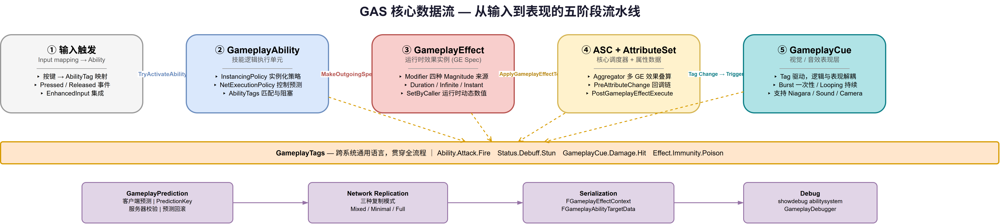
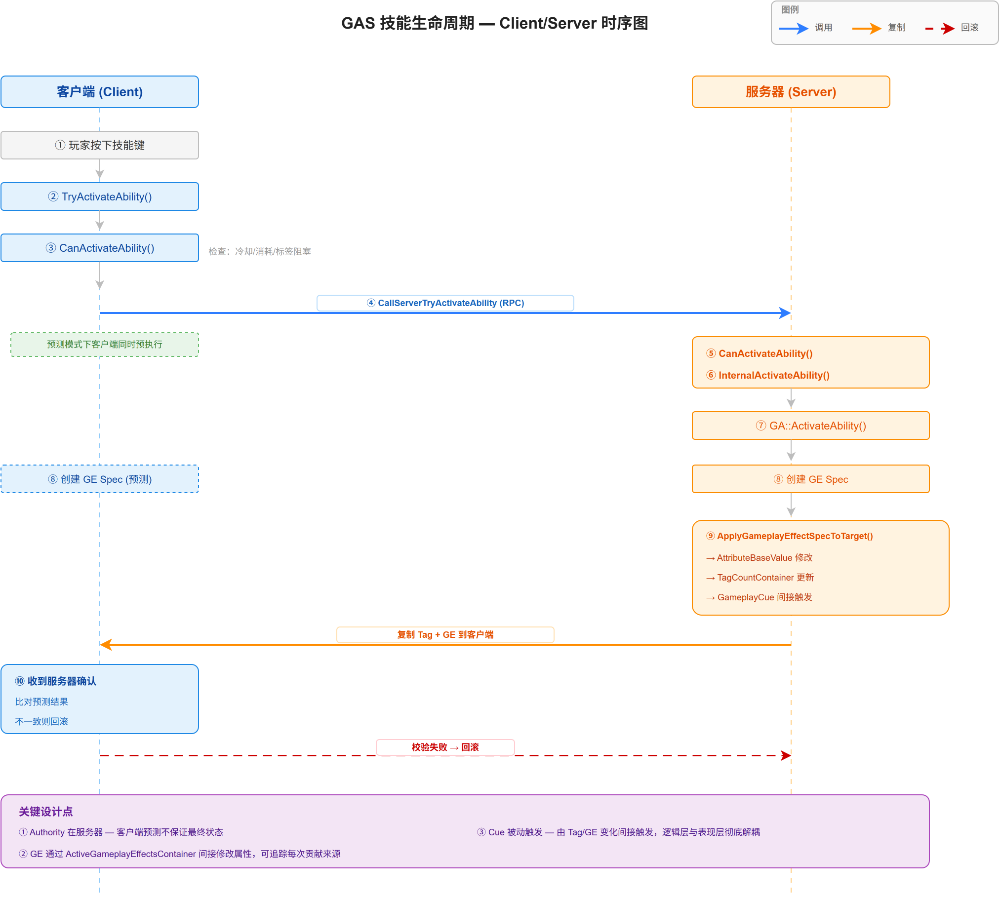

# 01 | GAS 总览与核心架构

> **系列**: 《Inside GAS》— UE5 GameplayAbilitySystem 源码深度分析  
> **难度**: 🟢 入门  
> **字数**: ~8000  
> **前置**: UE5 C++ 基础、UObject 反射机制  
> **源码路径**: `Engine/Plugins/Runtime/GameplayAbilities/`

---

## 一、问题引入：为什么需要 GAS？

假设你要做一个 RPG 游戏。角色有血量、魔法、攻击力，技能有冷却、消耗、伤害结算，Buff 需要叠层、计时、互斥——如果每个项目都从零写这些逻辑，你的 `AActor` 类很快会膨胀成几千行的怪兽。

更麻烦的是网络同步。客户端预测、服务器校验、回滚——如果没有统一框架，网络层和游戏逻辑会高度耦合，改一个技能可能破坏所有同步逻辑。

Epic 在《堡垒之夜》中遇到了同样的问题。他们的解决方案就是 **GameplayAbilitySystem (GAS)**——一个将属性、Buff、技能、视觉反馈彻底解耦的通用框架。

如果你直接翻源码，会看到 128 个头文件、5 个模块目录——很容易迷失。本文的目标是：**用一张全景图建立全局坐标系，让你后续深入每个子系统时，脑子里始终有"这张地图"。**

---

## 二、一句话定义 + 系统全景

### 2.1 一句话定义

> **GAS 是 UE5 内置的游戏功能框架，它把属性（Attribute）、效果（Effect）、技能（Ability）、表现（Cue）这四个概念彻底解耦，并提供内置的网络同步和客户端预测。**

### 2.2 七大子系统



> **完整架构图见上方**。GAS 以 ASC 为中心调度器，GA 是逻辑执行单元，GE 是属性修改器，AttributeSet 是数据载体，GameplayCue 是表现层，GameplayTags 是跨越所有子系统的通用语言，GameplayPrediction 和 Network Replication 纵贯全局。

| 子系统 | 一句话职责 | 核心文件 |
|--------|-----------|---------|
| **ASC** | 一切的中心调度器，持有技能、管理 GE 实例、负责属性聚合 | `AbilitySystemComponent.h` (109KB) |
| **AttributeSet** | 定义属性的存储和复制，提供修改前后的回调钩子 | `AttributeSet.h` (20KB) |
| **GameplayEffect** | 属性的修改器，可以瞬时/持续/无限执行，支持叠层和免疫 | `GameplayEffect.h` (117KB) |
| **GameplayAbility** | 游戏逻辑的执行单元，管理激活/取消/冷却/消耗 | `Abilities/GameplayAbility.h` (51KB) |
| **GameplayCue** | 将"发生什么事"翻译成"看见/听到什么"的表现层 | `GameplayCueManager.h` (21KB) |
| **GameplayTags** | 所有系统的"通用语言"，用层级标签替代枚举和字符串 | `GameplayTagContainer.h` (引擎核心) |
| **GameplayPrediction** | 客户端预执行+服务器校验，让技能"感觉不到延迟" | `GameplayPrediction.h` (35KB) |

### 2.3 一句话说清关系

```
玩家按下一个按钮
  → GameplayAbility 被激活（技能系统）
  → GameplayAbility 创建一个 GameplayEffect Spec
  → GameplayEffect 修改 AttributeSet 中的属性值（效果系统 → 属性系统）
  → GameplayCue 响应 Tag 变化播放粒子/音效（表现系统）
  → ASC 负责全程的网络同步（核心调度器）
```

---

## 三、源码架构：模块与关键文件

### 3.1 插件结构

```c++
// GameplayAbilities.uplugin — 三个模块构成
"Modules": [
  { "Name": "GameplayAbilities",    "Type": "Runtime"            },
  { "Name": "GameplayAbilitiesEditor", "Type": "UncookedOnly"    },
  { "Name": "GameplayDebuggerExtension_Abilities", "Type": "Editor" }
]
```

我们关注的是 `GameplayAbilities` 运行时模块，它的头文件分 5 个区域：

```
Source/GameplayAbilities/Public/
├── *.h (根目录，51 个)           ← 核心系统：ASC、GE、Globals、Debug
├── Abilities/ (16 个)            ← GameplayAbility + TargetActor
│   └── Tasks/ (41 个)            ← AbilityTask — 异步任务系统
├── GameplayEffectComponents/ (11 个)  ← GE 组件化架构（5.3+）
└── Serialization/ (9 个)          ← 自定义网络序列化器
```

### 3.2 三个核心入口

**① AbilitySystemInterface — 让 Actor 拥有 GAS 能力**

```cpp
// GameplayAbilities/Public/AbilitySystemInterface.h
UINTERFACE(MinimalAPI, meta = (CannotImplementInterfaceInBlueprint))
class UAbilitySystemInterface : public UInterface
{
    GENERATED_BODY()
};

class GAMEPLAYABILITIES_API IAbilitySystemInterface
{
    GENERATED_BODY()
public:
    /** Returns the AbilitySystemComponent that this Actor owns */
    virtual UAbilitySystemComponent* GetAbilitySystemComponent() const = 0;
};
```

这个接口只有 **一个方法**——不需要 `InitAbilityActorInfo`、不需要 `OwnedTags`。所有复杂性都封装在 ASC 内部。这是 GAS 设计哲学的第一条：**接口极简，实现集中**。

**② AbilitySystemGlobals — 全局配置单例**

```cpp
// GameplayAbilities/Public/AbilitySystemGlobals.h
UCLASS(config=Game)
class UAbilitySystemGlobals : public UObject
{
    // 核心配置
    FGameplayAbilityActorInfo ActorInfoCache;  // 线程安全的 ActorInfo 缓存
    bool bUseDebugTargetFromHud = false;       // 调试用
    TSubclassOf<UGameplayCueManager> GlobalGameplayCueManagerClass;
    
    // 全局查找 — 注意：单例访问器
    static UAbilitySystemGlobals& Get();
};
```

它定义全局行为：`ShouldAbilityIgnoreLocks()`、全局预测开关、CurveTable 路径等。你的项目应该继承它来配置项目级 GAS 行为。

**③ AbilitySystemComponent — 千行级的核心类**

ASC 的类声明有 **1000+ 行**（不包括实现），它是 GAS 的大脑。我们先看结构，不深挖细节：

```cpp
// AbilitySystemComponent.h (精简结构)
UCLASS(ClassGroup=AbilitySystem, ...)
class UAbilitySystemComponent : public UGameplayTasksComponent, 
                                 public IAbilitySystemInterface, 
                                 public IGameplayTagAssetInterface
{
    // === 技能管理 ===
    FGameplayAbilitySpecContainer ActivatableAbilities;  // 已授予的技能
    FGameplayAbilitySpecContainer AllReplicatedInstancedAbilities; // 复制用
    
    // === 效果管理 ===
    FActiveGameplayEffectsContainer ActiveGameplayEffects; // 活跃的 GE 实例
    
    // === 属性聚合 ===
    TMap<FGameplayAttribute, TSharedPtr<FActiveGameplayEffectAccumulator>> AttributeAggregatorMap;

    // === 标签管理 (实现 IGameplayTagAssetInterface) ===
    FGameplayTagCountContainer GameplayTagCountContainer;

    // === 核心 API ===
    // 技能
    FGameplayAbilitySpecHandle GiveAbility(const FGameplayAbilitySpec& Spec);
    bool TryActivateAbility(FGameplayAbilitySpecHandle Handle, ...);
    void CancelAbility(UGameplayAbility* Ability);
    
    // 效果
    FActiveGameplayEffectHandle ApplyGameplayEffectSpecToSelf(const FGameplayEffectSpec& Spec, ...);
    FActiveGameplayEffectHandle ApplyGameplayEffectSpecToTarget(const FGameplayEffectSpec& Spec, ...);
    bool RemoveActiveGameplayEffect(FActiveGameplayEffectHandle Handle, int32 StacksToRemove=1);
    
    // 属性
    float GetGameplayAttributeValue(FGameplayAttribute Attribute, ...) const;
    void SetNumericAttributeBase(const FGameplayAttribute& Attribute, float NewBaseValue);
};
```

关键观察：**ASC 同时继承了三个接口类**：
- `UGameplayTasksComponent` — 能力内建异步任务支持
- `IAbilitySystemInterface` — 自我标识
- `IGameplayTagAssetInterface` — 内建标签管理

这意味着任何拥有 ASC 的 Actor 自动就是 "GAS-enabled"，不需要手动注册。

上面看了三个入口的静态结构——`AbilitySystemInterface` 定义了"谁有能力"、`AbilitySystemGlobals` 定义了"全局规则"、`ASC` 定义了"有什么数据"。下面用一个动态场景把它们串起来：**当一个技能被激活时，数据到底怎么流动？**

---

## 四、核心数据流：一次技能的生命周期

这是理解 GAS 最关键的一张图。以一个简单的"释放火球，对目标造成伤害"为例：



> **时序图见上方**。上图展示了从按键到属性修改的完整 10 步流程：Client/Server 双线并行，蓝色箭头为调用，橙色箭头为复制，虚线为预测回滚路径。关键点——Authorization 校验始终走在逻辑执行之前，GE 始终通过 ASC 间接修改属性，Cue 始终是被动触发而非主动调用。

**关键设计点**：

1. **Authority 永远在服务器**。客户端可以预测执行，但最终权威来自服务器
2. **GE 不直接修改属性**。它通过 ASC 的 `ActiveGameplayEffectsContainer` 间接修改，这样 ASC 能追踪每个 GE 对属性的贡献
3. **Cue 是被动触发的**。技能代码不调用 Cue，而是通过 Tag/GE 变化间接触发——这保证了表现层和逻辑层完全解耦

---

## 五、设计哲学：GAS 的四种核心设计模式

### 5.1 数据驱动 (Data-Driven)

GAS 中的大量行为不是写在代码里，而是配置在 DataAsset 中：

| 配置对象 | 格式 | 示例 |
|---------|------|------|
| `UGameplayEffect` | Blueprint / C++ DataAsset | 配置 Modifiers、Duration、Tags |
| `UGameplayAbility` | Blueprint / C++ DataAsset | 配置 Cooldown、Cost、Input |
| `FAttributeMetaData` | DataTable | 属性名、最小值、最大值、显示名 |
| `UGameplayTagReponseTable` | DataAsset | Tag→GE 映射表（Tag 响应系统） |

**对比**：如果没有数据驱动，你需要为每个技能写一个 C++ 类继承 `UGameplayAbility`，修改冷却时间得重新编译。有了数据驱动，策划在编辑器中改一个浮点数就能调整冷却——同样的技能模板，不同参数就是不同技能。

> **源码证据** — `FGameplayTagResponseTableEntry` 的核心是 `Positive/Negative` 两个 `FGameplayTagReponsePair`，每个包含一组 `TArray<TSubclassOf<UGameplayEffect>>`。策划在编辑器配好这张表，就能让 Tag 变化自动触发 GE 应用，一行代码都不用写。

### 5.2 组件化 (Component-Based)

从 UE 5.3 开始，GE 从"大杂烩类"重构为组件化架构：

```cpp
// GameplayEffect.h 开篇注释 (节选)
// Since Unreal 5.3, we have deprecated the Monolithic UGameplayEffect
// and instead rely on UGameplayEffectComponents.
// UGameplayEffectComponents are implemented as instanced SubObjects.
```

`GameplayEffectComponents/` 目录下 11 个文件，每个组件负责一个独立职责：

| 组件 | 职责 |
|------|------|
| `AbilitiesGameplayEffectComponent` | GE 可以授予技能 |
| `AssetTagsGameplayEffectComponent` | GE 可以添加/移除 AssetTags |
| `BlockAbilityTagsGameplayEffectComponent` | GE 可以阻止技能使用 |
| `ChanceToApplyGameplayEffectComponent` | GE 有概率生效 |
| `TargetTagRequirementsGameplayEffectComponent` | 目标 Tag 条件 |
| `TargetTagsGameplayEffectComponent` | 给目标添加 Tag |
| ... | ... |

这是一次重要的架构演进——我们会在第 11 篇文章中深度分析组件化带来的好处和实现细节。

### 5.3 标签通信 (Tag-Based Communication)

GAS 不使用枚举、不使用字符串匹配、不使用事件广播——**一切通过 GameplayTag 传递信息**。

- 技能被"标签"阻塞：`BlockAbilitiesWithTag`
- 技能被"标签"取消：`CancelAbilitiesWithTag`
- GE 根据"标签"判断免疫：`ImmunityTags`
- Cue 监听"标签"变化触发表现
- 属性修改触发"标签"事件

这种设计的优雅之处在于：**添加新技能不需要修改任何旧代码**。只要设计好标签层级，新技能自动融入整个系统。

```cpp
// ❌ 硬编码方式 — 每新增一种伤害类型，都得改 switch
void ProcessDamage(EDamageType Type, float Amount)
{
    switch (Type) {
        case EDamageType::Poison:  ApplyPoison(Amount); break;
        case EDamageType::Burn:    ApplyBurn(Amount);   break;
        // 新增 Fire → 必须改这里，还要改枚举定义
    }
}

// ✅ GAS 方式 — Tag 匹配，新增伤害类型只需配新 Tag
if (EffectTag.MatchesTag(Tag_Status_Debuff_Poison))
{
    ASC->ApplyGameplayEffectSpecToSelf(*PoisonSpec);
}
// 策划在编辑器新增 Tag_Status_Debuff_Fire，无需改一行 C++
```

### 5.4 可预测同步 (Predictive Replication)

```cpp
// GameplayAbility.h — NetExecutionPolicy 枚举
UENUM(BlueprintType)
enum class EGameplayAbilityNetExecutionPolicy : uint8
{
    LocalPredicted  UMETA(DisplayName="Local Predicted"),  // 客户端预测
    LocalOnly       UMETA(DisplayName="Local Only"),       // 仅本地
    ServerInitiated UMETA(DisplayName="Server Initiated"), // 服务器发起
    ServerOnly      UMETA(DisplayName="Server Only"),      // 仅服务器
};
```

`LocalPredicted` 是 GAS 最精妙的设计——客户端立即执行技能，同时发 RPC 给服务器；服务器校验后返回确认。如果预测错误（例如服务器判定目标已死亡），客户端回滚状态。

我们会在第 10 篇文章中详细解读 `PredictionKey` 的生成、传递和校验机制。

---

## 六、从入门到精通的阅读路线

| 阶段 | 文章 | 核心收获 |
|------|------|---------|
| 🟢 基础 | 01 总览 ← **你在这里** | 建立全局坐标系 |
| | 02 ASC | 理解中心调度器的初始化、复制模式、Tick 循环 |
| | 03 GameplayTags | 掌握 GAS 的"通用语言" |
| | 04 AttributeSet | 理解属性定义、回调链、网络复制 |
| 🔵 核心 | 05-06 GE (上/下) | 掌握效果系统的所有细节——这是 GAS 最大最复杂的子系统 |
| | 07-08 GA (上/下) | 技能从激活到取消的完整生命周期 |
| | 09 GameplayCue | 表现层的触发机制和自定义 |
| 🔴 高级 | 10 Prediction | 客户端预测的完整链路 |
| | 11 GE Components | 组件化架构的演进 |
| | 12 Network & Serial | 自定义序列化器 |
| | 13 Targeting | 瞄准系统 |
| | 14 Debug & Optimization | 实战调试工具链 |
| | 15 终篇回顾 | 全景复习 + 设计模式总结 |

**重点篇章**：ASC (02)、GE (05-06)、GA (07-08)、GC (09) 是整个系列的四个核心支柱，建议细读。

---

## 七、关键术语速查

| 术语 | 全称 | 含义 |
|------|------|------|
| **ASC** | AbilitySystemComponent | GAS 核心调度器，一个 Actor 只有一个 |
| **GE** | GameplayEffect | 属性修改器，定义"影响什么、怎么影响" |
| **GA** | GameplayAbility | 技能，定义"能做什么" |
| **GC** | GameplayCue | 表现效果，定义"看起来/听起来怎样" |
| **AS** | AttributeSet | 属性集合，定义"角色有哪些数值" |
| **GE Spec** | GameplayEffectSpec | GE 的运行时实例（GE 是模板，Spec 是实例） |
| **GE Component** | GameplayEffectComponent | UE5.3+ 的 GE 子对象组件 |
| **FActiveGameplayEffectHandle** | — | 指向活跃 GE 实例的句柄 |
| **PredictionKey** | — | 预测执行时的幂等键，用于客户端-服务器校验 |

---

## 八、总结

1. **GAS 的本质是解耦**。它将属性、效果、技能、表现分成 7 个独立子系统，通过 ASC 协调运转。
2. **Tag 是通用语言**。GAS 不使用硬编码枚举或字符串匹配，一切耦合通过 GameplayTag 消解。
3. **权威在服务器**。客户端可以预测执行，但任何状态变更的最终决策权在服务器。
4. **数据驱动优先**。绝大多数 GAS 行为可以在编辑器配置完成，不需要写 C++ 代码。
5. **128 个头文件看似庞大，但只需记住 4 个核心文件就能入门**：`AbilitySystemComponent.h`、`GameplayEffect.h`、`GameplayAbility.h`、`AttributeSet.h`。

下一篇文章，我们将深入 ASC——理解它的初始化流程、三种网络复制模式，以及为什么"一个 Actor 只能有一个 ASC"。

---

*本文基于 UE 5.8 源码分析。系列文章将逐模块深入，从基础到高级，从 API 到设计哲学。*
