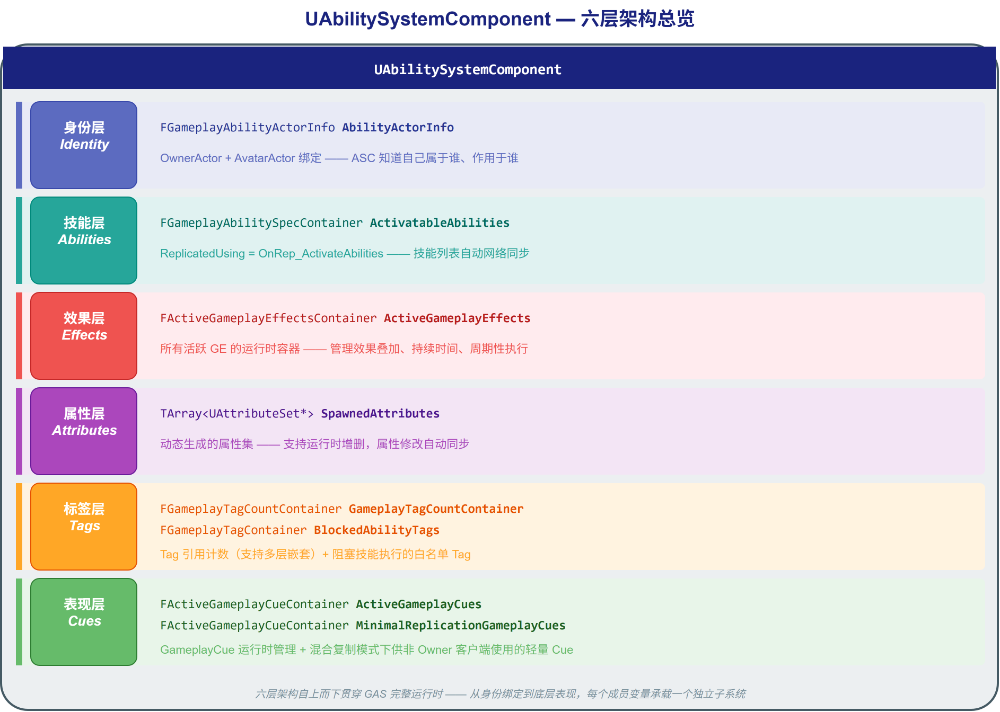
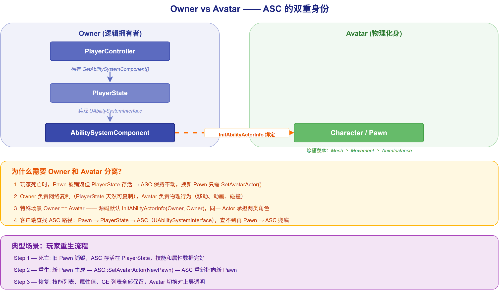
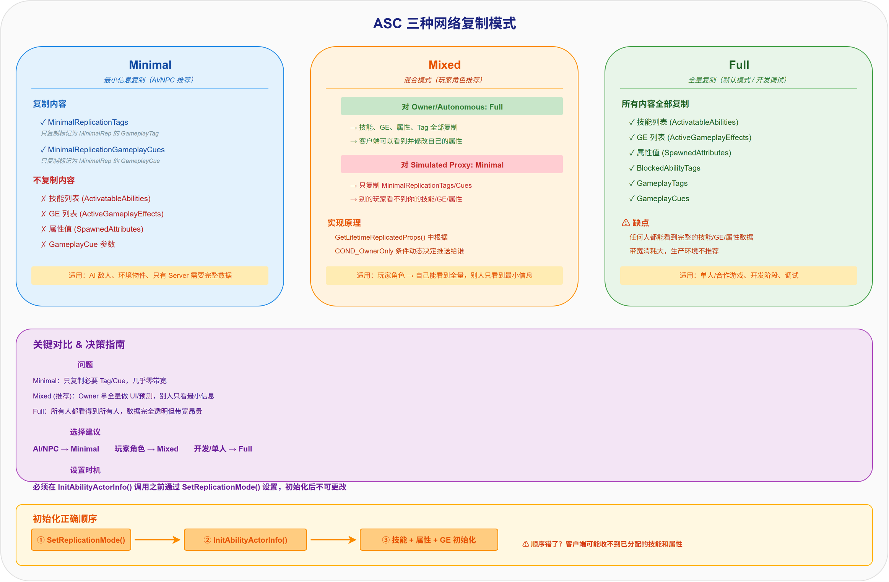

# 02 | ASC：GAS 的核心调度器

> **系列**: 《Inside GAS》— UE5 GameplayAbilitySystem 源码深度分析  
> **难度**: 🟢 入门  
> **字数**: ~6000  
> **前置**: 01-GAS总览与核心架构  
> **源码路径**: `Engine/Plugins/Runtime/GameplayAbilities/Source/GameplayAbilities/Public/AbilitySystemComponent.h`

---

> **系列导航**
> 
> | 阶段 | 篇章 | 内容 | 状态 |
> |------|------|------|------|
> | 🟢 基础 | 01 | GAS 总览与核心架构 | ✅ |
> | | **02** | **ASC — 核心调度器** | ✅ |
> | | 03 | GameplayTags — 通用语言 | 📝 |
> | | 04 | AttributeSet — 属性定义与复制 | 📝 |
> | 🔵 核心 | 05 | GameplayEffect — 效果与计算 (上) | 📝 |
> | | 06 | GameplayEffect — 效果与计算 (下) | 📝 |
> | | 07 | GameplayAbility — 技能激活与核心框架 (上) | 📝 |
> | | 08 | GameplayAbility — Task/输入/预测 (下) | 📝 |
> | | 09 | GameplayCue — 表现层触发机制 | 📝 |
> | 🔴 高级 | 10 | Prediction — 预测与回滚 | 📝 |
> | | 11 | GE Components — 组件化架构演进 | 📝 |
> | | 12 | Network & Serial — 网络序列化 | 📝 |
> | | 13 | Targeting — 瞄准系统 | 📝 |
> | | 14 | Debug & Optimization — 调试与优化 | 📝 |
> | | 15 | 终篇回顾 — 全景复习 | 📝 |

---

## 一、问题引入：ASC 到底管了多少东西？

在上一篇中，我们看到了 GAS 的核心三件套——技能（`UGameplayAbility`）、效果（`UGameplayEffect`）、属性（`UAttributeSet`）。但还有一个问题没有回答：**谁来协调它们？**

答案是 `UAbilitySystemComponent`。它是整个 GAS 的"CPU"——不做具体业务，但调度一切。

打开 `AbilitySystemComponent.h`（109KB，近 2000 行），六层结构一目了然：



ASC 同时是**技能注册表**、**效果管理器**、**属性容器**、**标签系统**和**表现调度器**。这还不是全部；它还负责 RPC 通信、网络复制、预测回滚、输入绑定。

但这一切的起点，是**初始化**。而初始化之前，必须先澄清两个容易混淆的概念：Owner 和 Avatar。

---

## 二、核心概念：Owner 与 Avatar —— ASC 的双重身份

### 2.1 为什么需要两个身份？

GAS 的设计面对一个经典网络游戏问题：**逻辑拥有者**和**物理化身**可以是不同的 Actor。

- **玩家死亡时**：Pawn 被销毁，但技能冷却、属性值、活跃 Buff 应该保留
- **观战/切视角时**：控制者不变，但世界中的代表物变了
- **AI 单位**：没有 PlayerController，但有 ASC 需求

Epic 的解决方案是引入两个角色：

| 概念 | 含义 | 典型实现 | 生命周期 |
|------|------|----------|----------|
| **Owner** | 逻辑拥有者 | PlayerState / PlayerController | 长（跨越死亡、换角色） |
| **Avatar** | 物理化身 | Character / Pawn | 短（死亡即销毁，可更换） |

### 2.2 源码证据

```cpp
// AbilitySystemComponent.h 第 1488-1493 行附近
// FGameplayAbilityActorInfo 中的关键字段

/** The Actor that owns the abilities, shouldn't be null */
UPROPERTY(BlueprintReadOnly, Replicated, Category = "ActorInfo")
TWeakObjectPtr<AActor> OwnerActor;

/** The physical Actor that executes the abilities, shouldn't be null.
 *  May be the same as OwnerActor */
UPROPERTY(BlueprintReadOnly, Replicated, Category = "ActorInfo")
TWeakObjectPtr<AActor> AvatarActor;
```

两个字段都是 `Replicated`，这意味着 Owner 和 Avatar 在网络上的每个客户端都知道。但它们的用途不同：

- `OwnerActor` 决定**许可和所有权**——谁能激活技能？GE 归谁管？
- `AvatarActor` 决定**物理表现**——技能效果打在哪？动画在谁身上播？

### 2.3 典型场景：玩家重生

以玩家死亡重生为例：

```
死亡前:
  Owner  = PlayerState   (存活，ASC 挂载于此)
  Avatar = OldPawn       (即将销毁)
  
死亡时：
  OldPawn 被 Destroy()
  ASC 仍存活在 PlayerState 上  ← 技能冷却、属性、Buff 全部保留！
  
重生后：
  NewPawn 生成
  ASC::InitAbilityActorInfo(PlayerState, NewPawn)
  AvatarActor 指向 NewPawn
  → 技能列表、属性值、GE 列表无缝迁移！
```



> **关键洞察**：如果没有 Owner/Avatar 分离，玩家死亡后技能冷却会重置、Buff 会丢失、属性得重新加载。所有的"状态延续"都需要额外机制。GAS 用一个架构设计直接解决了这个问题。

### 2.4 边缘情况：Owner == Avatar

对于炮塔、建筑、可拾取物等"不需要重生"的对象，Owner 和 Avatar 可以是同一个 Actor。源码的默认行为就是如此：

```cpp
// AbilitySystemComponent.cpp — InitializeComponent() 默认实现
void UAbilitySystemComponent::InitializeComponent()
{
    Super::InitializeComponent();
    // ...
    InitAbilityActorInfo(GetOwner(), GetOwner());  // Owner == Avatar
}
```

这意味着：如果你在 `Character::BeginPlay()` 中不做额外调用，你的 Pawn 的 ASC 会把 Pawn 自己同时当作 Owner 和 Avatar——这在单机/合作游戏中完全够用，但多人游戏需要手动拆分。

理清了 Owner 和 Avatar 的关系，接下来看初始化的具体步骤和正确顺序。

---

## 三、初始化流程：InitAbilityActorInfo 的正确姿势

### 3.1 默认初始化存在一个问题

回顾上面的 `InitializeComponent()`，它在组件注册时自动调用 `InitAbilityActorInfo(GetOwner(), GetOwner())`。但这个时机有两个隐患：

1. **获取网络的时机**：`GetOwner()` 在 `InitializeComponent()` 时可能尚未完成网络角色设置（`Role` 还是 `ROLE_Authority` 默认值），导致复制模式判断出错
2. **Owner != Avatar**：在需要分离的情况下，默认行为不会帮你做这件事

### 3.2 正确的初始化时序

```
① SetReplicationMode()     ← 必须在 InitAbilityActorInfo 之前！
② InitAbilityActorInfo(OwnerActor, AvatarActor)
③ GiveAbility() / GiveDefaultAbilities()
④ 应用初始 GE（如果有默认属性加成）
```

源码中的 `SetReplicationMode()` 实现确认了这一点（`AbilitySystemComponent.cpp` 第 664-670 行附近）：

```cpp
void UAbilitySystemComponent::SetReplicationMode(EGameplayEffectReplicationMode NewReplicationMode)
{
    ensureMsgf(!bIsNetDirty || ReplicationMode == NewReplicationMode,
        TEXT("SetReplicationMode called after InitAbilityActorInfo, no effect."));
    ReplicationMode = NewReplicationMode;
}
```

> **关键**：`bIsNetDirty` 在 `InitAbilityActorInfo()` 中被置为 `true`，之后 `ensureMsgf` 会在重复调用时触发断言警告。**初始化后修改无效。**

### 3.3 推荐实践

一个标准的 `ACharacter` 子类 + `APlayerState` 作为 Owner 的写法：

```cpp
// AMyPlayerState.h
UCLASS()
class AMyPlayerState : public APlayerState
{
    GENERATED_BODY()
public:
    AMyPlayerState();
    
    UPROPERTY(VisibleAnywhere, BlueprintReadOnly)
    UAbilitySystemComponent* AbilitySystemComponent;
    
    virtual UAbilitySystemComponent* GetAbilitySystemComponent() const override
    {
        return AbilitySystemComponent;
    }
};

// AMyPlayerState.cpp
AMyPlayerState::AMyPlayerState()
{
    AbilitySystemComponent = CreateDefaultSubobject<UAbilitySystemComponent>(TEXT("ASC"));
    // 此时 SetOwner() 已经由引擎调用
}

// AMyCharacter.cpp — BeginPlay()
void AMyCharacter::BeginPlay()
{
    Super::BeginPlay();
    
    if (APlayerState* PS = GetPlayerState<AMyPlayerState>())
    {
        UAbilitySystemComponent* ASC = PS->GetAbilitySystemComponent();
        
        // Step 1: 设置复制模式（必须在 Step 2 之前）
        ASC->SetReplicationMode(EGameplayEffectReplicationMode::Mixed);
        
        // Step 2: 初始化——PS 是 Owner，Character 是 Avatar
        ASC->InitAbilityActorInfo(PS, this);
        
        // Step 3: 授予技能
        for (auto& AbilityClass : DefaultAbilities)
        {
            ASC->GiveAbility(FGameplayAbilitySpec(AbilityClass, 1));
        }
    }
}
```

关键点：
- **ASC 创建在 PlayerState 构造中**——因为 PlayerState 生命周期长，跨死亡不销毁
- **InitAbilityActorInfo 在 Character::BeginPlay() 中调用**。此时网络角色已确定，Character 已生成
- **SetReplicationMode 在最前面**——任何其他操作之前

---

## 四、三种网络复制模式

### 4.1 为什么需要三种模式？

GAS 的复制内容是丰富的：几百个技能 Spec、成百上千的活跃 GE、数十个属性、复杂的 Tag 层级，如果所有内容都复制给所有客户端，带宽会爆炸。

Epic 设计了三种模式，让你按需选择：



### 4.2 源码定义

```cpp
// GameplayEffectTypes.h 或 AbilitySystemComponent.h
UENUM()
enum class EGameplayEffectReplicationMode : uint8
{
    Minimal,  // 只复制标记为 MinimalRep 的 Tag 和 Cue
    Mixed,    // Owner/Autonomous 走 Full，Simulated 走 Minimal
    Full      // 全部数据复制给所有客户端
};
```

### 4.3 逐模式详解

#### Mode 1: Minimal（最小模式）

```
复制：MinimalReplicationTags + MinimalReplicationGameplayCues
不复制：技能列表、GE 列表、属性值、完整的 Tag/Cue
```

**适用**：AI 敌人、环境物件。这些对象不需要客户端知道完整的 GAS 状态。
客户端只需要知道"这个敌人被点燃了"（一个 Minimal Tag），就能播放着火特效，不需要知道着火是怎么实现的。

#### Mode 2: Mixed（混合模式，推荐）

```
对 Owner/Autonomous Proxy：等价于 Full —— 全量数据
对 Simulated Proxy：      等价于 Minimal —— 最小信息
```

**这是生产环境最推荐的模式。** 实现原理在 `GetLifetimeReplicatedProps()` 中通过 `COND_OwnerOnly` 条件复制实现（`AbilitySystemComponent.cpp` 第 447-460 行附近）：

```cpp
void UAbilitySystemComponent::GetLifetimeReplicatedProps(TArray<FLifetimeProperty>& OutLifetimeProps) const
{
    Super::GetLifetimeReplicatedProps(OutLifetimeProps);
    
    DOREPLIFETIME_CONDITION(UAbilitySystemComponent, ActivatableAbilities,    COND_OwnerOnly);
    DOREPLIFETIME_CONDITION(UAbilitySystemComponent, SpawnedAttributes,       COND_OwnerOnly);
    DOREPLIFETIME_CONDITION(UAbilitySystemComponent, ActiveGameplayEffects,   COND_OwnerOnly);
    DOREPLIFETIME_CONDITION(UAbilitySystemComponent, MinimalReplicationTags,  COND_OwnerOnly);
}
```

技能、GE、属性等重量级数据只推送给控股客户端（Owner/Autonomous），其他客户端只拿到最小 Tag/Cue 信息。

**适用**：绝大多数多人游戏玩家角色：自己看到完整 UI 和属性，别人只看到必要表现。

#### Mode 3: Full（全量模式）

```
所有数据 → 所有客户端
缺点：任何人能看到任何人的技能列表、GE 列表、属性值
```

**适用**：单机游戏、开发调试阶段。生产环境多人游戏中基本不用，不仅浪费带宽，还泄露游戏数据（对手能看到你的技能冷却和 Buff 堆叠）。

### 4.4 选择决策表

| 场景 | 推荐模式 | 原因 |
|------|----------|------|
| AI / NPC / 环境物 | Minimal | 节省带宽，客户端不需要完整 GAS 状态 |
| 玩家角色（多人） | Mixed | Owner 拿全量做预测/UI，别人看最小信息 |
| 单机 / 合作 / Debug | Full | 简单直接，数据完全透明 |

复制模式决定了数据"流向谁"，但不管哪种模式，ASC 内部承载的数据结构是相同的。下面看看这些结构的细节。

---

## 五、ASC 内部数据结构一览

### 5.1 技能容器：FGameplayAbilitySpecContainer

```cpp
// AbilitySystemComponent.h 第 1668 行
UPROPERTY(ReplicatedUsing = OnRep_ActivateAbilities, ...)
FGameplayAbilitySpecContainer ActivatableAbilities;
```

`FGameplayAbilitySpecContainer` 内部是一个 `TArray<FGameplayAbilitySpec>`，每个 `FGameplayAbilitySpec` 持有：
- `Ability`：`UGameplayAbility` 的 CDO 引用
- `Handle`：全局唯一句柄
- `Level`：技能等级（影响 GE 的曲线查表）
- `InputID`：输入绑定 ID
- `ActiveCount`：当前激活实例数

`ReplicatedUsing = OnRep_ActivateAbilities` 是关键：当技能列表从服务器同步到客户端时，`OnRep_ActivateAbilities()` 会被触发，检查新技能并激活待处理的技能请求。

```cpp
// AbilitySystemComponent_Abilities.cpp 第 1492 行
void UAbilitySystemComponent::OnRep_ActivateAbilities()
{
    // 1. 验证所有技能 CDO 是否已复制完成（否则延迟 0.5s 重试）
    for (FGameplayAbilitySpec& Spec : ActivatableAbilities.Items)
    {
        if (!Spec.Ability)
        {
            GetWorld()->GetTimerManager().SetTimer(
                OnRep_ActivateAbilitiesTimerHandle, this,
                &UAbilitySystemComponent::OnRep_ActivateAbilities, 0.5);
            return;
        }
    }
    
    // 2. 检查是否有已清除的技能（服务器移除但客户端还没收到）
    CheckForClearedAbilities();
    
    // 3. 处理客户端预激活队列
    for (const FPendingAbilityInfo& PendingAbilityInfo : PendingServerActivatedAbilities)
    {
        // 重试之前因为技能未复制而阻塞的激活请求
        // ...
    }
}
```

注意：如果技能的 CDO（Class Default Object）还没完成网络复制，`OnRep_ActivateAbilities` 会设置一个 0.5 秒定时器重试。这也解释了客户端技能偶尔出现延迟的原因——技能 CDO 复制和技能列表同步是两条独立的网络通道。

### 5.2 效果容器：FActiveGameplayEffectsContainer

这是 GAS 中最复杂的容器。我们在第 01 篇中提到，GE 不直接修改属性，而是通过 `FActiveGameplayEffectsContainer` 间接修改。

```cpp
// 内部关键结构（非完整定义，仅为理解用途）
class FActiveGameplayEffectsContainer
{
    // 所有活跃的 GE 实例
    TArray<FActiveGameplayEffect> GameplayEffects_Internal;
    
    // 按 Tag 索引，快速查找"被眩晕影响的所有 GE"
    TMap<FGameplayTag, TArray<int32>> ActiveEffectTagMap;
    
    // 属性聚合器——把多个 GE 贡献合并成一个最终属性值
    TMap<FGameplayAttribute, FAggregator> AttributeAggregatorMap;
    
    // 持续时间策略（Instant / Duration / Infinite）
    // 堆叠策略（Aggregate by Source / Aggregate by Target）
    // ...
};
```

这个容器负责：
- GE 的添加、移除、持续时间到期
- 属性聚合（多个 GE 对同一个属性的贡献如何合并）
- Modifier 求值（加法、乘法、覆盖等操作符）
- Tag 修改（GE 添加/移除 Tag）

后续文章会在 GE 篇中深入 `FActiveGameplayEffectsContainer` 的内部实现。

### 5.3 属性集：SpawnedAttributes

```cpp
UPROPERTY()
TArray<TObjectPtr<UAttributeSet>> SpawnedAttributes;
```

这是一个简单的数组，持有 ASC 动态生成的 `UAttributeSet` 实例。通过 `AddSpawnedAttribute()` 添加，通过 `GetAttributeSubobject()` 查找。

### 5.4 标签系统：GameplayTagCountContainer

```cpp
FGameplayTagCountContainer GameplayTagCountContainer;
```

这是 GAS 标签通信的底层实现。它不只是"有还是没有 Tag"，而是维护 Tag 的**计数引用**：

```cpp
// 同一个 Tag 可以被多个 GE 添加，内部计数 > 1
Container.AddTag(Tag_Stun);   // 计数 = 1（被一个 GE 添加）
Container.AddTag(Tag_Stun);   // 计数 = 2（被另一个 GE 也添加）
Container.RemoveTag(Tag_Stun); // 计数 = 1（第一个 GE 移除，Tag 还在）
Container.RemoveTag(Tag_Stun); // 计数 = 0（所有 GE 移除，Tag 消失）
```

这也是为什么多个眩晕效果叠加时，只要还有一个在，角色就保持眩晕——因为 Tag 计数还没归零。

---

## 六、关于 Tick：ASC 为什么没有 TickComponent？

翻遍 `AbilitySystemComponent.cpp`，会发现：**ASC 没有覆写 `TickComponent()`。**

那它怎么处理帧更新？答案分两层：

### 6.1 被动驱动：GE 有自己的生命周期

`FActiveGameplayEffectsContainer` 内部维护着定时器（`FTimerHandle`），按 GE 的持续时长调度过期事件。ASC 本身的帧逻辑很简单：

- 不主动 Tick 技能（技能通过 `UAbilityTask` 使用 World Timer）
- 不主动 Tick 属性（属性由 GE 修改，修改时即时重算）
- 不主动 Tick 标签（标签由 GE 的添加/移除驱动）

### 6.2 需要主动 Tick 时：通过 WorldSubsystem

如果你确实需要逐帧检查（比如每帧给周围敌人施加光环），UE5 推荐使用 `UTickableWorldSubsystem` + `FGameplayEffectContextHandle` 实现，而不是覆写 ASC 的 Tick。

ASC 的定位是**被动调度器**：它持有数据、暴露接口，但从不主动推进任何流程。驱动方永远是技能或外部系统，ASC 只负责协调。

---

## 七、设计思考：为什么一个 Actor 只能有一个 ASC？

### 7.1 技术约束

这个问题可以从 API 设计找到答案：

```cpp
// AbilitySystemInterface.h
class IAbilitySystemInterface
{
public:
    virtual UAbilitySystemComponent* GetAbilitySystemComponent() const = 0;
};
```

`GetAbilitySystemComponent()` 返回的是**单个指针**，不是数组。这意味着 GAS 的接口天然假设一个 Actor 只有一个 ASC。

### 7.2 架构原因

如果允许多个 ASC 共存，会引发一系列设计问题：

1. **哪个 ASC 处理哪个 Tag？** — 如果同一个 Actor 有两个 ASC 都注册了 `Tag_Stun`，谁说了算？
2. **属性归属混乱** — `UAttributeSet` 属于哪个 ASC？伤害计算从哪个 ASC 取属性？
3. **网络复制加倍** — 每个 ASC 独立复制，复制数据翻倍

对比 Unity 的设计：Unity 的 GameObject 可以挂载任意数量的 Component，每个 Component 独立管理状态——灵活性极高。但代价是状态分散，跨组件协调需要手动实现事件总线或依赖注入。UE 选择单 ASC 的约束，本质上是用灵活性换一致性：一个 Actor 的所有 GAS 状态集中管理，调试、复制、序列化全部统一。

### 7.3 变通方案

如果你确实需要"组件化"GAS 能力，标准做法是**在父 Actor 上放一个 ASC，子组件通过引用访问**——而不是给子组件各自创建 ASC。这也是为什么 `PlayerState` 是 ASC 的天然家园：它是一个全局单例（每个 `PlayerController` 一个），所有 Pawn 都通过它访问同一个 ASC。

---

## 八、总结

1. **Owner 与 Avatar 分离是 GAS 架构的基石**。Owner 管逻辑权限（PlayerState 跨死亡存活），Avatar 管物理表现（Pawn 可销毁可替换），一次设计解决"状态延续"问题。
2. **InitAbilityActorInfo 的顺序不能错**。SetReplicationMode 必须跑在 InitAbilityActorInfo 前面，否则设置无效。
3. **三种复制模式按需选择**：Minimal 给 NPC/AI，Mixed 给玩家，Full 给单机/Debug。Mixed 是最实用的生产模式。
4. **ASC 内部是六层结构**：技能容器 / 效果容器 / 属性数组 / 标签计数 / 阻塞标签 / 表现 Cue。
5. **ASC 是调度器而非驱动器**。它不主动 Tick，技能和外部系统驱动流程，GE 用 Timer 管理自身生命周期。
6. **一个 Actor 一个 ASC** 不是限制而是设计选择：用灵活性换一致性，状态集中管理。

---

**上一篇**：[01 | GAS 总览与核心架构](../01-Overview/01-GAS总览与核心架构.md)

**下一篇**：[03 | GameplayTags — 通用语言](../03-GameplayTags/03-GameplayTags文章.md) — 拆解 Tag 层级关系、TagQuery 查询匹配，以及 GameplayTagReponseTable 如何让策划用编辑器写逻辑。

---

*本文基于 UE 5.8 源码分析。系列文章将逐模块深入，从基础到高级，从 API 到设计哲学。*

---

> **系列导航**
> 
> | 阶段 | 篇章 | 内容 | 状态 |
> |------|------|------|------|
> | 🟢 基础 | 01 | GAS 总览与核心架构 | ✅ |
> | | **02** | **ASC — 核心调度器** | ✅ |
> | | 03 | GameplayTags — 通用语言 | 📝 |
> | | 04 | AttributeSet — 属性定义与复制 | 📝 |
> | 🔵 核心 | 05 | GameplayEffect — 效果与计算 (上) | 📝 |
> | | 06 | GameplayEffect — 效果与计算 (下) | 📝 |
> | | 07 | GameplayAbility — 技能激活与核心框架 (上) | 📝 |
> | | 08 | GameplayAbility — Task/输入/预测 (下) | 📝 |
> | | 09 | GameplayCue — 表现层触发机制 | 📝 |
> | 🔴 高级 | 10 | Prediction — 预测与回滚 | 📝 |
> | | 11 | GE Components — 组件化架构演进 | 📝 |
> | | 12 | Network & Serial — 网络序列化 | 📝 |
> | | 13 | Targeting — 瞄准系统 | 📝 |
> | | 14 | Debug & Optimization — 调试与优化 | 📝 |
> | | 15 | 终篇回顾 — 全景复习 | 📝 |
