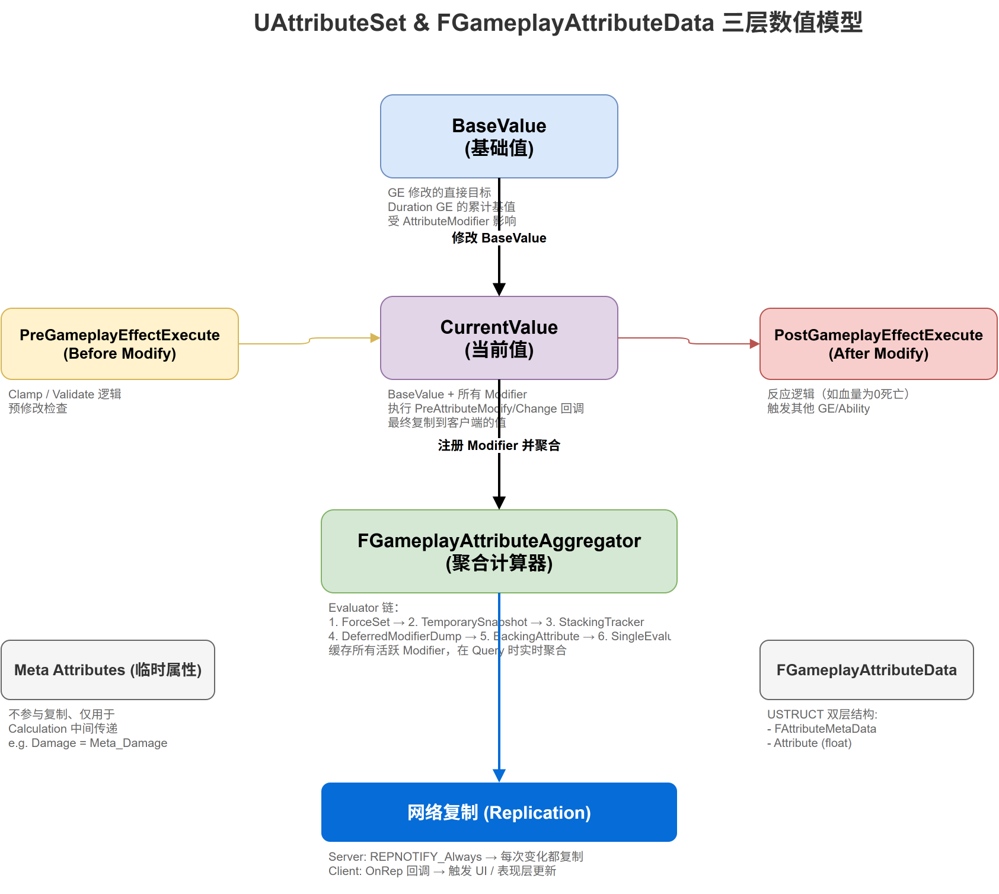

# 深入浅出UE5 GAS（二）：AttributeSet与Attributes —— 数值系统的基石

## 系列目录

1. [AbilitySystemComponent —— GAS的心脏](../01-ASC/01-ASC文章.md)
2. **（本文）AttributeSet —— 数值系统的基石**
3. [GameplayEffect（上）—— 从定义到应用](../03-GameplayEffect/03-GameplayEffect文章-上.md)
4. [GameplayEffect（下）—— Modifier、Stacking与Periodic](../03-GameplayEffect/03-GameplayEffect文章-下.md)
5. [ExecutionCalculation —— 自定义伤害公式](../04-ExecutionCalculation/04-ExecutionCalculation文章.md)
6. [GameplayAbility —— 技能的诞生与消亡](../05-GameplayAbility/05-GameplayAbility文章.md)
7. [AbilityTask —— 异步编程的艺术](../06-AbilityTask/06-AbilityTask文章.md)
8. [TargetData —— 索敌与数据传递](../07-TargetData/07-TargetData文章.md)
9. [GameplayCue —— 技能反馈的表现层](../08-GameplayCue/08-GameplayCue文章.md)
10. [网络同步 —— 复制、预测与回滚](../09-Network/09-Network文章.md)
11. [GE Components —— UE 5.3 模块化新范式](../10-GEComponents/10-GEComponents文章.md)
12. [实战全景 —— 调试、陷阱与工程化模式](../11-Practice/11-Practice文章.md)

> 📎 [补遗篇 —— FGameplayAbilitySpec 详解](../12-Others/12-Others文章.md)

---

## 写在前面

如果 ASC 是 GAS 的心脏，那 AttributeSet 就是它的血液。角色的血量、蓝量、攻击力、移速——所有这些数值都通过 AttributeSet 来承载和计算。

但 GAS 的属性系统远不止"一个 float 变量加个 Get/Set"那么简单。它引入了一个精巧的三层数值模型（Base/Current/Bonus）、一个高效的属性聚集器（Aggregator）、以及一套宏驱动的反射系统。这些设计的背后，是 Epic 工程师对大型多人游戏属性系统的深度思考。

这篇文章，我们就来拆解：GAS 的属性系统到底"高级"在哪里。

---

## 一、问题的提出：普通 float 变量的痛点

在写游戏逻辑时，我们经常会这样写：

```cpp
class AMyCharacter : public ACharacter
{
    float Health = 100.0f;
    float MaxHealth = 100.0f;
    float AttackPower = 10.0f;
    // ... 更多属性
};
```

看起来没什么问题。但当你遇到以下需求时，麻烦就来了：

1. **Buff/Debuff 叠加**：一个 "增加 20% 攻击力" 的 Buff 和一个 "增加 50 点攻击力" 的 Buff 同时生效，最终值怎么算？
2. **网络同步**：属性变化时，所有客户端都需要知道。你怎么保证同步的效率和正确性？
3. **属性依赖**：MaxHealth 变化时，Health 可能需要调整。谁来负责这个联动？
4. **多人同时修改**：多个 GE 同时修改一个属性时，修改顺序重要吗？
5. **Modifier 优先级**：先加后乘和先乘后加，结果不一样。你怎么控制计算顺序？

GAS 的 AttributeSet 正是为了系统性地解决这些问题而设计的。

---

## 二、FGameplayAttributeData —— 原子的数值单元

一切始于这个结构体：

```cpp
USTRUCT(BlueprintType)
struct GAMEPLAYABILITIES_API FGameplayAttributeData
{
    GENERATED_BODY()

public:
    FGameplayAttributeData() : BaseValue(0.f), CurrentValue(0.f) {}
    FGameplayAttributeData(float DefaultValue) : BaseValue(DefaultValue), CurrentValue(DefaultValue) {}

    /** Returns the current value, which includes temporary adjustments */
    float GetCurrentValue() const { return CurrentValue; }
    
    /** Modifies current value, normally only called by ability system or during initialization */
    void SetCurrentValue(float NewValue) { CurrentValue = NewValue; }
    
    /** Returns the base value which only includes permanent changes */
    float GetBaseValue() const { return BaseValue; }
    
    /** Modifies persistent base value, which is the value that persists after temporary adjustments */
    void SetBaseValue(float NewValue) { BaseValue = NewValue; }

protected:
    UPROPERTY(BlueprintReadOnly, Category = "Attribute")
    float BaseValue;

    UPROPERTY(BlueprintReadOnly, Category = "Attribute")
    float CurrentValue;
};
```

**关键洞察：BaseValue 和 CurrentValue 的双层模型**

这是 GAS 属性系统的第一个核心设计：

- **BaseValue**：属性的"永久"部分——由等级、装备等永久性来源决定
- **CurrentValue**：属性的"即时"部分——在 Base 的基础上，叠加上所有临时 Modifier

例如，一个角色的基础攻击力（BaseValue）是 100，装备了一个"攻击力+20%"的 Buff（Modifier），那么 CurrentValue 就是 120。当 Buff 失效时，CurrentValue 自动回到 100。

**但等等，这里的 CurrentValue 并不是 Aggregator 计算后的最终值！** 让我们来看看 Aggregator 系统。

---

## 三、属性聚集器（Aggregator）—— 三层数值模型

`FGameplayAttributeData` 本身只存储了两个值，但属性的"真实值"计算远比这复杂。GAS 引入了一个独立于 `FGameplayAttributeData` 的 Aggregator 层：



```
                         ┌──────────────────────┐
                         │   Aggregator 层       │
                         │  (不在AttributeSet中) │
                         │                      │
  GE Modifiers  ──────►  │   ModOp: Add/Mul/... │
                         │   ModChannels        │
                         │   Qualifiers (Tags)   │
                         │                      │
                         └──────────┬───────────┘
                                    │ 计算结果
                                    ▼
┌───────────────────────────────────────────────┐
│  FGameplayAttributeData (在AttributeSet中)     │
│                                               │
│  BaseValue ◄── 复制来源（永久修改通过Base）  │
│  CurrentValue ◄── 最终计算结果写入此处        │
└───────────────────────────────────────────────┘
```

实际上，属性的计算链路是这样的：

```
1. 取 BaseValue（来自 FGameplayAttributeData）
2. 遍历 Aggregator 中所有符合条件的 Modifier
3. 按 ModOp 和 Channel 顺序计算
4. 将结果写入 CurrentValue
```

这意味着，当你调用 `ASC->GetNumericAttribute(HealthAttribute)` 时，返回的不是 `BaseValue`，而是 `CurrentValue`——即经过所有活跃 Modifier 计算后的最终值。

### 3.1 EGameplayModOp —— 五种修改操作

```cpp
namespace EGameplayModOp
{
    enum Type
    {   
        Additive,               // +N    (加法)
        Multiplicitive,         // *N    (乘法)
        Division,               // /N    (除法)
        Override,               // =N    (覆盖)
        Max                     // 无效标记
    };
}
```

和别的游戏框架相比，GAS 多了 `Division` 和 `Override` 两种操作。`Override` 尤其强大——它可以**直接覆盖**属性的最终值，无论之前有多少 Modifier 叠加。

### 3.2 EGameplayModEvaluationChannel —— 计算通道

在 Aggregator 中，Modifier 被分配到不同的 Channel：

```cpp
UENUM()
enum class EGameplayModEvaluationChannel : uint8
{   
    Channel0 UMETA(Hidden),
    Channel1 UMETA(Hidden),
    Channel2 UMETA(Hidden),
    Channel3 UMETA(Hidden),
    Channel4 UMETA(Hidden),
    Channel5 UMETA(Hidden),
    Channel6 UMETA(Hidden),
    Channel7 UMETA(Hidden),
    Channel8 UMETA(Hidden),
    Channel9 UMETA(Hidden),
    Channel_MAX UMETA(Hidden)
};
```

计算顺序是 **Channel0 到 Channel9**。默认情况下，GE 的 Modifier 使用 Channel0，这覆盖了绝大多数场景。Channel 机制主要用于**需要修改计算顺序**的特殊场景——比如某些 Modifier 需要在其他所有 Modifier 计算之前或之后生效。

---

## 四、UAttributeSet —— 属性的容器

```cpp
UCLASS(DefaultToInstanced, Blueprintable, MinimalAPI)
class UAttributeSet : public UObject
{
    GENERATED_BODY()

public:
    /** Returns the owning actor's ability system component */
    UAbilitySystemComponent* GetOwningAbilitySystemComponent() const;
    
    /** Returns the owning actor */
    AActor* GetOwningActor() const;

protected:
    /** Called just before a GameplayEffect is executed to modify the base value of an attribute */
    virtual void PreAttributeChange(const FGameplayAttribute& Attribute, float& NewValue);
    
    /** Called just before any modification to an attribute */
    virtual void PreAttributeBaseChange(const FGameplayAttribute& Attribute, float& NewValue) const;
    
    /** This is called just after any modification to an attribute (after PreAttributeBaseChange) */
    virtual void PostAttributeBaseChange(const FGameplayAttribute& Attribute, float OldValue, float NewValue) const;
    
    /** Called just after a GameplayEffect is executed to modify the base value */
    virtual void PostGameplayEffectExecute(const FGameplayEffectModCallbackData& Data);
    
    /** Called on server when we get a replicated attribute update */
    virtual void PreAttributeChange(const FGameplayAttribute& Attribute, float& NewValue);
};
```

### 4.1 PreAttributeChange vs PostGameplayEffectExecute

这是 GAS 属性系统中容易被混淆的两个回调：

- **PreAttributeChange**：在属性值**即将被修改**时调用。你可以在这里做**值钳制**（Clamping）。例如：确保 Health 不超过 MaxHealth，且不低于 0。

- **PostGameplayEffectExecute**：在 GE **执行完毕后**调用。这是做**属性联动**的最佳位置。例如：Health 变化后触发 UI 更新、检查角色是否死亡等。

```cpp
// 典型用法示例
void UMyAttributeSet::PreAttributeChange(const FGameplayAttribute& Attribute, float& NewValue)
{
    if (Attribute == GetHealthAttribute())
    {
        NewValue = FMath::Clamp(NewValue, 0.0f, GetMaxHealth());
    }
}

void UMyAttributeSet::PostGameplayEffectExecute(const FGameplayEffectModCallbackData& Data)
{
    if (Data.EvaluatedData.Attribute == GetHealthAttribute())
    {
        // 血量变化后，检查是否死亡
        if (GetHealth() <= 0.0f)
        {
            // 触发死亡逻辑...
        }
    }
}
```

### 4.2 AttributeSet 与 ASC 的关联

AttributeSet 是被 ASC "持有"的：

```cpp
// ASC 中存储所有 AttributeSet
UPROPERTY(Replicated)
TArray<TObjectPtr<UAttributeSet>> SpawnedAttributes;
```

每个 AttributeSet 通过内部指针回溯到 Owner ASC：

```cpp
// AttributeSet 内部
UAbilitySystemComponent* GetOwningAbilitySystemComponent() const;
```

这种双向引用的设计确保了：
1. ASC 可以遍历所有持有的属性
2. AttributeSet 可以快速访问 ASC 来触发复制和回调

---

## 五、FGameplayAttribute —— 轻量级的属性引用

在 GAS 中，你很少直接持有 `FGameplayAttributeData*` 的指针。取而代之的是 `FGameplayAttribute`：

```cpp
USTRUCT(BlueprintType)
struct GAMEPLAYABILITIES_API FGameplayAttribute
{
    GENERATED_USTRUCT_BODY()

    /** The FProperty for the attribute */
    UPROPERTY()
    FProperty* Attribute;
    
    /** The owner UClass of the attribute */
    UPROPERTY()
    TFieldPath<FProperty> AttributeOwner;  // 实际上是一个 FProperty 但保留了类型信息
};
```

本质上，`FGameplayAttribute` 就是一个**轻量级的 `FProperty` 包装**。它让你可以在不知道具体 AttributeSet 类型的情况下引用一个属性。这对于 GE 的 Modifier 配置至关重要——你可以在蓝图或 DataTable 中通过名字引用属性，而不需要硬编码类型。

```cpp
// 由宏自动生成
static FGameplayAttribute GetHealthAttribute()
{
    static FProperty* Prop = FindFieldChecked<FProperty>(
        UMyHealthSet::StaticClass(), GET_MEMBER_NAME_CHECKED(UMyHealthSet, Health));
    return FGameplayAttribute(Prop);
}
```

---

## 六、宏驱动的访问器系统

GAS 的属性系统大量使用宏来减少样板代码。以下是核心宏：

```cpp
// 最基础：单独声明 Get/Set/Init
#define GAMEPLAYATTRIBUTE_PROPERTY_GETTER(ClassName, PropertyName) \
    static FGameplayAttribute Get##PropertyName##Attribute() \
    { \
        static FProperty* Prop = FindFieldChecked<FProperty>(ClassName::StaticClass(), \
            GET_MEMBER_NAME_CHECKED(ClassName, PropertyName)); \
        return Prop; \
    }

#define GAMEPLAYATTRIBUTE_VALUE_GETTER(PropertyName) \
    inline float Get##PropertyName() const { return PropertyName.GetCurrentValue(); }

#define GAMEPLAYATTRIBUTE_VALUE_SETTER(PropertyName) \
    inline void Set##PropertyName(float NewVal) \
    { \
        UAbilitySystemComponent* AbilityComp = GetOwningAbilitySystemComponent(); \
        if (ensure(AbilityComp)) \
        { \
            AbilityComp->SetNumericAttributeBase(Get##PropertyName##Attribute(), NewVal); \
        }; \
    }

#define GAMEPLAYATTRIBUTE_VALUE_INITTER(PropertyName) \
    inline void Init##PropertyName(float NewVal) \
    { \
        PropertyName.SetBaseValue(NewVal); \
        PropertyName.SetCurrentValue(NewVal); \
    }
```

**关键观察：Setter 不是直接修改值，而是通过 ASC！**

```cpp
// Setter 的实际行为
inline void SetHealth(float NewVal)
{
    UAbilitySystemComponent* AbilityComp = GetOwningAbilitySystemComponent();
    AbilityComp->SetNumericAttributeBase(GetHealthAttribute(), NewVal);
}
```

这意味着**任何时候修改 BaseValue，都会通过 ASC 来执行**——这确保了：
1. 修改会触发网络复制
2. 修改会进入 Aggregator 的正确处理流程
3. 修改会触发相应的回调（PreAttributeChange 等）

### 6.1 ATTRIBUTE_ACCESSORS —— 一行搞定

如果你不想手动写每个宏，UE 提供了组合宏：

```cpp
#define ATTRIBUTE_ACCESSORS(ClassName, PropertyName) \
    GAMEPLAYATTRIBUTE_PROPERTY_GETTER(ClassName, PropertyName) \
    GAMEPLAYATTRIBUTE_VALUE_GETTER(PropertyName) \
    GAMEPLAYATTRIBUTE_VALUE_SETTER(PropertyName) \
    GAMEPLAYATTRIBUTE_VALUE_INITTER(PropertyName)
```

在你的 AttributeSet 中使用：

```cpp
UCLASS()
class UMyAttributeSet : public UAttributeSet
{
    GENERATED_BODY()
    
public:
    UPROPERTY(BlueprintReadOnly, ReplicatedUsing = OnRep_Health)
    FGameplayAttributeData Health;
    
    ATTRIBUTE_ACCESSORS(UMyAttributeSet, Health)  // 一行生成四个函数
    
    UPROPERTY(BlueprintReadOnly, ReplicatedUsing = OnRep_MaxHealth)
    FGameplayAttributeData MaxHealth;
    
    ATTRIBUTE_ACCESSORS(UMyAttributeSet, MaxHealth)
};
```

---

## 七、属性复制 —— GAMEPLAYATTRIBUTE_REPNOTIFY

这是 GAS 属性系统中被问得最多的一个问题：**属性是怎么在网上同步的？**

答案藏在这个宏里：

```cpp
#define GAMEPLAYATTRIBUTE_REPNOTIFY(ClassName, PropertyName, OldValue) \
{ \
    static FProperty* ThisProperty = FindFieldChecked<FProperty>(ClassName::StaticClass(), \
        GET_MEMBER_NAME_CHECKED(ClassName, PropertyName)); \
    GetOwningAbilitySystemComponentChecked()->SetBaseAttributeValueFromReplication( \
        FGameplayAttribute(ThisProperty), PropertyName, OldValue); \
}
```

在你的 `OnRep_Health` 中使用：

```cpp
void UMyAttributeSet::OnRep_Health(const FGameplayAttributeData& OldHealth)
{
    GAMEPLAYATTRIBUTE_REPNOTIFY(UMyAttributeSet, Health, OldHealth);
}
```

**复制流程（Server → Client）：**

```
Server修改BaseValue
  → ASC::SetNumericAttributeBase()
    → 触发Aggregator重新计算
    → 属性值变化 → bIsNetDirty = true
    → UE网络层检测到Dirty → 序列化Replicated属性
    → 发送到Client

Client接收复制数据
  → OnRep_Health(OldHealth) 被调用
  → GAMEPLAYATTRIBUTE_REPNOTIFY宏展开
  → ASC::SetBaseAttributeValueFromReplication() 被调用
    → 重新进入Aggregator（但标记为来自复制，避免再触发复制）
```

为什么不直接使用 `DOREPLIFETIME` 的默认行为？因为 **Attribute 的复制需要进入 Aggregator 系统**——客户端收到新 Base 值后，需要重新计算 Current 值，而不能直接覆盖。

---

### 八、PreAttributeChange 和 PostGameplayEffectExecute 的设计思考

这两个回调的职责分离体现了 GAS 的设计哲学：

| 回调 | 调用时机 | 典型用途 | 修改值 |
|------|---------|---------|--------|
| `PreAttributeChange` | 属性Base值即将改变前 | 值钳制（Clamping） | 可以（通过修改NewValue） |
| `PostGameplayEffectExecute` | GE执行后 | 属性联动、事件触发 | 可以（直接再次修改） |

**为什么需要分离？**

考虑这个场景：一个 GE 对 Health 造成 -30 伤害，同时角色有 MaxHealth = 100。

- 在 `PreAttributeChange` 中：如果 Health 当前是 10，-30 后是 -20，这里 Clamp 到 0
- 在 `PostGameplayEffectExecute` 中：Health 已经是 0，你可以检测到 Health == 0 并触发死亡

如果两者合并在一个回调中，就会出现"既要处理钳制，又要处理联动"的混乱——更糟糕的是，钳制操作可能让后续联动逻辑"看不到"原始的修改意图（从 10 到 -20 的变化被钳制掩盖了）。

---

## 九、总结与回顾

GAS 的属性系统由四个层次组成：

| 层次 | 核心类/结构 | 职责 |
|------|-----------|------|
| 数据存储层 | `FGameplayAttributeData` | 存储 Base + Current 两个值 |
| 计算引擎层 | `FAggregator` / `FGameplayEffectAggregator` | 管理 Modifier，执行 ModOp 计算 |
| 容器管理层 | `UAttributeSet` | 组织多个属性，提供生命周期回调 |
| 引用抽象层 | `FGameplayAttribute` | 轻量级 FProperty 包装，解耦类型 |

核心设计思想：

1. **双层数值 + Aggregator 分离**：Base 值稳定且可以复制，Current 值由 Aggregator 动态计算
2. **ASC 作为唯一写入点**：所有属性修改必须通过 ASC，确保复制和计算的一致性
3. **宏驱动的元编程**：通过宏自动生成 Get/Set/Init 方法，消除样板代码
4. **回调分离**：Pre 做钳制，Post 做联动——各司其职
5. **Channel + ModOp 的灵活组合**：支持复杂的 Modifier 计算顺序控制

**下一篇预告**：我们将深入分析 GameplayEffect——它如何通过 Definition（CDO）→ Spec（运行时副本）→ Modifier（计算过程）的三阶段流程实现对任意属性的修改。包括 Instant/Duration/Infinite 三种策略、Stacking 机制、以及 ExecutionCalculation 和 MMC 的差异。

---

*本系列文章基于 UE 5.8 源码分析，GameplayAbilities 插件路径：`Engine/Plugins/Runtime/GameplayAbilities`*
