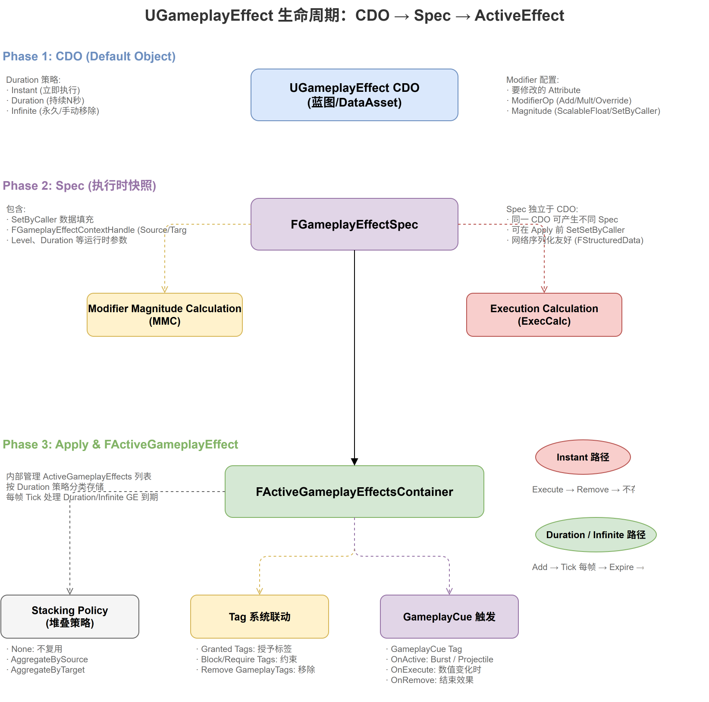

# 深入浅出UE5 GAS（三）：GameplayEffect（上）—— 从定义到应用

## 系列目录

1. [AbilitySystemComponent —— GAS的心脏](../01-ASC/01-ASC文章.md)
2. [AttributeSet —— 数值系统的基石](../02-AttributeSet/02-AttributeSet文章.md)
3. **（本文）GameplayEffect（上）—— 从定义到应用**
4. [GameplayEffect（下）—— Modifier、Stacking与Periodic](./03-GameplayEffect文章-下.md)
5. [ExecutionCalculation —— 自定义伤害公式](../04-ExecutionCalculation/04-ExecutionCalculation文章.md)
6. [GameplayAbility —— 技能的诞生与消亡](../05-GameplayAbility/05-GameplayAbility文章.md)
7. [AbilityTask —— 异步编程的艺术](../06-AbilityTask/06-AbilityTask文章.md)
8. [TargetData —— 索敌与数据传递](../07-TargetData/07-TargetData文章.md)
9. [GameplayCue —— 技能反馈的表现层](../08-GameplayCue/08-GameplayCue文章.md)
10. [网络同步 —— 复制、预测与回滚](../09-Network/09-Network文章.md)
11. [GE Components —— UE 5.3 模块化新范式](../10-GEComponents/10-GEComponents文章.md)
12. [实战全景 —— 调试、陷阱与工程化模式](../11-Practice/11-Practice文章.md)

> 📎 [附录 —— FGameplayAbilitySpec 详解](../12-Others/12-Others文章.md)

---

## 写在前面

如果说 ASC 是心脏、AttributeSet 是血液，那 GameplayEffect 就是**向血液中注入药物的注射器**。伤害、治疗、Buff、Debuff——所有这些对属性的修改，在 GAS 中都被统一抽象为"GameplayEffect（GE）"。

这个设计的精妙之处在于：**它把一切"对属性的修改"都视为同一种操作，只是参数不同。** 一个火球术的伤害、一个牧师的治疗、一瓶药水的回复，甚至一个装备提供的属性加成——本质上都是"对某个属性施加某种计算"。

本篇文章聚焦于 GE 的核心架构：类层次结构、三阶段生命周期、三种持续时间策略、效果上下文和应用全流程。下一篇将继续深入 Modifier 系统、数值计算、Stacking 和 Periodic Effects。

---

## 一、GE 的类层次结构总览

在深入细节之前，先建立一个全局认识：

```
UObject
├── UGameplayEffect (CDO层 —— 设计时配置)
│   ├── DurationPolicy
│   ├── Modifiers[]
│   ├── Executions[]
│   ├── Period / Stacking 配置
│   ├── GEComponents[] (UE 5.3+)
│   └── Tag 容器（Application/Ongoing/Removal）
│
├── FGameplayEffectSpec (Spec层 —— 运行时实例)
│   │   每个 GE 应用都由一个 Spec 携带独立的状态
│   ├── Def → 指向原始 UGameplayEffect CDO
│   ├── Level / Duration / Period (运行时解释 CDO 的结果)
│   ├── EffectContext (Instigator, Causer...)
│   └── CapturedAttributes / SetByCallerTagMagnitudes
│
└── FActiveGameplayEffect (Active层 —— 应用后的状态)
    │   继承自 FFastArraySerializerItem，支持增量网络复制
    ├── Spec (持有原始 Spec 副本)
    ├── StartServerWorldTime / EndWorldTime
    ├── StackCount
    ├── PredictionKey
    └── PeriodHandle (周期执行的定时器)
```

这三个层次分别对应着**设计时、应用时、运行中**三个时间维度。理解这个分层，是理解 GE 一切行为的起点。

---

## 二、CDO → Spec → Apply：GE 的三阶段生命周期

这是理解 GE 最关键的概念。GE 的生命周期分为三个阶段：



```
┌─────────────────┐       ┌──────────────────┐       ┌──────────────────────┐
│  UGameplayEffect │  ──►  │ FGameplayEffect  │  ──►  │  FActiveGameplay     │
│  (CDO / Data)    │       │ Spec             │       │  Effect (Applied)    │
│                  │       │ (Runtime Copy)   │       │                      │
│  - Modifiers[]   │       │ - Modifiers[]    │       │  - StartTime         │
│  - DurationPolicy│       │ - Level          │       │  - EndTime           │
│  - Stacking      │       │ - Context        │       │  - StackCount        │
│  - Tags          │       │ - CapturedAttr   │       │  - PeriodHandle      │
│                  │       │ - SetByCaller     │       │                      │
│  设计时定义       │       │  运行时实例化      │       │  应用后持续追踪       │
└─────────────────┘       └──────────────────┘       └──────────────────────┘
```

### 2.1 第一阶段：UGameplayEffect（CDO / Data Asset）

`UGameplayEffect` 是**数据定义**——它定义了修改什么属性、怎么修改、持续多久。它派生自 `UObject`，是设计者在编辑器中配置的 Data Asset。

```cpp:50:98:E:\EpicGames\UE_5.8\Engine\Plugins\Runtime\GameplayAbilities\Source\GameplayAbilities\Public\GameplayEffect.h
UCLASS(BlueprintType, MinimalAPI)
class UGameplayEffect : public UObject, public IGameplayTagAssetInterface
{
    GENERATED_UCLASS_BODY()

    /** Policy for the duration of this effect */
    UPROPERTY(EditDefaultsOnly, Category = Duration)
    EGameplayEffectDurationType DurationPolicy;

    /** How long this effect lasts (only for HasDuration / Infinite policies) */
    UPROPERTY(EditDefaultsOnly, Category = Duration)
    FGameplayEffectModifierMagnitude DurationMagnitude;

    /** Period on which this effect will execute (Periodic Effects) */
    UPROPERTY(EditDefaultsOnly, Category = Duration)
    FScalableFloat Period;

    /** Modifiers to apply */
    UPROPERTY(EditDefaultsOnly, Category = Modifiers)
    TArray<FGameplayModifierInfo> Modifiers;

    /** Execution to run when this effect is applied */
    UPROPERTY(EditDefaultsOnly, Category = Execution)
    TArray<FGameplayEffectExecutionDefinition> Executions;

    /** Tags this GE grants to the target */
    UPROPERTY(EditDefaultsOnly, Category = Tags)
    FInheritedTagContainer InheritableOwnedTagsContainer;

    /** Stacking rules for this effect */
    UPROPERTY(EditDefaultsOnly, Category = Stacking)
    FGameplayEffectStackingPolicy StackingPolicy;
};
```

**从 UE 5.3 开始**：Tag 相关的属性（`InheritableOwnedTagsContainer`、`ApplicationTagRequirements`、`OngoingTagRequirements`等）已迁移到独立的 GE Components 中（详见第 11 篇）。`UGameplayEffect` 本身变得更"纯粹"——只保留 Duration、Modifier、Execution、Stacking 等核心配置。

### 2.2 第二阶段：FGameplayEffectSpec（运行时副本）

`UGameplayEffect` 是**数据**，而 `FGameplayEffectSpec` 是**实例**。当你要应用一个 GE 时，你需要先从 CDO 创建一个 Spec：

```cpp
// 创建Spec的典型流程
FGameplayEffectContextHandle ContextHandle = ASC->MakeEffectContext();
FGameplayEffectSpecHandle SpecHandle = ASC->MakeOutgoingSpec(GE_Class, Level, ContextHandle);
// 然后可以通过SpecHandle修改一些运行时参数
```

`FGameplayEffectSpec` 的核心结构（定义在 `GameplayEffectTypes.h`）：

- **`Def`**：指向原始 `UGameplayEffect` CDO 的引用
- **`Level`**：效果等级（影响 `FScalableFloat` 的曲线查表）
- **`Duration`**：运行时计算的持续时间（从 CDO 的 `DurationMagnitude` 计算）
- **`Period`**：周期时间
- **`EffectContext`**：效果上下文（Instigator、Causer、HitResult 等）
- **`CapturedRelevantAttributes`**：在 Spec 创建时捕获的属性快照
- **`SetByCallerTagMagnitudes`**：运行时由调用方传入的数值
- **`ModifiedAttributes`**：从 CDO 的 Modifiers 数组拷贝/评估后的修改列表

**为什么需要一个 Spec？**

同一个 GE CDO 可能以不同等级、不同持续时间、不同 SetByCaller 参数被多次应用。Spec 为每个应用场景保存了独立的运行时状态。

### 2.3 第三阶段：FActiveGameplayEffect（已应用）

```cpp:157:191:E:\EpicGames\UE_5.8\Engine\Plugins\Runtime\GameplayAbilities\Source\GameplayAbilities\Public\ActiveGameplayEffect.h
USTRUCT(BlueprintType)
struct GAMEPLAYABILITIES_API FActiveGameplayEffect : public FFastArraySerializerItem
{
    GENERATED_USTRUCT_BODY()

    /** The spec this effect was created from */
    UPROPERTY()
    FGameplayEffectSpec Spec;

    /** Prediction key */
    UPROPERTY()
    FPredictionKey PredictionKey;

    /** Start server world time */
    float StartServerWorldTime;

    /** Total duration */
    float Duration;

    /** Ends at this world time */
    float EndWorldTime;

    /** Amount of stack counts */
    int32 StackCount;
};
```

这里有一个容易忽略的细节：`FActiveGameplayEffect` 继承自 `FFastArraySerializerItem`——这意味着它是 `FActiveGameplayEffectsContainer`（一个 `FFastArraySerializer`）数组中的元素。这种继承关系使得 GE 的数组复制支持高效的**增量同步**（只发送变化的元素），而非每次都全量发送。

---

## 三、三种持续时间策略

```cpp
UENUM()
enum class EGameplayEffectDurationType : uint8
{
    Instant,          // 立即生效，不持久化
    HasDuration,      // 有持续时间，到期自动移除
    Infinite          // 永续（直到被手动移除）
};
```

三种策略决定了 GE 应用后的行为差异：

### 3.1 Instant —— 立即生效

Instant GE 是最简单的：应用后立即执行 Modifier 或 ExecutionCalculation，然后不被加入 `FActiveGameplayEffectsContainer`（即被丢弃）。

它的关键行为：
- 通过 `ASC::ApplyGameplayEffectSpecToSelf` 时立即修改属性的 BaseValue
- 不会被加入 ActiveGEs 数组（不会被网络复制为"活跃GE"）
- 没有 Duration，没有 Stacking，没有 Periodic
- 客户端可以**预测** Instant GE 的效果（详见第 10 篇）
- ExecCalc **不**在客户端执行——客户端只能预测 Simple Modifier 的结果

### 3.2 HasDuration —— 有时限

Duration GE 在应用后进入 `FActiveGameplayEffectsContainer`，并根据 Duration 设置一个定时器。到期时，它会被自动移除——所有的 Aggregator Modifier 也随之消失。

**关键设计：Duration 可以被刷新。** 如果你对同一个目标再次应用一个"相同"的 Duration GE，Duration 可以重置（取决于 `EGameplayEffectStackingDurationPolicy` 配置）：
- `RefreshDuration`：重置为完整 Duration
- `NeverRefresh`：保持原到期时间，只增加 StackCount

### 3.3 Infinite —— 永续

Infinite GE 不会自动过期。它一直保持活跃，直到被显式调用 `RemoveActiveGameplayEffect()` 移除。典型场景：

- 装备提供的**永久属性加成**（如"装备该武器时 +10 攻击力"）
- 角色固有的**被动效果**（如"始终免疫火焰伤害"）
- 通过 GE 授予的**永久技能**（通过 `AbilitiesGameplayEffectComponent`，详见第 11 篇）

Infinite GE 仍然在 `ActiveGameplayEffectsContainer` 中，在网络复制上与 Duration GE 行为一致。

---

## 四、FGameplayEffectContext —— 效果的上下文

每个 GE 都有一个 `FGameplayEffectContextHandle`，它包装了 `FGameplayEffectContext`：

```cpp:512:541:E:\EpicGames\UE_5.8\Engine\Plugins\Runtime\GameplayAbilities\Source\GameplayAbilities\Public\GameplayEffectTypes.h
USTRUCT()
struct FGameplayEffectContext
{
    /** 谁是发动者（Instigator） */
    TWeakObjectPtr<AActor> Instigator;

    /** 谁是物理来源（EffectCauser）—— 如武器、投射物 */
    TWeakObjectPtr<AActor> EffectCauser;

    /** 来源对象（如 GE_Class 所属的蓝图） */
    TWeakObjectPtr<const UObject> SourceObject;

    /** 发动此效果的 Ability（CDO） */
    TWeakObjectPtr<const UGameplayAbility> Ability;

    /** 世界位置 */
    FVector WorldOrigin;

    /** 涉及的目标 Actors */
    TArray<TWeakObjectPtr<AActor>> Actors;

    /** 命中结果 */
    TUniquePtr<FHitResult> HitResult;

    /** 技能等级 */
    int32 AbilityLevel;
};
```

**Instigator 和 EffectCauser 的区别**是一个常见困惑：
- **Instigator**：发动效果的人（玩家本身）
- **EffectCauser**：效果的物理来源（如武器、投射物）

例如：玩家 A 用手雷炸伤玩家 B，Instigator 是 A，EffectCauser 是手雷。

**扩展点**：你可以通过 override `UAbilitySystemGlobals::AllocGameplayEffectContext()` 返回自定义的 `FGameplayEffectContext` 子类，添加自定义数据（如暴击标记、元素类型等）。这是项目级定制的核心入口之一。

---

## 五、GameplayEffect 的应用全流程

将整个 GE 应用流程串联起来：

```
1. 创建 Context
   ASC->MakeEffectContext()
   → 设置Instigator、EffectCauser等

2. 创建 Spec
   ASC->MakeOutgoingSpec(GE_Class, Level, Context)
   → 从CDO复制数据
   → 捕获属性快照（Capture Source Attributes）
   → 计算SetByCaller Magnitudes

3. 应用 Spec
   ASC->ApplyGameplayEffectSpecToTarget(Spec, Target)
   → 检查 GE Components 的 CanGameplayEffectApply()
   → 创建 FActiveGameplayEffect
   → 判断 Stacking 策略
      ├── None: 新增一个 FActiveGameplayEffect
      ├── AggregateBySource: 找到同来源的旧GE，增加StackCount
      └── AggregateByTarget: 找到同类型的旧GE，增加StackCount

4. 执行 Modifiers / Executions
   ┌─ Instant GE ─────────────────────────────────┐
   │ → 立即执行ExecutionCalculation或Modifier     │
   │ → 通过 ASC::ApplyModToAttribute 修改 BaseValue│
   │ → 触发属性变更回调                            │
   │ → GE 被丢弃（不进入Active数组）                │
   └──────────────────────────────────────────────┘
   
   ┌─ Duration/Infinite GE ───────────────────────┐
   │ → 将 FActiveGameplayEffect 加入 ActiveGEs      │
   │ → Modifier 进入 Attribute Aggregator           │
   │ → 设置 Duration 定时器 / Period 定时器          │
   │ → 触发 GameplayCue（如果有）                    │
   │ → 触发 Tag 变化事件                            │
   └──────────────────────────────────────────────┘

5. 移除 GE（Duration到期 或手动Remove）
   → 从 ActiveGEs 移除
   → 从 Aggregator 移除所有 Modifier
   → 重新计算属性值
   → 移除 GrantTags
   → 触发 Remove GameplayCue（如果有）
```

---

### 六、设计思考：GE 的统一抽象之美

回到最初的问题：**为什么 GAS 要把所有属性修改都统一为 GE？**

这体现了软件设计中的"统一抽象"原则：

1. **伤害 = GE**：Instant，Period=0，Modifier=Additive，Magnitude=负值
2. **治疗 = GE**：Instant，Period=0，Modifier=Additive，Magnitude=正值
3. **Buff = GE**：HasDuration，Period=0，Modifier=Additive/Multiplicitive
4. **DoT**：HasDuration，Period>0，Modifier=Additive（负值）
5. **装备加成 = GE**：Infinite，Modifier=Additive
6. **百分比伤害 = GE**：ExecutionCalculation 中计算

一切都回归到同一个数据结构和同一个应用流程，这意味着：
- 你可以在**同一套工具链**中调试所有效果
- **网络复制逻辑**只需要实现一次
- **UI 系统**只需要监听一种事件类型
- 新增一种效果类型**不需要修改核心代码**

---

## 七、上篇总结

本篇覆盖了 GameplayEffect 的核心架构：

| 概念 | 关键类/结构 | 核心作用 |
|------|-----------|---------|
| CDO 定义 | `UGameplayEffect` | 设计时数据配置 |
| 运行时实例 | `FGameplayEffectSpec` | 运行时状态副本 |
| 活跃追踪 | `FActiveGameplayEffect` | 应用后的生命周期管理 |
| Duration Policy | Instant / HasDuration / Infinite | 控制 GE 生命周期 |
| 效果上下文 | `FGameplayEffectContext` | 记录 Instigator/Causer 等 |

核心设计思想：
1. **CDO → Spec → ActiveEffect** 三阶段分离，每个阶段有不同的生命周期和用途
2. **统一的抽象**：伤害、治疗、Buff 都是 GE
3. `FActiveGameplayEffect` 继承 `FFastArraySerializerItem`，实现高效的增量网络同步

**下一篇预告**：如何配置 GE 的数值修改？Four Magnitude 来源各自适合什么场景？Stacking 的 `AggregateBySource` 和 `AggregateByTarget` 有什么区别？Periodic 效果如何实现 DoT/HoT？请继续阅读下篇。

---

*本系列文章基于 UE 5.8 源码分析。源码路径：`Engine/Plugins/Runtime/GameplayAbilities/Source/GameplayAbilities/`*
