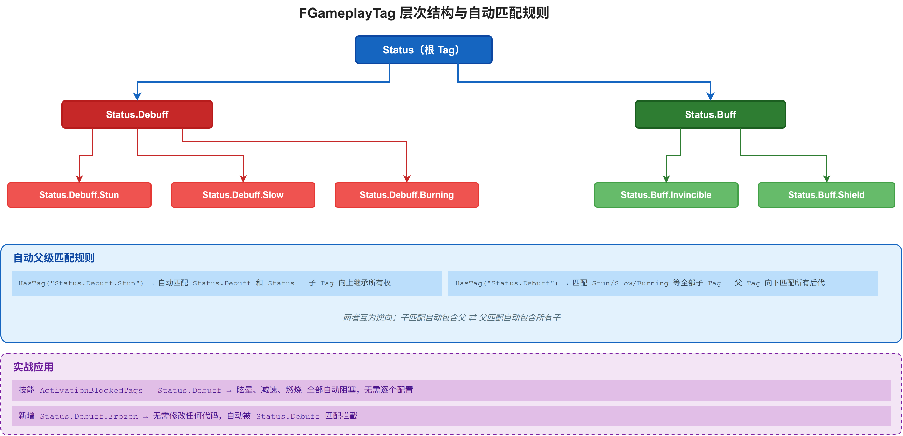
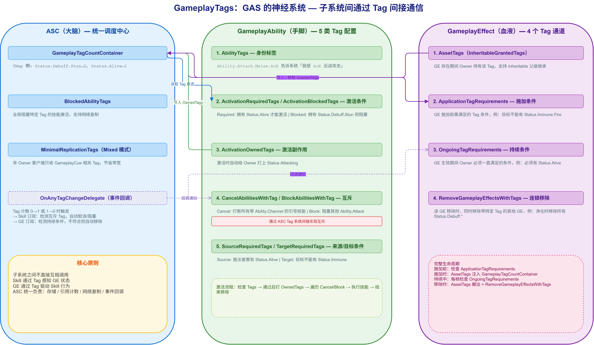

# 03 | GameplayTags：GAS 的通用语言

> **系列**: 《Inside GAS》— UE5 GameplayAbilitySystem 源码深度分析  
> **难度**: 🟢 入门 → 🔴 源码  
> **字数**: ~6200  
> **前置**: 02-ASC  
> **源码路径**: `Engine/Source/Runtime/GameplayTags/Classes/GameplayTagContainer.h`

---

> **系列导航**
> 
> | 阶段 | 篇章 | 内容 | 状态 |
> |------|------|------|------|
> | 🟢 基础 | 01 | GAS 总览与核心架构 | ✅ |
> | | 02 | ASC — 核心调度器 | ✅ |
> | | **03** | **GameplayTags — 通用语言** | ✅ |
> | | 04 | AttributeSet — 属性定义与复制 | 📝 |
> | 🔵 核心 | 05 | GameplayEffect — 效果与计算 (上) | 📝 |
> | | 06 | GameplayEffect — 效果与计算 (下) | 📝 |
> | | 07 | GameplayAbility — 技能激活与核心框架 (上) | 📝 |
> | | 08 | GameplayAbility — Task/输入/预测 (下) | 📝 |
> | | 09 | GameplayCue — 表现层触发机制 | 📝 |
> | 🔴 高级 | 10 | Prediction — 预测与回滚 | 📝 |
> | | 11 | GE Components — 组件化架构演进 | 📝 |
> | | 12 | Network & Serial — 网络序列化 | 📝 |
> | | 13 | Targeting — 瞄准系统 | 📝 |
> | | 14 | Debug & Optimization — 调试与优化 | 📝 |
> | | 15 | 终篇回顾 — 全景复习 | 📝 |

---

## 一、问题引入：技能状态冲突的困局

你正在做一个动作游戏。角色释放"旋风斩"时应该免疫控制，受到"眩晕"时应该打断当前技能，被挂上"燃烧"时伤害应翻倍——这些跨系统的状态判断，如果全都用 `if-else` 硬编码：

```cpp
// 反模式：用枚举和 bool 手动管理状态
if (CurrentState == EState::Stunned) return false;          // 眩晕不能攻击
if (bIsInvincible) return true;                              // 无敌不受伤害
if (ActiveBuffs.Contains(EBuff::Burning)) Damage *= 2.0f;   // 燃烧增伤
```

每新增一个状态，就要在所有相关系统里加判断分支。当状态之间还有叠加和互斥关系时，复杂度指数级增长。

GAS 的答案是：**所有状态都用 Tag 表达，所有子系统都通过 Tag 通信。** 技能不关心"是否眩晕"；它只关心自己身上有没有 `Status.Debuff.Stun` 这个 Tag。GE 不关心"哪些技能需要被打断"；它只负责给目标打上 Tag，由技能自己声明对哪些 Tag 敏感。

GameplayTags 作为"通用语言"的核心价值正在于此：**解耦状态的生产者和消费者。**

---

## 二、核心概念：FGameplayTag 的层次世界

### 2.1 FGameplayTag：命名的艺术

`FGameplayTag` 本质上是一个 `FName` 的包装，但它的命名规则赋予了它层次语义：

```
Status.Debuff.Stun        ← 眩晕
Status.Debuff.Stun.Boss   ← Boss 专属眩晕（只对 Boss 有效）
Status.Debuff.Slow         ← 减速
Status.Buff.Invincible     ← 无敌
Ability.Attack.Melee       ← 近战攻击技能
Ability.Attack.Ranged      ← 远程攻击技能
```

点号分隔的每一段代表一个层级。这意味着检查 `Status.Debuff.Stun` 时，它**自动匹配**父级 `Status.Debuff` 和 `Status`。



一个技能设置 `ActivationBlockedTags = Status.Debuff`，就能被所有 debuff（眩晕、减速、冰冻）同时阻塞，不需要逐一列举。新增 `Status.Debuff.Frozen` 也不需修改查询代码。

### 2.2 六大核心类型

GAS 的 Tag 系统建立在六个关键类型之上：

| 类型 | 定位 | 关键特征 |
|------|------|----------|
| **FGameplayTag** | 单个 Tag | 层次化名称，如 `Status.Debuff.Stun` |
| **FGameplayTagContainer** | Tag 集合 | 支持 `HasTag` / `HasAll` / `HasAny` 查询，父级自动展开 |
| **FGameplayTagQuery** | 逻辑查询 | 表达式树：`AnyTagsMatch` / `AllTagsMatch` / `NoTagsMatch` + 嵌套组合 |
| **FGameplayTagRequirements** | 需求/忽略（GAS 插件 `GameplayEffectTypes.h`，而非 Runtime/GameplayTags） | `RequireTags` + `IgnoreTags` 成对模式 |
| **FGameplayTagCountContainer** | 引用计数（GAS 插件 `GameplayEffectTypes.h`，而非 Runtime/GameplayTags） | 内部通过 `TMap<FGameplayTag, int32>` 引用计数管理，多来源释放不冲突（详见 §三.3） |
| **FGameplayTagNode** | 树节点 | 内部层次结构，管理父子关系 |

**FGameplayTag** 和 **FGameplayTagContainer** 是日常使用最多的两个类型。**FGameplayTagCountContainer** 是 ASC 内部的"状态账本"：它记录了每个 Tag 被多少个来源持有。这解决了"多个 GE 同时添加同一 Tag，一个 GE 过期后 Tag 不该消失"的问题。

### 2.3 FGameplayTagQuery：逻辑表达式

当简单的"有/没有"不够用时，`FGameplayTagQuery` 登场：

```cpp
// 查询：拥有 Status.Debuff 下的任一 Tag，且不拥有 Status.Immune
FGameplayTagQueryExpression RootExpr;
RootExpr.AllExprMatch()
    .AddExpr(FGameplayTagQueryExpression().AnyTagsMatch()
        .AddTag(FGameplayTag::RequestGameplayTag("Status.Debuff")))
    .AddExpr(FGameplayTagQueryExpression().NoTagsMatch()
        .AddTag(FGameplayTag::RequestGameplayTag("Status.Immune")));

FGameplayTagQuery Query = FGameplayTagQuery::BuildQuery(RootExpr, "DebuffCheck");
// 之后直接：Query.Matches(Container)
// 注：以上为伪代码示意。实际构建使用 FGameplayTagQueryExpression 树 +
// FGameplayTagQuery::BuildQuery(Expr, Name)。更推荐用 DataTable 在编辑器中导入
// Tag 并构造 Query（DefaultGameplayTags.ini → GameplayTagsManager），
// 运行时直接 FGameplayTag::RequestGameplayTag("Status.Debuff") 即可参与匹配
```

表达式类型共 8 种（`GameplayTagContainer.h` 中 `EGameplayTagQueryExprType` 枚举定义处，`GameplayTagContainer.h:690`）：

| 表达式类型 | 语义 |
|-----------|------|
| `AnyTagsMatch` | 匹配任一（含父级） |
| `AllTagsMatch` | 匹配全部（含父级） |
| `NoTagsMatch` | 全部不匹配（含父级） |
| `AnyTagsExactMatch` | 任一精确匹配 |
| `AllTagsExactMatch` | 全部精确匹配 |
| `AnyExprMatch` | 任一子表达式为真 |
| `AllExprMatch` | 全部子表达式为真 |
| `NoExprMatch` | 全部子表达式为假 |

内部实现为字节码序列化：Expression Tree 被编译为 Token Stream，运行时直接按字节码执行匹配，性能远超字符串解析。

---

## 三、源码分析：Tag 如何串起三件套

> 从本节起进入源码层。前两节建立的"六大类型"和"层次命名"概念是本节的地基，建议先回顾再继续。

如果说 ASC 是大脑，GA 是手脚，GE 是血液——那么 Tag 就是**神经系统**。三个子系统之间不直接调用对方的方法，而是通过 Tag 发布和订阅状态。



### 3.1 技能中的 Tag 配置

打开 `GameplayAbility.h`（`Category = Tags` 分组下的 UPROPERTY 成员），一个技能暴露了 5 类 Tag 字段：

```cpp
// GameplayAbility.h — Tag 相关成员变量（1~2）
// 1. 技能的"身份标签"——这个技能是什么类型的
UPROPERTY(EditDefaultsOnly, Category = Tags)
FGameplayTagContainer AbilityTags;

// 2. 激活条件——必须身上的 Tag 满足要求才能激活
UPROPERTY(EditDefaultsOnly, Category = Tags)
FGameplayTagContainer ActivationRequiredTags;   // 必须全部拥有

UPROPERTY(EditDefaultsOnly, Category = Tags)
FGameplayTagContainer ActivationBlockedTags;    // 拥有任一即阻塞
```

```cpp
// GameplayAbility.h — Tag 相关成员变量（3~5）
// 3. 激活后副作用——激活时自动给 Owner 打的 Tag
UPROPERTY(EditDefaultsOnly, Category = Tags)
FGameplayTagContainer ActivationOwnedTags;

// 4. 互斥关系——取消/阻塞其他技能
UPROPERTY(EditDefaultsOnly, Category = Tags)
FGameplayTagContainer CancelAbilitiesWithTag;   // 取消已激活的同 Tag 技能

UPROPERTY(EditDefaultsOnly, Category = Tags)
FGameplayTagContainer BlockAbilitiesWithTag;    // 阻塞即将激活的同 Tag 技能

// 5. 触发来源——来源/目标身上的 Tag 条件
UPROPERTY(EditDefaultsOnly, Category = Tags)
FGameplayTagRequirements SourceRequiredTags;    // 来源身上需要的条件

UPROPERTY(EditDefaultsOnly, Category = Tags)
FGameplayTagRequirements TargetRequiredTags;    // 目标身上需要的条件
```

**实际场景**：一个"旋风斩"技能可以这样配置：

| 字段 | 值 | 效果 |
|------|-----|------|
| `AbilityTags` | `Ability.Attack.Melee.AoE` | 表明自己是 AoE 近战 |
| `ActivationBlockedTags` | `Status.Debuff.Stun` | 眩晕时不能放 |
| `ActivationOwnedTags` | `Status.Attacking` | 激活时给自己打"攻击中" |
| `CancelAbilitiesWithTag` | `Ability.Channel` | 打断所有引导类技能（Cancel 作用于已激活技能） |
| `BlockAbilitiesWithTag` | `Ability.Attack` | 释放期间阻塞其他攻击（Block 作用于新激活请求） |

> **Cancel vs Block 的区别**：`CancelAbilitiesWithTag` 取消的是**已在激活中**的技能；`BlockAbilitiesWithTag` 阻塞的是**即将激活**的技能。两者看似相似，但操作时机和对象完全不同。

### 3.2 GE 的四个 Tag 通道

GameplayEffect 通过四个通道使用 Tag（通过独立的 Component 解耦，而非集中在 GE 基类中）：

```cpp
// 通道 1：授予 Tag（GE 施加后，目标持有该 Tag）
// TargetTagsGameplayEffectComponent.h — UTargetTagsGameplayEffectComponent
FInheritedTagContainer InheritableGrantedTagsContainer;   // 编辑器显示名 "Add Tags"

// 通道 2：施加条件（UTargetTagRequirementsGameplayEffectComponent）
// TargetTagRequirementsGameplayEffectComponent.h
FGameplayTagRequirements ApplicationTagRequirements;      // 施加时 pass/fail，不满足则施加失败

// 通道 3：持续条件（同一组件 UTargetTagRequirementsGameplayEffectComponent）
FGameplayTagRequirements OngoingTagRequirements;           // 施加后判定 "on/off"，不满足则 GE 暂停生效

// 通道 4：移除其他 GE（查询式匹配，而非简单 Tag 列表）
// RemoveOtherGameplayEffectComponent.h — URemoveOtherGameplayEffectComponent
TArray<FGameplayEffectQuery> RemoveGameplayEffectQueries; // 匹配 OwningTagQuery/EffectTagQuery 的 GE 被移除

// 补充：AssetTags 组件（UAssetTagsGameplayEffectComponent）持有的是 InheritableAssetTags，
// 表示"GE 资产自身拥有什么 Tag"，并不会授予目标——别和通道 1 混淆
```

### 3.3 GE Tag 生命周期：以"燃烧"为例

以"燃烧"GE 为例：它授予 `Status.Debuff.Burning`，要求目标必须有 `Status.Alive` 才能持续生效；目标死亡，或施加"水盾"（授予 `Status.Buff.WaterShield`）时被移除。对应源码（`Engine\Plugins\Runtime\GameplayAbilities\Source\GameplayAbilities`）分 4 个阶段：

**1. 施加前：`ApplicationTagRequirements` 检查（能否施加）**

目标尝试施加该 GE 时，`UAbilitySystemComponent::ApplyGameplayEffectSpecToSelf` 在正式加入活跃列表前先调用 `CanApply`——失败直接返回空 Handle：

```cpp
// AbilitySystemComponent.cpp:1046-1050
// check if the effect being applied actually succeeds
if (!Spec.Def->CanApply(ActiveGameplayEffects, Spec))
{
	return FActiveGameplayEffectHandle();
}
```

`UGameplayEffect::CanApply` 遍历所有 GEComponent，任一组件拒绝即整体失败（短路返回）。`ApplicationTagRequirements` 就在 `UTargetTagRequirementsGameplayEffectComponent::CanGameplayEffectApply` 中被检查：

```cpp
// GameplayEffect.cpp:958-970
bool UGameplayEffect::CanApply(const FActiveGameplayEffectsContainer& ActiveGEContainer, const FGameplayEffectSpec& GESpec) const
{
	for (const UGameplayEffectComponent* GEComponent : GEComponents)
	{
		if (GEComponent && !GEComponent->CanGameplayEffectApply(ActiveGEContainer, GESpec))
		{
			UE_VLOG_UELOG(ActiveGEContainer.Owner, LogGameplayEffects, Verbose, TEXT("%s could not apply. Blocked by %s"), *GetNameSafe(GESpec.Def), *GetNameSafe(GEComponent));
			return false;
		}
	}

	return true;
}
```

`RequirementsMet` 的判定规则来自结构体 `FGameplayTagRequirements` 的三个字段（`GameplayEffectTypes.h:1527-1537`）：

```cpp
// GameplayEffectTypes.h — struct FGameplayTagRequirements
FGameplayTagContainer RequireTags;  // 编辑器显示名 "Must Have Tags"：必须全部存在
FGameplayTagContainer IgnoreTags;   // 编辑器显示名 "Must Not Have Tags"：必须全部不存在
FGameplayTagQuery TagQuery;         // 编辑器显示名 "Query Must Match"：复杂查询（空则不限制）
```

判定实现（`GameplayEffectTypes.cpp:1165-1172`）：

```cpp
// GameplayEffectTypes.cpp:1165-1172
bool FGameplayTagRequirements::RequirementsMet(const FGameplayTagContainer& Container) const
{
	const bool bHasRequired = Container.HasAll(RequireTags);
	const bool bHasIgnored = Container.HasAny(IgnoreTags);
	const bool bMatchQuery = TagQuery.IsEmpty() || TagQuery.Matches(Container);

	return bHasRequired && !bHasIgnored && bMatchQuery;
}
```

> 燃烧 GE 配置 `IgnoreTags = Status.Immune.Fire`：目标免疫火焰时 `RequirementsMet` 返回 false → `CanApply` 返回 false → 施加被拒绝。
>
> **注**：在 UE 5.3 之前，`ApplicationTagRequirements` / `RemovalTagRequirements` 等字段直接挂在 `UGameplayEffect` 基类中；5.3 起它们被标记为 `UE_DEPRECATED(5.3, "...")`，引擎内部实际通过 `UTargetTagRequirementsGameplayEffectComponent` / `URemoveOtherGameplayEffectComponent` 等独立 Component 执行检查。本文展示的正是 5.3+ 的新架构。

**2. 施加时：授予 Tag（`CachedGrantedTags` → `UpdateTagMap` +1）**

施加通过后 GE 加入活跃列表，`UGameplayEffect::OnAddedToActiveContainer` 逐一通知各组件。TargetTagRequirements 组件在此注册"持续条件"用到的 Tag 回调，并做首次 Ongoing 检查（返回值决定初始是否 active）：

```cpp
// TargetTagRequirementsGameplayEffectComponent.cpp:90-108（节选）
for (const FGameplayTag& Tag : GameplayTagsToBind)
{
	FOnGameplayEffectTagCountChanged& OnTagEvent = ASC->RegisterGameplayTagEvent(Tag, EGameplayTagEventType::NewOrRemoved);
	FDelegateHandle Handle = OnTagEvent.AddUObject(this, &UTargetTagRequirementsGameplayEffectComponent::OnTagChanged, ActiveGEHandle);
	AllBoundEvents.Emplace(Tag, Handle);
}
...
FGameplayTagContainer TagContainer;
ASC->GetOwnedGameplayTags(TagContainer);

return OngoingTagRequirements.RequirementsMet(TagContainer);
```

真正把 Tag 写入目标 ASC 的是 `AddActiveGameplayEffectGrantedTagsAndModifiers`。它写入的 `GetGrantedTags()` 来自 GE 的 `CachedGrantedTags`——该缓存由 TargetTags 组件在加载时聚合（`ApplyTargetTagChanges` → `InheritableGrantedTagsContainer.ApplyTo(Owner->CachedGrantedTags)`）：

```cpp
// GameplayEffect.cpp:4676-4678
// Update our owner with the tags this GameplayEffect grants them
Owner->UpdateTagMap(Effect.Spec.Def->GetGrantedTags(), 1, ...);
Owner->UpdateTagMap(Effect.Spec.DynamicGrantedTags, 1, ...);
```

`UpdateTagMap` 最终在 `FGameplayTagCountContainer::UpdateTagCount` 中把 `Status.Debuff.Burning` 计数 +1 并广播 Tag 变化——目标从此"拥有"燃烧状态。

**3. 持续中：`OngoingTagRequirements`（on/off 开关）**

目标身上任何 Tag 变化都会触发 ASC 广播，已注册的 `OnTagChanged` 被调用。它重新评估 Ongoing 条件：不满足就抑制（inhibit）GE，满足则恢复。注意抑制 ≠ 移除——抑制只是让 GE 暂时"不干活"：

```cpp
// TargetTagRequirementsGameplayEffectComponent.cpp:137-149
const bool bRemovalRequirementsMet = HaveRemovalRequirementsBeenMet(OwnedTags, Owner->IsOwnerActorAuthoritative());
if (bRemovalRequirementsMet)
{
	// 先检查 Removal 条件：命中则直接移除整个 GE
	Owner->RemoveActiveGameplayEffect(ActiveGEHandle);
}
else
{
	// 否则按 Ongoing 条件决定 on/off
	constexpr bool bInvokeCuesIfStateChanged = true;
	const bool bOngoingRequirementsMet = OngoingTagRequirements.IsEmpty() || OngoingTagRequirements.RequirementsMet(OwnedTags);
	Owner->SetActiveGameplayEffectInhibit(MoveTemp(ActiveGEHandle), !bOngoingRequirementsMet, bInvokeCuesIfStateChanged);
}
```

`SetActiveGameplayEffectInhibit` 切换 `bIsInhibited`：抑制时把 GE 的 modifier 与授予 Tag 从账本中摘除（计数 -1），恢复时再加回——这就是"暂停生效"的实现。翻转标志位只是第一步，真正的"摘除/加回"动作在函数体内完成：

```cpp
// AbilitySystemComponent.cpp:371-389（节选）
if (ActiveGE->bIsInhibited != bInhibit)
{
	ActiveGE->bIsInhibited = bInhibit;
	...
	if (bInhibit)
	{
		// Remove our ActiveGameplayEffects modifiers with our Attribute Aggregators
		ActiveGameplayEffects.RemoveActiveGameplayEffectGrantedTagsAndModifiers(*ActiveGE, bInvokePredictedEffects);
	}
	else
	{
		ActiveGameplayEffects.AddActiveGameplayEffectGrantedTagsAndModifiers(*ActiveGE, bInvokePredictedEffects);
	}
	...
}
```

> 燃烧 GE 配 `OngoingTagRequirements.RequireTags = Status.Alive`：目标活着 → 持续燃烧；目标死亡（`Status.Alive` 计数归零触发广播）→ `OnTagChanged` → Removal 未命中、Ongoing 不满足 → 先被抑制，随后由死亡逻辑主动 `RemoveActiveGameplayEffect` 彻底移除。

**4. 移除时：RemoveOther 查询移除 + 自身 Tag 清理**

"水盾"GE 施加时触发 `URemoveOtherGameplayEffectComponent::OnGameplayEffectApplied`，用 `RemoveGameplayEffectQueries` 构造查询批量移除匹配的 GE（通过 `IgnoreHandles` 保证不误删自己）：

```cpp
// RemoveOtherGameplayEffectComponent.cpp:31-49（节选）
constexpr int32 RemoveAllStacks = -1;
for (const FGameplayEffectQuery& RemoveQuery : RemoveGameplayEffectQueries)
{
	if (!RemoveQuery.IsEmpty())
	{
		if (ActiveGEHandles.IsEmpty())
		{
			// Faster path: No copy needed
			ActiveGEContainer.RemoveActiveEffects(RemoveQuery, RemoveAllStacks);
		}
		else
		{
			FGameplayEffectQuery MutableRemoveQuery = RemoveQuery;
			MutableRemoveQuery.IgnoreHandles = MoveTemp(ActiveGEHandles);
			ActiveGEContainer.RemoveActiveEffects(MutableRemoveQuery, RemoveAllStacks);
		}
	}
}
```

`FGameplayEffectQuery` 按 Tag 匹配的关键字段是 `OwningTagQuery`（匹配 GE 授予的 Tag）与 `EffectTagQuery`（匹配 GE 自有的 Tag）。燃烧 GE 被水盾移除（或自然到期）时，`RemoveActiveGameplayEffectGrantedTagsAndModifiers` 把授予的 Tag 计数 -1，归 0 时广播"Tag 消失"：

```cpp
// GameplayEffect.cpp:4984-4986
// Update gameplaytag count and broadcast delegate if we are at 0
Owner->UpdateTagMap(Effect.Spec.Def->GetGrantedTags(), -1, ...);
Owner->UpdateTagMap(Effect.Spec.DynamicGrantedTags, -1, ...);
```

> 至此目标身上的 `Status.Debuff.Burning` 归零消失，燃烧 GE 的完整 Tag 生命周期结束。四步与四个通道的对应关系：**1. 施加前 = 通道 3（Application）→ 2. 施加时 = 通道 1（Granted）→ 3. 持续中 = 通道 2（Ongoing）→ 4. 移除时 = 通道 4（RemoveOther）**。

#### 思考：为什么 GE 的 Tag 配置要拆成多个 Component？

一个 GE 涉及 4 个独立的 Tag 维度——授予、持续条件、施加条件、移除连锁。如果全部塞进 `UGameplayEffect` 基类，那么一个只有简单数值修改的 GE 也要背负这 4 套 Tag 逻辑的内存开销。拆成独立 Component 后，你按需组合：一个纯伤害 GE 只需要 `TargetTagsGameplayEffectComponent`（授予 Tag）和 `TargetTagRequirementsGameplayEffectComponent`（施加/持续条件），不需要 `RemoveOtherGameplayEffectComponent`。这种 Component 化设计让每个 GE 只为它真正用到的功能付费。

### 3.4 ASC 中的 Tag 调度

ASC 内部维护了两个核心 Tag 容器（`AbilitySystemComponent.h` 中 `GameplayTagCountContainer` 成员定义处）：

```cpp
// 1. Tag 账本——引用计数容器，记录"谁"持有"什么 Tag"
FGameplayTagCountContainer GameplayTagCountContainer;

// 2. 阻塞白名单——用于屏蔽特定 Tag 的技能激活（含服务器复制）
FGameplayTagContainer BlockedAbilityTags;
```

**`FGameplayTagCountContainer` 的内部结构**（`GameplayEffectTypes.h` 中 `FGameplayTagCountContainer` 类定义处）：

```cpp
class FGameplayTagCountContainer
{
    // 核心数据：Tag → 引用计数
    TMap<FGameplayTag, int32> GameplayTagCountMap;

    // 显式 Tag 集合（计数 > 0 的 Tag，含展开的父级）
    FGameplayTagContainer ExplicitTags;

    // Tag 变化回调
    FOnGameplayEffectTagCountChanged OnAnyTagChangeDelegate;
};
```

引用计数的关键行为：

- 两个 GE 都授予 `Status.Debuff.Burning` → `GameplayTagCountMap["Status.Debuff.Burning"] = 2`
- 一个 GE 过期 → 计数降为 1，Tag 依然存在
- 两个都过期 → 计数降为 0，Tag 从 `ExplicitTags` 中移除，触发 `OnAnyTagChangeDelegate`

这解决了多 GE 场景下的经典竞态问题：**只有所有来源都释放了 Tag，Tag 才真正消失。**

> **设计细节：为什么显式维护 `ExplicitTags`？** 每次 `HasTag` 查询如果都要递归展开父子关系，开销不可忽视。引擎在 Tag 计数变化时预计算展开结果到 `ExplicitTags`，让每次查询直接做集合成员判断，用少量内存换取 O(1) 的查询性能。

---

## 四、设计思考：为什么是 Tag 而不是枚举

### 4.1 层次化 vs 扁平枚举

用传统枚举管理状态：

```cpp
enum class ECharacterState { Stunned, Slowed, Burning, Invincible, Attacking, Channeling, ... };
```

问题一：每增加一个状态就要修改枚举定义，所有使用方都要重新编译。问题二：无法表达"所有 debuff 类型"，你需要逐个枚举值检查。

Tag 的层次化解决了这个问题。`Status.Debuff` 自动匹配所有子 Tag，新增 `Status.Debuff.Frozen` 不需要修改任何查询代码。

### 4.2 引用计数 vs 布尔标记

用 `bool` 数组或 `TSet<FGameplayTag>` 管理状态的问题是：当来源 A 和来源 B 都设置了同一个状态，来源 A 释放后，你无法知道状态是否还应该存在。`TSet<FActiveGameplayEffectHandle>` 也曾被考虑——为每个 Tag 维护来源 Handle 集合——但被否决：引用计数只需一个 int32，查询与网络复制开销极小；Handle Set 每次查询要遍历比对，网络同步还要传输 Handle 列表。

`FGameplayTagCountContainer` 的 `TMap<FGameplayTag, int32>` 恰好解决这个难题：每个 Tag 不是一个"是非问题"，而是一个"有几个人说它是"的问题。

### 4.3 网络复制策略

Tag 的网络复制也分为两档（`AbilitySystemComponent.h` 中 `MinimalReplicationTags` 成员定义处）：

```cpp
// Full 模式：完整 GameplayTagCountContainer 复制
// Minimal 模式：只复制 MinimalReplicationTags（用于 Mixed 模式的其他客户端）
FGameplayTagCountContainer MinimalReplicationTags;
```

在 `Mixed` 复制模式下，非 Owner 客户端只收到 `MinimalReplicationTags`。这个容器不是自动收集的——ASC 在 GameplayCue 相关流程中显式 `AddTag` 填入需要轻量复制的 Tag（通常用于驱动视觉表现），其余完整 Tag 状态只发给 Owner，节省带宽。

### 4.4 跨引擎对比

对比 Unity：Unity 没有内置的 Tag 层次系统。开发者通常用 `enum` + `HashSet<string>` 或第三方插件（如 Odin 的 State Machine）来模拟。这些方案的问题是：状态查询与状态修改分散在不同脚本中，调试时无法在一个地方看到"当前谁持有哪些 Tag"。

对比 Godot：Godot 的 `StringName`（类似 UE 的 `FName`）提供了高效的字符串比较，但没有内置层次 Tag 系统和引用计数。要实现 GAS 级别的 Tag 互操作，需要额外搭建层次匹配、引用计数和表达式查询等基础设施。

UE 的 GameplayTags 虽然看起来只是一个"命名字符串的包装"，但它的层次匹配、引用计数、表达式查询、网络复制这四项能力叠加后，构成了一个完整的运行时状态通信协议。

### 4.5 代价与边界

GameplayTags 不是免费的，这里坦诚列出它的代价：

- **Tag 膨胀（Tag Explosion）**：层级命名天然鼓励细分，项目后期容易积累上千个 Tag，审查和文档维护成本随数量上升。
- **调试成本**：状态被拆散成无数个 Tag，要定位"某个状态为什么存在"，得逆向追踪每一个 +1 的来源，可读性不如枚举直观。
- **不适用场景**：纯数值、连续量（血量、等级、冷却进度）用 Tag 表达是灾难——它们该交给 AttributeSet；仅在一个系统内部生效的私有状态，也不必上升到全局 Tag。

> 所以正确的姿势不是"全部用 Tag"，而是分工：**跨系统通信用 Tag，数值归 AttributeSet，单系统内部状态用枚举。**

---

## 五、总结

回到开头的问题：技能状态冲突的困局怎么解？回顾整条链路——技能声明自己对哪些 Tag 敏感（`ActivationBlockedTags`），GE 负责授予/移除 Tag，ASC 统一调度 Tag 的引用计数与变化广播。新增一个"冰冻"状态，只需定义 `Status.Debuff.Frozen` 并让 GE 授予它，所有声明了对 `Status.Debuff` 敏感的技能自动被阻塞——**零代码修改，纯数据驱动**。这便是层次化 Tag 系统相比枚举方案的根本优势。

GameplayTags 是 GAS 的神经系统：

- **FGameplayTag** 利用层次命名（`Status.Debuff.Stun`），实现了自动的父级匹配——新增子 Tag 不需要修改查询代码
- **FGameplayTagContainer** + **FGameplayTagQuery** 提供了从简单集合到复杂表达式树的多级查询能力
- **FGameplayTagCountContainer** 通过引用计数解决了多来源同名 Tag 的竞态问题——只有所有 GE 都过期，Tag 才消失
- **技能 5 类 Tag 字段**（身份/条件/副作用/互斥/来源）和 **GE 4 个 Tag 通道**（授予/持续/施加/移除）通过 ASC 统一调度，实现了子系统间的解耦通信
- 网络复制通过 `MinimalReplicationTags` 分层——Owner 看全家，旁观者只看表现

一句话：**写逻辑时不问"现在是眩晕状态吗"，而是问"身上有 `Status.Debuff.Stun` 这个 Tag 吗"。** 从主动查询到被动响应，从硬编码枚举到层次化 Tag，这便是 GAS 事件驱动（发布-订阅）模型的核心转变。

但也别忘了 §4.5 中的警戒线：Tag 不是银弹。跨系统通信用它，数值归 AttributeSet，单系统内部状态用枚举——把对的工具放在对的场景里，才是理解 GAS 设计哲学的最终答案。

---

**上一篇**：[02 | ASC — 核心调度器](../02-ASC/02-ASC文章.md)

**下一篇**：[04 | AttributeSet — 属性定义、回调链与网络复制](../04-AttributeSet/04-AttributeSet文章.md) — 看属性如何定义与复制、修改回调如何触发，以及 AttributeSet 如何与 ASC 协作支撑数值驱动。

---

*本文基于 UE 5.8 源码分析。系列文章会继续按模块拆解，从基础到高级，从 API 到设计哲学。*
