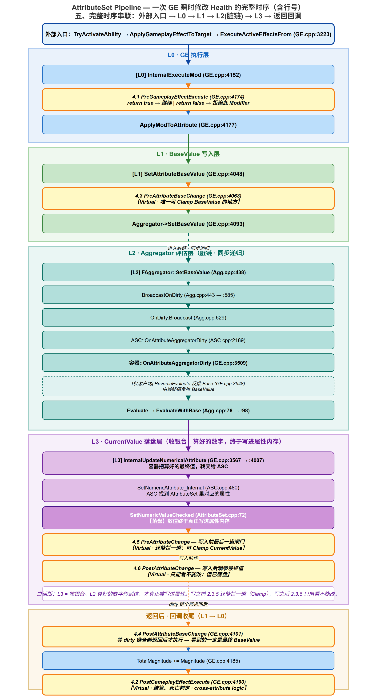
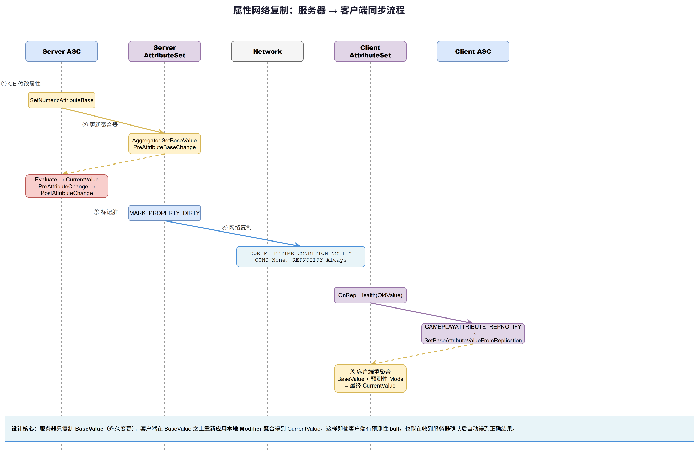

# 04 | AttributeSet：属性定义、回调链与网络复制

> **系列**: 《Inside GAS》— UE5 GameplayAbilitySystem 源码深度分析  
> **难度**: 🟢 入门 → 🔴 源码  
> **字数**: ~5000  
> **前置**: 03-GameplayTags  
> **源码路径**: `Engine/Plugins/Runtime/GameplayAbilities/Source/GameplayAbilities/Public/AttributeSet.h`

---

> **系列导航**
> 
> | 阶段 | 篇章 | 内容 | 状态 |
> |------|------|------|------|
> | 🟢 基础 | 01 | GAS 总览与核心架构 | ✅ |
> | | 02 | ASC — 核心调度器 | ✅ |
> | | 03 | GameplayTags — 通用语言 | ✅ |
> | | **04** | **AttributeSet — 属性定义与复制** | ✅ |
> | 🔵 核心 | 05 | GameplayEffect — 效果与计算 (上) | 📝 |
> | | 06 | GameplayEffect — 效果与计算 (下) | 📝 |
> | | 07 | GameplayAbility — 技能激活与核心框架 (上) | 📝 |
> | | 08 | GameplayAbility — Task/输入/预测 (下) | 📝 |
> | | 09 | GameplayCue — 表现层触发机制 | 📝 |
> | 🔴 高级 | 10 | Prediction — 预测与回滚 | 📝 |
> | | 11 | GE Components — 组件化架构演进 | 📝 |
> | | 12 | Network & Serial — 网络序列化 | 📝 |
> | | 13 | Targeting — 瞄准系统 | 📝 |
> | | 14 | Debug & Optimization — 调试与优化 | 📝 |
> | | 15 | 终篇回顾 — 全景复习 | 📝 |

---

## 一、问题引入：为什么不能直接 `float Health = 100`？

写 RPG 游戏的第一反应，一定是：**属性不就是个 float 吗？** 生命值、魔法值、攻击力、移动速度——定义几个 `float` 变量不就行了。

但当你真正开始做战斗系统时，三个问题会立刻教你做人：

- **多来源叠加与过期**：一个「+10 攻击力」的 Buff 和「攻击力 ×1.2」的 Buff 同时生效，最后该是多少？其中一个过期了，值应该怎么退回去？
- **约束写在哪**：生命值不能超过 MaxHealth，也不能低于 0。这个限制是放在 GE 里、放在 AttributeSet 里、还是放在 UI 层？三个地方都能写，但只有一个是正确的。
- **变更了怎么通知**：生命值变了，血条要更新、UI 要飘字、网络要同步给客户端、AI 的行为树要根据血量切换策略——你打算在每个修改点手动调所有通知吗？

这三个问题分别对应属性系统的**存储模型**、**合法性约束**和**变更广播**。靠几个 float + 几行 if 不可能解决。**你需要一整套属性管理系统，而不是几个 float。**

这正是 `UAttributeSet`（AttributeSet）存在的理由。它同时承担三件事：**属性定义**、**变更回调**、**网络复制**。

读完本文你会掌握：
- 如何用 `FGameplayAttributeData` 和宏体系定义自己的属性
- GE 修改属性值的完整调用链（从入口到回调）
- 六个虚函数回调分别在什么时机触发，各自适合做什么
- 属性网络复制的原理和客户端预测的正确性保证

---

## 二、FGameplayAttributeData：BaseValue 与 CurrentValue 的分离

`FGameplayAttributeData` 不是普通 float。它把一个属性拆成了**两个独立的值**：

| 字段 | 含义 | 修改方 |
|------|------|--------|
| `BaseValue` | 永久底值（permanent changes） | GE execution、SetNumericAttributeBase |
| `CurrentValue` | 最终生效值（含临时 buff） | Aggregator 聚合计算后写入 |

对应的源码定义（`AttributeSet.h` 中 `FGameplayAttributeData` 结构体）：

```
UPROPERTY(BlueprintReadOnly, Category = "Attribute")
float BaseValue;

UPROPERTY(BlueprintReadOnly, Category = "Attribute")
float CurrentValue;
```

**为什么需要两个值？** 举个例子就清楚了：

你吃了「永久 +20 攻击力」的药剂和一个「临时 +10%、持续 5 秒」的 Buff。结束时 Buff 过期，攻击力应该从 `(100+20)×1.1 = 132` 退回到 `100+20 = 120`。引擎需要知道哪个是永久变化（BaseValue=120），哪个是临时修正（Modifier 提供的 ×1.1）。

**BaseValue 是你真正"拥有"的属性值，CurrentValue 是所有修正聚合后的最终生效值。** 引擎保证每次 BaseValue 变更后，自动重新聚合所有 Modifier，算出最新的 CurrentValue。

## 三、FGameplayAttribute：属性的「身份证」

如果你只有 `FGameplayAttributeData` 的数据，怎么从外部访问它？C++ 的成员指针没法安全地跨类传递。GAS 的方案是 `FGameplayAttribute`——一个**用 UE 反射系统定位属性的描述符**。

核心是它保存了一个 `FProperty*` 指针（`AttributeSet.h` 中 `FGameplayAttribute` 结构体）：

```
TFieldPath<FProperty> Attribute;   // 指向属性在 UAttributeSet 子类中的 FProperty
UStruct* AttributeOwner;           // 属性的拥有者 UStruct
FString AttributeName;             // 属性名（缓存）
```

有了 `FProperty*`，`FGameplayAttribute` 可以做两件关键的事：

**写入**（`AttributeSet.cpp:72` 中 `FGameplayAttribute::SetNumericValueChecked`，简化示意，完整版见 L3：CurrentValue 落盘层）：
```
void FGameplayAttribute::SetNumericValueChecked(float& NewValue, UAttributeSet* Dest) const
{
    // 分支A：原生 float 属性，直接写 FProperty
    if (FNumericProperty* NumericProperty = CastField<FNumericProperty>(Attribute.Get()))
    {
        void* ValuePtr = NumericProperty->ContainerPtrToValuePtr<void>(Dest);
        NumericProperty->SetFloatingPointPropertyValue(ValuePtr, NewValue);
    }
    // 分支B：FGameplayAttributeData 属性，写 CurrentValue（推荐）
    else if (IsGameplayAttributeDataProperty(Attribute.Get()))
    {
        FStructProperty* StructProperty = CastField<FStructProperty>(Attribute.Get());
        FGameplayAttributeData* DataPtr = StructProperty->ContainerPtrToValuePtr<FGameplayAttributeData>(Dest);
        DataPtr->SetCurrentValue(NewValue);
    }
}
```

**读取**（`AttributeSet.cpp:119-139` 中 `FGameplayAttribute::GetNumericValue`）：
```
float FGameplayAttribute::GetNumericValue(const UAttributeSet* Src) const
{
    // 分支A：原生 float 属性，直接读 FProperty
    const FNumericProperty* const NumericProperty = CastField<FNumericProperty>(Attribute.Get());
    if (NumericProperty)
    {
        const void* ValuePtr = NumericProperty->ContainerPtrToValuePtr<void>(Src);
        return NumericProperty->GetFloatingPointPropertyValue(ValuePtr);
    }
    // 分支B：FGameplayAttributeData 属性，读 CurrentValue（推荐）
    else if (IsGameplayAttributeDataProperty(Attribute.Get()))
    {
        const FStructProperty* StructProperty = CastField<FStructProperty>(Attribute.Get());
        const FGameplayAttributeData* DataPtr = StructProperty->ContainerPtrToValuePtr<FGameplayAttributeData>(Src);
        if (ensure(DataPtr))
        {
            return DataPtr->GetCurrentValue();
        }
    }

    return 0.f;   // 空属性或非法属性统一返回 0
}
```

关键认知：**`FGameplayAttribute` 不存储数据，它是一把「万能钥匙」——给定任意 `UAttributeSet` 实例，它能定位到某个属性的内存位置并读写它。**

这样一来，GE、ASC、UI 绑定都不需要知道具体的 AttributeSet 子类，只要持有 `FGameplayAttribute` 就能操作属性。它是 GAS 各模块间解耦的关键桥梁。

## 四、回调全景：六个虚函数的总览与调用链

`UAttributeSet` 是所有属性集的基类。你定义 `UMyAttributeSet` 时，继承的就是它。除了作为数据的容器外，它通过六个虚函数暴露了完整的回调链（`AttributeSet.h` 中 `UAttributeSet` 类定义）。

六个回调不是随便凑的六个数——它们天然分成三组，按触发范围从窄到宽组织结构

| 回调 | 触发时机 | 可修改值 | 典型用途 |
|------|----------|----------|----------|
| `PreGameplayEffectExecute` | GE 执行修改 base value **之前** | 可拒绝（return false） | 免疫检查 |
| `PostGameplayEffectExecute` | GE 执行修改 base value **之后** | 不可 | 伤害结算、死亡判定、受击 UI |
| `PreAttributeBaseChange` | BaseValue 即将被写入 | `NewValue` 可 Clamp | 约束 BaseValue 范围 |
| `PostAttributeBaseChange` | BaseValue 已被写入 | 不可 | 派生属性重算（如护甲→减伤率） |
| `PreAttributeChange` | CurrentValue 即将被写入 | `NewValue` 可 Clamp | 「Health = Clamp(NewHealth, 0, MaxHealth)」 |
| `PostAttributeChange` | CurrentValue 已被写入 | 不可 | 血条 UI 刷新 |

六函数不是各自为战——它们挂载在三条引擎调用链上，触发范围从窄到宽：

| 回调对 | 调用点（UE 5.8 实测） | 宿主函数 | 触发范围 |
|--------|----------------------|----------|----------|
| `Pre/PostGameplayEffectExecute` | GameplayEffect.cpp:4112 / :4128 | `FActiveGameplayEffectsContainer::InternalExecuteMod` | 最窄：仅瞬时 GE 的 execute |
| `Pre/PostAttributeBaseChange` | GameplayEffect.cpp:4001 / :4039 | `FActiveGameplayEffectsContainer::SetAttributeBaseValue` | 中：BaseValue 被修改时 |
| `Pre/PostAttributeChange` | AttributeSet.cpp:82-84 / :95-97 | `FGameplayAttribute::SetNumericValueChecked` | 最广：任何 CurrentValue 写入 |

它们还会**嵌套触发**：一次瞬时伤害 GE 的完整路径是 `InternalExecuteMod` → `ApplyModToAttribute` → `SetAttributeBaseValue`（触发 BaseChange 回调）；属性若有聚合器，dirty 链继续走 `InternalUpdateNumericalAttribute` → `SetNumericAttribute_Internal`（AbilitySystemComponent.cpp:476）→ `SetNumericValueChecked`（再触发 Change 回调）。所以一套 Execute 会按「Execute → BaseChange → Change」次序连打三组回调——写回调时别重复处理同一件事。

> **代码块图例**：本节代码块分两类——**【源码】** 为引擎原文摘录（附 `文件:行号`）；**【示例】** 为参考/演示代码，来源见各代码块说明（如 LyraStarterGame 官方项目或教学示意），**非引擎源码**，请勿照抄。

### 4.1 PreGameplayEffectExecute —— 唯一能"否决"的关卡

官方注释（AttributeSet.h:196-200）："Called just before modifying the value of an attribute... Return true to continue, or false to throw out the modification." 并特别注明**只对 execute 触发**："It is not called during an application of a GameplayEffect, such as a 5 second +10 movement speed buff"——持续 buff 的 modifier 应用不走这里。

六个回调里只有它返回 `bool`。先看调用点的引擎原文——**【源码】**（`GameplayEffect.cpp:4112-4129`，已删减非关键行）：

```cpp
if (AttributeSet->PreGameplayEffectExecute(ExecuteData))   // return false 则整个修改被丢弃
{
    float OldValueOfProperty = Owner->GetNumericAttribute(ModEvalData.Attribute);
    ApplyModToAttribute(ModEvalData.Attribute, ModEvalData.ModifierOp, ModEvalData.Magnitude, &ExecuteData);
    // ...
    AttributeSet->PostGameplayEffectExecute(ExecuteData);  // 值已写入，进入结算
}
```

`Data` 类型是 `FGameplayEffectModCallbackData`（GameplayEffectTypes.h 内联结构体），三个成员：`EffectSpec`（来源 GE）、`EvaluatedData`（含 `Attribute`/`Magnitude`，可改）、`Target`（目标 ASC）。免疫、减伤、吸收盾都在这一层做。下面这段是**【示例】**（`LyraHealthSet.cpp:68-106` 精简，删去了 GodMode 作弊检查等非核心分支；引擎默认实现只有 `return true` 一行）：

```cpp
bool ULyraHealthSet::PreGameplayEffectExecute(FGameplayEffectModCallbackData& Data)
{
    // 1. 免疫检查：目标带 Gameplay.DamageImmunity 时，直接把伤害归零并否决
    //    （tag 定义在 LyraGameplayTags.h：UE_DEFINE_GAMEPLAY_TAG(..., "Gameplay.DamageImmunity")）
    if (Data.EvaluatedData.Attribute == GetDamageAttribute()
        && Data.EvaluatedData.Magnitude > 0.0f
        && Data.Target.HasMatchingGameplayTag(LyraGameplayTags::Get().Gameplay_DamageImmunity))
    {
        Data.EvaluatedData.Magnitude = 0.0f;
        return false;
    }

    // 2. 快照修改前的值：PostGameplayEffectExecute 用它计算"真实变化量"
    HealthBeforeAttributeChange = GetHealth();
    MaxHealthBeforeAttributeChange = GetMaxHealth();

    return true;
}
```

注意一个细节：这里否决的不是"改属性"，而是"改 `EvaluatedData.Magnitude`"——配合 Damage 元属性（见 PostGameplayEffectExecute），把免疫语义从"拦截扣血"解耦成了"源头把伤害改成 0"。

### 4.2 PostGameplayEffectExecute —— 结算中心

官方注释（AttributeSet.h:202-206）："Called just after a GameplayEffect is executed to modify the base value of an attribute. **No more changes can be made.**" —— 值已写死，只读不改。

典型用途：实际扣血结算（计算值 - 护甲）、死亡判定、受击飘字、血条刷新。Lyra 在这一层做的是"**元属性转换**"（`LyraHealthSet.cpp:108-183` 精简）：把临时属性（`Damage`/`Healing`）换算成真实属性（`Health`），**用完即清零**，再广播事件：

```cpp
void ULyraHealthSet::PostGameplayEffectExecute(const FGameplayEffectModCallbackData& Data)
{
    // Damage 是"需求值"，Health 才是"落点值"——这就是元属性转换
    if (Data.EvaluatedData.Attribute == GetDamageAttribute())
    {
        SetHealth(FMath::Clamp(GetHealth() - GetDamage(), 0.0f, GetMaxHealth()));
        SetDamage(0.0f);                        // 用后即焚：防止重复结算
        OnHealthChanged.Broadcast(GetHealth());
    }
    else if (Data.EvaluatedData.Attribute == GetHealingAttribute())
    {
        SetHealth(FMath::Clamp(GetHealth() + GetHealing(), 0.0f, GetMaxHealth()));
        SetHealing(0.0f);
        OnHealthChanged.Broadcast(GetHealth());
    }
}
```

这里 `SetHealth` 走 `SetNumericAttributeBase` 重新触发 Base/Current 回调，所以 Clamp 其实会被 PreAttributeBaseChange / PreAttributeChange 再兜一遍——`Post` 层只负责"业务换算"，**数值合法性的兜底永远留给 Pre 层**。

### 4.3 PreAttributeBaseChange —— BaseValue 的 Clamp 关卡

走 `SetAttributeBaseValue`（本工程 `GameplayEffect.cpp:4048-4102`，UE 5.8 为 `:3986-4040`），且是 `const` 成员函数。官方注释（AttributeSet.h:225-231）两条硬性要求：1. 要约束 BaseValue 就在这 Clamp，与 `PreAttributeChange` 形成"base 和 final 双保险"；2. **不要在这触发游戏事件**——"This function should NOT invoke gameplay related events or callbacks"，那些留给 `PreAttributeChange`。

先看调用点的引擎原文——**【源码】**（`GameplayEffect.cpp:4048-4102`，已删减非关键行）：

```cpp
void FActiveGameplayEffectsContainer::SetAttributeBaseValue(FGameplayAttribute Attribute, float NewBaseValue)
{
    // 1. 校验 Owner 与 AttributeSet 合法（不合法直接 return）
    // ...

    // 2. PreAttributeBaseChange 回调：写入前，NewBaseValue 可在此被 Clamp
    float OldBaseValue = 0.0f;
    Set->PreAttributeBaseChange(Attribute, NewBaseValue);

    // 3. 写入（见正文：先落 BaseValue，再刷 CurrentValue）
    // ...

    // 4. PostAttributeBaseChange 回调：写入后
    Set->PostAttributeBaseChange(Attribute, OldBaseValue, GetAttributeBaseValue(Attribute));
}
```

拆开看就四步，一句话一步：

- **校验**：拿不到 `Owner` 或 `AttributeSet`，直接走人（return），什么都不写。
- **`PreAttributeBaseChange` 回调**：写入前先问属性集——这里 Clamp 了，写入的就是钳制后的值。
- **写入**：先把 BaseValue 记到 `FGameplayAttributeData`（这步只记账，不触发回调），再刷 CurrentValue——有聚合器走聚合器（dirty 链自动刷新），没有就直写；两条路最后都进 `SetNumericValueChecked`（`PreAttributeChange` 的入口）。
- **`PostAttributeBaseChange` 回调**：写完了通知属性集，拿到旧值和新值。

一句话总结：**`PreAttributeBaseChange` 管"要写的值合不合法"，`PostAttributeBaseChange` 管"写完了告诉你"**；并且无论走哪条路，之后都会触发 `PreAttributeChange`——CurrentValue 这道 Clamp 兜底不会漏。

Lyra 的写法（`LyraHealthSet.cpp:185-190`）：函数体只有一行——把规则抽进公共的 `ClampAttribute`（:221-233），让 Base 层与 Current 层**共用同一套约束**，避免两处规则漂移：

```cpp
void ULyraHealthSet::PreAttributeBaseChange(const FGameplayAttribute& Attribute, float& NewValue) const
{
    Super::PreAttributeBaseChange(Attribute, NewValue);
    ClampAttribute(Attribute, NewValue);   // 与 PreAttributeChange 共用一个规则函数
}

// ClampAttribute（LyraHealthSet.cpp:221-233）
void ULyraHealthSet::ClampAttribute(const FGameplayAttribute& Attribute, float& NewValue) const
{
    if (Attribute == GetHealthAttribute())
    {
        NewValue = FMath::Clamp(NewValue, 0.0f, GetMaxHealth());   // 血量：上下限都管
    }
    else if (Attribute == GetMaxHealthAttribute())
    {
        NewValue = FMath::Max(NewValue, 1.0f);                     // 上限血量：只保下限
    }
}
```

注意 `MaxHealth` 只保下限、不设上限——上限不该由属性自身约束（否则"加血上限"玩法会失效），这正是"**Base 层不硬约束上限，只把好源头下限**"的思路。

### 4.4 PostAttributeBaseChange —— BaseValue 已定

`SetAttributeBaseValue` 末尾调用（GameplayEffect.cpp:4039），同样 `const`，带 `OldValue/NewValue`。典型用途：派生属性重算（护甲 → 减伤率）。一个易错点：**没有聚合器的属性**（`SetAttributeBaseValue` 会退化为直接写 CurrentValue）也照样触发 BaseChange 回调——别假设它只在"有聚合器"时发生。

Lyra 也**未覆写**这个回调（头文件只声明了除 PostAttributeBaseChange 外的五个回调）——它没有需要基于 BaseValue 重算的派生属性，Clamp 约束在 PreAttributeBaseChange 已经完成，这个回调就空着了。

### 4.5 PreAttributeChange —— 最常用的 Clamp 关卡

与 PreAttributeBaseChange / PostAttributeBaseChange 不同，PreAttributeChange / PostAttributeChange 的调用点**不在 `SetAttributeBaseValue` 函数体内**，而在它写入动作的下游——`FGameplayAttribute::SetNumericValueChecked`（`AttributeSet.cpp:72-117`）。这个函数是"任何 CurrentValue 写入"的最终收敛点。核心逻辑如下——**【源码】**（`AttributeSet.cpp:72-99`，仅保留核心写入部分，其余以注释说明）：

```cpp
void FGameplayAttribute::SetNumericValueChecked(float& NewValue, UAttributeSet* Dest) const
{
	// check(Dest) 与反射定位属性已省略：属性分两路——裸 float（FNumericProperty）
	// 或 FGameplayAttributeData 包装，两路分支结构完全同构。核心就四行：

	OldValue = /* 属性当前值 */;
	Dest->PreAttributeChange(*this, NewValue);                          // PreAttributeChange：写入前，NewValue 可变引用可 Clamp
	NumericProperty->SetFloatingPointPropertyValue(ValuePtr, NewValue); // 真正的写入动作
	Dest->PostAttributeChange(*this, OldValue, NewValue);               // PostAttributeChange：写入后

	// 分支二（FGameplayAttributeData）结构同构，唯一差异：
	// PostAttributeChange 的 NewValue 是写入后重读的 GetCurrentValue()（见 PostAttributeChange 细节）
}
```

拆开看就四步，PreAttributeChange / PostAttributeChange 一前一后"包住"写入：

- **读旧值**：反射定位到属性内存，先读 `OldValue`——裸 float 分支直接读内存，Data 分支读 `GetCurrentValue()`。
- **`PreAttributeChange`**：写入前回调，`NewValue` 是可变引用——在这里 Clamp，改的就是即将落盘的值。
- **写入**：`SetFloatingPointPropertyValue` / `SetCurrentValue` 真正落盘。
- **`PostAttributeChange`**：写入后回调，拿到 `OldValue` 与最终落地值。

那么它和 PreAttributeBaseChange 的 `SetAttributeBaseValue` 是什么关系？`SetAttributeBaseValue` 函数体内部**并不直接调** PreAttributeChange / PostAttributeChange，而是靠"写入动作"间接触发。汇总查证过的全部调用点，所有路径最终都汇进 `SetNumericValueChecked`：

- **GE 修改路径**：`SetAttributeBaseValue`（GameplayEffect.cpp:4048）→ `InternalUpdateNumericalAttribute`（:4007）→ `SetNumericAttribute_Internal`（AbilitySystemComponent.cpp:480）→ `SetNumericValueChecked`（:72）
- **聚合器 dirty 路径**：`FAggregator::OnDirty` → `OnAttributeAggregatorDirty`（GameplayEffect.cpp:3509，末尾 :3567 刷新数值）→ `InternalUpdateNumericalAttribute` → 同上
- **复制回滚路径**：客户端收到 BaseValue 先回滚旧值再写新值（GameplayEffect.cpp:3824，保证 PostAttributeChange 的 `OldValue` 正确）→ `SetNumericAttribute_Internal` → 同上

所以"任何写 CurrentValue 的路径都过 `SetNumericValueChecked`"字面成立——瞬时 GE、持续效果、叠层变化、效果移除、`SetNumericAttribute` 直写，全部触发 PreAttributeChange / PostAttributeChange。这也正是官方注释（AttributeSet.h:214-220）把职责边界划得这么死的原因：

> "This function is meant to enforce things like `Health = Clamp(Health, 0, MaxHealth)` and NOT things like 'trigger this extra thing if damage is applied'."

——正因为触发最频繁、上下文最少（只有 `Attribute + NewValue`），它只配做"无条件约束"，带业务上下文的事一律留给 PreGameplayEffectExecute / PostGameplayEffectExecute。与 PreAttributeBaseChange 的分工对比：

| | PreAttributeBaseChange | PreAttributeChange |
|---|---|---|
| 调用点 | `SetAttributeBaseValue` 函数体**内部** | `SetNumericValueChecked`（写入**下游**） |
| 触发面 | 仅改 BaseValue 时 | 任何 CurrentValue 写入 |
| 捕获值 | 源头值 | 最终值（含聚合器汇总结果） |
| 典型用途 | 约束"属性自身的合法范围" | 约束"最终显示值" |

Lyra 的写法（`LyraHealthSet.cpp:192-197`）——函数体与 PreAttributeBaseChange **一字不差**：两层共用同一个 `ClampAttribute`，保证"源头"和"最终值"的约束永远一致。实现细节不再重复，见 PreAttributeBaseChange 中的 `ClampAttribute` 定义。

### 4.6 PostAttributeChange —— 只读观察者

与 PreAttributeChange 同住一个调用点（AttributeSet.cpp:84/97），只是站在写入动作的另一侧。一个容易忽略的源码细节：**`NewValue` 不是调用方传进来的那个值**，而是写入后 `DataPtr->GetCurrentValue()` 重读一遍的落地值——因为 `FGameplayAttributeData::SetCurrentValue` 可能被子类覆写，最终落盘的值未必等于你传进去的，做对账要以落地值为准。

GE modifier 聚合、`SetNumericAttribute`、初始值设置全都会路过它，**血条绑定刷这条最省心**——任何合法修改都不会漏。但注意它和 PreAttributeChange 一样只有 `Attribute + OldValue/NewValue`，没有 GE 上下文，所以只适合做"无条件的连带修正"，需要来源信息的判断请放回 PreGameplayEffectExecute / PostGameplayEffectExecute。

Lyra 在这里做的是"**属性间的连带修正**"（`LyraHealthSet.cpp:199-219` 精简）：当前 Health 超过缩小后的 MaxHealth 时，用 `Override` 修正一次；顺带维护死亡标记复位：

```cpp
void ULyraHealthSet::PostAttributeChange(const FGameplayAttribute& Attribute, float OldValue, float NewValue)
{
    Super::PostAttributeChange(Attribute, OldValue, NewValue);

    if (Attribute == GetMaxHealthAttribute())
    {
        // 上限被压低时，当前血量不能超过新上限——用 Override 覆盖一次
        if (GetHealth() > NewValue)
        {
            GetOwningAbilitySystemComponent()->ApplyModToAttribute(
                GetHealthAttribute(), EGameplayModOp::Override, NewValue);
        }
    }

    if (bOutOfHealth && (GetHealth() > 0.0f))
    {
        bOutOfHealth = false;   // 复活复位
    }
}
```

> 总结：**Pre 层负责"改得对"（Clamp/免疫/减伤），Post 层负责"看得见"（结算/UI/派生）。** 越靠后的回调触发范围越大，但上下文越少——`PreGameplayEffectExecute` 手里有完整 GE 信息，`PreAttributeChange` 只有 `Attribute + NewValue`。所以"需要上下文的判断"放前，"无条件约束"放后，职责才不会重叠。

## 五、ATTRIBUTE_ACCESSORS 宏体系

每次为属性手动写 getter/setter/replication 很繁琐。引擎提供了宏一键生成（`AttributeSet.h` 中宏定义区域）。

**ATTRIBUTE_ACCESSORS_BASIC**——生成四个基础函数：

```
#define ATTRIBUTE_ACCESSORS_BASIC(ClassName, PropertyName)
    // 生成：
    //   static FGameplayAttribute GetHealthAttribute();   // 返回反射属性描述符
    //   float GetHealth() const;                          // 读 CurrentValue
    //   void SetHealth(float);                            // 写 BaseValue（走 ASC）
    //   void InitHealth(float);                           // 同时写 BaseValue 和 CurrentValue（初始化用）
```

四项展开的关键代码（已从源码验证）：

```
// Setter 的核心——它调用的是 ASC::SetNumericAttributeBase，不是直接写值
#define GAMEPLAYATTRIBUTE_VALUE_SETTER(PropertyName) 
    inline void Set##PropertyName(float NewVal)
    {
        AbilityComp->SetNumericAttributeBase(Get##PropertyName##Attribute(), NewVal);
    }

// Initter——直接写值，不走 ASC，不触发回调，仅用于初始化
#define GAMEPLAYATTRIBUTE_VALUE_INITTER(PropertyName)
    inline void Init##PropertyName(float NewVal)
    {
        PropertyName.SetBaseValue(NewVal);
        PropertyName.SetCurrentValue(NewVal);
    }
```

**GAMEPLAYATTRIBUTE_REPNOTIFY**——用于 OnRep 网络回调（见网络复制）：

```
#define GAMEPLAYATTRIBUTE_REPNOTIFY(ClassName, PropertyName, OldValue)
{
    GetOwningAbilitySystemComponentChecked()
        ->SetBaseAttributeValueFromReplication(FGameplayAttribute(ThisProperty), PropertyName, OldValue);
}
```

你的 AttributeSet 头部一般长这样：

```
UPROPERTY(BlueprintReadOnly, ReplicatedUsing = OnRep_Health, Category = "Attributes")
FGameplayAttributeData Health;
ATTRIBUTE_ACCESSORS_BASIC(UMyAttributeSet, Health);
```

一个属性定义 + 一行宏，四件套齐了。

## 六、完整示例：LyraHealthSet —— 四属性 + 元属性模式

在前面逐一拆解了六个回调之后，现在把它们拼回一个完整的 AttributeSet。下面以 Lyra 的 `LyraHealthSet` 为例，展示真实项目怎么把宏体系、回调链和元属性设计组合在一起（**【示例】**，`LyraHealthSet` 精简）：

```
// ---- 头文件：四属性。Damage/Healing 是"元属性"，结算后即清零，不长期存在 ----
UPROPERTY(BlueprintReadOnly, ReplicatedUsing=OnRep_Health, Category="Lyra|Health")
FGameplayAttributeData Health;
ATTRIBUTE_ACCESSORS(ULyraHealthSet, Health);

UPROPERTY(BlueprintReadOnly, ReplicatedUsing=OnRep_MaxHealth, Category="Lyra|Health")
FGameplayAttributeData MaxHealth;
ATTRIBUTE_ACCESSORS(ULyraHealthSet, MaxHealth);

UPROPERTY(BlueprintReadOnly, Category="Lyra|Health")
FGameplayAttributeData Healing;                 // 元属性：+ 输入量
ATTRIBUTE_ACCESSORS(ULyraHealthSet, Healing);

UPROPERTY(BlueprintReadOnly, Category="Lyra|Health")
FGameplayAttributeData Damage;                  // 元属性：- 输入量
ATTRIBUTE_ACCESSORS(ULyraHealthSet, Damage);

// ---- .cpp：两个最常用钩子 ----
void ULyraHealthSet::PreAttributeChange(const FGameplayAttribute& Attribute, float& NewValue)
{
    // Clamp 是 PreAttributeChange 的唯一职责
    Super::PreAttributeChange(Attribute, NewValue);
    ClampAttribute(Attribute, NewValue);        // 规则见 PreAttributeBaseChange
}

void ULyraHealthSet::PostGameplayEffectExecute(const FGameplayEffectModCallbackData& Data)
{
    if (Data.EvaluatedData.Attribute == GetDamageAttribute())
    {
        SetHealth(FMath::Clamp(GetHealth() - GetDamage(), 0.0f, GetMaxHealth()));
        SetDamage(0.0f);                        // 元属性用后即焚
        if (GetHealth() <= 0.0f)
        {
            bOutOfHealth = true;                // 死亡判定（配合 PostAttributeChange 复活复位）
        }
    }
    else if (Data.EvaluatedData.Attribute == GetHealingAttribute())
    {
        SetHealth(FMath::Clamp(GetHealth() + GetHealing(), 0.0f, GetMaxHealth()));
        SetHealing(0.0f);
    }
}
```

设计要点：GE 从不直接改 `Health`，而是"向 `Damage` 写入数值 → `PostGameplayEffectExecute` 把它换算成 `Health` 的扣减"。这样**所有外部接口统一走元属性**，`Health` 的唯一写入者就是 AttributeSet 自己，配合 PreAttributeBaseChange / PreAttributeChange 的 Clamp 兜底，数据流清晰可控。

现在六个回调和宏都已就位，接下来从引擎源码层面追踪这条链路。

---

## 七、源码分析：一条完整的数据通路

现在把概念连起来，跟踪一次属性修改的完整生命周期。



### 7.1 全景：一条链，四层管

一次 GE 执行，数值修改要穿越四层。**每一层只干一件事**：

| 层 | 职责 | 关键函数 | 回调 |
|----|------|----------|------|
| **L0** GE 执行层 | 谁能改属性、改了之后干什么 | `ExecuteActiveEffectsFrom` → `InternalExecuteMod` | PreGameplayEffectExecute / PostGameplayEffectExecute |
| **L1** BaseValue 写入层 | 把 Mod 算到 BaseValue 上 | `ApplyModToAttribute` → `SetAttributeBaseValue` | PreAttributeBaseChange / PostAttributeBaseChange |
| **L2** Aggregator 评估层 | Base + 所有 Modifier → 最终值 | `SetBaseValue` → dirty 链 → `EvaluateWithBase` | 无（纯数值） |
| **L3** CurrentValue 落盘层 | 最终值写进属性内存 | `InternalUpdateNumericalAttribute` → `SetNumericValueChecked` | PreAttributeChange / PostAttributeChange |

核心结论先行：**BaseValue 和 CurrentValue 是两套存储**。GE 修改的是 BaseValue（L1→L2），聚合器把 BaseValue + 所有 Modifier 算成最终值，再通过 `SetNumericValueChecked` 写进属性内存（L3）。六个回调散落在四层里，各管一段。

> **什么是 Aggregator**：`FAggregator` 是每个属性上的"变速箱"——它接收 BaseValue 和该属性上所有 Modifier（来自持续 GE、叠层 GE、周期性 GE……），通过 `EvaluateWithBase` 算出最终 CurrentValue。它内部维护一个 Modifier 列表，任何 Modifier 变化（新增、过期、叠层变化）都会触发 dirty 标记和重新评估。之所以叫"聚合器"，就是因为它把多个来源的修改"聚合"成单一数值。

### 7.2 L0：GE 执行层 —— 谁能改属性、改了之后干什么

**入口 `ExecuteActiveEffectsFrom`**（`GameplayEffect.cpp:3223`）：GE 施加到目标后，从这里开始。它遍历 GE Spec 里的所有 Modifier，逐个评估、逐个执行：

```cpp
// GameplayEffect.cpp:3271-3272（关键两行）
FGameplayModifierEvaluatedData EvalData(ModDef.Attribute, ModDef.ModifierOp, SpecToUse.GetModifierMagnitude(ModIdx));
ModifierSuccessfullyExecuted |= InternalExecuteMod(SpecToUse, EvalData);
```

`EvalData` 打包了三个关键信息：**改哪个属性**（Attribute）、**用什么运算**（ModifierOp，加/乘/覆盖…）、**力度是多少**（Magnitude，已经过曲线/Custom Calculation/ExecCalc 评估）。

**核心执行体 `InternalExecuteMod`**（`GameplayEffect.cpp:4152`）——这是 **PreGameplayEffectExecute 和 PostGameplayEffectExecute 的家**：

```cpp
// GameplayEffect.cpp:4152-4215（精简注释版）
bool FActiveGameplayEffectsContainer::InternalExecuteMod(FGameplayEffectSpec& Spec, FGameplayModifierEvaluatedData& ModEvalData)
{
	UAttributeSet* AttributeSet = /* 通过 Attribute 定位到所属 AttributeSet */;   // :4160-4164

	if (AttributeSet)
	{
		FGameplayEffectModCallbackData ExecuteData(Spec, ModEvalData, *Owner);     // :4169 贯穿全程的"上下文包"

		if (AttributeSet->PreGameplayEffectExecute(ExecuteData))                   // PreGameplayEffectExecute :4174 返回 false 拒绝整个修改
		{
			ApplyModToAttribute(ModEvalData.Attribute, ModEvalData.ModifierOp, ModEvalData.Magnitude, &ExecuteData); // :4177 真正动手改 BaseValue（下一层）

			ModifiedAttribute->TotalMagnitude += ModEvalData.Magnitude;            // :4185 记账：实际生效了多少（发给客户端做飘字/UI）

			AttributeSet->PostGameplayEffectExecute(ExecuteData);                  // PostGameplayEffectExecute :4190 结算中心：伤害结算、死亡判定
		}
	}
	return bExecuted;
}
```

**白话解读**：
- `ExecuteData` 是贯穿全程的"上下文包"，装着 GE Spec 和本次 Mod 的评估值。PreGameplayEffectExecute / PostGameplayEffectExecute 拿到它就知道"谁打的、打了多少、打的是什么属性"。
- PreGameplayEffectExecute 返回 `false` 时，**连 `ApplyModToAttribute` 都不会执行**——这是六个回调里唯一能"否决"的机会（免疫、无敌）。
- `TotalMagnitude += Magnitude` 是让"同一 GE 内多个 Modifier 打在同一个属性上"能累计，`Spec.ModifiedAttributes` 最终发给客户端做 UI 提示。

### 7.3 L1：BaseValue 写入层 —— 把 Mod 算到 BaseValue 上

**`ApplyModToAttribute`**（`GameplayEffect.cpp:4217`）——L0 的下一站，也是最简单的一层：读旧值 → 运算 → 写新值。

```cpp
// GameplayEffect.cpp:4217-4231（精简注释版）
void FActiveGameplayEffectsContainer::ApplyModToAttribute(FGameplayAttribute Attribute,
	EGameplayModOp::Type ModifierOp, float ModifierMagnitude, FGameplayEffectModCallbackData* ModCallbackData)
{
	float CurrentBase = GetAttributeBaseValue(Attribute);                                          // :4220 读当前 BaseValue
	float NewBase = FAggregator::StaticExecModOnBaseValue(CurrentBase, ModifierOp, ModifierMagnitude); // :4221 按运算规则算出新 BaseValue
	SetAttributeBaseValue(Attribute, NewBase);                                                     // :4223 写回（下一站）
}
```

`StaticExecModOnBaseValue`（`GameplayEffectAggregator.cpp:447-479`）是**纯静态函数，没有聚合器也能跑**——这就是"瞬时 GE 也能改属性"的关键。运算规则：

| ModifierOp | 运算 |
|-----------|------|
| `Override` | `Base = Magnitude`（覆盖） |
| `AddBase` / `AddFinal` | `Base += Magnitude` |
| `MultiplyAdditive` / `MultiplyCompound` | `Base *= Magnitude` |
| `DivideAdditive` | `Base /= Magnitude`（除数为 0 时安全兜底） |

**`SetAttributeBaseValue`**（`GameplayEffect.cpp:4048`）——**PreAttributeBaseChange / PostAttributeBaseChange 的家，也是整条链的分叉点**：

```cpp
// GameplayEffect.cpp:4048-4102（精简注释版）
void FActiveGameplayEffectsContainer::SetAttributeBaseValue(FGameplayAttribute Attribute, float NewBaseValue)
{
	UAttributeSet* Set = /* 定位 AttributeSet */;
	if (Set)
	{
		Set->PreAttributeBaseChange(Attribute, NewBaseValue);   // PreAttributeBaseChange :4063 写入前，唯一能 Clamp BaseValue 的地方

		float OldBaseValue = GetAttributeBaseValue(Attribute);
		FAggregator* Aggregator = FindOrCreateAggregator(Attribute);   // :4083 每个被 GE 修改的属性都有聚合器
		if (Aggregator)
		{
			Aggregator->SetBaseValue(NewBaseValue);                     // :4093 写入聚合器 → 触发 dirty 链（见 3.4）
		}
		else
		{
			InternalUpdateNumericalAttribute(Attribute, NewBaseValue, nullptr); // :4098 没有聚合器：直写 CurrentValue（跳到 L3）
		}

		Set->PostAttributeBaseChange(Attribute, OldBaseValue, GetAttributeBaseValue(Attribute)); // PostAttributeBaseChange :4101 写入后（重读的值）
	}
}
```

**白话解读**：这是整条链的**分叉点**——有聚合器（属性被持续效果/叠加托管）就走 dirty 链算最终值；没有聚合器（纯瞬时 GE）直接落盘，Base == Current。PreAttributeBaseChange 的 `NewBaseValue` 是**可变引用**，Clamp 会真的影响写入值；PostAttributeBaseChange 的 `NewValue` 是**重读**的结果（因为中间隔了整个 dirty 链，不能信任入参）。

### 7.4 L2：Aggregator 评估层 —— dirty 链，一步一响

`SetAttributeBaseValue` 调到 `Aggregator->SetBaseValue`（`Agg.cpp:438`），触发整条 **dirty 链**。这条链是**同步递归**——没有异步，没有延迟，一路钻到底：

```
FAggregator::SetBaseValue (Agg.cpp:438)
 └─ BroadcastOnDirty (Agg.cpp:443 → :585)        标记所有活跃聚合器为脏
      └─ OnDirty.Broadcast (Agg.cpp:629)         多播委托，普通 GE 也在这里注册监听
           └─ ASC::OnAttributeAggregatorDirty (ASC.cpp:2189)
                └─ 容器::OnAttributeAggregatorDirty (GE.cpp:3509)
                     ├─ [仅客户端] ReverseEvaluate 反推 Base (GE.cpp:3548)
                     │       服务器只同步 BaseValue，客户端需由最终值反推 Base
                     └─ Evaluate → EvaluateWithBase (Agg.cpp:76 → :98)
                          └─ 算出最终 CurrentValue（进入 L3 落盘）
```

**核心评估公式**（`EvaluateWithBase`，`Agg.cpp:98` 附近）——把 BaseValue 和该属性上所有 Modifier 合并成最终值：

```
CurrentValue = ((BaseValue + Additive) × Multiplicative) ÷ Division × CompoundMultiply + AddFinal
```

- `Additive`：所有 Add 类 Modifier 求和
- `Multiplicative`：所有 Multiply 类 Modifier 的乘积
- `Division`：所有 Divide 类 Modifier 的乘积
- `CompoundMultiply` / `AddFinal`：附加乘/加（`MultiplyCompound`、`AddFinal`）

> 无论 Modifier 用的是浮点数、曲线、Custom Calculation Class 还是 ExecCalc，最终都折算成这五项贡献值，走同一套公式。

**为什么叫"同步递归"**：`Aggregator->SetBaseValue` 这一行不会"设完就返回"——它要等整条链（含 L3 落盘、PreAttributeChange / PostAttributeChange）全部跑完才回到 L1。这就是 PostAttributeBaseChange "等 dirty 链返回后才执行"的原因：**纯粹是同步调用栈的天然顺序，不是特殊机制**。

### 7.5 L3：CurrentValue 落盘层 —— 收银台，数值终于写进内存

dirty 链算出最终值后，容器调 `InternalUpdateNumericalAttribute`（`GE.cpp:3567 → :4007`）→ `SetNumericAttribute_Internal`（`ASC.cpp:480`），最终到达**核心写入点** `SetNumericValueChecked`（`AttributeSet.cpp:72-104`）：

```cpp
// AttributeSet.cpp:72-104（精简注释版）
void FGameplayAttribute::SetNumericValueChecked(float& NewValue, UAttributeSet* Dest) const
{
	check(Dest);
	FNumericProperty* NumericProperty = CastField<FNumericProperty>(Attribute.Get());
	float OldValue = 0.f;

	// 分支A：原生 float 属性（FProperty 直接读写）
	if (NumericProperty)
	{
		void* ValuePtr = NumericProperty->ContainerPtrToValuePtr<void>(Dest);
		OldValue = *static_cast<float*>(ValuePtr);
		Dest->PreAttributeChange(*this, NewValue);              // PreAttributeChange 写入前：可 Clamp
		NumericProperty->SetFloatingPointPropertyValue(ValuePtr, NewValue);
		Dest->PostAttributeChange(*this, OldValue, NewValue);   // PostAttributeChange 写入后：只能看
		MARK_PROPERTY_DIRTY(Dest, NumericProperty);             // 标记网络脏
	}
	// 分支B：FGameplayAttributeData 属性（推荐用法）
	else if (IsGameplayAttributeDataProperty(Attribute.Get()))
	{
		FStructProperty* StructProperty = CastField<FStructProperty>(Attribute.Get());
		FGameplayAttributeData* DataPtr = StructProperty->ContainerPtrToValuePtr<FGameplayAttributeData>(Dest);
		OldValue = DataPtr->GetCurrentValue();
		Dest->PreAttributeChange(*this, NewValue);              // PreAttributeChange 写入前：可 Clamp
		DataPtr->SetCurrentValue(NewValue);                     // 真正的写入动作
		Dest->PostAttributeChange(*this, OldValue, DataPtr->GetCurrentValue()); // PostAttributeChange 写入后
		MARK_PROPERTY_DIRTY(Dest, StructProperty);              // 标记网络脏
	}
	else
	{
		check(false);   // 非法 Attribute，直接断言
	}
}
```

| 步骤 | 代码 | 含义 |
|------|------|------|
| 1 | `PreAttributeChange` | PreAttributeChange。最后一次机会修改 `NewValue`（`float&` 引用）：`NewValue = FMath::Clamp(NewValue, 0, MaxHealth)` |
| 2 | `SetCurrentValue(NewValue)` | 真正的写入动作 |
| 3 | `PostAttributeChange` | PostAttributeChange。值已生效，只能看不能改：通知 UI、触发派生属性重算 |
| 4 | `MARK_PROPERTY_DIRTY` | 标记网络脏，下一帧复制给客户端（PushModel） |

**白话**：L3 是"收银台"——L2 算好的数字传到这，才真正被写进属性。写之前 PreAttributeChange 还能拦一道（Clamp），写之后 PostAttributeChange 只能看不能改。注意写入的是 **`CurrentValue`**（聚合后的最终值），`BaseValue` 归 L1/Aggregator 管。

### 7.6 完整时序串联（含行号）

把四层拼成一条完整的链，从 GE 执行到结算，每一步都标上行号：

```
外部入口：TryActivateAbility → ApplyGameplayEffectToTarget → ExecuteActiveEffectsFrom (GE.cpp:3223)
 └─ [L0] InternalExecuteMod (GE.cpp:4152)
      ├─ PreGameplayEffectExecute (GE.cpp:4174) —— return false 可拒绝
      └─ ApplyModToAttribute (GE.cpp:4177)
           └─ [L1] SetAttributeBaseValue (GE.cpp:4048)
                ├─ PreAttributeBaseChange (GE.cpp:4063) —— 唯一可 Clamp BaseValue
                ├─ Aggregator->SetBaseValue (GE.cpp:4093)
                │    └─ [L2] FAggregator::SetBaseValue (Agg.cpp:438) —— dirty 链（同步递归）
                │         └─ BroadcastOnDirty (Agg.cpp:443 → :585)
                │              └─ OnDirty.Broadcast (Agg.cpp:629)
                │                   └─ ASC::OnAttributeAggregatorDirty (ASC.cpp:2189)
                │                        └─ 容器::OnAttributeAggregatorDirty (GE.cpp:3509)
                │                             ├─ [仅客户端] ReverseEvaluate (GE.cpp:3548)
                │                             └─ Evaluate → EvaluateWithBase (Agg.cpp:76 → :98)
                │                                  └─ [L3] InternalUpdateNumericalAttribute (GE.cpp:3567 → :4007)
                │                                       └─ SetNumericAttribute_Internal (ASC.cpp:480)
                │                                            └─ SetNumericValueChecked (AttributeSet.cpp:72)
                │                                                 ├─ PreAttributeChange
                │                                                 └─ PostAttributeChange
                └─ PostAttributeBaseChange (GE.cpp:4101) —— 等 dirty 链返回后才执行
                     └─ TotalMagnitude += Magnitude (GE.cpp:4185) —— 记账（UI 用）
                          └─ PostGameplayEffectExecute (GE.cpp:4190) —— 结算、死亡判定
```

**六个回调位置总表**：

| 序号 | 回调 | 所在层 | 位置 | 能力 |
|------|------|--------|------|------|
| 1 | `PreGameplayEffectExecute` | L0 | GE.cpp:4174 | 否决整个修改（返回 false） |
| 2 | `PostGameplayEffectExecute` | L0 | GE.cpp:4190 | 结算中心：伤害结算、死亡判定 |
| 3 | `PreAttributeBaseChange` | L1 | GE.cpp:4063 | 唯一可 Clamp BaseValue |
| 4 | `PostAttributeBaseChange` | L1 | GE.cpp:4101 | BaseValue 已生效（重读值，只能看） |
| 5 | `PreAttributeChange` | L3 | AttributeSet.cpp:74/97 | 可 Clamp CurrentValue |
| 6 | `PostAttributeChange` | L3 | AttributeSet.cpp:78/101 | 写入后，只能看 |

### 7.7 两个易误解点

**易误解点 1：`SetNumericAttributeBase` vs `SetAttributeBaseValue`**

- `ASC::SetNumericAttributeBase`（ASC 层）：属性 BaseValue 的"服务器权威"入口（代码直接调用、网络复制都用它）。
- `FActiveGameplayEffectsContainer::SetAttributeBaseValue`（容器层）：GE 执行链里真正干活的函数，PreAttributeBaseChange / PostAttributeBaseChange 在这里。
- 两者最终都汇聚到聚合器。别把它们和 `SetNumericValueChecked`（写 CurrentValue）搞混——前者写 **BaseValue**，后者写 **CurrentValue**。

**易误解点 2：Pre 信入参，Post 信重读**

| 回调 | 参数来源 | 能改吗 |
|------|---------|--------|
| `PreAttributeBaseChange(Attribute, NewBaseValue)` | 可变引用 | 能 Clamp |
| `PostAttributeBaseChange(Attribute, Old, NewValue)` | 重读 `GetAttributeBaseValue()` | 只能看 |
| `PreAttributeChange(Attribute, NewValue)` | 可变引用 | 能 Clamp |
| `PostAttributeChange(Attribute, Old, NewValue)` | 重读 | 只能看 |

因为中间隔了整条 dirty 链（值可能被聚合器改写），**Post 系列一律不信入参、重读最终值**。

## 八、网络复制：DOREPLIFETIME + OnRep 的完整流程

属性网络复制的核心思路：**服务器只复制 BaseValue，客户端在自己的 Aggregator 之上重新聚合得到 CurrentValue。**



#### 8.1 Step 1：声明复制

在 AttributeSet 子类中声明（`AttributeSet.h` 中宏展开后效果）：

```
// 头文件中声明
UPROPERTY(BlueprintReadOnly, ReplicatedUsing = OnRep_Health, Category = "Attributes")
FGameplayAttributeData Health;

ATTRIBUTE_ACCESSORS_BASIC(UMyAttributeSet, Health);

// OnRep 回调声明
UFUNCTION()
void OnRep_Health(const FGameplayAttributeData& OldHealth);
```

#### 8.2 Step 2：注册复制

在 `.cpp` 的 `GetLifetimeReplicatedProps` 中：

```
void UMyAttributeSet::GetLifetimeReplicatedProps(TArray<FLifetimeProperty>& OutLifetimeProps) const
{
    Super::GetLifetimeReplicatedProps(OutLifetimeProps);

    DOREPLIFETIME_CONDITION_NOTIFY(UMyAttributeSet, Health, COND_None, REPNOTIFY_Always);
}
```

关键的 `REPNOTIFY_Always`：**即使新旧值相同也触发 OnRep**。这对 GAS 至关重要——属性的 BaseValue 可能没变，但服务器上的一个 Modifier 过期了，CurrentValue 变了。不触发 OnRep 客户端就不会重新聚合，CurrentValue 就会是旧的。

#### 8.3 Step 3：客户端接收——GAMEPLAYATTRIBUTE_REPNOTIFY

```
void UMyAttributeSet::OnRep_Health(const FGameplayAttributeData& OldHealth)
{
    GAMEPLAYATTRIBUTE_REPNOTIFY(UMyAttributeSet, Health, OldHealth);
}
```

宏展开后调用 `SetBaseAttributeValueFromReplication`，做了两件事：
1. 将服务器同步过来的 **BaseValue** 写入客户端 Aggregator
2. 触发客户端 Aggregator 重新评估——**BaseValue（来自服务器）+ 客户端已有的预测性 Modifier = 正确的 CurrentValue**

这就是为什么客户端预测可以正确工作：客户端本地已经复制了所有预测性 GE 的 Modifier，收到服务器 BaseValue 后重新走一遍聚合公式即可得到正确结果。

#### 8.4 Step 4：PreNetReceive / PostNetReceive——锁住聚合器

网络复制可能分多个包到达。在收到一半属性时触发中间状态的聚合会产生错误值。引擎通过 `PreNetReceive` 和 `PostNetReceive` 实现批量更新锁（`AttributeSet.cpp`）：

```
void UAttributeSet::PreNetReceive()
{
    // 锁定所有 Aggregator，暂不评估
    FScopedAggregatorOnDirtyBatch::BeginNetReceiveLock();
}

void UAttributeSet::PostNetReceive()
{
    // 解锁，一次性处理所有累积的 dirty 标记
    FScopedAggregatorOnDirtyBatch::EndNetReceiveLock();
}
```

## 九、DataTable 初始化

对于属性初始值的配置，引擎提供了 `InitFromMetaDataTable` 方案（`AttributeSet.cpp`）：

```
void UAttributeSet::InitFromMetaDataTable(const UDataTable* DataTable)
{
    for (TFieldIterator<FProperty> It(GetClass(), EFieldIteratorFlags::IncludeSuper); It; ++It)
    {
        FProperty* Property = *It;
        if (FGameplayAttribute::IsSupportedProperty(Property))
        {
            // 按 "属性集名称.属性名" 查找 DataTable 行
            FString RowNameStr = FString::Printf(TEXT("%s.%s"), 
                *Property->GetOwnerVariant().GetName(), *Property->GetName());
            
            FAttributeMetaData* MetaData = DataTable->FindRow<FAttributeMetaData>(...);
            if (MetaData)
            {
                DataPtr->SetBaseValue(MetaData->BaseValue);
                DataPtr->SetCurrentValue(MetaData->BaseValue);
            }
        }
    }
}
```

配合 `FAttributeSetInitter` 和 CurveTable 还可以实现**按等级**初始化属性值（文档注释中有详细示例，格式为 `[GroupName].[AttributeSetName].[Attribute]`，列代表等级）。对于不需要等级缩放的简单项目，也可以直接在 AttributeSet 构造函数中写死默认值。

---

## 十、设计思考：为什么 AttributeSet 是这样设计的

### 10.1 为什么分 BaseValue 和 CurrentValue，而不是一股脑算出最终值？

这是一个「状态 vs 视图」的经典取舍。如果只存一个值，GE 过期时你必须回溯"这个 GE 加了什么、当时的值是多少"——本质上等于把 Modifier 信息重新发明一遍。不如直接分开：**BaseValue 是事实，Modifier 是状态，CurrentValue 是计算出的视图。**

这样的好处：
- GE 过期时不需要回溯：直接 Remove 对应 Modifier，重新聚合
- 多来源不冲突：两个 +10 和 +15 的 GE 同时作用，Aggregator 自然得出 +25
- 预测友好：客户端收到正确的 BaseValue，配合本地已有 Modifier 重算即可

### 10.2 为什么用反射（FProperty），而不是直接 C++ 指针？

一个 GE 要修改任意 AttributeSet 的任意属性。如果用 C++ 指针，你需要：
- 知道目标 AttributeSet 的具体子类
- 通过类型转换拿到成员指针
- 无法序列化、无法网络传递

`FGameplayAttribute` 保存 `FProperty*`，通过 `ContainerPtrToValuePtr` 在运行时动态计算偏移。配合 UE 的反射系统，它可以：
- 被序列化（作为 Tag、GE、技能的资源引用）
- 在蓝图中暴露属性选择器
- 自动处理属性重定向（`PostSerialize` 中有完整的路径重定向逻辑）

**性能代价**：多一次反射查询（约 50~100ns，一次 `FProperty` 指针解引用 + 内存偏移计算），与一次内存间接访问同量级。GAS 的属性修改频率远低于渲染/物理系统的每帧操作，这个代价完全可接受。如果不用反射（比如用 C++20 的 `std::function` + 类型擦除），你仍然需要为每个属性维护类型标识和偏移量，本质上是重新发明一套更脆弱的反射系统——UE 的方案只是把这个轮子造在生产级别。

### 10.3 设计演进：从 UE3 的属性直写到 GAS 的属性管道

理解 AttributeSet 的设计重点在于"它解决了什么问题"。回顾 UE 属性系统的演化，能看到每一步都是对的：

- **UE3 时代**（2006-2012）：没有 GAS。属性就是 C++ 类里的裸 `int`/`float`，Buff 直接在 `Tick()` 里加减，伤害计算散落在各个 Actor 的 `TakeDamage` 里。优点：简单。缺点：Buff 叠加/过期绝对爆炸，网络同步靠手写 `Replicated` 重做，不同项目的属性系统千差万别、毫无复用性。
- **UE4 早期**（2014-2015）：GAS 首次随《堡垒之夜》引入。核心突破是引入 **三方独立协作**：`UAttributeSet`（数据） → `FGameplayAttribute`（属性标识） → `FAggregator`（计算引擎），三者解耦。同时六个回调链形成"预处理→修改→后处理"管道，一套模板覆盖所有属性类型，彻底终结了"每个 Buff 绑一个回调函数"的混乱。
- **UE4.27 / UE5**（2021-至今）：`PushModel` 网络优化让客户端只在必要属性变化时才收到复制数据。Lyra 等项目示范了"元属性"模式——`Damage`/`Healing` 等临时属性只在 GE execute 瞬间存在，用完即清零，减少网络带宽。`GameplayEffect` 的 Modifier 类型从 UE4 的 4 种扩展到 5 种（加 `Override`），Aggregator 评估公式逐步稳定。

一句话总结演进脉络：**从"属性是放在类里的值" → "属性是从定义、计算到同步的全链路管道"**。

### 10.4 对比传统 MMO 属性系统

传统方案（自研引擎或早期 Unity）通常是一个 `Dictionary<string, float>` 或者把所有属性定义在一个大 struct 里：

| 方案 | 类型安全 | 性能 | 可配置性 | 网络复制 |
|------|---------|------|---------|---------|
| `Dictionary<string, float>` | 差（字符串 key 无编译期检查） | 差（字符串哈希） | 好（运行时任意添加） | 需自建 |
| 大 struct | 好 | 好 | 差（改属性要改代码） | 需自建 |
| **GAS AttributeSet** | **好**（宏生成类型化 getter） | **好**（反射后等同直接访问） | **好**（DataTable 配置） | **内置**（DOREPLIFETIME + 预测兼容） |

GAS 的方案在三个维度上都拿到了优势，代价是理解门槛——你需要同时理解 UE 的反射系统、UObject 复制和 FAggregator 的评估模型。

此外，`FGameplayAttribute` 作为"万能钥匙"还串联了 GAS 之外的多个子系统：UMG 的 **Attribute Binding**（Widget 绑定属性后自动监听变化刷 UI，不需要手写任何 Update 逻辑）、SaveGame 的 **属性序列化**（存档时遍历 AttributeSet 的 `FGameplayAttribute` 列表，一键存入 SaveGame）、行为树的 **Blackboard 取值**（AI 决策时直接从 `FGameplayAttribute` 读生命值判断是否切换行为）。一个 `FGameplayAttribute` 打通从 UI、存档到 AI 的三套系统——这正是 GAS 以属性系统为"数据总线"的设计精髓。

### 10.5 与其他引擎的对比

**Unity（无内置 GAS 类似系统）**：通常用 ScriptableObject + Odin Inspector 手动搭建属性系统。基础值和修正值分离、回调链、网络同步都需要从零实现。社区方案（如 Unity Atoms）提供了类似的基础设施，但远不如 GAS 完整。

**Godot**：Godot 的 `Resource` 系统可以实现类似 AttributeSet 的数据容器，`StringName` 提供了高效的字符串查找。但没有内置的 Aggregator、网络复制标记系统和回调链。要实现 GAS 级别的属性管理，需要额外搭建 Modifier 堆栈和网络同步机制。

---

## 十一、总结回顾

AttributeSet 不是一个数据存储的"哑巴盒子"。它是 GAS 中**数据的定义层** + **变更的拦截层** + **网络的同步层**。

本文覆盖了三条脉络：

1. **定义**：`FGameplayAttributeData`（BaseValue + CurrentValue）+ `ATTRIBUTE_ACCESSORS_BASIC` 宏，一键生成 getter/setter/init/FGameplayAttribute 访问器
2. **回调链**：六个虚函数分三组——GE 级（Pre/PostGameplayEffectExecute）、BaseValue 级（Pre/PostAttributeBaseChange）、CurrentValue 级（Pre/PostAttributeChange），各自有明确的职责边界
3. **网络复制**：`DOREPLIFETIME_CONDITION_NOTIFY` + `GAMEPLAYATTRIBUTE_REPNOTIFY` → `SetBaseAttributeValueFromReplication` → 客户端重聚合。服务器只复制 BaseValue，客户端用自己的 Aggregator 算出 CurrentValue，天然兼容预测

AttributeSet 让属性变得可测量、可追踪、可拦截。下一篇文章《GameplayEffect》将深入 GE 如何利用这些能力来修改属性值。

---

**上一篇**：[03 | GameplayTags — 通用语言](../03-GameplayTags/03-GameplayTags文章.md)

**下一篇**：[05 | GameplayEffect — 效果与计算 (上)](../05-GameplayEffect/05-GameplayEffect文章.md) — 看 GE 如何定义效果、执行计算与持久化，以及它和 AttributeSet 回调链的协作方式。

---

*本文基于 UE 5.8 源码分析。系列文章会继续按模块拆解，从基础到高级，从 API 到设计哲学。*
