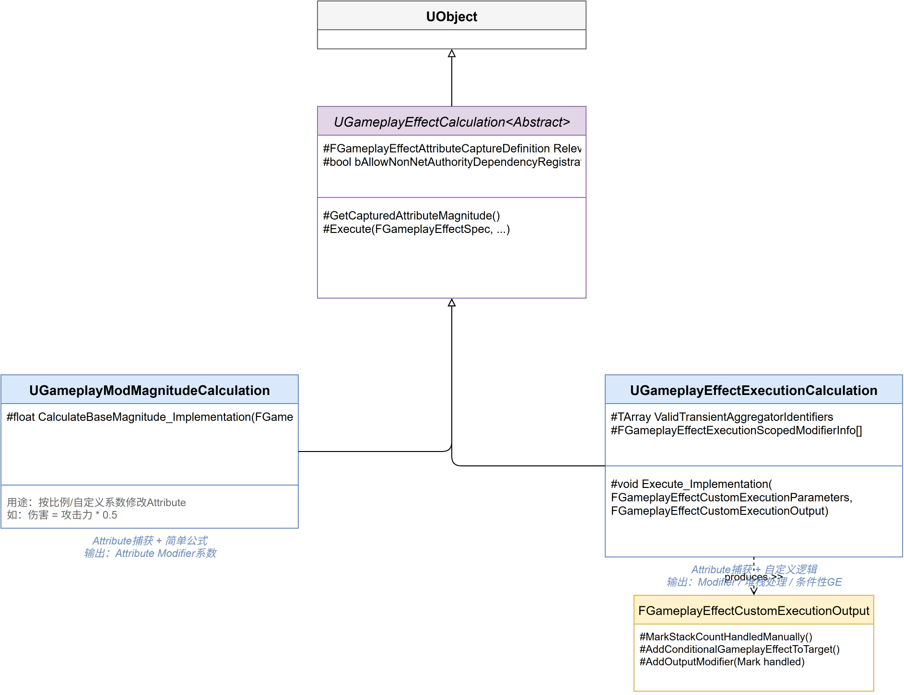

# 深入浅出UE5 GAS（五）：ExecutionCalculation —— 自定义伤害公式

## 系列目录

1. [AbilitySystemComponent —— GAS的心脏](../01-ASC/01-ASC文章.md)
2. [AttributeSet —— 数值系统的基石](../02-AttributeSet/02-AttributeSet文章.md)
3. [GameplayEffect（上）—— 从定义到应用](../03-GameplayEffect/03-GameplayEffect文章-上.md)
4. [GameplayEffect（下）—— Modifier、Stacking与Periodic](../03-GameplayEffect/03-GameplayEffect文章-下.md)
5. **（本文）ExecutionCalculation —— 自定义伤害公式**
6. [GameplayAbility —— 技能的诞生与消亡](../05-GameplayAbility/05-GameplayAbility文章.md)
7. [AbilityTask —— 异步编程的艺术](../06-AbilityTask/06-AbilityTask文章.md)
8. [TargetData —— 索敌与数据传递](../07-TargetData/07-TargetData文章.md)
9. [GameplayCue —— 技能反馈的表现层](../08-GameplayCue/08-GameplayCue文章.md)
10. [网络同步 —— 复制、预测与回滚](../09-Network/09-Network文章.md)
11. [GE Components —— UE 5.3 模块化新范式](../10-GEComponents/10-GEComponents文章.md)
12. [实战全景 —— 调试、陷阱与工程化模式](../11-Practice/11-Practice文章.md)

> 📎 [补遗篇 —— FGameplayAbilitySpec 详解](../12-Others/12-Others文章.md)

---

## 写在前面

在上一篇文章中，我们详细分析了 GameplayEffect 的 Modifier 系统：通过 `FGameplayModifierInfo` 配置"我要修改哪个属性、用什么运算符、取什么值"。这套系统非常好用：`AttributeBased` 按百分比修改，`ScalableFloat` 按数值修改，`SetByCaller` 从外部传入数值。

但很快你就会遇到一个问题：**如果我想做 `FinalDamage = Attack * 1.5 - Defense * 0.8` 这种涉及多个属性、经过复杂公式计算的伤害，GE 的 Simple Modifier 能做吗？**

答案是：不能。Simple Modifier 只能做"单个属性 × 单个系数"的运算。当你需要在一个计算中同时读取攻击者的攻击力、目标的防御力、各种伤害加成系数，并且输出多个修改结果时，你需要的是 **ExecutionCalculation**。

这篇文章，我们就来深入 GAS 中计算系统的最核心部分：`UGameplayEffectExecutionCalculation`（简称 ExecCalc），以及它的"兄弟"系统 `UGameplayModMagnitudeCalculation`（简称 MMC）。



---

## 一、问题的提出：Simple Modifier 的天花板

### 1.1 回顾 Simple Modifier 的能力边界

在 GE 的 `Modifiers` 数组中配置一个 Simple Modifier，本质上是声明了一个"属性修改指令"：

```
我要修改: Health
运算符:   Subtract
取值方式: ScalableFloat (50.0)
```

执行时，GAS 会从 `FGameplayModifierInfo` 生成一个 `FGameplayModifierEvaluatedData`，交给 Aggregator 去计算最终的属性值。

**Simple Modifier 的局限在于**：
- 一次只能"捕获"**一个**属性作为输入源（通过 `AttributeBased` 模式）
- 无法在计算过程中引入条件分支（比如"如果目标有护盾，伤害先扣护盾"）
- 无法在一次计算中修改**多个**不同的属性

### 1.2 两种"自定义计算"的定位

GAS 提供了两个层次的"自定义计算"：

| | MMC (`UGameplayModMagnitudeCalculation`) | ExecCalc (`UGameplayEffectExecutionCalculation`) |
|---|---|---|
| **粒度** | 单个 Modifier 的 Magnitude 计算 | 整个 GE 的执行逻辑 |
| **输出** | 一个 `float` | 任意数量的 `FGameplayModifierEvaluatedData` |
| **属性捕获** | 通过 `RelevantAttributesToCapture` | 通过 `RelevantAttributesToCapture` |
| **蓝图支持** | 是（`Blueprintable`） | 是（`Blueprintable`，但推荐 C++） |
| **典型场景** | "伤害值 = 攻击力 × 技能系数" | "伤害 = (攻击力 - 护甲) × 暴击倍率，扣血后还要判断死亡" |

**MMC 是"公式片段"，ExecCalc 是"完整函数"。**

---

## 二、源码深潜：继承体系与属性捕获

### 2.1 双层继承结构

```
UObject
└── UGameplayEffectCalculation (Abstract)
    │   └── TArray<FGameplayEffectAttributeCaptureDefinition> RelevantAttributesToCapture
    │
    ├── UGameplayModMagnitudeCalculation (Abstract, Blueprintable)
    │   └── CalculateBaseMagnitude_Implementation(...) → float
    │
    └── UGameplayEffectExecutionCalculation (Abstract, Blueprintable)
        └── Execute(const ExecutionParams&, OutExecutionOutput&)
```

这里的设计值得注意：`UGameplayEffectCalculation` 是一个"纯捕获声明"基类。它本身不做任何计算，只提供属性捕获定义列表（`RelevantAttributesToCapture`），声明"我关心的属性有哪些"。

真正执行计算的是它的两个子类，各自有不同的接口：

```cpp:15:28:E:\EpicGames\UE_5.8\Engine\Plugins\Runtime\GameplayAbilities\Source\GameplayAbilities\Public\GameplayEffectCalculation.h
UCLASS(BlueprintType, Blueprintable, Abstract, MinimalAPI)
class UGameplayEffectCalculation : public UObject
{
	GENERATED_UCLASS_BODY()
public:
	/** Simple accessor to capture definitions for attributes */
	UE_API virtual const TArray<FGameplayEffectAttributeCaptureDefinition>& GetAttributeCaptureDefinitions() const;
protected:
	/** Attributes to capture that are relevant to the calculation */
	UPROPERTY(EditDefaultsOnly, BlueprintReadOnly, Category=Attributes)
	TArray<FGameplayEffectAttributeCaptureDefinition> RelevantAttributesToCapture;
};
```

### 2.2 FGameplayEffectAttributeCaptureDefinition —— 属性的"抓拍"指令

这是一个关键的类型，它在 ExecCalc 中反复出现：

```cpp
// 简化后的结构（定义在 GameplayEffectTypes.h）
USTRUCT(BlueprintType)
struct FGameplayEffectAttributeCaptureDefinition
{
    UPROPERTY()
    FGameplayAttribute AttributeToCapture;     // 要捕获哪个属性
    
    UPROPERTY()
    EGameplayEffectAttributeCaptureSource AttributeSource; // 从 Source 还是 Target 捕获
    
    UPROPERTY()
    bool bSnapshot;                            // 是否在 GE 应用瞬间"拍照"
};
```

`EGameplayEffectAttributeCaptureSource` 有两个值：
- `Source`：从 GE 的**施放者**（Source）的 ASC 上捕获属性
- `Target`：从 GE 的**目标**（Target）的 ASC 上捕获属性

`bSnapshot = true` 意味着在 GE 应用时立即捕获当前值，之后就算原始属性变化，ExecCalc 使用的也是拍照时的值。这至关重要：如果伤害计算中"攻击力"在计算过程中被其他 GE 改变，拍照能保证公式的一致性。

### 2.3 声明捕获的宏

在 C++ 中为 ExecCalc 声明属性捕获，Epic 提供了一对辅助宏：

```cpp:323:331:E:\EpicGames\UE_5.8\Engine\Plugins\Runtime\GameplayAbilities\Source\GameplayAbilities\Public\GameplayEffectExecutionCalculation.h
#define DECLARE_ATTRIBUTE_CAPTUREDEF(P) \
	FProperty* P##Property; \
	FGameplayEffectAttributeCaptureDefinition P##Def; \

#define DEFINE_ATTRIBUTE_CAPTUREDEF(S, P, T, B) \
{ \
	P##Property = FindFieldChecked<FProperty>(S::StaticClass(), GET_MEMBER_NAME_CHECKED(S, P)); \
	P##Def = FGameplayEffectAttributeCaptureDefinition(P##Property, EGameplayEffectAttributeCaptureSource::T, B); \
}
```

使用时非常直接：

```cpp
// 在 .h 中声明
DECLARE_ATTRIBUTE_CAPTUREDEF(Attack);
DECLARE_ATTRIBUTE_CAPTUREDEF(Defense);

// 在构造函数中定义
DEFINE_ATTRIBUTE_CAPTUREDEF(UMyAttributeSet, Attack, Source, true);  // 从施放者捕获攻击力，拍照
DEFINE_ATTRIBUTE_CAPTUREDEF(UMyAttributeSet, Defense, Target, true); // 从目标捕获防御力，拍照
```

然后在构造函数中注册到 `RelevantAttributesToCapture`：

```cpp
RelevantAttributesToCapture.Add(AttackDef);
RelevantAttributesToCapture.Add(DefenseDef);
```

---

## 三、源码深潜：ExecCalc 的核心 —— Execute 签名

### 3.1 Execute 函数

ExecCalc 的核心入口只有一个函数：

```cpp:313:314:E:\EpicGames\UE_5.8\Engine\Plugins\Runtime\GameplayAbilities\Source\GameplayAbilities\Public\GameplayEffectExecutionCalculation.h
UFUNCTION(BlueprintNativeEvent, Category="Calculation")
UE_API void Execute(const FGameplayEffectCustomExecutionParameters& ExecutionParams, FGameplayEffectCustomExecutionOutput& OutExecutionOutput) const;
```

注意它是 `BlueprintNativeEvent` —— 这意味着你可以在 C++ 中重写 `Execute_Implementation`，也可以在蓝图中提供实现。但在实际项目中，几乎没有人用蓝图写 ExecCalc，原因很简单：ExecCalc 的典型逻辑是"从多个属性捕获值 → 做数学运算 → 输出多个修改结果"，蓝图在这方面没有优势。

### 3.2 FGameplayEffectCustomExecutionParameters —— 输入参数

这个结构体是对 ExecCalc 执行环境的封装：

```cpp:21:52:E:\EpicGames\UE_5.8\Engine\Plugins\Runtime\GameplayAbilities\Source\GameplayAbilities\Public\GameplayEffectExecutionCalculation.h
USTRUCT(BlueprintType)
struct FGameplayEffectCustomExecutionParameters
{
    // 获取触发本次计算的 GE Spec
    const FGameplayEffectSpec& GetOwningSpec() const;
    
    // 获取源 ASC（施放者）—— 可能为 null！
    UAbilitySystemComponent* GetSourceAbilitySystemComponent() const;
    
    // 获取目标 ASC（受体）
    UAbilitySystemComponent* GetTargetAbilitySystemComponent() const;
    
    // 获取传入的额外 Tags
    const FGameplayTagContainer& GetPassedInTags() const;
    
    // 获取预测 Key（网络相关，详见后文）
    FPredictionKey GetPredictionKey() const;
    
    // 计算已捕获属性的 Magnitude
    bool AttemptCalculateCapturedAttributeMagnitude(const CaptureDef&, const EvalParams&, OUT float&) const;
    
    // 计算已捕获属性的 BaseValue
    bool AttemptCalculateCapturedAttributeBaseValue(const CaptureDef&, OUT float&) const;
    
    // 计算已捕获属性的 Bonus（即 (Final - Base)）
    bool AttemptCalculateCapturedAttributeBonusMagnitude(const CaptureDef&, const EvalParams&, OUT float&) const;
    
    // 获取属性的全部 Modifier 列表
    bool AttemptGatherAttributeMods(const CaptureDef&, const EvalParams&, OUT ModMap&) const;
    
    // ... 更多辅助方法 ...
};
```

**设计亮点 1：所有 `Attempt*` 命名的方法都可能失败**

为什么是 `Attempt`？因为你在构造函数中声明的 `RelevantAttributesToCapture` 只是**声明了意图**，实际运行时某个属性可能不存在（比如目标没有这个 AttributeSet）。所以所有捕获方法都返回 `bool`，你必须检查。

**设计亮点 2：Magnitude / BaseValue / BonusMagnitude 的三层分离**

还记得第2篇文章中 AttributeSet 的三层数值模型吗？BaseValue → ModifierEvaluation → FinalValue。ExecCalc 暴露了同样的三层：

- `AttemptCalculateCapturedAttributeMagnitude` —— 给你 FinalValue
- `AttemptCalculateCapturedAttributeBaseValue` —— 给你 BaseValue  
- `AttemptCalculateCapturedAttributeBonusMagnitude` —— 给你 FinalValue - BaseValue

这让你可以在 ExecCalc 内部区分"当前值"和"基础值"，做更精确的计算。

**设计亮点 3：`AttemptGatherAttributeMods` 暴露了全部 Modifier**

这个强大的方法允许你遍历某个属性的**所有 Modifier**（包括来自其他 GE 的），逐个检查它们是否 `Qualifies()`（满足 Tag 条件）。这让你可以写诸如"找出所有施加了 `Effect.Damage.Bonus` Tag 的 Modifier，求和作为伤害加成"的逻辑。

### 3.3 FGameplayEffectCustomExecutionOutput —— 输出结果

```cpp:201:257:E:\EpicGames\UE_5.8\Engine\Plugins\Runtime\GameplayAbilities\Source\GameplayAbilities\Public\GameplayEffectExecutionCalculation.h
USTRUCT(BlueprintType)
struct FGameplayEffectCustomExecutionOutput
{
public:
    /** 手动处理了堆叠计数，无需 GE 系统自动处理 */
    void MarkStackCountHandledManually();
    
    /** GameplayCue 已经手动触发了，无需 GE 系统自动触发 */
    void MarkGameplayCuesHandledManually();
    
    /** 标记为需要触发 Conditional GameplayEffects */
    void MarkConditionalGameplayEffectsToTrigger();
    
    /** 添加一个输出 Modifier */
    void AddOutputModifier(const FGameplayModifierEvaluatedData& InOutputMod);
    
    /** 获取所有输出 Modifier 的列表 */
    const TArray<FGameplayModifierEvaluatedData>& GetOutputModifiers() const;

private:
    TArray<FGameplayModifierEvaluatedData> OutputModifiers;  // 核心：输出的修改数据
    uint32 bTriggerConditionalGameplayEffects : 1;           // 位域标记位
    uint32 bHandledStackCountManually : 1;                   // 位域标记位
    uint32 bHandledGameplayCuesManually : 1;                 // 位域标记位
};
```

注意到三个 `bool` 类型使用了**位域（bit-field）**声明——`uint32 bXxx : 1`。这是 Epic 在节省内存上的细节优化：三个布尔值本应占 3 字节，用位域后只占 4 字节（整个 `uint32`）。当你有成千上万个 ExecCalc 在同一帧执行时，这能显著降低内存占用。

**核心机制**：ExecCalc 的"输出"不是一个特定值，而是一个 `TArray<FGameplayModifierEvaluatedData>`：**你可以输出多个属性修改指令**。这是它和 MMC（只返回一个 `float`）的本质区别。

### 3.4 Scoped Modifiers —— 数据驱动的"预处理"

ExecCalc 最精妙但最容易被忽视的设计是 **Scoped Modifiers**。

在 GE 的 `Execution` 折叠菜单下（只需要在 GE 中配置一个 ExecCalc Class），你会看到 `Scoped Modifiers` 数组。它允许策划在 GE 资产上**无需修改 C++ 代码**就为某些属性在 ExecCalc 执行前应用一个临时 Modifier。

源码中它的工作方式是：在构造 `FGameplayEffectCustomExecutionParameters` 时，构造函数会遍历 `ScopedMods`，为每个 Scoped Mod 找到对应的 Aggregator，并添加一个临时 Modifier：

```cpp:16:60:E:\EpicGames\UE_5.8\Engine\Plugins\Runtime\GameplayAbilities\Source\GameplayAbilities\Private\GameplayEffectExecutionCalculation.cpp
FGameplayEffectCustomExecutionParameters::FGameplayEffectCustomExecutionParameters(
    FGameplayEffectSpec& InOwningSpec, 
    const TArray<FGameplayEffectExecutionScopedModifierInfo>& InScopedMods, 
    UAbilitySystemComponent* InTargetAbilityComponent, 
    const FGameplayTagContainer& InPassedInTags, 
    const FPredictionKey& InPredictionKey)
{
    for (const FGameplayEffectExecutionScopedModifierInfo& CurScopedMod : InScopedMods)
    {
        FAggregator* ScopedAggregator = nullptr;
        // 传统属性-backed 的 Aggregator
        if (CurScopedMod.AggregatorType == EGameplayEffectScopedModifierAggregatorType::CapturedAttributeBacked)
        {
            ScopedAggregator = ScopedModifierAggregators.Find(CurScopedMod.CapturedAttribute);
            if (!ScopedAggregator)
            {
                // 从 CaptureSpec 中获取 Aggregator 的快照
                const FGameplayEffectAttributeCaptureSpec* CaptureSpec = 
                    InOwningSpec.CapturedRelevantAttributes.FindCaptureSpecByDefinition(CurScopedMod.CapturedAttribute, true);
                FAggregator SnapshotAgg;
                if (CaptureSpec && CaptureSpec->AttemptGetAttributeAggregatorSnapshot(SnapshotAgg))
                {
                    ScopedAggregator = &(ScopedModifierAggregators.Add(CurScopedMod.CapturedAttribute, SnapshotAgg));
                }
            }
        }
        // 临时变量 Aggregator
        else
        {
            ScopedAggregator = &ScopedTransientAggregators.FindOrAdd(CurScopedMod.TransientAggregatorIdentifier);
        }
        // 对 Aggregator 应用 Scoped Modifier
        float ModEvalValue = 0.f;
        if (ScopedAggregator && CurScopedMod.ModifierMagnitude.AttemptCalculateMagnitude(InOwningSpec, ModEvalValue))
        {
            ScopedAggregator->AddAggregatorMod(ModEvalValue, CurScopedMod.ModifierOp, 
                CurScopedMod.EvaluationChannelSettings.GetEvaluationChannel(), ...);
        }
    }
}
```

这里有一个容易忽略的细节：Scoped Modifier 操作的是 **Aggregator 的快照（Snapshot）**，不是原始 Aggregator。它在 ExecCalc 作用域内修改计数器的值，但不会"污染"原始属性——ExecCalc 结束后，临时修改自动消失。

另外注意，Scoped Modifiers 支持两种类型：
- `CapturedAttributeBacked` —— 作用于已捕获的属性
- `TransientAggregator` —— 作用于**临时变量**（用 GameplayTag 标识，无需对应真实属性）

后者的设计非常巧妙：策划可以在 GE 中声明一个 `Transient.DamageMultiplier` 临时变量，通过 Scoped Modifier 设置值，然后在 ExecCalc 的 C++ 代码中通过 `AttemptCalculateTransientAggregatorMagnitude()` 读取。这实现了**纯数据驱动的中间变量通信**。

---

## 四、MMC vs ExecCalc：何时用哪个？

这是 GAS 新手最容易困惑的问题。用一段真实场景对比来看：

### 场景：一个"伤害减半"的 Buff

**方案 A：用 MMC**

MMC 只返回一个 `float`，代表某个 Modifier 的 Magnitude。配置一个 `Modifier.Op = MultiplyAdd, Attribute = Health, Magnitude = CustomCalculationClass → UMMC_HalveDamage`：

```cpp
float UMMC_HalveDamage::CalculateBaseMagnitude_Implementation(const FGameplayEffectSpec& Spec) const
{
    // 从 Spec 中获取原始伤害值
    float OriginalDamage = 0.f;
    Spec.GetSetByCallerMagnitude(FGameplayTag::RequestGameplayTag("Data.Damage"), false, OriginalDamage);
    return OriginalDamage * 0.5f;
}
```

**方案 B：用 ExecCalc**

ExecCalc 可以直接输出多个 `FGameplayModifierEvaluatedData`：

```cpp
void UExecCalc_Damage::Execute_Implementation(
    const FGameplayEffectCustomExecutionParameters& ExecutionParams,
    FGameplayEffectCustomExecutionOutput& OutExecutionOutput) const
{
    // 1. 从参数中读取攻击力和防御力
    float Attack = 0.f, Defense = 0.f;
    ExecutionParams.AttemptCalculateCapturedAttributeMagnitude(AttackDef, EvalParams, Attack);
    ExecutionParams.AttemptCalculateCapturedAttributeMagnitude(DefenseDef, EvalParams, Defense);
    
    // 2. 计算伤害公式
    float Damage = FMath::Max(Attack - Defense, 0.f);
    
    // 3. 输出对 Health 的 Subtract 修改
    OutExecutionOutput.AddOutputModifier(
        FGameplayModifierEvaluatedData(HealthProperty, EGameplayModOp::Additive, -Damage)
    );
    
    // 4. 还能输出对 Rage 的 Add 修改
    OutExecutionOutput.AddOutputModifier(
        FGameplayModifierEvaluatedData(RageProperty, EGameplayModOp::Additive, 10.0f)
    );
}
```

**选择标准**：

| 条件 | 选择 |
|------|------|
| 只计算一个属性的 Magnitude | **MMC** —— 更简单，可以在蓝图中完成 |
| 需要读取多个属性并做复杂运算 | **ExecCalc** —— 只有它能做到 |
| 需要在一次计算中修改多个属性 | **ExecCalc** —— MMC 只输出一个 float |
| 需要遍历属性上的所有 Modifier | **ExecCalc** —— `AttemptGatherAttributeMods` 独家能力 |
| 纯蓝图团队 | **MMC** —— 蓝图友好 |

一个更直观的判断方式：**如果你在 MMC 里想做的事情让你感觉"这东西不该这么写"，那就换 ExecCalc。**

---

## 五、实战示例：一个完整的 ExecCalc 实现

下面展示一个真实的 ExecCalc 实现，计算"物理伤害"并考虑护甲减伤：

### 头文件与属性捕获注册

首先是头文件声明和构造函数，完成属性捕获的注册：

```cpp
// .h 文件
UCLASS()
class UExecCalc_PhysicalDamage : public UGameplayEffectExecutionCalculation
{
    GENERATED_BODY()
    
public:
    UExecCalc_PhysicalDamage();
    
    virtual void Execute_Implementation(
        const FGameplayEffectCustomExecutionParameters& ExecutionParams,
        FGameplayEffectCustomExecutionOutput& OutExecutionOutput) const override;
    
private:
    DECLARE_ATTRIBUTE_CAPTUREDEF(Attack);
    DECLARE_ATTRIBUTE_CAPTUREDEF(Defense);
    DECLARE_ATTRIBUTE_CAPTUREDEF(PhysicalDamageMultiplier);
};

// 构造函数 —— 注册属性捕获
UExecCalc_PhysicalDamage::UExecCalc_PhysicalDamage()
{
    DEFINE_ATTRIBUTE_CAPTUREDEF(UMonsterAttributeSet, Attack, Source, true);
    DEFINE_ATTRIBUTE_CAPTUREDEF(UMonsterAttributeSet, Defense, Target, true);
    DEFINE_ATTRIBUTE_CAPTUREDEF(UMonsterAttributeSet, PhysicalDamageMultiplier, Source, true);
    
    RelevantAttributesToCapture.Add(AttackDef);
    RelevantAttributesToCapture.Add(DefenseDef);
    RelevantAttributesToCapture.Add(PhysicalDamageMultiplierDef);
}
```

`DECLARE_ATTRIBUTE_CAPTUREDEF` / `DEFINE_ATTRIBUTE_CAPTUREDEF` 是 Epic 提供的一对宏，用于生成 `FGameplayEffectAttributeCaptureDefinition` 并注册到 `RelevantAttributesToCapture`。最后一个参数 `true` 表示"快照模式"（bSnapshot）。

### Execute 函数 —— 公式计算与输出

构造函数注册了"要捕获哪些属性"，`Execute_Implementation` 则负责"用这些属性做什么"：

```cpp
void UExecCalc_PhysicalDamage::Execute_Implementation(
    const FGameplayEffectCustomExecutionParameters& ExecutionParams,
    FGameplayEffectCustomExecutionOutput& OutExecutionOutput) const
{
    UAbilitySystemComponent* SourceASC = ExecutionParams.GetSourceAbilitySystemComponent();
    UAbilitySystemComponent* TargetASC = ExecutionParams.GetTargetAbilitySystemComponent();
    
    if (!SourceASC || !TargetASC) return;
    
    // 准备评估参数（Tag 上下文会影响哪些 Modifier 被计入）
    FAggregatorEvaluateParameters EvalParams;
    EvalParams.SourceTags = SourceASC->GetOwnedGameplayTags();
    EvalParams.TargetTags = TargetASC->GetOwnedGameplayTags();
    
    // 从构造阶段注册的属性中取值
    float Attack = 0.f, Defense = 0.f, Multiplier = 1.f;
    ExecutionParams.AttemptCalculateCapturedAttributeMagnitude(AttackDef, EvalParams, Attack);
    ExecutionParams.AttemptCalculateCapturedAttributeMagnitude(DefenseDef, EvalParams, Defense);
    ExecutionParams.AttemptCalculateCapturedAttributeMagnitude(PhysicalDamageMultiplierDef, EvalParams, Multiplier);
    
    // 伤害公式：伤害 = (攻击力 - 防御力 * 0.6) * 伤害倍率，保底 1 点
    float EffectiveDefense = Defense * 0.6f;
    float RawDamage = FMath::Max(Attack - EffectiveDefense, 1.0f);
    float FinalDamage = RawDamage * Multiplier;
    
    // 输出：扣除生命值
    FGameplayModifierEvaluatedData HealthMod(HealthProperty, EGameplayModOp::Additive, -FinalDamage);
    OutExecutionOutput.AddOutputModifier(HealthMod);
    
    // 触发条件性后续 GE
    OutExecutionOutput.MarkConditionalGameplayEffectsToTrigger();
}
```

**注意几个容易漏掉的细节**：

1. **`FAggregatorEvaluateParameters`** 是必需的——它告诉 Aggregator "当前评估的上下文是怎样的"。缺少 SourceTags/TargetTags 可能导致某些 Modifier 因为 Tag 条件不满足而被跳过。

2. **SourceASC 可能为 null**。在 ExecCalc 中通过 `GetSourceAbilitySystemComponent()` 获取源 ASC，但如果 GE 没有 Source（比如来自环境伤害），它返回 `nullptr`。生产代码中必须检查。

3. **`FGameplayModifierEvaluatedData` 的构造**需要传入完整的 `FGameplayAttribute`（通过 `FindFieldChecked` 找到的 `FProperty*`），不能只传属性名。

---

### 六、设计思考：Epic 为什么做了两套系统？

理解了 ExecCalc 和 MMC 的全部细节后，我们回到一个根本问题：**为什么要有 MM/ExecCalc 和 MMC 两套系统？它们完全可以在一个层级完成。**

答案藏在 **职责分离** 的理念里：

### MMC：公式的"组件化"

MMC 的定位是：**一个可以被多个 GE 复用的计算片段**。

设想 `Game.HealthPotion`、`Game.Food`、`Game.HealSpell` 三个 GE，它们都需要计算"治疗量"。如果治疗公式是 `HealAmount = BaseHealValue * (1.0 + BonusHeal%)`，你可以把这个公式写成一个 MMC，然后三个 GE 的 Modifier 都用 `CustomCalculationClass = UMMC_HealAmount`。

MMC 是**可拼装的**。GE 仍然可以用自身的 Modifier 去做加法、乘法（比如在 MMC 的结果上再乘一个系数），MMC 只是替换了"Magnitude 来源"这一个环节。

### ExecCalc：公式的"完整控制"

ExecCalc 的定位是：**接管整个 GE 的执行过程**。

当你用 ExecCalc 时，GE 的 `Modifiers` 数组**完全失效**：ExecCalc 的 `OutExecutionOutput` 完全取代了它。你拥有对输出结果的终极控制权，但同时你也承担了全部责任：你需要自己处理 Stacking 计数（或通过 `MarkStackCountHandledManually` 委托）、自己处理 GameplayCue 的触发时机。

这种设计体现了"渐进式复杂度"：简单的事情用 Simple Modifier，复杂一点用 MMC，最复杂的用 ExecCalc。每一层的复杂度增加都是**有代价的**（更难配置、更易出错），所以同时也收紧了控制权。这不是设计缺陷，而是**精心设计的抽象层级**。

---

## 七、总结

1. **Simple Modifier** 适合"单个属性 × 单个系数"的简单修改
2. **MMC** 适合"需要自定义公式计算单个 Magnitude"，可跨 GE 复用
3. **ExecCalc** 适合"多属性输入 + 复杂公式 + 多属性输出"的完整计算
4. 属性捕获(`FGameplayEffectAttributeCaptureDefinition`)的 `bSnapshot` 参数决定了是"拍照"还是"实时查询"
5. `AttemptGatherAttributeMods` 是 ExecCalc 独有的强大能力，允许遍历属性的全部 Modifier
6. Scoped Modifiers 提供了数据驱动的预处理层，策划可以不修改 C++ 就参与公式调整
7. 生产代码中务必检查 `GetSourceAbilitySystemComponent()` 是否为 null

**下一篇预告**：数值计算之后，我们来剖析 GAS 中层最核心的概念——`UGameplayAbility`。一个技能从激活到结束经历了哪些阶段？Tag 约束如何精确控制技能可用性？成本（Cost）和冷却（Cooldown）是如何通过 GE 实现的？

---

*本文基于 UE 5.8 源码分析。源码路径：`Engine/Plugins/Runtime/GameplayAbilities/Source/GameplayAbilities/`*
