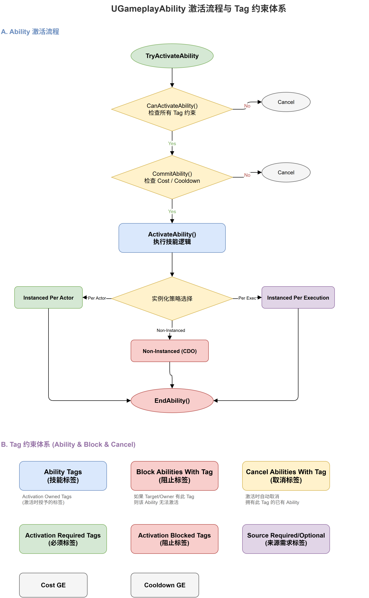

# 深入浅出UE5 GAS（六）：GameplayAbility —— 技能的诞生与消亡

## 系列目录

1. [AbilitySystemComponent —— GAS的心脏](../01-ASC/01-ASC文章.md)
2. [AttributeSet —— 数值系统的基石](../02-AttributeSet/02-AttributeSet文章.md)
3. [GameplayEffect（上）—— 从定义到应用](../03-GameplayEffect/03-GameplayEffect文章-上.md)
4. [GameplayEffect（下）—— Modifier、Stacking与Periodic](../03-GameplayEffect/03-GameplayEffect文章-下.md)
5. [ExecutionCalculation —— 自定义伤害公式](../04-ExecutionCalculation/04-ExecutionCalculation文章.md)
6. **（本文）GameplayAbility —— 技能的诞生与消亡**
7. [AbilityTask —— 异步编程的艺术](../06-AbilityTask/06-AbilityTask文章.md)
8. [TargetData —— 索敌与数据传递](../07-TargetData/07-TargetData文章.md)
9. [GameplayCue —— 技能反馈的表现层](../08-GameplayCue/08-GameplayCue文章.md)
10. [网络同步 —— 复制、预测与回滚](../09-Network/09-Network文章.md)
11. [GE Components —— UE 5.3 模块化新范式](../10-GEComponents/10-GEComponents文章.md)
12. [实战全景 —— 调试、陷阱与工程化模式](../11-Practice/11-Practice文章.md)

> 📎 [补遗篇 —— FGameplayAbilitySpec 详解](../12-Others/12-Others文章.md)

---

## 写在前面

如果说 GE 是"对属性的修改"，那 GameplayAbility（GA）就是"修改的发起者"。一个火球术 Ability 可能会：消耗魔力（Cost GE）→ 发射投射物 → 造成伤害（Damage GE）→ 进入冷却（Cooldown GE）——这一系列操作都在 GA 的生命周期中编排。

但 GA 不仅仅是"放技能"那么简单。它还承载了 GAS 最精妙的设计之一：**通过 Tag 驱动的声明式约束，实现技能互斥和阻断，而不是写一堆 if-else。**

本文将深入分析 GA 的源码实现：激活流程、实例化策略、Commit 机制、Tag 约束体系，以及网络复制策略。

---

## 一、UGameplayAbility 的类结构

### 1.1 技能标签 —— 声明式的约束关系

`UGameplayAbility` 用六组 `FGameplayTagContainer` 定义了技能的"身份"和"关系"。这些 Tag 构成了 GAS 中最核心的声明式约束体系：

```cpp
UCLASS(Blueprintable, MinimalAPI)
class UGameplayAbility : public UObject, public IGameplayTaskOwnerInterface
{
    GENERATED_BODY()

public:
    /** 技能标签 —— 这个技能"是"什么 */
    UPROPERTY(EditDefaultsOnly, Category = "Ability Tags")
    FGameplayTagContainer AbilityTags;

    /** 取消带有这些标签的技能 */
    UPROPERTY(EditDefaultsOnly, Category = "Ability Tags")
    FGameplayTagContainer CancelAbilitiesWithTag;

    /** 阻止带有这些标签的技能激活 */
    UPROPERTY(EditDefaultsOnly, Category = "Ability Tags")
    FGameplayTagContainer BlockAbilitiesWithTag;

    /** 激活时自身必须有的标签 */
    UPROPERTY(EditDefaultsOnly, Category = "Ability Tags")
    FGameplayTagContainer ActivationOwnedTags;

    /** 激活时自身必须没有的标签 */
    UPROPERTY(EditDefaultsOnly, Category = "Ability Tags")
    FGameplayTagContainer ActivationBlockedTags;

    /** 激活时目标必须有的标签 */
    UPROPERTY(EditDefaultsOnly, Category = "Ability Tags")
    FGameplayTagContainer ActivationRequiredTags;

    /** 激活时目标必须没有的标签 */
    UPROPERTY(EditDefaultsOnly, Category = "Ability Tags")
    FGameplayTagContainer ActivationBlockedTags_OnTarget;
```

这六组 Tag 容器之间的逻辑关系值得仔细看：`AbilityTags` 用于"识别我自己是什么"，`CancelAbilitiesWithTag` 和 `BlockAbilitiesWithTag` 用于"告诉别人我是谁的克星"，而 `ActivationRequiredTags` 和 `ActivationBlockedTags` 则用于"询问我能不能动"。这是一个微型且完整的声明式规则系统。

### 1.2 Cost 与 Cooldown —— 通过 GE 实现的资源管理

Cost 和 Cooldown 都通过 GE 来实现，而不是直接扣减属性。这意味着策划可以在 GE 中自由配置消耗的资源种类、数值公式、冷却时长的计算方式，完全不需要修改 C++：

```cpp
    /** 消耗（通过 GE 实现） */
    UPROPERTY(EditDefaultsOnly, Category = Costs)
    TObjectPtr<UGameplayEffect> CostGameplayEffectClass;

    /** 冷却（通过 GE 实现） */
    UPROPERTY(EditDefaultsOnly, Category = Cooldowns)
    TObjectPtr<UGameplayEffect> CooldownGameplayEffectClass;
```

### 1.3 三个关键策略 —— 实例化 / 复制 / 网络执行

这三个枚举决定了 GA 的运行方式和网络行为：

```cpp
    // 实例化策略：NonInstanced（CDO 执行）/ InstancedPerActor（单例）/
    //             InstancedPerExecution（每次 new）
    UPROPERTY(EditDefaultsOnly, Category = Advanced)
    EGameplayAbilityInstancingPolicy::Type InstancingPolicy;

    // 复制策略：ReplicateNo（不复制）/ ReplicateYes（复制到所有客户端）
    UPROPERTY(EditDefaultsOnly, Category = Advanced)
    EGameplayAbilityReplicationPolicy::Type ReplicationPolicy;

    // 网络执行策略：LocalOnly / LocalPredicted / ServerOnly / ServerInitiated
    UPROPERTY(EditDefaultsOnly, Category = Advanced)
    EGameplayAbilityNetExecutionPolicy::Type NetExecutionPolicy;
```

这三个策略的组合直接决定了技能的预测行为。比如一个需要格斗精度的近战攻击应该用 `LocalPredicted + InstancedPerExecution`，而一个纯表现性的技能可能只需要 `ServerOnly + NonInstanced`。

### 1.4 核心生命周期方法

GAS 把 GA 的生命周期拆成了多个正交的虚函数，每个只做一件事：

```cpp
    /** 激活入口 —— 你的蓝图/C++ 逻辑从这里开始 */
    virtual void ActivateAbility(const FGameplayAbilitySpecHandle Handle,
                                 const FGameplayAbilityActorInfo* ActorInfo,
                                 const FGameplayAbilityActivationInfo ActivationInfo,
                                 const FGameplayEventData* TriggerEventData);

    /** 结束技能 */
    virtual void EndAbility(const FGameplayAbilitySpecHandle Handle,
                            const FGameplayAbilityActorInfo* ActorInfo,
                            const FGameplayAbilityActivationInfo ActivationInfo,
                            bool bReplicateEndAbility, bool bWasCancelled);

    /** 提交 Cost 和 Cooldown（一站式提交） */
    virtual bool CommitAbility(const FGameplayAbilitySpecHandle Handle,
                               const FGameplayAbilityActorInfo* ActorInfo,
                               const FGameplayAbilityActivationInfo ActivationInfo,
                               OUT FGameplayTagContainer* OptionalRelevantTags = nullptr);

    /** 四步激活前检查：Tag → Cost → Cooldown → 自定义 */
    virtual bool CanActivateAbility(const FGameplayAbilitySpecHandle Handle,
                                    const FGameplayAbilityActorInfo* ActorInfo,
                                    const FGameplayTagContainer* SourceTags = nullptr,
                                    const FGameplayTagContainer* TargetTags = nullptr,
                                    OUT FGameplayTagContainer* OptionalRelevantTags = nullptr) const;

    /** 检查 Cost（可覆写以自定义消耗逻辑） */
    virtual bool CheckCost(const FGameplayAbilitySpecHandle Handle,
                           const FGameplayAbilityActorInfo* ActorInfo,
                           OUT FGameplayTagContainer* OptionalRelevantTags = nullptr) const;

    /** 应用 Cost GE */
    virtual void ApplyCost(const FGameplayAbilitySpecHandle Handle,
                           const FGameplayAbilityActorInfo* ActorInfo,
                           const FGameplayAbilityActivationInfo ActivationInfo) const;

    /** 应用 Cooldown GE */
    virtual void ApplyCooldown(const FGameplayAbilitySpecHandle Handle,
                               const FGameplayAbilityActorInfo* ActorInfo,
                               const FGameplayAbilityActivationInfo ActivationInfo) const;

    // ========== 运行时数据（每次激活时填充） ==========

    FGameplayAbilityActivationInfo CurrentActivationInfo;
    FGameplayEventData CurrentEventData;
    FGameplayAbilitySpecHandle CurrentSpecHandle;
};
```

---

## 二、激活流程：从 TryActivate 到 ActivateAbility

一个 GA 的完整激活流程如下：



```
1. ASC::TryActivateAbility(Handle)
   │
   ├─ 2. 检查 ASC 级别的 BlockAbilitiesWithTag
   │     (如果有交集的 Tag，直接失败)
   │
   ├─ 3. InternalTryActivateAbility(Handle)
   │     │
   │     ├─ 4. 检查 Spec 是否有效
   │     ├─ 5. 检查 ActiveCount 是否已达上限
   │     │
   │     ├─ 6. CanActivateAbility() ← GA的第一次检查
   │     │     ├─ 检查 ActivationRequiredTags
   │     │     ├─ 检查 ActivationBlockedTags
   │     │     ├─ 检查 Cost（通过 GE）
   │     │     └─ 检查 Cooldown（通过 GE）
   │     │
   │     ├─ 7. 根据 InstancingPolicy 创建/获取实例
   │     │     ├─ NonInstanced:      使用 CDO
   │     │     ├─ InstancedPerActor: 获取 Actor 级单例
   │     │     └─ InstancedPerExecution: 创建新实例
   │     │
   │     ├─ 8. 设置 CurrentSpecHandle, CurrentActorInfo 等
   │     │
   │     ├─ 9. GA::ActivateAbility()
   │     │      ↑ 你的蓝图/C++ 逻辑从这里开始
   │     │
   │     └─ 10. Spec->ActiveCount++
   │
   └─ 11. 如果 bReplicateActivation，通知客户端
```

### 2.1 激活的三种方式

```cpp
// 方式1：通过 FGameplayAbilitySpecHandle 激活
bool TryActivateAbility(FGameplayAbilitySpecHandle AbilityToActivate, bool bAllowRemoteActivation = false);

// 方式2：通过 Ability Class 激活
bool TryActivateAbilityByClass(TSubclassOf<UGameplayAbility> InAbilityToActivate, bool bAllowRemoteActivation = false);

// 方式3：通过 GameplayEvent 触发激活
bool TriggerAbilityFromGameplayEvent(FGameplayAbilitySpecHandle AbilityToActivate, 
    FGameplayAbilityActorInfo* ActorInfo, FGameplayTag Tag, 
    const FGameplayEventData* Payload, UAbilitySystemComponent& Component);
```

第三种方式特别有意思——它允许通过 GameplayTag 事件来触发 Ability，这非常适合"受击触发反击"、"条件触发被动技能"等场景。

---

## 三、Tag 约束体系：声明式的能力管理

这是我个人认为 GAS 设计中最优雅的部分。它完全用 Tag 来管理能力之间的关系，而不是写大量的条件判断。

### 3.1 AbilityTags —— "我是什么"

```cpp
UPROPERTY(EditDefaultsOnly, Category = "Ability Tags")
FGameplayTagContainer AbilityTags;
```

这些 Tag 描述了这个 Ability **本身**。例如：`Ability.Attack.Melee`、`Ability.Magic.Fire`。

### 3.2 CancelAbilitiesWithTag —— "我激活时取消谁"

```cpp
UPROPERTY(EditDefaultsOnly, Category = "Ability Tags")
FGameplayTagContainer CancelAbilitiesWithTag;
```

当你激活一个 Ability 时，所有拥有这些 Tag 的 Ability 会被自动取消。典型的应用：移动技能取消攻击技能。

### 3.3 BlockAbilitiesWithTag —— "我激活期间阻止谁"

```cpp
UPROPERTY(EditDefaultsOnly, Category = "Ability Tags")
FGameplayTagContainer BlockAbilitiesWithTag;
```

在你的 Ability 激活期间，任何想要激活并拥有这些 Tag 的 Ability 会被阻止。**注意它和 Cancel 的区别**：Block 是阻止新激活，Cancel 是终止已经在运行的。

### 3.4 ActivationOwnedTags / ActivationBlockedTags —— "激活我的前置条件"

```cpp
// 我必须有这些 Tag 才能激活
FGameplayTagContainer ActivationOwnedTags;

// 我必须没有这些 Tag 才能激活
FGameplayTagContainer ActivationBlockedTags;
```

例如：`跳斩`技能可能要求 `ActivationOwnedTags = [State.Airborne]`（必须在空中才能使用）。

### 3.5 实战：沉默效果的实现

这套 Tag 体系让控制效果变得极其简单。实现"沉默"：

```cpp
// 沉默 buff GE:
InheritableOwnedTagsContainer.Added = [State.Silenced]

// 所有法术 Ability:
ActivationBlockedTags = [State.Silenced]
```

只需要两步，完全不需要写代码判断"是否被沉默"。

### 3.6 实战：眩晕时取消所有动作

```cpp
// 眩晕 buff GE:
InheritableOwnedTagsContainer.Added = [State.Stunned]

// 所有主动 Ability:
CancelAbilitiesWithTag = [Ability.Attack, Ability.Movement]
// 或更简单：直接通过 BlockAbilitiesWithTag 阻止
```

---

## 四、Cost 与 Cooldown —— 通过 GE 实现的消耗与冷却

一个常见的问题是：**为什么 Cost 和 Cooldown 要用 GE 来实现，而不是简单地在 Ability 里写个 float？**

答案：因为 GAS 追求**一切修改都是 GE**的统一性。

### 4.1 Cost GE

```cpp
UPROPERTY(EditDefaultsOnly, Category = Costs)
TObjectPtr<UGameplayEffect> CostGameplayEffectClass;
```

Cost GE 通常是一个 Instant 类型的 GE，在 `CommitAbility` 时应用。例如：

```cpp
// Cost_Ability_Fireball: 
// Modifier: Additive -30 to AttributeSet.Mana
```

`CheckCost` 会在激活前检查是否有足够的 Mana：
```cpp
virtual bool CheckCost(const FGameplayAbilitySpecHandle Handle,
                       const FGameplayAbilityActorInfo* ActorInfo,
                       OUT FGameplayTagContainer* OptionalRelevantTags) const;
```

默认实现会检查 Cost GE 的所有 Modifier 能否被应用——简单说就是"有没有足够的资源"。

### 4.2 Cooldown GE

```cpp
UPROPERTY(EditDefaultsOnly, Category = Cooldowns)
TObjectPtr<UGameplayEffect> CooldownGameplayEffectClass;
```

Cooldown GE 的 Duration Policy 决定了冷却时间的长度。应用 Cool 后，`CheckCooldown` 会检查 Cooldown GE 是否还在活跃——只要 Cooldown GE 的 Tags 还在，能力就无法再次激活。

```cpp
// Cooldown_Ability_Fireball:
// DurationPolicy = HasDuration
// DurationMagnitude = ScalableFloat(3.0)  ← 3秒冷却
// GrantTags = [Cooldown.Ability.Fireball] ← 冷却标签
```

### 4.3 CommitAbility —— 一锤定音

```cpp
virtual bool CommitAbility(const FGameplayAbilitySpecHandle Handle,
                           const FGameplayAbilityActorInfo* ActorInfo,
                           const FGameplayAbilityActivationInfo ActivationInfo,
                           OUT FGameplayTagContainer* OptionalRelevantTags = nullptr);
```

Commit 是**原子操作**——它同时执行 `ApplyCost` 和 `CommitCooldown`。要么同时成功，要么都不执行。

**最佳实践**：在你的 Ability 的 `ActivateAbility` 实现中，应该 **在最早的时刻调用 `CommitAbility`**，然后再执行实际逻辑。如果 Commit 失败（资源不足），应该立即 `EndAbility`。

---

## 五、实例化策略的三叉戟

```cpp
namespace EGameplayAbilityInstancingPolicy
{
    enum Type
    {
        NonInstanced,            // 直接在 CDO 上执行
        InstancedPerActor,       // 每个 Actor 持有一个实例
        InstancedPerExecution,   // 每次激活创建新实例
    };
}
```

### 5.1 NonInstanced —— 极限性能

NonInstanced 不使用实例——所有逻辑在 CDO 上执行。因为 CDO 是只读的（不应有状态），这种模式**不能使用 AbilityTask**。典型场景：被动技能、跳跃等无需维持状态的简单技能。

```cpp
// NonInstanced 的限制
// 1. 不能使用 AbilityTask（Task需要实例来管理生命周期）
// 2. 不能存储成员变量状态
// 3. EndAbility 不会被调用（因为没有"结束"的概念）
```

### 5.2 InstancedPerActor —— 平衡之选

每个 Actor 持有一个 GA 实例。这意味着**同一个 Ability 在同一时间只能激活一次**（除非 `bRetriggerInstancedAbility` 为 true）。

这是最常用的策略。一个火球术 Ability 的实例在 Actor 的整个生命周期中存在，每次施放都复用同一个实例。

### 5.3 InstancedPerExecution —— 完全独立

每次激活都创建一个全新的实例。这让你可以**同时激活同一个 Ability 的多个实例**——例如同时向多个目标发射火球。

**关键源码**：

```cpp
// AbilitySystemComponent 中的实例获取逻辑
UGameplayAbility* GetOrCreateInstance(const FGameplayAbilitySpec& Spec)
{
    if (Spec.Ability->GetInstancingPolicy() == EGameplayAbilityInstancingPolicy::NonInstanced)
        return Spec.Ability;  // 返回 CDO
    
    if (Spec.Ability->GetInstancingPolicy() == EGameplayAbilityInstancingPolicy::InstancedPerActor)
    {
        if (Spec.AbilityInstances.Num() > 0)
            return Spec.AbilityInstances[0];  // 返回已有实例
        // 否则创建新实例
    }
    
    // InstancedPerExecution：每次都创建新实例
    UGameplayAbility* NewInstance = NewObject<UGameplayAbility>(...);
    Spec.AbilityInstances.Add(NewInstance);
    return NewInstance;
}
```

---

## 六、网络执行策略

```cpp
namespace EGameplayAbilityNetExecutionPolicy
{
    enum Type
    {
        LocalOnly,           // 只在本地执行（用于纯客户端效果）
        LocalPredicted,      // 本地先预测执行，等服务器确认
        ServerOnly,          // 只在服务器执行，结果复制到客户端
        ServerInitiated,     // 服务器发起，在所有客户端执行
    };
}
```

### LocalPredicted —— 预判执行

这是最复杂但也是体验最好的模式。客户端会"预测"技能的执行结果并立即显示，如果服务器拒绝，则回滚。

LocalPredicted 依赖于 PredictionKey 系统：

```cpp
// AbilitySystemComponent 中的预测窗口
FScopedPredictionWindow ScopedPrediction(ASC, bCanGenerateNewKey)
{
    // 在这个作用域内，所有 GE 的应用都会被标记为"预测执行"
    // 服务器收到后会"重新播放"并确认
}
```

### ServerOnly —— 安全至上

对于关键的伤害判定、掉落判定等，使用 ServerOnly 确保权威性。客户端需要通过等待服务器的复制来看到效果——这会引入一定的延迟感。

---

### 七、设计思考：Tag 系统的声明式哲学

GAS 的 Ability 管理让我想起声明式编程的思想：

**传统做法（命令式）**：
```cpp
// 激活技能时
if (IsStunned() || IsSilenced() || IsDead())
    return false;
    
for (auto& Ability : ActiveAbilities)
{
    if (Ability.IsAttack() && CurrentAbility.IsMovement())
        Ability.Cancel();
}
```

**GAS 做法（声明式）**：
```
配置：
  Ability.Fireball:
    ActivationBlockedTags = [State.Stunned, State.Silenced, State.Dead]
    CancelAbilitiesWithTag = [Ability.Movement]
```

哪个更优雅、更易维护、更少出错？答案显而易见。GAS 的设计者显然深谙"配置优于代码"的原则。

但这个设计也有代价：**Tag 的爆炸式增长。** 如果项目没有良好的 Tag 管理规范，很快就会出现数百个 Tag，难以维护。Epic 通过在编辑器中提供 `GameplayTagsManager` 和相关工具来缓解这个问题，但项目级别的 Tag 治理仍然是一门学问。

---

## 八、总结与回顾

GameplayAbility 的关键设计点：

| 概念 | 核心机制 | 设计意图 |
|------|---------|---------|
| Tag 约束体系 | AbilityTags / CancelWith / BlockWith / ActivationRequired | 声明式的能力管理 |
| Cost & Cooldown | 通过 GE 实现，Commit 原子化 | 与 GE 系统统一，复用复制和计算逻辑 |
| 实例化策略 | NonInstanced / PerActor / PerExecution | 性能与灵活性的权衡 |
| 网络执行策略 | Local / Predicted / Server / ServerInitiated | 体验与安全的平衡 |
| 生命周期 | Activate → Commit → Execute → End | 明确的阶段划分 |

关键设计哲学：

1. **Tag 驱动**：一切条件判断和状态管理都通过 GameplayTag，消除硬编码的分支逻辑
2. **GE 统一消耗/冷却**：Cost 和 Cooldown 都是 GE——统一、可复用、可扩展
3. **实例策略分离**：根据性能需求和功能需求选择不同的实例化方式
4. **预测优先**：通过 PredictionKey 系统实现流畅的客户端预测体验
5. **原子 Commit**：Cost 和 Cooldown 要么同时应用，要么都不应用

**下一篇预告**：我们将分析 AbilityTask —— GAS 中实现异步逻辑的核心机制。你将看到它是如何让一个"持续施法3秒"的技能、一个"等待移动输入"的技能、或者一个"监听属性变化"的技能，都通过统一的任务模型来实现的。

---

*本系列文章基于 UE 5.8 源码分析，GameplayAbilities 插件路径：`Engine/Plugins/Runtime/GameplayAbilities`*
