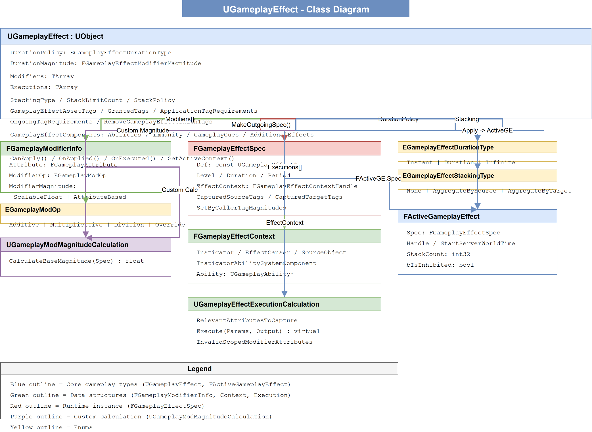
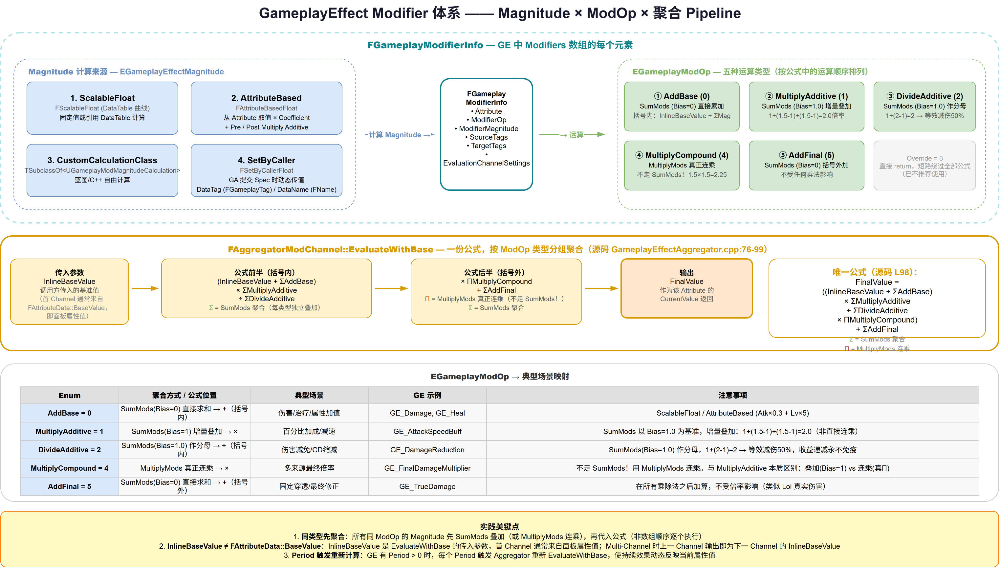

# 05 | GameplayEffect — 数据结构与配置体系

> **本篇**：GE 的配置系统 —— CDO / Spec / ActiveGE 三层模型、Duration / Modifier / Tags / Stacking / Component 七大模块

> **系列**: 《Inside GAS》— UE5 GameplayAbilitySystem 源码深度分析  
> **难度**: 🔵 核心 → 🔴 源码  
> **字数**: ~5200  
> **前置**: 04-AttributeSet  
> **源码路径**: `Engine/Plugins/Runtime/GameplayAbilities/Source/GameplayAbilities/Public/GameplayEffect.h`

---

> **系列导航**
> 
> | 阶段 | 篇章 | 内容 | 状态 |
> |------|------|------|------|
> | 🟢 基础 | 01 | GAS 总览与核心架构 | ✅ |
> | | 02 | ASC — 核心调度器 | ✅ |
> | | 03 | GameplayTags — 通用语言 | ✅ |
> | | 04 | AttributeSet — 属性定义与复制 | ✅ |
> | 🔵 核心 | **05** | **GameplayEffect — 数据结构与配置体系** | ✅ |
> | | 06 | GameplayEffect — 执行流程与计算链路 | 📝 |
> | | 07 | GameplayAbility — 技能激活与核心框架 (上) | 📝 |
> | | 08 | GameplayAbility — Task/输入/预测 (下) | 📝 |
> | | 09 | GameplayCue — 表现层触发机制 | 📝 |
> | 🔴 高级 | 10 | Prediction — 预测与回滚 | 📝 |
> | | 11 | GE Components — 组件化架构演进 | 📝 |
> | | 12 | Network & Serial — 网络序列化 | 📝 |
> | | 13 | Targeting — 瞄准系统 | 📝 |
> | | 14 | Debug & Optimization — 调试与优化 | 📝 |
> | | 15 | 终篇回顾 — 全景复习 | 📝 |

---

本文按「数据 → 执行 → 设计」的顺序展开：本篇讲 GE 的数据结构与配置体系，下一篇深入执行流程与计算链路。GE 的配置系统涉及 Duration / Modifier / Tags / Stacking / Component / Spec / Context 七大模块，以下按模块逐一拆解。

---

## 一、问题驱动：为什么需要 GameplayEffect？

如果你写过任何游戏逻辑，大概率做过这样的事：

```cpp
// 简单粗暴：直接在代码里加减
void ApplyDamage(AActor* Target, float Amount) {
    Target->Health -= Amount;
    if (Target->Health <= 0) Target->Die();
}

void ApplyBuff(AActor* Target) {
    Target->Speed *= 1.5f;
    // ... 你还得记得什么时候取消这个 Buff
}
```

这段代码能跑，但问题很明显：

1. **硬编码**：策划想调伤害值？改代码。伤害计算要跟防御属性联动？再改代码。
2. **状态管理混乱**：Buff 怎么叠加？谁移除谁？过期了谁清理？
3. **无法复用**：每类 Buff/Debuff 都要写不同的逻辑，没有统一框架。
4. **网络同步困难**：属性改变没有统一的触发点，不好做网络同步。

**GameplayEffect (GE) 就是 GAS 对这个问题的回答。**

GE 不是一段代码，它是一个 Data Asset。策划/设计师可以在编辑器中配置属性修改的完整规则：数值、运算方式、持续时间、触发条件、标签约束等。运行时由 GAS 框架接管执行，开发者只需要：

- 在编辑器中创建一个 GE Asset（蓝图或 C++ 子类的 Data Asset）
- 调用 `ApplyGameplayEffectSpecToSelf` 施加它

框架会自动处理持续时间、叠加、过期清理、网络同步等所有"脏活"。

### 1.1 核心设计理念：模板→实例分离

| 层级 | 类 | 角色 |
|------|-----|------|
| Data Asset (模板) | `UGameplayEffect` | CDO，定义"修改规则"，不可修改 |
| Runtime Spec (实例) | `FGameplayEffectSpec` | 冻结的运行时拷贝，携带 Context/Level 等运行时上下文 |
| Active Effect (活跃) | `FActiveGameplayEffect` | 正在作用于某个目标的效果，跟踪开始时间、持续时间、堆叠计数等 |

```
UGameplayEffect (CDO)
    ↓ MakeOutgoingSpec()
FGameplayEffectSpec (冻结 + 运行时上下文)
    ↓ ApplyGameplayEffectSpecToSelf()
FActiveGameplayEffect (开始计时，Aggregator 接管属性计算)
```



*图：GE 核心类结构 —— UGameplayEffect (CDO) / FGameplayEffectSpec (冻结快照) / FActiveGameplayEffect (运行实例) 三层模型*

**思考**：为什么需要 Spec 这一层？同一 GE 可能被不同来源、不同 Level 多次施加。Spec 是 CDO 的冻结快照，捕获了施加那一刻的 Level、Context、SetByCallerMagnitudes 等运行时参数。

---

## 二、核心概念速览

在深入源码之前，先建立全局认知：

```
UGameplayEffect
├── DurationPolicy        → 决定效果持续多久（Instant / Infinite / HasDuration）
├── Modifiers[]           → 修改哪些属性、怎么改
├── Tags                  → 标签系统（条件、授予、清理）
├── Stacking              → 叠加规则
├── Period                → 周期执行间隔（仅 Infinite 和 HasDuration）
├── GEComponents[]        → 模块化组件扩展（编辑器显示名 "Components"）
└── 其他配置             → 概率、显示信息、GameplayCue 等
```

| 属性族 | 作用 | 典型配置 |
|--------|------|----------|
| Duration Policy | 效果持续多久 | Instant — 一次性；HasDuration — 持续 N 秒；Infinite — 永久 |
| Modifiers | 改什么属性、怎么改 | `Health.Add(-20)`; `Speed.Multiply(1.5)` |
| Tags | 条件与副作用 | Application Tag Requirements: 目标必须有 `Player` Tag 才能生效 |
| Stacking | 多次施加行为 | AggregateBySource — 同一来源不叠加，不同来源可叠加 |

---

GE 的配置千头万绪，但有一个问题必须先回答——**效果持续多久**？这决定了 GE 在引擎内部的全部后续行为。

## 三、Duration Policy：三种时间模型

```cpp
// GameplayEffect.h，枚举定义在 GameplayEffectTypes.h（此处为 GameplayEffect.h 内的镜像声明）
UENUM(BlueprintType)
enum class EGameplayEffectDurationType : uint8
{
    Instant,      // 立即执行 → 修改 BaseValue → 然后销毁（无 ActiveGE）
    Infinite,     // 永久生效 → 激活 Aggregator → 需手动移除
    HasDuration,  // 持续一段时间 → 激活 Aggregator → 到期自动移除
};
```

三种模式的本质区别不是"时长"，而是 **BaseValue 修改方式** 和 **是否有 ActiveGameplayEffect**。

### 3.1 Instant

Instant GE 的本质是 **直接写 BaseValue**。它不创建 `FActiveGameplayEffect`，执行完立刻销毁。类比：吃药瞬间回血。

```
Instant GE 施加 → ExecuteActiveEffectsFrom → SetAttributeBaseValue → 结束
```

关键特征：
- **不注册** 到 ActiveGameplayEffects 容器
- **没有** 持续时间，没有过期
- **不能** 被 Period 周期执行
- **不能** 被 Stack
- 常用于伤害、治疗、一次性效果

### 3.2 HasDuration

HasDuration GE 创建 `FActiveGameplayEffect`，将 Modifier 注册为 AggregatorMod（不改动属性的 BaseValue）。效果持续指定的秒数，到期自动移除。

```
Duration GE 施加 → 创建 FActiveGameplayEffect → AddAggregatorMod（注册 Modifier） → SetTimer（倒计时）
→ 到期触发 CheckDurationExpired → RemoveAggregatorMod（清理 Modifier） → FActiveGameplayEffect 移除
```

> **关键区别**：Duration GE **不使用 SetBaseValue 修改属性**，而是通过 `AddAggregatorMod` 将 (Magnitude, ModOp, Channel, Handle) 注册到 `FAggregator::ModChannelsMap`。每次属性被查询时，Aggregator 通过 `EvaluateWithBase` 动态叠加（聚合公式见 §4.1）。BaseValue 本身保持不变，多个 Duration GE 可独立叠加，各自过期清理互不影响。

关键特征：
- **创建** FActiveGameplayEffect，记录 StartWorldTime，注册 Duration Timer
- Modifier 以 **AggregatorMod** 形式注册，属性查询时动态计算（不改 BaseValue）
- 支持 **Period** 周期执行
- 支持 **Stacking** 叠加
- 过期后 Timer 回调 → 清理 AggregatorMod → 移除 FActiveGameplayEffect
- 常用于：Buff、Debuff、状态效果

### 3.3 Infinite

Infinite GE 与 Duration 的 Aggregator 机制相同，但 **不设置 Duration Timer**，必须手动调用 `RemoveActiveGameplayEffect` 移除。

关键特征：
- 与 Duration 相同：创建 FActiveGameplayEffect、注册 AggregatorMod 动态叠加属性
- 不同点：Duration 设为负数（表示无限），不注册 Timer，不会自动过期
- 典型用途：被动技能（如永久增加攻击力）、条件性效果（离开范围后手动移除）

### 3.4 Duration 配置参数

时长相关配置直接平铺在 `UGameplayEffect` 类上：

```cpp
// GameplayEffect.h — UGameplayEffect 直接成员（无独立封装结构）
UPROPERTY(EditDefaultsOnly, Category=Duration)
EGameplayEffectDurationType DurationPolicy;                 // Instant / Infinite / HasDuration

// 持续时长（秒）：类型为 FGameplayEffectModifierMagnitude
// → 可用 ScalableFloat / AttributeBased / SetByCaller 动态计算！
UPROPERTY(EditDefaultsOnly, Category=Duration)
FGameplayEffectModifierMagnitude DurationMagnitude;

// 可选的最大时长（超过则截断），同样支持动态计算
UPROPERTY(EditDefaultsOnly, Category=Duration)
FGameplayEffectModifierMagnitude MaxDurationMagnitude;
```

注意 `DurationMagnitude` 是一个 `FGameplayEffectModifierMagnitude`（见 4.2），这意味着持续时间本身也可以用 **ScalableFloat / AttributeBased / SetByCaller** 来动态计算。SetByCaller 的 Duration 在实际项目中很常见。比如"眩晕时间 = 技能等级 * 0.5 秒"。

另外，**Period（周期）配置**也在 `UGameplayEffect` 上（`Category=Period`）：

```cpp
// GameplayEffect.h — UGameplayEffect 直接成员
UPROPERTY(EditDefaultsOnly, Category=Period)
FScalableFloat Period;                          // 周期（秒），0 表示无周期

UPROPERTY(EditDefaultsOnly, Category=Period)
bool bExecutePeriodicEffectOnApplication;       // 施加瞬间是否也执行一次
```

---

## 四、Modifier 体系：配置核心

```cpp
// GameplayEffect.h
struct FGameplayModifierInfo
{
    FGameplayAttribute  Attribute;      // 目标属性
    EGameplayModOp::Type ModifierOp;    // 运算方式
    FGameplayEffectModifierMagnitude ModifierMagnitude;  // 数值来源
    FGameplayTagRequirements SourceTags;  // 过滤来源标签
    FGameplayTagRequirements TargetTags;  // 过滤目标标签
    FGameplayModEvaluationChannelSettings EvaluationChannelSettings; // 评估通道
};
```

一个 GE 可以有 **多个 Modifiers**，按数组顺序依次计算。



*图：GE Modifier 体系 —— ModifierOp 五种运算 + ModifierMagnitude 四种来源 + Aggregator 聚合链路*

### 4.1 ModifierOp：五种运算原理

先看枚举定义（`GameplayEffectTypes.h:127-148`）：

```cpp
namespace EGameplayModOp
{
    enum Type
    {
        AddBase = 0,           // 基值加减
        MultiplyAdditive = 1,  // 百分比叠加（加法式）
        DivideAdditive = 2,    // 百分比叠加（倒数式）
        MultiplyCompound = 4,  // 百分比连乘
        AddFinal = 5,          // 最终加减
        Max
    };
}
```

引擎注释中直接写了聚合公式的最终形态——但一次性看懂它不现实。下面我们从"没有任何 Modifier"开始，**逐步加入每种运算**，每次只看变了什么。

---

#### Step 0：没有 Modifier → 值就是 BaseValue

```
CurrentValue = BaseValue
```

什么 GE 都没施加。攻击力 100，就是 100。

> 对应的 `EvaluateWithBase` 行为（`GameplayEffectAggregator.cpp:98`）：如果所有 Modifier 的 SumMods 返回 Bias（Additive=0, Multiplicitive=1, Division=1, CompoundMultiply=1, FinalAdd=0），公式退化为 `((Base+0)×1÷1×1)+0 = BaseValue`。

---

#### Step 1：加入 AddBase → 在 BaseValue 上直接加减

```
CurrentValue = BaseValue + ΣAddBase
```

源码 `GameplayEffectAggregator.cpp:86`：

```cpp
float Additive = SumMods(Mods[EGameplayModOp::Additive],
    GameplayEffectUtilities::GetModifierBiasByModifierOp(EGameplayModOp::Additive), Parameters);
```

AddBase 的 Bias = **0.0**，`SumMods` 的作用等价于：**所有 AddBase Modifier 的值直接累加**。

| Mod 1 | Mod 2 | Additive 结果 | CurrentValue (Base=100) |
|-------|-------|--------------|-------------------------|
| +30 | — | 30 | 100 + 30 = **130** |
| +30 | -10 | 20 | 100 + 20 = **120** |

> **为什么 Bias=0？** `SumMods` 内部的逻辑是 `Bias + Σ(Mag - Bias)`。Bias=0 时退化为 `0 + Σ(Mag - 0) = ΣMag`——就是普通求和。

---

#### Step 2：加入 MultiplyAdditive → 百分比叠加

```
CurrentValue = (BaseValue + ΣAddBase) × ΣMultiplyAdditive
```

源码 `GameplayEffectAggregator.cpp:87`：

```cpp
float Multiplicitive = SumMods(Mods[EGameplayModOp::Multiplicitive],
    GameplayEffectUtilities::GetModifierBiasByModifierOp(EGameplayModOp::Multiplicitive), Parameters);
```

MultiplyAdditive 的 Bias = **1.0**。这是整个公式里最关键的设计——**为什么不能直接 1.5 + 1.5 = 3.0？**

因为两个 +50% 的 Buff **不应该等于 +200%**。正确的叠加语义是"50% + 50% = 100%"，即最终 ×2.0：

| 场景 | 错误方式 (直接加) | 正确方式 (Bias=1.0) |
|------|------------------|---------------------|
| 两个 1.5 Mod | 1.5 + 1.5 = 3.0（+200%）❌ | 1.0 + (1.5-1) + (1.5-1) = **2.0**（+100%）✅ |
| 三个 1.3 Mod | 1.3 + 1.3 + 1.3 = 3.9 ❌ | 1.0 + 0.3 + 0.3 + 0.3 = **1.9**（+90%）✅ |

Bias=1.0 的本质：**以 1.0（原始倍数）作为起点，每个 Mod 只贡献它的"增量"(Mag - 1.0)**。这样多个 +50% 叠加 = 0.5 + 0.5 = 100% 增幅，而不是 200%。

---

#### Step 3：加入 DivideAdditive → 倒数叠加（减伤专用）

```
CurrentValue = (BaseValue + ΣAddBase) × ΣMultiplyAdditive ÷ ΣDivideAdditive
```

源码 `GameplayEffectAggregator.cpp:88`：

```cpp
float Division = SumMods(Mods[EGameplayModOp::Division],
    GameplayEffectUtilities::GetModifierBiasByModifierOp(EGameplayModOp::Division), Parameters);
```

DivideAdditive 的 Bias **也是 1.0**，叠加方式与 MultiplyAdditive 完全相同——但放在公式的**分母**上。

**典型场景：减伤。** 假设两个减伤 Mod，值分别为 2 和 1（Magnitude 越大减伤越强）：

| 减伤来源 | Magnitude | Division 聚合 | 等效减伤 |
|----------|-----------|--------------|----------|
| 护甲 | 2 | 1 + (2-1) = 2.0 | 1 - 1/2 = **50%** |
| 护甲 + 抗性 | 2, 1 | 1 + 1.0 + 0.0 = 2.0 | 1 - 1/2 = **50%** |
| 堆满三件 | 2, 2, 2 | 1 + 1.0 + 1.0 + 1.0 = 4.0 | 1 - 1/4 = **75%** |
| 堆满四件 | 2, 2, 2, 2 | 5.0 | 1 - 1/5 = **80%** |

核心设计意图：**减伤收益递减，永远达不到 100%**。不管堆多少件减伤装备，`Division` 分母只会越来越大但不会无穷大，所以 `1/Division` 永远是正数——绝不会出现"完全免疫"的数学漏洞。

> 源码安全守卫（`GameplayEffectAggregator.cpp:92-96`）：如果 `Division` 为 0，强制重置为 1.0，防止除零崩溃。

---

#### Step 4：加入 MultiplyCompound → 连乘（不是叠加！）

```
CurrentValue = (BaseValue + ΣAddBase) × ΣMultiplyAdditive ÷ ΣDivideAdditive × ΠMultiplyCompound
```

⚠️ **MultiplyCompound 不走 SumMods！** 源码用的是 `MultiplyMods` 函数（`GameplayEffectAggregator.cpp:90`），把每个 Mod 的值**连乘**：

```cpp
float CompoundMultiply = UE::AbilitySystem::Private::MultiplyMods(Mods[EGameplayModOp::MultiplyCompound]);
```

| 场景 | 运算 | 结果 |
|------|------|------|
| 两个 1.5 Compound Mod | 1.5 × 1.5 | **2.25**（+125%） |
| 三个 1.2 Compound Mod | 1.2 × 1.2 × 1.2 | **1.728**（+72.8%） |

**MultiplyAdditive vs MultiplyCompound 选哪个？**

| | MultiplyAdditive (叠加) | MultiplyCompound (连乘) |
|------|-------|------|
| 计算方法 | SumMods (Bias=1, 以增量为单位加) | MultiplyMods (直接乘) |
| 两个 1.5 | 2.0（+100%） | 2.25（+125%） |
| 适用场景 | 同类 Buff 累加 — 多个力量 Buff 互不独立 | 异构倍率叠加 — 暴击×属性克制×距离修正，各自独立 |
| 极端值安全性 | 稳健（叠加是加法） | 需要关注（连乘可能膨胀） |

一句话选择：**同类来源的百分比加成用 MultiplyAdditive，不同机制的最终倍率用 MultiplyCompound。**

---

#### Step 5：加入 AddFinal → 最终补刀

```
CurrentValue = (BaseValue + ΣAddBase) × ΣMultiplyAdditive ÷ ΣDivideAdditive × ΠMultiplyCompound + ΣAddFinal
```

源码 `GameplayEffectAggregator.cpp:89`：

```cpp
float FinalAdd = SumMods(Mods[EGameplayModOp::AddFinal],
    GameplayEffectUtilities::GetModifierBiasByModifierOp(EGameplayModOp::AddFinal), Parameters);
```

Bias=0，与 AddBase 一样是简单累加。**关键区别在于位置**：

| 属性 | AddBase | AddFinal |
|------|---------|----------|
| 在公式中的位置 | **括号内**：先加，再被后续乘法放大 | **括号外**：所有乘法结束后再加 |
| 物理含义 | "增加基础值"（受百分比 Buff 影响） | "增加最终值"（不受任何乘法影响） |
| 典型用例 | 力量药水 +20 攻（Buff 后实际可能 +30） | 神圣伤害 +5（永远是 +5） |

---

#### 公式全貌 + 源码锚点

**唯一公式**（`GameplayEffectAggregator.cpp:98`）：

```
FinalValue = ((BaseValue + Additive) * Multiplicitive / Division * CompoundMultiply) + FinalAdd
```

| 分量 | 源码行 | 聚合函数 | Bias |
|------|--------|----------|------|
| `Additive` | L86 | `SumMods(Mods[Additive])` | 0.0（直接求和） |
| `Multiplicitive` | L87 | `SumMods(Mods[Multiplicitive])` | 1.0（增量叠加） |
| `Division` | L88 | `SumMods(Mods[Division])` | 1.0（增量叠加） |
| `FinalAdd` | L89 | `SumMods(Mods[AddFinal])` | 0.0（直接求和） |
| `CompoundMultiply` | L90 | **`MultiplyMods`**（非 SumMods） | —（连乘） |
| `Override` | L78-84 | **直接 return** | —（短路绕过全部公式） |

> **枚举名对照**：Aggregator 内部仍使用旧版枚举名 `Additive` / `Multiplicitive` / `Division`，分别对应用户面的 `AddBase` / `MultiplyAdditive` / `DivideAdditive`。枚举值相同（0/1/2），只是命名不同。以下源码摘录中保持原名以与引擎一致。

---

#### 综合实例：一个完整的属性计算

假设角色 **BaseAttack = 100**，同时身上有下列效果：

| 效果 | ModOp | 值 | 说明 |
|------|-------|-----|------|
| 装备长剑 | AddBase | +20 | 基础攻击力加成 |
| 装备短剑 | AddBase | +10 | 另一个基础加成 |
| 力量 Buff | MultiplyAdditive | 1.5 | 攻击力 +50% |
| 怒气 Buff | MultiplyAdditive | 1.3 | 攻击力 +30% |
| 护甲减伤 | DivideAdditive | 2.0 | 减伤 50%（除以 2） |
| 暴击倍率 | MultiplyCompound | 1.5 | 暴击 150% |
| 神圣伤害 | AddFinal | +5 | 固定神圣伤害 |

**逐步计算**：

```
Step 1: Additive = 20 + 10 = 30                              (Bias=0, 直接加)
Step 2: Multiplicitive = 1 + (1.5-1) + (1.3-1) = 1.8        (Bias=1, 增量叠加: +50%+30%=+80%)
Step 3: Division = 1 + (2.0-1) = 2.0                         (Bias=1, 除数=2 → 减伤50%)
Step 4: CompoundMultiply = 1.5                               (连乘, 只有一个)
Step 5: FinalAdd = 5

代入公式:
FinalValue = ((100 + 30) × 1.8 ÷ 2.0 × 1.5) + 5
           = (130 × 1.8 ÷ 2.0 × 1.5) + 5
           = (234 ÷ 2.0 × 1.5) + 5
           = (117 × 1.5) + 5
           = 175.5 + 5
           = 180.5
```

**验证每个 ModOp 的角色**：

| 效果 | 对最终值的贡献 |
|------|---------------|
| 长剑 +20 | 被后续 ×1.8 放大，实际贡献 20×1.8÷2.0×1.5 = **+27** |
| 力量 Buff ×1.5 | 与怒气 Buff 叠加为 ×1.8（+80%），不是 ×1.95 |
| 护甲 ÷2.0 | 将 234 减半为 117 |
| 暴击 ×1.5 | 连乘（只有它自己是 1.5） |
| 神圣伤害 +5 | **不受任何乘法影响**，就是 +5 |

> **Multi-Channel 级联补充**：如果 Modifier 配置了不同的 `EGameplayModEvaluationChannel`，每个 Channel 会**独立执行一次完整公式**，上一个 Channel 的输出作为下一个 Channel 的 `InlineBaseValue`（`GameplayEffectAggregator.cpp:250-261`）。比如 Channel 0 算完 = 120 → Channel 1 以 120 为 BaseValue 再算一遍。这是高级数值设计场景（如分阶段计算护甲穿透），项目不刻意使用多 Channel 时，所有 Mod 默认集中在同一个 Channel，按上述公式一次算完。

Modifier 的数值来源有 4 种：ScalableFloat 最简单、AttributeBased 最灵活、SetByCaller 最动态、Custom 最开放。如果项目只用固定数值，看完第一种即可跳过。

### 4.2 ModifierMagnitude：数值从哪里来

```cpp
// GameplayEffect.h
USTRUCT(BlueprintType)
struct FGameplayEffectModifierMagnitude
{
    EGameplayEffectMagnitude MagnitudeCalculationType;
    
    // 四种来源之一：
    FScalableFloat                 ScalableFloatMagnitude;     // 1. 固定值/曲线
    FAttributeBasedFloat           AttributeBasedMagnitude;    // 2. 基于属性
    FCustomCalculationBasedFloat   CustomMagnitude;            // 3. 自定义计算
    FSetByCallerFloat              SetByCallerMagnitude;       // 4. 调用时传入
};
```

#### (1) ScalableFloat — 固定值

```cpp
FScalableFloat ScalableFloatMagnitude;
// Value = 50.0f;  // 固定50点伤害
// 也可以是 CurveTable Row — 按 Level 查表
```

最常用。可以直填一个浮点数，也可以绑定 Curvetable Row 实现按等级缩放。比如 "Level 1 伤害 30, Level 2 伤害 50"。

#### (2) AttributeBased — 基于属性计算

```cpp
// GameplayEffect.h
USTRUCT(BlueprintType)
struct FAttributeBasedFloat
{
    FScalableFloat                              Coefficient;              // 系数
    FScalableFloat                              PreMultiplyAdditiveValue; // 预加值
    FScalableFloat                              PostMultiplyAdditiveValue;// 后加值
    FGameplayEffectAttributeCaptureDefinition   BackingAttribute;         // 捕获哪个属性
    FCurveTableRowHandle                        AttributeCurve;           // 曲线表：用属性值查表（可选）
    EAttributeBasedFloatCalculationType         AttributeCalculationType; // 计算类型（见下）
    EGameplayModEvaluationChannel               FinalChannel;             // 计算通道（Channel0~9）
    FGameplayTagContainer                       SourceTagFilter;          // 过滤：来源方含此 Tag 才计入
    FGameplayTagContainer                       TargetTagFilter;          // 过滤：目标方含此 Tag 才计入
};
```

`AttributeCalculationType` 枚举值：

```cpp
// GameplayEffect.h
UENUM(BlueprintType)
enum class EAttributeBasedFloatCalculationType : uint8
{
    AttributeMagnitude,               // 用属性 CurrentValue（默认）
    AttributeBaseValue,               // 用属性 BaseValue
    AttributeBonusMagnitude,          // 用属性 Bonus 值（Current - Base）
    AttributeMagnitudeEvaluatedUpToChannel, // 取指定通道（FinalChannel）的聚合值
};
```

**公式**（源码 `FAttributeBasedFloat::CalculateMagnitude`）：

```
Magnitude = Coefficient × (AttribValue + PreMultiplyAdditiveValue) + PostMultiplyAdditiveValue
```

若配置了 `AttributeCurve`，则先用属性值查曲线表（`AttributeCurve.Eval(AttribValue)`）得到新值，再代入公式。

典型例子：**"造成 攻击力 * 1.5 + 20 点伤害"**
- BackingAttribute = 攻击力
- Coefficient = 1.5
- PostMultiplyAdditiveValue = 20

#### (3) CustomCalculationClass — 自定义计算

类型名为 `FCustomCalculationBasedFloat`：

```cpp
// GameplayEffect.h
USTRUCT(BlueprintType)
struct FCustomCalculationBasedFloat
{
    // 自定义计算类：继承 UGameplayModMagnitudeCalculation，实现 CalculateBaseMagnitude_Implementation
    TSubclassOf<UGameplayModMagnitudeCalculation> CalculationClassMagnitude;

    FScalableFloat      Coefficient;              // 系数
    FScalableFloat      PreMultiplyAdditiveValue; // 系数前加值
    FScalableFloat      PostMultiplyAdditiveValue;// 系数后加值
    FCurveTableRowHandle FinalLookupCurve;        // 可选：对结果再查曲线表
};
```

计算顺序（源码 `FCustomCalculationBasedFloat::CalculateMagnitude`）：

```
Raw = CalculationClass.CalculateBaseMagnitude(Spec)     // 自定义类算出的原始值
Mag = Coefficient × (Raw + PreMultiplyAdditiveValue) + PostMultiplyAdditiveValue
最终 = FinalLookupCurve.Eval(Mag)                        // 可选查表
```

与 `UGameplayEffectExecutionCalculation`（Execution）不同，`UGameplayModMagnitudeCalculation` 只算**一个数值**，不直接修改最终输出。适合单一 Modifier 的复杂计算场景。

#### (4) SetByCaller — 调用时传入

```cpp
// GameplayEffect.h
USTRUCT(BlueprintType)
struct FSetByCallerFloat
{
    FName       DataName;  // 调用方用此 Name 作为 Key 传值（旧式）
    FGameplayTag DataTag;  // 调用方用此 Tag 作为 Key 传值（推荐，Category="SetByCaller"）
};
```

> **双 Key 机制**：`FSetByCallerFloat` 同时提供 **Name Key** 和 **Tag Key** 两条通路，对应 Spec 里的两个 map：`SetByCallerNameMagnitudes`（`FName→float`）和 `SetByCallerTagMagnitudes`（`FGameplayTag→float`）。配置时选其一即可。

施加 GE 时，调用方传入一个 `FGameplayTag → float` 的映射：

```cpp
FGameplayEffectSpecHandle Spec = ASC->MakeOutgoingSpec(GE, Level, Context);
Spec.Data->SetSetByCallerMagnitude(FGameplayTag::RequestGameplayTag("Data.Damage"), 100.0f);
ASC->ApplyGameplayEffectSpecToSelf(*Spec.Data);
```

动态伤害、动态 Buff 值最常用的方式。

---

## 五、Tags 系统：条件与副作用

GE 的标签系统极其丰富，理解它是"配出正确的 GE"的关键。

### 5.1 GE Asset 自身的 Tags

```cpp
// GameplayEffect.h — UGameplayEffect 类成员（源码第 2397-2457 行）
// 注意：以下字段全部标记 UE_DEPRECATED(5.3)，编辑器里位于 "Deprecated" 分类，
//       新写法是挂对应的 GameplayEffectComponent（见 七）
FInheritedTagContainer InheritableGameplayEffectTags;   // (显示名 GameplayEffectAssetTag) 标记此 GE 自身
FInheritedTagContainer InheritableOwnedTagsContainer;   // (显示名 GrantedTags) 施加时授予目标
FInheritedTagContainer InheritableBlockedAbilityTagsContainer; // (显示名 GrantedBlockedAbilityTags) 阻止 GA 激活
FGameplayTagRequirements OngoingTagRequirements;        // 持续条件（GE 是否"生效"）
FGameplayTagRequirements ApplicationTagRequirements;    // 施加条件
FGameplayTagRequirements RemovalTagRequirements;        // 移除条件
FInheritedTagContainer RemoveGameplayEffectsWithTags;   // 施加时移除匹配 Tag 的 GE
FGameplayTagRequirements GrantedApplicationImmunityTags; // 免疫指定 Tag 的 GE
FGameplayEffectQuery     GrantedApplicationImmunityQuery;// 免疫匹配查询的 GE
FGameplayEffectQuery     RemoveGameplayEffectQuery;     // 施加时按查询移除 GE
```

GE 的标签字段按语义可分为四组：

**（a）GE 身份标签**

| Tag 字段 | 作用 |
|----------|------|
| GameplayEffectAssetTag | 标记 GE 自身类型。`GE.Damage.Fire`, `GE.Buff.Speed` |

**（b）目标授予标签**

| Tag 字段 | 作用 |
|----------|------|
| GrantedTags | 施加时**授予目标** GameplayTag。`State.Stunned` 会添加到目标 ASC |
| GrantedBlockedAbilityTags | 施加时授予目标"阻止激活"的 Tag，目标无法激活对应 GA |

**（c）条件关卡**

| Tag 字段 | 作用 |
|----------|------|
| ApplicationTagRequirements | 施加条件。目标必须满足条件才能施加，检查失败 → GE 不会施加 |
| OngoingTagRequirements | 持续条件。目标必须 **一直有** RequireTags 且 **没有** IgnoreTags，否则 GE 失效 |
| RemovalTagRequirements | 移除条件。只有当目标 Tag 满足条件时，此 GE 才能被移除 |

**（d）免疫与清理**

| Tag 字段 | 作用 |
|----------|------|
| RemoveGameplayEffectsWithTags | 施加时**移除目标已有**的匹配 GE。低等级 Buff 被高等级替换 |
| RemoveGameplayEffectQuery | 施加时按 `FGameplayEffectQuery` 条件移除目标上匹配的 GE（比 Tag 更灵活） |
| GrantedApplicationImmunityTags | 施加时授予目标免疫：带这些 Tag 的 GE 无法施加到目标 |
| GrantedApplicationImmunityQuery | 免疫满足查询条件的 GE |

> **字段类型注意**：`InheritableGameplayEffectTags` 等三个是 **`FInheritedTagContainer`**（父级 GE 的标签可以被子级继承），不是普通的 `FGameplayTagContainer`。`Ongoing/Application/Removal` 三个是 `FGameplayTagRequirements`（RequireTags + IgnoreTags 双容器）。

**OngoingTagRequirements 是 Duration/Infinite GE 的"保鲜"条件**。比如一个 Buff 要求目标必须有 `State.Alive` Tag，目标死亡后 Tag 消失 → Aggregator 自动禁用此 GE → Buff 效果消失 → 复活后 Tag 重新出现 → GE 自动恢复。

### 5.2 Application / Removal Tag Requirements

```cpp
// GameplayEffect.h, UGameplayEffect 中（均 DEPRECATED 5.3）
FGameplayTagRequirements ApplicationTagRequirements;   // 施加前检查
FGameplayTagRequirements RemovalTagRequirements;        // 移除前检查
```

- **ApplicationTagRequirements**: 目标必须满足条件才能施加。检查失败 → GE 不会施加。只有 Duration/Infinite 类型的 GE 会检查。
- **RemovalTagRequirements**: 只有当目标 Tag 满足条件时，此 GE 才能被移除。

**注意**：Instant GE 不检查 ApplicationTagRequirements，因为它不创建 FActiveGameplayEffect，没有"持续"的概念。

### 5.3 Modifier 级别的 Source/Target Tags

```cpp
// FGameplayModifierInfo 内部
FGameplayTagRequirements SourceTags;   // 来源方必须满足这些 Tag 才计算此 Modifier
FGameplayTagRequirements TargetTags;   // 目标方必须满足这些 Tag 才计算此 Modifier
```

这允许**单个 GE 的不同 Modifier 对不同条件生效**。比如一个"火焰伤害 GE"：
- Modifier[0]：Health.Add(-30)  — 基础伤害
- Modifier[1]：Health.Add(-20) — 仅在目标有 `State.Wet` Tag 时生效（额外伤害）

---

## 六、Stacking 机制

多次施加同一 GE 时，"叠加"还是"刷新"？

```cpp
// GameplayEffectTypes.h
UENUM(BlueprintType)
enum class EGameplayEffectStackingType : uint8
{
    None,                   // 不叠加 — 新施加就创建新的独立实例
    AggregateBySource,      // 按来源聚合 — 同一来源只维护一个 Stack
    AggregateByTarget,      // 按目标聚合 — 所有来源共享一个 Stack
};
```

### 6.1 AggregateBySource

**同一施法者施加同一 GE → 叠加 Stack 计数，不创建新实例。**

用例：同一个 Boss 对玩家施放 3 次中毒 → 目标身上只有 1 个 FActiveGameplayEffect，stackCount = 3。

### 6.2 AggregateByTarget

**任何来源施加同一 GE → 都叠加到同一个 Stack。**

用例：玩家被多个敌人施放中毒 → 目标身上仍只有 1 个 FActiveGameplayEffect，stackCount = 施加次数。

### 6.3 Stack 配置细节

Stacking 配置直接平铺在 `UGameplayEffect` 类上：

```cpp
// GameplayEffect.h — UGameplayEffect 直接成员（Category = Stacking）
EGameplayEffectStackingType StackingType;                // [DEPRECATED(5.7)] 建议改用 GetStackingType()
int32 StackLimitCount;                                   // 最大层数（-1 或 0 = 无上限）
EGameplayEffectStackingDurationPolicy StackDurationRefreshPolicy;  // 叠层时 Duration 刷新策略
EGameplayEffectStackingPeriodPolicy  StackPeriodResetPolicy;       // 叠层时 Period 重置策略
EGameplayEffectStackingExpirationPolicy StackExpirationPolicy;     // 过期策略
bool bFactorInStackCount;                                // true：Modifier 数值计算时乘以层数
```

对应枚举值（GameplayEffectTypes.h）：

```cpp
enum class EGameplayEffectStackingDurationPolicy : uint8
{
    RefreshOnSuccessfulApplication,   // 施加成功 → 刷新所有层 Duration
    NeverRefresh,                     // 各层独立计时
    ExtendDuration,                   // 追加新层时长
};
enum class EGameplayEffectStackingPeriodPolicy : uint8
{
    ResetOnSuccessfulApplication,     // 施加成功 → 重置周期
    NeverReset,
};
enum class EGameplayEffectStackingExpirationPolicy : uint8
{
    ClearEntireStack,                          // 到期 → 清除整个 Stack
    RemoveSingleStackAndRefreshDuration,       // 到期 → 只移除一层并刷新 Duration
    RefreshDuration,                           // 到期 → 刷新 Duration（不减少层数）
};
```

| 策略 | 含义 |
|------|------|
| StackDurationRefreshPolicy: RefreshOnSuccessfulApplication | 施加新层时刷新所有层的 Duration |
| StackDurationRefreshPolicy: NeverRefresh | 施加新层时各层独立计时 |
| StackDurationRefreshPolicy: ExtendDuration | 施加新层时在剩余 Duration 上追加 |
| StackExpirationPolicy: ClearEntireStack | 到期时移除整个 Stack |
| StackExpirationPolicy: RemoveSingleStackAndRefreshDuration | 到期时只减少一层并刷新时长 |
| StackExpirationPolicy: RefreshDuration | 到期时仅刷新时长，保持层数 |
| bFactorInStackCount | true 时，Modifier 数值 = 基础值 × 层数 |

`StackExpirationPolicy` 与 `StackDurationRefreshPolicy` 的区别在于触发时机：

- **DurationRefreshPolicy**：在**施加新层**时触发（主动叠加），决定新层与已有层的 Duration 关系；
- **ExpirationPolicy**：在**已有层到期**时触发（被动过期），决定过期时的 Stack 行为。

`RemoveSingleStackAndRefreshDuration` 是最精细的策略：单层到期仅减少一层，其余层重新计时。与 `NeverRefresh` 的区别在于：前者逐层到期时保持剩余层有效，后者各层独立计时但到期时整体行为由 ExpirationPolicy 决定。

| 聚合类型 | 适用场景 | 设计原因 |
|----------|---------|---------|
| AggregateBySource | 同一来源不重复叠加 | 避免单个 Boss 无限叠毒 |
| AggregateByTarget | 所有来源共享 Stack | 团队共享 Debuff 计数（如"全队累计减速 5 层触发惩罚"） |

> **常见设计**："中毒"用 `ClearEntireStack`（一次到期全部清除），"护盾"用 `RemoveSingleStackAndRefreshDuration`（逐层消耗），"永续被动"用 `RefreshDuration` + `NeverRefresh`。

---

## 七、GameplayEffectComponent 体系

从 UE 5.3 开始，GE 引入模块化组件架构。此前的很多配置（如 BlockAbilityTags、TargetTagRequirements、GrantedAbilities）被迁移到了独立的 Component 中。

```cpp
// GameplayEffect.h, UGameplayEffect 成员（源码第 2521-2524 行，protected）
UPROPERTY(EditDefaultsOnly, BlueprintReadOnly, Instanced, Category = "GameplayEffect",
          meta = (DisplayName = "Components"))
TArray<TObjectPtr<UGameplayEffectComponent>> GEComponents;   // 注意：字段名是 GEComponents
```

### 7.1 常用 GE Component 列表

源码目录 `GameplayAbilities/Public/GameplayEffectComponents/` 共 **11 个**内置组件：

| Component | 功能 | 替代的旧字段 |
|-----------|------|--------------|
| `AbilitiesGameplayEffectComponent` | 施加时授予 GA | `GrantedAbilities` (5.3) |
| `AdditionalEffectsGameplayEffectComponent` | 链式施加其他 GE（OnApplication / OnActive / OnRemoved） | `ConditionalGameplayEffects` (5.3) |
| `AssetTagsGameplayEffectComponent` | GE 自身的 Asset Tags | `InheritableGameplayEffectTags` (5.3) |
| `BlockAbilityTagsGameplayEffectComponent` | 阻止特定 GA 激活 | `InheritableBlockedAbilityTagsContainer` (5.3) |
| `CancelAbilityTagsGameplayEffectComponent` | 施加时取消特定 GA | 旧无对应 |
| `ChanceToApplyGameplayEffectComponent` | 概率执行 | `ChanceToApplyToTarget` (5.3) |
| `CustomCanApplyGameplayEffectComponent` | 自定义施加判定（C++ 回调） | 旧无对应 |
| `ImmunityGameplayEffectComponent` | 免疫特定 GE | `GrantedApplicationImmunityTags/Query` (5.3) |
| `RemoveOtherGameplayEffectComponent` | 施加时移除其他 GE | `RemoveGameplayEffectsWithTags/Query` (5.3) |
| `TargetTagRequirementsGameplayEffectComponent` | 施加/移除/持续 Tag 条件 | `Application/Removal/OngoingTagRequirements` (5.3) |
| `TargetTagsGameplayEffectComponent` | 目标 Tag 授予与阻止 | `InheritableOwnedTagsContainer` (5.3) |

> **注意**：内置组件中 **没有 `GameplayCuesGameplayEffectComponent`**。GameplayCue 的触发不通过 GE Component 配置，而是由 `UGameplayEffect::GameplayCues`（`TArray<FGameplayEffectCue>`，含 `GameplayCueTags`、`MagnitudeAttribute`、`MinLevel/MaxLevel`）驱动，且受 `bRequireModifierSuccessToTriggerCues` 开关约束。

### 7.2 设计优势

5.3 之前，所有功能字段（`GrantedAbilities`、`BlockAbilityTags`、`ChanceToApplyToTarget`、`ApplicationTagRequirements` 等）直接挂在 `UGameplayEffect` 基类。每新增一个功能特性都要改基类头文件，编译成本高且所有 GE 都得为没用到的字段买单。5.3 的 Component 化解决了两个核心痛点：

- **模块化**：不再需要 `UGameplayEffect` 基类包含所有可能的功能，按需添加 Component
- **可扩展**：项目可以写自定义 GE Component（比如自定义"先判定后施加"逻辑），不需要改引擎代码
- **一致性**：同一 Component 模式贯穿 GA 系统，降低学习曲线

---

## 八、FGameplayEffectSpec：运行时冻结实例

> Spec 的创建需要 `FGameplayEffectContext` 作为参数（Context 详见下一章），本章先聚焦 Spec 自身的结构和"冻结"语义。

UE 在 `MakeOutgoingSpec` 时，从 UGameplayEffect CDO 复制出一个 `FGameplayEffectSpec`。这个复制过程就是冻结：Spec 携带了施加那一刻的所有运行时上下文。

### 8.1 核心结构

```cpp
// GameplayEffect.h
USTRUCT(BlueprintType)
struct GAMEPLAYABILITIES_API FGameplayEffectSpec
{
    UPROPERTY()
    TObjectPtr<const UGameplayEffect>  Def;        // → 原始 GE CDO（只读引用）

    UPROPERTY()
    TArray<FGameplayEffectModifiedAttribute> ModifiedAttributes;   // 已修改的属性记录

    UPROPERTY(NotReplicated)
    FGameplayEffectAttributeCaptureSpecContainer CapturedRelevantAttributes; // 捕获的属性快照

    // [DEPRECATED(5.3)] 旧"链式效果"字段（现用 AdditionalEffectsGameplayEffectComponent）
    TArray<FGameplayEffectSpecHandle> TargetEffectSpecs;

    UPROPERTY()
    float Duration;     // 冻结快照值（可能来自 SetByCaller）
    UPROPERTY()
    float Period;       // 冻结快照值

    UPROPERTY(NotReplicated)
    FTagContainerAggregator CapturedSourceTags;   // 冻结时刻的来源 Tags（聚合器，非裸容器）
    UPROPERTY(NotReplicated)
    FTagContainerAggregator CapturedTargetTags;   // 冻结时刻的目标 Tags

    UPROPERTY()
    FGameplayTagContainer DynamicGrantedTags;     // 运行时动态追加的授予 Tags

    UPROPERTY()
    TArray<FModifierSpec> Modifiers;              // 计算后的 Modifier 列表

    // [DEPRECATED(5.3)] 旧"授予能力"字段（现用 AbilitiesGameplayEffectComponent）
    TArray<FGameplayAbilitySpecDef> GrantedAbilitySpecs;

    TMap<FName, float>          SetByCallerNameMagnitudes;  // SetByCaller 按 Name 传值
    TMap<FGameplayTag, float>   SetByCallerTagMagnitudes;   // SetByCaller 按 Tag 传值

private:
    FGameplayEffectContextHandle EffectContext;   // 来源信息（私有，通过 GetContext() 访问）
    float Level;                                  // GE 等级（私有，通过 GetLevel() 访问）
    FGameplayTagContainer DynamicAssetTags;       // 动态 Asset Tags（私有）
    int32 StackCount;                             // 当前层数（私有）
};
```

### 8.2 为什么需要"冻结"？

思考一个场景：GE 通过 `AttributeBasedMagnitude` 计算伤害，源属性是"攻击力"。如果 BaseValue 在计算过程中被其他 GE 修改，那么最终伤害就不明确了。

"冻结" 意味着：**在 Spec 创建时刻捕获所有相关属性值，后续计算只用冻结值。**

```cpp
// AbilitySystemComponent.cpp — 真实源码（第 529-546 行）
FGameplayEffectSpecHandle UAbilitySystemComponent::MakeOutgoingSpec(
    TSubclassOf<UGameplayEffect> GameplayEffectClass,
    float Level,
    FGameplayEffectContextHandle Context) const
{
    // 1. 从 CDO 复制：构造函数内部调用 InitializeFromLinkedSpec(CDO)
    //    并冻结 Level、Context（Duration/Period/Modifier 等快照一次性计算）
    FGameplayEffectSpec* NewSpec = new FGameplayEffectSpec(
        GameplayEffectClass->GetDefaultObject<UGameplayEffect>(),
        Context, Level);

    return FGameplayEffectSpecHandle(NewSpec);
}
```

> 构造函数 `FGameplayEffectSpec(const UGameplayEffect*, const FGameplayEffectContextHandle&, float Level)` 会完成：拷贝配置字段、计算 Duration/Period 快照、填充 `ModifiedAttributes`。此后 Spec 就是一个**与源 GE 解耦的冻结实例**。

---

## 九、FGameplayEffectContext：来源信息容器

```cpp
// GameplayEffectTypes.h
class FGameplayEffectContext : public TSharedFromThis<FGameplayEffectContext>
{
protected:
    // 网络复制开关
    bool bReplicateSourceObject;         // 是否同步 SourceObject
    bool bReplicateInstigator;           // 是否同步 Instigator
    bool bReplicateEffectCauser;         // 是否同步 EffectCauser

    // 来源身份链
    TWeakObjectPtr<AActor> Instigator;   // 施法者（通常是 Pawn）
    TWeakObjectPtr<AActor> EffectCauser; // 效果产生者（可能是 Projectile）
    TWeakObjectPtr<UGameplayAbility> AbilityCDO;                  // 来源 GA 的 CDO（可复制）
    TWeakObjectPtr<UGameplayAbility> AbilityInstanceNotReplicated;// 来源 GA 实例（不复制）
    int32 AbilityLevel;                  // 能力等级
    TWeakObjectPtr<UObject> SourceObject;// 来源对象（如武器）
    TWeakObjectPtr<UAbilitySystemComponent> InstigatorAbilitySystemComponent; // 来源方 ASC（不复制）

    TArray<TWeakObjectPtr<AActor>> Actors; // 参与此效果的所有 Actor

    TSharedPtr<FHitResult> HitResult;    // 物理碰撞信息（共享指针）

    // 位置
    FVector WorldOrigin;                 // 效果世界坐标
    bool bHasWorldOrigin;                // 是否有世界坐标
};
```

区分 `Instigator` 和 `EffectCauser`：
- **Instigator**: 持有 ASC 的角色（玩家 Pawn）
- **EffectCauser**: 实际造成效果的对象（子弹/投掷物/爆炸物）

这影响后文（第 9 篇）"DamageExecution"中 `Source` 和 `Target` 的 Attribute 捕获来源。

---

## 十、设计思考

### 10.1 为什么需要 CDO + Spec 双层结构？

GE 的 CDO（`UGameplayEffect`）是模板，Spec（`FGameplayEffectSpec`）是实例——这和 `UClass` / `UObject` 的关系一样自然。但 GE 比普通 UObject 多了一层关键约束：**Spec 创建后不可再引用 CDO 的动态数据**。

如果不做双层结构，用同一个 UObject 实例施加给多个目标会互相覆盖 Modifier 数值。用 Clone 替代 Spec 则每次施加都要深拷贝整个 CDO（包括所有 GE Component），开销远大于一个轻量 Spec。

Spec 的"冻结"语义同时解决了两个问题：隔离性（施加给 A 的 Spec 不会影响施加给 B 的），和可预测性（AttributeBased 的源属性快照冻结在 Spec 创建时刻，不会因后续属性变化而漂移）。

### 10.2 为什么 ModOp 是 5 种而非 3 种？

如果只看"增减属性"的需求，Add 和 Multiply 两种就够了。但实际游戏数值会遇到这些场景：

- **AddBase 和 AddFinal 的区别**：Buff 加 50 攻击力（AddBase，受百分比加成影响）和 Buff 加 50 攻击力（AddFinal，不受任何加成影响）是不同的数值语义。`AddFinal` 在聚合链最末端执行，绕过所有百分比。
- **MultiplyAdditive 和 MultiplyCompound 的区别**：两个 +20% 的 Buff，`MultiplyAdditive` 叠加结果 = +40%（加法叠加），`MultiplyCompound` 结果 = +44%（乘法叠加，1.2 × 1.2）。前者适合"累加式增长"，后者适合"复合式衰减"。
- **DivideAdditive** 是乘法取倒数：除以 1.2 等效于乘以 0.833，适合"减伤"场景——多个减伤以倒数形式叠加，避免 100% 减伤的数学困境。

5 种 ModOp 的设计不是为了分类而分类——它让数值策划能用纯配置表达复杂的叠加逻辑，不需要每次都写自定义 MMC。

### 10.3 Spec"冻结"的真正代价是什么？

Spec 的便利性有代价，但真正的痛点不在内存开销（轻量结构），而是在"冻结时机不可变"：

- AttributeBased 在 Spec 创建时快照源属性，如果施加前源属性变化了（如先算 AttackSpec 再算 BuffSpec，Attack 值在创建 Buff 的 Spec 之后才结算），快照值就是旧的。`SnapshottedSourceAttributes` 默认为 `true`（冻结），设为 `false` 则每次计算时重新读取源属性当前值——代价是计算时机不可预测，且与 Spec 的"冻结"语义相悖。大多数情况下保持默认即可，但在需要"实时"读取源属性的场景（如光环类 Buff）下可以关闭。
- SetByCaller 必须在创建 Spec 时通过 Tag 注入，无法延迟到施加前再传。这意味着调用方必须在创建 Spec 前就知道所有运行时参数。

这和 GAS 的整体哲学一致——把复杂性交给框架，把灵活性交给配置，但配置的正确性依赖开发者对时序的理解。理解了"冻结时刻"这一概念，90% 的 Spec 相关问题都能避免。

---

## 十一、总结

| 概念 | 一句话 |
|------|--------|
| Duration Policy | Instant — 直写属性；HasDuration — 定时自动移除；Infinite — 手动移除 |
| Modifier | Attribute + ModOp + Magnitude，支持 5 种运算（AddBase/…/AddFinal）、4 种数值来源 |
| Tags | Application/Removal/Ongoing 三道关卡，控制施加/持续/移除 |
| Stacking | None / AggBySrc / AggByTgt 三种策略，控制多次施加行为 |
| GE Component | 插件化功能模块，替代基类字段膨胀 |
| Spec | 冻结的运行时实例，携带 Context + Level + SetByCaller |
| Context | 来源身份链：Instigator → EffectCauser → SourceObject |

**上一篇**：[04 | AttributeSet：属性定义、回调链与网络复制](../04-AttributeSet/04-AttributeSet文章.md)

**下一篇**：[06 | GameplayEffect — 执行流程与计算链路](../06-GameplayEffect/06-GameplayEffect文章.md) — 从 `ApplyGameplayEffectSpecToSelf` 出发，追踪 Instant 直写与 Duration 注册两条路径的完整调用链。

---

*本文基于 UE 5.8 源码分析。系列文章会继续按模块拆解，从基础到高级，从 API 到设计哲学。*
