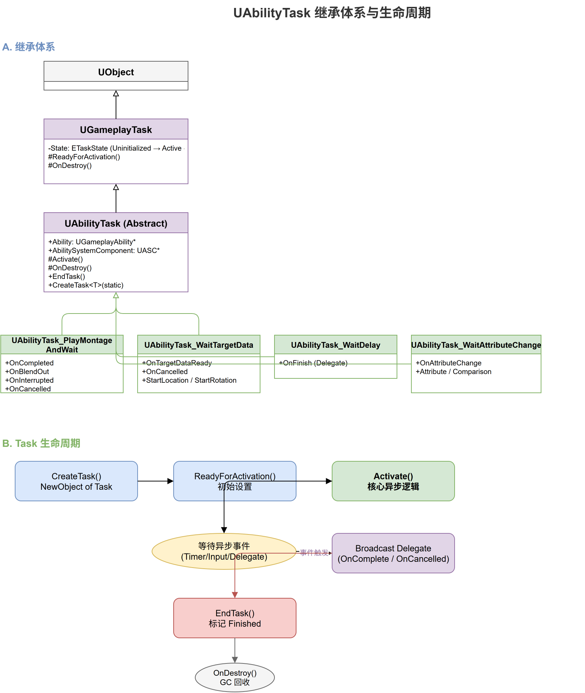

# 深入浅出UE5 GAS（七）：AbilityTask —— 异步编程的艺术

## 系列目录

1. [AbilitySystemComponent —— GAS的心脏](../01-ASC/01-ASC文章.md)
2. [AttributeSet —— 数值系统的基石](../02-AttributeSet/02-AttributeSet文章.md)
3. [GameplayEffect（上）—— 从定义到应用](../03-GameplayEffect/03-GameplayEffect文章-上.md)
4. [GameplayEffect（下）—— Modifier、Stacking与Periodic](../03-GameplayEffect/03-GameplayEffect文章-下.md)
5. [ExecutionCalculation —— 自定义伤害公式](../04-ExecutionCalculation/04-ExecutionCalculation文章.md)
6. [GameplayAbility —— 技能的诞生与消亡](../05-GameplayAbility/05-GameplayAbility文章.md)
7. **（本文）AbilityTask —— 异步编程的艺术**
8. [TargetData —— 索敌与数据传递](../07-TargetData/07-TargetData文章.md)
9. [GameplayCue —— 技能反馈的表现层](../08-GameplayCue/08-GameplayCue文章.md)
10. [网络同步 —— 复制、预测与回滚](../09-Network/09-Network文章.md)
11. [GE Components —— UE 5.3 模块化新范式](../10-GEComponents/10-GEComponents文章.md)
12. [实战全景 —— 调试、陷阱与工程化模式](../11-Practice/11-Practice文章.md)

> 📎 [补遗篇 —— FGameplayAbilitySpec 详解](../12-Others/12-Others文章.md)

---

## 写在前面

想象你要实现一个"蓄力3秒，然后发射火球"的技能。在传统的游戏逻辑中，你可能会用定时器、状态机、协程来处理。写起来大概是这样的：

```cpp
// 伪代码：传统方式
void FireballAbility::Activate()
{
    State = Charging;
    ChargeTime = 0;
    // 每个 Tick 中累加 ChargeTime... 繁琐
}

void FireballAbility::Tick(float DeltaTime)
{
    if (State == Charging)
    {
        ChargeTime += DeltaTime;
        if (ChargeTime >= 3.0f)
        {
            Fire();     // 发射！
            EndAbility();
        }
    }
}
```

GAS 的解决方案是 **AbilityTask**——一个基于 UE 的 GameplayTask 系统构建的异步任务框架。上面的例子用 AbilityTask 写起来是这样的：

```cpp
// GAS 方式：蓝图中的节点连接
// [Play Montage] → [Wait Delay 3s] → [Apply Damage GE] → [End Ability]
```

每个节点代表一个 AbilityTask，它们以声明式的、异步的方式组织在一起。

---

## 二、AbilityTask 的继承体系



```cpp
// 继承链
UGameplayTask           ← UE 的通用异步任务基类
  └─ UAbilityTask       ← GAS 的能力任务基类
       ├─ UAbilityTask_PlayMontageAndWait
       ├─ UAbilityTask_WaitTargetData
       ├─ UAbilityTask_WaitDelay
       ├─ UAbilityTask_WaitGameplayEvent
       ├─ UAbilityTask_WaitAttributeChange
       ├─ UAbilityTask_WaitOverlap
       ├─ UAbilityTask_WaitGameplayTag
       ├─ UAbilityTask_WaitConfirmCancel
       ├─ UAbilityTask_WaitMovementModeChange
       ├─ UAbilityTask_WaitInputPress
       ├─ UAbilityTask_WaitVelocityChange
       ├─ UAbilityTask_Repeat
       └─ ... (项目也可以自定义)
```

### 2.1 UGameplayTask —— 底层基础

```cpp
UCLASS(Abstract, MinimalAPI, meta = (ExposedAsyncProxy))
class UGameplayTask : public UObject
{
    GENERATED_BODY()

public:
    /** 准备激活：在任务需要等待异步初始化完成后调用 */
    virtual void ReadyForActivation();
    
    /** 结束任务 */
    void EndTask();
    
    /** 获取任务状态 */
    EGameplayTaskState GetState() const;
    
protected:
    /** 任务的实际激活入口 */
    virtual void Activate();
    
    /** 任务状态 */
    EGameplayTaskState TaskState;
};
```

`UGameplayTask` 是 UE 提供的一个通用异步任务基类。它本质上提供了一个**可暂停、可恢复、可取消**的任务生命周期管理。

### 2.2 UAbilityTask —— GAS 的扩展

```cpp
UCLASS(Abstract, MinimalAPI)
class UAbilityTask : public UGameplayTask
{
    GENERATED_BODY()

public:
    /** 设置任务所属的 Ability */
    void SetAbilitySystemComponent(UAbilitySystemComponent* InAbilitySystemComponent);
    
    /** 创建一个新任务实例（静态工厂方法模式） */
    template <typename T>
    static T* NewAbilityTask(UClass* Class, UGameplayAbility* OwningAbility, FName TaskInstanceName);
    
protected:
    /** 所属的 Ability */
    UPROPERTY()
    TWeakObjectPtr<UGameplayAbility> Ability;
    
    /** 所属的 ASC */
    UPROPERTY()
    TWeakObjectPtr<UAbilitySystemComponent> AbilitySystemComponent;
};
```

`UAbilityTask` 相比 `UGameplayTask` 的关键增加：

1. **绑定到 Ability**：每个 Task 知道自己属于哪个 Ability
2. **绑定到 ASC**：可以直接访问 ASC 的方法
3. **工厂方法**：`NewAbilityTask` 模板函数负责创建并注册 Task

---

## 三、AbilityTask 的创建流程：NewAbilityTask

这是理解 Task 系统最关键的一段源码：

```cpp
template<typename T>
static T* NewAbilityTask(UClass* Class, UGameplayAbility* InOwningAbility, FName InTaskInstanceName)
{
    check(InOwningAbility);
    
    // 1. 创建 Task 对象
    T* MyObj = NewObject<T>();
    
    // 2. 设置所属 Ability 和 ASC
    MyObj->Ability = InOwningAbility;
    MyObj->AbilitySystemComponent = InOwningAbility->GetAbilitySystemComponentFromActorInfo();
    
    // 3. 初始化 Task（子类的 InitTask 可以在这里做额外设置）
    MyObj->InitTask(*InOwningAbility, MyObj->GetGameplayTaskPriority());
    
    // 4. 如果 Task 需要：实例化额外的子对象
    MyObj->InitSimulatedTask(MyObj->GetTaskName(), MyObj->GetSimulatedTaskInstanceData());
    
    // 5. 返回未激活的 Task
    return MyObj;
}
```

**重要：Task 创建时并不会自动激活。** 你需要调用 `ReadyForActivation()` 来启动它。

### 3.1 ReadyForActivation —— "准备好了"

```cpp
virtual void ReadyForActivation();
```

这个函数将 Task 从 `Uninitialized` 状态转到 `Active` 状态。为什么需要这个额外的步骤？

**答案：为了支持异步初始化。** 一些 Task 在激活前需要先建立网络条件（比如 `WaitTargetData` 需要先向服务器发送请求），`ReadyForActivation` 给了它们一个"等到异步条件就绪后再开始"的机会。

---

## 四、核心 AbilityTask 类型深度分析

### 4.1 UAbilityTask_PlayMontageAndWait —— 等待动画完成

最常用的 Task 之一。它播放动画蒙太奇并在动画完成/混合/中断时触发回调：

```cpp
UCLASS(MinimalAPI)
class UAbilityTask_PlayMontageAndWait : public UAbilityTask
{
    GENERATED_BODY()

public:
    /** 创建并激活（注意它是 StartNew 即创建即激活） */
    UFUNCTION(BlueprintCallable, Category = "Ability|Tasks")
    static UAbilityTask_PlayMontageAndWait* CreatePlayMontageAndWaitProxy(
        UGameplayAbility* OwningAbility,
        FName TaskInstanceName,
        UAnimMontage* MontageToPlay,
        float Rate = 1.f,
        FName StartSection = NAME_None,
        bool bStopWhenAbilityEnds = true,
        float AnimRootMotionTranslationScale = 1.f,
        float StartTimeSeconds = 0.f);

    /** 动画完成时触发 */
    UPROPERTY(BlueprintAssignable)
    FOnMontagePlayDelegate OnCompleted;

    /** 动画混合出时触发 */
    UPROPERTY(BlueprintAssignable)
    FOnMontagePlayDelegate OnBlendOut;

    /** 动画被中断时触发 */
    UPROPERTY(BlueprintAssignable)
    FOnMontagePlayDelegate OnInterrupted;

    /** 动画被取消时触发 */
    UPROPERTY(BlueprintAssignable)
    FOnMontagePlayDelegate OnCancelled;
};
```

注意它的设计：**多个 delegate 对应不同的结束原因**。这让你可以在蓝图中为"动画正常结束"和"动画被打断"写出完全不同的后续逻辑。

### 4.2 UAbilityTask_WaitTargetData —— 等待目标选择

这是网络预测中最复杂的 Task：

```cpp
UCLASS(MinimalAPI)
class UAbilityTask_WaitTargetData : public UAbilityTask
{
    GENERATED_BODY()

public:
    /** 创建 Task */
    UFUNCTION(BlueprintCallable, meta = (...))
    static UAbilityTask_WaitTargetData* WaitTargetData(
        UGameplayAbility* OwningAbility,
        FName TaskInstanceName,
        EGameplayTargetingConfirmation::Type ConfirmationType,
        TSubclassOf<AGameplayAbilityTargetActor> TargetActorClass);

    /** 收到有效目标数据时触发 */
    UPROPERTY(BlueprintAssignable)
    FWaitTargetDataDelegate ValidData;

    /** 被取消时触发 */
    UPROPERTY(BlueprintAssignable)
    FWaitTargetDataDelegate Cancelled;
};
```

**目标选择的网络流程**（LocalPredicted）：

```
Client                              Server
  │                                    │
  ├─ Create WaitTargetData Task        │
  ├─ Spawn TargetActor（如准星）       │
  ├─ ReadyForActivation()              │
  ├─ 等待玩家确认目标...               │
  │                                    │
  ├─ 收到目标数据                      │
  ├─ 发送到服务器 ──────────────────►  │
  │                                    ├─ 验证目标合法性
  │                                    ├─ 重新执行确认逻辑（如果需要）
  │                                    ├─ 返回确认或拒绝
  │  ◄─────────────────────────────── │
  │                                    │
  ├─ OnValidData 或 OnCancelled       │
```

### 4.3 UAbilityTask_WaitDelay —— 等待指定时间

最简单的 Task，但非常重要。它等价于"等3秒然后继续"：

```cpp
UFUNCTION(BlueprintCallable, Category = "Ability|Tasks")
static UAbilityTask_WaitDelay* WaitDelay(UGameplayAbility* OwningAbility, float Time);

UPROPERTY(BlueprintAssignable)
FWaitDelayDelegate OnFinish;
```

### 4.4 UAbilityTask_WaitGameplayEvent —— 等待游戏事件

```cpp
UFUNCTION(BlueprintCallable, Category = "Ability|Tasks")
static UAbilityTask_WaitGameplayEvent* WaitGameplayEvent(
    UGameplayAbility* OwningAbility,
    FGameplayTag EventTag,
    AActor* OptionalExternalTarget = nullptr,
    bool OnlyTriggerOnce = false,
    bool OnlyMatchExact = true);

UPROPERTY(BlueprintAssignable)
FWaitGameplayEventDelegate EventReceived;
```

这让你可以写出"当收到 X 事件时，执行 Y"的逻辑。例如：一个"格挡"技能可以等待"收到攻击事件"→ 格挡伤害 → 反击。

### 4.5 UAbilityTask_WaitAttributeChange —— 监听属性变化

```cpp
UFUNCTION(BlueprintCallable, Category = "Ability|Tasks")
static UAbilityTask_WaitAttributeChange* WaitForAttributeChange(
    UGameplayAbility* OwningAbility,
    FGameplayAttribute Attribute,
    FGameplayTag WithSrcTag,
    FGameplayTag WithoutSrcTag,
    bool TriggerOnce = true,
    AActor* OptionalExternalOwner = nullptr);

UPROPERTY(BlueprintAssignable)
FWaitAttributeChangeDelegate OnAttributeChange;
```

这个 Task 实际是监听 ASC 的 `GetGameplayAttributeValueChangeDelegate` 委托。当指定的属性发生变化时，Task 会被触发。

---

## 五、AbilityTask 的生命周期

```
创建
  │  NewAbilityTask() ── 创建对象，设置所属 Ability/ASC
  │  此时 Task 状态: Uninitialized
  │
  ▼
初始化
  │  InitTask() ── 注册到 ASC 的 Task 列表
  │  
  ▼
等待激活
  │  ReadyForActivation() ── 某些 Task 在此做异步初始化
  │  
  ▼
激活 (Active)
  │  Activate() ── Task 进入主逻辑
  │  例如：PlayMontage 开始播放动画
  │         WaitTargetData 开始等待输入
  │
  ▼
运行中
  │  Tick（如果需要）── 每帧更新
  │  检查触发条件...
  │
  ▼
完成 / 取消
  │  OnDestroy() ── 清理
  │  从 ASC 的 Task 列表中移除
  │
  ▼
EndTask() ── 触发 OnDestroy 委托
```

### 5.1 Task 与 Ability 的联动取消

当 Ability 被取消时（`EndAbility(bWasCancelled=true)`），ASC 会遍历所有活跃的 Task 并调用它们的 `ExternalCancel()`：

```cpp
void UGameplayAbility::EndAbility(...)
{
    // ...
    // 所有活跃的 Task 被取消
    AbilitySystemComponent->AbilityAbilityTasksDone(*this);
    // ...
}
```

这个机制确保了：**当技能被中断时，所有相关的 Task（比如正在播放的动画、正在等待的目标选择）都会被正确清理。**

---

## 六、扩展：如何自定义 AbilityTask

GAS 的 Task 系统是开放的，你可以创建自己的 Task。步骤很简单：

```cpp
// MyWaitForProjectileHit.h
UCLASS()
class UAbilityTask_MyWaitForProjectileHit : public UAbilityTask
{
    GENERATED_BODY()

public:
    // 1. 工厂方法
    UFUNCTION(BlueprintCallable, Category = "Ability|Tasks")
    static UAbilityTask_MyWaitForProjectileHit* WaitForProjectileHit(
        UGameplayAbility* OwningAbility, 
        AMyProjectile* Projectile);

    // 2. 委托（在蓝图中体现为 Exec Pin）
    UPROPERTY(BlueprintAssignable)
    FProjectileHitDelegate OnHit;

    virtual void Activate() override
    {
        Super::Activate();
        if (Projectile.IsValid())
        {
            Projectile->OnProjectileHit.AddDynamic(this, &UAbilityTask_MyWaitForProjectileHit::OnProjectileHitCallback);
        }
        else
        {
            EndTask(); // 如果投射物无效，直接结束
        }
    }

private:
    UFUNCTION()
    void OnProjectileHitCallback(AActor* HitActor)
    {
        if (ShouldBroadcastAbilityTaskDelegates())
        {
            OnHit.Broadcast(HitActor);
        }
        EndTask();
    }

    TWeakObjectPtr<AMyProjectile> Projectile;
};
```

在蓝图中，你的 Task 会以 `WaitForProjectileHit` 节点的形式出现，输出一个 `OnHit` Exec Pin，与其他 Task 连成流程。

---

### 七、设计思考：为什么是Task模式？

GAS 选择 Task 模式而不是协程、状态机或其他方案，有几个原因：

### 7.1 网络友好

Task 的创建和状态变化都可以通过网络复制。`WaitTargetData` 在客户端创建的 Task，其状态（等待中、已完成）可以通过网络同步。这是纯协程做不到的。

### 7.2 可取消性

Ability 被取消时，Task 会被自动清理——不需要手动编写"如果技能被中断，停止这个定时器，关闭那个委托..."的代码。

### 7.3 蓝图可视化

Task 的委托输出（Exec Pin + Data Pin）完美映射到蓝图的节点连线系统，让设计师也能编排复杂的异步逻辑。

### 7.4 可组合性

多个 Task 可以同时运行——你可以边播放动画边等待目标选择，再等待一个事件触发——所有这些并行执行而不互相干扰。

---

## 八、总结与回顾

AbilityTask 是 GAS 实现异步能力的核心机制：

| Task 类型 | 核心功能 | 委托输出 |
|----------|---------|---------|
| PlayMontageAndWait | 播放动画并等待 | OnCompleted / OnBlendOut / OnInterrupted / OnCancelled |
| WaitTargetData | 等待目标选择 | ValidData / Cancelled |
| WaitDelay | 延迟指定时间 | OnFinish |
| WaitGameplayEvent | 等待游戏事件 | EventReceived |
| WaitAttributeChange | 监听属性变化 | OnAttributeChange |
| WaitConfirmCancel | 等待确认/取消输入 | OnConfirm / OnCancel |
| WaitGameplayTag | 等待Tag添加/移除 | Added / Removed |

核心设计思想：

1. **创建-初始化-激活**三段式生命周期，支持异步初始化
2. **多委托输出**：让同一个 Task 的不同结果走向不同的后续逻辑
3. **自动清理**：Ability 结束时自动清理所有 Task
4. **网络透明**：Task 的状态变化可以被预测和复制
5. **蓝图友好**：委托映射到 Exec Pin，完美适配蓝图节点模型

**下一篇预告**：技能如何"选中目标"？`FGameplayAbilityTargetData` 的多态设计是 GAS 中最容易被忽视但最重要的抽象之一。下一篇我们将深入 TargetData 和 TargetActor 的完整继承体系。

---

*本系列文章基于 UE 5.8 源码分析，GameplayAbilities 插件路径：`Engine/Plugins/Runtime/GameplayAbilities`*
