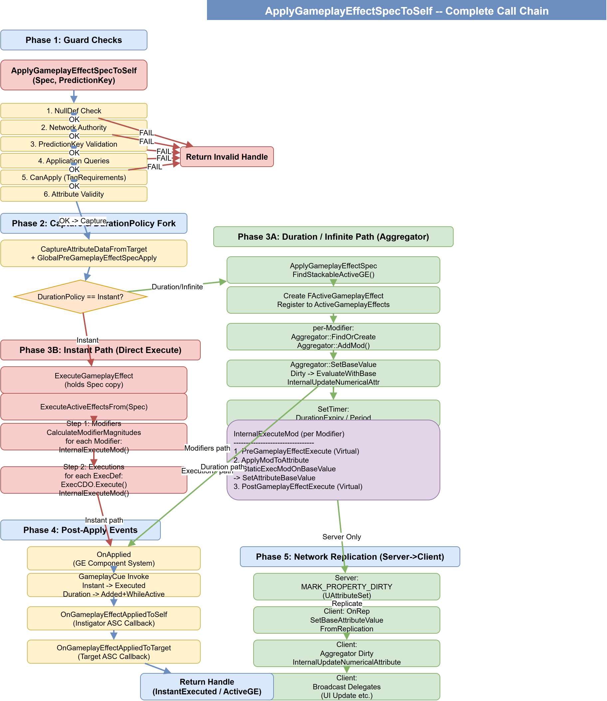

# 06 | GameplayEffect — 效果与计算 (下)

> **本篇**：执行流程与计算

> **系列**: 《Inside GAS》— UE5 GameplayAbilitySystem 源码深度分析  
> **难度**: 🔵 核心 → 🔴 源码  
> **字数**: ~5000  
> **前置**: 05-GameplayEffect  
> **源码路径**: `Engine/Plugins/Runtime/GameplayAbilities/Source/GameplayAbilities/Private/GameplayEffect.cpp`

---

> **系列导航**
> 
> | 阶段 | 篇章 | 内容 | 状态 |
> |------|------|------|------|
> | 🟢 基础 | 01 | GAS 总览与核心架构 | ✅ |
> | | 02 | ASC — 核心调度器 | ✅ |
> | | 03 | GameplayTags — 通用语言 | ✅ |
> | | 04 | AttributeSet — 属性定义与复制 | ✅ |
> | 🔵 核心 | 05 | GameplayEffect — 效果与计算 (上) | ✅ |
> | | **06** | **GameplayEffect — 效果与计算 (下)** | ✅ |
> | | 07 | GameplayAbility — 技能激活与核心框架 (上) | 📝 |
> | | 08 | GameplayAbility — Task/输入/预测 (下) | 📝 |
> | | 09 | GameplayCue — 表现层触发机制 | 📝 |
> | 🔴 高级 | 10 | Prediction — 预测与回滚 | 📝 |
> | | 11 | GE Components — 组件化架构演进 | 📝 |
> | | 12 | Network & Serial — 网络序列化 | 📝 |
> | | 13 | Targeting — 瞄准系统 | 📝 |
> | | 14 | Debug & Optimization — 调试与优化 | 📝 |
> | | 15 | 终篇回顾 — 全景复习 | 📝 |

---

**上篇** 讲了 GE 的数据结构：Duration Policy、Modifier 体系、Tags、Stacking、GameplayEffectComponent、Spec、Context。

**本篇** 进入运行时：从 `ApplyGameplayEffectSpecToSelf` 开始，追踪 Instant GE 直写属性 vs Duration GE 注册 Aggregator 两条路径的完整调用链，以及 ExecutionCalculation 自定义计算、Period 周期执行、网络同步策略、GameplayCue 触发时机。

---

## 一、问题驱动：施加一个 GE 到底发生了什么？

你可能以为 `ApplyGameplayEffectSpecToSelf` 就是"算一下数值然后写进去"，它隐藏了十几步检查、两条完全不同的执行路径、多个回调触发点、以及网络预测的分支处理。

```cpp
// 用户视角：一行调用
ASC->ApplyGameplayEffectSpecToSelf(*Spec.Data);

// 实际发生的：
// 1. 网络权限检查
// 2. Application Query 检查
// 3. CanApply() 检查 (TargetTagRequirements 等)
// 4. Attribute 有效性检查
// 5. [分叉] Instant → ExecuteGameplayEffect; Duration → ApplyGameplayEffectSpec
// 6. OnApplied 事件
// 7. OnGameplayEffectAppliedToSelf / OnGameplayEffectAppliedToTarget 回调
// 8. GameplayCue 触发
```

本章我们逐行比对这些步骤的源码实现。

---

## 二、完整调用链全景图

> 下图为文本版快速索引（适合搜索/跳转），完整的视觉流程图见下方大图。

```
ApplyGameplayEffectSpecToSelf(Spec, PredictionKey)
    │
    ├─ **[1]** Guard Checks
    │   ├─ Spec.Def == nullptr? → return
    │   ├─ HasNetworkAuthorityToApplyGameplayEffect? → return
    │   ├─ PredictionKey 安全校验 (Period 不允许预测)
    │   ├─ GameplayEffectApplicationQueries 检查
    │   ├─ Spec.Def->CanApply() → TagRequirements + GE Components 检查
    │   └─ Modifiers[i].Attribute.IsValid()
    │
    ├─ **[2]** 路径分叉
    │   │
    │   ├─ [Duration / Infinite]
    │   │   └─ ActiveGameplayEffects.ApplyGameplayEffectSpec()
    │   │       ├─ FindStackableActiveGameplayEffect() → 叠加 or 新建
    │   │       ├─ 注册到 ActiveGameplayEffects 列表
    │   │       └─ Aggregator::SetBaseValue(NewBase)
    │   │           └─ Dirty → InternalUpdateNumericalAttribute → SetNumericValueChecked
    │   │               └─ Broadcast OnAttributeChange
    │   │
    │   └─ [Instant]
    │       └─ ExecuteGameplayEffect(*OurCopyOfSpec, PredictionKey)
    │           └─ ActiveGameplayEffects.ExecuteActiveEffectsFrom()
    │               │
    │               ├─ **[3]** Modifiers 执行 (for each ModIdx)
    │               │   ├─ SourceTags / TargetTags 检查
    │               │   ├─ GetModifierMagnitude(ModIdx)
    │               │   └─ InternalExecuteMod()
    │               │       ├─ PreGameplayEffectExecute()   ← Virtual, 可阻止
    │               │       ├─ ApplyModToAttribute()
    │               │       │   └─ StaticExecModOnBaseValue → SetAttributeBaseValue
    │               │       │       └─ Aggregator::SetBaseValue → Dirty → ...
    │               │       └─ PostGameplayEffectExecute()   ← Virtual
    │               │
    │               ├─ **[4]** Executions 执行 (for each ExecDef)
    │               │   └─ ExecCDO->Execute(ExecutionParams, ExecutionOutput)
    │               │       └─ for each OutputModifier:
    │               │           └─ InternalExecuteMod()  (同 [3])
    │               │
    │               └─ **[5]** GameplayCue Execute
    │
    ├─ **[6]** OnApplied (GE Component system)
    │
    ├─ **[7]** Callbacks
    │   ├─ OnGameplayEffectAppliedToSelf(InstigatorASC, *Spec, Handle)
    │   └─ OnGameplayEffectAppliedToTarget(this, *Spec, Handle)
    │
    └─ **[8]** Return Handle (InstantExecutedHandle / ActiveGE Handle)
```


*ApplyGameplayEffectSpecToSelf 完整调用链流程图*

---

## 三、Guard Checks：能不能施加？

```cpp
// AbilitySystemComponent.cpp ~923-984
FActiveGameplayEffectHandle UAbilitySystemComponent::ApplyGameplayEffectSpecToSelf(
    const FGameplayEffectSpec &Spec, FPredictionKey PredictionKey)
{
    // 1. Null Def 检查
    if (Spec.Def == nullptr) return FActiveGameplayEffectHandle();

    // 2. 网络权限
    if (!HasNetworkAuthorityToApplyGameplayEffect(PredictionKey))
        return FActiveGameplayEffectHandle();

    // 3. Period 不允许预测（客户端）
    if (PredictionKey.IsValidKey() && Spec.GetPeriod() > 0.f)
    {
        if (IsOwnerActorAuthoritative())
            PredictionKey = FPredictionKey();  // Server 继续但不预测
        else
            return FActiveGameplayEffectHandle();  // Client 直接拒绝
    }

    // 4. Application Queries（自定义查询拦截）
    for (const FGameplayEffectApplicationQuery& ApplicationQuery :
         GameplayEffectApplicationQueries)
    {
        if (!ApplicationQuery.Execute(ActiveGameplayEffects, Spec))
            return FActiveGameplayEffectHandle();
    }

    // 5. CanApply — TargetTagRequirements 等
    if (!Spec.Def->CanApply(ActiveGameplayEffects, Spec))
        return FActiveGameplayEffectHandle();

    // 6. Attribute 有效性
    for (const FGameplayModifierInfo& Mod : Spec.Def->Modifiers)
    {
        if (!Mod.Attribute.IsValid())
            return FActiveGameplayEffectHandle();
    }
    // ...
}
```

**关键细节**：

- **Period 预测禁止**：预测的周期性效果会导致客户端累积过多重复执行，UE 直接禁止。
- **CanApply 是 GE Components 的入口**：`TargetTagRequirementsGameplayEffectComponent` 等组件在此被调用。
- **Application Queries** 是 GAS 框架暴露的扩展点，可以让外部逻辑控制 GE 是否可施加。

## 四、Instant 执行链路

### 4.1 路径分叉：Instant vs Duration

```cpp
// AbilitySystemComponent.cpp ~1001-1084
if (Spec.Def->DurationPolicy != EGameplayEffectDurationType::Instant
    || bTreatAsInfiniteDuration)
{
    // Duration / Infinite 路径
    AppliedEffect = ActiveGameplayEffects.ApplyGameplayEffectSpec(
        Spec, PredictionKey, bFoundExistingStackableGE);
    
    MyHandle = AppliedEffect->Handle;
    OurCopyOfSpec = &(AppliedEffect->Spec);
    // Spec 已经被 ApplyGameplayEffectSpec 内部复制到 AppliedEffect 中
}
else
{
    // Instant 路径 — 我们自己持有 Spec 副本
    StackSpec = MakeUnique<FGameplayEffectSpec>(Spec);
    OurCopyOfSpec = StackSpec.Get();
    
    GlobalPreGameplayEffectSpecApply(*OurCopyOfSpec, this);
    OurCopyOfSpec->CaptureAttributeDataFromTarget(this);
}

// Instant: 执行一次就完事
if (Spec.Def->DurationPolicy == EGameplayEffectDurationType::Instant)
{
    ExecuteGameplayEffect(*OurCopyOfSpec, PredictionKey);
}
```

**两条路径的根本差异**：

| | Instant | Duration / Infinite |
|---|---|---|
| 是否有 ActiveGE | 无 | 有，注册到 ActiveGameplayEffects |
| 属性修改方式 | 直接 SetAttributeBaseValue | 通过 Aggregator 管理 |
| 是否能被移除 | 不能 | 能 (RemoveActiveGameplayEffect) |
| 是否有 Stack | 不能 | 能 |
| 是否有 Period | 不能 | 能 |
| 预测处理 | 客户端伪造成 Infinite 持续 | 正常同步 |

> **CaptureAttributeDataFromTarget** 在 DurationPolicies 分叉之后的 Instant 分支内执行。它从 Source（Instigator）和 Target 的 ASC 快照属性值，供后续 `ModifierMagnitude` 计算和 `ExecutionCalculation` 捕获使用。Duration GE 的属性捕获发生在 `CreateActiveGE` 阶段，逻辑类似但时机不同。

### 4.2 Instant 的预测特殊处理

```cpp
// 客户端：Instant GE 被当作 Infinite Duration 处理
bool bTreatAsInfiniteDuration = 
    GetOwnerRole() != ROLE_Authority 
    && PredictionKey.IsLocalClientKey() 
    && Spec.Def->DurationPolicy == EGameplayEffectDurationType::Instant;
```

客户端预测的 Instant GE 会被转换为"Infinite Duration"形式临时存储，等 Server 确认后清理。所以客户端上这个"假 Infinite"**不会**被 Period 定期执行——它本来就没有 Period。

---

### 4.3 ExecuteActiveEffectsFrom：执行核心

```cpp
// GameplayEffect.cpp ~3168
void FActiveGameplayEffectsContainer::ExecuteActiveEffectsFrom(
    FGameplayEffectSpec &Spec, FPredictionKey PredictionKey)
{
    // Step 0: 捕获目标 Tags
    Spec.CapturedTargetTags.GetActorTags().Reset();
    Owner->GetOwnedGameplayTags(Spec.CapturedTargetTags.GetActorTags());
    
    Spec.CalculateModifierMagnitudes();

    // ======= Step 1: Modifiers 执行 =======
    for (int32 ModIdx = 0; ModIdx < Spec.Modifiers.Num(); ++ModIdx)
    {
        const FGameplayModifierInfo& ModDef = Spec.Def->Modifiers[ModIdx];
        
        // Tag 条件检查
        if (!ModDef.SourceTags.IsEmpty() 
            && !ModDef.SourceTags.RequirementsMet(Spec.CapturedSourceTags.GetActorTags()))
            continue;
        if (!ModDef.TargetTags.IsEmpty() 
            && !ModDef.TargetTags.RequirementsMet(Spec.CapturedTargetTags.GetActorTags()))
            continue;

        FGameplayModifierEvaluatedData EvalData(
            ModDef.Attribute, ModDef.ModifierOp, 
            Spec.GetModifierMagnitude(ModIdx));
        
        InternalExecuteMod(Spec, EvalData);
    }

    // ======= Step 2: Executions 执行 =======
    for (const FGameplayEffectExecutionDefinition& CurExecDef : Spec.Def->Executions)
    {
        if (CurExecDef.CalculationClass)
        {
            const UGameplayEffectExecutionCalculation* ExecCDO = 
                CurExecDef.CalculationClass->GetDefaultObject<UGameplayEffectExecutionCalculation>();
            
            FGameplayEffectCustomExecutionParameters ExecutionParams(
                Spec, CurExecDef.CalculationModifiers, Owner, 
                CurExecDef.PassedInTags, PredictionKey);
            FGameplayEffectCustomExecutionOutput ExecutionOutput;
            
            ExecCDO->Execute(ExecutionParams, ExecutionOutput);

            // 将 Execution 的输出 Modifiers 逐个执行
            for (FGameplayModifierEvaluatedData& CurExecMod : 
                 ExecutionOutput.GetOutputModifiersRef())
            {
                InternalExecuteMod(Spec, CurExecMod);
            }
        }
    }

    // ======= Step 3: GameplayCue =======
    // ...
}
```

**执行顺序**：Modifiers 在先，Executions 在后。

这个顺序有实际影响：在 Execution 里捕获被 Modifier 改过的属性，拿到的是修改后的值——因为 Modifiers 跑在 Executions 前面。

### 4.4 InternalExecuteMod：单个 Modifier 执行

```cpp
// GameplayEffect.cpp ~4048
bool FActiveGameplayEffectsContainer::InternalExecuteMod(
    FGameplayEffectSpec& Spec, FGameplayModifierEvaluatedData& ModEvalData)
{
    bool bExecuted = false;

    UAttributeSet* AttributeSet = Owner->GetAttributeSubobject(
        ModEvalData.Attribute.GetAttributeSetClass());
    
    if (AttributeSet)
    {
        FGameplayEffectModCallbackData ExecuteData(Spec, ModEvalData, *Owner);

        // **[1]** PreGameplayEffectExecute — Virtual，可返回 false 阻止此 Modifier
        if (AttributeSet->PreGameplayEffectExecute(ExecuteData))
        {
            // **[2]** 直接写 BaseValue
            ApplyModToAttribute(
                ModEvalData.Attribute, 
                ModEvalData.ModifierOp, 
                ModEvalData.Magnitude, 
                &ExecuteData);
            
            // **[3]** PostGameplayEffectExecute — 跨属性联动
            AttributeSet->PostGameplayEffectExecute(ExecuteData);
        }
    }
    return bExecuted;
}
```

**Pre / Post 回调用途**：

```cpp
// 典型用法 — 在 AttributeSet 子类中重写
void UMyAttributeSet::PreGameplayEffectExecute(FGameplayEffectModCallbackData &Data)
{
    // Clamp 逻辑：伤害不能低于 0
    if (Data.EvaluatedData.Attribute == GetDamageAttribute())
    {
        if (Data.EvaluatedData.Magnitude < 0) Data.EvaluatedData.Magnitude = 0;
    }
}

void UMyAttributeSet::PostGameplayEffectExecute(FGameplayEffectModCallbackData &Data)
{
    // 跨属性联动：Health 变化后更新 UI
    if (Data.EvaluatedData.Attribute == GetHealthAttribute())
    {
        SetHealth(FMath::Clamp(GetHealth(), 0.f, GetMaxHealth()));
    }
    // 同步修改计算属性
    if (Data.EvaluatedData.Attribute == GetAttackBaseAttribute())
    {
        UpdateAttackPower();
    }
}
```

### 4.5 ApplyModToAttribute：直写 BaseValue

```cpp
// GameplayEffect.cpp ~4114
void FActiveGameplayEffectsContainer::ApplyModToAttribute(
    const FGameplayAttribute &Attribute, 
    EGameplayModOp::Type ModifierOp, 
    float ModifierMagnitude, 
    const FGameplayEffectModCallbackData* ModData)
{
    CurrentModcallbackData = ModData;
    
    float CurrentBase = GetAttributeBaseValue(Attribute);
    float NewBase = FAggregator::StaticExecModOnBaseValue(CurrentBase, ModifierOp, ModifierMagnitude);
    
    SetAttributeBaseValue(Attribute, NewBase);  // → 触发 Dirty 链
}
```

`StaticExecModOnBaseValue` 就是执行 ModOp 运算：

```cpp
float FAggregator::StaticExecModOnBaseValue(float BaseValue, EGameplayModOp::Type ModifierOp, float Magnitude)
{
    switch (ModifierOp)
    {
    case EGameplayModOp::Additive:        return BaseValue + Magnitude;
    case EGameplayModOp::Multiplicitive:  return BaseValue * Magnitude;
    case EGameplayModOp::Division:        return BaseValue / Magnitude;
    case EGameplayModOp::Override:        return Magnitude;
    }
    return BaseValue;
}
```

---

## 五、Duration GE 与 Aggregator

Instant GE 通过 `ExecuteActiveEffectsFrom` 直写属性。Duration GE 则走了完全不同的路径：

### 5.1 ApplyGameplayEffectSpec：注册到容器

```cpp
// GameplayEffect.cpp ~4130
FActiveGameplayEffect* FActiveGameplayEffectsContainer::ApplyGameplayEffectSpec(
    const FGameplayEffectSpec& Spec, FPredictionKey& InPredictionKey, 
    bool& bFoundExistingStackableGE)
{
    // 1. 查找是否有可叠加的现有 GE
    FActiveGameplayEffect* ExistingStackableGE = FindStackableActiveGameplayEffect(Spec);

    // 2. 不存在则创建新的 FActiveGameplayEffect
    FActiveGameplayEffect& NewEffect = GameplayEffects_Internal[GameplayEffects_Internal.Emplace()];
    NewEffect.Spec = Spec;           // 复制 Spec
    NewEffect.StartServerWorldTime = GetWorld()->GetTimeSeconds();
    NewEffect.StartWorldTime = ...;
    
    // 3. 为每个 Modifier 创建 Aggregator Mod
    for (int32 ModIdx = 0; ModIdx < Spec.Def->Modifiers.Num(); ++ModIdx)
    {
        FAggregatorRef& AggregatorRef = FindOrCreateAttributeAggregator(ModDef.Attribute);
        
        FAggregatorMod* Mod = new FAggregatorMod();
        Mod->EvaluatedData = ...;           // ModOp, Magnitude
        Mod->SourceTagReqs = ModDef.SourceTags;
        Mod->TargetTagReqs = ModDef.TargetTags;
        Mod->ActiveHandle = NewEffect.Handle;
        
        AggregatorRef.Get()->AddMod(Mod);   // 注册到 Aggregator
    }
    
    // 4. 设置定时器（Duration Expiry + Period）
    if (NewEffect.GetDuration() > 0)
    {
        // SetTimer 在 Duration 秒后调用 CheckDurationExpired
    }
    if (NewEffect.GetPeriod() > 0)
    {
        // SetTimer 每 Period 秒调用 ExecutePeriodicGameplayEffect
    }
    
    return &NewEffect;
}
```

### 5.2 Aggregator 的工作方式

```
BaseValue  --------+
                    |
                    v
[GE1 Mod: +20] → Aggregator → EvaluateWithBase → CurrentValue
[GE2 Mod: *1.5] →            ↑
[GE3 Mod: +10]  →            |
                              When Dirty:
                              InternalUpdateNumericalAttribute
                              → SetNumericValueChecked
                              → Broadcast Delegates
```

Duration GE 不直接写 `BaseValue`，而是把 Mod 注册到 Aggregator：

```cpp
// 简化版本，实际还涉及 ModChannel 分通道计算
// GameplayEffectAggregator.cpp
float FAggregator::EvaluateWithBase(float InlineBaseValue, 
    const FAggregatorEvaluateParameters& Parameters)
{
    float Result = InlineBaseValue;
    
    for (FAggregatorMod* Mod : ModList)
    {
        // 检查 Tag Requirements 是否满足
        if (!Mod->Qualifies(Parameters)) continue;
        
        Result = FAggregator::StaticExecModOnBaseValue(Result, Mod->ModifierOp, Mod->Magnitude);
    }
    return Result;
}
```

BaseValue 不变，但 CurrentValue 通过 `EvaluateWithBase` 动态计算。

当 BaseValue 改变（或 Mod 增删）时，Aggregator 变 Dirt → 触发 `InternalUpdateNumericalAttribute` → 写 CurrentValue → 触发属性变化回调。这个链路在[第 04 篇](../04-AttributeSet/04-AttributeSet文章.md)中已详细分析。

---

## 六、Execution Calculation：自定义计算

当普通的 Modifier 计算不够用时，使用 `UGameplayEffectExecutionCalculation`。

### 6.1 与 Modifier 的区别

| | Modifier | Execution Calculation |
|---|---|---|
| 输入 | 仅 Magnitude | 可捕获任意属性 |
| 输出 | 单个 ModOp + Magnitude | 多个独立 Modifier |
| 逻辑 | 纯数值 | 任意 C++ 逻辑 |
| 网络 | 自动同步 | 只在 Server 执行 |
| 典型场景 | 固定值伤害、Buff | 复杂伤害公式、属性联动 |

**编写 ExecutionCalculation**

```cpp
UCLASS()
class UMyDamageExecution : public UGameplayEffectExecutionCalculation
{
    GENERATED_BODY()
    
public:
    UMyDamageExecution()
    {
        // 声明需要捕获的属性
        FGameplayEffectAttributeCaptureDefinition AttackDef;
        AttackDef.AttributeToCapture = FGameplayAttribute::FindAttribute("AttackPower");
        AttackDef.AttributeSource = EGameplayEffectAttributeCaptureSource::Source;
        RelevantAttributesToCapture.Add(AttackDef);
        
        FGameplayEffectAttributeCaptureDefinition DefenseDef;
        DefenseDef.AttributeToCapture = FGameplayAttribute::FindAttribute("Defense");
        DefenseDef.AttributeSource = EGameplayEffectAttributeCaptureSource::Target;
        RelevantAttributesToCapture.Add(DefenseDef);
    }

    virtual void Execute_Implementation(
        const FGameplayEffectCustomExecutionParameters& ExecutionParams,
        FGameplayEffectCustomExecutionOutput& OutExecutionOutput) const override
    {
        // 捕获属性值
        float Attack = 0.f;
        ExecutionParams.AttemptCalculateCapturedAttributeMagnitude(
            RelevantAttributesToCapture[0], FAggregatorEvaluateParameters(), Attack);
        
        float Defense = 0.f;
        ExecutionParams.AttemptCalculateCapturedAttributeMagnitude(
            RelevantAttributesToCapture[1], FAggregatorEvaluateParameters(), Defense);
        
        // 自定义计算
        float Damage = FMath::Max(0.f, Attack - Defense * 0.5f);
        
        // 输出到目标属性
        OutExecutionOutput.AddOutputModifier(
            FGameplayModifierEvaluatedData(
                FGameplayAttribute::FindAttribute("Health"),
                EGameplayModOp::Additive, -Damage));
    }
};
```

**Capture 的时机与 Source/Target**

`RelevantAttributesToCapture` 在构函数中声明。框架在 GE 执行前自动 Snapshot 这些属性值（取决于 `SnapshotPolicy`）：

- **Snapshot**：在 GE Spec 创建时捕获 → 后续使用冻结值（Instant GE 等价于此模式）
- **Not Snapshot**：在每次 evaluation 时捕获 → 动态计算（Duration GE 常用此模式，每次周期执行时重新读取当前属性值）

`AttributeSource` 决定从谁身上取：

| Source | 含义 |
|--------|------|
| Source | 施法者 |
| Target | 目标 |

---

## 七、Period 周期执行

Periodic GE 的工作方式是将 `ExecuteActiveEffectsFrom` 定时重复执行。

**注册 Period Timer**

```cpp
// GameplayEffect.cpp, ApplyGameplayEffectSpec 内
if (ActiveEffect.Spec.GetPeriod() > UGameplayEffect::NO_PERIOD)
{
    FTimerManager& TimerManager = World->GetTimerManager();
    FTimerDelegate Delegate = FTimerDelegate::CreateUObject(Owner, 
        &UAbilitySystemComponent::ExecutePeriodicGameplayEffect, Handle);
    
    TimerManager.SetTimer(Delegate, Period, bLoop);
}
```

**周期执行函数**

```cpp
// GameplayEffect.cpp ~3330
// 实际通过 FActiveGameplayEffectHandle 定位，此处简化为直接引用对象
void FActiveGameplayEffectsContainer::ExecutePeriodicGameplayEffect(
    FActiveGameplayEffect& ActiveEffect)
{
    if (!ActiveEffect.bIsInhibited)
    {
        // 清空上次周期的修改记录
        ActiveEffect.Spec.ModifiedAttributes.Empty();
        
        // 再次执行 ExecuteActiveEffectsFrom — 和 Instant 一样的逻辑！
        ExecuteActiveEffectsFrom(ActiveEffect.Spec);
        
        // 触发 Period 专用回调
        Owner->OnPeriodicGameplayEffectExecuteOnSelf(SourceASC, ActiveEffect.Spec, Handle);
        if (SourceASC)
            SourceASC->OnPeriodicGameplayEffectExecuteOnTarget(Owner, ActiveEffect.Spec, Handle);
    }
}
```

**关键点**：
- Period 执行和 Instant 执行走完全相同的 `ExecuteActiveEffectsFrom` 路径
- 每次执行前清空 `ModifiedAttributes`，只保留最近一次周期的修改记录
- `bIsInhibited = true` 时（即 Duration GE 的持续条件 Tags 不满足），周期执行跳过

**Period 与 Stacking 的组合**

如果 GE 有 `Stacking` 且 `Period` 存在：

1. Period 执行时读取 `Spec.GetStackCount()` — 层数
2. ExecutionCalculation 中可以通过 `ExecutionParams.GetOwningSpec().GetStackCount()` 获取当前层数
3. 层数变化时不需要重新创建 Timer — 同一个 Timer 每次执行时读取当前 `StackCount`<br>
   **示例**：GE 配置 `Damage = StackCount × 10`，`Period = 1s`。1 层时每秒 10 点伤害，叠到 3 层后同一 Timer 下次执行自动变为 3×10=30 点

---

## 八、网络同步、GameplayCue 与移除

### 8.1 网络同步策略

**同步什么**

| 同步内容 | 机制 |
|----------|------|
| BaseValue | `DOREPLIFETIME` UPROPERTY 自动同步 |
| FActiveGameplayEffect | Server 仅同步 **Handle + Spec Level + Source** |
| CurrentValue | **不同步** — 客户端用本地 Aggregator 计算 |
| GE Tags (GrantedTags) | 通过 GameplayTag 系统同步 |

**客户端收到 BaseValue 后**

```cpp
// 客户端 OnRep → SetBaseAttributeValueFromReplication
void UAbilitySystemComponent::SetBaseAttributeValueFromReplication(
    FGameplayAttribute Attribute, float NewValue)
{
    // 与 Server 的 SetAttributeBaseValue 一样
    // Aggregator Dirty → InternalUpdateNumericalAttribute → SetNumericValueChecked
}
```

客户端**不存**所有 GE 的完整 Mod 数据，只存 BaseValue。`EvaluateWithBase` 时客户端本地 Aggregator 算出 CurrentValue。换句话说，**客户端无法区分 CurrentValue 是由哪些 GE 贡献的**。不过对游戏逻辑来说够了——客户端只需要最终值。

**预测的特殊处理**

```cpp
// 客户端预测 Instant GE：
// 1. 客户端创建一个 Fake Infinite Duration GE
// 2. 执行效果（本地预测，立即看到结果）
// 3. 发送 RPC 给 Server，Server 真正执行
// 4. Server 回复 → 客户端清理 Fake GE ← 关键：如果 Server 拒绝了怎么办？

// 如果 Server 拒绝，通过 RejectedPredictionKey 回滚：
void UAbilitySystemComponent::RejectedGameplayEffect(FActiveGameplayEffectHandle Handle)
{
    // 从客户端列表移除
    ActiveGameplayEffects.RemoveActiveGameplayEffect(Handle);
    // Aggregator 自动重新计算
}
```

---

### 8.2 GameplayCue 触发时机

GameplayCue 是 GAS 的可视化反馈系统（将在后续文章详述），这里只讲它在 GE 中的触发时机。

**触发方式**

| GE 类型 | GC 类型 | 触发时机 |
|---------|---------|----------|
| Instant | `Execute` | `ExecuteActiveEffectsFrom` 执行完 Modifier/Execution 后触发 |
| Duration / Infinite | `OnActive` + `WhileActive` | 施加时各触发一次；`WhileActive` 表示"效果激活期间 cue 保持激活" |
| Duration 移除 | `Removed` | GE 移除时触发 |

> **关键纠正**：Instant 的判定发生在 `ApplyGameplayEffectSpecToSelf`（`DurationPolicy == Instant` → `ExecuteGameplayEffect` → `ExecuteActiveEffectsFrom`），而 `ExecuteActiveEffectsFrom` 内部**并不判断** DurationPolicy。因此 Period GE 每次周期执行同样会走这条路径并触发 `Execute` cue（呼应 §9.4）。

**源码中的触发逻辑**

三个触发点分散在 `GameplayEffect.cpp` 的几处：

```cpp
// 1. Instant / Period 执行：ExecuteActiveEffectsFrom 末尾
bool InvokeGameplayCueExecute = (!bHasModifiersOrExecutions)
                             || !Spec.Def->bRequireModifierSuccessToTriggerCues;
if (bHasModifiersOrExecutions && ModifierSuccessfullyExecuted)
{
    InvokeGameplayCueExecute = true;
}
if (GameplayCuesWereManuallyHandled)   // Execution 声明手动处理
{
    InvokeGameplayCueExecute = false;
}
if (InvokeGameplayCueExecute && SpecToUse.Def->GameplayCues.Num())
{
    GetGameplayCueManager()->InvokeGameplayCueExecuted_FromSpec(Owner, SpecToUse, PredictionKey);
}

// 2. Duration 施加：AddActiveGameplayEffectGrantedTagsAndModifiers
if (!Owner->bSuppressGameplayCues)
{
    Owner->UpdateTagMap(Cue.GameplayCueTags, 1, EGameplayTagReplicationState::None);
    if (bInvokePredictedEffects)   // 施加时 = (DurationPolicy != Instant)
    {
        Owner->InvokeGameplayCueEvent(Effect.Spec, EGameplayCueEvent::OnActive);
        Owner->InvokeGameplayCueEvent(Effect.Spec, EGameplayCueEvent::WhileActive);
    }
}

// 3. Duration 移除：RemoveActiveGameplayEffectGrantedTagsAndModifiers
if (bInvokePredictedEffects)
{
    Owner->InvokeGameplayCueEvent(Effect.Spec, EGameplayCueEvent::Removed);
}
```

真正的分发入口是 `UAbilitySystemComponent::InvokeGameplayCueEvent`（`AbilitySystemComponent.cpp`），它最终调用 `GameplayCueManager->HandleGameplayCues(ActorAvatar, CueTags, EventType, CueParams)`。而 `InvokeGameplayCueExecuted_FromSpec` / `InvokeGameplayCueAddedAndWhileActive_FromSpec` 是 `UGameplayCueManager` 的入口，主要用于网络广播（minimal replication 或 multicast RPC）；本地直接触发走的是 `InvokeGameplayCueEvent`。

**抑制规则（自外向内多层）**

- `bSuppressGameplayCues`（ASC 级）：总开关，为 true 时所有 GC 触发全部跳过
- `bRequireModifierSuccessToTriggerCues = true`（GE 级，仅影响 `Execute` cue）：有 Modifier/Execution 时必须 `ModifierSuccessfullyExecuted` 才触发；无 Modifier/Execution 时不受此限制
- `bSuppressStackingCues`（GE 级）：堆叠已存在的 GE 时默认会再触发一次 `Added`+`WhileActive` 刷新 cue，此标志抑制该行为
- `GameplayCuesWereManuallyHandled`（Execution 级）：ExecutionCalculation 内 `MarkGameplayCuesHandledManually()` 声明后，跳过 `Execute` cue

---

### 8.3 GE 的移除

**Duration 过期自动移除**

```cpp
void UAbilitySystemComponent::CheckDurationExpired(FActiveGameplayEffectHandle Handle)
{
    ActiveGameplayEffects.CheckDuration(Handle);
    // → InternalRemoveActiveGameplayEffect
    //   → Aggregator 清理 Mod
    //   → InternalUpdateNumericalAttribute (CurrentValue 重算)
    //   → OnGameplayEffectRemoved 回调
    //   → GameplayCue Removed
}
```

**手动移除**

```cpp
ASC->RemoveActiveGameplayEffect(Handle, StacksToRemove);  // 按层移除
ASC->RemoveActiveGameplayEffectBySourceEffect(GE_Class);     // 按 GE 类型移除
```

---

## 九、设计思考

### 9.1 为什么 Instant 不用 Aggregator？

Instant GE = 一次性计算 = 不需要撤销。伤害劈下来那一刻，Health 直接减少，不需要记住是谁造成的。Duration Buff 的 AttackPower +20 需要在 Buff 过期时撤销——Aggregator 解决的就是这个撤销问题。

### 9.2 ExecutionCalculation 在 Server 执行

因为 ExecutionCalculation 只在 Server 运行：
1. 客户端无法执行自定义伤害公式，公式对客户端不透明
2. 客户端的预测 GE 只能走简单 Modifier，不能挂 ExecutionCalculation（或者挂一个简化版本）
3. 依赖 ExecutionCalculation 的 GE，客户端只能等 Server 回复

### 9.3 Modifier 先于 Execution

如果同时用了 Modifiers 和 Executions，记住 Modifiers 先跑、Executions 后跑。Execution 捕获到的属性值可能是已经被 Modifier 改过的。一个容易踩的坑：别让 Modifier 和 Execution 同时操作同一个属性，除非你明确知道这个执行顺序带来的影响。

### 9.4 Period 的"重复 Instant"本质

Period GE 不是"每 N 秒维持一个效果"，它是**每 N 秒执行一次 Instant**。每次执行都走 `ExecuteActiveEffectsFrom`，每次都会触发 `PreGameplayEffectExecute / PostGameplayEffectExecute`。
- 每秒 100 点伤害 = 每秒执行一次 -100 Health 的 Additive Mod
- 不是"维持 -100/s 的 Aggregator Mod"

---

## 十、总结

| 流程节点 | 职责 |
|----------|------|
| Guard Checks | 网络权限、Tag 条件、Attribute 有效性 |
| 路径分叉 | Instant → Execute; Duration → Register + Aggregator |
| ExecuteActiveEffectsFrom | 执行 Modifiers + Executions + GameplayCue |
| InternalExecuteMod | Pre → ApplyModToAttribute → Post |
| ApplyModToAttribute | StaticExecModOnBaseValue → SetAttributeBaseValue |
| Aggregator (Duration) | 管理多个 Mod，动态计算 CurrentValue |
| ExecutionCalculation | 自定义 C++ 计算，捕获任意属性，产生任意输出 |
| Period | Timer → 重复 ExecuteActiveEffectsFrom |
| 网络同步 | Server 同步 BaseValue，客户端本地 Aggregator 计算 CurrentValue |

**两条路径对比速查表**

| | Instant | Duration / Infinite |
|---|---|---|
| ActiveGE | 无 | 有 |
| 属性修改 | 直接 SetBaseValue | Aggregator AddMod |
| 可撤销 | 不可 | 可 |
| Stack | 无 | 有 |
| Period | 无 | 有 |
| GameplayCue | Execute | Added + WhileActive + Removed |
| 网络 | Server 执行后不保留 | 保留 FActiveGameplayEffect，同步 Handle |

**上一篇**：[05 | GameplayEffect — 效果与计算 (上)](../05-GameplayEffect/05-GameplayEffect文章.md)

**下一篇**：[07 | GameplayAbility — 技能激活与核心框架 (上)](../07-GameplayAbility/07-GameplayAbility文章.md) — 看 GA 如何定义与激活技能，以及 Cooldown/Cost 如何通过 GE 落地。

---

*本文基于 UE 5.8 源码分析。系列文章会继续按模块拆解，从基础到高级，从 API 到设计哲学。*
