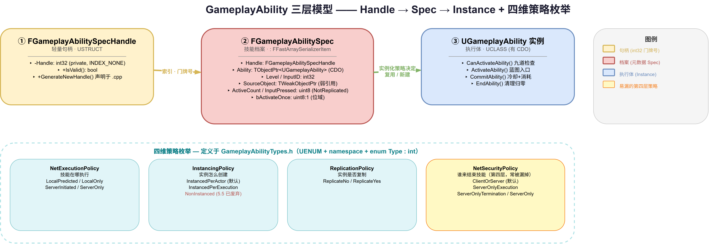
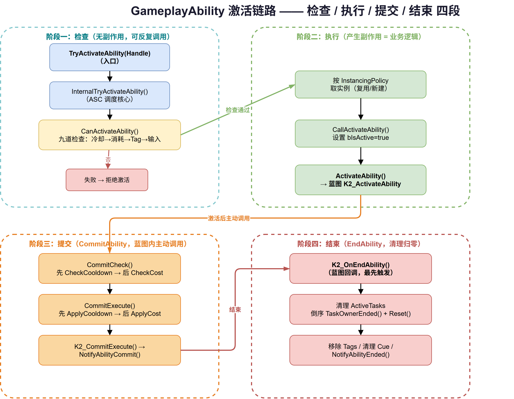

# 07 | GameplayAbility — 技能激活与核心框架 (上)

> **本篇**：GA 的激活框架 —— Spec / Handle / Instance 三层模型、四维策略枚举、`CanActivateAbility` 检查链、`CommitAbility` 与 `EndAbility` 的源码级拆解

> **系列**: 《Inside GAS》— UE5 GameplayAbilitySystem 源码深度分析  
> **难度**: 🔵 核心 → 🔴 源码  
> **字数**: ~6500  
> **前置**: 06-GameplayEffect  
> **源码路径**: `Engine/Plugins/Runtime/GameplayAbilities/Source/GameplayAbilities/Public/Abilities/GameplayAbility.h`

---

> **系列导航**
> 
> | 阶段 | 篇章 | 内容 | 状态 |
> |------|------|------|------|
> | 🟢 基础 | 01 | GAS 总览与核心架构 | ✅ |
> | | 02 | ASC — 核心调度器 | ✅ |
> | | 03 | GameplayTags — 通用语言 | ✅ |
> | | 04 | AttributeSet — 属性定义与复制 | ✅ |
> | 🔵 核心 | 05 | GameplayEffect — 效果与计算 (上) | ✅ |
> | | 06 | GameplayEffect — 效果与计算 (下) | ✅ |
> | | **07** | **GameplayAbility — 技能激活与核心框架 (上)** | ✅ |
> | | 08 | GameplayAbility — Task/输入/预测 (下) | 📝 |
> | | 09 | GameplayCue — 表现层触发机制 | 📝 |
> | 🔴 高级 | 10 | Prediction — 预测与回滚 | 📝 |
> | | 11 | GE Components — 组件化架构演进 | 📝 |
> | | 12 | Network & Serial — 网络序列化 | 📝 |
> | | 13 | Targeting — 瞄准系统 | 📝 |
> | | 14 | Debug & Optimization — 调试与优化 | 📝 |
> | | 15 | 终篇回顾 — 全景复习 | 📝 |

---

## 一、问题驱动：GE 管属性，那"放技能"这件事谁管？

前面四篇讲完了 AttributeSet 和 GameplayEffect：属性怎么定义、怎么复制，GE 怎么改属性、怎么算、怎么执行。但一个真实的游戏技能远不止"改属性"——

- 它需要一个**可以激活 / 结束的逻辑单元**：放一个火球、开一个护盾、发动一次冲锋；
- 它需要在**特定条件下才能激活**：冷却转好了吗？蓝够吗？身上有"沉默"Tag 吗？
- 它在**不同网络环境下执行策略不同**：本地预测执行、还是只在服务器跑？
- 它激活后要**挂载一堆异步任务**：播动画、等输入释放、等目标确认——这些是下篇的内容。

`UGameplayAbility`（GA）就是承载这一切的容器。本篇只聚焦一件事：**"激活"这条路是怎么走通的**——从你调用 `TryActivateAbility` 开始，一路追到 `ActivateAbility` 蓝图事件被触发，把中间的 Spec、Handle、实例化、策略检查、Commit、End 全部拆开。

---

## 二、概念速览：三层模型是理解 GA 的钥匙

在深入源码前，先建立三层模型。这是理解 GA 的关键，也是很多新手卡壳的地方。

| 层 | 类型 | 角色 | 类比 |
|----|------|------|------|
| 1 | `FGameplayAbilitySpecHandle` | 轻量句柄，`int32` | 门牌号 |
| 2 | `FGameplayAbilitySpec` | 技能"档案"，元数据 | 档案柜里的文件夹 |
| 3 | `UGameplayAbility` 实例 | 真正干活的 C++ 对象 | 拿着档案办事的人 |

三层关系一句话：**Handle 是索引，Spec 是元数据，Instance 是执行体。**

- **Handle**：一个 `int32`，只是"你在 ASC 里引用哪个技能槽位"的门牌号，本身不含任何技能逻辑。
- **Spec**：挂在 ASC 的 `ActivatableAbilities` 数组里，存 CDO 引用、等级、输入 ID、激活次数等元数据。它是网络复制的最小单元。
- **Instance**：`UGameplayAbility` 的 C++ 对象。根据实例化策略，可能复用同一个实例（`InstancedPerActor`），也可能每次激活都新建（`InstancedPerExecution`）。

这里有个新手常见的误区：**`UGameplayAbility` 本身是个 `UCLASS`，有 CDO（Class Default Object）**。你配的所有属性（冷却 GE 类、消耗 GE 类、Tag 要求）都存在 CDO 上。Spec 里的 `Ability` 字段引用的是这个 CDO，而"激活"时真正被调用逻辑的，是根据实例化策略拿到的实例。



*图：GA 三层模型与四维策略枚举 —— Handle（句柄）→ Spec（档案）→ Instance（执行体）三级结构，以及定义于 GameplayAbilityTypes.h 的四个策略枚举（含常被遗漏的 NetSecurityPolicy）*

---

## 三、四维策略枚举：GA 的行为开关

GA 的行为由**四个独立的策略枚举**控制，全部定义在 `GameplayAbilityTypes.h`。这里要先纠正一个流传很广的错误：UE5.8 里 GAS 的枚举**不是 `enum class`**，而是 `UENUM(BlueprintType)` 包一个 `namespace`，里面是 `enum Type : int`：

```cpp
// GameplayAbilityTypes.h:25
UENUM(BlueprintType)
namespace EGameplayAbilityNetExecutionPolicy
{
    enum Type : int
    {
        LocalPredicted,
        LocalOnly,
        ServerInitiated,
        ServerOnly,
    };
}
```

这种写法让枚举既能被反射（`UENUM`），又能被 `TEnumAsByte` / 位运算使用，是 Epic 在 GAS 里的统一风格。

### 3.1 NetExecutionPolicy —— 技能在哪执行（`GameplayAbilityTypes.h:58-76`）

| 值 | 含义 | 典型场景 |
|----|------|---------|
| `LocalPredicted` | 本地立即执行 + 服务器验证 | 需要即时反馈的攻击、位移 |
| `LocalOnly` | 只在本地执行，服务器不跑 | 纯表现、UI 类技能 |
| `ServerInitiated` | 客户端请求，服务器发起 | 由服务器统一调度的技能 |
| `ServerOnly` | 只在服务器执行 | GM 指令、服务器逻辑 |

### 3.2 InstancingPolicy —— 实例怎么创建（`GameplayAbilityTypes.h:36-56`）

| 值 | 含义 | 适用 |
|----|------|------|
| `InstancedPerActor` | 每个 Actor 复用同一实例 | 有状态、需要跨激活保留变量的技能（**默认推荐**） |
| `InstancedPerExecution` | 每次激活新建实例 | 无状态、可并行多次触发的技能 |
| `NonInstanced` | 已废弃（5.5 起 `DEPRECATED`） | 新代码请改用 `InstancedPerActor` |

注意：`NonInstanced` 在 UE 5.5 已被标记废弃，源码注释明确指向 `InstancedPerActor`。很多旧教程还在提 `NonInstanced`，新项目里别再用它。

### 3.3 ReplicationPolicy —— 实例是否复制（`GameplayAbilityTypes.h:98-110`）

| 值 | 含义 |
|----|------|
| `ReplicateNo` | 不复制实例（`LocalOnly` / `ServerOnly` 技能用） |
| `ReplicateYes` | 复制实例到所有端（`InstancedPerActor` 技能的默认） |

### 3.4 NetSecurityPolicy —— 谁来结束技能（`GameplayAbilityTypes.h:78-96`）

这是**最常被遗漏的第四层**。很多文章只讲"三层策略"，但源码里实打实有四个枚举：

| 值 | 含义 |
|----|------|
| `ClientOrServer` | 客户端或服务器都能结束技能（默认） |
| `ServerOnlyExecution` | 仅服务器能执行结束 |
| `ServerOnlyTermination` | 仅服务器能终止技能 |
| `ServerOnly` | 执行与终止都仅服务器 |

`NetSecurityPolicy` 控制的是"谁有权结束/终止这个技能"，对多人对战的反作弊至关重要——你不希望客户端作弊时能随便终止一个服务器的关键技能。

---

## 四、Spec 与 Handle：技能的"档案"与"门牌号"

### 4.1 FGameplayAbilitySpecHandle（`GameplayAbilitySpecHandle.h`）

```cpp
USTRUCT(BlueprintType)
struct FGameplayAbilitySpecHandle
{
    GENERATED_BODY()

    FGameplayAbilitySpecHandle()
        : Handle(INDEX_NONE) {}

    bool IsValid() const { return Handle != INDEX_NONE; }

    void GenerateNewHandle();   // 注意：这里只是"声明"，实现在 .cpp

private:
    UPROPERTY()
    int32 Handle = INDEX_NONE;
};
```

两个关键点：

1. **`GenerateNewHandle()` 只是声明，不是内联实现。** 真实实现在 `GameplayAbilitySpecHandle.cpp` 里，用一个全局自增计数器分配句柄。很多文章把它写成 `{ static int32 GHandle = 1; Handle = GHandle++; }` 的内联形式，那是臆造。
2. `Handle` 是 `private` 的 `int32`，默认 `INDEX_NONE`（无效）。对外只通过 `IsValid()` 判断。

### 4.2 FGameplayAbilitySpec（`GameplayAbilitySpec.h`）

`FGameplayAbilitySpec` 继承自 `FFastArraySerializerItem`（第 168 行），字段从 195 行开始：

```cpp
struct FGameplayAbilitySpec : public FFastArraySerializerItem
{
    UPROPERTY()
    FGameplayAbilitySpecHandle Handle;          // 195 句柄

    UPROPERTY()
    TObjectPtr<UGameplayAbility> Ability;        // 199 CDO 引用

    UPROPERTY()
    int32 Level = 1;                            // 203 技能等级

    UPROPERTY()
    int32 InputID = INDEX_NONE;                 // 207 输入 ID

    UPROPERTY()
    TWeakObjectPtr<UObject> SourceObject;        // 211 来源对象（弱引用）

    UPROPERTY(NotReplicated)
    uint8 ActiveCount = 0;                      // 215 当前激活次数（本地）

    UPROPERTY(NotReplicated)
    uint8 InputPressed : 1;                     // 219 输入是否按下（位域）

    UPROPERTY()
    uint8 RemoveAfterActivation : 1;            // 223

    UPROPERTY()
    uint8 PendingRemove : 1;                    // 227

    UPROPERTY()
    uint8 bActivateOnce : 1;                    // 231 只激活一次

    TSharedPtr<FGameplayAbilitySpec::...> GameplayEventData; // 234

    // 以下两个字段在 5.5 已 DEPRECATED：
    // FGameplayAbilityActivationInfo ActivationInfo;   // 239
    // FGameplayTagContainer DynamicAbilityTags;        // 243

    FGameplayAbilityTriggerData DynamicAbilityTriggers; // 254
    // ...
};
```

几个**最容易记错**的字段：

- **`SourceObject` 是 `TWeakObjectPtr<UObject>`（弱引用）**，不是 `TObjectPtr`。弱引用的意义是：不阻止来源对象被 GC，同时能在对象已销毁时感知到。
- **`ActiveCount` / `InputPressed` 带 `NotReplicated`**——它们是纯本地状态，不参与网络复制。
- **`InputPressed` 是 `uint8 : 1` 位域**，不是 `bool`。GAS 为了把多个布尔标记压进一个字节，大量使用位域。
- **`ActivationInfo` / `DynamicAbilityTags` 在 5.5 已废弃**，源码注释明确标记，新代码应避免使用。

---

## 五、激活链路：从 TryActivateAbility 到 ActivateAbility

这是本篇的核心。整条链路是：

```
TryActivateAbility(Handle)
  └─ InternalTryActivateAbility(...)     // ASC 层，做多层检查
      ├─ CanActivateAbility(...)          // 冷却 / 消耗 / Tag / 输入检查
      ├─ 实例化：根据 InstancingPolicy 取实例
      └─ CallActivateAbility(...)         // 调用实例
          └─ ActivateAbility(...)         // 虚函数 → 蓝图 K2_ActivateAbility
```



*图：GA 激活链路四段式 —— 检查（无副作用）→ 执行（产生副作用）→ 提交（CommitAbility）→ 结束（EndAbility），其中 CommitCheck/CommitExecute 均遵循"先冷却后消耗"的顺序*

### 5.1 入口：TryActivateAbility

你调用的第一个函数是 `UAbilitySystemComponent::TryActivateAbility(Handle)`。它做一层简单包装（确认 Spec 存在等）后，把请求转交给 `InternalTryActivateAbility`。真正的重活都在后者。

### 5.2 内部：InternalTryActivateAbility

`InternalTryActivateAbility`（`AbilitySystemComponent_Abilities.cpp`）是 ASC 侧的调度核心，它负责：

1. 根据 Handle 找到 `FGameplayAbilitySpec`，确认 Ability CDO 有效；
2. 调用 `CanActivateAbility` 做业务检查（下一节详解）；
3. 做网络策略检查——例如 `LocalPredicted` 技能在非本地执行时，必须携带有效的 `FPredictionKey`（预测相关，下篇展开）；
4. 根据 `InstancingPolicy` 获取或创建实例；
5. 设置 `Spec->ActiveCount++`，调用 `CallActivateAbility`。

### 5.3 CanActivateAbility：九道检查的真实顺序

`CanActivateAbility`（`GameplayAbility.cpp:457`）是激活前的"体检"。它的检查顺序是**固定且有讲究的**：

```cpp
bool UGameplayAbility::CanActivateAbility(...)
{
    // 1. AvatarActor 有效 + 本地角色允许执行（模拟代理不能激活）
    AActor* const AvatarActor = ActorInfo ? ActorInfo->AvatarActor.Get() : nullptr;
    if (AvatarActor == nullptr || !ShouldActivateAbility(AvatarActor->GetLocalRole()))
        return false;

    // 2. ASC 有效
    // 3. Spec 有效（FindAbilitySpecFromHandle）

    // 4. 输入是否被抑制（UI 打开、被其他技能阻塞等）
    if (AbilitySystemComponent->GetUserAbilityActivationInhibited())
        return false;

    // 5. 冷却检查（先！）
    if (!AbilitySystemGlobals.ShouldIgnoreCooldowns() && !CheckCooldown(Handle, ActorInfo, OptionalRelevantTags))
        return false;

    // 6. 消耗检查（后）
    if (!AbilitySystemGlobals.ShouldIgnoreCosts() && !CheckCost(Handle, ActorInfo, OptionalRelevantTags))
        return false;

    // 7. Tag 要求检查（ActivationBlockedTags / ActivationRequiredTags）
    if (!DoesAbilitySatisfyTagRequirements(*AbilitySystemComponent, SourceTags, TargetTags, OptionalRelevantTags))
        return false;

    // 8. 输入 ID 是否被阻塞
    if (AbilitySystemComponent->IsAbilityInputBlocked(Spec->InputID))
        return false;

    // 9. 蓝图覆写：K2_CanActivateAbility（bHasBlueprintCanUse）
}
```

顺序背后的逻辑：**先查冷却、再查消耗**——冷却没好就直接返回，不必再算消耗；资源不足就不必再查 Tag。检查成本从低到高排列，能早退就早退。

### 5.4 CallActivateAbility：真正的"点火"

`CallActivateAbility`（`GameplayAbility.cpp`）负责：

- 设置 `bIsActive = true`；
- 广播 `OnGameplayAbilityActivated`；
- 调用虚函数 `ActivateAbility(Handle, ActorInfo, ActivationInfo, TriggerEventData)`——蓝图事件 `K2_ActivateAbility`（即"ActivateAbility"节点）就是在这里被触发的。

到这里，你的蓝图逻辑才开始执行。而上一篇/下一篇常说的 `CommitAbility`、`EndAbility`，都是在你蓝图逻辑里**主动调用**的。

---

## 六、CommitAbility：资源提交的真实顺序

技能的"消耗资源"（冷却 + 消耗）通过 `CommitAbility` 完成。它分两个阶段，**顺序极其重要，很多文章写反了**：

```cpp
// GameplayAbility.cpp:578
bool UGameplayAbility::CommitAbility(const FGameplayAbilitySpecHandle Handle, ...)
{
    if (!CommitCheck(Handle, ActorInfo, ActivationInfo))   // 1. 先检查
        return false;

    CommitExecute(Handle, ActorInfo, ActivationInfo);      // 2. 再执行
    K2_CommitExecute();                                    // 3. 蓝图钩子
    NotifyAbilityCommit(this);                             // 4. 通知提交
    return true;
}
```

`CommitCheck` 的检查顺序是**先冷却、后消耗**：

```cpp
bool UGameplayAbility::CommitCheck(...)
{
    if (!CheckCooldown(Handle, ActorInfo))    // 671-674 先查冷却
        return false;
    if (!CheckCost(Handle, ActorInfo))        // 676-679 再查消耗
        return false;
    return true;
}
```

`CommitExecute` 的执行顺序**同样是先冷却、后消耗**：

```cpp
void UGameplayAbility::CommitExecute(...)
{
    ApplyCooldown(Handle, ActorInfo, ActivationInfo);   // 686 先扣冷却
    ApplyCost(Handle, ActorInfo, ActivationInfo);       // 688 再扣消耗
}
```

**顺序为什么重要**：检查顺序决定了报错优先级——冷却没好，就不必再查消耗；资源不足，就不必扣冷却。而执行顺序与检查顺序**严格对应**，保证"检查通过 → 执行成功"的一致性。如果你把 Cost 放在 Cooldown 前面，就会出现"扣了蓝但冷却没好导致技能失败"的 bug。

---

## 七、EndAbility：清理流程的真实顺序

`EndAbility`（`GameplayAbility.cpp:802`）是激活的镜像，负责把所有状态归零。真实顺序如下：

```cpp
void UGameplayAbility::EndAbility(...)
{
    // 1. 合法性检查 + 重入保护
    //    ScopeLockCount > 0 时，加入 WaitingToExecute 延迟执行

    // 2. bIsAbilityEnding = true

    // 3. 蓝图回调（最先触发！）
    K2_OnEndAbility(bWasCancelled);

    // 4. 清理 latent actions 和 timers

    // 5. 广播并清空结束委托
    OnGameplayAbilityEnded.Broadcast(this);
    OnGameplayAbilityEnded.Clear();
    OnGameplayAbilityEndedWithData.Broadcast(...);
    OnGameplayAbilityEndedWithData.Clear();

    // 6. bIsActive = false; bIsAbilityEnding = false

    // 7. 清理所有 Task：倒序遍历，逐个 TaskOwnerEnded()，再 Reset()
    for (int32 TaskIndex = ActiveTasks.Num() - 1; TaskIndex >= 0; --TaskIndex)
    {
        ActiveTasks[TaskIndex]->TaskOwnerEnded();
    }
    ActiveTasks.Reset();

    // 8. 网络同步：ReplicateEndOrCancelAbility

    // 9. 移除 ActivationOwnedTags（RemoveLooseGameplayTags）

    // 10. 清理 TrackedGameplayCues

    // 11. HandleChangeAbilityCanBeCanceled

    // 12. ApplyAbilityBlockAndCancelTags

    // 13. ClearAbilityReplicatedDataCache

    // 14. NotifyAbilityEnded
}
```

两个**关键纠正**：

1. **`K2_OnEndAbility`（蓝图 OnEndAbility 事件）在流程最前面触发**，不是最后。很多文章把蓝图回调放在结尾，是错的——EndAbility 一进来先通知蓝图，再做底层清理。
2. **Task 清理用的是 `TaskOwnerEnded()`，不是 `EndTask()`**，且采用**倒序遍历 + `ActiveTasks.Reset()`**。倒序是因为 Task 可能在回调里移除自己或别的 Task；`Reset()` 一次性清空整个数组。

---

## 八、Block & Cancel：技能之间的相互影响

技能不是孤立存在的。GA 用三组 Tag 容器表达技能间的"相互干扰"（`GameplayAbility.h:738-755`）：

| 字段 | 类型 | 作用 |
|------|------|------|
| `ActivationOwnedTags` | `FGameplayTagContainer` | 激活期间赋予拥有者的 Tag |
| `ActivationRequiredTags` | `FGameplayTagContainer` | 必须满足才能激活的 Tag |
| `ActivationBlockedTags` | `FGameplayTagContainer` | 存在即阻止激活的 Tag |
| `BlockAbilitiesWithTag` | `FGameplayTagContainer` | 激活期间阻塞其他带此 Tag 的技能 |
| `CancelAbilitiesWithTag` | `FGameplayTagContainer` | 激活时取消其他带此 Tag 的技能 |

配合两个 GE 类：

| 字段 | 类型 | 作用 |
|------|------|------|
| `CooldownGameplayEffectClass` | `TSubclassOf<UGameplayEffect>` | 冷却 GE（`CheckCooldown`/`ApplyCooldown` 用它） |
| `CostGameplayEffectClass` | `TSubclassOf<UGameplayEffect>` | 消耗 GE（`CheckCost`/`ApplyCost` 用它） |

这解释了前面 `CheckCooldown` / `ApplyCooldown` 是怎么工作的：它们本质上是去查/去施加一个冷却 GE。GA 本身不直接操作冷却值，而是**把冷却和消耗都建模成 GE**——这是 GAS 设计里"一切都走 GE"的体现，也是上一篇 GE 讲完后，本篇能顺理成章接上的原因。

一个典型的"沉默"设计：给沉默技能配置 `ActivationBlockedTags` 包含 `State.Silenced`，当玩家身上有该 Tag 时，`DoesAbilitySatisfyTagRequirements` 在第七道检查就会拦下激活。

---

## 九、设计思考：为什么 GA 要拆成"检查 + 执行 + 提交 + 结束"四段？

回顾整条链路，你会看到一个清晰的阶段划分：

- **CanActivateAbility**（检查）——纯函数式，无副作用，可以反复调用；
- **ActivateAbility**（执行）——产生副作用，是你的业务逻辑；
- **CommitAbility**（提交）——扣冷却、扣消耗，把"承诺"兑现；
- **EndAbility**（结束）——清理、归零、通知。

这个划分的意义在于**可预测性**。激活前可以反复"体检"而不产生任何副作用；激活后的资源扣减被单独拎出来（`Commit`），让"什么时候扣资源"成为你的显式决定——你可以在动画播到一半才 `CommitAbility`，也可以一激活就提交。网络预测能正常工作，也依赖这种"检查/执行/提交"的清晰边界（服务器重放时，检查通过才能提交）。

另一个设计点是**三层模型（Handle / Spec / Instance）的网络友好性**。网络复制的最小单元是 Spec（元数据），而不是实例（执行体）。服务器和客户端各自维护自己的实例，通过 Spec 对齐状态。这为下篇要讲的"预测 + 回滚"打下了基础——预测的本质，就是客户端先用自己的实例跑一遍，服务器用权威实例再跑一遍，两边用同一个 `FPredictionKey` 对齐。

---

## 十、总结

本篇从"激活"这条主线出发，拆开了 GA 的核心框架：

| 主题 | 关键点 |
|------|--------|
| **三层模型** | Handle（int32 门牌号）→ Spec（元数据档案）→ Instance（执行体） |
| **四维策略枚举** | NetExecution / Instancing / Replication / **NetSecurity**（第四层常被漏掉）；UE5.8 用 `UENUM + namespace + enum Type : int`，非 `enum class` |
| **InstancingPolicy** | `InstancedPerActor` 复用实例，`InstancedPerExecution` 每次新建，`NonInstanced` 已废弃 |
| **Spec 字段** | `SourceObject` 是 `TWeakObjectPtr`；`ActiveCount`/`InputPressed` 是 `NotReplicated` 的 `uint8` 位域 |
| **CanActivateAbility** | 九道检查，顺序固定：冷却 → 消耗 → Tag → 输入阻塞 → 蓝图覆写 |
| **CommitAbility** | `CommitCheck` 先冷却后消耗，`CommitExecute` 同样先 `ApplyCooldown` 后 `ApplyCost` |
| **EndAbility** | `K2_OnEndAbility` 最先触发；Task 用 `TaskOwnerEnded()` 倒序清理 + `ActiveTasks.Reset()` |
| **Block & Cancel** | 三组 Tag + 两个 GE 类，冷却/消耗本质都是 GE |

下一篇进入 GA 的运行时子系统——AbilityTask 体系、技能输入绑定、瞄准系统与网络预测。

**上一篇**：[06 | GameplayEffect — 效果与计算 (下)](../06-GameplayEffect/06-GameplayEffect文章.md)

**下一篇**：[08 | GameplayAbility — Task/输入/预测 (下)](../08-GameplayAbility/08-GameplayAbility文章.md) —— 拆解 AbilityTask 工厂模式、`AbilityLocalInputPressed/Released` 输入路由、TargetActor 瞄准与 `FPredictionKey` 预测。

---

*本文基于 UE 5.8 源码分析。系列文章会继续按模块拆解，从基础到高级，从 API 到设计哲学。*
