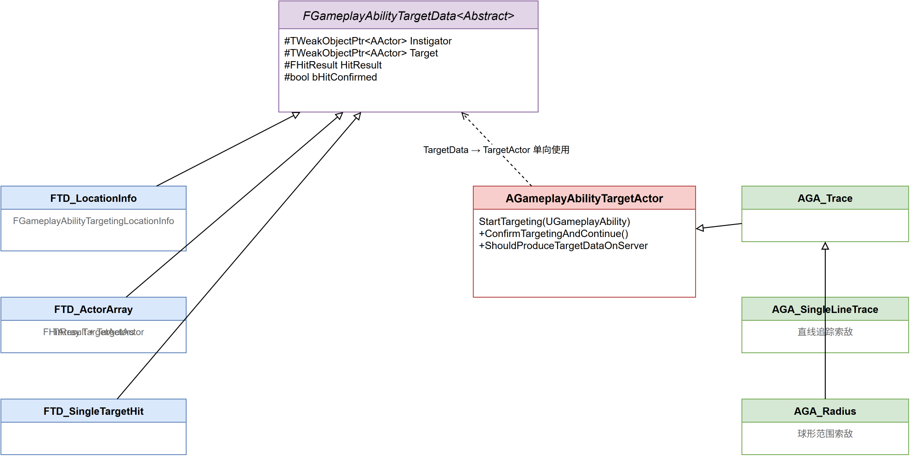

# 深入浅出UE5 GAS（八）：TargetData —— 索敌与数据传递

## 系列目录

1. [AbilitySystemComponent —— GAS的心脏](../01-ASC/01-ASC文章.md)
2. [AttributeSet —— 数值系统的基石](../02-AttributeSet/02-AttributeSet文章.md)
3. [GameplayEffect（上）—— 从定义到应用](../03-GameplayEffect/03-GameplayEffect文章-上.md)
4. [GameplayEffect（下）—— Modifier、Stacking与Periodic](../03-GameplayEffect/03-GameplayEffect文章-下.md)
5. [ExecutionCalculation —— 自定义伤害公式](../04-ExecutionCalculation/04-ExecutionCalculation文章.md)
6. [GameplayAbility —— 技能的诞生与消亡](../05-GameplayAbility/05-GameplayAbility文章.md)
7. [AbilityTask —— 异步编程的艺术](../06-AbilityTask/06-AbilityTask文章.md)
8. **（本文）TargetData —— 索敌与数据传递**
9. [GameplayCue —— 技能反馈的表现层](../08-GameplayCue/08-GameplayCue文章.md)
10. [网络同步 —— 复制、预测与回滚](../09-Network/09-Network文章.md)
11. [GE Components —— UE 5.3 模块化新范式](../10-GEComponents/10-GEComponents文章.md)
12. [实战全景 —— 调试、陷阱与工程化模式](../11-Practice/11-Practice文章.md)

> 📎 [补遗篇 —— FGameplayAbilitySpec 详解](../12-Others/12-Others文章.md)

---

## 写在前面

在前几篇文章中，我们讲了一个技能的完整生命周期：激活 → 执行任务 → 施加 GE → 播放表现。但这个链条中有一个环节被我们有意跳过了：**技能是如何"选中目标"的？**

乍一看这个问题似乎很简单——传一个 `AActor* Target` 就好。但稍微深入就能发现无数细节：

- 一个技能可能同时命中多个目标（AOE），此时 `AActor*` 不够用
- 技能目标可能是空间中的一个点（Ground Targeting），此时根本没有 Actor 存在
- 命中结果需要包含碰撞信息、骨骼命中部位等，不仅仅是一句"你打中了他"
- 客户端索敌和服务器验证可能看到不同的结果，需要网络同步

这些问题逼迫 Epic 设计了一套精巧的多态体系——`FGameplayAbilityTargetData` 及其配套组件。它的核心思想是：**将"索敌"与"使用目标数据"解耦**。



---

## 一、问题的提出：为什么不能只传一个 AActor*？

### 1.1 靶向数据的多样性

考虑以下几个场景：

| 场景 | 需要的数据 | AActor* 够用吗？ |
|------|-----------|-----------------|
| 单体锁定技能（火球术） | 目标 Actor | ✅ 勉强够 |
| 多目标 AOE（回旋镖） | 所有命中 Actor + 命中顺序 | ❌ 不够 |
| 地面指示器（暴风雪） | 地面位置 + 半径 | ❌ 不够 |
| 射线技能（狙击枪） | 起点、终点、碰撞结果、命中骨骼 | ❌ 不够 |
| 放置类技能（哨戒炮） | 放置位置 + 朝向 | ❌ 不够 |

问题的本质是：**不同类型的技能产生的"目标信息"形状完全不同**。用 `TArray<AActor*>` + `FVector Location` 这种拍平的方式虽然能兜底，但丢失了大量语义。

### 1.2 为什么不直接用 UObject？

如果你熟悉 UE 的反射系统，可能会想：那用 `UObject` 多态不就行了？所有 TargetData 都继承 `UGameplayAbilityTargetData`，一个 `UGameplayAbilityTargetData*` 就能包含所有子类。

这个思路是对的，但有一个致命问题：**网络序列化**。`UObject` 的复制依赖 ActorChannel，而 TargetData 不是 Actor。用一个 "TargetDataUObject" Actor 来包装又太重了（Actor 的 Spawn 开销）。

Epic 的选择是：**用 `USTRUCT` 实现虚函数多态**。这是 UE 中一个非常规但极其优雅的技巧。

---

## 二、源码深潜：多态的 USTRUCT

### 2.1 FGameplayAbilityTargetData —— 结构体的"虚函数表"

```cpp:80:169:E:\EpicGames\UE_5.8\Engine\Plugins\Runtime\GameplayAbilities\Source\GameplayAbilities\Public\Abilities\GameplayAbilityTargetTypes.h
USTRUCT()
struct FGameplayAbilityTargetData
{
    GENERATED_USTRUCT_BODY()
    virtual ~FGameplayAbilityTargetData() = default;
    
    // 对每个目标施加 GameplayEffect
    virtual TArray<FActiveGameplayEffectHandle> ApplyGameplayEffectSpec(FGameplayEffectSpec& Spec, PredictionKey);
    
    // 返回所有命中的 Actor
    virtual TArray<TWeakObjectPtr<AActor>> GetActors() const { return TArray<TWeakObjectPtr<AActor>>(); }
    
    // 是否包含碰撞结果
    virtual bool HasHitResult() const { return false; }
    virtual const FHitResult* GetHitResult() const { return nullptr; }
    
    // 射线的起点
    virtual bool HasOrigin() const { return false; }
    virtual FTransform GetOrigin() const { return FTransform::Identity; }
    
    // 命中点
    virtual bool HasEndPoint() const { return false; }
    virtual FVector GetEndPoint() const { return FVector::ZeroVector; }
    
    // 获取 ScriptStruct（用于序列化）
    virtual UScriptStruct* GetScriptStruct() const { return StaticStruct(); }
    
    // 调试字符串
    virtual FString ToString() const;
};
```

值得留意的是，虽然标记为 `USTRUCT()`，但这个结构体拥有虚函数表。UE 的 `USTRUCT` 通过 `GENERATED_USTRUCT_BODY()` 宏在反射系统中注册，但**不禁止**使用 `virtual` 关键字。这意味着你可以写出一个带虚函数的多态结构体家族，只是不受 GC 管理。

注释中 `GetScriptStruct()` 的说明格外重要——这个函数返回**运行时真实类型**的 `UScriptStruct*`，而不是基类的。子类必须 override 它以返回自己的 `StaticStruct()`。这是网络序列化能够正确识别多态类型的基石。

### 2.2 FGameplayAbilityTargetDataHandle —— 智能容器

```cpp:201:295:E:\EpicGames\UE_5.8\Engine\Plugins\Runtime\GameplayAbilities\Source\GameplayAbilities\Public\Abilities\GameplayAbilityTargetTypes.h
USTRUCT(BlueprintType)
struct FGameplayAbilityTargetDataHandle
{
    // 核心存储：使用 TSharedPtr 持有多态 TargetData
    TArray<TSharedPtr<FGameplayAbilityTargetData>, TInlineAllocator<1>> Data;
    
    uint8 UniqueId = 0;
    
    void Add(FGameplayAbilityTargetData* DataPtr)
    {
        Data.Add(TSharedPtr<FGameplayAbilityTargetData>(DataPtr));
    }
    
    // 网络序列化入口 —— 这是多态序列化的关键
    bool NetSerialize(FArchive& Ar, class UPackageMap* Map, bool& bOutSuccess);
    
    bool operator==(const FGameplayAbilityTargetDataHandle& Other) const
    {
        // 逐元素比较内部的 TSharedPtr
        if (Data.Num() != Other.Data.Num()) return false;
        for (int32 i = 0; i < Data.Num(); ++i)
        {
            if (Data[i].IsValid() != Other.Data[i].IsValid()) return false;
            if (Data[i].Get() != Other.Data[i].Get()) return false;
        }
        return true;
    }
};
```

**设计亮点 1：`TInlineAllocator<1>`** —— 大多数技能只命中一个目标，内联分配避免了堆内存开销。这个细节体现了 Epic 对性能的注重——GAS 在战斗帧可能每秒触发数百次索敌。

**设计亮点 2：`TSharedPtr` 而非 `TUniquePtr`** —— Handle 支持拷贝（"同一个 TargetData 被多个任务使用"是常见场景），所以需要引用计数的共享指针。

**设计亮点 3：`UniqueId`** —— 用于在网络复制中区分不同的 Handle 实例。当客户端和服务器都有同一个 Handle 的副本时，`UniqueId` 帮助系统判断是否需要重新发送。

### 2.3 序列化模板特化

```cpp:297:306:E:\EpicGames\UE_5.8\Engine\Plugins\Runtime\GameplayAbilities\Source\GameplayAbilities\Public\Abilities\GameplayAbilityTargetTypes.h
template<>
struct TStructOpsTypeTraits<FGameplayAbilityTargetDataHandle> : public TStructOpsTypeTraitsBase2<FGameplayAbilityTargetDataHandle>
{
    enum
    {
        WithCopy = true,         // 启用拷贝（TSharedPtr 需要）
        WithNetSerializer = true, // 启用自定义网络序列化
        WithIdenticalViaEquality = true,
    };
};
```

`WithNetSerializer = true` 告诉 UE 的网络层："不要用默认的逐字段序列化，调用 `NetSerialize()`"。这是 `NetSerialize` 被实际调用的开关。

---

## 三、源码深潜：三种内置 TargetData 子类型

### 3.1 FGameplayAbilityTargetData_SingleTargetHit —— 单体命中

```cpp:559:643:E:\EpicGames\UE_5.8\Engine\Plugins\Runtime\GameplayAbilities\Source\GameplayAbilities\Public\Abilities\GameplayAbilityTargetTypes.h
USTRUCT(BlueprintType)
struct FGameplayAbilityTargetData_SingleTargetHit : public FGameplayAbilityTargetData
{
    FHitResult HitResult;  // 直接嵌入碰撞结果
    
    virtual TArray<TWeakObjectPtr<AActor>> GetActors() const override
    {
        TArray<TWeakObjectPtr<AActor>> Actors;
        if (HitResult.HasValidHitObjectHandle())
            Actors.Push(HitResult.HitObjectHandle.FetchActor());
        return Actors;
    }
    
    virtual bool HasHitResult() const override { return true; }
    virtual const FHitResult* GetHitResult() const override { return &HitResult; }
    virtual UScriptStruct* GetScriptStruct() const override { return StaticStruct(); }
};
```

适用于**一条射线命中一个目标**的场景（近战攻击、射击）。关键优势是内嵌了完整的 `FHitResult`——不仅知道打中了谁，还知道打在哪个骨骼上、面的法线方向等。

### 3.2 FGameplayAbilityTargetData_ActorArray —— 多目标数组

```cpp:456:547:E:\EpicGames\UE_5.8\Engine\Plugins\Runtime\GameplayAbilities\Source\GameplayAbilities\Public\Abilities\GameplayAbilityTargetTypes.h
USTRUCT(BlueprintType)
struct FGameplayAbilityTargetData_ActorArray : public FGameplayAbilityTargetData
{
    FGameplayAbilityTargetingLocationInfo SourceLocation;
    TArray<TWeakObjectPtr<AActor>> TargetActorArray;
    
    virtual TArray<TWeakObjectPtr<AActor>> GetActors() const override
    {
        return TargetActorArray;
    }
    
    virtual UScriptStruct* GetScriptStruct() const override { return StaticStruct(); }
};
```

适用于 AOE 技能——扇形的范围攻击、圆形爆炸、连锁闪电。注意它使用 `TWeakObjectPtr` 而非裸指针，因为目标可能在技能结算前就被销毁了。

### 3.3 FGameplayAbilityTargetData_LocationInfo —— 纯空间信息

```cpp:389:444:E:\EpicGames\UE_5.8\Engine\Plugins\Runtime\GameplayAbilities\Source\GameplayAbilities\Public\Abilities\GameplayAbilityTargetTypes.h
USTRUCT(BlueprintType)
struct FGameplayAbilityTargetData_LocationInfo : public FGameplayAbilityTargetData
{
    FGameplayAbilityTargetingLocationInfo SourceLocation;
    FGameplayAbilityTargetingLocationInfo TargetLocation;
    
    virtual bool HasOrigin() const override { return true; }
    virtual FTransform GetOrigin() const override { return SourceLocation.GetTargetingTransform(); }
    virtual bool HasEndPoint() const override { return true; }
    virtual FVector GetEndPoint() const override { return TargetLocation.GetTargetingTransform().GetLocation(); }
    virtual UScriptStruct* GetScriptStruct() const override { return StaticStruct(); }
};
```

适用于不需要命中 Actor 的场景——地面指示器技能、位移技能的目标点、纯位置的技能触发。`FGameplayAbilityTargetingLocationInfo` 支持三种定位模式：

- `LiteralTransform`：直接的世界坐标
- `ActorTransform`：从某个 Actor 获取位置
- `SocketTransform`：从骨骼网格体的 Socket 获取位置

---

## 四、源码深潜：TargetActor 继承体系

### 4.1 基类 AGameplayAbilityTargetActor

```cpp:27:106:E:\EpicGames\UE_5.8\Engine\Plugins\Runtime\GameplayAbilities\Source\GameplayAbilities\Public\Abilities\GameplayAbilityTargetActor.h
UCLASS(Blueprintable, abstract, notplaceable)
class AGameplayAbilityTargetActor : public AActor
{
    // 控制 TargetData 是在服务器生成还是客户端生成
    UPROPERTY(EditAnywhere, Category=Advanced)
    bool ShouldProduceTargetDataOnServer;
    
    // 初始位置信息（被复制）
    UPROPERTY(BlueprintReadOnly, Replicated)
    FGameplayAbilityTargetingLocationInfo StartLocation;
    
    // 启动索敌
    virtual void StartTargeting(UGameplayAbility* Ability);
    
    // 确认目标（玩家按键确认）
    virtual void ConfirmTargeting();
    
    // 取消索敌
    virtual void CancelTargeting();
    
    // 收到客户端复制来的 TargetData（服务端回调）
    virtual bool OnReplicatedTargetDataReceived(FGameplayAbilityTargetDataHandle& Data) const;
    
    // 委托：TargetData 就绪
    FAbilityTargetData TargetDataReadyDelegate;
    FAbilityTargetData CanceledDelegate;
    
    // 控制 Actor 生命周期
    UPROPERTY(BlueprintReadOnly, Replicated)
    bool bDestroyOnConfirmation;
    
    // 世界准星参数
    FWorldReticleParameters ReticleParams;
    TSubclassOf<AGameplayAbilityWorldReticle> ReticleClass;
    
    // 目标过滤
    FGameplayTargetDataFilterHandle Filter;
};
```

TargetActor 是一个 `AActor`，这意味着它有完整的组件系统、网络复制、Tick 能力。但这也意味着每次技能激活都需要 Spawn 一个 TargetActor（有对象池或子类优化的空间）。`bDestroyOnConfirmation = true` 的默认行为让它在确认目标后自动销毁。

`ShouldProduceTargetDataOnServer` 是一个关键标志位——如果为 true，服务器自己生成 TargetData（如 AI 的技能）；如果为 false，客户端生成 TargetData 后复制到服务器验证（如玩家的瞄准技能）。

### 4.2 继承树

```
AGameplayAbilityTargetActor
├── AGameplayAbilityTargetActor_Trace          // 基于射线追踪
│   └── AGameplayAbilityTargetActor_SingleLineTrace  // 单线追踪
├── AGameplayAbilityTargetActor_GroundTrace    // 地面追踪（鼠标位置投影到地面）
├── AGameplayAbilityTargetActor_Radius         // 球形/AOE 范围
└── AGameplayAbilityTargetActor_ActorPlacement // 放置 Actor（如哨戒炮）
```

每种子类对应一种索敌模式：

| 子类 | 典型场景 | 产生的 TargetData 类型 |
|------|---------|---------------------|
| `SingleLineTrace` | 射击、近战攻击 | `SingleTargetHit` |
| `GroundTrace` | MOBA 技能、地面指示器 | `LocationInfo` |
| `Radius` | AOE 爆炸、光环 | `ActorArray` |
| `ActorPlacement` | 放置炮塔、陷阱 | `ActorArray` 或自定义 |

---

## 五、源码深潜：TargetData 的网络序列化

### 5.1 多态序列化的核心流程

网络复制是多态 USTRUCT 最具挑战性的部分。当 `FGameplayAbilityTargetDataHandle` 通过网络发送时，接收端需要重建出正确的子类型实例。

核心流程在 `GameplayAbilityTargetTypes.cpp` 的 `NetSerialize` 实现中：

```
写入 (Server → Client)：
1. 写入 Data.Num()（元素数量）
2. 对每个元素：
   a. 获取 TargetData->GetScriptStruct()（运行时真实类型）
   b. 写入 ScriptStruct 的路径名（用于接收端反射查找）
   c. 调用 ScriptStruct->SerializeItem() 序列化数据

读取 (Client ← Server)：
1. 读取 Num
2. 对每个元素：
   a. 读取 ScriptStruct 路径名
   b. 通过 FindObject<UScriptStruct>(PathName) 找到类型
   c. 通过 NewObject 或 malloc 分配内存
   d. 调用 ScriptStruct->SerializeItem() 反序列化
   e. 包装为 TSharedPtr<FGameplayAbilityTargetData>
```

这是一个经典的 "type-tag + data" 序列化模式。`UScriptStruct::SerializeItem` 是 UE 反射序列化的通用入口——它知道如何处理 `FHitResult`、`TArray`、`FVector` 等所有 UPROPERTY 标记的字段。

### 5.2 确认模式与网络职责分工

`EGameplayTargetingConfirmation` 枚举定义了四个确认模式：

```cpp:26:43:E:\EpicGames\UE_5.8\Engine\Plugins\Runtime\GameplayAbilities\Source\GameplayAbilities\Public\Abilities\GameplayAbilityTargetTypes.h
UENUM(BlueprintType)
namespace EGameplayTargetingConfirmation
{
    enum Type : int
    {
        Instant,        // 立即确认（自动索敌）
        UserConfirmed,  // 玩家按键确认
        Custom,         // GameplayAbility 代码自行决定何时确认
        CustomMulti,    // 可多次确认（不销毁 TargetActor）
    };
}
```

四种模式对应不同的客户端/服务器职责：

| 模式 | 谁索敌 | 谁确认 | TargetActor 生命周期 |
|------|--------|--------|---------------------|
| `Instant` | 客户端/服务器各自 | 自动 | 立即销毁 |
| `UserConfirmed` | 客户端 | 玩家按键 | 确认后销毁 |
| `Custom` | 由 Ability 代码控制 | 由 Ability 代码控制 | 确认后销毁 |
| `CustomMulti` | 由 Ability 代码控制 | 可多次 | 手动销毁 |

对于 `UserConfirmed` 模式，流程是：
1. 客户端 Spawn TargetActor，显示准星/指示器
2. 玩家移动鼠标/Tab 切换目标
3. 玩家按确认键 → TargetActor→ConfirmTargeting()
4. 客户端生成 TargetDataHandle → 复制到服务器
5. 服务器调用 `OnReplicatedTargetDataReceived()` 验证数据
6. 验证通过后广播 `TargetDataReadyDelegate`

---

## 六、WaitTargetData —— 连接 TargetActor 和 GameplayAbility 的桥梁

TargetActor 和 GameplayAbility 之间的通信通过 `UAbilityTask_WaitTargetData` 这个 AbilityTask 完成。

它的核心工作流：

```cpp
// 伪代码
void UAbilityTask_WaitTargetData::Activate()
{
    // 1. Spawn TargetActor（根据 ConfirmationType 和 TargetClass 配置）
    TargetActor = GetWorld()->SpawnActorDeferred<AGameplayAbilityTargetActor>(
        TargetClass, SpawnInfo, OwningAbility);
    
    // 2. 初始化 TargetActor
    TargetActor->StartTargeting(OwningAbility);
    
    // 3. 绑定 TargetActor 的委托
    TargetActor->TargetDataReadyDelegate.AddUObject(this, &OnTargetDataReady);
    TargetActor->CanceledDelegate.AddUObject(this, &OnTargetDataCancelled);
    
    // 4. 对于 Instant 模式，立即触发索敌
    if (ConfirmationType == Instant)
    {
        TargetActor->ConfirmTargeting();
    }
}

void OnTargetDataReady(const FGameplayAbilityTargetDataHandle& Data)
{
    // 广播给 Ability 层
    ValidData.Broadcast(Data);
    EndTask();
}
```

**设计思考**：为什么 TargetActor 不直接跟 GameplayAbility 耦合？——因为 AbilityTask 是这个交互中**唯一需要知道双方的组件**。当条件变化（比如换一种索敌方式），只需要换 TargetClass，不需要修改 Ability 本身的逻辑。这是"中介者模式"在异步编程中的自然应用。

---

## 七、实战示例

### 7.1 在 Ability 蓝图中的典型连线

```
[ActivateAbility]
    → [WaitTargetData (TargetClass = GA_Trace, Confirmation = Instant)]
        → OnValidData → [WaitGameplayEvent] → [ApplyGameplayEffectSpecToTarget]
```

### 7.2 C++ 中直接构造 TargetData

有时你不需要 TargetActor（比如"对自身施法"的技能），可以直接在代码中构造 TargetData：

```cpp
void UGameplayAbility_MeleeAttack::ActivateAbility(...)
{
    // 创建一个单体命中 TargetData
    FHitResult HitResult;
    // ... 执行 Trace 获取 HitResult ...
    
    FGameplayAbilityTargetData_SingleTargetHit* TargetData = 
        new FGameplayAbilityTargetData_SingleTargetHit(HitResult);
    
    FGameplayAbilityTargetDataHandle TargetDataHandle(TargetData);
    
    // 直接用这个 Handle 施加 GE
    ApplyGameplayEffectSpecToTarget(
        CurrentSpecHandle, CurrentActorInfo, CurrentActivationInfo, 
        TargetDataHandle, MyDamageEffect);
}
```

### 7.3 使用 TargetDataFilter

`FGameplayTargetDataFilter`（定义在 `GameplayAbilityTargetDataFilter.h`）提供了灵活的过滤能力：

- `SelfFilter`：是否排除自身
- `RequiredTags`：目标必须拥有这些 Tag
- `RequiredActorClass`：目标必须是某个类型
- 还可以自定义 Filter 逻辑（通过子类化或蓝图）

```cpp
// 创建一个过滤：不命中自己，且只命中"Enemy"标记的目标
FGameplayTargetDataFilter Filter;
Filter.SelfFilter = ETargetDataFilterSelf::ExcludeSelf;
FGameplayTargetDataFilterHandle FilterHandle = 
    MakeFilterHandle(Filter, nullptr);
```

---

### 八、设计思考：数据与视图的分离

回到最初的问题：为什么不直接 `AActor* Target`？

Epic 的设计体现了两个核心思想：

### 1. "数据"与"视图"分离

- **TargetActor** 是"视图层"——它负责射线追踪、碰撞检测、世界准星显示、玩家交互
- **TargetData** 是"数据层"——它只携带结果信息，不关心这些信息是怎么产生的

这个分离意味着：同一个 TargetData 可以来自射线追踪（玩家长按瞄准）、也可以来自 AI 的行为树（直接传入目标 Actor）、也可以来自网络复制（其他玩家的索敌结果）。TargetData 的消费者（GameplayAbility 的 ApplyGE 阶段）不关心来源。

### 2. "多态结构体"作为设计妥协

为什么用 `USTRUCT + virtual` 而非 `UObject`？

- **避免 GC 开销**：UObject 的创建、GC 扫描、销毁都有固定成本。而战斗帧可能产生数百个临时 TargetData
- **避免网络通道膨胀**：UObject 复制需要 ActorChannel，每个 UObject 一个 Channel。而 USTRUCT 可以直接作为 RPC 参数序列化
- **允许值语义**：TargetData 经常被拷贝传递（多个 AbilityTask 需要同一份数据），值语义天然安全

这个设计也带来了代价：虚函数表的使用使得 TargetData 的 `NetSerialize` 必须手动处理类型分发（通过 `GetScriptStruct()` 查找），而不是像 RTTI 一样自动处理。

---

## 九、总结

1. `FGameplayAbilityTargetData` 是一个**带虚函数的 USTRUCT**，实现了多态数据传递
2. `FGameplayAbilityTargetDataHandle` 用 `TSharedPtr + TInlineAllocator` 管理多态 TargetData 的集合
3. 三种内置子类型覆盖了 90% 的场景：`SingleTargetHit`、`ActorArray`、`LocationInfo`
4. TargetActor 继承树提供了四种索敌模式的基于 Actor 的实现
5. 网络序列化通过 `GetScriptStruct() + SerializeItem` 实现了多态类型的正确重建
6. `EGameplayTargetingConfirmation` 控制索敌确认的时机，`UserConfirmed` 用于玩家手动瞄准
7. `WaitTargetData` 是 TargetActor 和 GameplayAbility 之间的中介者
8. TargetData 体系是 Epic "数据与视图分离" 设计哲学的典型案例

**下一篇预告**：技能逻辑跑通了、目标选中了，接下来如何给玩家视觉和听觉反馈？GameplayCue 机制负责将"技能释放了"翻译成"屏幕上出现了火球、声音响了"。下一篇我们将深入 GameplayCueManager 的 Tag 路由、GC Notify 的两种实现方式、以及客户端/服务器端的 Cue 处理差异。

---

*本文基于 UE 5.8 源码分析。源码路径：`Engine/Plugins/Runtime/GameplayAbilities/Source/GameplayAbilities/`*
