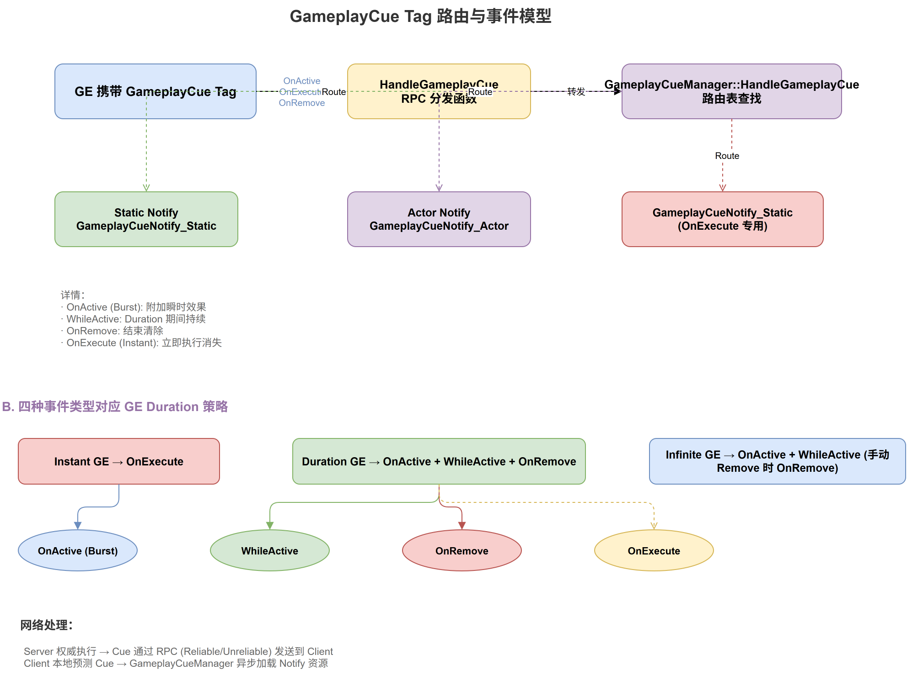

# 深入浅出UE5 GAS（九）：GameplayCue —— 技能反馈的表现层

## 系列目录

1. [AbilitySystemComponent —— GAS的心脏](../01-ASC/01-ASC文章.md)
2. [AttributeSet —— 数值系统的基石](../02-AttributeSet/02-AttributeSet文章.md)
3. [GameplayEffect（上）—— 从定义到应用](../03-GameplayEffect/03-GameplayEffect文章-上.md)
4. [GameplayEffect（下）—— Modifier、Stacking与Periodic](../03-GameplayEffect/03-GameplayEffect文章-下.md)
5. [ExecutionCalculation —— 自定义伤害公式](../04-ExecutionCalculation/04-ExecutionCalculation文章.md)
6. [GameplayAbility —— 技能的诞生与消亡](../05-GameplayAbility/05-GameplayAbility文章.md)
7. [AbilityTask —— 异步编程的艺术](../06-AbilityTask/06-AbilityTask文章.md)
8. [TargetData —— 索敌与数据传递](../07-TargetData/07-TargetData文章.md)
9. **（本文）GameplayCue —— 技能反馈的表现层**
10. [网络同步 —— 复制、预测与回滚](../09-Network/09-Network文章.md)
11. [GE Components —— UE 5.3 模块化新范式](../10-GEComponents/10-GEComponents文章.md)
12. [实战全景 —— 调试、陷阱与工程化模式](../11-Practice/11-Practice文章.md)

> 📎 [补遗篇 —— FGameplayAbilitySpec 详解](../12-Others/12-Others文章.md)

---

## 写在前面

到目前为止，我们讲的都是"逻辑层"的东西——ASC 管理 Ability、GE 修改 Attribute、Task 驱动异步逻辑。但玩家看到的不是这些。玩家看到的是火球飞出的粒子特效、受击时的屏幕震动、Buff 生效时的光环特效。

这些"表现层"的东西，在 GAS 中由 **GameplayCue（GC）** 系统负责。

GameplayCue 的设计有一个非常聪明的出发点：**逻辑层和表现层完全分离。** 逻辑层（GE、GA）只负责声明"一个效果发生了"（通过一个 GameplayTag），而表现层（GC）负责"如何展示"——这种设计让你可以轻松地替换特效、添加新的反馈方式，而无需修改任何游戏逻辑代码。

---

## 二、GameplayCue 的核心概念

### 2.1 本质：Tag 驱动的特效路由

GameplayCue 的核心就是一个 **Tag → Effect** 的映射表。它的工作流程极其简单：



```
GE 上配置了 GameplayCue Tag: "GameplayCue.Damage.Fire"
                │
                ▼
    GameplayCueManager 查找映射表
                │
                ▼
    找到 UGameplayCueNotify_Static 或 UGameplayCueNotify_Actor
                │
                ▼
    调用 HandleGameplayCue() → 播放特效/音效/震动...
```

### 2.2 为什么 GC Tag 必须以 "GameplayCue." 开头？

这不是可选项，而是强制的。`UGameplayCueManager` 通过 `BaseGameplayCueTag()` 返回这个前缀：

```cpp
FGameplayTag UGameplayCueSet::BaseGameplayCueTag()
{
    return FGameplayTag::RequestGameplayTag(TEXT("GameplayCue"));
}
```

所有 GC Tag 都是这个 BaseTag 的子 Tag。这样做的好处是：你可以在 GameplayTags 管理器中一次性找到所有 Cue 相关的 Tag，方便管理。

### 2.3 GC Tag 的层级结构

GC Tag 使用了层级命名：

```
GameplayCue.Damage                         ← 所有伤害的父级
  ├── GameplayCue.Damage.Physical          ← 物理伤害
  │   ├── GameplayCue.Damage.Physical.Slash  ← 斩击伤害
  │   └── GameplayCue.Damage.Physical.Blunt  ← 钝击伤害
  ├── GameplayCue.Damage.Fire              ← 火焰伤害
  └── GameplayCue.Damage.Ice               ← 冰霜伤害
```

这种层级设计的好处是 **IsOverride 机制**：如果你为 `Damage.Physical` 注册了一个 Cue，那么所有 `Damage.Physical.*` 的子 Tag 在没有自己的 Cue 时，会使用父级的 Cue。如果子 Tag（如 `Damage.Physical.Slash`）有自己的 Cue 并设置了 `IsOverride = true`，则会"覆盖"父级——不再调用父级 Cue。

---

## 三、两种 GameplayCue Notify 实现方式

GAS 提供了两种 GC Notify 类型，分别适用于不同的使用场景：

### 3.1 UGameplayCueNotify_Static —— "即用即走"

```cpp
UCLASS(Blueprintable, meta = (ShowWorldContextPin), hidecategories = (Replication), MinimalAPI)
class UGameplayCueNotify_Static : public UObject
{
    GENERATED_UCLASS_BODY()

    /** 处理 GameplayCue 事件 */
    virtual void HandleGameplayCue(AActor* MyTarget, EGameplayCueEvent::Type EventType, 
                                   const FGameplayCueParameters& Parameters);

    UPROPERTY(EditDefaultsOnly, Category = GameplayCue, meta=(Categories="GameplayCue"))
    FGameplayTag GameplayCueTag;
    
    UPROPERTY(AssetRegistrySearchable)
    FName GameplayCueName;
    
    /** 是否覆盖父级的 Cue */
    UPROPERTY(EditDefaultsOnly, Category = GameplayCue)
    bool IsOverride;
};
```

**关键特征：Static Cue 不创建实例（无 World Object）。** 它是直接通过 CDO 调用的，适合"一次性爆发"效果（如火球命中特效、音效、屏幕震动）。

**生命周期**：
- `OnExecute`：Instant 事件发生时调用（如立即伤害特效）
- `OnActive`：Duration Cue 首次激活时调用
- `WhileActive`：Duration Cue 持续中，每帧或定期调用（如果是 Actor 类型）
- `OnRemove`：Duration Cue 被移除时调用

```cpp
// Static Cue 的事件处理
virtual void HandleGameplayCue(AActor* MyTarget, EGameplayCueEvent::Type EventType, 
                               const FGameplayCueParameters& Parameters)
{
    switch (EventType)
    {
    case EGameplayCueEvent::OnActive:    OnActive(MyTarget, Parameters);    break;
    case EGameplayCueEvent::WhileActive: WhileActive(MyTarget, Parameters);  break;
    case EGameplayCueEvent::Executed:    OnExecute(MyTarget, Parameters);   break;
    case EGameplayCueEvent::Removed:     OnRemove(MyTarget, Parameters);    break;
    }
}
```

### 3.2 UGameplayCueNotify_Actor —— "常驻实体"

```cpp
UCLASS(Blueprintable, MinimalAPI)
class UGameplayCueNotify_Actor : public AActor
{
    GENERATED_BODY()

public:
    /** 处理 GameplayCue 事件 */
    virtual void HandleGameplayCue(AActor* MyTarget, EGameplayCueEvent::Type EventType, 
                                   const FGameplayCueParameters& Parameters);
    
    /** 持续时每帧调用 */
    virtual bool WhileActive_Implementation(AActor* MyTarget, 
                                           const FGameplayCueParameters& Parameters);
    
    /** 是否自动销毁 */
    UPROPERTY(EditDefaultsOnly, Category = Cleanup)
    bool bAutoDestroyOnRemove;
    
    /** 是否允许自动附着到目标 */
    UPROPERTY(EditDefaultsOnly, Category = GameplayCue)
    bool bAutoAttachToOwner;
    
protected:
    /** Owner 被销毁时的回调 */
    virtual void OnOwnerDestroyed();
};
```

**关键特征：Actor Cue 是一个真正的 Actor**，会被生成到世界中并持久存在（直到 Duration 结束）。这适合需要持续更新的效果，如：
- 角色身上的光环 Buff 特效（粒子系统附着在角色上）
- 燃烧地面（持续存在的区域效果）
- 护盾特效（跟随角色的网格体）

```cpp
// Actor Cue 的 WhileActive 实现
bool UGameplayCueNotify_Actor::WhileActive_Implementation(AActor* MyTarget, 
    const FGameplayCueParameters& Parameters)
{
    // 默认实现：将 Actor 附着到目标上
    if (MyTarget && bAutoAttachToOwner)
    {
        AttachToActor(MyTarget, FAttachmentTransformRules::SnapToTargetNotIncludingScale);
    }
    return true;
}
```

---

## 四、GameplayCue 的事件类型

```cpp
UENUM()
enum class EGameplayCueEvent : uint8
{
    OnActive,       // Cue 首次激活（Duration GE 开始时）
    WhileActive,    // Cue 持续中（Duration GE 期间）
    Executed,       // Cue 即时执行（Instant GE，或 Duration GE 的首次执行）
    Removed         // Cue 被移除（Duration GE 结束时）
};
```

### 4.1 事件触发规则

**对于 Instant GE 的 Cue**：
- 触发 `Executed` 事件一次

**对于 Duration/Infinite GE 的 Cue**：
- 触发 `OnActive` 当 GE 首次激活时
- 触发 `Executed` 当 GE 首次应用时（如果 `bExecutePeriodicEffectOnApplication` 为 true，每次 Period 也会触发）
- 触发 `WhileActive` 定期更新（Actor Cue 可能每帧，Static Cue 只在有实际调用时才触发）
- 触发 `Removed` 当 GE 被移除时

### 4.2 一个完整的 Duration Cue 生命周期

```
时间线：
  ┌─── GE 应用 ────────────────────── GE 移除 ───┐
  │     │                                │         │
  │     ▼                                ▼         │
  │ Executed  OnActive              Removed       │
  │    (一次)   (一次)               (一次)        │
  │              │                                  │
  │              ▼                                  │
  │         WhileActive ───────────────────         │
  │         (可能多次, Actor Cue每帧)                │
  └────────────────────────────────────────────────┘
```

---

## 五、UGameplayCueManager —— 全局调度器

```cpp
UCLASS(MinimalAPI)
class UGameplayCueManager : public UDataAsset
{
    GENERATED_UCLASS_BODY()

public:
    /** 处理一个 GameplayCue 事件 */
    virtual void HandleGameplayCue(AActor* TargetActor, FGameplayTag GameplayCueTag, 
                                   EGameplayCueEvent::Type EventType, 
                                   const FGameplayCueParameters& Parameters);

    /** 处理一个 GameplayCue（指定 Instigator 和 EffectCauser） */
    virtual void HandleGameplayCue(AActor* TargetActor, const FGameplayTag GameplayCueTag, 
                                   EGameplayCueEvent::Type EventType,
                                   const FGameplayCueParameters& Parameters, 
                                   AActor* Instigator, AActor* EffectCauser);

    /** 刷新（批量处理）GameplayCue */
    virtual void FlushPendingCues();

    /** 添加全局 GameplayCue Notify 目录 */
    virtual void AddGameplayCueNotifyPath(const FString& InPath);
    
protected:
    /** Cue 处理批量数组（等待处理） */
    TArray<FGameplayCuePendingExecute> PendingExecuteCues;
    
    /** 引擎 Cue Notify 路径列表 */
    TArray<FString> GameplayCueNotifyPaths;
    
    /** 异步加载请求 */
    TArray<FSoftObjectPath> LoadRequests;
};
```

### 5.1 GameplayCueManager 的核心职责

1. **Tag 路由**：根据 GC Tag 找到对应的 Notify 类
2. **异步加载**：按需加载 Cue 资源（避免一次性加载所有 Cue）
3. **批量处理**：收集一帧内的所有 Cue 请求，批量处理
4. **实例管理**：管理 Actor Cue 的生命周期（生成、回收）
5. **网络路由**：决定 Cue 是在客户端还是服务器执行

### 5.2 异步加载机制

Cue Notify 不会在游戏启动时全部加载——那太浪费内存了。GameplayCueManager 使用异步加载：

```cpp
// FGameplayCueNotifyData 中使用 FSoftObjectPath
struct FGameplayCueNotifyData
{
    FGameplayTag GameplayCueTag;
    FSoftObjectPath GameplayCueNotifyObj;   // ← 软引用，不会自动加载
    UClass* LoadedGameplayCueClass;         // ← 加载后的 Class 引用
    int32 ParentDataIdx;                    // ← 父级 Cue 的索引
};
```

当第一次触发某个 GC Tag 时，GameplayCueManager 会：
1. 查找 `GameplayCueDataMap`
2. 发现对应的 `FSoftObjectPath`
3. 异步加载对应的蓝图/C++ 类
4. 加载完成后调用 HandleGameplayCue

---

## 六、FGameplayCueParameters —— 传递上下文

`FGameplayCueParameters` 是 GE 向 Cue Notify 传递上下文的数据包。它包含了几层不同维度的信息：

**数值层** —— 伤害/治疗的大小，用于特效强度缩放：

```cpp
USTRUCT(BlueprintType)
struct FGameplayCueParameters
{
    GENERATED_USTRUCT_BODY()

    /** 归一化大小 —— 比如伤害值 / 最大生命值，范围 0~1 */
    UPROPERTY(BlueprintReadWrite, Category = GameplayCue)
    float NormalizedMagnitude;

    /** 原始大小 —— 比如实际造成的伤害数值 */
    UPROPERTY(BlueprintReadWrite, Category = GameplayCue)
    float RawMagnitude;
```

**身份层** —— 这个 Cue 是哪个 Tag 触发的、谁的 GE 触发的：

```cpp
    /** 效果上下文 —— 包含 Instigator、HitResult 等完整信息 */
    UPROPERTY(BlueprintReadWrite, Category = GameplayCue)
    FGameplayEffectContextHandle EffectContext;

    /** 匹配到的 Tag 名称 */
    UPROPERTY(BlueprintReadWrite, Category = GameplayCue)
    FGameplayTag MatchedTagName;
    UPROPERTY(BlueprintReadWrite, Category = GameplayCue)
    FGameplayTag OriginalTag;

    /** 源和目标身上的聚合 Tag */
    UPROPERTY(BlueprintReadWrite, Category = GameplayCue)
    FGameplayTagContainer AggregatedSourceTags;
    UPROPERTY(BlueprintReadWrite, Category = GameplayCue)
    FGameplayTagContainer AggregatedTargetTags;
```

**空间层** —— 特效在哪播放、朝向哪：

```cpp
    /** 命中位置和法线（网络优化的 Vector 类型） */
    UPROPERTY(BlueprintReadWrite, Category = GameplayCue)
    FVector_NetQuantize10 Location;
    UPROPERTY(BlueprintReadWrite, Category = GameplayCue)
    FVector_NetQuantizeNormal Normal;

    /** Instigator 和 Causer */
    UPROPERTY(BlueprintReadWrite, Category = GameplayCue)
    TWeakObjectPtr<AActor> Instigator;
    UPROPERTY(BlueprintReadWrite, Category = GameplayCue)
    TWeakObjectPtr<AActor> EffectCauser;
```

**场景层** —— 物理材质、等级、附着点等辅助信息：

```cpp
    UPROPERTY(BlueprintReadWrite, Category = GameplayCue)
    TWeakObjectPtr<const UPhysicalMaterial> PhysicalMaterial;

    UPROPERTY(BlueprintReadWrite, Category = GameplayCue)
    int32 GameplayEffectLevel;
    UPROPERTY(BlueprintReadWrite, Category = GameplayCue)
    int32 AbilityLevel;

    /** 目标附着组件 —— 特效需要附着到角色骨骼时使用 */
    UPROPERTY(BlueprintReadWrite, Category = GameplayCue)
    TWeakObjectPtr<USceneComponent> TargetAttachComponent;
    
    UPROPERTY(BlueprintReadWrite, Category = GameplayCue)
    bool bReplicateLocationWhenUsingMinimalRepProxy;
};
```

通过这些字段，Cue Notify 可以根据伤害大小调整特效强度（`NormalizedMagnitude`）、根据物理材质选择不同音效/粒子（`PhysicalMaterial`）、以及获取施法者和位置信息。

---

## 七、网络处理：客户端的 Cue

Cue 在网络中的处理是一个精妙的平衡：既要保证视觉正确，又要减少带宽消耗。

### 7.1 GameplayCue 的本地 vs 复制的执行规则

```
Instant Cue (Executed):
  - 客户端预测：本地立即执行
  - 服务器执行：确认后可选是否再次执行
  - 通常只执行一次

Duration Cue (OnActive / WhileActive / Removed):
  - 所有客户端都会收到 Cue 事件
  - 通过 ASC 的 GE 复制触发的
  - 后期加入的玩家也会通过 WhileActive 看到已有效果
```

### 7.2 Minimal 复制模式下的 Cue

在 `EGameplayEffectReplicationMode::Minimal` 模式下，不是所有信息都会被复制。但 GameplayCue 系统通过特殊的 `FMinimalReplicationTagCountMap` 来确保关键 Cue Tag 依然能够到达其他客户端。

---

## 八、UGameplayCueSet —— 映射表

```cpp
UCLASS(MinimalAPI)
class UGameplayCueSet : public UDataAsset
{
    /** 所有已注册的 Cue 数据 */
    UPROPERTY(EditAnywhere, Category = CueSet)
    TArray<FGameplayCueNotifyData> GameplayCueData;
    
    /** Tag 到索引的快速查找表 */
    TMap<FGameplayTag, int32> GameplayCueDataMap;
    
    /** 处理 Cue 事件 */
    virtual bool HandleGameplayCue(AActor* TargetActor, FGameplayTag GameplayCueTag, 
                                   EGameplayCueEvent::Type EventType, 
                                   const FGameplayCueParameters& Parameters);
};
```

游戏通常将一个 `UGameplayCueSet`（DataAsset）配置在 `UGameplayCueManager`（Project Settings 中指定）中，该 DataAsset 包含了所有 GC Tag 和 Notify 类的映射。

### 8.1 映射表查找流程

```
HandleGameplayCue(Tag="GameplayCue.Damage.Fire.Small")
  │
  ├─ 1. 查找 GameplayCueDataMap[GameplayCue.Damage.Fire.Small]
  │       找到 → 调用对应的 Notify
  │       未找到 → 继续向上查找父Tag
  │
  ├─ 2. 查找 GameplayCueDataMap[GameplayCue.Damage.Fire]
  │       找到但 IsOverride=true → 停止（子Tag设为Override时不调用父级）
  │       找到且 IsOverride=false → 调用（作为"通用"处理）
  │       未找到 → 继续
  │
  ├─ 3. 查找 GameplayCueDataMap[GameplayCue.Damage]
  │       ...
  │
  └─ ... 一直查到 BaseGameplayCueTag
```

---

## 九、在 GameplayEffect 中配置 Cue

除了 GE 的 Modifier，你还可以在 GE 中配置 Cue：

```cpp
// 在 GE 的数据配置中
UPROPERTY(EditDefaultsOnly, Category = Display)
FGameplayEffectCue GameplayCue;
```

结构体 `FGameplayEffectCue`：

```cpp
USTRUCT(BlueprintType)
struct FGameplayEffectCue
{
    UPROPERTY(EditDefaultsOnly, Category = GameplayCue)
    FGameplayTag GameplayCueTag;                  // Cue Tag
    
    UPROPERTY(EditDefaultsOnly, Category = GameplayCue)
    FGameplayEffectCueMagnitude MagnitudeLevel;   // 大小等级
    
    UPROPERTY(EditDefaultsOnly, Category = GameplayCue)
    float MinLevel;                               // 最小等级
    
    UPROPERTY(EditDefaultsOnly, Category = GameplayCue)
    float MaxLevel;                               // 最大等级
};
```

---

### 十、设计思考：表现与逻辑分离的价值

GameplayCue 的设计是 MVVM（Model-View-ViewModel）思想在游戏系统中的体现：

- **Model（逻辑层）**：GE 应用 → 修改属性 → 设置 Cue Tag
- **View（表现层）**：CueManager → 路由到 Notify → 播放特效/音效
- **ViewModel**：`FGameplayCueParameters` 携带从 Model 到 View 的上下文数据

这种分离的好处是显而易见的：

1. **独立迭代**：美术可以修改特效，不影响游戏逻辑
2. **平台适配**：不同平台可以注册不同的 Notify（移动端用简化特效）
3. **模组支持**：社区可以替换 Notify 而不触及游戏代码
4. **测试方便**：可以 Mock Cue 系统，单独测试游戏逻辑

---

## 十一、总结与回顾

GameplayCue 系统的关键组件：

| 组件 | 核心类 | 职责 |
|------|-------|------|
| 映射表 | `UGameplayCueSet` | Tag → Notify Class 的映射 |
| 全局调度 | `UGameplayCueManager` | 路由、异步加载、批量处理 |
| 静态通知 | `UGameplayCueNotify_Static` | 一次性效果（粒子爆发、音效） |
| Actor 通知 | `UGameplayCueNotify_Actor` | 持续效果（光环、地面效果） |
| 事件类型 | `EGameplayCueEvent` | Executed / OnActive / WhileActive / Removed |
| 上下文数据 | `FGameplayCueParameters` | 从逻辑层传递到表现层的数据 |

核心设计思想：

1. **Tag 驱动的路由**：逻辑只声明"发生了什么"，表现决定"如何展示"
2. **层级 Tag 覆盖**：子 Tag 可以覆盖父 Tag 的 Cue 行为
3. **Static vs Actor 两种模式**：分别服务于一次性效果和持续效果
4. **异步加载**：按需加载 Cue 资源，减少启动时间和内存占用
5. **网络透明**：客户端和服务器的 Cue 执行规则不同但逻辑统一
6. **逻辑表现分离**：最大的设计价值，允许美术和程序独立工作

**下一篇预告**：表现层完毕，我们来面对 GAS 中最硬核的部分——网络同步。为什么客户端的预测 GE 可以"先执行、后验证"？`FPredictionKey` 如何实现精确的回滚？`FastArraySerializer` 如何优化 GE 的网络复制？

---

*本系列文章基于 UE 5.8 源码分析，GameplayAbilities 插件路径：`Engine/Plugins/Runtime/GameplayAbilities`*
