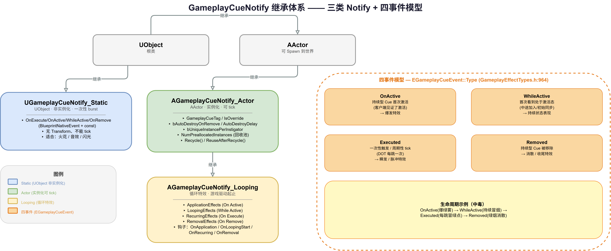
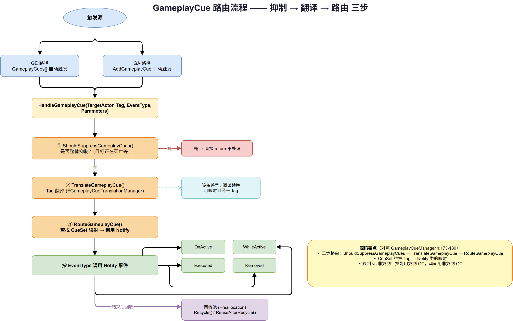

# 09 | GameplayCue — 表现层触发机制

> **本篇**：GAS 的表现层 —— GameplayCue 如何把"技能/效果发生了什么"变成屏幕上的特效、音效与动画：Tag 路由、四事件模型、三类 Notify、回收池与网络复制

> **系列**: 《Inside GAS》— UE5 GameplayAbilitySystem 源码深度分析  
> **难度**: 🔵 核心  
> **字数**: ~6500  
> **前置**: 05/06-GameplayEffect、07/08-GameplayAbility  
> **源码路径**: `Engine/Plugins/Runtime/GameplayAbilities/Source/GameplayAbilities/Public/GameplayCueManager.h`

---

> **系列导航**
> 
> | 阶段 | 篇章 | 内容 | 状态 |
> |------|------|------|------|
> | 🟢 基础 | 01 | GAS 总览与核心架构 | ✅ |
> | | 02 | ASC — 核心调度器 | ✅ |
> | | 03 | GameplayTags — 通用语言 | ✅ |
> | | 04 | AttributeSet — 属性定义与复制 | ✅ |
> | 🔵 核心 | 05 | GameplayEffect — 效果与计算 (上) | ✅ |
> | | 06 | GameplayEffect — 效果与计算 (下) | ✅ |
> | | 07 | GameplayAbility — 技能激活与核心框架 (上) | ✅ |
> | | 08 | GameplayAbility — Task/输入/预测 (下) | ✅ |
> | | **09** | **GameplayCue — 表现层触发机制** | ✅ |
> | 🔴 高级 | 10 | Prediction — 预测与回滚 | 📝 |
> | | 11 | GE Components — 组件化架构演进 | 📝 |
> | | 12 | Network & Serial — 网络序列化 | 📝 |
> | | 13 | Targeting — 瞄准系统 | 📝 |
> | | 14 | Debug & Optimization — 调试与优化 | 📝 |
> | | 15 | 终篇回顾 — 全景复习 | 📝 |

---

## 一、问题驱动：属性改了，但屏幕上什么都没发生

前面四篇（05/06 GE、07/08 GA）讲的都是"逻辑层"的事：属性怎么算、效果怎么执行、技能怎么激活。但玩家看不到属性数值，也看不到 `CanActivateAbility` 的检查链——玩家看到的，是火球砸中目标时迸出的火花、是护盾开启时的一圈光幕、是中毒时角色身上冒出的绿烟。

这就是**表现层（Cosmetic Layer）**的职责。它要回答一个核心问题：

> 当某个 GameplayTag 被"触发"时，如何让正确的特效 / 音效 / 动画，出现在正确的目标身上，在正确的时机播放？

GAS 的答案就是 **GameplayCue（简称 GC）**。它的设计哲学贯穿三条主线，也是本篇要拆解的三件事：

1. **用 Tag 做路由**——不直接引用"火花粒子"这个资产，而是引用 `GameplayCue.Fire.Impact` 这个 Tag，由表现层自己去决定这个 Tag 对应什么表现；
2. **用事件做生命周期**——一个表现不是"播一下"就完了，它有 `OnActive`（刚激活）/ `WhileActive`（持续中）/ `Executed`（触发）/ `Removed`（移除）四个阶段；
3. **用 Notify 做载体**——表现的具体实现是三类 `GameplayCueNotify`，它们被 `UGameplayCueManager` 统一加载、路由、回收。

---

## 二、概念速览：四个核心概念一张图讲清

在深入源码前，先建立概念坐标系。GameplayCue 体系由四个角色构成：

| 概念 | 类型 | 角色 | 类比 |
|------|------|------|------|
| `GameplayCueTag` | `FGameplayTag` | 表现的"名字"，用 `GameplayCue.*` 命名空间 | 剧院的节目单 |
| `FGameplayCueParameters` | 结构体 | 携带"这次表现"的上下文（位置、施法者、强度） | 演出的道具与演员信息 |
| `GameplayCueNotify` | UObject/Actor | 表现的"实现"，真正播特效/音效的东西 | 具体的演员 |
| `UGameplayCueManager` | UDataAsset 单例 | 加载、路由、回收 Notify 的总调度 | 剧院经理 |

一条表现请求的完整生命周期是这样的：

```
GE/GA 配置了 GameplayCueTag
  → ASC 触发该 Tag（带着 FGameplayCueParameters）
  → UGameplayCueManager.HandleGameplayCue()
      → RouteGameplayCue()（三步骤：抑制 → 翻译 → 路由）
          → 找到对应的 GameplayCueNotify
              → 按事件类型调用 OnActive / WhileActive / Executed / OnRemove
```

理解了这个闭环，就能理解为什么 GC 被称为 GAS 里"最解耦"的子系统——逻辑层只负责喊"发生了 `GameplayCue.Fire.Impact`"，至于这个 Tag 对应什么火花、什么音效，完全是表现层的事，甚至可以在不改逻辑层的前提下换一套完全不同的表现。

---

## 三、事件模型：四个事件的生命周期

### 3.1 EGameplayCueEvent 的真实定义

GC 的核心是"事件"。`EGameplayCueEvent` 定义在 `GameplayEffectTypes.h:964`，和 GAS 里其他枚举一样，是 `UENUM + namespace + enum Type : int` 的形式（不是 `enum class`）：

```cpp
// GameplayEffectTypes.h:964
UENUM(BlueprintType)
namespace EGameplayCueEvent
{
    enum Type : int
    {
        OnActive,    // 持续型 Cue 首次激活（客户端见证了激活才触发）
        WhileActive, // 首次"看到"该 Cue 处于激活态（中途加入、初始同步等）
        Executed,    // 一次性触发（瞬发特效 / 周期性 tick）
        Removed      // 持续型 Cue 被移除
    };
}
```

### 3.2 四个事件分别是什么意思

这四个事件是理解 GC 的关键，也是新手最容易混淆的地方。用"中毒"这个持续型效果举例：

| 事件 | 触发时机 | 中毒例子 | 典型用途 |
|------|---------|---------|---------|
| `OnActive` | Cue **刚被应用**，且客户端见证了激活 | 中毒瞬间，角色身上爆出一团绿雾 | 开场的爆发特效 |
| `WhileActive` | 客户端**首次看到**该 Cue 处于激活态（可能是中途加入/切地图后初始同步） | 中途加入的玩家看到队友身上持续冒绿烟 | 持续状态的表现 |
| `Executed` | 一次性触发，或周期性 tick（DOT 每跳一次） | 中毒每跳一次伤害，冒出一个小绿点 | 瞬发特效、周期性脉冲 |
| `Removed` | 持续型 Cue **被移除** | 中毒结束，绿烟消散 | 收尾的消散特效 |

**关键区别**：`OnActive` 和 `WhileActive` 看似都处理"激活态"，但语义完全不同：

- `OnActive` 强调"**我亲眼看到了这次激活的发生**"——客户端本地预测、或实时在场的玩家才触发；
- `WhileActive` 强调"**我看到了这个 Cue 正处于激活态**"——即使激活发生时我不在场（比如刚加入服务器、刚被同步过来），也要把这个持续状态表现出来。

这个区分对多人游戏的正确性至关重要：没有 `WhileActive`，中途加入的玩家就看不到队友身上本应持续的护盾光幕。

---

## 四、三类 Notify：表现的具体载体

GC 的"表现实现"是 `GameplayCueNotify`。它分三类，选择哪一类取决于"这个表现要不要保持状态、要不要每帧更新"。

### 4.1 UGameplayCueNotify_Static —— 一次性 burst

```cpp
// GameplayCueNotify_Static.h:18
UCLASS(Blueprintable, meta = (ShowWorldContextPin), hidecategories = (Replication), MinimalAPI)
class UGameplayCueNotify_Static : public UObject
{
    // ...
};
```

**关键点**：

- 继承自 **`UObject`，不是 Actor**，因此**不会被实例化到世界里**，没有 Transform，不能 tick；
- 适合"一次性 burst"效果：打一下火花、播一下音效、闪一下光；
- 它处理事件的方式和 Actor 版一样，也有 `OnExecute`/`OnActive`/`WhileActive`/`OnRemove` 四个 `BlueprintNativeEvent`，但都是 `const` 方法（`GameplayCueNotify_Static.h:44-58`）。

### 4.2 AGameplayCueNotify_Actor —— 实例化、可 tick

```cpp
// GameplayCueNotify_Actor.h:19
UCLASS(Blueprintable, meta = (ShowWorldContextPin), hidecategories = (Replication), MinimalAPI)
class AGameplayCueNotify_Actor : public AActor
{
    // ...
};
```

**关键点**：

- 继承自 **`AActor`**，会被真正 `Spawn` 到世界里，有 Transform、可以 `Tick`；
- 适合需要"跟随目标、保持状态、每帧更新"的表现（如跟随角色移动的光环）；
- 它有一组重要的清理配置（`GameplayCueNotify_Actor.h:70-84`）：
  - `bAutoDestroyOnRemove`：`OnRemove` 事件触发后是否自动销毁（回收）；
  - `AutoDestroyDelay`：自动销毁前停留的秒数；
  - `WarnIfTimelineIsStillRunning` / `WarnIfLatentActionIsStillRunning`：清理时若有未结束的 Timeline / 延迟节点，是否告警。

### 4.3 AGameplayCueNotify_Looping —— 循环特效

```cpp
// GameplayCueNotify_Looping.h:19
UCLASS(Blueprintable, notplaceable, Category = "GameplayCueNotify", ...)
class AGameplayCueNotify_Looping : public AGameplayCueNotify_Actor
{
    // ...
};
```

**关键点**：

- 是 `AGameplayCueNotify_Actor` 的子类，专门用于**游戏驱动的循环特效**——"开始/结束由游戏逻辑的 Add/Remove Cue 决定"；
- 它把特效分成四组（`GameplayCueNotify_Looping.h:66-96`）：
  - `ApplicationEffects`（On Active 时播放的爆发特效）；
  - `LoopingEffects`（While Active 期间持续的循环特效）；
  - `RecurringEffects`（On Execute 时每次 tick 触发的脉冲特效）；
  - `RemovalEffects`（On Remove 时播放的收尾特效）；
- 它还有四个 `BlueprintImplementableEvent` 钩子：`OnApplication` / `OnLoopingStart` / `OnRecurring` / `OnRemoval`。



*图：三类 GameplayCueNotify 继承体系与四事件模型 —— UGameplayCueNotify_Static（UObject 非实例化）、AGameplayCueNotify_Actor（AActor 实例化可 tick）、AGameplayCueNotify_Looping（循环特效）；右侧为 EGameplayCueEvent 的 OnActive/WhileActive/Executed/Removed 四事件与"中毒"生命周期示例*

### 4.4 三类的选择决策

| 需求 | 选择 |
|------|------|
| 一次性火花、音效，不需要位置跟随 | `UGameplayCueNotify_Static` |
| 需要跟随目标、持续更新状态 | `AGameplayCueNotify_Actor` |
| 持续循环特效，开始/结束由游戏逻辑控制 | `AGameplayCueNotify_Looping` |

---

## 五、核心字段：Tag、Override 与唯一性

不管是 Static 还是 Actor 版，`GameplayCueNotify` 都有几个**决定路由行为**的关键字段（`GameplayCueNotify_Actor.h:106-152`）：

| 字段 | 类型 | 作用 |
|------|------|------|
| `GameplayCueTag` | `FGameplayTag` | 这个 Notify 响应哪个 Tag（`meta=(Categories="GameplayCue")`） |
| `GameplayCueName` | `FName` | 镜像 `GameplayCueTag`，用于资产注册表搜索（`AssetRegistrySearchable`） |
| `IsOverride` | `bool` | 是否**覆盖**父级 Cue（见下） |
| `bUniqueInstancePerInstigator` | `bool` | 每个 Instigator 是否独立实例 |
| `bUniqueInstancePerSourceObject` | `bool` | 每个 SourceObject 是否独立实例 |
| `bAllowMultipleOnActiveEvents` | `bool` | 是否允许多次触发 On Active |
| `bAllowMultipleWhileActiveEvents` | `bool` | 是否允许多次触发 While Active |
| `bAutoAttachToOwner` | `bool` | 激活期间是否附着到目标 Actor |
| `NumPreallocatedInstances` | `int32` | 预分配的实例数量（回收池） |

### 5.1 层级 Tag 与 IsOverride

GC 的 Tag 是**层级化的**。比如：

```
GameplayCue.Damage             // 通用伤害表现
GameplayCue.Damage.Physical    // 物理伤害（比上面更具体）
GameplayCue.Damage.Physical.Slash  // 斩击（最具体）
```

默认情况下，触发 `Damage.Physical.Slash` 时，`Damage`、`Damage.Physical`、`Damage.Physical.Slash` **三层的 Notify 都会被依次调用**（从最具体到最通用）。而 `IsOverride` 的作用就是**打断这个链**：

> 如果 `Damage.Physical.Slash` 这个 Notify 的 `IsOverride = true`，那么触发它之后，就不再向上调用 `Damage.Physical` 和 `Damage`。

源码注释原话（`GameplayCueNotify_Actor.h:118`）：

> Does this Cue override other cues, or is it called in addition to them? E.g., If this is Damage.Physical.Slash, we won't call Damage.Physical after we run this cue.

这给了设计师一个"特例化"的杠杆：大部分伤害共用 `Damage` 的表现，唯独斩击想要完全不同的表现时，就做一个 `IsOverride` 的 `Damage.Physical.Slash`。

### 5.2 唯一性控制

`bUniqueInstancePerInstigator` / `bUniqueInstancePerSourceObject` 解决的是"多个来源打到同一目标，要不要开多个实例"的问题。源码注释给了一个很清晰的例子：

- 如果 Notify 只是**在目标身上播火花/音效**，不需要区分来源，就**不**需要唯一实例；
- 如果 Notify 是**从 Instigator 连到目标的一道光束**，每个 Instigator 的光束位置不同，就**需要** `bUniqueInstancePerInstigator = true`。

---

## 六、参数载体：FGameplayCueParameters

`FGameplayCueParameters`（`GameplayEffectTypes.h:840`）是 GC 事件的"上下文参数包"。它定义了这次表现需要知道的一切（字段定义在 `GameplayEffectTypes.h:864-933`）：

| 字段 | 类型 | 含义 |
|------|------|------|
| `NormalizedMagnitude` | `float` | 归一化强度（0-1），"这个效果有多强" |
| `RawMagnitude` | `float` | 原始强度值（用于显示数字） |
| `EffectContext` | `FGameplayEffectContextHandle` | 效果上下文（命中结果等） |
| `MatchedTagName` / `OriginalTag` | `FGameplayTag` | 匹配到的 Tag / 原始 Tag（`NotReplicated`） |
| `AggregatedSourceTags` / `AggregatedTargetTags` | `FGameplayTagContainer` | 聚合的来源/目标 Tag |
| `Location` / `Normal` | `FVector_NetQuantize10` / `...Normal` | 触发位置 / 法线（用压缩向量） |
| `Instigator` / `EffectCauser` | `TWeakObjectPtr<AActor>` | 发起者 / 实际造成伤害者（如武器/弹丸） |
| `SourceObject` | `TWeakObjectPtr<const UObject>` | 来源对象 |
| `PhysicalMaterial` | `TWeakObjectPtr<const UPhysicalMaterial>` | 命中的物理材质 |
| `GameplayEffectLevel` / `AbilityLevel` | `int32` | GE / 技能等级 |
| `TargetAttachComponent` | `TWeakObjectPtr<USceneComponent>` | 要附着的组件 |

**两个值得注意的设计点**：

1. **`NormalizedMagnitude` 是表现层的关键输入**。它的来源是 `FGameplayEffectCue::NormalizeLevel()`（`GameplayEffect.h:639`），把 GE 等级映射到 0-1 区间。设计师可以用它做"伤害越高，火花越大"的缩放——同一个 `GameplayCue.Damage` Notify，收到 `NormalizedMagnitude=0.2` 时播小火花，`0.9` 时播大火球。

2. **`Instigator` 和 `EffectCauser` 是弱引用**（`TWeakObjectPtr`）。它们不阻止对象被 GC，但能在表现层区分"是谁发的这个技能"（Instigator）和"实际是什么东西造成的"（EffectCauser，可能是抛出的弹丸）。

---

## 七、路由核心：UGameplayCueManager

### 7.1 它是什么

```cpp
// GameplayCueManager.h:129
UCLASS(MinimalAPI)
class UGameplayCueManager : public UDataAsset
{
    // ...
};
```

`UGameplayCueManager` 是一个 **`UDataAsset` 单例**（通过 `UAbilitySystemGlobals` 持有），负责 GC 的"总调度"：加载 Notify、路由事件、管理回收池。

### 7.2 路由入口：HandleGameplayCue

真正的入口是 `HandleGameplayCue`（`GameplayCueManager.h:171`），它调用 `RouteGameplayCue`（`GameplayCueManager.h:180`）完成三步路由。源码把这三步注释得很清楚（`GameplayCueManager.h:173-180`）：

```cpp
// 1. returns true to ignore gameplay cues
virtual bool ShouldSuppressGameplayCues(AActor* TargetActor);

// 2. Allows Tag to be translated in place to a different Tag
void TranslateGameplayCue(FGameplayTag& Tag, AActor* TargetActor, const FGameplayCueParameters& Parameters);

// 3. Actually routes the gameplaycue event to the right place
virtual void RouteGameplayCue(AActor* TargetActor, FGameplayTag GameplayCueTag, EGameplayCueEvent::Type EventType, const FGameplayCueParameters& Parameters, EGameplayCueExecutionOptions Options);
```

三步流程：

```
HandleGameplayCue(TargetActor, Tag, EventType, Parameters)
  ├─ 1. ShouldSuppressGameplayCues()? —— 是否整体抑制（如目标正在死亡）
  │       → 是：直接 return，不处理
  ├─ 2. TranslateGameplayCue() —— Tag 翻译（FGameplayCueTranslationManager）
  │       → 可把 Tag 映射成另一个 Tag（如设备差异、调试替换）
  └─ 3. RouteGameplayCue() —— 真正路由
          → 找到匹配的 Notify，按事件类型调用
```



*图：GameplayCue 路由流程 —— 从 GE/GA 两条路径触发，经 HandleGameplayCue 进入三步路由（① ShouldSuppressGameplayCues 抑制检查 ② TranslateGameplayCue Tag 翻译 ③ RouteGameplayCue 查找 CueSet 映射），最终按 EventType 分发到 Notify 的四个事件，结束后进入回收池*

### 7.3 翻译：TranslateGameplayCue

`TranslateGameplayCue` 背后的 `FGameplayCueTranslationManager` 提供了一种"**在运行时改写 Tag**"的能力。典型用途：

- **设备差异**：低端设备把 `GameplayCue.Explosion.Huge` 翻译成 `GameplayCue.Explosion.Small`；
- **调试替换**：临时把某个 Tag 指到另一个 Notify 上观察效果。

这一步是可选的，默认不做任何翻译（Tag 原样传递）。

### 7.4 加载：ObjectLibrary 与 CueSet

`UGameplayCueManager` 用 `FGameplayCueObjectLibrary`（`GameplayCueManager.h:50`）管理 Notify 资产的发现与加载：

- **RuntimeObjectLibrary**：扫描"always loaded"路径（`UAbilitySystemGlobals::GetGameplayCueNotifyPaths()`），启动时加载，注册到全局 CueSet；
- **EditorObjectLibrary**：仅编辑器用，反射资产注册表，用于展示"所有可能存在的 Notify"。

关键机制是 **`UGameplayCueSet`**——它维护 `GameplayTag → Notify 类` 的映射。路由时，`RouteGameplayCue` 就是在这个映射里查找"哪个 Notify 响应这个 Tag"。

### 7.5 回收池：Preallocation

`AGameplayCueNotify_Actor` 是 Actor，频繁 Spawn/Destroy 会产生 GC 压力。GC 用**预分配回收池**解决：

- `FPreallocationInfo`（`GameplayCue_Types.h:74`）按 World 维护 `UClass → 预分配实例数组` 的映射；
- `NumPreallocatedInstances`（`GameplayCueNotify_Actor.h:151`）声明每个类要预分配几个；
- Cue 结束后不是 `Destroy`，而是走 `Recycle()`（`GameplayCueNotify_Actor.h:57`）回到池里，下次 `ReuseAfterRecycle()`（`GameplayCueNotify_Actor.h:60`）再拿出来用；
- `NotifyGameplayCueActorFinished`（`GameplayCueManager.h:207`）通知管理器"这个 Actor 可以回收了"。

这解释了为什么 `AGameplayCueNotify_Actor` 有 `Recycle()` / `ReuseAfterRecycle()` 这对方法——它们是回收池的"复位/复用"钩子。

---

## 八、两种触发路径：GE 与 GA

GC 可以从两条路径被触发，这是新手容易忽略的。

### 8.1 通过 GE（GameplayEffect）

GE 上有一个 `GameplayCues` 数组（`GameplayEffect.h:2332`）：

```cpp
UPROPERTY(EditDefaultsOnly, BlueprintReadOnly, Category = "GameplayCues")
TArray<FGameplayEffectCue> GameplayCues;
```

每个 `FGameplayEffectCue`（`GameplayEffect.h:606`）包含：

| 字段 | 含义 |
|------|------|
| `MagnitudeAttribute` | 用作 Cue 强度的属性（`NormalizedMagnitude` 的来源） |
| `MinLevel` / `MaxLevel` | 支持的等级区间 |
| `GameplayCueTags` | 触发的 Tag 容器 |

还有两个开关（`GameplayEffect.h:2323-2328`）：

- `bRequireModifierSuccessToTriggerCues`：只有 GE 的 modifier 成功应用了才触发 Cue；
- `bSuppressStackingCues`：堆叠 GE 只在第一层触发 Cue，避免重复表现。

**GE 路径的关键特性**：GE 的 Cue 是"自动"触发的——GE 被应用/执行/移除时，ASC 会自动调用对应的 GC 事件，逻辑层不用手动写"播特效"的代码。

### 8.2 通过 GA（GameplayAbility）

GA 不走 GE，而是通过 `UAbilitySystemBlueprintLibrary` 提供的节点（如 `AddGameplayCue` / `ExecuteGameplayCue` / `RemoveGameplayCue`）直接触发。这套机制的核心是 `FActiveGameplayCueContainer`（`GameplayCueInterface.h:130`），它是一个 `FFastArraySerializer`，维护"当前激活的 Cue"列表，并通过 `AddCue` / `RemoveCue` / `PredictiveAdd` / `PredictiveRemove` 驱动复制。

GA 路径的意义在于：**技能可以不创建 GE 就发出复制的 GC**。源码注释（`GameplayCueInterface.h:91-94`）说得很直白：

> This is meant to provide another way of using GameplayCues without having to go through GameplayEffects. E.g., it is convenient if GameplayAbilities can issue replicated GameplayCues without having to create a GameplayEffect.

### 8.3 复制 vs 非复制

`UGameplayCueManager` 还提供了一组**非复制**的静态便捷方法（`GameplayCueManager.h:194-196`）：

```cpp
static void AddGameplayCue_NonReplicated(...);
static void RemoveGameplayCue_NonReplicated(...);
static void ExecuteGameplayCue_NonReplicated(...);
```

源码注释（`GameplayCueManager.h:182-193`）解释了设计意图——**不要让设计师纠结"要不要复制"**：

- **技能**总是用**复制**的 GC（因为技能不在 simulated proxy 上执行）；
- **动画**总是用**非复制**的 GC（因为动画总在 simulated proxy 上执行）。

---

## 九、接口层：IGameplayCueInterface

GC 事件最终要"到达"目标对象。目标对象通过实现 `IGameplayCueInterface`（`GameplayCueInterface.h:30`）来接收：

```cpp
class IGameplayCueInterface
{
public:
    virtual void HandleGameplayCue(UObject* Self, FGameplayTag GameplayCueTag,
                                   EGameplayCueEvent::Type EventType,
                                   const FGameplayCueParameters& Parameters);

    virtual void HandleGameplayCues(UObject* Self, const FGameplayTagContainer& GameplayCueTags,
                                    EGameplayCueEvent::Type EventType,
                                    const FGameplayCueParameters& Parameters);

    virtual bool ShouldAcceptGameplayCue(UObject* Self, FGameplayTag GameplayCueTag,
                                         EGameplayCueEvent::Type EventType,
                                         const FGameplayCueParameters& Parameters);

    virtual void ForwardGameplayCueToParent();  // 继续检查更通用的父级 handler

    virtual void GameplayCueDefaultHandler(EGameplayCueEvent::Type EventType,
                                           const FGameplayCueParameters& Parameters);
};
```

**关键点**：

1. **`IGameplayCueInterface` 是 Native Only**——接口声明是 `meta = (CannotImplementInterfaceInBlueprint)`（`GameplayCueInterface.h:24`），蓝图不能直接实现它。蓝图通过 `BlueprintCustomHandler`（`GameplayCueInterface.h:70`）这个 `BlueprintImplementableEvent` 间接参与。
2. **`ForwardGameplayCueToParent`** 是层级 Tag 的"手动版"：在 handler 里调用它，表示"我还想继续匹配更通用的父级 Tag"。
3. 注意 `HandleGameplayCue` 有**两套签名**——`UObject*` 版是新的，`AActor*` 版已 `DEPRECATED`（`GameplayCueInterface.h:49-58`）。很多旧资料还在用 `AActor*` 版。

---

## 十、设计思考：为什么 GC 是 GAS 里"最解耦"的子系统

回顾整条链路，GC 的解耦体现在三个层层递进的层次：

**第一层：Tag 解耦了"触发"与"表现"。**
逻辑层（GE/GA）只持有 `GameplayCue.Damage` 这个 Tag，完全不关心它对应什么粒子、什么音效。这让美术/音频可以独立迭代表现，甚至可以在不重新编译逻辑层的前提下，换掉整个表现方案。

**第二层：事件解耦了"发生了什么"与"怎么表现"。**
`OnActive` / `WhileActive` / `Executed` / `Removed` 四个事件，把"一个效果的生命周期"标准化了。Notify 只需声明"我处理哪些事件"，不用理解调用方是谁。

**第三层：Manager 解耦了"加载"与"路由"。**
`UGameplayCueManager` 用 ObjectLibrary 统一加载、用 CueSet 统一映射、用回收池统一复用，让"表现资源的生命周期管理"从业务逻辑里彻底剥离。

这三个层次叠加，达成了一个 GAS 里很罕见的属性：**表现层可以被整体替换**。同一套 GE/GA 逻辑，可以配两套完全不同的 GameplayCueNotify 资产（比如一套卡通风格、一套写实风格），运行时通过 Tag 翻译（`TranslateGameplayCue`）切换，逻辑层零改动。

但解耦也有代价，最明显的是**调试成本**：因为逻辑层只看到 Tag，看不到表现，出问题时（"为什么火花没出来"）需要沿着 `Tag → CueSet 映射 → Notify 资产 → 事件回调` 一路排查。这也是 `GAMEPLAYCUE_DEBUG`（`GameplayCueManager.h:21`）这个编译开关存在的意义——它提供 `GetDebugInfo` 来追踪 Cue 的完整处理轨迹。

---

## 十一、总结

本篇拆解了 GAS 的表现层——GameplayCue：

| 主题 | 关键点 |
|------|--------|
| **路由方式** | 用 `GameplayCue.*` Tag 路由，逻辑层不直接引用表现资产 |
| **四事件模型** | `OnActive`（见证了激活）/ `WhileActive`（首次看到激活态）/ `Executed`（瞬发/周期）/ `Removed`（移除） |
| **三类 Notify** | `UGameplayCueNotify_Static`（UObject 非实例化）/ `AGameplayCueNotify_Actor`（Actor 实例化可 tick）/ `AGameplayCueNotify_Looping`（循环特效，四组特效） |
| **层级 Tag + IsOverride** | 默认从具体到通用依次调用；`IsOverride=true` 打断父级链 |
| **参数载体** | `FGameplayCueParameters`：`NormalizedMagnitude` 驱动强度缩放、`Instigator`/`EffectCauser` 区分来源 |
| **路由核心** | `UGameplayCueManager`（UDataAsset 单例）：抑制 → 翻译 → 路由三步 |
| **回收池** | `FPreallocationInfo` + `Recycle()`/`ReuseAfterRecycle()`，避免频繁 Spawn/Destroy |
| **两条触发路径** | GE（自动触发，`GameplayCues` 数组）/ GA（手动触发，`FActiveGameplayCueContainer`） |
| **接口层** | `IGameplayCueInterface` Native Only，蓝图经 `BlueprintCustomHandler` 参与 |

下一篇进入网络预测的深水区——`FPredictionKey` 已经在本篇的 `FActiveGameplayCue`（`GameplayCueInterface.h:114`）里出现过一次，第 10 篇将完整展开客户端预测、服务器验证与回滚机制。

**上一篇**：[08 | GameplayAbility — Task/输入/预测 (下)](../08-GameplayAbility/08-GameplayAbility文章.md)

**下一篇**：[10 | Prediction — 预测与回滚](../10-Prediction/10-Prediction文章.md) —— 拆解 `FPredictionKey` 的完整生命周期、客户端预测执行、服务器权威验证与回滚。

---

*本文基于 UE 5.8 源码分析。系列文章会继续按模块拆解，从基础到高级，从 API 到设计哲学。*
