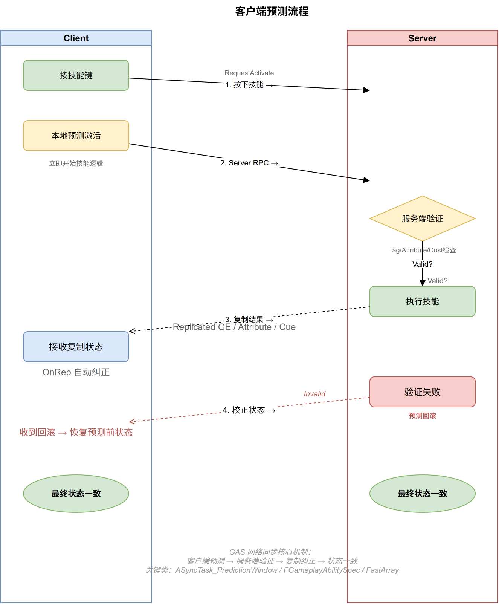

# 深入浅出UE5 GAS（十）：网络同步 —— 复制、预测与回滚

## 系列目录

1. [AbilitySystemComponent —— GAS的心脏](../01-ASC/01-ASC文章.md)
2. [AttributeSet —— 数值系统的基石](../02-AttributeSet/02-AttributeSet文章.md)
3. [GameplayEffect（上）—— 从定义到应用](../03-GameplayEffect/03-GameplayEffect文章-上.md)
4. [GameplayEffect（下）—— Modifier、Stacking与Periodic](../03-GameplayEffect/03-GameplayEffect文章-下.md)
5. [ExecutionCalculation —— 自定义伤害公式](../04-ExecutionCalculation/04-ExecutionCalculation文章.md)
6. [GameplayAbility —— 技能的诞生与消亡](../05-GameplayAbility/05-GameplayAbility文章.md)
7. [AbilityTask —— 异步编程的艺术](../06-AbilityTask/06-AbilityTask文章.md)
8. [TargetData —— 索敌与数据传递](../07-TargetData/07-TargetData文章.md)
9. [GameplayCue —— 技能反馈的表现层](../08-GameplayCue/08-GameplayCue文章.md)
10. **（本文）网络同步 —— 复制、预测与回滚**
11. [GE Components —— UE 5.3 模块化新范式](../10-GEComponents/10-GEComponents文章.md)
12. [实战全景 —— 调试、陷阱与工程化模式](../11-Practice/11-Practice文章.md)

> 📎 [补遗篇 —— FGameplayAbilitySpec 详解](../12-Others/12-Others文章.md)

---

## 写在前面

前九篇文章我们分析了 GAS 的各个子系统：ASC、AttributeSet、GameplayEffect、Ability、Task、Cue、ExecCalc、TargetData。但所有这些话题都有一个暗线——**网络**。

当你的游戏是联网的，每一行 GAS 代码都面临同一个拷问：这段逻辑是在服务器上跑，还是客户端上跑？如果客户端先跑了一遍（为了响应速度），服务器又跑了一遍（为了权威性），两边结果不一致怎么办？

这就是 GAS 网络预测系统要解决的核心问题。Epic 在 `GameplayPrediction.h` 的开头用 260 行注释详细阐述了这套系统的设计思路——这篇文章就是对它的一次"翻译"和"落地"。



---

## 一、GAS 中的网络角色

### 1.1 三个角色的职责

在 GAS 的语境中，一个 Actor 的网络角色决定了它拥有什么能力：

| 角色 | 定义 | GAS 行为 |
|------|------|---------|
| **Authority（服务器）** | 只有服务器拥有此角色 | 所有 GE 均生效，所有技能激活验证，所有属性修改权威 |
| **Autonomous Proxy（主控客户端）** | 本地玩家控制的客户端 | 可以预测性激活技能、预测性应用 GE、预测 GameplayCue |
| **Simulated Proxy（模拟客户端）** | 其他玩家在本地客户端上的表现 | 仅接收服务器复制的状态（属性值、GE、GameplayCue），不预测 |

**核心原则**：服务器永远拥有最终裁决权。客户端的一切预测都是"乐观执行"——先假设服务端会同意，提前执行以消除延迟感；如果服务端拒绝，就回滚。

### 1.2 GAS 预测了什么？没预测什么？

从 `GameplayPrediction.h` 的注释中，Epic 明确列出了边界：

**已预测（Predict）**：
- 技能激活（`TryActivateAbility`）
- 触发事件（Triggered Events）
- GE 应用中的属性修改（**不包含 ExecCalc**）
- GE 应用中的 GameplayTag 修改
- GameplayCue 事件
- 蒙太奇播放
- 移动（由 `UCharacterMovementComponent` 负责，不归 GAS 管）

**未预测（Do NOT Predict）**：
- GE 的移除
- GE 的周期效果（DoT Tick）
- ExecCalc 执行

**为什么不预测 ExecCalc？** 因为 ExecCalc 太"重"了。它可能涉及多个属性的复杂公式计算，而这些计算依赖于服务器上聚合的精确属性值。在客户端用不精确的值跑一次 ExecCalc，回滚的代价和复杂度远大于预测的收益。

---

## 二、源码深潜：GE 的网络复制

### 2.1 ActiveGameplayEffect 的复制结构

GE 的网络复制不是逐个 GE 发送 RPC，而是通过 `FActiveGameplayEffectsContainer` —— 一个继承自 `FFastArraySerializer` 的结构体：

```cpp
// AbilitySystemComponent.h 中的核心定义（简化）
USTRUCT()
struct FActiveGameplayEffectsContainer : public FFastArraySerializer
{
    UPROPERTY()
    TArray<FActiveGameplayEffect> GameplayEffects_Internal; // 核心数组
    
    // NetDeltaSerialize —— 增量序列化入口
    bool NetDeltaSerialize(FNetDeltaSerializeInfo& DeltaParms);
    
    // 内部助手
    FAggregatorEvaluator& GetAttributeAggregator(FGameplayAttribute Attribute);
    FAggregatorRef& FindOrCreateAttributeAggregator(FGameplayAttribute Attribute);
};

template<>
struct TStructOpsTypeTraits<FActiveGameplayEffectsContainer> : public TStructOpsTypeTraitsBase2<FActiveGameplayEffectsContainer>
{
    enum { WithNetDeltaSerializer = true };
};
```

### 2.2 FastArraySerializer 的工作原理

`FFastArraySerializer` 是 UE 网络层的一个重要基类。它解决的问题是：**数组的增量同步**。

假设一个角色身上挂着 15 个 GE。如果用普通的 `TArray` 复制，每次任何 GE 变化，都需要把 15 个 GE 全部重新发送。而 `FFastArraySerializer` 只发送**变化的元素**：

| 操作 | 网络发送内容 |
|------|------------|
| 新增一个 GE | 只发送这个新 GE + `PostReplicatedAdd` |
| 移除一个 GE | 发送移除指令（ReplicationID）+ `PreReplicatedRemove` |
| 修改一个 GE | 只发送这个 GE 的变化部分 + `PostReplicatedChange` |

内部机制：`FFastArraySerializer` 为每个元素分配一个 `ReplicationID`，发送端和接收端各自维护一个 `ReplicationID → Element` 的映射。当发送端数组变化时，它计算 Delta（新增了哪些 ID、移除了哪些、哪些元素的内容变了），通过这个 Delta 指令来更新接收端的数组，而不需要重新发送整个数组。

### 2.3 单个 GE 的复制内容

每个 `FActiveGameplayEffect` 通过网络复制时，携带以下关键信息：

```
FActiveGameplayEffect (Replicated fields):
├── Spec (FGameplayEffectSpec)
│   ├── EffectLevel
│   ├── SetByCallerTagMagnitudes（SetByCaller 的运行时数值）
│   └── DynamicAssetTags / DynamicGrantedTags
├── PredictionKey（用于客户端去重）
├── StartServerWorldTime（GE 开始的时间戳）
├── CachedStartServerWorldTime
├── StartWorldTime（本地开始时间）
├── bIsInhibited（是否被抑制）
└── Duration / Period / StackCount 相关
```

**重点**：`PredictionKey` 在每个 GE 复制时都会携带。这是后续"去重"和"回滚"的关键。

---

## 三、源码深潜：预测系统的全面架构

### 3.1 FPredictionKey —— 预测的"身份证"

```cpp:296:348:E:\EpicGames\UE_5.8\Engine\Plugins\Runtime\GameplayAbilities\Source\GameplayAbilities\Public\GameplayPrediction.h
USTRUCT()
struct FPredictionKey
{
    typedef int16 KeyType;
    
    UPROPERTY()
    int16 Current = 0;     // 当前 Key 的唯一 ID
    
    UPROPERTY(NotReplicated)
    int16 Base = 0;        // 依赖链中的父 Key（不复制！）
    
    UPROPERTY()
    bool bIsServerInitiated = false;  // 由服务器生成（不能用于客户端预测）
    
    static FPredictionKey CreateNewPredictionKey(const UAbilitySystemComponent*);
    static FPredictionKey CreateNewServerInitiatedKey(const UAbilitySystemComponent*);
    void GenerateDependentPredictionKey();
    
    bool IsValidKey() const { return Current > 0; }
    bool IsLocalClientKey() const { return Current > 0 && !bIsServerInitiated; }
};
```

**三个关键行为**：

1. **`CreateNewPredictionKey`** —— 客户端每次预测行为（如技能激活）时生成一个新的 Key
2. **`GenerateDependentPredictionKey`** —— 在同一个预测链中生成"子 Key"（如 GA_X 激活 → 触发 GA_Y）
3. **`NetSerialize` 的特殊实现** —— 当服务器把 FPredictionKey 复制回客户端时，**只有最初生成这个 Key 的那个客户端**能收到有效值，其他客户端收到的是 `Current = 0`（无效 Key）

```cpp:289:290:E:\EpicGames\UE_5.8\Engine\Plugins\Runtime\GameplayAbilities\Source\GameplayAbilities\Public\GameplayPrediction.h
*		-A special implementation of ::NetSerialize *** which only serializes the prediction key to the predicting client ***
*			-This is important as it allows us to serialize prediction keys in replicated state, knowing that only clients that gave the server the prediction key will actually see them!
```

这很精妙：**其他客户端根本不知道预测 Key 的存在**，所以它们看到的所有 GE 都是"权威"的（没有预测版本），它们的 GameplayCue 也都是"权威"的。只有主控客户端才需要处理预测 ⇄ 权威之间的切换。

### 3.2 能力激活预测的完整流程

以下是客户端预测性激活一个技能的全链路：

```
Client (Autonomous Proxy)                    Server (Authority)
│                                                │
│ 1. TryActivateAbility()                        │
│    → 生成 FPredictionKey(Key=42)               │
│    → 调用 ServerTryActivateAbility(Key=42) ──→ │
│                                                │ 2. 收到 RPC
│ 3. 【不等服务器回复】                            │    → 验证能力是否可以激活
│    立即调用 ActivateAbility(Key=42)             │    → 验证通过 →
│    → 预测切身上 GE（Mana -10, CoolDown ON）      │    → ServerActivateAbility(Key=42)
│    → 预测播放 GameplayCue（施法特效）            │    → 服务端切身上 GE（Mana -10）
│    → 预测播放 Montage                           │    → 服务端  FActiveGameplayEffect.PredictionKey = 42
│                                                │
│                                                │ 4. ClientActivateAbilitySucceed(Key=42) ──→
│ 5. 收到 Succeed RPC                             │
│    → Key=42 标记为"待确认"（Replicated）         │    → Key=42 设置为 ReplicatedPredictionKey
│    → 等待属性复制赶上...                         │    → 属性复制正常进行（Mana = 90）
│                                                │       → ReplicatedPredictionKeyMap.Add(42)
│ 6. FReplicatedPredictionKeyItem::OnRep          │
│    → 检测到 Key=42 已赶上                        │    → GE 复制到客户端（PredictionKey=42）
│    → "CatchUp": 移除客户端的预测 GE              │
│    → 预测回滚：不再扣两次 Mana！                 │
│                                                │
│ 最终状态：只有服务器 GE 生效（Mana=90）          │
```

**关键点**：在第 3 步和第 6 步之间，客户端上**同时存在两个 Mana=-10 的 GE**：
- 一个预测 GE（客户端本地创建，PredictionKey=42）
- 一个权威 GE（服务器复制下来，PredictionKey=42）

第 6 步的 "CatchUp" 机制会识别出 PredictionKey 匹配，将预测 GE 移除。这样客户端就不会"被扣两次 Mana"。

### 3.3 预测失败的完整流程

如果服务器拒绝了技能激活：

```
Client (Autonomous Proxy)                    Server (Authority)
│                                                │
│ 1. TryActivateAbility(Key=42)                  │
│ 2. 预测执行（Mana -10）                         │
│                                                │ 3. 验证失败（冷却中/MP不足/被沉默）
│                                                │
│ 5. ClientActivateAbilityFailed(Key=42) ←────── │ 4. 发送失败 RPC
│    → FPredictionKeyDelegates::BroadcastRejected
│    → 立即回滚所有 Key=42 的预测副作用           │
│    → 移除预测 GE（Mana 恢复）                   │
│    → 停止预测的 GameplayCue                     │
│    → 停止预测的 Montage                         │
│                                                │
│ 最终状态：服务器和客户端完全一致（什么都没发生）  │
```

`FPredictionKeyDelegates` 是注册回滚回调的地方：

```cpp:435:467:E:\EpicGames\UE_5.8\Engine\Plugins\Runtime\GameplayAbilities\Source\GameplayAbilities\Public\GameplayPrediction.h
struct FPredictionKeyDelegates
{
    struct FDelegates
    {
        TArray<FPredictionKeyEvent> RejectedDelegates;   // 显式拒绝时的回调
        TArray<FPredictionKeyEvent> CaughtUpDelegates;   // 复制赶上的回调
    };
    
    TMap<FPredictionKey::KeyType, FDelegates> DelegateMap;
    
    static void BroadcastRejectedDelegate(FPredictionKey::KeyType Key);
    static void BroadcastCaughtUpDelegate(FPredictionKey::KeyType Key);
    static void Reject(FPredictionKey::KeyType Key);
    static void CatchUpTo(FPredictionKey::KeyType Key);
    static void AddDependency(FPredictionKey::KeyType ThisKey, FPredictionKey::KeyType DependsOn);
};
```

**回滚不是自动的**——每个客户端需要为每个预测副作用注册回滚委托。GAS 内部已经为你注册了 GE（`RemoveActiveGameplayEffect_NoReturn`）和 GameplayCue 的回滚，但你自定义的预测副作用（比如手动修改 UI 状态），需要自己通过 `FPredictionKey::NewRejectedDelegate()` 注册回调。

### 3.4 属性预测的特殊处理

属性的预测比 GE 的预测更复杂，因为属性本身是 `UPROPERTY(Replicated)` 的，它的复制是"绝对值"复制（"当前血量 = 90"），而非"增量"复制（"血量 -10"）。

Epic 采用了一个精妙的设计：**将预测的 Instant GE 当作 Duration GE 处理**。

```
服务器说: Health = 100 (Base Value)

客户端预测:
  1. 预测 GE 造成 -10 Health（Instant）
  2. 但 GAS 将 Instant GE 转换为 "Infinite Duration GE"
  3. 客户端属性显示: 100 - 10 = 90

服务器执行:
  1. 服务器真正造成 -10 Health
  2. 服务器属性变为: 90
  3. 服务器复制 Health = 90 给客户端

客户端收到复制:
  1. OnRep_Health: 发现服务器值是 90
  2. 重新聚合: BaseValue(90) + 预测 Modifier(-10) = 80 ❌ 错误！
  3. 需要: REPNOTIFY_Always + 特殊聚合逻辑
```

解决方式需要两步配合：

**第一步**：属性必须使用 `REPNOTIFY_Always`，而非默认的 `REPNOTIFY_OnChanged`。因为客户端已经把自己的值改成 90 了（预测），如果再直接收到 `Health = 90` 的复制，默认逻辑会认为"值没变，跳过 OnRep"。`REPNOTIFY_Always` 强制每次都触发 OnRep。

```cpp:134:144:E:\EpicGames\UE_5.8\Engine\Plugins\Runtime\GameplayAbilities\Source\GameplayAbilities\Public\GameplayPrediction.h
void UMyHealthSet::GetLifetimeReplicatedProps(TArray< FLifetimeProperty > & OutLifetimeProps) const
{
    Super::GetLifetimeReplicatedProps(OutLifetimeProps);
    DOREPLIFETIME_CONDITION_NOTIFY(UMyHealthSet, Health, COND_None, REPNOTIFY_Always);
}

void UMyHealthSet::OnRep_Health()
{
    GAMEPLAYATTRIBUTE_REPNOTIFY(UMyHealthSet, Health);
}
```

**第二步**：`GAMEPLAYATTRIBUTE_REPNOTIFY` 宏不直接设置属性值，而是调用 ASC 的聚合器重新计算 "BaseValue + Modifiers"。这样即使服务器复制的 BaseValue 和客户端一样，也会重新评估所有预测 Modifier，正确计算出最终值。

### 3.5 GameplayCue 预测

GameplayCue 的预测遵循"除非你知道服务器已经发过这个消息，否则不要播放两遍"的原则：

1. **客户端预测时**：`UAbilitySystemComponent::ExecuteGameplayCue` 检查是否有有效 `PredictionKey`，有则预测播放 GameplayCue
2. **服务器执行时**：发送 `NetMulticast_InvokeGameplayCueExecuted`，其中携带 `PredictionKey`
3. **客户端收到多播时**：检查 `PredictionKey` —— 如果 Key 匹配自己之前预测的那个，**跳过**播放（因为已经播放过了）

这就是"Redo"问题的解决方案——避免预测效果和权威效果重复播放。

---

## 四、源码深潜：预测窗口与依赖链

### 4.1 预测窗口的隐式范围

预测 Key 的有效期仅限于**单帧内的同步调用栈**。从 `ActivateAbility` 进入到 `ActivateAbility` 返回，这期间的同步调用（立即执行，不经过 Timer/Latent 节点）使用同一个 `PredictionKey`。

一旦你的能力用了 `Delay`、`WaitTargetData`、`WaitGameplayEvent` 等 Latent Task，`ActivateAbility` 就已经返回了，当前预测窗口关闭。后续的预测副作用需要一个**新的**预测窗口。

```cpp:77:78:E:\EpicGames\UE_5.8\Engine\Plugins\Runtime\GameplayAbilities\Source\GameplayAbilities\Public\GameplayPrediction.h
Once ActivateAbility ends, your prediction window (and therefore your prediction key) is no longer valid.
This is important, because many things can invalidate your prediction window such as any timers or latent nodes in your Blueprint; we do not predict over multiple frames.
```

这是故意为之：跨越帧的预测涉及太多不可控因素（网络延迟、其他玩家的输入、物理模拟等），范围越小越准确。

### 4.2 FScopedPredictionWindow —— 手动开窗

当你需要在一个 Latent Task 的回调中做预测（比如 `WaitInputRelease` 松开按键时），你需要手动创建一个新的预测窗口：

```cpp:202:207:E:\EpicGames\UE_5.8\Engine\Plugins\Runtime\GameplayAbilities\Source\GameplayAbilities\Public\GameplayPrediction.h
UAbilityTask_WaitInputRelease::OnReleaseCallback is a good example:
1. Client enters UAbilityTask_WaitInputRelease::OnReleaseCallback and starts a new FScopedPredictionWindow
2. Client calls AbilitySystemComponent->ServerInputRelease which passes ScopedPrediction.ScopedPredictionKey as a parameter
3. Server runs ServerInputRelease_Implementation which takes the passed in PredictionKey and sets it as ScopedPredictionKey
4. Server runs UAbilityTask_WaitInputRelease::OnReleaseCallback within the same scope
5. When the server hits the FScopedPredictionWindow in ::OnReleaseCallback, it gets the prediction key from UAbilitySystemComponent::ScopedPredictionKey
```

`FScopedPredictionWindow` 是一个 RAII 对象——构造时压入新 PredictionKey，析构时恢复旧 PredictionKey：

```cpp:479:503:E:\EpicGames\UE_5.8\Engine\Plugins\Runtime\GameplayAbilities\Source\GameplayAbilities\Public\GameplayPrediction.h
struct FScopedPredictionWindow
{
    // 服务器端：接收客户端 RPC 传来的 PredictionKey
    FScopedPredictionWindow(UAbilitySystemComponent* ASC, FPredictionKey InPredictionKey, bool InSetReplicatedPredictionKey = true);
    
    // 客户端端：生成新的 PredictionKey
    FScopedPredictionWindow(UAbilitySystemComponent* ASC, bool CanGenerateNewKey = true);
    
    ~FScopedPredictionWindow(); // RAII 析构：恢复旧 Key
};
```

### 4.3 依赖链：一个 Key 的"多米诺骨牌"

当 GA_A 预测激活并触发 GA_B，GA_B 又触发 GA_C 时，形成依赖链 A → B → C：

```cpp:173:188:E:\EpicGames\UE_5.8\Engine\Plugins\Runtime\GameplayAbilities\Source\GameplayAbilities\Public\GameplayPrediction.h
To get around this, The prediction key of X is considered the Base key for Y and Z.
The dependency from Y to Z is kept completely client side, which is done in by FPredictionKeyDelegates::AddDependancy.
We add delegates to reject/catchup Z if Y rejected/confirmed.
```

如果服务器拒绝了 GA_B，客户端通过依赖链自动拒绝 GA_C，因为它不可能在 GA_B 失败的情况下还成功。但这里有一个**已知缺陷**——依赖链完全是客户端维护的，服务器不知道 GA_B 失败会影响 GA_C。因此 GA_C 的 `ServerTryActivateAbility` 可能已经发出去并被接受了。

Epic 的建议是：通过 **GameplayTag 条件**来规避这个问题。在 GA_C 中设置 `ActivationRequiredTags`（要求拥有 GA_B 授予的某个 Tag），这样如果服务器拒绝了 GA_B，这个 Tag 不会被授予，GA_C 在服务器端也会被拒绝。

另外，还有一个 `FScopedDiscardPredictions` 用于需要"丢弃本次预测副作用"的场景（比如非关键性的蒙太奇播放通知，发送不可靠 RPC）：

```cpp:527:547:E:\EpicGames\UE_5.8\Engine\Plugins\Runtime\GameplayAbilities\Source\GameplayAbilities\Public\GameplayPrediction.h
struct FScopedDiscardPredictions
{
    explicit FScopedDiscardPredictions(UAbilitySystemComponent* ASC, 
        EGasPredictionKeyResult HowToHandlePredictions = EGasPredictionKeyResult::SilentlyDrop);
    ~FScopedDiscardPredictions();
};
```

---

## 五、能力复制策略

### 5.1 EGameplayAbilityReplicationPolicy

```cpp:98:110:E:\EpicGames\UE_5.8\Engine\Plugins\Runtime\GameplayAbilities\Source\GameplayAbilities\Public\Abilities\GameplayAbilityTypes.h
namespace EGameplayAbilityReplicationPolicy
{
    enum Type : int
    {
        ReplicateNo   UMETA(DisplayName = "Do Not Replicate"),   // 不复制能力实例
        ReplicateYes  UMETA(DisplayName = "Replicate"),         // 复制能力实例给 Owner
    };
}
```

`ReplicateYes` 意味着能力的状态（当前阶段、冷却计时器、激活信息等）会复制到 Autonomous Proxy。这对于需要在客户端显示 UI 状态的能力（如冷却图标）是必需的。

### 5.2 网络复制条件

GAS 的 GE 复制使用带条件的复制：
- `COND_OwnerOnly`：只复制给 GE 的 Target（通常是玩家自己或其所拥有的 Actor）
- `COND_SkipOwner`：复制给除 Owner 外的所有人（用于其他玩家看到的状态效果）

这意味着：一个玩家身上的 Buff 只会完整复制到他自己，其他人只能看到"这个玩家有某个 GE 的效果"，而不能看到 GE 的全部细节（如具体数值、剩余持续时间）。

---

## 六、实战要点

### 6.1 必须使用 REPNOTIFY_Always

如果你的 AttributeSet 属性不使用 `REPNOTIFY_Always`，预测将无法正确运行。这是 GAS 网络同步中最常见的坑：

```cpp
// ❌ 错误：默认 OnChanged
DOREPLIFETIME_CONDITION_NOTIFY(UMyHealthSet, Health, COND_None, REPNOTIFY_OnChanged);

// ✅ 正确：Always
DOREPLIFETIME_CONDITION_NOTIFY(UMyHealthSet, Health, COND_None, REPNOTIFY_Always);
```

原因：客户端可能已经通过预测将自己的 Health 从 100 改为 90。服务器此时也改为 90 并复制下来。`OnChanged` 认为值没变（客户端上 90=90），不触发 OnRep → 不重新聚合 → 预测和权威混在一起。

### 6.2 ExecCalc 不在客户端执行

如果你在 GE 中配置了 ExecCalc，它**仅在服务器上执行**，客户端完全跳过。这会影响网络预测的表现——客户端无法预测 ExecCalc 的结果。对于关键技能（如伤害、治疗），需要权衡：
- 使用 ExecCalc 获得完整的公式控制力，但牺牲客户端预测即时性
- 使用 Simple Modifier 获得客户端预测即时性，但牺牲公式灵活性

### 6.3 GE 移除不可预测

`RemoveActiveGameplayEffect` 永远不会被客户端预测。这带来了一个用户体验挑战：如果你预测性地激活了一个技能并在客户端上施加了 GE，而这个 GE 在真实服务器环境中被某个免疫效果移除了，客户端需要等服务器复制移除消息才能看到效果消失。

### 6.4 同一个 Ability 的预测窗口只有一次

如果你有一个"按住蓄力 + 松开释放"的技能，`ActivateAbility` 中的预测 Key 在进入 `WaitInputRelease` 后已经过期。松手时需要 `FScopedPredictionWindow` 来获得新的预测 Key。

---

### 七、设计思考：为什么要这么复杂？

读完上述内容，你可能会有疑问：**PredictionKey、Delegates、CatchUp、REPNOTIFY_Always、ScopedWindow——这么多机制只是为了"让客户端先跑一遍"？这值得吗？**

答案是：看你的游戏类型。

- 对于回合制游戏（延迟 500ms 可以接受）→ 不需要预测，服务器跑完，客户端等结果就行
- 对于 MOBA（延迟 50-100ms）→ 需要最基本的技能激活预测
- 对于格斗/动作游戏（延迟 < 50ms）→ 需要完整的预测 + 回滚

GAS 的预测系统的设计哲学是：**提供一套完整的框架，但不强制使用**。你可以选择完全不开启预测，也可以选择深度集成。

Epic 通过 PredictionKey 的"乐观执行 + 服务端校验"模式，将"响应速度"和"权威性"这两个矛盾的目标封装在一个统一的框架内。这不是过度设计，这是对联网动作游戏这个领域最核心问题的系统性回答。

---

## 八、总结

1. **三个网络角色**：Authority（最终裁决）、Autonomous Proxy（预测执行）、Simulated Proxy（被动接收）
2. **GE 复制**通过 `FFastArraySerializer` 增量同步，只发送变化的元素
3. **`FPredictionKey`** 是预测系统的核心身份证，通过 `NetSerialize` 的只对生成者可见的特性实现了安全的去重
4. **GE 预测**：Instant GE 被转为 Duration GE，"CatchUp" 时移除预测版本
5. **属性预测**：需要 `REPNOTIFY_Always` + `GAMEPLAYATTRIBUTE_REPNOTIFY` 宏，通过"服务器值作为 Base + 预测作为 Modifier"的方式协同
6. **预测窗口**：默认范围为单帧同步调用栈，跨帧需 `FScopedPredictionWindow`
7. **不预测的内容**：ExecCalc、GE 移除、周期效果
8. **依赖链**：客户端维护，可用 GameplayTag 条件规避一致性风险

**下一篇预告**：UE 5.3 对 GAS 进行了本系列介绍以来最大的架构变革——将 `UGameplayEffect` 从上帝类拆解为 11 个可组合的 `UGameplayEffectComponent`。为什么 Epic 要这么做？旧 GE 的每个属性对应哪个新 Component？自定义 Component 怎么写？下一篇我们将深入 UE 5.8 的 GE Components 全新架构。

---

*本文基于 UE 5.8 源码分析。源码路径：`Engine/Plugins/Runtime/GameplayAbilities/Source/GameplayAbilities/`*
