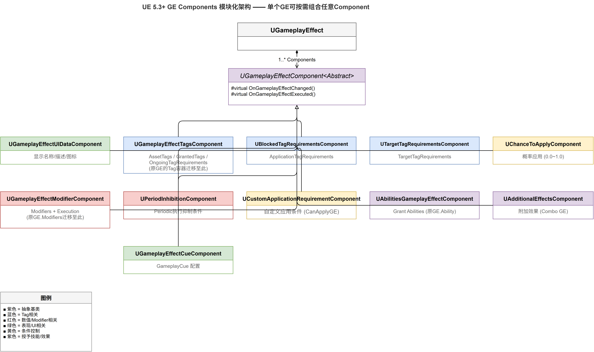

# 深入浅出UE5 GAS（十一）：GE Components —— UE 5.3 模块化新范式

## 系列目录

1. [AbilitySystemComponent —— GAS的心脏](../01-ASC/01-ASC文章.md)
2. [AttributeSet —— 数值系统的基石](../02-AttributeSet/02-AttributeSet文章.md)
3. [GameplayEffect（上）—— 从定义到应用](../03-GameplayEffect/03-GameplayEffect文章-上.md)
4. [GameplayEffect（下）—— Modifier、Stacking与Periodic](../03-GameplayEffect/03-GameplayEffect文章-下.md)
5. [ExecutionCalculation —— 自定义伤害公式](../04-ExecutionCalculation/04-ExecutionCalculation文章.md)
6. [GameplayAbility —— 技能的诞生与消亡](../05-GameplayAbility/05-GameplayAbility文章.md)
7. [AbilityTask —— 异步编程的艺术](../06-AbilityTask/06-AbilityTask文章.md)
8. [TargetData —— 索敌与数据传递](../07-TargetData/07-TargetData文章.md)
9. [GameplayCue —— 技能反馈的表现层](../08-GameplayCue/08-GameplayCue文章.md)
10. [网络同步 —— 复制、预测与回滚](../09-Network/09-Network文章.md)
11. **（本文）GE Components —— UE 5.3 模块化新范式**
12. [实战全景 —— 调试、陷阱与工程化模式](../11-Practice/11-Practice文章.md)

> 📎 [补遗篇 —— FGameplayAbilitySpec 详解](../12-Others/12-Others文章.md)

---

## 写在前面

在前九篇文章中，我们反复接触了 `UGameplayEffect`。这个类承载了太多职责：Tag 修改、能力授权/阻止/取消、免疫、额外效果、属性修改、概率判断……在 UE 5.2 及之前版本中，这一切全部塞在一个"上帝类"里——`UGameplayEffect.h` 包含了 60+ 个属性、数十个方法，任何对 GE 行为的修改都需要修改核心类。

UE 5.3 引入了一个根本性的架构变革：**GameplayEffect Component（GE Component）**。Epic 将 `UGameplayEffect` 的各个职责**拆解**为独立的、可组合的 `UObject` 子类，放置在 `GameplayEffectComponents/` 目录下。

这篇文章将深入分析这个新架构：
1. 为什么 Epic 要拆解 `UGameplayEffect`？
2. 新的 GE Component 基类如何设计？
3. 11 个内置 Component 各自承担什么职责？
4. 如何自定义一个 GE Component？



---

## 一、旧架构的痛点：上帝类问题

### 1.1 GE 曾经有多"胖"？

在 UE 5.2 及之前，一个 `UGameplayEffect` 同时包含：

```
UGameplayEffect (UE 5.2)
├── 属性修改
│   ├── Modifiers[]
│   ├── Executions[] (ExecCalc)
│   └── StackingType / StackCount / StackPeriod
├── Tag 系统
│   ├── InheritableGameplayEffectTags (给予目标的Tag)
│   ├── InheritableOwnedTagsContainer (Asset Tags)
│   ├── RemoveGameplayEffectTags (去除目标的Tag)
│   ├── BlockAbilityTags
│   ├── TargetTagRequirements
│   └── OngoingTagRequirements
├── 条件/免疫
│   ├── ChanceToApplyToTarget
│   ├── CustomApplicationRequirements
│   ├── ApplicationTagRequirements
│   ├── RemovalTagRequirements
│   └── Immunity Queries
├── 附加效果
│   ├── Grant Abilities
│   ├── ConditionalGameplayEffects
│   └── OnComplete Gameplay Effects
└── 生命周期
    ├── DurationPolicy (Instant/Duration/Infinite)
    └── Periodic
```

这带来了三个核心问题：

1. **不可扩展**：策划想要一个自定义的"只有目标血量低于50%才能生效"的过滤逻辑，必须让程序员修改 `UGameplayEffect` 或创建一个子类。但 `UGameplayEffect` 通常作为数据资产（DataAsset）使用，子类化不是标准工作流。

2. **耦合严重**：修改某个功能（比如"如何判断 Tag 需求"）意味着需要理解 GE 的全部属性，因为所有东西都放在同一个类里。

3. **配置混乱**：在编辑器中打开一个 GE，你会看到几十个折叠分类混合在一起。"Block Abilities with Tags"紧挨着"Chance To Apply"，它们在代码中是不同子系统，但在 GE 的 Details 面板中挤在一起。

### 1.2 解决方案：可组合的 Component

UE 5.3 的答案是：**把每个独立的职责变成一个 `UGameplayEffectComponent`**。

```
UGameplayEffect (UE 5.3+)
├── GEComponents[]
│   ├── AbilitiesGameplayEffectComponent        ← 能力授予
│   ├── AdditionalEffectsGameplayEffectComponent ← 附加GE
│   ├── AssetTagsGameplayEffectComponent         ← Asset Tags
│   ├── BlockAbilityTagsGameplayEffectComponent  ← 能力阻止
│   ├── CancelAbilityTagsGameplayEffectComponent ← 能力取消
│   ├── ChanceToApplyGameplayEffectComponent     ← 概率判断
│   ├── CustomCanApplyGameplayEffectComponent    ← 自定义条件
│   ├── ImmunityGameplayEffectComponent          ← 免疫
│   ├── RemoveOtherGameplayEffectComponent       ← 移除其他GE
│   ├── TargetTagRequirementsGameplayEffectComponent ← Tag要求
│   └── TargetTagsGameplayEffectComponent         ← 授予Tag
├── Modifiers[] (留在 GE 本身)
├── Executions[] (留在 GE 本身)
├── DurationPolicy (留在 GE 本身)
└── Stacking (留在 GE 本身)
```

核心属性和生命周期（Duration、Stacking、Modifier、Execution）仍然留在 `UGameplayEffect` 中——它们是 GE 的"骨骼"，不能随便拆。其他功能则全部迁移到了 GE Components。

---

## 二、源码深潜：GE Component 基类

### 2.1 关键类声明

```cpp:16:87:E:\EpicGames\UE_5.8\Engine\Plugins\Runtime\GameplayAbilities\Source\GameplayAbilities\Public\GameplayEffectComponent.h
/**
 * Gameplay Effect Component (aka GEComponent)
 * 
 * GEComponents are what define how a GameplayEffect behaves. Introduced in UE 5.3,
 * there are very few calls from UGameplayEffect to UGameplayEffectComponent by design.
 * Instead of providing a larger API for all desired functionality, the implementer
 * must read the GE flow carefully and register desired callbacks to achieve the results.
 * 
 * GEComponents live Within a GameplayEffect (which is typically a data-only blueprint
 * asset). Thus, like GEs, only one GEComponent exists for all applied instances.
 * One of the unintuitive caveats is that GEComponent should not contain any runtime
 * manipulated/instanced data (e.g. stored state per execution).
 * 
 * Future implementations may need extra data stored on the FGameplayEffectSpec
 * (i.e. Gameplay Effect Spec Components).
 */
UCLASS(Abstract, Const, DefaultToInstanced, EditInlineNew, CollapseCategories, Within=GameplayEffect, MinimalAPI)
class UGameplayEffectComponent : public UObject
{
    // ...
};
```

从 `UCLASS` 修饰符中，我们可以读出 Epic 的设计意图：

| 修饰符 | 含义 |
|--------|------|
| `Abstract` | 不能直接实例化，必须子类化 |
| `Const` | GE Component 实例是**不可变的**——所有 GE 实例共享同一个 Component（CDO 式共享） |
| `DefaultToInstanced` | 在编辑器中添加时自动创建子对象（Instanced Sub-Object） |
| `EditInlineNew` | 可以在编辑器中通过 "Add Component" 按钮创建子类实例 |
| `Within=GameplayEffect` | 此 UObject 的 Outer 必须是 `UGameplayEffect` |
| `CollapseCategories` | 编辑器 UI 折叠分类显示 |

**`Const` 修饰符是关键理解点**。它意味着：
- 只有一个 GE Component 实例服务于**所有**通过这个 GE 创建的 `FActiveGameplayEffect`
- **不能**在 GE Component 中存储"每个实例"的运行时数据
- 运行时数据必须存储在其他地方：委托绑定的额外参数、`FGameplayEffectSpec`、或者未来可能的 "GE Spec Component"

### 2.2 六个生命周期回调

GE Component 定义了六个虚函数，对应 GE 生命周期的六个关键节点：

```cpp:47:71:E:\EpicGames\UE_5.8\Engine\Plugins\Runtime\GameplayAbilities\Source\GameplayAbilities\Public\GameplayEffectComponent.h
/** GE 能否被应用？所有 Component 均返回 true 才算通过 */
virtual bool CanGameplayEffectApply(const FActiveGameplayEffectsContainer& ActiveGEContainer,
    const FGameplayEffectSpec& GESpec) const { return true; }

/** GE 被加入 ActiveGameplayEffectsContainer 时调用（Duration GE 或预测 GE） */
virtual bool OnActiveGameplayEffectAdded(FActiveGameplayEffectsContainer& ActiveGEContainer,
    FActiveGameplayEffect& ActiveGE) const { return true; }

/** GE 被执行时调用（Instant GE，或 Duration GE 的周期执行）—— 仅 Authority 端 */
virtual void OnGameplayEffectExecuted(FActiveGameplayEffectsContainer& ActiveGEContainer,
    FGameplayEffectSpec& GESpec, FPredictionKey& PredictionKey) const {}

/** GE 被应用时调用（涵盖 Duration 和 Instant 两种类型） */
virtual void OnGameplayEffectApplied(FActiveGameplayEffectsContainer& ActiveGEContainer,
    FGameplayEffectSpec& GESpec, FPredictionKey& PredictionKey) const {}

/** 所属 GE 资产被修改时调用（用于更新 FInheritedTagContainer） */
virtual void OnGameplayEffectChanged() {}

/** 编辑器数据验证（WITH_EDITOR） */
virtual EDataValidationResult IsDataValid(FDataValidationContext& Context) const override;
```

**回调顺序**：

对于 Instant GE：
```
CanGameplayEffectApply → True? → OnGameplayEffectApplied → OnGameplayEffectExecuted
```

对于 Duration GE：
```
CanGameplayEffectApply → True? → OnGameplayEffectApplied → OnActiveGameplayEffectAdded
                                 (然后每次周期) → OnGameplayEffectExecuted
```

对于来自网络复制的 GE：
```
（跳过 CanGameplayEffectApply，因为服务器已验证过）
→ OnActiveGameplayEffectAdded（预测GE被复制版本覆盖时的去重）
```

这个设计很有意思：`Apply` 和 `Execute` 是分离的。`Apply` 发生在所有 GE 类型上（Instant 和 Duration），而 `Execute` 只发生在 Instant 的瞬间或 Duration 的周期点。分开之后，Component 就能精确区分"一次性操作"和"每次 tick 都要做的事"。

### 2.3 FindParentComponent —— 继承链辅助

```cpp:90:96:E:\EpicGames\UE_5.8\Engine\Plugins\Runtime\GameplayAbilities\Source\GameplayAbilities\Public\GameplayEffectComponent.h
template<typename GEComponentClass, typename LateBindGameplayEffect = UGameplayEffect>
const GEComponentClass* FindParentComponent(const GEComponentClass& ChildComponent)
{
    const LateBindGameplayEffect* ChildGE = ChildComponent.GetOwner();
    const LateBindGameplayEffect* ParentGE = ChildGE
        ? Cast<LateBindGameplayEffect>(ChildGE->GetClass()->GetArchetypeForCDO())
        : nullptr;
    return ParentGE ? ParentGE->template FindComponent<GEComponentClass>() : nullptr;
}
```

这个方法用于在父 GE（Blueprint Parent）中查找同名 Component。这对于 `FInheritedTagContainer`（继承式 Tag 容器）的支持至关重要——子 GE 的 Tag 配置可以从父 GE Component 的配置继承。

---

## 三、11 个内置 Component 全景分析

我将 11 个 Component 按职责分为四组。

### 3.1 Tag 修改组（4 个）

#### 3.1.1 `UTargetTagsGameplayEffectComponent` — 授予目标 Tag

```
DisplayName: "Grant Tags to Target Actor"
核心接口: OnGameplayEffectChanged() 每当 GE 修改时重新应用
```

最常使用的 Component 之一。当 GE 应用时，它向目标 Actor 授予配置的 Tag。典型场景：
- "Buff.ImmuneToDamage" — 伤害免疫 Buff
- "State.InCooldown" — 技能冷却中

使用 `FInheritedTagContainer`，支持从父 GE 继承 Tag 配置。

#### 3.1.2 `UAssetTagsGameplayEffectComponent` — GE 自身的 Tag

```
DisplayName: "Tags This Effect Has (Asset Tags)"
核心接口: OnGameplayEffectChanged() 重新应用 Asset Tag
```

与 `TargetTags` 的关键区别：这些 Tag **归属于 GE 自身**而非目标 Actor。它们用于标识"这个 GE 是什么"：
- "Effect.Damage.Fire" — 这是一个火焰伤害
- "Effect.Heal.Instant" — 这是一个即时治疗

Asset Tags 的典型用途：
1. 在其他 GE 中用 `RemoveGameplayEffectQuery` 按 Asset Tag 查找并移除 GE
2. `ImmunityGameplayEffectComponent` 可以按 Asset Tag 免疫特定类型的 GE
3. `CancelAbilityTags` 可以按 GE 的 Asset Tag 取消能力

#### 3.1.3 `UBlockAbilityTagsGameplayEffectComponent` — 阻止能力激活

```
DisplayName: "Block Abilities with Tags"
核心接口: OnGameplayEffectChanged()
```

当 GE 活跃时，阻止目标激活带有特定 Tag 的能力。典型场景：
- 沉默效果：施加 "BlockAbility.Offensive" Tag，阻止所有攻击技能
- 眩晕效果：施加 "BlockAbility.All" Tag，阻止所有技能

#### 3.1.4 `UCancelAbilityTagsGameplayEffectComponent` — 取消已激活能力

```
DisplayName: "Cancel Abilities with Tags"
核心接口: OnGameplayEffectApplied (Mode=OnApplication)
         / OnGameplayEffectExecuted (Mode=OnExecution)
关键枚举: ECancelAbilityTagsGameplayEffectComponentMode { OnApplication, OnExecution }
```

与 Block 的区别：Block 是"阻止未来激活"，Cancel 是"取消当前正在执行的能力"。

`ComponentMode` 的设计很巧妙：
- `OnApplication`：GE 应用时立即取消一次（适合"眩晕打断施法"）
- `OnExecution`：每次 GE 执行时取消（适合"Dot 持续打断"——每个周期 tick 都取消对应能力，阻止目标在两次周期之间重新激活能力后又立即被打断）

### 3.2 条件/过滤组（3 个）

#### 3.2.1 `UChanceToApplyGameplayEffectComponent` — 概率应用

```
DisplayName: "Chance To Apply This Effect"
核心接口: CanGameplayEffectApply()
关键属性: FScalableFloat ChanceToApplyToTarget (0.0~1.0)
```

最简单的 Component。在 `CanGameplayEffectApply` 中生成随机数，判断 GE 是否应该应用。

注意它使用了 `FScalableFloat` 而非普通的 `float`——这意味着概率可以从 DataTable 中按等级读取。一个"随着技能等级提升，暴击率增加"的技能就可以用同一个 GE + 同一个 DataTable Row 实现。

#### 3.2.2 `UCustomCanApplyGameplayEffectComponent` — 自定义应用条件

```
DisplayName: "Custom Can Apply This Effect"
核心接口: CanGameplayEffectApply()
关键属性: TArray<TSubclassOf<UGameplayEffectCustomApplicationRequirement>>
```

这是 C++ 程序员最常用的扩展点。`UGameplayEffectCustomApplicationRequirement` 是一个包含 `CanApplyGameplayEffect` 虚函数的类：

```cpp
class UGE_CustomCanApply_HasShield : public UGameplayEffectCustomApplicationRequirement
{
    virtual bool CanApplyGameplayEffect(const UGameplayEffect*, const FGameplayEffectSpec& Spec,
        UAbilitySystemComponent* ASC) const override
    {
        // 只有目标有"Shield" Tag 时才能施加此 GE
        return ASC->HasMatchingGameplayTag(FGameplayTag::RequestGameplayTag("State.Shield"));
    }
};
```

策划可以在 GE 编辑器中直接选择这个类作为 `ApplicationRequirements`，无需修改 C++。

#### 3.2.3 `UTargetTagRequirementsGameplayEffectComponent` — Tag 条件要求

```
DisplayName: "Require Tags to Apply/Continue This Effect"
核心接口: CanGameplayEffectApply() + OnActiveGameplayEffectAdded()
关键属性:
  - FGameplayTagRequirements ApplicationTagRequirements  (应用时检查)
  - FGameplayTagRequirements OngoingTagRequirements      (持续检查)
  - FGameplayTagRequirements RemovalTagRequirements       (满足后移除)
```

这个 Component 是三阶段的 Tag 检查：

| 阶段 | 检查内容 | 失败后果 |
|------|---------|---------|
| **Application** | 目标是否满足应用条件 | GE 不生效 |
| **Ongoing** | 目标是否持续满足条件 | GE 被抑制（inhibited），所有效果暂停，但 GE 仍保留 |
| **Removal** | 移除条件是否满足 | GE 被主动移除 |

Ongoing 阶段的实现方式是注册 `OnTagChanged` 回调——当目标的 Tag 发生变化时，检查 Ongoing 条件。这也是为什么 GE Component 必须在 `OnActiveGameplayEffectAdded` 中注册回调而不是在 `CanGameplayEffectApply` 中一次性判断。

### 3.3 效果交互组（3 个）

#### 3.3.1 `UImmunityGameplayEffectComponent` — 免疫机制

```
DisplayName: "Immunity to Other Effects"
核心接口: OnActiveGameplayEffectAdded()
关键属性: TArray<FGameplayEffectQuery> ImmunityQueries
```

当 GE 激活时，向 ASC 注册一个"免疫处理器"。每当另一个 GE 尝试应用，ASC 会检查免疫 GE 的 `AllowGameplayEffectApplication` 回调。

`FGameplayEffectQuery` 非常灵活，支持按以下条件匹配：
- 按 GE 的 Asset Tag
- 按 GE 的 Granted Tag
- 按 GE 的 Source Tag
- 按 GE 的类
- 等等组合条件

**编辑器警告**：Instant GE 不应该配置 Immunity，因为它没有持续时间——免疫效果转瞬即逝，毫无意义。

#### 3.3.2 `URemoveOtherGameplayEffectComponent` — 移除其他 GE

```
DisplayName: "Remove Other Effects"
核心接口: OnGameplayEffectApplied()
关键属性: TArray<FGameplayEffectQuery> RemoveGameplayEffectQueries
```

每次 GE 应用时，检查目标身上是否有匹配 `RemoveGameplayEffectQueries` 的 Active GE，如果有就移除。典型场景：
- 净化效果：移除所有匹配 `Effect.Debuff` 的 GE
- 属性替换：应用新的护盾 Buff 时，移除旧的护盾 Buff

**编辑器警告**：对于周期 GE，使用 `RemoveOtherEffects` 意味着每个周期都重新执行移除查询。如果查询条件复杂（比如遍历大量 Active GE），可能有性能问题。理想情况下应该用 `TargetTagRequirements` 的 `OngoingTagRequirements` 代替。

#### 3.3.3 `UAdditionalEffectsGameplayEffectComponent` — 链式效果

```
DisplayName: "Apply Additional Effects"
核心接口: OnGameplayEffectApplied() + OnActiveGameplayEffectAdded()
关键属性:
  - TArray<FConditionalGameplayEffect> OnApplicationGameplayEffects
  - TArray<TSubclassOf<UGameplayEffect>> OnCompleteAlways
  - TArray<TSubclassOf<UGameplayEffect>> OnCompleteNormal
  - TArray<TSubclassOf<UGameplayEffect>> OnCompletePrematurely
```

这是非常强大也最容易出 Bug 的 Component。它实现了 GE 的"链式反应"：

| 触发时机 | 用途 |
|---------|------|
| **OnApplication** | GE 生效时立即触发另一个 GE（如"击中时施加流血"） |
| **OnCompleteAlways** | GE 结束时总是触发（无论正常到期还是被移除） |
| **OnCompleteNormal** | GE 自然到期时触发（Buff 结束效果） |
| **OnCompletePrematurely** | GE 被强制移除时触发（净化后的补偿效果） |

`bOnApplicationCopyDataFromOriginalSpec = true` 会将原始 GE Spec 的数据（如 SetByCaller Magnitudes）复制到新 GE Spec——不同 GE 之间传递运行时数值的关键机制。

### 3.4 能力管理组（1 个）

#### 3.4.1 `UAbilitiesGameplayEffectComponent` — 能力授予

```
DisplayName: "Grant Gameplay Abilities"
核心接口: OnActiveGameplayEffectAdded()
关键配置: FGameplayAbilitySpecConfig { Ability, Level, InputID, RemovalPolicy }
```

当 GE 激活时，向目标授予指定的 `UGameplayAbility`；GE 移除时，根据 `RemovalPolicy` 取消能力：
- `CancelAbilityImmediately`：立即取消
- `RemoveAbilityOnEnd`：等待能力执行完成后移除
- `DoNothing`：能力保留在目标身上

这是实现"装备提供的技能"、"Buff 附赠的技能"的核心机制。

---

## 四、从旧 GE 迁移：属性映射表

如果你有一个 UE 5.2 的 GE 资产，打开时会自动升级。以下是旧属性到新 Component 的映射：

| 旧属性 (UE 5.2) | 新 Component (UE 5.3+) |
|-----------------|----------------------|
| `InheritableGameplayEffectTags.CombinedTags` | `TargetTagsGameplayEffectComponent` |
| `InheritableOwnedTagsContainer.CombinedTags` | `AssetTagsGameplayEffectComponent` |
| `RemoveGameplayEffectTags` | `TargetTagsGameplayEffectComponent` (Remove) |
| `BlockAbilityTags` | `BlockAbilityTagsGameplayEffectComponent` |
| `CancelAbilityTags` | `CancelAbilityTagsGameplayEffectComponent` |
| `ApplicationTagRequirements` | `TargetTagRequirementsGameplayEffectComponent` |
| `OngoingTagRequirements` | `TargetTagRequirementsGameplayEffectComponent` |
| `RemovalTagRequirements` | `TargetTagRequirementsGameplayEffectComponent` |
| `ChanceToApplyToTarget` | `ChanceToApplyGameplayEffectComponent` |
| `CustomApplicationRequirements` | `CustomCanApplyGameplayEffectComponent` |
| `Immunity Queries` | `ImmunityGameplayEffectComponent` |
| `RemoveGameplayEffectQueries` | `RemoveOtherGameplayEffectComponent` |
| `GrantedAbilities` | `AbilitiesGameplayEffectComponent` |
| `ConditionalGameplayEffects` | `AdditionalEffectsGameplayEffectComponent` |
| `OnComplete GE` | `AdditionalEffectsGameplayEffectComponent` |

**保留在 GE 本身的属性**：
- `Modifiers` (Simple Modifier)
- `Executions` (ExecCalc)
- `DurationPolicy` (Instant/Duration/Infinite)
- `Stacking`
- `Period`
- `Level`
- `GameplayEffectClasses` (GE 类层级)

---

## 五、自定义 GE Component 实战

假设我们需要一个"目标血量低于 50% 时伤害翻倍"的 GE Component。

### 5.1 C++ 实现

**头文件** —— 定义了 Component 需要哪些配置属性：

```cpp
UCLASS(DisplayName="Damage Increase When Low Health", MinimalAPI)
class UGEComponent_LowHealthDamageBoost : public UGameplayEffectComponent
{
    GENERATED_BODY()
    
public:
    virtual bool CanGameplayEffectApply(
        const FActiveGameplayEffectsContainer& ActiveGEContainer,
        const FGameplayEffectSpec& GESpec) const override;
    
    // 策划可配置的属性
    UPROPERTY(EditDefaultsOnly, Category=Conditions)
    FGameplayAttribute MaxHealthAttribute;

    UPROPERTY(EditDefaultsOnly, Category=Conditions)
    FGameplayAttribute CurrentHealthAttribute;

    UPROPERTY(EditDefaultsOnly, Category=Conditions, meta=(ClampMin=0.0, ClampMax=1.0))
    float HealthThreshold = 0.5f;

    UPROPERTY(EditDefaultsOnly, Category=Effects)
    FScalableFloat ExtraDamageMultiplier = 1.0f;
};
```

我们覆写了 `CanGameplayEffectApply` —— 这是 GE Component 用于拦截 GE 应用的最核心入口。当返回 `false` 时，GE 不会应用到目标身上。

**实现** —— 从目标 ASC 读取属性值，计算血量比例后通过 SetByCaller 传递额外倍率：

```cpp
bool UGEComponent_LowHealthDamageBoost::CanGameplayEffectApply(
    const FActiveGameplayEffectsContainer& ActiveGEContainer,
    const FGameplayEffectSpec& GESpec) const
{
    if (!Super::CanGameplayEffectApply(ActiveGEContainer, GESpec))
        return false;
    
    UAbilitySystemComponent* TargetASC = ActiveGEContainer.Owner;
    if (!TargetASC) return true;
    
    float CurrentHealth = 0.f, MaxHealth = 1.f;
    if (CurrentHealthAttribute.IsValid())
        TargetASC->GetGameplayAttributeValue(CurrentHealthAttribute, CurrentHealth);
    if (MaxHealthAttribute.IsValid())
        TargetASC->GetGameplayAttributeValue(MaxHealthAttribute, MaxHealth);
    
    if (MaxHealth <= 0.f) return true;
    
    float HealthRatio = CurrentHealth / MaxHealth;
    
    if (HealthRatio <= HealthThreshold)
    {
        // 通过 SetByCaller 将额外倍率传递到 Modifier 的公式中
        FGameplayTag DataTag = FGameplayTag::RequestGameplayTag("Data.DamageMultiplier");
        float CurrentMultiplier = 1.f;
        GESpec.GetSetByCallerMagnitude(DataTag, false, CurrentMultiplier);
        GESpec.SetSetByCallerMagnitude(DataTag, CurrentMultiplier * 
            ExtraDamageMultiplier.GetValueAtLevel(GESpec.GetLevel()));
    }
    
    return true;
}
```

核心思路：GE Component 不能直接修改 GE 的 Modifier 数组，但可以通过 `GESpec.GetSetByCallerMagnitude` / `SetSetByCallerMagnitude` 在 GE 应用时**动态注入数据**，配合 `AttributeBased` 或 `CustomCalculationClass` 的 Modifier 消费这个数据。

### 5.2 在编辑器中使用

C++ 编译后，打开任意 GameplayEffect 资产，在 `GEComponents` 数组中点击 "+" 添加 `GEComponent_LowHealthDamageBoost`，配置 `MaxHealthAttribute`、`CurrentHealthAttribute` 和 `HealthThreshold`——策划无需触碰 C++，只需在资产中配置。

---

### 六、设计思考：Component 模式在 GAS 中的得失

### 6.1 为什么是 UObject 而非 UActorComponent？

`UGameplayEffectComponent` 继承自 `UObject` 而非 `UActorComponent`。这意味着：
- **没有 Tick**：GE Component 不能有自己的 Tick 函数，所有行为必须通过回调驱动
- **没有网络复制**：GE Component 不能标记属性为 `Replicated`
- **没有组件系统的依赖注入**：不能像 Actor Component 那样通过 `GetOwner()->FindComponentByClass<T>()` 查找兄弟 Component

这是**故意为之**。Epic 注释中明确提到：

> "This may explain why some functionality is still in UGameplayEffect rather than a UGameplayEffectComponent."

GE Component 的设计原则是：**让它尽可能简单、无状态、数据驱动**。如果需要 Tick 或复杂状态管理，说明这个功能不适合作为 GE Component——你可能需要一个独立的管理器或子系统。

### 6.2 缺少的 GE Spec Component

Epic 在注释中提到一个重要的未来方向：

> "Future implementations may need extra data stored on the FGameplayEffectSpec (i.e. Gameplay Effect Spec Components)."

当前的 GE Component 是"模板层"——所有 GE 实例共享同一个 Component。而 `FGameplayEffectSpec` 是"实例层"——每个 GE 应用实例有独立的 Spec。如果未来需要在运行时为每个 GE 实例存储状态（比如"这个 Dot GE 已经 tick 了几次"、"玩家对特定目标的仇恨累积值"），就需要一个对应的 "GE Spec Component"。

这暴露了当前设计的局限：**GE Component + FActiveGameplayEffect** 的二元结构只能处理"无状态回调"。一旦需要"有状态组件"（比如每个 GE 实例维护自己的状态机），就需要引入第三层——Spec Component。

### 6.3 "渐进式迁移"的妥协

Epic 没有像 Unity 那样"一刀切"废弃旧 API。旧 GE 资产在打开时会自动升级，`UGameplayEffect` 上仍然挂着旧属性的引用（标记为 `UPROPERTY(Transient)`，序列化为新 Component 后再清除）。

这是一种"重构友好"的策略：不破坏现有的游戏数据，但引导开发者向新架构迁移。同时也说明 Epic 对 GAS 的长期维护承诺——这套系统还会继续演化。

---

## 七、总结

1. **UE 5.3 引入 GE Component** 将 `UGameplayEffect` 从上帝类拆解为 11 个可组合的独立模块
2. GE Component 基类定义六个生命周期回调：`CanApply`、`Added`、`Executed`、`Applied`、`Changed`、`IsDataValid`
3. **`Const` 修饰符**意味着所有 GE 实例共享同一个 Component——不能存储运行时状态
4. 11 个内置 Component 覆盖四大职责：**Tag 修改**（4个）、**条件过滤**（3个）、**效果交互**（3个）、**能力管理**（1个）
5. 自定义 GE Component 让策划无需修改 C++ 即可在编辑器中使用新逻辑
6. 旧 GE 资产在打开时自动迁移，属性一一映射到对应的 Component
7. 未来可能的 "GE Spec Component" 将补充运行时状态的短板

**下一篇预告**：学完了 GAS 的全部 11 篇详细分析，是时候回到实战层面了。`AbilitySystemGlobals` 全局配置怎么配？`GameplayTagResponseTable` 如何实现数据驱动的 Tag 响应？`showdebug abilitysystem` 命令怎么看？Lyra 项目中的 GAS 实践模式是什么？下一篇，我们用实战的视角来收官这个系列。

---

*本文基于 UE 5.8 源码分析。源码路径：`Engine/Plugins/Runtime/GameplayAbilities/Source/GameplayAbilities/`*
