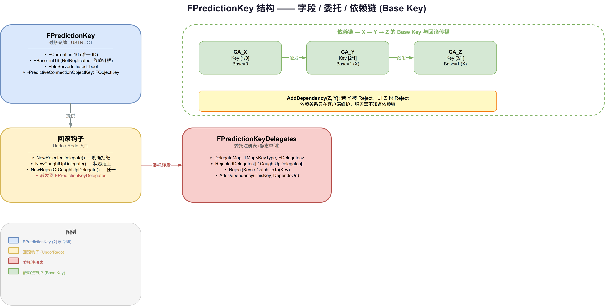
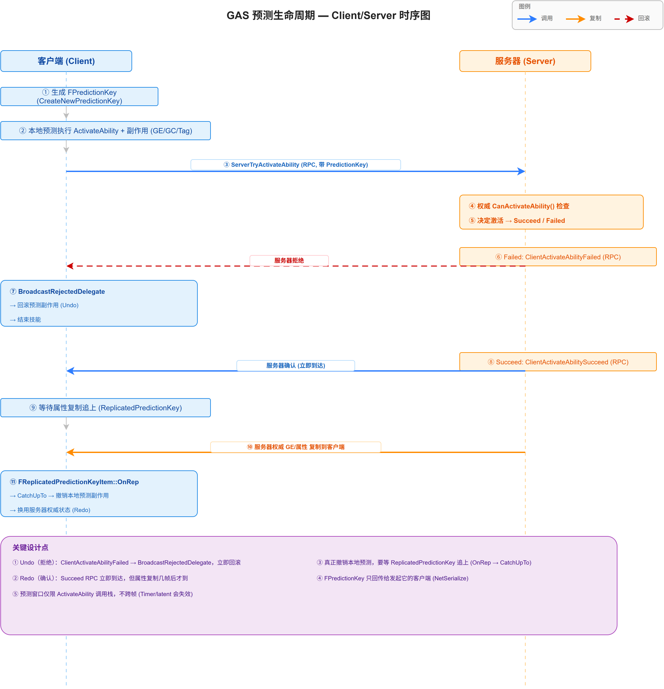

# 10 | Prediction — 预测与回滚

> **本篇**：GAS 网络预测的完整机制 —— `FPredictionKey` 的生命周期、客户端预测执行、服务器权威验证、Undo/Redo 与依赖链回滚

> **系列**: 《Inside GAS》— UE5 GameplayAbilitySystem 源码深度分析  
> **难度**: 🔴 源码  
> **字数**: ~6800  
> **前置**: 07/08-GameplayAbility、09-GameplayCue  
> **源码路径**: `Engine/Plugins/Runtime/GameplayAbilities/Source/GameplayAbilities/Public/GameplayPrediction.h`

---

> **系列导航**
> 
> | 阶段 | 篇章 | 内容 | 状态 |
> |------|------|------|------|
> | 🟢 基础 | 01 | GAS 总览与核心架构 | ✅ |
> | | 02 | ASC — 核心调度器 | ✅ |
> | | 03 | GameplayTags — 通用语言 | ✅ |
> | | 04 | AttributeSet — 属性定义与复制 | ✅ |
> | 🔵 核心 | 05 | GameplayEffect — 效果与计算 (上) | ✅ |
> | | 06 | GameplayEffect — 效果与计算 (下) | ✅ |
> | | 07 | GameplayAbility — 技能激活与核心框架 (上) | ✅ |
> | | 08 | GameplayAbility — Task/输入/预测 (下) | ✅ |
> | | 09 | GameplayCue — 表现层触发机制 | ✅ |
> | 🔴 高级 | **10** | **Prediction — 预测与回滚** | ✅ |
> | | 11 | GE Components — 组件化架构演进 | 📝 |
> | | 12 | Network & Serial — 网络序列化 | 📝 |
> | | 13 | Targeting — 瞄准系统 | 📝 |
> | | 14 | Debug & Optimization — 调试与优化 | 📝 |
> | | 15 | 终篇回顾 — 全景复习 | 📝 |

---

## 一、问题驱动：为什么你的技能要"赌一把"？

玩过多人游戏的人都经历过一个现象：按下技能键的瞬间，技能**立刻**就有了反应——火球飞出去、蓝条扣掉、屏幕冒火花。但这里有个物理层面的矛盾：你的按键指令要经过网络传到服务器，服务器再广播回来，这一来一回至少几十毫秒。如果严格等服务器确认才播放，那每个技能都会有肉眼可见的延迟，手感会像在泥浆里操作。

解决方案就是**客户端预测（Client-Side Prediction）**：客户端**赌**服务器会同意，于是先本地执行，等服务器确认后再对账。赌对了，一切顺滑；赌错了，就**回滚**（Rollback）。

GAS 的预测系统要解决的不是"要不要预测"，而是**预测这件事本身带来的五个难题**。`GameplayPrediction.h` 头部注释（第 52-58 行）开宗明义地列出了它们：

| 难题 | 一句话 | 对应机制 |
|------|--------|---------|
| **Can I do this?** | 能不能做？ | 预测协议：`TryActivate` → `Succeed/Failed` |
| **Undo** | 预测失败了怎么撤销副作用？ | `NewRejectedDelegate` 回滚 |
| **Redo** | 预测对了怎么避免重复执行？ | `NewCaughtUpDelegate` 对账 |
| **Completeness** | 怎么确定"所有副作用都预测到了"？ | 依赖链（Base Key） |
| **Dependencies** | 链式预测怎么管理？ | `FPredictionKeyDelegates::AddDependency` |
| **Override** | 怎么预测性地覆盖服务器拥有的状态？ | 属性 delta 预测 + `REPNOTIFY_Always` |

这六个词就是理解整个预测系统的钥匙。本篇会逐个拆开它们背后的源码实现。

---

## 二、核心概念：FPredictionKey 的一生

### 2.1 它是什么

`FPredictionKey`（`GameplayPrediction.h:296`）是预测系统的"对账令牌"。它本质上就是一个唯一 ID，用来**把客户端预测的动作和副作用，与服务器的确认/拒绝关联起来**。头文件注释（第 269-291 行）说得直白：

> A FPredictionKey is essentially an ID for identifying predictive actions and side effects that are done on a client.

它的字段极简（`GameplayPrediction.h:303-313`）：

```cpp
USTRUCT()
struct FPredictionKey
{
    typedef int16 KeyType;

    /** 这个预测键的唯一 ID */
    UPROPERTY()
    int16 Current = 0;

    /** 若非 0，表示这个键是从哪个键派生出来的（依赖链的 Base） */
    UPROPERTY(NotReplicated)
    int16 Base = 0;

    /** 是否由服务器发起的键（用于识别服务器激活，但不能用于预测） */
    UPROPERTY()
    bool bIsServerInitiated = false;
};
```

**三个关键点**：

1. **`Current` / `Base` 都是 `int16`**（不是 `int32`）。预测键用 16 位整数，足够区分并发的预测序列，且省带宽。`KeyType` 这个 typedef 就是 `int16`。
2. **`Base` 是 `NotReplicated`**。依赖链关系只存在于客户端本地，服务器不知道也不需要知道你的依赖链（后面 §七 会讲这带来的问题）。
3. **没有 `bIsStale` 字段**。很多资料给 `FPredictionKey` 安了个 `bIsStale` 表示"预测过期"，源码里**不存在**这个字段。过期判断靠的是 `OnRep` 里的陈旧 Key 清理逻辑（§六），而不是某个布尔标志。

### 2.2 关键状态判断方法

`FPredictionKey` 提供了一组判断方法（`GameplayPrediction.h:336-368`），每个都对应一个明确的语义：

```cpp
bool IsValidKey() const          { return Current > 0; }
bool IsLocalClientKey() const    { return Current > 0 && !bIsServerInitiated; }
bool IsServerInitiatedKey() const{ return bIsServerInitiated; }
bool IsValidForMorePrediction() const { return IsLocalClientKey(); }
bool WasReceived() const         { return PredictiveConnectionObjectKey != FObjectKey(); }
bool WasLocallyGenerated() const { return (Current > 0) && (PredictiveConnectionObjectKey == FObjectKey()); }
```

**关键区分**：`WasReceived()` 和 `WasLocallyGenerated()` 靠的是 `PredictiveConnectionObjectKey`（一个私有 `FObjectKey` 成员）。当一个 Key 从网络上反序列化进来时，`NetSerialize` 会把"给我这个 Key 的连接"记录进 `PredictiveConnectionObjectKey`（`GameplayPrediction.cpp:176-183`）。于是：

- `WasReceived()` = 这个 Key 是从某条连接收来的；
- `WasLocallyGenerated()` = 这个 Key 是本地生成的、还没上过网络。

### 2.3 生成：CreateNewPredictionKey 与服务器键

```cpp
// GameplayPrediction.cpp:223
FPredictionKey FPredictionKey::CreateNewPredictionKey(const UAbilitySystemComponent* OwningComponent)
{
    FPredictionKey NewKey;
    // 绝不能在 Authority 上生成预测键
    if (OwningComponent->GetOwnerRole() != ROLE_Authority)
    {
        NewKey.GenerateNewPredictionKey();
    }
    return NewKey;
}
```

而 `GenerateNewPredictionKey`（`GameplayPrediction.cpp:189`）内部是一个**静态自增计数器**：

```cpp
void FPredictionKey::GenerateNewPredictionKey()
{
    static KeyType GKey = 1;
    Current = GKey++;
    if (GKey <= 0)   // int16 溢出回绕
    {
        GKey = 1;
    }
}
```

**两个设计点**：

1. **预测键只在非 Authority 上生成**。服务器是权威，不需要"预测"自己，所以 `CreateNewPredictionKey` 在 `ROLE_Authority` 上直接返回一个 `Current=0` 的无效键。
2. **服务器有独立的计数器**。`CreateNewServerInitiatedKey`（`GameplayPrediction.cpp:235`）用另一个 `static GServerKey`，并且**故意不与客户端计数器同步**——源码注释（第 242 行）说"确保服务器和客户端的键生成不同步，否则会掩盖 bug"。



*图：FPredictionKey 结构与依赖链 —— 字段（Current/Base/bIsServerInitiated）+ 三种回滚钩子（NewRejectedDelegate/NewCaughtUpDelegate/NewRejectOrCaughtUpDelegate）+ FPredictionKeyDelegates 委托注册表；右侧为 X→Y→Z 依赖链的 Base Key 与 AddDependency 回滚传播*

---

## 三、一个完整的预测生命周期：技能激活

技能激活是"一等公民"级别的预测动作——它产生初始预测键。整个流程（`GameplayPrediction.h:73-93` 注释，以及 `AbilitySystemComponent_Abilities.cpp` 的实现）：

```
1. 客户端 TryActivateAbility → 生成新 FPredictionKey，调 ServerTryActivateAbility
2. 客户端不等服务器，立即用这个 Key 调 ActivateAbility（进入"预测窗口"）
3. 预测窗口内的所有副作用（GE、GC、Tag）都关联这个 Key
4. 服务器在 ServerTryActivateAbility 里决定是否真的激活，回 ClientActivateAbility(Succeed/Failed)
5. 若 Failed → 立即杀技能 + 回滚关联该 Key 的副作用
6. 若 Succeed → 等属性复制追上（ReplicatedPredictionKey），再撤销本地预测副作用
```



*图：技能激活的预测生命周期时序 —— 客户端生成 PredictionKey → ServerTryActivateAbility → 服务器权威检查 → 客户端本地预测执行副作用；`alt` 分支区分拒绝（ClientActivateAbilityFailed → BroadcastRejectedDelegate 回滚）与确认（ClientActivateAbilitySucceed → 等 ReplicatedPredictionKey 追上 → CatchUpTo 撤销本地预测）*

### 3.1 客户端侧：InternalTryActivateAbility 的预测分支

在 `InternalTryActivateAbility`（`AbilitySystemComponent_Abilities.cpp:1704`）里，当技能满足预测条件时（`GameplayPrediction.h` 描述为 `EGameplayAbilityActivationMode:Predicting`），会进入预测分支：

```cpp
// AbilitySystemComponent_Abilities.cpp:1927
PrePredictionActivation(Ability);

// 这次执行正式进入 Predicting 模式，并获得一个 PredictionKey
FScopedPredictionWindow ScopedPredictionWindow(this, true);
ActivationInfo.SetPredicting(ScopedPredictionKey);

// 必须在 GeneratePredictionKey 后立即调用，防止递归激活出问题
CallServerTryActivateAbility(Handle, Spec->InputPressed, ScopedPredictionKey);

// 当这个预测键被"追上"时，才能知道技能是被确认还是拒绝
ScopedPredictionKey.NewCaughtUpDelegate().BindUObject(
    this, &UAbilitySystemComponent::OnClientActivateAbilityCaughtUp,
    Handle, ScopedPredictionKey.Current);
```

**关键点**：`CallServerTryActivateAbility` 必须在 `FScopedPredictionWindow` 创建后**立即**调用（注释明确写着"must be called immediately after GeneratePredictionKey to prevent problems with recursively activating abilities"）。这个"立即"保证了预测键的原子性——从生成 Key 到发送 RPC，中间不允许插入任何其他预测动作。

### 3.2 服务器侧：ServerTryActivateAbility

```cpp
// AbilitySystemComponent_Abilities.cpp:2016
void UAbilitySystemComponent::ServerTryActivateAbility_Implementation(
    FGameplayAbilitySpecHandle Handle, bool InputPressed, FPredictionKey PredictionKey)
{
    InternalServerTryActivateAbility(Handle, InputPressed, PredictionKey, nullptr);
}
```

服务器在 `InternalServerTryActivateAbility` 里做**权威的** `CanActivateAbility` 检查（就是上一篇 §五 讲的九道检查），然后回 `ClientActivateAbilitySucceed` 或 `ClientActivateAbilityFailed`。

### 3.3 拒绝：ClientActivateAbilityFailed

```cpp
// AbilitySystemComponent_Abilities.cpp:2279
void UAbilitySystemComponent::ClientActivateAbilityFailed_Implementation(
    FGameplayAbilitySpecHandle Handle, int16 PredictionKey)
{
    // 通知所有监听者：这个预测被拒绝了
    if (PredictionKey > 0)
    {
        FPredictionKeyDelegates::BroadcastRejectedDelegate(PredictionKey);
    }
    // ... 随后结束能力、回滚副作用
}
```

`BroadcastRejectedDelegate` 会触发所有通过 `NewRejectedDelegate` 注册的回滚逻辑。这就是 **Undo** 的入口。

### 3.4 确认：ClientActivateAbilitySucceed 与 CatchUp

注意一个微妙点：`ClientActivateAbilitySucceed`（RPC）会**立即**到达，但**属性复制**（GE/属性/Cue 的服务器权威版本）是**几帧后**才到的。所以"确认"分两步：

- **Succeed RPC**：告诉客户端"服务器同意了"，但还不能撤销本地预测，因为服务器版本的副作用还没同步过来；
- **ReplicatedPredictionKey 追上**：当 `FReplicatedPredictionKeyItem::OnRep` 触发（§六），客户端知道"服务器权威状态已经同步到位"，这时才撤销本地预测的副作用。

这就是头文件注释第 90-91 行说的：

> If ServerTryActivateAbility succeeds, client must wait until property replication catches up... Once the ReplicatedPredictionKey catches up to the key used previous steps, the client can undo its predictive side effects.

---

## 四、Undo 与 Redo：回滚的两副面孔

预测的难点不在于"预测对了怎么办"，而在于"预测错了 / 预测重复了怎么办"。这就是 Undo 和 Redo。

### 4.1 委托注册：三种回滚钩子

`FPredictionKey` 提供三个注册方法（`GameplayPrediction.h:324-331`）：

```cpp
FPredictionKeyEvent& NewRejectedDelegate();          // 仅在"被拒绝"时触发
FPredictionKeyEvent& NewCaughtUpDelegate();          // 仅在"状态追上"时触发
void NewRejectOrCaughtUpDelegate(FPredictionKeyEvent Event);  // 拒绝或追上，任一触发
```

它们都转发到 `FPredictionKeyDelegates`（`GameplayPrediction.cpp:255-268`），后者用一个 `TMap<KeyType, FDelegates>` 维护每个 Key 的委托列表：

```cpp
// GameplayPrediction.h:440-451
struct FDelegates
{
    TArray<FPredictionKeyEvent> RejectedDelegates;   // 拒绝时触发
    TArray<FPredictionKeyEvent> CaughtUpDelegates;   // 状态追上时触发
};
TMap<FPredictionKey::KeyType, FDelegates> DelegateMap;
```

**语义上的关键区分**（`GameplayPrediction.h:444-448` 注释）：

- **`Rejected`**：服务器**明确说"这事没发生"**，必须回滚；
- **`CaughtUp`**：服务器状态**已经同步到位**，**不暗示接受或拒绝**，只是"你本地预测的临时状态可以换成权威状态了"。

### 4.2 实际用例：预测的 GE 怎么回滚

最典型的 Undo/Redo 场景是 GE。`GameplayEffect.cpp:4519` 里，客户端预测性地应用一个 GE 后：

```cpp
// GameplayEffect.cpp:4523
// 一旦复制状态追上这个预测键，就必须移除这个预测的 GE
InPredictionKey.NewCaughtUpDelegate().BindUObject(
    Owner, &UAbilitySystemComponent::OnCaughtUpActiveGameplayEffect,
    AppliedActiveGE->Handle, RemoveAllStacks);

InPredictionKey.NewRejectedDelegate().BindUObject(
    Owner, &UAbilitySystemComponent::OnRejectedActiveGameplayEffect,
    AppliedActiveGE->Handle, RemoveAllStacks);
```

看到没——**同一个预测 GE，注册了两个互补的钩子**：

- **被拒绝**（`OnRejectedActiveGameplayEffect`）：服务器说这个 GE 不该应用，直接移除它（Undo）；
- **被追上**（`OnCaughtUpActiveGameplayEffect`）：服务器的权威 GE 已经复制过来了，客户端这个临时预测版本可以退场了（Redo 的"对账"——避免"应用两次"的重复）。

这就是注释第 103-107 行描述的机制：客户端可能短暂地**同时持有**"预测的 GE"和"服务器复制的 GE"两个实例，等 Key 追上后，预测的那份被移除。

---

## 五、Completeness：依赖链与 Base Key

### 5.1 问题：链式预测怎么保证完整？

考虑技能链：`GA_X` 激活后立即触发 `GA_Y`，`GA_Y` 又触发 `GA_Z`。依赖链是 `X → Y → Z`。如果服务器拒绝了 `Y`，那 `Z` 也不该发生——但服务器**根本不会去跑 Z**（因为它压根没收到过 X 成功、Y 激活的信息），所以服务器不会显式地说"Z 不能跑"。

这就是 **Completeness** 问题：如何保证"链上所有副作用要么全发生、要么全回滚"。

### 5.2 解法：GenerateDependentPredictionKey

```cpp
// GameplayPrediction.cpp:199
void FPredictionKey::GenerateDependentPredictionKey()
{
    if (bIsServerInitiated)
    {
        // 服务器键不能有依赖键，直接用同一个键
        return;
    }

    KeyType Previous = Current;
    if (Base == 0)
    {
        Base = Current;   // 首次派生时，把当前键设为 Base
    }

    GenerateNewPredictionKey();   // 生成新的 Current

    // 深度检测：依赖链不能太深，否则可能栈溢出
    ensureAlwaysMsgf((Base == 0) || (Current - Base < 20),
        TEXT("Deep PredictionKey Chain Detected..."));

    if (Previous > 0)
    {
        FPredictionKeyDelegates::AddDependency(Current, Previous);
    }
}
```

**关键设计**：`X → Y → Z` 的链里，`X` 的 Key 是 `Y` 和 `Z` 的 **Base**。每个新激活都生成**新的 Current**（因为每个激活不是逻辑原子的，各自产生的 GE 副作用必须有不同的 Key——注释第 178-180 行解释了为什么不能复用同一个 Key）。

依赖关系本身**完全在客户端维护**，通过 `FPredictionKeyDelegates::AddDependency`（`GameplayPrediction.cpp` 里的实现）：

```cpp
// 如果 BaseKey 被 Reject，则 ThisKey 也要被 Reject
NewRejectedDelegate(DependsOn).BindStatic(&FPredictionKeyDelegates::Reject, ThisKey);
```

即：`Z` 依赖 `Y`，则注册"当 `Y` 被拒绝时，`Z` 也拒绝"。

### 5.3 一个坦诚的局限

注释第 187-189 行点出了依赖链的**已知问题**：因为依赖关系只在客户端维护，**服务器不知道依赖链的存在**。这意味着服务器端无法基于依赖关系来做拒绝。

官方的建议绕法是**用 GameplayTag 做激活条件**：让 `GA_Combo2` 只在身上有 `GA_Combo1` 给的 Tag 时才激活。这样 `GA_Combo1` 被拒绝，Tag 就不会出现，`GA_Combo2` 自然也被服务器拒绝。这是一种"把依赖关系显式化到游戏逻辑里"的思路。

---

## 六、服务器怎么"追上"客户端：FReplicatedPredictionKeyMap

### 6.1 为什么不能只复制"最大键号"？

服务器确认预测键，靠的是一个 FastArray：`FReplicatedPredictionKeyMap`（`GameplayPrediction.h:594`）。为什么不用"只复制最高编号的键"这种更省带宽的方式？头文件注释（第 552-564 行）给了一个精确的反例：

> "Highest numbered key" fails with packet loss. For example:
> Pkt1: {+Tag=X, ReplicatedKey=1}
> Pkt2: (ReplicatedKey=2)
> 如果 Pkt1 丢了，客户端收到 ReplicatedKey=2 就会移除它预测的 Tag=X——但实际上 Tag=X 的状态在 Pkt1 里，还没到。

也就是说，**丢包会导致"键号跳跃"**，如果只复制最大键号，客户端会误以为自己已经追上了中间缺失的部分。FastArray 逐个确认每个键，才能保证无遗漏。

### 6.2 OnRep：CatchUpTo 与陈旧清理

```cpp
// GameplayPrediction.cpp:594
void FReplicatedPredictionKeyItem::OnRep(const FReplicatedPredictionKeyMap& InArray)
{
    // 只对本地预测的键做 catch-up，避免服务器键误触发
    if (PredictionKey.bIsServerInitiated)
    {
        return;
    }

    // 当前依赖链上所有预测动作都需要被确认
    FPredictionKeyDelegates::CatchUpTo(PredictionKey.Current);

    // 清理陈旧的、未被确认的预测键（见下）
    // ...
}
```

`CatchUpTo`（`GameplayPrediction.cpp:340`）会**先取出委托列表再删除**（防止委托执行期间重入导致迭代器失效），然后逐个 `ExecuteIfBound`。

`OnRep` 里还有一段**陈旧 Key 清理**逻辑（`GameplayPrediction.cpp:616-678`），处理"预测键生成了但从未发给服务器确认"的情况——它会扫描 `DelegateMap`，把太久没被确认的键按 `CVarStaleKeyBehavior` 的配置（`0=CaughtUp`、`1=Reject`、`2=Drop`）处理。这解释了为什么 `FPredictionKey` 不需要 `bIsStale` 字段——**陈旧状态是通过"扫描 + 超时阈值"动态判定，而非静态标志**。

---

## 七、NetSerialize：为什么预测键"只有本人能收到"

`FPredictionKey::NetSerialize`（`GameplayPrediction.cpp:115`）是预测系统里最精妙的一处，它实现了一个看似违反直觉的属性：

> 预测键总是 `client → server` 复制，但从 `server → client` 复制时，**只发给最初发送这个键的那个客户端**。

头文件注释（第 69-70 行）原话：

> (IMPORTANT) FPredictionKey always replicate client -> server, but when replicating server -> clients they *only* replicate to the client that sent the prediction key to the server in the first place.

实现的关键是 `PredictiveConnectionObjectKey` 和这一行（`GameplayPrediction.cpp:122-129`）：

```cpp
// 只在以下情况序列化 payload：
// - 没有 owning connection（客户端发给服务器）
// - 或 owning connection 就是当前这条（服务器只发给当初给它这个键的客户端）
// - 或是服务器发起的键（对所有连接都有效）
ValidKeyForConnection = (Current > 0) &&
    (bIsServerInitiated || (PredictiveConnectionObjectKey == FObjectKey()) ||
     (PredictiveConnectionObjectKey == FObjectKey(Map)));
```

**为什么这样做？** 因为预测键是"某个客户端和服务器之间的私有对账令牌"。其他客户端既不需要、也不应该看到别人的预测键——那只会污染它们自己的 `DelegateMap`。当一个键被复制给"非发起者"时，它会被序列化成 `Current=0` 的**无效键**，接收方看到的就是"这个键与我无关"。

这一设计让"在复制属性里携带预测键"成为安全操作——你可以放心地在任何 `UPROPERTY` 里放 `FPredictionKey`，因为它会自动"只回传给对的人"。

---

## 八、额外的预测窗口：FScopedPredictionWindow

### 8.1 为什么需要它

前面说了，预测窗口就是"技能激活的那一次调用栈"。一旦 `ActivateAbility` 返回，窗口就关闭了（`GameplayPrediction.h:76-78`）。但有些技能需要**在激活之后**继续预测——最典型的是"按住蓄力，松手时预测释放"。

### 8.2 两个构造函数

`FScopedPredictionWindow` 有两个重载（`GameplayPrediction.h:479-488`）：

```cpp
// 服务器版：收到客户端 RPC 传来的预测键时用
FScopedPredictionWindow(UAbilitySystemComponent* ASC, FPredictionKey InPredictionKey, bool InSetReplicatedPredictionKey = true);

// 客户端版：在预测代码调用点生成新键
FScopedPredictionWindow(UAbilitySystemComponent* ASC, bool CanGenerateNewKey = true);
```

第一个是**服务器**用的（收到客户端传上来的 Key，建立对应的作用域）；第二个是**客户端**用的（就地生成新 Key 开始预测）。

### 8.3 典型用例：WaitInputRelease

头文件注释（第 202-211 行）用 `UAbilityTask_WaitInputRelease::OnReleaseCallback` 给出了完整流程：

```
1. 客户端进入 OnReleaseCallback，开 FScopedPredictionWindow（生成新键）
2. 客户端调 ServerInputRelease，把 ScopedPredictionKey 传上去
3. 服务器在 ServerInputRelease_Implementation 里用 FScopedPredictionWindow 收下这个键
4. 服务器在同一个作用域里跑 OnReleaseCallback
5. 服务器命中自己的 FScopedPredictionWindow 时，取回 ScopedPredictionKey
6. 服务器结束作用域，这个键设为 ReplicatedPredictionKey
7. 这个作用域内的所有副作用，客户端和服务器共享同一个键
```

关键是第 3、4 步——`OnReleaseCallback` 调 `ServerInputRelease`，而 `ServerInputRelease` 又在服务器上回调 `OnReleaseCallback`。中间**没有任何其他东西能插进来**使用这个键，这就保证了"这个作用域内产生的副作用原子地共享同一个键"，从而解决任意函数调用的 Undo/Redo 问题。

---

## 九、设计思考：预测系统的三个"诚实"

### 9.1 诚实面对"没解决的部分"

`GameplayPrediction.h` 头部注释里最值得称道的是它的**坦诚**。它明确列出了系统当前的局限（第 218-264 行）：

1. **Triggered events 不能正确回滚**：链式激活（如 `GA_Mispredict → GA_Predict1`）里，如果前者被拒，后者已经在客户端预测了，服务器却可能也收到 `GA_Predict1` 的激活请求并接受——于是两端都在跑 `GA_Predict1`，尽管 `GA_Mispredict` 根本没发生。官方给的建议还是"用 Tag 系统绕开"。

2. **Meta 属性不能预测**：`Damage`/`Healing` 这类 meta 属性只在 instant GE 的后端（`Pre/PostModifyAttribute`）生效，而预测的 GE 是 duration-based 的，不会触发这些事件。

3. **百分比 GE 预测不准**：因为服务器只复制属性的"最终值"，不复制完整的 modifier 链，客户端对 % 叠加的预测会偏差（注释里的 `500 → 550 → 605` 而非 `600` 的例子）。

**这份坦诚本身就是设计的一部分**——它告诉使用者：预测不是银弹，有些场景你必须自己想办法（用 Tag 约束、或干脆不预测）。

### 9.2 诚实面对"预测的本质是 delta"

属性预测（Attribute Prediction）的一个核心设计（`GameplayPrediction.h:114-129`）是：**把属性预测当作 delta 预测，而不是绝对值预测**。

我们不是预测"我有 90 点蓝"，而是预测"在服务器值的基准上，我少了 10 点蓝"。做法是：

- 把预测性的 instant GE 当作**无限时长**的 GE（`ApplyGameplayEffectSpecToSelf`）；
- 属性必须用 `REPNOTIFY_Always`（因为客户端已经预测了变化，不能等"值变了才通知"）；
- 在 `OnRep` 里把服务器值当"base value"，重新聚合出"final value"。

这解决了"Override"问题——客户端预测性地覆盖了服务器的值，但当服务器值复制下来时，要能正确地"在服务器基准上重新叠加预测 delta"。

### 9.3 诚实面对"预测窗口的短暂性"

整个系统反复强调一个约束：**预测只发生在一个逻辑作用域内，不跨帧**（`GameplayPrediction.h:78`）。Timer、latent 节点都会**失效**预测窗口。这不是缺陷，而是刻意的设计——跨帧预测会让"什么该回滚、什么不该回滚"变得不可判定。

`FScopedPredictionWindow` 的存在，恰恰是为了**在受控的条件下**扩展这个窗口——你显式地声明"这里开始一个新的预测作用域"，而不是让预测无限蔓延。

---

## 十、总结

本篇拆解了 GAS 预测系统的完整机制：

| 主题 | 关键点 |
|------|--------|
| **六大难题** | Can I do this / Undo / Redo / Completeness / Dependencies / Override |
| **FPredictionKey** | `int16 Current/Base` + `bIsServerInitiated`；**无 `bIsStale`**；`Base` 是 `NotReplicated` |
| **生命周期** | `TryActivate` → 预测窗口 → `ServerTryActivate` → `Succeed/Failed` → `ReplicatedPredictionKey` 追上 |
| **Undo / Redo** | `NewRejectedDelegate`（明确拒绝）/ `NewCaughtUpDelegate`（状态追上，不暗示接受） |
| **依赖链** | `GenerateDependentPredictionKey` + `AddDependency`；深度 `Current - Base < 20`；依赖只在客户端 |
| **复制机制** | `FReplicatedPredictionKeyMap`（FastArray 逐键确认，防丢包跳跃） |
| **NetSerialize** | 预测键只回传给发起客户端，其他客户端收到 `Current=0` |
| **额外窗口** | `FScopedPredictionWindow` 两重载，`WaitInputRelease` 是典型用例 |
| **已知局限** | Triggered events 回滚不完整、Meta 属性不可预测、% GE 预测偏差 |

下一篇进入 GE 的组件化重构——`GameplayEffectComponent` 如何把 GE 从"一个巨型类"拆成可组合的模块。

**上一篇**：[09 | GameplayCue — 表现层触发机制](../09-GameplayCue/09-GameplayCue文章.md)

**下一篇**：[11 | GE Components — 组件化架构演进](../11-GE-Components/11-GE-Components文章.md) —— 拆解 `UGameplayEffectComponent` 的组件化重构、GE 的模块化拆分与可扩展性设计。

---

*本文基于 UE 5.8 源码分析。系列文章会继续按模块拆解，从基础到高级，从 API 到设计哲学。*
