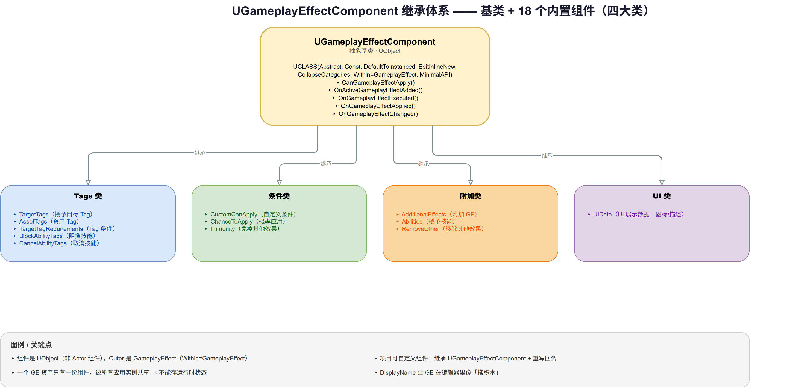
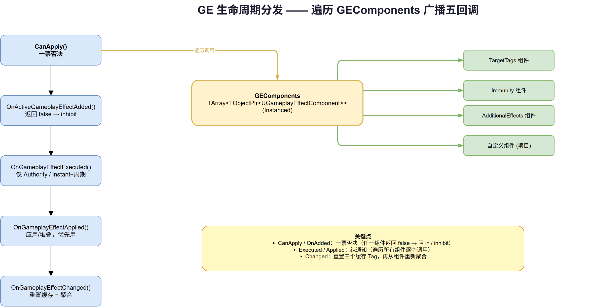

# 11 | GE Components — 组件化架构演进

> **本篇**：GE 的组件化重构 —— `UGameplayEffectComponent` 的设计哲学、五回调接口、模板访问、18 个内置组件分类，以及从 Monolithic 到 Modular 的版本演进

> **系列**: 《Inside GAS》— UE5 GameplayAbilitySystem 源码深度分析  
> **难度**: 🔴 源码  
> **字数**: ~6200  
> **前置**: 05/06-GameplayEffect  
> **源码路径**: `Engine/Plugins/Runtime/GameplayAbilities/Source/GameplayAbilities/Public/GameplayEffectComponent.h`

---

> **系列导航**
> 
> | 阶段 | 篇章 | 内容 | 状态 |
> |------|------|------|------|
> | 🟢 基础 | 01 | GAS 总览与核心架构 | ✅ |
> | | 02 | ASC — 核心调度器 | ✅ |
> | | 03 | GameplayTags — 通用语言 | ✅ |
> | | 04 | AttributeSet — 属性定义与复制 | ✅ |
> | 🔵 核心 | 05 | GameplayEffect — 效果与计算 (上) | ✅ |
> | | 06 | GameplayEffect — 效果与计算 (下) | ✅ |
> | | 07 | GameplayAbility — 技能激活与核心框架 (上) | ✅ |
> | | 08 | GameplayAbility — Task/输入/预测 (下) | ✅ |
> | | 09 | GameplayCue — 表现层触发机制 | ✅ |
> | 🔴 高级 | 10 | Prediction — 预测与回滚 | ✅ |
> | | **11** | **GE Components — 组件化架构演进** | ✅ |
> | | 12 | Network & Serial — 网络序列化 | 📝 |
> | | 13 | Targeting — 瞄准系统 | 📝 |
> | | 14 | Debug & Optimization — 调试与优化 | 📝 |
> | | 15 | 终篇回顾 — 全景复习 | 📝 |

---

## 一、问题驱动：一个类扛了太多东西

回顾第 05/06 篇讲的 `UGameplayEffect`，你会注意到一个现象：它几乎什么都能干——

- 改属性（Modifiers）
- 加 Tag（GrantedTags）
- 发 GameplayCue（GameplayCues）
- 授予技能（GrantedAbilities）
- 免疫其他效果（Immunity）
- 概率应用（ChanceToApply）
- 附加其他效果（AdditionalEffects）
- 移除其他效果（RemoveOther）
- 阻挡/取消技能（Block/Cancel Abilities）
- ……

在 UE 5.3 之前，这些都是 `UGameplayEffect` 类**自己的成员变量**。结果是 `UGameplayEffect` 长成了一个"巨型类"——字段上百个、职责十几个、任何一个功能的新增都要往这个类里塞东西。

这个架构的问题有三层：

1. **扩展困难**：你想给 GE 加一个新行为（比如"应用时播放自定义动画"），就得改引擎源码里的 `UGameplayEffect` 类，没法在项目里自己扩展；
2. **耦合严重**：几十个功能共享一个类，任何字段的改动都可能影响所有 GE，测试和调试都难；
3. **数据冗余**：每个 GE 资产都拖着几十个"用不到的功能字段"，即使它只是个简单的属性修改。

UE 5.3 给出的答案，就是**组件化（Modular）重构**——把 `UGameplayEffect` 从一个"巨型类"拆成"核心 + 一堆可插拔组件"。这就是 `UGameplayEffectComponent`（简称 GEComponent）的由来。

---

## 二、概念速览：什么是 GEComponent

### 2.1 一句话定义

`GameplayEffectComponent.h` 头部注释（第 16-30 行）开门见山：

> GEComponents are what define how a GameplayEffect behaves. Introduced in UE 5.3, there are very few calls from UGameplayEffect to UGameplayEffectComponent by design.

**GEComponent 定义了 GE 的"行为"**，而 `UGameplayEffect` 本身退化成"持有这些组件、负责分发生命周期回调"的容器。

### 2.2 关键类声明

```cpp
// GameplayEffectComponent.h:31
UCLASS(Abstract, Const, DefaultToInstanced, EditInlineNew, CollapseCategories, Within=GameplayEffect, MinimalAPI)
class UGameplayEffectComponent : public UObject
{
    GENERATED_BODY()
};
```

这行 `UCLASS` 里的每个 specifier 都有讲究：

| Specifier | 含义 |
|-----------|------|
| `Abstract` | 基类本身不实例化，只能派生子类 |
| `Const` | 设计上组件是"只读资产"，运行时不可变 |
| `DefaultToInstanced` | 默认创建实例（Instanced 子对象） |
| `EditInlineNew` | 可在编辑器中内联新建（作为 GE 的子对象） |
| `CollapseCategories` | 编辑器里折叠分类 |
| `Within=GameplayEffect` | **组件的 Outer 必须是 UGameplayEffect**，锁定了"组件从属于 GE"的关系 |
| `MinimalAPI` | 限制导出符号，减少编译依赖 |

**最值得注意的两个**：`Const` 和 `Within=GameplayEffect`。

- **`Const`** 是这套设计的灵魂——GEComponent 被定位为"**只读的资产描述**"，而不是"运行时的状态容器"。这直接引出了后面 §五 要讲的一个关键约束（组件不能存运行时状态）。
- **`Within=GameplayEffect`** 从类型系统层面锁死了组件的归属：一个 GEComponent 只能属于一个 GE，不能独立存在。

### 2.3 它是 UObject，不是 Actor 组件

一个常见的误区是把 GEComponent 和 `UActorComponent` 类比。它们**完全不是一回事**：

| | `UActorComponent` | `UGameplayEffectComponent` |
|--|-------------------|---------------------------|
| 基类 | `UActorComponent`（有 Tick、有世界） | `UObject`（纯数据对象） |
| 归属 | Actor | GameplayEffect（数据资产） |
| 生命周期 | 跟随 Actor 实例，运行时活跃 | 跟随 GE 资产，**所有应用实例共享同一份** |
| 是否有状态 | 有（`bWantsInitializeComponent` 等） | **无**（设计上禁止运行时状态） |

这个区别是理解后续一切的关键：**GEComponent 不是"每个 GE 应用实例各一份"，而是"一个 GE 资产里只有一份，被所有应用实例共享"**。

---

## 三、五回调接口：组件如何接入 GE 生命周期

GEComponent 通过重写五个虚函数来"钩住"GE 生命周期的不同阶段。这些回调的**语义区分**是理解组件化的核心，也是源码注释反复强调的术语（Added vs. Executed vs. Apply）。

```cpp
// GameplayEffectComponent.h:47-71
virtual bool CanGameplayEffectApply(const FActiveGameplayEffectsContainer& ActiveGEContainer, const FGameplayEffectSpec& GESpec) const { return true; }

virtual bool OnActiveGameplayEffectAdded(FActiveGameplayEffectsContainer& ActiveGEContainer, FActiveGameplayEffect& ActiveGE) const { return true; }

virtual void OnGameplayEffectExecuted(FActiveGameplayEffectsContainer& ActiveGEContainer, FGameplayEffectSpec& GESpec, FPredictionKey& PredictionKey) const {}

virtual void OnGameplayEffectApplied(FActiveGameplayEffectsContainer& ActiveGEContainer, FGameplayEffectSpec& GESpec, FPredictionKey& PredictionKey) const {}

virtual void OnGameplayEffectChanged() {}
```

### 3.1 三个"应用阶段"术语的精确区分

源码注释（`GameplayEffect.h` 第 2160-2170 行，以及基类的注释）用了三个看似相似、实则不同的词，这是新手最容易混淆的地方：

| 术语 | 触发时机 | 关键特征 |
|------|---------|---------|
| **Added**（`OnActiveGameplayEffectAdded`） | GE 被**加入** ActiveGameplayEffectsContainer | 有 Duration 的 GE 才会发生；**复制时也会触发**（服务器复制给客户端、预测的"重复"GE） |
| **Executed**（`OnGameplayEffectExecuted`） | GE 被**执行** | **只在 `ROLE_Authority`** 发生；Instant GE 执行、Periodic GE 每周期执行 |
| **Applied**（`OnGameplayEffectApplied`） | GE 被**应用**（或堆叠） | Instant 和 Duration 都会发生；**不会周期性发生，也不通过复制发生** |

源码注释里一句精辟的话（`GameplayEffectComponent.h:63-65`）：

> One should favor this function (`OnGameplayEffectApplied`) over `OnActiveGameplayEffectAdded` & `OnGameplayEffectExecuted` (but all multiple may be used depending on the case).

即：**大多数场景优先用 `OnGameplayEffectApplied`**，只有在你明确需要"只在 Added 或只在 Executed 时触发"的细分行为时，才用另外两个。

### 3.2 CanGameplayEffectApply：Application vs Inhibition

`CanGameplayEffectApply`（第 43-47 行注释）澄清了一个重要的区分：

> Application and Inhibition are two separate things. If a GE can apply, we then either Add it (if it has duration/prediction) or Execute it (if it's instant).

- **Can Apply**：GE 能不能应用（`CanGameplayEffectApply` 返回 false 直接阻止应用）；
- **Inhibit**：GE 已经 Added 了，但被"抑制"（`OnActiveGameplayEffectAdded` 返回 false → GE 保持 Added 但休眠，等 uninhibit）。

这两个是不同的概念——前者是"进不来"，后者是"进来了但暂时不生效"。

---

## 四、如何访问组件：模板三兄弟

GE 通过三个模板方法来访问自己的组件（`GameplayEffect.h:2195-2215`）：

```cpp
template<typename GEComponentClass>
const GEComponentClass* FindComponent() const;

template<typename GEComponentClass>
GEComponentClass& AddComponent();

template<typename GEComponentClass>
GEComponentClass& FindOrAddComponent();
```

### 4.1 编译期类型安全

三个方法开头都有同一个 `static_assert`（`GameplayEffect.h:2483`）：

```cpp
static_assert(TIsDerivedFrom<GEComponentClass, UGameplayEffectComponent>::IsDerived,
    "GEComponentClass must be derived from UGameplayEffectComponent");
```

这保证了**编译期**就能拦住"传了个非组件类型"的错误，而不是等到运行时 `Cast` 失败才发现。

### 4.2 三个方法的语义

| 方法 | 语义 | 找不到时 |
|------|------|---------|
| `FindComponent` | 只读查找 | 返回 `nullptr`（模板版）/ 或第一个派生实例（`TSubclassOf` 版） |
| `AddComponent` | 强制新增，不查重 | 总是返回新实例 |
| `FindOrAddComponent` | 有则返回、无则新增 | 新增一个 |

`AddComponent` 的实现（`GameplayEffect.h:2497-2506`）揭示了组件是如何创建的：

```cpp
TObjectPtr<GEComponentClass> Instance = NewObject<GEComponentClass>(
    this, NAME_None, GetMaskedFlags(RF_PropagateToSubObjects) | RF_Transactional);
GEComponents.Add(Instance);
```

关键点：**组件用 `NewObject` 创建，Outer 是 GE 自己**（`this`），并且标记 `RF_PropagateToSubObjects`（子对象随 GE 一起序列化）+ `RF_Transactional`（可撤销/重做）。

### 4.3 FindParentComponent：子类继承父类组件

还有个游离在类外的模板函数 `FindParentComponent`（`GameplayEffectComponent.h:90-96`）：

```cpp
template<typename GEComponentClass, typename LateBindGameplayEffect = UGameplayEffect>
const GEComponentClass* FindParentComponent(const GEComponentClass& ChildComponent)
{
    const LateBindGameplayEffect* ChildGE = ChildComponent.GetOwner();
    const LateBindGameplayEffect* ParentGE = ChildGE ? Cast<LateBindGameplayEffect>(ChildGE->GetClass()->GetArchetypeForCDO()) : nullptr;
    return ParentGE ? ParentGE->template FindComponent<GEComponentClass>() : nullptr;
}
```

它解决的是**GE 继承**场景：子 GE 想继承父 GE 的同类型组件（比如"继承父级的 GrantedTags"），就用这个函数沿着 Archetype 链往上找。

---

## 五、一个关键约束：组件不能存运行时状态

这是 GEComponent 设计里最"反直觉"的一点，也是源码注释花了最多篇幅解释的地方（`GameplayEffectComponent.h:23-27`）：

> GEComponents live Within a GameplayEffect (which is typically a data-only blueprint asset). Thus, like GEs, only one GEComponent exists for all applied instances. One of the unintuitive caveats of this is that GEComponent should not contain any runtime manipulated/instanced data (e.g. stored state per execution).

**翻译成人话**：一个 GE 资产被 100 个角色同时应用，这 100 个应用实例**共享同一个 GEComponent 对象**。因此：

- ❌ 你不能在组件里存"每个执行实例的状态"（比如"这个中毒已经跳了多少次"）——因为那 100 个实例会互相覆盖；
- ✅ 你只能把状态存在**回调的参数里**，或者存到 `FGameplayEffectSpec`（未来可能演化为 Spec Components）。

注释还坦诚地承认了这个约束的代价（第 26-27 行）：

> This may explain why some functionality is still in UGameplayEffect rather than a UGameplayEffectComponent. Future implementations may need extra data stored on the FGameplayEffectSpec (i.e. Gameplay Effect Spec Components).

也就是说：**有些功能至今还留在 `UGameplayEffect` 里没被组件化，就是因为它们需要运行时状态，而组件模型暂时装不下**。注释里还预告了未来方向——`FGameplayEffectSpec` 上的"Spec Components"。

---

## 六、内置组件全景：18 个组件分类

UE 5.8 内置了 18 个 GEComponent，它们清晰地分成了几大类。理解这个分类，就理解了"一个 GE 的能力由哪些积木拼成"。



*图：UGameplayEffectComponent 继承体系 —— 抽象基类（含五回调 + UCLASS specifier）与 18 个内置组件，按 Tags 类 / 条件类 / 附加类 / UI 类四大类分组；底部图例强调「组件是 UObject 非 Actor 组件」「共享同一实例不能存运行时状态」「项目可自定义组件」*

### 6.1 Tags 类（最基础）

| 组件 | DisplayName | 职责 |
|------|-------------|------|
| `UTargetTagsGameplayEffectComponent` | Grant Tags to Target Actor | 授予目标 Tag |
| `UAssetTagsGameplayEffectComponent` | Tags This Effect Has | 资产 Tag |
| `UTargetTagRequirementsGameplayEffectComponent` | Require Tags to Apply/Continue | 应用/持续所需的 Tag 条件 |
| `UBlockAbilityTagsGameplayEffectComponent` | Block Abilities with Tags | 阻挡带指定 Tag 的技能 |
| `UCancelAbilityTagsGameplayEffectComponent` | Cancel Abilities with Tags | 取消带指定 Tag 的技能 |

### 6.2 条件类（控制"能不能应用"）

| 组件 | DisplayName | 职责 |
|------|-------------|------|
| `UCustomCanApplyGameplayEffectComponent` | Custom Can Apply This Effect | 自定义应用条件（蓝图） |
| `UChanceToApplyGameplayEffectComponent` | Chance To Apply This Effect | 概率应用 |
| `UImmunityGameplayEffectComponent` | Immunity to Other Effects | 免疫其他效果 |

### 6.3 附加类（"附带做点别的"）

| 组件 | DisplayName | 职责 |
|------|-------------|------|
| `UAdditionalEffectsGameplayEffectComponent` | Apply Additional Effects | 附加应用其他 GE |
| `UAbilitiesGameplayEffectComponent` | Grant Gameplay Abilities | 授予技能 |
| `URemoveOtherGameplayEffectComponent` | Remove Other Effects | 移除其他效果 |

### 6.4 UI 类

| 组件 | DisplayName | 职责 |
|------|-------------|------|
| `UGameplayEffectUIData` | （抽象基类） | UI 展示数据（图标、描述等） |

### 6.5 一个观察：`DisplayName` 就是"人类可读的积木名"

注意到每个组件都有 `UCLASS(DisplayName="...")`。这不是偶然——**组件化的目标之一，就是让 GE 在编辑器里看起来像"搭积木"**：设计师打开一个 GE 资产，看到的是一列有名字的行为积木（"Grant Tags to Target Actor"、"Chance To Apply This Effect"），而不是几十个平铺的字段。

---

## 七、分发机制：GE 如何把生命周期广播给组件

组件本身不"订阅"事件，而是 GE 在生命周期各节点**主动遍历**自己的 `GEComponents` 数组，逐个调用。这个数组是：

```cpp
// GameplayEffect.h:2465-2466
UPROPERTY(EditDefaultsOnly, BlueprintReadOnly, Instanced, Category = "GameplayEffect",
    meta = (DisplayName = "Components", TitleProperty = EditorFriendlyName, ShowOnlyInnerProperties, DisplayPriority = 0))
TArray<TObjectPtr<UGameplayEffectComponent>> GEComponents;
```



*图：GE 生命周期分发 —— 五个生命周期节点（CanApply / OnAdded / Executed / Applied / Changed）依次遍历 GEComponents 数组，把回调广播给每个组件；CanApply 与 OnAdded 是一票否决，Executed 与 Applied 是纯通知，Changed 则重置并聚合缓存 Tag*

### 7.1 CanApply 的分发

```cpp
// GameplayEffect.cpp:958
bool UGameplayEffect::CanApply(const FActiveGameplayEffectsContainer& ActiveGEContainer, const FGameplayEffectSpec& GESpec) const
{
    for (const UGameplayEffectComponent* GEComponent : GEComponents)
    {
        if (GEComponent && !GEComponent->CanGameplayEffectApply(ActiveGEContainer, GESpec))
        {
            UE_VLOG_UELOG(ActiveGEContainer.Owner, LogGameplayEffects, Verbose,
                TEXT("%s could not apply. Blocked by %s"), *GetNameSafe(GESpec.Def), *GetNameSafe(GEComponent));
            return false;
        }
    }
    // ...
}
```

**关键点**：`CanApply` 是"**一票否决**"——只要有一个组件的 `CanGameplayEffectApply` 返回 false，整个 GE 就不能应用。日志还贴心地记录了"被哪个组件挡住"，方便调试。

### 7.2 OnActiveGameplayEffectAdded 的分发

```cpp
// GameplayEffect.cpp:975
bool bShouldBeActive = true;
for (const UGameplayEffectComponent* GEComponent : GEComponents)
{
    if (GEComponent)
    {
        bShouldBeActive = GEComponent->OnActiveGameplayEffectAdded(ActiveGEContainer, ActiveGE) && bShouldBeActive;
    }
}
```

注意这里的语义：`OnActiveGameplayEffectAdded` 的返回值是"这个 GE 是否应该保持 active"。**同样是一票否决**——任何组件返回 false，GE 就被 inhibit（保持 Added 但休眠）。

### 7.3 Executed / Applied 的分发

```cpp
// GameplayEffect.cpp:990 / 1003
for (const UGameplayEffectComponent* GEComponent : GEComponents)
{
    if (GEComponent)
    {
        GEComponent->OnGameplayEffectExecuted(ActiveGEContainer, GESpec, PredictionKey);
        // 或 GEComponent->OnGameplayEffectApplied(ActiveGEContainer, GESpec, PredictionKey);
    }
}
```

这两个是**无返回值**的纯通知，遍历所有组件逐个调用。

### 7.4 OnGameplayEffectChanged 的聚合

```cpp
// GameplayEffect.cpp:391
void UGameplayEffect::OnGameplayEffectChanged()
{
    // Reset these tags so we can reaggregate them properly from the GEComponents
    CachedAssetTags.Reset();
    CachedGrantedTags.Reset();
    CachedBlockedAbilityTags.Reset();

    for (UGameplayEffectComponent* GEComponent : GEComponents)
    {
        if (GEComponent)
        {
            GEComponent->ConditionalPostLoad();
            GEComponent->OnGameplayEffectChanged();
        }
    }
}
```

这是组件化带来的一个**重要性能优化**：GE 维护 `CachedAssetTags` / `CachedGrantedTags` / `CachedBlockedAbilityTags` 三个缓存容器，当任何组件变化时**重置并从组件重新聚合**。这样"这个 GE 有哪些 Tag"的查询（运行时频繁调用）就不必每次都遍历所有组件，而是直接读缓存。

---

## 八、版本演进：从 Monolithic 到 Modular

组件化不是一蹴而就的，而是通过**版本化升级路径**逐步迁移的。`EGameplayEffectVersion`（`GameplayEffect.h:94-102`）记录了这个演进：

```cpp
UENUM()
enum class EGameplayEffectVersion : uint8
{
    Monolithic,             // UE5.3 之前的旧版（未版本化）
    Modular53,              // UE5.3 的新模块化版本
    AbilitiesComponent53,   // Granted Abilities 移入 Abilities 组件

    Current = AbilitiesComponent53
};
```

### 8.1 升级路径：PostLoad 时自动迁移

`UGameplayEffect::PostLoad`（`GameplayEffect.cpp:375`）在加载时做版本升级：

```cpp
void UGameplayEffect::PostLoad()
{
    Super::PostLoad();
    OnGameplayEffectChanged();

#if WITH_EDITOR
    // We're done loading (and therefore upgrading), boost the version.
    SetVersion(static_cast<EGameplayEffectVersion>(
        UE::GameplayEffect::CVarGameplayEffectMaxVersion.GetValueOnGameThread()));
#endif
}
```

**关键点**：升级是**在编辑器加载时自动完成的**。一个旧版（Monolithic）的 GE 资产被打开时，会自动把它的字段迁移成对应的组件（比如把 `GrantedAbilities` 字段迁移成 `UAbilitiesGameplayEffectComponent`），然后版本号提升到 `Current`。

### 8.2 版本号的意义：支持"渐进式"迁移

这个版本枚举的存在，说明 Epic 采用的是一种**渐进式**迁移策略：

1. **UE5.3** 引入组件化，但旧 GE 还是 Monolithic 版本；
2. **随后**（`Modular53` → `AbilitiesComponent53`）逐步把更多字段从 GE 主类迁到组件；
3. 每个新版本号对应一次"某个功能字段 → 组件"的迁移。

`Current = AbilitiesComponent53` 意味着"Granted Abilities 迁移到组件"是**截至 UE5.8 的最新一次**迁移。这解释了为什么你在源码里还能看到 `UGameplayEffect` 上残留一些字段——它们属于"还没迁完"或"因为需要运行时状态而无法迁"的部分。

---

## 九、设计思考：为什么"少即是多"

回顾整套设计，最值得品味的，是头部注释里那句被轻描淡写带过、实则意味深长的话（第 19 行）：

> there are very few calls from UGameplayEffect to UGameplayEffectComponent by design.

"**故意让 GE 对组件的调用非常少**"。这不是偷懒，而是刻意的架构选择。它背后有三个层层递进的设计意图：

### 9.1 依赖倒置：GE 不"知道"组件能干什么

传统上，一个类如果要扩展，通常是"基类提供虚函数，子类重写"。但这样基类必须**预先声明**所有可扩展点，扩展还是受限于基类作者的设计。

GEComponent 反其道而行：**GE 只负责"在生命周期节点广播回调"，完全不关心组件在里面做了什么**。组件作者可以自由决定"我要在 `CanGameplayEffectApply` 里检查什么"、"我要在 `OnGameplayEffectApplied` 里干什么"，而无需改动 GE 主类的任何代码。

这实际上是一种**依赖倒置（Dependency Inversion）**——GE 依赖的是抽象的回调时机，而不是具体的功能实现。

### 9.2 开放封闭：加功能不改引擎

这个设计的直接收益，是**项目可以加自己的 GE 行为，而不改引擎源码**。你想做一个"应用时播放自定义音效"的 GE？写一个 `UMySoundGameplayEffectComponent : public UGameplayEffectComponent`，重写 `OnGameplayEffectApplied`，然后在编辑器里把它加进 GE 的 Components 列表。全程零引擎修改。

这在 Monolithic 时代是不可能的——那时你必须 fork 引擎、改 `UGameplayEffect` 类。

### 9.3 诚实的代价：Const 与状态的权衡

但正如 §五 讲的，这套设计**不是免费的**。`Const` 定位 + "共享同一份实例" 的约束，意味着组件**牺牲了运行时状态**。源码注释没有粉饰这一点，反而坦诚地指出：

- 有些功能至今没迁成组件，就是因为"需要运行时状态"；
- 未来方向是 `FGameplayEffectSpec` 上的 Spec Components。

这种"承认设计有边界、并诚实预告演进方向"的态度，和上一篇 Prediction 里"坦诚列出未解决问题"是一脉相承的——**Epic 的 GAS 文档风格，就是如实告诉你不完美的地方**。

---

## 十、总结

本篇拆解了 GE 的组件化重构：

| 主题 | 关键点 |
|------|--------|
| **背景** | UE5.3 前 `UGameplayEffect` 是"巨型类"，扩展难、耦合严重 |
| **GEComponent 定位** | `UCLASS(Abstract, Const, DefaultToInstanced, EditInlineNew, Within=GameplayEffect)`，继承 `UObject`（非 Actor 组件） |
| **五回调** | `CanGameplayEffectApply` / `OnActiveGameplayEffectAdded` / `OnGameplayEffectExecuted` / `OnGameplayEffectApplied` / `OnGameplayEffectChanged` |
| **术语区分** | Added（加入容器，含复制）/ Executed（仅 Authority，instant/周期）/ Applied（应用或堆叠，优先用这个） |
| **模板访问** | `FindComponent` / `AddComponent` / `FindOrAddComponent`，`static_assert` 编译期类型安全 |
| **关键约束** | 组件**不能存运行时状态**（共享同一实例）；未来方向是 Spec Components |
| **18 个内置组件** | Tags 类 / 条件类 / 附加类 / UI 类，`DisplayName` 让 GE 像"搭积木" |
| **分发机制** | `CanApply`/`OnAdded` 一票否决；`Executed`/`Applied` 纯通知；`OnChanged` 聚合缓存 Tag |
| **版本演进** | `Monolithic → Modular53 → AbilitiesComponent53`，`PostLoad` 时自动升级 |

下一篇进入 GAS 的网络序列化细节——GE/属性/预测键如何在网络上高效传输，以及 `FastArraySerializer` 的增量复制机制。

**上一篇**：[10 | Prediction — 预测与回滚](../10-Prediction/10-Prediction文章.md)

**下一篇**：[12 | Network & Serial — 网络序列化](../12-Network-Serial/12-Network-Serial文章.md) —— 拆解 `FFastArraySerializer` 增量复制、GE 的复制路径与属性预测的序列化细节。

---

*本文基于 UE 5.8 源码分析。系列文章会继续按模块拆解，从基础到高级，从 API 到设计哲学。*
