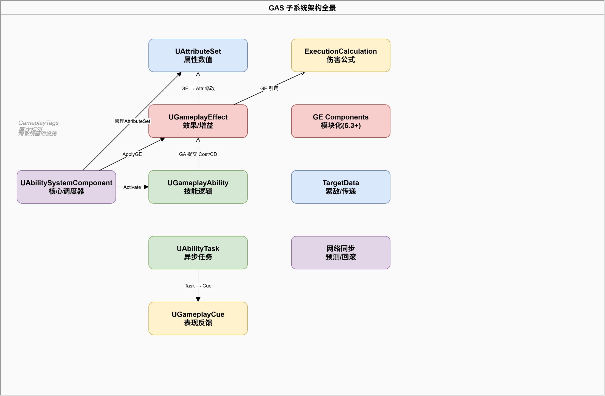

# 深入浅出UE5 GAS（十二）：实战全景 —— 调试、陷阱与工程化模式

## 系列目录

1. [AbilitySystemComponent —— GAS的心脏](../01-ASC/01-ASC文章.md)
2. [AttributeSet —— 数值系统的基石](../02-AttributeSet/02-AttributeSet文章.md)
3. [GameplayEffect（上）—— 从定义到应用](../03-GameplayEffect/03-GameplayEffect文章-上.md)
4. [GameplayEffect（下）—— Modifier、Stacking与Periodic](../03-GameplayEffect/03-GameplayEffect文章-下.md)
5. [ExecutionCalculation —— 自定义伤害公式](../04-ExecutionCalculation/04-ExecutionCalculation文章.md)
6. [GameplayAbility —— 技能的诞生与消亡](../05-GameplayAbility/05-GameplayAbility文章.md)
7. [AbilityTask —— 异步编程的艺术](../06-AbilityTask/06-AbilityTask文章.md)
8. [TargetData —— 索敌与数据传递](../07-TargetData/07-TargetData文章.md)
9. [GameplayCue —— 技能反馈的表现层](../08-GameplayCue/08-GameplayCue文章.md)
10. [网络同步 —— 复制、预测与回滚](../09-Network/09-Network文章.md)
11. [GE Components —— UE 5.3 模块化新范式](../10-GEComponents/10-GEComponents文章.md)
12. **（本文）实战全景 —— 调试、陷阱与工程化模式**

> 📎 [补遗篇 —— FGameplayAbilitySpec 详解](../12-Others/12-Others文章.md)

---

## 写在前面

前十一篇文章对 GAS 做了全面的源码级分析。现在你知道了 ASC 怎么管理 GE、Attribute 怎么聚合计算、Ability 怎么激活和预测、GE Component 怎么实现模块化——但知道这些原理和能让它们在实际项目中稳定运行是两回事。

这篇文章是系列的收官之作，不再深入源码，而是聚焦于四个实战主题：

1. **全局配置**：`UAbilitySystemGlobals` 是 GAS 的"控制面板"，配错一步全盘皆输
2. **数据驱动**：`GameplayTagResponseTable` 实现策划可配置的 Tag→GE 响应
3. **调试工具**：`showdebug abilitysystem` 是你日常开发中最重要的命令
4. **常见陷阱**：踩过的坑总结，帮你省下数天的调试时间
5. **Lyra 模式**：Epic 官方最新项目中的 GAS 最佳实践



---

## 一、全局配置：UAbilitySystemGlobals

### 1.1 它是什么？

`UAbilitySystemGlobals` 是一个全局单例对象（通过 `IGameplayAbilitiesModule` 持有），在所有 GAS 操作中充当"基础设施提供者"。它的作用类似于 Unity 中的 `ServiceLocator`——任何 GAS 子系统需要全局资源时，都通过它获取：

```cpp:55:67:E:\EpicGames\UE_5.8\Engine\Plugins\Runtime\GameplayAbilities\Source\GameplayAbilities\Public\AbilitySystemGlobals.h
/** Holds global data for the ability system. Configuration is done via 
 * the Developer Settings, Project -> Gameplay Abilities Settings  */
UCLASS(config = Game, MinimalAPI)
class UAbilitySystemGlobals : public UObject
{
    /** Gets the single instance of the globals object, will create it as necessary */
    static UAbilitySystemGlobals& Get()
    {
        return *IGameplayAbilitiesModule::Get().GetAbilitySystemGlobals();
    }
```

**注意 UE 5.5+ 的配置迁移**：原来的大部分配置项已从 `UAbilitySystemGlobals` 的 `UPROPERTY(config)` 迁移到 `UGameplayAbilitiesDeveloperSettings`（Project Settings → Gameplay Abilities Settings）。源码中保留了大量 `UE_DEPRECATED(5.5, "...")` 标记的旧字段。

### 1.2 InitGlobalData —— 必须要调用吗？

**是的，必须调用。** 它负责初始化以下几个关键子系统：

```cpp:69:69:E:\EpicGames\UE_5.8\Engine\Plugins\Runtime\GameplayAbilities\Source\GameplayAbilities\Public\AbilitySystemGlobals.h
    UE_API virtual void InitGlobalData();
```

初始化内容包括：
- 加载全局 CurveTable（`GetGlobalCurveTable()`）——`FScalableFloat` 查表的基础
- 加载全局 AttributeMetaDataTable —— 定义属性的最小值、最大值、堆叠规则
- 加载 AttributeSet 默认值表 —— `FAttributeSetInitter` 初始化属性默认值
- 初始化 TargetData 的 ScriptStruct Cache —— 网络多态序列化的前提
- 初始化全局 Tags（`ActivateFailCooldownTag` 等）
- 初始化 GameplayCueManager

**常见坑**：如果你的游戏是纯 C++ 启动（没有 GameInstance 蓝图），需要在代码中显式调用：

```cpp
UAbilitySystemGlobals::Get().InitGlobalData();
```

最好在 `UGameInstance::Init()` 或 `UGameEngine::Init()` 之后尽早调用。

### 1.3 项目中应该 override 的虚函数

| 虚函数 | 用途 | 典型实现 |
|--------|------|---------|
| `AllocAbilityActorInfo()` | 分配自定义的 `FGameplayAbilityActorInfo` | 返回 `new FMyCustomAbilityActorInfo()` |
| `AllocGameplayEffectContext()` | 分配自定义的 `FGameplayEffectContext` | 返回 `new FMyGameplayEffectContext()` |
| `InitGameplayCueParameters()` | 自定义 GameplayCue 参数的填充逻辑 | 在 `CueParameters` 中附加自定义数据 |

这三个函数是项目级定制的核心入口。例如，如果你想在 `FGameplayEffectContext` 中额外携带"暴击标记"、"元素类型"等信息，就 override `AllocGameplayEffectContext` 返回自己的子类，并在 ExecCalc 中通过 `Handle.Get()->GetHitResult()` 等方式读取。

### 1.4 全局配置速查

| 配置项（UE 5.5+ 位于 Project Settings） | 默认值 | 说明 |
|----------------------------------------|--------|------|
| `PredictTargetGameplayEffects` | false | 是否预测对其他目标的 GE（仅预测自身 GE 更安全） |
| `ReplicateActivationOwnedTags` | true | 能力激活时授予的 Tag 是否需要网络复制 |
| `bAllowGameplayModEvaluationChannels` | false | 是否允许多个 Mod Evaluation Channel |
| `GlobalCurveTableName` | (空) | `FScalableFloat` 使用的全局曲线表 |
| `MinimalReplicationTagCountBits` | 5 | Tag 复制计数的位数（默认 5 bits = 最大 31） |

---

## 二、数据驱动：GameplayTagResponseTable

### 2.1 核心概念

```
"Tag Count" → "Response GE"
```

`UGameplayTagReponseTable` 是一个 `UDataAsset`，它监听 ASC 上的 Tag 计数变化，根据"净计数"自动应用/移除响应 GE。

**场景**：你有一个 `Status.Haste` Tag，每层 Haste 加速 10%。不需要在 C++ 中写复杂的"Tag 变化 → 重新评估"逻辑，策划直接在表中配置：

```
Tag: Status.Haste
Positive Response: GE_HasteBuff (等级 = Tag 计数)
```

当 Tag 计数从 2 变成 3 时，系统自动移除旧的 2 层 Buff，应用 3 层 Buff。

### 2.2 源码机制

```cpp:18:61:E:\EpicGames\UE_5.8\Engine\Plugins\Runtime\GameplayAbilities\Source\GameplayAbilities\Public\GameplayTagResponseTable.h
USTRUCT()
struct FGameplayTagReponsePair
{
    UPROPERTY(EditAnywhere)
    FGameplayTag    Tag;                        // 触发响应的 Tag
    
    UPROPERTY(EditAnywhere)
    TArray<TSubclassOf<UGameplayEffect>> ResponseGameplayEffects; // 响应 GE 列表
    
    UPROPERTY(EditAnywhere, meta=(ClampMin = "0"))
    int32 SoftCountCap = 0;                    // 上限计数（0=无上限）
};

USTRUCT()
struct FGameplayTagResponseTableEntry
{
    UPROPERTY(EditAnywhere)
    FGameplayTagReponsePair Positive;   // 正向响应（Tag 计数 > 0 时）

    UPROPERTY(EditAnywhere)
    FGameplayTagReponsePair Negative;   // 负向响应（Tag 计数 < 0 时）
};
```

**`Positive` 和 `Negative` 的分离**是实现"增减双向响应"的关键。比如一个 Tag `State.Poison`：
- 正向：有 3 个 Poison Tag → 应用 Poison Lv3
- 负向：如果设计师配置一个反制 Tag `State.Antidote`，计数为负 → 应用免疫效果

### 2.3 注册流程

```cpp
UCLASS(MinimalAPI)
class UGameplayTagReponseTable : public UDataAsset
{
    // 为核心 ASC 注册 Tag 响应监听
    void RegisterResponseForEvents(UAbilitySystemComponent* ASC);

protected:
    // Tag 变化时的回调
    UFUNCTION()
    void TagResponseEvent(const FGameplayTag Tag, int32 NewCount, 
        UAbilitySystemComponent* ASC, int32 idx);
};
```

需要在 `InitAbilityActorInfo` 或角色初始化时调用：

```cpp
UGameplayTagReponseTable* Table = UAbilitySystemGlobals::Get().GetGameplayTagResponseTable();
if (Table)
{
    Table->RegisterResponseForEvents(AbilitySystemComponent);
}
```

---

## 三、IAbilitySystemInterface —— 谁有 ASC 的答案

### 3.1 接口定义

```cpp:19:31:E:\EpicGames\UE_5.8\Engine\Plugins\Runtime\GameplayAbilities\Source\GameplayAbilities\Public\AbilitySystemInterface.h
UINTERFACE(MinimalAPI, meta = (CannotImplementInterfaceInBlueprint))
class UAbilitySystemInterface : public UInterface {};

class IAbilitySystemInterface
{
    GENERATED_IINTERFACE_BODY()

    /** Returns the ability system component to use for this actor. 
     *  It may live on another actor, such as a Pawn using the PlayerState's component */
    virtual UAbilitySystemComponent* GetAbilitySystemComponent() const = 0;
};
```

这里有一个容易忽略的细节：注释强调 ASC 可能不在此 Actor 上。最常见的模式是 **Pawn 的 ASC 在 PlayerState 上**——因为 PlayerState 在网络复制的生命周期管理上比 Pawn 更稳定（PlayerState 不会因角色死亡/重生而被销毁）。

```cpp
class AMyPlayerState : public APlayerState, public IAbilitySystemInterface
{
    UPROPERTY()
    UAbilitySystemComponent* AbilitySystemComponent;
    
    virtual UAbilitySystemComponent* GetAbilitySystemComponent() const override 
    { 
        return AbilitySystemComponent; 
    }
};

class AMyCharacter : public ACharacter, public IAbilitySystemInterface
{
    virtual UAbilitySystemComponent* GetAbilitySystemComponent() const override 
    { 
        return GetPlayerState<AMyPlayerState>() 
            ? GetPlayerState<AMyPlayerState>()->GetAbilitySystemComponent() 
            : nullptr; 
    }
};
```

### 3.2 GetAbilitySystemComponentFromActor —— 最佳查找方式

不要直接调用 `GetAbilitySystemComponent()`，用 `UAbilitySystemGlobals::GetAbilitySystemComponentFromActor()` 代替：

```cpp
// 1. 优先通过 IAbilitySystemInterface 查找
// 2. 如果找不到，遍历 Actor 的所有 Component（UActorComponent 子类）
// 3. 如果还找不到，返回 nullptr
UAbilitySystemComponent* ASC = UAbilitySystemGlobals::GetAbilitySystemComponentFromActor(TargetActor);
```

这个函数处理了"Pawn 的 ASC 在 PlayerState 上"的间接关系。

---

## 四、调试工具大全

### 4.1 showdebug abilitysystem

这是你日常开发中最重要的命令。在 PIE 中按 `~` 打开控制台，输入：

```
showdebug abilitysystem
```

显示内容：
```
┌─ Ability System Component ──────────────────────────┐
│ Owner: BP_Hero_C_0                                   │
│ GameplayTags: State.Alive,Actor.UnTargetable,...     │
│                                                      │
│ ▸ Active Gameplay Effects                           │
│   [0] GE_DamageBoost (Lv.1) ▸ Attack +20%           │
│   [1] GE_Regen (Lv.3) ▸ Health +5/s                 │
│   [2] GE_Cooldown_Fireball ▸ 3.2s remaining         │
│                                                      │
│ ▸ Active Gameplay Abilities                         │
│   GA_Fireball ▸ Active                              │
│   GA_Shield ▸ Cooldown: 5.0s                        │
│                                                      │
│ ▸ Attribute Values (Snapshot)                       │
│   Health: 85/100 (Base: 100, Mod: -15)              │
│   Mana:   60/100 (Base: 100, Mod: -40)              │
│   Attack: 150 (Base: 100 + GE +50%)                 │
└──────────────────────────────────────────────────────┘
```

**按键盘数字键切换页面**：
- `0`：默认概览
- `1`：GameplayTags 详细列表
- `2`：Active GE 详细信息（每个 GE 的 Duration、StackCount、Modifier）
- `3`：Active Ability 详细信息
- `4`：Attribute 完整显示（BaseValue + 每个 Modifier 来源）
- `5`：Cue 状态

**类别快捷键**：按 `Delete` 键可以在显示/隐藏 GE、显示/隐藏 Ability 之间切换，方便聚焦特定信息。

### 4.2 GameplayDebuggerCategory_Abilities

UE 内置了 GameplayDebugger 集成（`GameplayDebuggerCategory_Abilities`）。启用方法：

1. 在 `DefaultGame.ini` 中启用：
```ini
[/Script/GameplayDebugger.GameplayDebuggerConfig]
ActivateKey=E
CategoryRowNum=12
```

2. 按 `'`（撇号键）打开 GameplayDebugger
3. 按数字键选择 "Abilities" 分类

相比 `showdebug`，GameplayDebugger 的优势是**空间可视化**——它会在 Actor 周围绘制 3D 标记，显示当前激活的能力、冷却进度条等。适合在自由视角下调试多个 Actor 的 GAS 状态。

### 4.3 Unreal Insights 的 GAS Trace Channel

如果你的游戏性能有问题（GE 太多、ExecCalc 太慢），Unreal Insights 的 Trace 是最强工具。

在命令行添加 `-trace=GameplayAbilities` 运行游戏，Insights 会记录：
- 每个 GE 的应用时间
- 每个 ExecCalc 的执行时间
- Ability 激活延迟
- GameplayCue 执行时间
- Predict 和 Reject 事件

配合 Unreal Insights 的 Timing View，你可以精确定位到"哪个 GE 在应用时卡了 3ms"。

### 4.4 控制台命令速查

| 命令 | 用途 |
|------|------|
| `showdebug abilitysystem` | ASC 状态概览 |
| `showdebug abilitysystem GE` | 仅显示 GE |
| `AbilitySystem.Debug.NextTarget` | 切换调试目标 |
| `AbilitySystem.Debug.SetCategory ...` | 设置调试分类 |
| `AbilitySystem.IgnoreCooldowns 1` | 忽略冷却（测试用） |
| `AbilitySystem.IgnoreCosts 1` | 忽略消耗（测试用） |
| `AbilitySystem.GlobalAbilityScale 2.0` | 全局技能速度缩放（非 Shipping） |
| `log LogGameplayAbilities Verbose` | 开启 GAS 详细日志 |

---

## 五、常见陷阱与排查清单

### 5.1 ASC 初始化陷阱

**症状**：技能激活失败，没有任何日志，`TryActivateAbility` 返回 false。

**排查**：
1. `InitAbilityActorInfo` 是否调用了？ASC 需要通过它绑定 Owner 和 Avatar
2. ASC 的复制是否正确？Autonomous Proxy 的 ASC 应标记为 `Replicates = true`
3. 客户端是否调用了 `UAbilitySystemGlobals::Get().InitGlobalData()`？

### 5.2 Attribute 复制陷阱

**症状**：客户端显示的血量与服务器不一致，预测表现混乱。

**排查**：
1. 确认所有属性使用 `REPNOTIFY_Always`（不是 `OnChanged`）
2. 确认 `DOREPLIFETIME_CONDITION_NOTIFY` 的 Condition 不是 `COND_OwnerOnly`（除非你只想给 Owner 看）
3. 确认 AttributeSet 的 `GetLifetimeReplicatedProps` 中注册了所有属性

### 5.3 GE 不生效

**症状**：GE 应用了但没有效果。

**排查**：
1. 用 `showdebug abilitysystem` 查看 GE 是否成功加入 Active List
2. 检查 `CanGameplayEffectApply` 的返回值——`TargetTagRequirements`、`ApplicationTagRequirements` 等可能阻止了应用
3. 检查是否被 `ImmunityGameplayEffectComponent` 拦截
4. 如果是 Instant GE：只执行一次就消失，确认你用 `ApplyGameplayEffectToSelf` 而非 `ApplyGameplayEffectToTarget`
5. 如果是 ExecCalc：检查 `GetSourceAbilitySystemComponent()` 是否返回了有效的 ASC

### 5.4 GameplayCue 不触发

**症状**：声音/特效没有播放。

**排查**：
1. `GameplayCueNotify` 的路径是否在 `UAbilitySystemGlobals::GameplayCueNotifyPaths` 中？
2. GameplayCue Tag 是否匹配？（`GameplayCue.A.B.C` 严格匹配 `GameplayCue.A.B.C`，不支持模糊匹配）
3. GameplayCueManager 是否初始化了？（`InitGlobalData` 中自动初始化）
4. 对于客户端：检查 GameplayCue 是否因为 Prediction 被跳过了（"已经预测播放过了"）

### 5.5 能力激活失败

**症状**：`TryActivateAbility` 失败，控制台有 "InternalTryActivateAbility" 日志。

**常见原因**（有序）：
1. 能力未授予：没有通过 `GiveAbility` 或 `GE→AbilitiesGameplayEffectComponent` 添加
2. Tag 条件不满足：`ActivationRequiredTags` / `ActivationBlockedTags` 检查失败
3. 冷却中：检查 ASC 上是否有对应 CooldownTag
4. 资源不足：`CostGameplayEffectClass` 要求的资源不够
5. 网络验证失败：客户端预测激活，但服务器拒绝（检查 `ActivationOwnedTags` 和网络角色）
6. ASC 的 `bIsActive` 为 false

### 5.6 ExecCalc 预测不一致

**症状**：客户端预测伤害 50，服务器实际只打 30。

**原因**：ExecCalc 不在客户端执行。客户端只是预测了 Instant GE 的应用，但伤害计算实际上在服务器 ExecCalc 中完成。

**解决**：
- 如果预测即时性优先：用 Simpler Modifier 代替 ExecCalc
- 如果精度优先：接受 1-2 帧的延迟（ExecCalc 的结果通过属性复制赶上来）

---

## 六、Lyra 模式：Epic 官方的 GAS 最佳实践

Lyra（UE 5 官方示例项目）展示了 Epic 在大型游戏中如何使用 GAS。以下是几个值得学习的模式：

### 6.1 PawnData + AbilitySet

Lyra 不直接在 Character 或 PlayerState 中硬编码能力列表，而是使用 `AbilitySet` 数据资产：

```
UPROPERTY()
ULyraPawnData* PawnData
├── AbilitySets[]
│   ├── AbilitySet_Weapon
│   │   ├── GA_Shoot
│   │   ├── GA_Reload
│   │   └── GA_AimDownSights
│   ├── AbilitySet_Movement
│   │   ├── GA_Jump
│   │   └── GA_Slide
│   └── AbilitySet_Health
│       ├── GE_HealthRegen
│       └── AttributeSet_Health
└── InputConfig (输入到Tag的映射)
```

**核心优势**：
- **数据驱动切换**：换武器 = 换 `AbilitySet`，不需要硬编码 if-else
- **热重载友好**：修改 `AbilitySet` 数据资产后 PIE 即时生效
- **模块化测试**：可以单独测试 `AbilitySet_Weapon` 而不需要加载整个游戏

### 6.2 HeroComponent

Lyra 用一个 `ULyraHeroComponent`（`UPawnComponent` 子类）作为 GAS 的初始化入口：

```
APawn (LyraCharacter)
└── ULyraHeroComponent
    ├── 拥有 ASC 引用
    ├── 管理 AbilitySet 的授予/移除
    ├── 处理输入到 Tag 的映射
    └── 处理死亡/重生时的 ASC 重置
```

**为什么不用 Character 本身？** —— 将 GAS 逻辑放在 Component 中比放在 Actor 中更容易复用。如果你的项目后续有载具系统、炮塔系统，`HeroComponent` 可以独立附加到任何 Pawn 上。

### 6.3 InputTag → AbilityTag 映射

Lyra 的核心输入映射链：

```
玩家按键 (Enhanced Input)
    → InputAction (输入动作)
        → InputTag (GameplayTag, e.g., "InputTag.Weapon.Fire")
            → ULyraHeroComponent::OnInputTagChanged
                → ASC::AbilityLocalInputPressed(InputTag)
                    → GA_Shoot 的 AbilityTriggers 中匹配到 InputTag
                        → GA_Shoot::ActivateAbility
```

这个链的关键设计是：**GA 不直接绑定 InputAction**。GA 只声明自己关心的 InputTag（在 `AbilityTriggers` 数组中），由 HeroComponent 统一分发。这实现了输入层和能力层的完全解耦。

### 6.4 GameplayMessageSubsystem

Lyra 使用 `UGameplayMessageSubsystem` 代替全局委托进行游戏事件通信：

```cpp
// GE 应用后广播消息（不关心谁在监听）
UGameplayMessageSubsystem::Get(this).BroadcastMessage(
    TAG_Gameplay_DamageMessage, DamageMessage);

// 其他系统（UI、音频、VFX）订阅消息
ListenerHandle = UGameplayMessageSubsystem::Get(this).RegisterListener(
    TAG_Gameplay_DamageMessage, this, &UMyWidget::OnDamageReceived);
```

这与 GAS 的 GameplayCue 形成了互补：GameplayCue 用于"视觉/听觉表现"，GameplayMessage 用于"游戏逻辑响应"（UI 更新、任务计数、成就系统等）。两条路径各自独立，互不依赖。

---

## 七、系列回顾

从第一篇到这篇，我们完整走过了 GAS 的源码全景：

```
┌─────────────────────────────────────────────────────────┐
│                    GAS 子系统全景图                       │
├────────────┬───────────┬────────────┬───────────────────┤
│  基础架构   │  数值系统  │  技能系统   │  表现层            │
├────────────┼───────────┼────────────┼───────────────────┤
│ ASC ①      │ Attr ②    │ Ability ⑥  │ GameplayCue ⑨     │
│ GE Comp ⑪  │ ExecCalc ⑤│ Task ⑦     │                   │
│ Globals ⑫  │ GE ③④     │ TargetData⑧│                   │
│ Interface⑫ │           │            │                   │
├────────────┴───────────┴────────────┴───────────────────┤
│                     网络层                               │
│         Prediction + Replication ⑩                       │
├─────────────────────────────────────────────────────────┤
│         TagResponseTable + 调试工具 ⑫                     │
└─────────────────────────────────────────────────────────┘
```

这些子系统不是孤立的——它们通过 **GameplayTag** 这条暗线串联：
- Tag 控制能力激活（`ActivationRequiredTags`）
- Tag 控制 GE 的应用和持续（`TargetTagRequirements`）
- Tag 控制 GE 移除（`RemovalTagRequirements`）
- Tag 控制免疫（`ImmunityGameplayEffectComponent` 通过 Tag Query 查找 GE）
- Tag 控制 GameplayCue 触发
- Tag 控制能力阻止和取消

理解了 Tag 是 GAS 的"神经系统"，你就真正掌握了 GAS 的设计哲学。

---

## 八、总结

1. **`UAbilitySystemGlobals`** 是 GAS 的全局基础设施，`InitGlobalData()` 必须尽早调用
2. 通过 override `AllocGameplayEffectContext()` 和 `AllocAbilityActorInfo()` 实现项目级定制
3. **`GameplayTagResponseTable`** 实现数据驱动的 Tag→GE 映射，减少硬编码
4. **`showdebug abilitysystem`** 是日常调试最常用的命令，**Unreal Insights** 用于性能分析
5. **常见陷阱**：`REPNOTIFY_Always`、`InitAbilityActorInfo` 遗漏、Tag 条件不满足、ExecCalc 不预测
6. **Lyra 模式**：`AbilitySet` 数据驱动 + `HeroComponent` 组件化 + `InputTag → AbilityTag` 解耦 + `GameplayMessageSubsystem` 事件通信
7. GAS 的核心设计哲学：**GameplayTag 是贯穿所有子系统的统一语言**

---

## 系列完结

十二篇文章，从 ASC 到 GE Components，从 ExecCalc 到网络预测，从 TargetData 到 Lyra 实战——这个系列试图以"源码驱动"的方式，还原 GAS 作为一个完整系统的设计逻辑和实现细节。

GAS 是一套教科书级别的游戏引擎子系统设计：它证明了"复杂的问题值得一套复杂的框架来解决"。理解它的设计取舍（比如 MMC vs ExecCalc、GE Component 为什么不继承 UActorComponent、预测窗口为什么只有一帧），比死记硬背 API 要有用得多。

感谢阅读至此。如果你在使用 GAS 时遇到了本文没有覆盖的问题，唯一的终极建议是：**打开 IDE，直接看源码**。GAS 的源码注释质量是 Epic 所有系统中最高的之一——很多在文档中找不到的答案，在 `.h` 文件的注释中写得清清楚楚。

---

*本文基于 UE 5.8 源码及 Lyra 项目分析。游玩愉快。*
