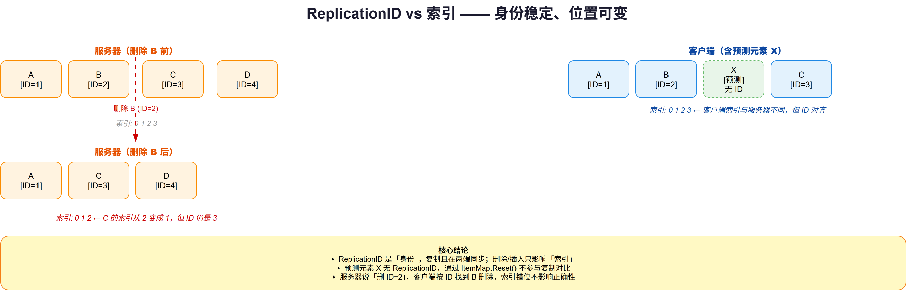
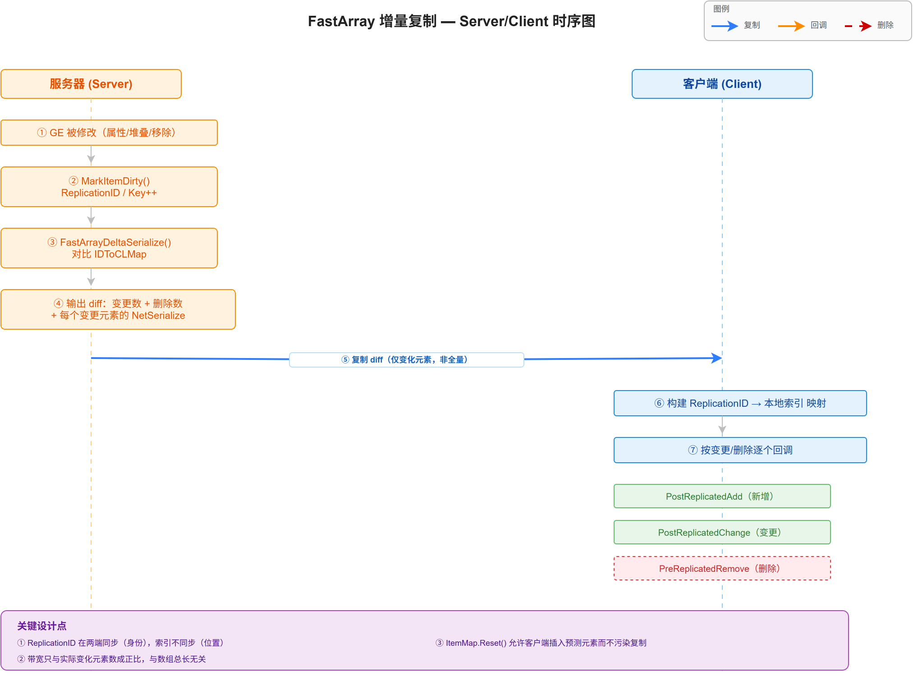

# 12 | Network & Serial — 网络序列化

> **本篇**：GAS 的网络序列化细节 —— `FFastArraySerializer` 增量复制、GE 的复制路径（`FActiveGameplayEffectsContainer`）、量化向量与属性预测的序列化机制

> **系列**: 《Inside GAS》— UE5 GameplayAbilitySystem 源码深度分析  
> **难度**: 🔴 源码  
> **字数**: ~6500  
> **前置**: 05/06-GameplayEffect、10-Prediction  
> **源码路径**: `Engine/Source/Runtime/Net/Core/Classes/Net/Serialization/FastArraySerializer.h`

---

> **系列导航**
> 
> | 阶段 | 篇章 | 内容 | 状态 |
> |------|------|------|------|
> | 🟢 基础 | 01 | GAS 总览与核心架构 | ✅ |
> | | 02 | ASC — 核心调度器 | ✅ |
> | | 03 | GameplayTags — 通用语言 | ✅ |
> | | 04 | AttributeSet — 属性定义与复制 | ✅ |
> | 🔵 核心 | 05 | GameplayEffect — 效果与计算 (上) | ✅ |
> | | 06 | GameplayEffect — 效果与计算 (下) | ✅ |
> | | 07 | GameplayAbility — 技能激活与核心框架 (上) | ✅ |
> | | 08 | GameplayAbility — Task/输入/预测 (下) | ✅ |
> | | 09 | GameplayCue — 表现层触发机制 | ✅ |
> | 🔴 高级 | 10 | Prediction — 预测与回滚 | ✅ |
> | | 11 | GE Components — 组件化架构演进 | ✅ |
> | | **12** | **Network & Serial — 网络序列化** | ✅ |
> | | 13 | Targeting — 瞄准系统 | 📝 |
> | | 14 | Debug & Optimization — 调试与优化 | 📝 |
> | | 15 | 终篇回顾 — 全景复习 | 📝 |

---

## 一、问题驱动：属性值改了，网络怎么"高效地"告诉别人？

前面几篇反复提到"复制"（Replication）：GE 复制到客户端、预测键复制回客户端、属性值复制到所有端。但"复制"这个词太笼统了——一个 `TArray` 里改了中间第 37 个元素，网络该怎么传？

- **全量传输？** 每次都把整个数组发一遍？那一个 100 元素的 GE 列表，改一个就重发 100 个，带宽爆炸；
- **按索引传？** "第 37 个改了"，但客户端和服务器数组的**索引顺序可能不一致**（客户端可能多插了几个预测元素），按索引传会错位。

这就是网络序列化要解决的核心问题：**在"服务器权威状态"和"客户端镜像状态"之间，用最小的带宽、安全地同步差异**。

本篇拆解 GAS 用来解决这个问题的三件武器：

1. **`FFastArraySerializer`**——用"复制 ID + 复制键"代替"索引"的增量复制；
2. **GE 的复制路径**——`FActiveGameplayEffectsContainer` 如何基于 FastArray 复制整个 GE 列表；
3. **量化序列化**——`FVector_NetQuantize` 系列如何把向量压到极限。

---

## 二、概念速览：三个术语先对齐

| 术语 | 一句话定义 |
|------|-----------|
| **NetSerialize** | 自定义"整块序列化"，适合原子属性（int/float/指针），直接读写 `FArchive` |
| **NetDeltaSerialize** | 自定义"增量序列化"，从 base state 出发，产生 diff（发客户端）+ full（存为下次 base） |
| **FastArraySerializer** | 针对 `TArray<UStruct>` 优化的 `NetDeltaSerialize` 实现，用 ID↔Key map 而非索引做 diff |

**一个关键区分**（`FastArraySerializer.h:159-167` 注释）：

- 能塞进扁平 `Recent` 缓冲区的属性，用 `NetSerialize` 就够——直接对比就知道脏没脏；
- **动态属性**（`TArray`，因为存的是 Num/Max + 数据指针，塞不进扁平缓冲区）只能走 `NetDeltaSerialize`——它**自己承担了 diff 的职责**，同时产出"要发什么"和"下次的 base 是什么"。

---

## 三、FastArraySerializer：用 ID 代替索引的增量复制

### 3.1 为什么"按索引"不行

先理解问题。假设服务器有一个 GE 列表 `[A, B, C, D]`，客户端镜像也是 `[A, B, C, D]`。现在服务器把 B 删了，变成 `[A, C, D]`。

如果按索引复制："索引 1 变了，索引 2 从 C 变 D"——但客户端可能因为预测，本地有 `[A, B, C, D, X]`（多插了个预测元素 X）。这时"索引 1"在两边的含义已经错位了。

**根本矛盾**：索引是"位置"，而网络同步需要的是"身份"。位置会变，身份才稳定。

### 3.2 解法：ReplicationID 与 ReplicationKey

FastArray 的核心思路，是给每个数组元素一个**稳定的身份**——`ReplicationID`：

```cpp
// FastArraySerializer.h:298
USTRUCT()
struct FFastArraySerializerItem
{
    UPROPERTY(NotReplicated)
    int32 ReplicationID;      // 元素身份，复制且在两端同步

    UPROPERTY(NotReplicated)
    int32 ReplicationKey;     // 每次修改 +1，标识"这个元素又变了"

    UPROPERTY(NotReplicated)
    int32 MostRecentArrayReplicationKey;  // 最近一次同步的数组键
};
```

三个字段**都是 `NotReplicated`**——它们不直接上网络，而是作为"本地记账"的元数据。核心机制（`FastArraySerializer.h:200-224` 注释）：

- **`ReplicationID` 在客户端和服务器同步**（它是"身份"）；
- **索引 `Index` 不在两端同步**（它是"位置"，可以不同）；
- `MarkItemDirty` 时，元素获得新的 `ReplicationKey`（首次还分配新 `ReplicationID`）。



*图：ReplicationID vs 索引 —— 服务器删除 B 后，C 的索引从 2 变成 1，但 ReplicationID 仍是 3；客户端因预测插入了元素 X（无 ID），索引与服务器不同，但 ID 对齐保证"按 ID 删除"的正确性*

### 3.3 MarkItemDirty：脏标记的真相

```cpp
// FastArraySerializer.h:441
void MarkItemDirty(FFastArraySerializerItem & Item)
{
    if (Item.ReplicationID == INDEX_NONE)
    {
        Item.ReplicationID = ++IDCounter;   // 首次：分配身份
    }
    Item.ReplicationKey++;                   // 每次：版本 +1
    MarkArrayDirty();
}
```

而 `MarkArrayDirty`（第 457 行）里有一行**意味深长**的代码：

```cpp
void MarkArrayDirty()
{
    ItemMap.Reset();   // This allows to clients to add predictive elements to arrays without affecting replication.
    IncrementArrayReplicationKey();
    // ...
}
```

注释道破了 `ItemMap.Reset()` 的用途：**允许客户端往数组里加"预测元素"而不影响复制**。这正是上一篇（Prediction）讲的机制在序列化层的落地——客户端的预测 GE 会临时插进数组，但通过重置 ItemMap，这些预测元素不会污染复制状态。

### 3.4 FastArrayDeltaSerialize：diff 的核心

服务器序列化时（`FastArraySerializer.h:206-217` 注释）：

- 对比旧的 base state（`FNetFastTArrayBaseState` 里的 `IDToCLMap`，即 `ID→Index` 映射）与当前数组；
- **缺失的 ID** → 写成"删除"；
- **新增或 `ReplicationKey` 变化的 ID** → 写成"变更"，调用 `NetSerialize` 序列化整个元素状态。

实际写出的内容大概是（第 211 行注释）：

```
"Array has X changed elements, Y deleted elements"
  -> "element A changed" -> NetSerialize 输出 A 的字段
  -> "Element B was deleted"
  -> ...
```

客户端读取时（第 215-216 行）：读出"变更数 + 删除数"，构建 `ReplicationID → 本地索引` 的映射，然后逐个"创建/序列化当前状态/删除"。

### 3.5 三个回调：增删改的通知

`FFastArraySerializerItem` 提供三个**非虚**回调（`FastArraySerializer.h:341-356`）：

```cpp
void PreReplicatedRemove(const FFastArraySerializer& InArraySerializer);
void PostReplicatedAdd(const FFastArraySerializer& InArraySerializer);
void PostReplicatedChange(const FFastArraySerializer& InArraySerializer);
```

注意注释强调：它们是**非虚的、通过模板代码调用**的（不是 `virtual`）。这意味着 FastArray 用的是**编译期多态**（CRTP 风格），而不是虚函数调用——性能更优，但代价是这些回调的签名必须精确匹配。



*图：FastArray 增量复制时序 —— 服务器 GE 被修改 → MarkItemDirty → FastArrayDeltaSerialize 对比 IDToCLMap 产出 diff（变更数+删除数）→ 仅复制变化元素到客户端 → 客户端构建 ID→索引映射 → 按增/改/删逐个回调 PostReplicatedAdd/PostReplicatedChange/PreReplicatedRemove*

---

## 四、GE 的复制路径：FActiveGameplayEffectsContainer

### 4.1 它就是一个 FastArray

回到 GAS 本身，GE 的复制正是建立在 FastArray 之上：

```cpp
// GameplayEffect.h:1652
USTRUCT()
struct FActiveGameplayEffectsContainer : public FFastArraySerializer
{
    GENERATED_USTRUCT_BODY();
    // ...
    UE_API bool NetDeltaSerialize(FNetDeltaSerializeInfo& DeltaParms);
    // ...
};
```

而 `FActiveGameplayEffect`（数组元素）实现了三个回调：

```cpp
// GameplayEffect.h:1396-1398
UE_API void PreReplicatedRemove(const struct FActiveGameplayEffectsContainer &InArray);
UE_API void PostReplicatedAdd(const struct FActiveGameplayEffectsContainer &InArray);
UE_API void PostReplicatedChange(const struct FActiveGameplayEffectsContainer &InArray);
```

**这就把整条链串起来了**：

- 服务器某个 GE 被修改 → `MarkItemDirty`；
- `FActiveGameplayEffectsContainer::NetDeltaSerialize` → `FastArrayDeltaSerialize`；
- 客户端收到 → `PostReplicatedAdd`（新增）/`PostReplicatedChange`（变更）/`PreReplicatedRemove`（删除）被回调；
- 客户端在这些回调里做本地状态更新（如刷新聚合器、重新计算属性）。

### 4.2 为什么 GE 用 FastArray 而不是普通数组复制

第 05/06 篇讲过，一个角色身上可能同时挂着几十个 GE（各种 buff、debuff、被动）。这些 GE 是**动态增删**的——buff 到期移除、新 debuff 加上。如果用普通 `TArray` 复制，每次增删都可能导致大量元素重排、全量重传。

FastArray 的 ID 机制让"增删中间任意元素"都变成"增删一个 ID"，带宽开销只和**实际变化的元素数**成正比，而不是数组总长度。

---

## 五、量化序列化：把向量压到极限

### 5.1 为什么需要量化

`FGameplayCueParameters` 里的 `Location` 用的是 `FVector_NetQuantize10`（上一篇 GameplayCue 提过）。为什么不用普通的 `FVector`？

因为 `FVector` 是 `double` ×3 = **24 字节**，而网络带宽是稀缺资源。量化序列化用"定点数 + 缩放因子"把向量压到个位数字节。

### 5.2 四个量化等级

`NetSerialization.h` 定义了四个量化向量（第 398-574 行），精度和范围各不相同：

| 类型 | 精度 | 每分量位数 | 有效范围 |
|------|------|-----------|---------|
| `FVector_NetQuantize` | 0 位小数 | 20 bits | ±1,048,576 |
| `FVector_NetQuantize10` | 1 位小数 | 24 bits | ±1,677,721.6 |
| `FVector_NetQuantize100` | 2 位小数 | 30 bits | ±10,737,418.24 |
| `FVector_NetQuantizeNormal` | 16 bits | 16 bits | -1..+1（单位向量） |

**选型原则**：

- 位置（大范围、粗精度）→ `NetQuantize10`；
- 法线（单位向量，[-1,1]）→ `NetQuantizeNormal`，用 `SerializeFixedVector<1,16>`；
- 需要更精细的小数 → `NetQuantize100`。

### 5.3 Packed vs Fixed：两种量化算法

`NetSerialization.h` 第 137-170 行注释对比了两种算法：

- **Fixed（固定）**：每个分量固定位数，适合"值域相近"的场景（如法线），省去"每个分量用几位"的头开销；
- **Packed（打包）**：每个分量用可变位数，先写"用几位"，再写数据。适合"大范围 + 小值常见"的场景（小值省空间，大值也能表示）。

`FVector_NetQuantize10` 用的是 `SerializePackedVector<10, 24>`——缩放因子 10、最多 24 位，正好对应"1 位小数、±167 万范围"。

---

## 六、属性预测的序列化：delta 而非绝对值

第 10 篇讲预测时提过"属性预测是 delta 预测"。这里从序列化角度补全它的落地。

### 6.1 预测的 GE 是"无限时长"

预测性的 instant GE 在客户端被当作**无限时长**的 GE 应用（`GameplayPrediction.h:114-129` 注释）。为什么？

因为预测的本质是"客户端先算一个值，等服务器值来了再对账"。如果预测 GE 是 instant（瞬间就没了），那客户端就没有"一个持续存在的、可被撤销的临时状态"——而撤销（Undo）需要这个状态还在。

### 6.2 REPNOTIFY_Always 的必要性

属性复制默认是"值变了才通知"。但预测场景下，客户端**已经自己预测改了值**，服务器的权威值复制下来时，可能和客户端当前值一样（都是"预测后的值"）——如果"值没变就不通知"，客户端就永远收不到"服务器权威值已就位"的信号。

所以预测属性必须用 `REPNOTIFY_Always`——**每次都通知，哪怕值没变**。这样客户端才能在 `OnRep` 里知道"服务器基准值到了，可以重新聚合了"。

### 6.3 重新聚合：base + delta

客户端在 `OnRep` 里的逻辑是：

```
服务器基准值（base value）到达
  → 把 base value 当作新的基准
  → 重新叠加本地预测的 delta
  → 得到 final value
```

这就是"delta 预测"的序列化含义：**复制的是"基准值"，预测的是"相对基准的偏移"**。这和第 10 篇的 `FScopedPredictionWindow`、`FActiveGameplayCue`（`GameplayCueInterface.h:114` 的 `FActiveGameplayCueContainer` 也是 FastArray）形成闭环。

---

## 七、设计思考：三层设计里藏着三个"诚实"

### 7.1 诚实一：ID 同步、索引不同步——这是核心权衡

FastArray 最精妙也最"反直觉"的设计，是**主动放弃索引一致性**（`FastArraySerializer.h:213`）：

> Note that the ReplicationID is replicated and in sync between client and server. The indices are not.

为什么不强制索引一致？因为那会让"客户端插入预测元素"变成不可能——如果索引必须一致，客户端插一个预测 GE 就会导致后续所有元素的索引错位。

**代价与收益的权衡**：放弃索引一致，换来了"客户端可以自由插入预测元素而不破坏复制"的能力。这个权衡是 GAS 预测系统能在序列化层成立的**前提**——第 10 篇讲的预测，正是靠这里的 `ItemMap.Reset()` 和 ID 机制才跑得起来。

### 7.2 诚实二：编译期多态，牺牲灵活性换性能

三个回调（`PreReplicatedRemove` 等）**故意不是虚函数**，而是通过模板在编译期绑定。这不是偷懒——FastArray 是**每帧都在跑的热路径**（服务器每帧都要对每个角色的 GE 列表做 diff），虚函数调用的开销在这里会被放大。

但代价是：**你没法"运行时动态地"给 FastArray 元素换一种回调实现**。一切都在编译期定死。这是一个典型的"性能优先"选择。

### 7.3 诚实三：两套序列化的共存是历史包袱

`FastArraySerializer.h:141-180` 的概述里，你能看到 UE 网络序列化其实有**两套并存的机制**：

- **Generic Delta Replication**：默认方式，`memcmp` 对比 base state；
- **Custom Net Delta Serialization**：通过 struct trait（`WithNetDeltaSerializer`）走自定义 `NetDeltaSerialize`。

FastArray 是后者的一种实现。两套并存意味着开发者要理解"什么时候该用哪套"——这不是一个"干净"的架构，而是**演进过程中的历史现实**。注释坦诚地把这些内部机制（`Recent` 缓冲区、`RecentDynamicState`、`INetDeltaBaseState`）都摊开讲了，这正是 UE 源码一贯的"如实说明"风格。

---

## 八、总结

本篇拆解了 GAS 的网络序列化：

| 主题 | 关键点 |
|------|--------|
| **核心矛盾** | 索引是"位置"会变，同步需要"身份"才稳定 |
| **FastArray 三字段** | `ReplicationID`（身份，同步）/ `ReplicationKey`（版本，NotReplicated）/ `MostRecentArrayReplicationKey` |
| **MarkItemDirty** | 首次赋 `ReplicationID=++IDCounter`，每次 `ReplicationKey++` |
| **MarkArrayDirty** | `ItemMap.Reset()` 允许客户端预测元素 + 数组键 +1 |
| **diff 核心** | 对比 `IDToCLMap`（ID→Index），缺失=删除、新/变=变更 |
| **GE 复制** | `FActiveGameplayEffectsContainer : FFastArraySerializer`，三回调 `PreReplicatedRemove/PostReplicatedAdd/PostReplicatedChange` |
| **量化向量** | `NetQuantize/10/100/Normal` 四等级，Packed vs Fixed 两算法 |
| **属性预测** | delta 预测 + `REPNOTIFY_Always` + base/delta 重新聚合 |

下一篇进入瞄准系统（Targeting）——`AGameplayAbilityTargetActor` 如何把"玩家选的目标"变成可网络传输的 `FGameplayAbilityTargetData`。

**上一篇**：[11 | GE Components — 组件化架构演进](../11-GE-Components/11-GE-Components文章.md)

**下一篇**：[13 | Targeting — 瞄准系统](../13-Targeting/13-Targeting文章.md) —— 拆解 `AGameplayAbilityTargetActor` 的目标确认流程、`FGameplayAbilityTargetData` 的多态序列化与网络传输。

---

*本文基于 UE 5.8 源码分析。系列文章会继续按模块拆解，从基础到高级，从 API 到设计哲学。*
