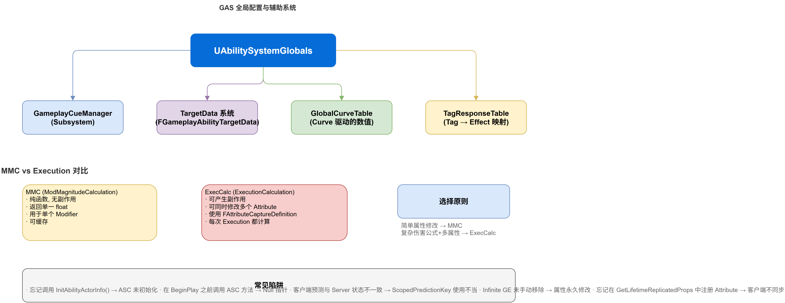

# 深入浅出UE5 GAS：附录 —— FGameplayAbilitySpec 详解

## 系列目录

1. [AbilitySystemComponent —— GAS的心脏](../01-ASC/01-ASC文章.md)
2. [AttributeSet —— 数值系统的基石](../02-AttributeSet/02-AttributeSet文章.md)
3. [GameplayEffect（上）—— 从定义到应用](../03-GameplayEffect/03-GameplayEffect文章-上.md)
4. [GameplayEffect（下）—— Modifier、Stacking与Periodic](../03-GameplayEffect/03-GameplayEffect文章-下.md)
5. [ExecutionCalculation —— 自定义伤害公式](../04-ExecutionCalculation/04-ExecutionCalculation文章.md)
6. [GameplayAbility —— 技能的诞生与消亡](../05-GameplayAbility/05-GameplayAbility文章.md)
7. [AbilityTask —— 异步编程的艺术](../06-AbilityTask/06-AbilityTask文章.md)
8. [TargetData —— 索敌与数据传递](../07-TargetData/07-TargetData文章.md)
9. [GameplayCue —— 技能反馈的表现层](../08-GameplayCue/08-GameplayCue文章.md)
10. [网络同步 —— 复制、预测与回滚](../09-Network/09-Network文章.md)
11. [GE Components —— UE 5.3 模块化新范式](../10-GEComponents/10-GEComponents文章.md)
12. [实战全景 —— 调试、陷阱与工程化模式](../11-Practice/11-Practice文章.md)

> 📎 **（本文）附录 —— FGameplayAbilitySpec 详解**

---

## 写在前面

在之前的文章中，我们在多个地方提到了 `FGameplayAbilitySpec` —— ASC 中存储能力列表的容器。但这个结构体本身值得一篇单独的分析：它是 `UGameplayAbility`（CDO 层）和实际运行的能力实例之间的桥梁，理解它的细节能避免很多常见错误。

**注意**：本系列现已扩展至 12 篇。以下主题已有独立文章：
- GameplayPrediction（网络预测）→ **第 10 篇**
- MMC vs ExecutionCalculation → **第 5 篇**
- AbilitySystemGlobals / GameplayTagResponseTable / 常见陷阱 / Lyra 模式 → **第 12 篇**

---

## 一、FGameplayAbilitySpec 的完整定义

```cpp
USTRUCT(BlueprintType)
struct GAMEPLAYABILITIES_API FGameplayAbilitySpec : public FFastArraySerializerItem
{
    GENERATED_USTRUCT_BODY()

    /** 外部引用用的 Handle（类似智能指针的手柄） */
    UPROPERTY()
    FGameplayAbilitySpecHandle Handle;

    /** 指向 Ability CDO 的引用 */
    UPROPERTY()
    TObjectPtr<UGameplayAbility> Ability;

    /** 能力等级 */
    UPROPERTY()
    int32 Level = 1;

    /** 输入 ID（用于绑定 EnhancedInput 或数字键盘） */
    UPROPERTY()
    int32 InputID = INDEX_NONE;

    /** 来源对象（如授予此能力的武器、装备、Buff GE） */
    UPROPERTY()
    TObjectPtr<UObject> SourceObject;

    /** 当前活跃实例数（InstancedPerExecution 模式下可能 > 1） */
    UPROPERTY()
    uint8 ActiveCount = 0;

    /** 已实例化的 GA 实例数组 */
    UPROPERTY(NotReplicated)
    TArray<TObjectPtr<UGameplayAbility>> AbilityInstances;

    /** 是否在网络复制中标记为待移除（Pending Kill） */
    UPROPERTY()
    uint8 InputPressed : 1;

    /** 上次激活是否为手动取消 */
    UPROPERTY()
    uint8 RemoveAfterActivation : 1;

    /** 此 Spec 是否在网络复制中处于待移除状态 */
    UPROPERTY(NotReplicated)
    uint8 PendingRemove : 1;
};
```

---

## 二、Handle vs. Ability CDO：两层引用的设计

让我们解剖 `FGameplayAbilitySpec` 中的两层引用：

### 2.1 FGameplayAbilitySpecHandle

`Handle` 是一个**整数 ID**（类似 `FActiveGameplayEffectHandle`），本质是对 Spec 数组的索引。它的作用是：

- **外部系统引用**：UI、输入系统、任务系统通过 Handle 告诉 ASC "我想激活/取消能力 X"
- **不依赖指针**：如果 Spec 被移除、数组重排，Handle 仍然有效（通过 `InternalHandles` 维护映射）
- **网络无关**：Handle 不在客户端和服务器之间同步，每个端独立分配

```cpp
// 典型用法
FGameplayAbilitySpecHandle NewHandle = ASC->GiveAbility(
    FGameplayAbilitySpec(MyAbilityClass, 1, INDEX_NONE, this));

// 后续通过 Handle 引用
ASC->TryActivateAbility(NewHandle);
ASC->ClearAbility(NewHandle);
```

### 2.2 TObjectPtr<UGameplayAbility> Ability

指向的是 `UGameplayAbility` 的 **CDO（Class Default Object）**——不是运行时的活跃实例。这意味着：

- 所有相同技能类型共享同一个 CDO
- CDO 持有 `CooldownGE`、`CostGE`、`AbilityTriggers` 等**设计时配置**
- CDO 的 `InstancingPolicy` 决定如何处理运行时实例

### 2.3 AbilityInstances

当能力激活时，根据 `InstancingPolicy` 行为不同：

```
InstancingPolicy = NonInstanced:
  → AbilityInstances 为空，直接操作 CDO

InstancingPolicy = InstancedOnActivation:
  → ActiveCount = 1
  → 创建 1 个实例 → AbilityInstances[0]

InstancingPolicy = InstancedPerExecution:
  → ActiveCount 可以 > 1（允许同一技能多个实例同时运行）
  → 每个激活创建一个实例 → AbilityInstances[ActiveCount-1]
```

**关键限制**：`AbilityInstances` 标记为 `NotReplicated`——能力实例本身不同步到客户端。每个端独立创建本地实例。

---

## 三、Spec 的网络复制

和 `FActiveGameplayEffect` 一样，`FGameplayAbilitySpec` 继承自 `FFastArraySerializerItem`。这意味着 `FGameplayAbilitySpecContainer` 使用 **FastArray 增量复制**：

```
FGameplayAbilitySpecContainer (FFastArraySerializer)
├── 游戏中：TArray<FGameplayAbilitySpec> Items
├── 复制时：
│   ├── Added:   新授予的 Ability Spec
│   ├── Removed: 被移除的 Ability Spec
│   └── Changed: Level / InputID 变化的 Spec
└── 接收端：
    ├── PostReplicatedAdd()     → 新能力到达
    ├── PreReplicatedRemove()   → 能力被移除前
    └── PostReplicatedChange()  → 属性变化
```

**只复制的变化字段**：`Ability`、`Level`、`InputID`、`SourceObject`。`ActiveCount`、`AbilityInstances`、`InputPressed` 等**运行时状态不复制**。

---

## 四、与 GA 激活流程的配合

`FGameplayAbilitySpec` 参与 GA 激活的关键环节：

```
1. 筛选阶段（TryActivateAbility）
   → 遍历 ActivatableAbilities.Items[]
   → 检查 Spec.Level > 0
   → 检查 Spec.Ability->CanActivateAbility()

2. 匹配阶段（匹配 InstancingPolicy）
   → NonInstanced: 直接操作 CDO
   → InstancedOnActivation: 如果 AbilityInstances 为空 → 创建实例
   → InstancedPerExecution: 如果 ActiveCount < MaxAllowed → 创建新实例

3. 激活阶段
   → ActiveCount++ 
   → 调用 GAInstance->ActivateAbility()
   → 如果 RemoveAfterActivation: 激活后移除 Spec

4. 结束阶段（EndAbility）
   → ActiveCount--
   → 如果 InstancedPerExecution: 可能保留实例
   → 如果 InstancedOnActivation: 移除实例
```

---

## 五、常见问题

### Q: "GiveAbility 后后没有效果"
**A**: 检查 `Handle` 是否有效 + 是否调用了 `InitAbilityActorInfo` + `Ability` 的 CDO 是否正常加载。

### Q: "移除能力后还在冷却中"
**A**: Cooldown 通过 CooldownTags 管理，和 Spec 的生命周期独立。需要手动清除 Cooldown。

### Q: "NonInstanced 能力的 ActiveCount 始终为 0"
**A**: 这是正常的——NonInstanced 不使用实例化，`ActiveCount` 只在实例化模式下有意义。

### Q: "AbilityInstances 在客户端上为空"
**A**: 这是预期的——`AbilityInstances` 标记为 `NotReplicated`，客户端在激活时自行创建本地实例。

---

## 五、一个全局视图：AbilitySystemGlobals

`AbilitySystemGlobals` 是 GAS 的全局配置中心，它在引擎初始化时创建，管理诸如 TargetData 的 NetSerialize 方法查找、CurveTable 引用、预测键的生成等子系统级服务。



核心要点：
- `InitGlobalTags()` 初始化所有 GAS 内置的 GameplayTag（如 `Ability.Type.StatusChange.*`）
- `AllocGameplayEffectContext()` 是创建 `FGameplayEffectContext` 的工厂方法，确保所有 Context 都使用正确的子类型
- `GetAbilitySystemGlobals()` 作为全局单例，在任何需要获取 GAS 全局状态的地方直接调用

> **预测系统**的完整分析请见 [第 10 篇：网络同步 —— 复制、预测与回滚](../09-Network/09-Network文章.md)。

---

## 六、总结

- `FGameplayAbilitySpec` 是 GA CDO 和运行时实例之间的**桥梁**，继承 `FFastArraySerializerItem` 支持增量复制
- `Handle` 是整数 ID，用于外部引用；`Ability` 指向 CDO；`AbilityInstances` 持有运行时实例
- `InstancingPolicy` 决定实例化策略：NonInstanced（0 个实例）、InstancedOnActivation（1 个实例）、InstancedPerExecution（N 个实例）
- 运行时状态（ActiveCount、AbilityInstances、InputPressed）不参与网络复制

---

*本系列文章基于 UE 5.8 源码分析。源码路径：`Engine/Plugins/Runtime/GameplayAbilities/Source/GameplayAbilities/`*
