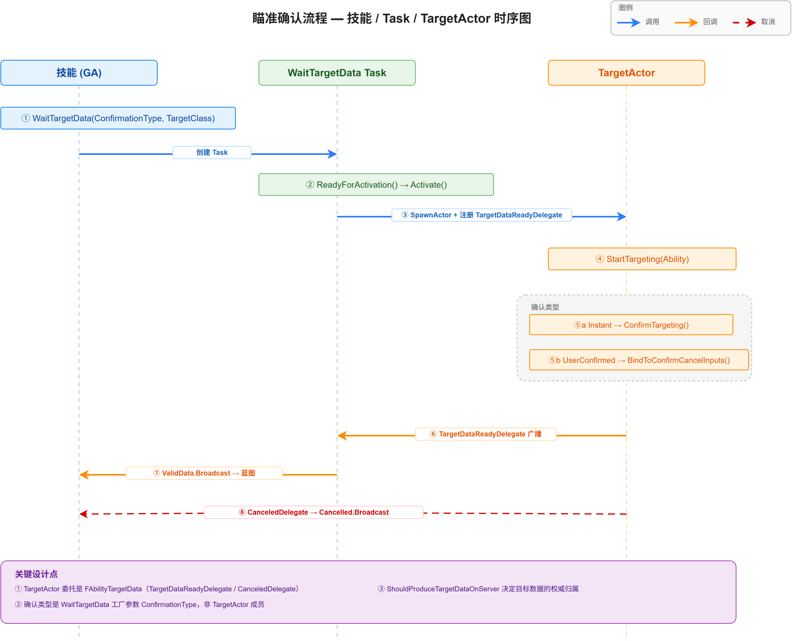
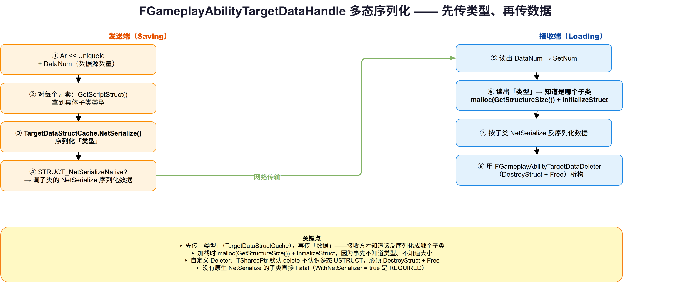

# 13 | Targeting — 瞄准系统

> **本篇**：GAS 的瞄准系统 —— `AGameplayAbilityTargetActor` 的目标确认流程、`FGameplayAbilityTargetData` 的多态序列化与网络传输机制

> **系列**: 《Inside GAS》— UE5 GameplayAbilitySystem 源码深度分析  
> **难度**: 🔴 源码  
> **字数**: ~6200  
> **前置**: 08-GameplayAbility（Task/输入）、12-Network & Serial  
> **源码路径**: `Engine/Plugins/Runtime/GameplayAbilities/Source/GameplayAbilities/Public/Abilities/GameplayAbilityTargetTypes.h`

---

> **系列导航**
> 
> | 阶段 | 篇章 | 内容 | 状态 |
> |------|------|------|------|
> | 🟢 基础 | 01 | GAS 总览与核心架构 | ✅ |
> | | 02 | ASC — 核心调度器 | ✅ |
> | | 03 | GameplayTags — 通用语言 | ✅ |
> | | 04 | AttributeSet — 属性定义与复制 | ✅ |
> | 🔵 核心 | 05 | GameplayEffect — 效果与计算 (上) | ✅ |
> | | 06 | GameplayEffect — 效果与计算 (下) | ✅ |
> | | 07 | GameplayAbility — 技能激活与核心框架 (上) | ✅ |
> | | 08 | GameplayAbility — Task/输入/预测 (下) | ✅ |
> | | 09 | GameplayCue — 表现层触发机制 | ✅ |
> | 🔴 高级 | 10 | Prediction — 预测与回滚 | ✅ |
> | | 11 | GE Components — 组件化架构演进 | ✅ |
> | | 12 | Network & Serial — 网络序列化 | ✅ |
> | | **13** | **Targeting — 瞄准系统** | ✅ |
> | | 14 | Debug & Optimization — 调试与优化 | 📝 |
> | | 15 | 终篇回顾 — 全景复习 | 📝 |

---

## 一、问题驱动：技能"选目标"这件事，怎么既灵活又能跨网络？

第 08 篇讲 `WaitTargetData` 时埋过一个钩子：瞄准系统怎么把"玩家选的目标"变成一个可以跨网络传输的数据结构？本篇展开这个钩子。

一个范围技能需要瞄准，涉及的诉求极其多样：

- **近战挥砍**：碰撞事件产生"命中了谁"；
- **鼠标点击**：准星处的 trace 命中，转成目标；
- **地面 AOE**：地上一个圈，圈里的所有敌人；
- **MMORPG 式指向**：一个目标位置 + 可能命中的目标。

这些场景的**目标形态完全不同**——有的是"一个命中点"，有的是"一串 Actor"，有的是"一个位置"。但所有技能最终都要回答同一个问题：**"目标是谁 / 在哪"，并且这个答案要能安全地传给服务器**。

GAS 的答案分三层：

1. **`AGameplayAbilityTargetActor`**：一个"瞄准助手 Actor"，负责交互式地确定目标（玩家怎么选）；
2. **`FGameplayAbilityTargetData`**：一个**多态**的数据基类，负责表达"目标是什么"（选了谁 / 哪）；
3. **`FGameplayAbilityTargetDataHandle`**：一个带 `NetSerialize` 的句柄，负责"把这个多态数据安全地跨网络传输"。

本篇逐个拆开，重点放在最精彩、也最容易被忽略的第三层——**多态数据如何在网络里序列化**。

---

## 二、概念速览：三个角色的分工

| 角色 | 类型 | 职责 | 类比 |
|------|------|------|------|
| `AGameplayAbilityTargetActor` | `AActor` | 交互式确定目标（玩家怎么选） | 瞄准镜 |
| `FGameplayAbilityTargetData` | `USTRUCT`（多态基类） | 表达目标是什么（选了谁/哪） | 弹着点数据 |
| `FGameplayAbilityTargetDataHandle` | `USTRUCT` | 跨网络传输目标数据 | 装数据的信封 |

理解这个分工的关键，是 `FGameplayAbilityTargetDataHandle` 头部注释（`GameplayAbilityTargetTypes.h:188-200`）里那段直白的自我剖析：

> Handle for Targeting Data. This serves two main purposes:
> - Avoid us having to copy around the full targeting data structure in Blueprints
> - Allows us to leverage polymorphism in the target data structure
> - Allows us to implement NetSerialize and replicate by value between clients/server

它坦诚地列出了**为什么不直接用 UObject 做多态**（第 194-196 行）：

> Avoid using UObjects could be used to give us polymorphism and by reference passing in blueprints. However we would still be screwed when it came to replication.

翻译：UObject 确实能给我们多态和蓝图引用传递，但**一到网络复制就卡住了**。所以 GAS 用一个**带 `NetSerialize` 的 USTRUCT**，同时拿到三样东西：多态、蓝图引用传递、按值网络复制。

---

## 三、目标确认流程：TargetActor 的生命周期

### 3.1 它是什么，以及它的"不完美"

```cpp
// GameplayAbilityTargetActor.h:26
UCLASS(Blueprintable, abstract, notplaceable, MinimalAPI)
class AGameplayAbilityTargetActor : public AActor
```

先看头部注释（第 19-25 行），因为这里有一段**罕见的坦诚自白**：

> TargetActors are spawned to assist with ability targeting... WARNING: These actors are spawned once per ability activation and in their default form are not very efficient. For most games you will need to subclass and heavily modify this actor... This class is not well tested by internal games, but it is a useful class to look at to learn how target replication occurs.

三句话信息量极大：

1. **每次技能激活都 Spawn 一个 TargetActor**——默认形态性能很差（频繁 Spawn Actor 的开销）；
2. **大多数游戏需要重度子类化改造**——默认实现只是"教学范本"；
3. **它连 Epic 自己的游戏都没充分测试**——但它是个学习"目标复制"的好范例。

这份坦诚和前面几篇（Prediction 的"未解决问题"、GE Components 的"诚实代价"）一脉相承。读 GAS 源码的乐趣，就在于这些"连作者都承认不完美"的地方。

### 3.2 核心成员与委托

```cpp
// GameplayAbilityTargetActor.h:69-70
FAbilityTargetData  TargetDataReadyDelegate;  // 目标数据就绪
FAbilityTargetData  CanceledDelegate;          // 瞄准被取消
```

注意：`FAbilityTargetData` 是一个 `DECLARE_MULTICAST_DELEGATE_OneParam`（`GameplayAbilityTargetTypes.h:655`），参数是 `const FGameplayAbilityTargetDataHandle&`。之前第 08 篇纠正过——这不是 `FGameplayAbilityTargetDataHandle` 类型，而是**以 Handle 为参数的委托类型**。

### 3.3 确认流程的五个方法

```cpp
// GameplayAbilityTargetActor.h:45-65
virtual void StartTargeting(UGameplayAbility* Ability);     // 开始瞄准
virtual bool IsConfirmTargetingAllowed();                    // 是否允许确认
virtual void ConfirmTargetingAndContinue();                  // 确认并继续（不销毁）
virtual void ConfirmTargeting();                             // 确认（拿到数据）
virtual void CancelTargeting();                              // 取消
virtual void BindToConfirmCancelInputs();                    // 绑定确认/取消输入
```

以及一个关键的网络配置字段：

```cpp
// GameplayAbilityTargetActor.h:36-37
/** The TargetData this class produces can be entirely generated on the server.
    We don't require the client to send us full or partial TargetData (possibly just a 'confirm') */
UPROPERTY(EditAnywhere, Category=Advanced)
bool ShouldProduceTargetDataOnServer;
```

`ShouldProduceTargetDataOnServer` 决定了目标数据的**权威归属**：

- 为 `true`：服务器自己生成目标数据，客户端只需要发一个"确认"信号；
- 为 `false`：客户端瞄准后，把完整目标数据发给服务器。

### 3.4 确认类型：EGameplayTargetingConfirmation

```cpp
// GameplayAbilityTargetTypes.h:25-43
UENUM(BlueprintType)
namespace EGameplayTargetingConfirmation
{
    enum Type : int
    {
        Instant,        // 立即瞄准，无需用户输入决定何时"开火"
        UserConfirmed,  // 用户确认后才瞄准
        Custom,         // 由 GameplayTargeting 能力决定（非所有 TargetActor 支持）
        CustomMulti,    // 同上，但产生数据后不销毁
    };
}
```

这和 §3.3 的 `ConfirmTargeting` / `BindToConfirmCancelInputs` 呼应：`Instant` 直接 `ConfirmTargeting`，`UserConfirmed` 则先 `BindToConfirmCancelInputs` 绑定输入，等玩家按确认键。



*图：瞄准确认流程时序 —— 技能调用 WaitTargetData → Task 激活 → Spawn TargetActor + 注册 TargetDataReadyDelegate → StartTargeting；`alt` 分支区分 Instant（直接 ConfirmTargeting）与 UserConfirmed（绑定确认/取消输入）；数据就绪经 TargetDataReadyDelegate → ValidData.Broadcast 回到蓝图，取消走 CanceledDelegate*

---

## 四、FGameplayAbilityTargetData：多态数据基类

### 4.1 基类的接口设计

```cpp
// GameplayAbilityTargetTypes.h:79-169
USTRUCT()
struct FGameplayAbilityTargetData
{
    virtual TArray<TWeakObjectPtr<AActor>> GetActors() const { return {}; }  // 命中的 Actor
    virtual bool SetActors(TArray<TWeakObjectPtr<AActor>> NewActorArray) { return false; }
    virtual bool HasHitResult() const { return false; }                      // 是否有命中
    virtual const FHitResult* GetHitResult() const { return nullptr; }
    virtual bool HasOrigin() const { return false; }                         // 是否有原点
    virtual FTransform GetOrigin() const { return FTransform::Identity; }
    virtual bool HasEndPoint() const { return false; }                       // 是否有终点
    virtual FVector GetEndPoint() const { return FVector::ZeroVector; }
    virtual FTransform GetEndPointTransform() const { return FTransform(GetEndPoint()); }

    virtual UScriptStruct* GetScriptStruct() const                           // 序列化关键！
    {
        return FGameplayAbilityTargetData::StaticStruct();
    }
};
```

这套接口覆盖了"目标数据"的所有可能形态：**有 Actor（`GetActors`）、有命中（`GetHitResult`）、有原点（`GetOrigin`）、有终点（`GetEndPoint`）**。子类按需 override。

### 4.2 GetScriptStruct：多态序列化的钥匙

最关键的是一行注释（`GameplayAbilityTargetTypes.h:150`）：

> Returns the serialization data, must always be overridden

`GetScriptStruct()` 是**多态序列化的核心**——它告诉序列化器"我这个具体子类是什么类型"。基类默认返回 `StaticStruct()`（即基类自己），而**每个子类必须 override** 返回自己的 `StaticStruct()`。

这个设计的意义，等 §六 讲 `NetSerialize` 时会完全显现——**没有它，接收方就不知道收到的这堆字节该反序列化成哪个具体子类**。

### 4.3 四个具体子类

| 子类 | 用途 | 关键 override |
|------|------|--------------|
| `FGameplayAbilityTargetData_LocationInfo` | 源位置 + 目标位置 | `HasOrigin`/`GetEndPoint` |
| `FGameplayAbilityTargetData_ActorArray` | 源位置 + 一串目标 Actor（AOE） | `GetActors`/`SetActors` |
| `FGameplayAbilityTargetData_SingleTargetHit` | 单个命中结果 | `GetHitResult`/`HasHitResult` |
| `FGameplayAbilityTargetData_SourceLocation` | 只有源位置 | `HasOrigin` |

每个子类都 override 了 `GetScriptStruct()`，返回各自的 `StaticStruct()`。

---

## 五、FGameplayAbilityTargetingLocationInfo：定位信息的三种形态

目标数据里反复出现的 `FGameplayAbilityTargetingLocationInfo`（`GameplayAbilityTargetTypes.h:314-377`），是"瞄准起点"的抽象。它支持三种定位方式：

```cpp
// GameplayAbilityTargetTypes.h:171-186
namespace EGameplayAbilityTargetingLocationType
{
    enum Type : int
    {
        LiteralTransform,   // 直接给一个 Transform（兜底方案）
        ActorTransform,     // 从 Actor 取 Transform
        SocketTransform,    // 从骨骼网格的命名 Socket 取 Transform
    };
}
```

对应的字段：

- `SourceActor`（Actor 定位用）；
- `SourceComponent` + `SourceSocketName`（Socket 定位用）；
- `LiteralTransform`（字面 Transform 用）。

`GetTargetingTransform()`（`GameplayAbilityTargetTypes.cpp:95-122`）用一个 `switch` 根据 `LocationType` 计算最终 Transform。它的 `NetSerialize`（第 292-315 行）也很讲究——**只序列化当前 `LocationType` 需要的字段**：

```cpp
bool FGameplayAbilityTargetingLocationInfo::NetSerialize(FArchive& Ar, ...)
{
    Ar << LocationType;
    switch (LocationType)
    {
    case ActorTransform:    Ar << SourceActor; break;
    case SocketTransform:   Ar << SourceComponent; Ar << SourceSocketName; break;
    case LiteralTransform:  Ar << LiteralTransform; break;
    }
}
```

这是"**按需序列化**"——Actor 定位就不传 `LiteralTransform` 那些用不到的字段，省带宽。和第 12 篇讲的量化向量一样，都是"能省一点是一点"的网络优化。

---

## 六、多态序列化：NetSerialize 的真相

这是本篇最精彩的部分。`FGameplayAbilityTargetDataHandle::NetSerialize`（`GameplayAbilityTargetTypes.cpp:195-291`）展示了"多态数据 + 网络"这个难题的完整解法。

### 6.1 头与数据数

```cpp
bool FGameplayAbilityTargetDataHandle::NetSerialize(FArchive& Ar, class UPackageMap* Map, bool& bOutSuccess)
{
    Ar << UniqueId;          // 句柄唯一 ID

    uint8 DataNum;
    if (Ar.IsSaving())
    {
        DataNum = FMath::Min<int32>(Data.Num(), MAX_uint8);   // 目标数据源数量
    }
    Ar << DataNum;
    if (Ar.IsLoading())
    {
        Data.SetNum(DataNum);
    }
    // ...
}
```

### 6.2 逐个元素：GetScriptStruct 驱动的多态

核心循环（第 215-273 行）：

```cpp
for (int32 i = 0; i < DataNum && !Ar.IsError(); ++i)
{
    TCheckedObjPtr<UScriptStruct> ScriptStruct = Data[i].IsValid() ? Data[i]->GetScriptStruct() : NULL;

    // 序列化"这是什么类型"——通过 TargetDataStructCache 缓存
    UAbilitySystemGlobals::Get().TargetDataStructCache.NetSerialize(Ar, ScriptStruct.Get());

    if (ScriptStruct.IsValid())
    {
        if (Ar.IsLoading())
        {
            // 加载时：按 ScriptStruct 大小 malloc + InitializeStruct
            FGameplayAbilityTargetData* NewData = (FGameplayAbilityTargetData*)FMemory::Malloc(ScriptStruct->GetStructureSize());
            ScriptStruct->InitializeStruct(NewData);
            Data[i] = TSharedPtr<FGameplayAbilityTargetData>(NewData, FGameplayAbilityTargetDataDeleter());
        }

        if (ScriptStruct->StructFlags & STRUCT_NetSerializeNative)
        {
            // 有原生 NetSerialize → 调它
            ScriptStruct->GetCppStructOps()->NetSerialize(Ar, Map, bOutSuccess, Data[i].Get());
        }
        else
        {
            // 没有 → 直接 fatal（TargetData 必须有原生 NetSerialize）
            ABILITY_LOG(Fatal, TEXT("...without a native NetSerialize"));
        }
    }
}
```

**这段代码揭示了四个关键设计**：

1. **先序列化"类型"，再序列化"数据"**：`TargetDataStructCache.NetSerialize` 先告诉接收方"下一个元素是 `_ActorArray` 还是 `_SingleTargetHit`"，然后才能正确地按对应类型反序列化。

2. **加载时动态分配**：`FMemory::Malloc(ScriptStruct->GetStructureSize())` + `InitializeStruct`——接收方**事先不知道**要分配多大内存，只有读到 ScriptStruct 才知道。

3. **自定义 Deleter**：`FGameplayAbilityTargetDataDeleter`（第 186-193 行）用 `GetScriptStruct()->DestroyStruct(Object)` + `FMemory::Free(Object)` 正确析构——因为 `TSharedPtr` 的默认 delete 不知道这是多态的 USTRUCT。

4. **必须原生 NetSerialize**：如果子类没有 `STRUCT_NetSerializeNative` 标志，直接 `ABILITY_LOG(Fatal)`——这正是头文件里 `TStructOpsTypeTraits` 的 `WithNetSerializer = true` 注释 "REQUIRED" 的含义。



*图：FGameplayAbilityTargetDataHandle 多态序列化 —— 发送端：UniqueId → GetScriptStruct 拿类型 → TargetDataStructCache 序列化类型 → 调子类 NetSerialize 序列化数据；接收端：读出类型 → malloc(GetStructureSize()) + InitializeStruct → 按子类反序列化 → 自定义 Deleter（DestroyStruct + Free）析构*

### 6.3 那个"未经验证"的安全开关

第 180-183 行有个值得玩味的宏：

```cpp
// If defined, we'll serialize target data in a safer way (untested/unproven still: goal should be to remove old code asap)
#ifndef TARGETDATAHANDLE_SAFE_NET_SERIALIZE
#define TARGETDATAHANDLE_SAFE_NET_SERIALIZE 1
#endif
```

注释直白到让人发笑：这个"更安全的方式"**还没测试、还没验证**，目标是尽快删掉旧代码。这是 GAS 源码里又一处"作者自己都不完全放心"的坦诚标注。

---

## 七、设计思考：三个层次的权衡

### 7.1 为什么不用 UObject 做多态？

§二 引用了头注释的原话——"用 UObject 能做多态和蓝图引用，但一到复制就卡住"。这里值得展开"卡在哪"：

- UObject 的复制走的是 **Actor Channel / 对象引用**（`UPackageMap::SerializeObject`），不是"按值序列化"；
- 目标数据这种"一次性、高频、小体积"的数据，走对象引用复制是**杀鸡用牛刀**——还得维护对象生命周期、处理引用未映射的脏状态（第 12 篇讲过 `SerializeObject` 返回 false 的"dirty"机制）；
- 而一个带 `NetSerialize` 的 USTRUCT 可以**按值、内联、无对象生命周期**地传输。

所以选择 USTRUCT + `NetSerialize`，是为了**规避对象复制的重机制**，用最小的开销解决"多态数据跨网络"这个具体问题。

### 7.2 多态序列化的代价：类型表 + 手动内存管理

但"多态 + 按值"不是免费的。§六 揭示的代价有两处：

1. **需要 `TargetDataStructCache` 维护类型表**——每个 ScriptStruct 都要能映射到一个稳定的 ID，才能在网络上用紧凑的 ID 代替"类型名字符串"；
2. **需要手动 `malloc`/`InitializeStruct`/自定义 Deleter**——接收方无法用 `new`（不知道具体类型），只能按 `GetStructureSize()` 裸分配 + 反射初始化。

这些代价，是"多态数据跨网络"这个需求本身的复杂度决定的——**要么接受对象的复制重机制，要么接受手动内存管理的精细活**。GAS 选了后者，因为它更贴合"目标数据"高频、短命、小体积的特点。

### 7.3 TargetActor 的"教学范本"定位

回到 §三 那段坦诚自白。为什么 TargetActor 这么"简陋"却还留在引擎里？

因为它的价值**不在生产可用性，而在示范"目标复制是怎么做的"**。头注释明说"a useful class to look at to learn how target replication occurs"——它是一份**可运行的教程**，展示了从"玩家交互选目标"到"多态数据网络传输"的完整链路。

这和第 09 篇 GameplayCue 的"表现层可整体替换"、第 11 篇 GE Components 的"组件化可扩展"形成对照：**GAS 的不同子系统，成熟度是不均等的**。有的（GE、属性）是久经考验的生产级；有的（TargetActor）是"给你看原理、自己改"的教学级。读源码时认清这种差异，才不会把"引擎自带"误当成"引擎推荐"。

---

## 八、总结

本篇拆解了 GAS 的瞄准系统：

| 主题 | 关键点 |
|------|--------|
| **三层分工** | TargetActor（怎么选）/ TargetData（选了谁）/ Handle（怎么传） |
| **确认流程** | `StartTargeting` → `ConfirmTargeting`/`CancelTargeting`/`BindToConfirmCancelInputs` |
| **确认类型** | `Instant`/`UserConfirmed`/`Custom`/`CustomMulti`（`UENUM + namespace + enum Type : int`） |
| **多态数据** | `FGameplayAbilityTargetData` 基类 + 四个子类，`GetScriptStruct()` 是序列化钥匙 |
| **定位信息** | `FGameplayAbilityTargetingLocationInfo` 三种形态，`NetSerialize` 按需序列化 |
| **多态序列化** | 先传类型（`TargetDataStructCache`）再传数据，加载时 `malloc`+`InitializeStruct`+自定义 Deleter |
| **诚实标注** | TargetActor"不高效/未充分测试"、`TARGETDATAHANDLE_SAFE_NET_SERIALIZE`"未验证" |

下一篇进入调试与优化——GAS 提供的调试工具、性能剖析手段，以及 `AbilitySystemGlobals` 的全局配置如何影响运行时行为。

**上一篇**：[12 | Network & Serial — 网络序列化](../12-Network-Serial/12-Network-Serial文章.md)

**下一篇**：[14 | Debug & Optimization — 调试与优化](../14-Debug-Optimization/14-Debug-Optimization文章.md) —— 拆解 `GameplayDebugger` 的 GAS 集成、`ShowDebug` 命令与性能剖析手段。

---

*本文基于 UE 5.8 源码分析。系列文章会继续按模块拆解，从基础到高级，从 API 到设计哲学。*
